# AI Agents Roadmap — Universal Template

> **A comprehensive template system for generating AI Agents roadmap content across all skill levels.**

---

## Overview

| | Description |
|---|---|
| **Purpose** | Universal template for all AI Agents roadmap topics |
| **Files per topic** | 8 files: `junior.md`, `middle.md`, `senior.md`, `professional.md`, `interview.md`, `tasks.md`, `find-bug.md`, `optimize.md` |
| **Language** | All content must be generated in **English** |
| **Table of Contents** | **Optional** — include only if relevant to the topic. For theory/practice files (`tasks.md`, `find-bug.md`, `optimize.md`) it is NOT required |

### Topic Structure

```
XX-topic-name/
├── junior.md          ← "What?" and "How?"
├── middle.md          ← "Why?" and "When?"
├── senior.md          ← "How to optimize?" and "How to architect?"
├── professional.md    ← "Under the Hood" — agent loop, tool protocols, context management
├── interview.md       ← Interview prep across all levels
├── tasks.md           ← Hands-on practice tasks
├── find-bug.md        ← Find and fix bugs in agent code (10+ exercises)
└── optimize.md        ← Optimize slow/inefficient agent pipelines (10+ exercises)
```

---

## Level Comparison Matrix

| Aspect | Junior | Middle | Senior | Professional |
|:------:|:------:|:------:|:------:|:------------:|
| **Depth** | Basic agent concepts, simple examples | Practical usage, real-world cases | Architecture, optimization | Agent loop internals, tool protocols, context window management |
| **Code** | Hello-agent level | Production-ready examples | Advanced patterns, benchmarks | Source code analysis, token traces |
| **Tricky Points** | Tool call syntax errors | Multi-step reasoning pitfalls | Orchestration edge cases | Streaming internals, context truncation behavior |
| **Focus** | "What?" and "How?" | "Why?" and "When?" | "How to improve?" | "What happens under the hood?" |

---
---

# TEMPLATE 1 — `junior.md`

<details open>
<summary><strong>Template Content</strong></summary>

# {{TOPIC_NAME}} — Junior Level

## Table of Contents

1. [Introduction](#introduction)
2. [Prerequisites](#prerequisites)
3. [Glossary](#glossary)
4. [Core Concepts](#core-concepts)
5. [Pros & Cons](#pros--cons)
6. [Use Cases](#use-cases)
7. [Code Examples](#code-examples)
8. [Coding Patterns](#coding-patterns)
9. [Clean Code](#clean-code)
10. [Product Use / Feature](#product-use--feature)
11. [Data Quality and Model Failure Handling](#data-quality-and-model-failure-handling)
12. [Security Considerations](#security-considerations)
13. [Performance Tips](#performance-tips)
14. [Metrics & Analytics](#metrics--analytics)
15. [Best Practices](#best-practices)
16. [Edge Cases & Pitfalls](#edge-cases--pitfalls)
17. [Common Mistakes](#common-mistakes)
18. [Tricky Points](#tricky-points)
19. [Test](#test)
20. [Tricky Questions](#tricky-questions)
21. [Cheat Sheet](#cheat-sheet)
22. [Summary](#summary)
23. [What You Can Build](#what-you-can-build)
24. [Further Reading](#further-reading)
25. [Related Topics](#related-topics)
26. [Diagrams & Visual Aids](#diagrams--visual-aids)

---

## Introduction

> Focus: "What is it?" and "How to use it?"

Brief explanation of what {{TOPIC_NAME}} is and why a beginner needs to know it.
Keep it simple — assume the reader has basic Python knowledge but is new to AI agents.

---

## Prerequisites

What you should know before studying this topic:

- **Required:** {{concept 1}} — brief explanation of why
- **Required:** {{concept 2}} — brief explanation of why
- **Helpful but not required:** {{concept 3}}

> List 2-4 prerequisites. Link to related roadmap topics if available.

---

## Glossary

Key terms used in this topic:

| Term | Definition |
|------|-----------|
| **Agent** | An AI system that perceives its environment and takes actions to achieve goals |
| **Tool** | A function or API the agent can call to interact with the external world |
| **ReAct** | Reason + Act — a pattern where the agent reasons before each action |
| **{{Term 4}}** | Simple, one-sentence definition |
| **{{Term 5}}** | Simple, one-sentence definition |

> 5-10 terms. Keep definitions beginner-friendly.

---

## Core Concepts

### Concept 1: {{name}}

Simple explanation with analogy if helpful.

### Concept 2: {{name}}

...

> **Rules:**
> - Each concept should be explained in 3-5 sentences max.
> - Use bullet points for lists.
> - Include small code snippets inline where needed.

---

## Real-World Analogies

Everyday analogies to help you understand {{TOPIC_NAME}} intuitively:

| Concept | Analogy |
|---------|--------|
| **Agent Loop** | Like a personal assistant who reads your request, decides what tools to use, takes action, and reports back |
| **Tool Call** | Like calling a specific department in a company — each has a specific job |
| **{{Concept 3}}** | {{Analogy}} |

> 2-4 analogies. Use everyday objects and situations.

---

## Mental Models

How to picture {{TOPIC_NAME}} in your head:

**The intuition:** {{A simple mental model — e.g., "Think of an agent as an LLM with a task list and a toolbox."}}

**Why this model helps:** {{Why visualizing it this way prevents common mistakes}}

---

## Pros & Cons

| Pros | Cons |
|------|------|
| {{Advantage 1}} | {{Disadvantage 1}} |
| {{Advantage 2}} | {{Disadvantage 2}} |
| {{Advantage 3}} | {{Disadvantage 3}} |

### When to use:
- {{Scenario where this approach shines}}

### When NOT to use:
- {{Scenario where another approach is better}}

---

## Use Cases

When and where you would use this in real projects:

- **Use Case 1:** Description — e.g., "Building a research assistant that searches the web"
- **Use Case 2:** Description
- **Use Case 3:** Description

---

## Code Examples

### Example 1: {{title}}

```python
# Full working example with comments
from anthropic import Anthropic

client = Anthropic()

# Define a simple tool
tools = [
    {
        "name": "get_weather",
        "description": "Get current weather for a location",
        "input_schema": {
            "type": "object",
            "properties": {
                "location": {"type": "string", "description": "City name"}
            },
            "required": ["location"]
        }
    }
]

response = client.messages.create(
    model="claude-opus-4-5",
    max_tokens=1024,
    tools=tools,
    messages=[{"role": "user", "content": "What's the weather in Paris?"}]
)
print(response.content)
```

**What it does:** Brief explanation of what happens.
**How to run:** `python agent.py`

### Example 2: {{title}}

```python
# Another practical example — tool schema in JSON
```

```json
{
  "name": "search_database",
  "description": "Search the product database",
  "input_schema": {
    "type": "object",
    "properties": {
      "query": {"type": "string"},
      "limit": {"type": "integer", "default": 10}
    },
    "required": ["query"]
  }
}
```

> **Rules:**
> - Every example must be runnable.
> - Add comments explaining each important line.

---

## Coding Patterns

Common patterns beginners encounter when working with {{TOPIC_NAME}}:

### Pattern 1: Single Tool Call

**Intent:** Allow an agent to use one tool to answer a question.
**When to use:** Simple tasks requiring one external data lookup.

```python
def run_single_tool_agent(user_message: str) -> str:
    response = client.messages.create(
        model="claude-opus-4-5",
        max_tokens=512,
        tools=[weather_tool],
        messages=[{"role": "user", "content": user_message}]
    )
    # Check if tool was called
    for block in response.content:
        if block.type == "tool_use":
            result = call_tool(block.name, block.input)
            return result
    return response.content[0].text
```

**Diagram:**

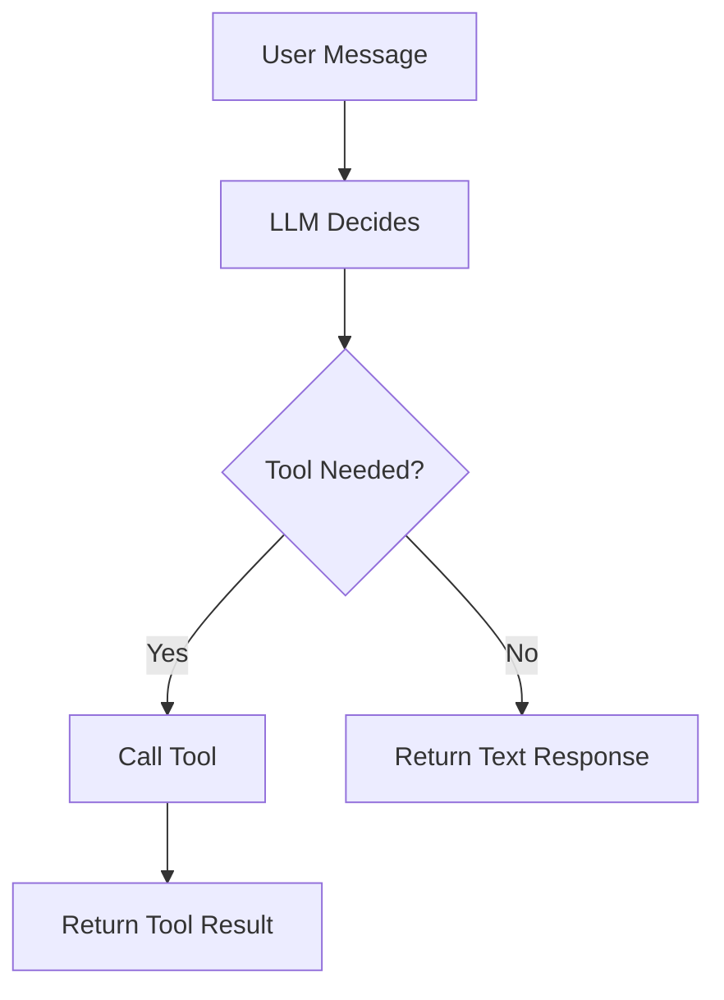

**Remember:** Always check whether a tool was called before assuming the agent answered directly.

---

### Pattern 2: Basic Agent Loop

**Intent:** Run the agent until it has a final answer (no more tool calls needed).

```python
def basic_agent_loop(messages: list) -> str:
    while True:
        response = client.messages.create(
            model="claude-opus-4-5",
            max_tokens=1024,
            tools=tools,
            messages=messages
        )
        if response.stop_reason == "end_turn":
            return response.content[0].text
        # Handle tool calls and append results
        messages = append_tool_results(messages, response)
```

**Diagram:**

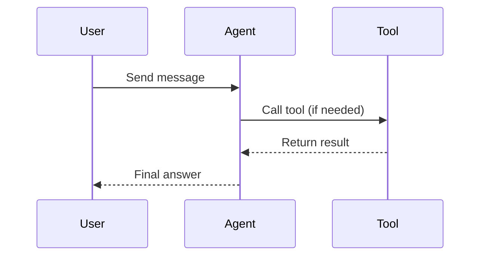

> Include 2 patterns at junior level. Keep diagrams simple.

---

## Clean Code

Basic clean code principles when working with {{TOPIC_NAME}}:

### Naming

```python
# Bad naming
def proc(m, t):
    return call(m, t)

# Clean naming
def run_agent_with_tools(user_message: str, available_tools: list) -> str:
    return execute_agent_loop(user_message, available_tools)
```

**Rules:**
- Variables: describe WHAT they hold (`tool_result`, not `r`, `x`, `tmp`)
- Functions: describe WHAT they do (`call_weather_tool`, not `do_stuff`)
- Booleans: use `is`, `has`, `can` prefix (`is_tool_call`, `has_result`)

---

### Reproducibility

```python
# Bad — no seed, no logging, non-deterministic
response = client.messages.create(model="claude-opus-4-5", messages=messages)

# Clean — logged, temperature set for reproducibility
import logging
logging.info("Agent call: messages=%d", len(messages))
response = client.messages.create(
    model="claude-opus-4-5",
    max_tokens=1024,
    temperature=0,  # deterministic for testing
    messages=messages
)
```

**Rule:** Always log agent calls and set temperature=0 for repeatable results in tests.

---

### Comments

```python
# Bad — states the obvious
# call the API
response = client.messages.create(...)

# Good — explains WHY
# temperature=0 ensures deterministic tool selection in production
response = client.messages.create(..., temperature=0)
```

---

## Product Use / Feature

How this topic is used in real-world products and tools:

### 1. Claude.ai

- **How it uses {{TOPIC_NAME}}:** Claude uses agent loops to browse the web, run code, and call APIs
- **Why it matters:** Enables complex multi-step tasks beyond a single LLM response

### 2. LangChain Agents

- **How it uses {{TOPIC_NAME}}:** Provides an abstraction layer for building tool-using agents
- **Why it matters:** Speeds up agent development with pre-built tool integrations

### 3. AutoGPT

- **How it uses {{TOPIC_NAME}}:** Autonomous agent that creates sub-tasks and executes them
- **Why it matters:** Demonstrates long-horizon planning with agents

---

## Data Quality and Model Failure Handling

How to handle errors when working with {{TOPIC_NAME}}:

### Error 1: Tool Call Fails

```python
# Code that produces this error — tool returns an exception
def call_tool(name: str, inputs: dict) -> str:
    if name == "get_weather":
        raise ConnectionError("Weather API unavailable")
```

**Why it happens:** External APIs can be unreliable.
**How to fix:**

```python
def call_tool_safe(name: str, inputs: dict) -> str:
    try:
        return call_tool(name, inputs)
    except Exception as e:
        return f"Tool error: {str(e)}"
```

### Error 2: Agent Loops Forever

```python
# Bad — no max iteration guard
while response.stop_reason != "end_turn":
    response = call_agent(messages)

# Fixed — add iteration limit
for _ in range(10):
    response = call_agent(messages)
    if response.stop_reason == "end_turn":
        break
```

### Data Quality Pattern

```python
# Always validate tool inputs before calling
def validated_tool_call(tool_name: str, inputs: dict) -> str:
    if not inputs.get("location"):
        return "Error: location is required"
    return call_tool(tool_name, inputs)
```

---

## Security Considerations

Security aspects to keep in mind when using {{TOPIC_NAME}}:

### 1. Prompt Injection via Tool Results

```python
# Insecure — tool result injected directly into agent context
tool_output = external_api_call()
messages.append({"role": "user", "content": tool_output})

# Secure — sanitize and label tool outputs
messages.append({
    "role": "tool",
    "content": sanitize_output(tool_output)
})
```

**Risk:** Malicious tool output can hijack agent behavior.
**Mitigation:** Use structured tool result format; never inject raw user data as system instructions.

### 2. Unrestricted Tool Access

```python
# Insecure — agent can call any system command
tools = [{"name": "run_shell", "description": "Run any shell command"}]

# Secure — restrict to safe, scoped tools only
tools = [{"name": "search_docs", "description": "Search internal documentation only"}]
```

---

## Performance Tips

Basic performance considerations for {{TOPIC_NAME}}:

### Tip 1: Limit Tool Count

```python
# Slow — agent considers 50 tools on every call
tools = all_50_tools

# Faster — provide only relevant tools per task
tools = select_relevant_tools(user_intent)
```

**Why it's faster:** Fewer tools means shorter prompts and faster decision-making.

### Tip 2: Cache Tool Results

```python
from functools import lru_cache

@lru_cache(maxsize=128)
def get_weather_cached(location: str) -> str:
    return weather_api.get(location)
```

---

## Metrics & Analytics

Key metrics to track when using {{TOPIC_NAME}}:

### What to Measure

| Metric | Why it matters | Tool |
|--------|---------------|------|
| **Tool call success rate** | Indicates reliability of agent actions | Logging + counters |
| **Agent loop iterations** | Detects infinite loops or runaway agents | Prometheus counter |
| **Token cost per task** | Controls API costs | Anthropic usage API |

### Basic Instrumentation

```python
import time

start = time.time()
response = run_agent(messages)
latency_ms = (time.time() - start) * 1000
print(f"Agent latency: {latency_ms:.1f}ms | Iterations: {iteration_count}")
```

---

## Best Practices

- **Always set a max iteration limit** — prevents runaway agent loops
- **Log every tool call with inputs and outputs** — essential for debugging
- **Use structured tool schemas** — well-defined schemas reduce model errors

---

## Edge Cases & Pitfalls

### Pitfall 1: Agent Calls Wrong Tool

```python
# Agent confuses similar tools — tool descriptions are too similar
tools = [
    {"name": "search_web", "description": "Search for information"},
    {"name": "search_docs", "description": "Search for information"},
]
```

**What happens:** Agent picks the wrong tool and returns wrong results.
**How to fix:** Write distinct, precise tool descriptions.

### Pitfall 2: Tool Result Not Fed Back

```python
# Bug — tool result never added to messages
response = client.messages.create(tools=tools, messages=messages)
# Missing: append tool result back to messages!
```

---

## Common Mistakes

### Mistake 1: No tool result in conversation

```python
# Wrong way — agent never sees the tool result
response = client.messages.create(tools=tools, messages=messages)
# ... tool is called but result is ignored

# Correct way — append tool result and continue loop
messages.append({"role": "assistant", "content": response.content})
messages.append({"role": "user", "content": [tool_result_block]})
```

### Mistake 2: Hardcoded model name

```python
# Bad
MODEL = "claude-3-opus-20240229"

# Better
MODEL = os.getenv("ANTHROPIC_MODEL", "claude-opus-4-5")
```

---

## Common Misconceptions

### Misconception 1: "Agents always make the right tool choice"

**Reality:** LLMs can choose incorrect tools or hallucinate tool inputs. Always validate.

### Misconception 2: "More tools = smarter agent"

**Reality:** Too many tools confuse the model. Curate a minimal, relevant toolset per task.

---

## Tricky Points

### Tricky Point 1: stop_reason vs tool_use

```python
# This looks like the agent is done — but it might have called a tool
if response.stop_reason == "end_turn":
    print("Done")
# Must also check response.content for tool_use blocks!
```

**Why it's tricky:** `stop_reason` alone doesn't tell you if tools were used.
**Key takeaway:** Always inspect `response.content` for `tool_use` blocks.

---

## Test

### Multiple Choice

**1. What does `stop_reason = "tool_use"` mean?**

- A) The agent has finished answering
- B) The agent wants to call a tool
- C) An error occurred
- D) The context limit was reached

<details>
<summary>Answer</summary>
**B)** — When `stop_reason` is `"tool_use"`, the model has decided to call one or more tools before continuing.
</details>

**2. What is a "tool schema"?**

- A) The agent's system prompt
- B) A JSON description of a tool's name, purpose, and required parameters
- C) The output of a tool call
- D) A Python class

<details>
<summary>Answer</summary>
**B)** — The tool schema is a structured JSON definition that tells the LLM what the tool does and what inputs it expects.
</details>

### True or False

**3. An agent always finishes in one LLM call.**

<details>
<summary>Answer</summary>
**False** — Most agents require multiple LLM calls (the agent loop) to complete multi-step tasks.
</details>

### What's the Output?

**4. What does this agent do?**

```python
response = client.messages.create(
    model="claude-opus-4-5",
    tools=[search_tool],
    messages=[{"role": "user", "content": "Find info about black holes"}]
)
print(response.stop_reason)
```

<details>
<summary>Answer</summary>
Output: likely `"tool_use"` — the agent decides to call `search_tool` before answering.
</details>

---

## "What If?" Scenarios

**What if the tool returns an error?**
- **You might think:** The agent will crash
- **But actually:** The agent receives the error as a tool result and typically explains the failure to the user

**What if you provide no tools?**
- **You might think:** The agent can still take actions
- **But actually:** Without tools, the model just generates text responses — no external actions possible

---

## Tricky Questions

**1. What happens if you never append tool results back to the message history?**

- A) The agent will use a default response
- B) The next LLM call won't know the tool was called
- C) The tool runs again automatically
- D) The API raises an error

<details>
<summary>Answer</summary>
**B)** — Without appending tool results, the model's next call has no context about what the tool returned.
</details>

---

## Cheat Sheet

| What | Syntax / Command | Example |
|------|-----------------|---------|
| Create agent call | `client.messages.create(tools=tools, ...)` | See Example 1 |
| Check tool called | `response.stop_reason == "tool_use"` | `if resp.stop_reason == "tool_use"` |
| Get tool name | `block.name` | `"get_weather"` |
| Get tool inputs | `block.input` | `{"location": "Paris"}` |
| Tool result block | `{"type": "tool_result", "tool_use_id": ..., "content": ...}` | Feed back to messages |

---

## Self-Assessment Checklist

### I can explain:
- [ ] What an AI agent is and why it exists
- [ ] What a tool schema is and how to write one
- [ ] The agent loop in my own words
- [ ] Why tool result feedback is required

### I can do:
- [ ] Write a basic tool schema in JSON
- [ ] Make a single-turn agent call with a tool
- [ ] Implement a basic agent loop with a max iteration guard
- [ ] Debug a broken tool call

### I can answer:
- [ ] All multiple choice questions in this document
- [ ] "What's the output?" questions correctly

---

## Summary

- AI agents combine LLMs with tools to take actions in the world
- The agent loop: LLM calls → tool call → result fed back → repeat until done
- Always validate tool inputs and cap iteration counts

**Next step:** Learn multi-agent orchestration and agent memory at the middle level.

---

## What You Can Build

### Projects you can create:
- **Weather Bot:** A chatbot that fetches real weather using a tool
- **Document Q&A Agent:** Agent that searches a knowledge base and answers questions
- **Code Executor Agent:** Agent that writes and runs Python code to solve problems

### Technologies / tools that use this:
- **LangChain** — framework for building agents and tool chains
- **Claude API** — direct tool use with Anthropic's models
- **OpenAI Function Calling** — equivalent pattern on OpenAI models

### Learning path — what to study next:

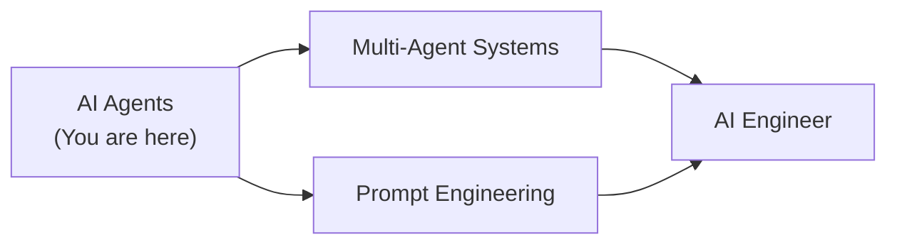

---

## Further Reading

- **Official docs:** [Anthropic Tool Use Guide](https://docs.anthropic.com/en/docs/tool-use)
- **Blog post:** [Building Effective Agents — Anthropic](https://www.anthropic.com/research/building-effective-agents)
- **Video:** LangChain Agent tutorials — covers ReAct pattern
- **Book chapter:** "Designing LLM Applications", Chapter 4 — Agent Architectures

---

## Related Topics

- **[Prompt Engineering](../prompt-engineering/)** — foundations for writing good agent instructions
- **[AI Engineer](../ai-engineer/)** — deploying agents in production
- **[Claude Code](../claude-code/)** — coding agent powered by Claude

---

## Diagrams & Visual Aids

### Mind Map

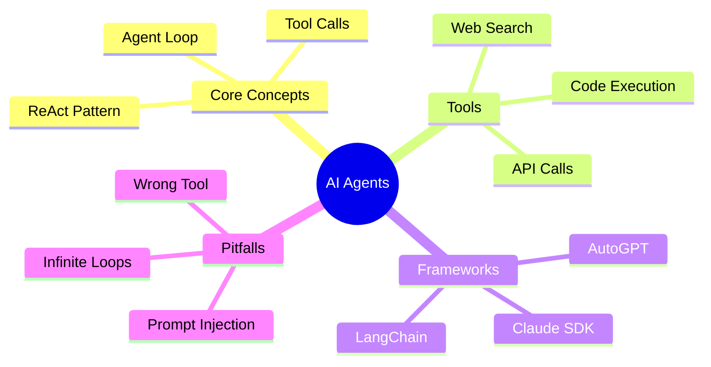

### Agent Loop Flowchart

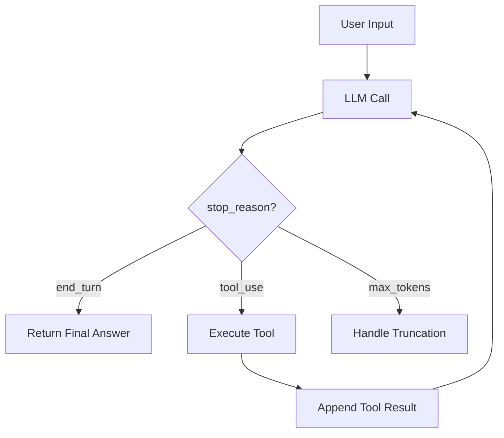

</details>

---
---

# TEMPLATE 2 — `middle.md`

<details open>
<summary><strong>Template Content</strong></summary>

# {{TOPIC_NAME}} — Middle Level

## Table of Contents

1. [Introduction](#introduction)
2. [Core Concepts](#core-concepts)
3. [Pros & Cons](#pros--cons)
4. [Use Cases](#use-cases)
5. [Code Examples](#code-examples)
6. [Coding Patterns](#coding-patterns)
7. [Clean Code](#clean-code)
8. [Product Use / Feature](#product-use--feature)
9. [Data Quality and Model Failure Handling](#data-quality-and-model-failure-handling)
10. [Security Considerations](#security-considerations)
11. [Performance Optimization](#performance-optimization)
12. [Metrics & Analytics](#metrics--analytics)
13. [Debugging Guide](#debugging-guide)
14. [Best Practices](#best-practices)
15. [Edge Cases & Pitfalls](#edge-cases--pitfalls)
16. [Common Mistakes](#common-mistakes)
17. [Tricky Points](#tricky-points)
18. [Comparison with Alternatives](#comparison-with-alternatives)
19. [Test](#test)
20. [Tricky Questions](#tricky-questions)
21. [Cheat Sheet](#cheat-sheet)
22. [Summary](#summary)
23. [What You Can Build](#what-you-can-build)
24. [Further Reading](#further-reading)
25. [Related Topics](#related-topics)
26. [Diagrams & Visual Aids](#diagrams--visual-aids)

---

## Introduction

> Focus: "Why?" and "When to use?"

Assumes the reader already knows the basics of tool use. This level covers:
- Multi-step agent pipelines and memory strategies
- Production considerations: retry logic, cost control, observability
- Multi-agent orchestration patterns

---

## Core Concepts

### Concept 1: {{Advanced agent concept}}

Detailed explanation with diagrams (mermaid) where helpful.

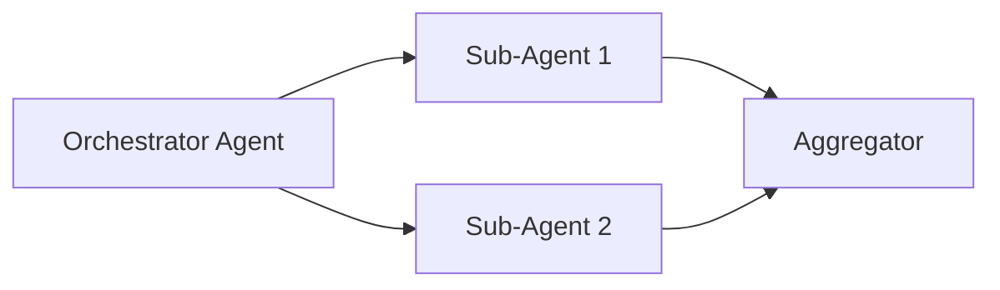

### Concept 2: {{Memory and context management}}

- Short-term (in-context) vs long-term (external store) memory
- Token budget management to avoid context overflow
- Retrieval-augmented agents

> **Rules:**
> - Go deeper than junior. Explain "why" not just "what".
> - Compare different approaches and their trade-offs.

---

## Evolution & Historical Context

**Before AI agents:**
- LLMs were purely generative — no ability to take actions
- Developers built brittle rule-based pipelines manually

**How agents changed things:**
- Models can now call tools, route tasks, and reason about multi-step plans
- Foundation for autonomous software development, research assistants, and workflow automation

---

## Pros & Cons

| Pros | Cons |
|------|------|
| Can complete complex multi-step tasks autonomously | Higher latency per task due to multiple LLM calls |
| Composable via multi-agent architectures | Cost grows with task complexity |
| Adapts dynamically to tool results | Failure modes are harder to predict and debug |

### Trade-off analysis:

- **Latency vs capability:** More agent steps = more powerful but slower — choose based on SLA
- **Cost vs autonomy:** Fully autonomous agents are more expensive — use human-in-the-loop checkpoints

### Comparison with alternatives:

| Approach | Pros | Cons | Best for |
|----------|------|------|----------|
| Single LLM call | Fast, cheap | No tool use | Simple Q&A |
| Chained prompts | Predictable | Rigid, no branching | Linear workflows |
| AI Agents | Flexible, powerful | Expensive, complex | Dynamic, multi-step tasks |

---

## Alternative Approaches (Plan B)

| Alternative | How it works | When you might use it |
|-------------|--------------|-----------------------|
| **LLM pipeline (no tools)** | Chain of prompts with fixed steps | When tasks are well-defined and don't require external data |
| **Rule-based automation** | If-else logic + API calls | When the decision tree is fixed and interpretable |

---

## Use Cases

Real-world, production scenarios:

- **Use Case 1:** Research agent — autonomously searches, summarizes, and synthesizes information
- **Use Case 2:** Customer support agent — retrieves policies, updates tickets, escalates edge cases
- **Use Case 3:** Code review agent — reads PRs, calls linters, suggests improvements

---

## Code Examples

### Example 1: Multi-turn agent with memory

```python
from anthropic import Anthropic

client = Anthropic()

class AgentWithMemory:
    def __init__(self, tools: list):
        self.tools = tools
        self.messages = []
        self.iteration_count = 0
        self.max_iterations = 10

    def run(self, user_input: str) -> str:
        self.messages.append({"role": "user", "content": user_input})

        while self.iteration_count < self.max_iterations:
            response = client.messages.create(
                model="claude-opus-4-5",
                max_tokens=4096,
                tools=self.tools,
                messages=self.messages
            )
            self.iteration_count += 1

            if response.stop_reason == "end_turn":
                return response.content[0].text

            # Handle tool calls
            tool_results = self._execute_tools(response.content)
            self.messages.append({"role": "assistant", "content": response.content})
            self.messages.append({"role": "user", "content": tool_results})

        return "Max iterations reached — task incomplete."

    def _execute_tools(self, content: list) -> list:
        results = []
        for block in content:
            if block.type == "tool_use":
                result = call_tool(block.name, block.input)
                results.append({
                    "type": "tool_result",
                    "tool_use_id": block.id,
                    "content": result
                })
        return results
```

**Why this pattern:** Encapsulates state, enforces iteration limits, handles both tool calls and final answers.
**Trade-offs:** More setup code, but much safer in production.

### Example 2: Multi-agent orchestration

```python
# Orchestrator delegates to specialized sub-agents
def orchestrator_agent(task: str) -> str:
    # Decide which agent to delegate to
    agent_type = classify_task(task)
    if agent_type == "research":
        return research_agent.run(task)
    elif agent_type == "code":
        return code_agent.run(task)
    return general_agent.run(task)
```

---

## Coding Patterns

### Pattern 1: Retry with Exponential Backoff

**Category:** Resilience
**Intent:** Handle transient tool or API failures gracefully.
**When to use:** Any production agent that calls external APIs.
**When NOT to use:** When failure should immediately surface to the user.

**Structure diagram:**

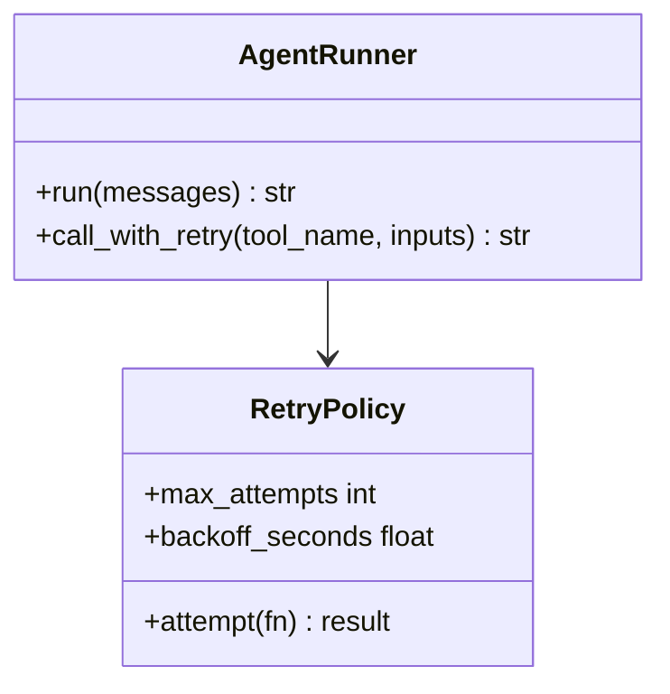

**Implementation:**

```python
import time

def call_with_retry(tool_fn, inputs: dict, max_attempts: int = 3) -> str:
    for attempt in range(max_attempts):
        try:
            return tool_fn(inputs)
        except Exception as e:
            if attempt == max_attempts - 1:
                raise
            time.sleep(2 ** attempt)  # exponential backoff
    return "Tool failed after retries"
```

**Trade-offs:**

| Pros | Cons |
|------|------|
| Handles transient failures | Adds latency on failures |
| Simple to implement | May mask persistent errors |

---

### Pattern 2: Tool Result Validation

**Category:** Data Quality
**Intent:** Validate tool outputs before feeding them back to the agent.

**Flow diagram:**

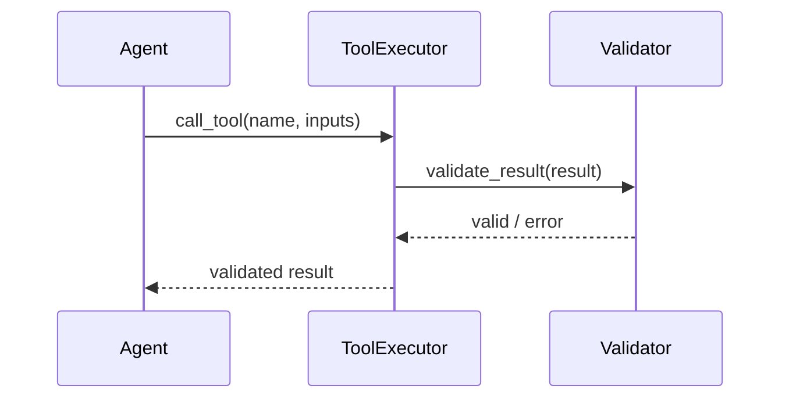

```python
def validated_tool_result(tool_name: str, result: str) -> str:
    if not result or len(result.strip()) == 0:
        return f"Tool '{tool_name}' returned empty result"
    if len(result) > 10000:
        return result[:10000] + "... [truncated]"
    return result
```

---

### Pattern 3: Token Budget Management

**Category:** Performance / Cost Control
**Intent:** Prevent context overflow and control API costs.

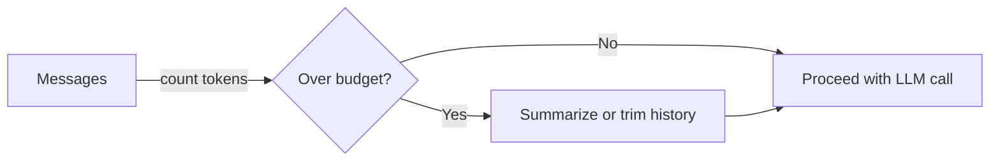

```python
import anthropic

def trim_to_token_budget(messages: list, max_tokens: int = 100000) -> list:
    # Estimate token count (simplified)
    total = sum(len(str(m)) // 4 for m in messages)
    while total > max_tokens and len(messages) > 2:
        messages.pop(1)  # Remove oldest non-system message
        total = sum(len(str(m)) // 4 for m in messages)
    return messages
```

> Include 3 patterns at middle level.

---

## Clean Code

Production-level clean code principles for {{TOPIC_NAME}}:

### Naming & Readability

```python
# Cryptic
def proc(m, t, n):
    return c.create(model=m, tools=t, messages=n)

# Self-documenting
def create_agent_response(
    model: str,
    available_tools: list,
    conversation_history: list
) -> anthropic.types.Message:
    return client.messages.create(
        model=model,
        tools=available_tools,
        messages=conversation_history
    )
```

---

### SOLID in Practice

**Single Responsibility:**
```python
# Bad — one class does everything
class Agent:
    def call_llm(self): ...
    def call_tools(self): ...
    def log_metrics(self): ...
    def save_to_db(self): ...

# Good — each class has one reason to change
class AgentRunner:
    def run(self, messages): ...

class ToolExecutor:
    def execute(self, tool_name, inputs): ...

class AgentMetrics:
    def record_call(self, latency_ms, tokens): ...
```

---

### Reproducibility

```python
# Bad — no experiment tracking
response = client.messages.create(model="claude-opus-4-5", messages=messages)

# Good — tracked, versioned, logged
experiment = ExperimentTracker(name="research-agent-v2")
experiment.log_params({"model": "claude-opus-4-5", "max_iterations": 10})
response = client.messages.create(...)
experiment.log_metrics({"latency_ms": latency, "token_cost": cost})
```

---

## Product Use / Feature

### 1. Anthropic Claude.ai

- **How it uses agents:** Integrated tools (web search, code execution) for complex tasks
- **Scale:** Millions of conversations with multi-step tool use daily
- **Key insight:** Tool descriptions are the primary lever for improving accuracy

### 2. GitHub Copilot Workspace

- **How it uses agents:** Multi-agent pipeline for planning, coding, testing, and PR creation
- **Why this approach:** Specialized agents for each phase reduces error compounding

---

## Data Quality and Model Failure Handling

Production-grade error handling for {{TOPIC_NAME}}:

### Pattern 1: Structured Error Responses

```python
from dataclasses import dataclass

@dataclass
class AgentError:
    error_type: str
    message: str
    tool_name: str | None = None
    recoverable: bool = True

def safe_tool_call(tool_name: str, inputs: dict) -> str:
    try:
        return execute_tool(tool_name, inputs)
    except ConnectionError as e:
        raise AgentError("network", str(e), tool_name, recoverable=True)
    except ValueError as e:
        raise AgentError("validation", str(e), tool_name, recoverable=False)
```

### Common Error Patterns

| Situation | Pattern | Example |
|-----------|---------|---------|
| Tool timeout | Retry with backoff | `call_with_retry(tool_fn, inputs)` |
| Empty result | Return informative message | `"Tool returned no data"` |
| Invalid inputs | Validate before calling | Schema validation |
| Context overflow | Trim message history | `trim_to_token_budget(messages)` |

---

## Security Considerations

### 1. Prompt Injection via Tool Results

**Risk level:** High

```python
# Vulnerable — raw web content fed as tool result
tool_result = fetch_webpage(url)
messages.append({"role": "user", "content": tool_result})

# Secure — sanitized and structured
tool_result = fetch_webpage(url)
safe_result = extract_text_only(tool_result)[:5000]
messages.append({
    "role": "user",
    "content": [{"type": "tool_result", "tool_use_id": tid, "content": safe_result}]
})
```

**Attack vector:** Malicious webpage injects instructions that override agent behavior.
**Mitigation:** Use structured tool result format; sanitize web content.

### Security Checklist

- [ ] All tool results use structured `tool_result` format — prevents injection
- [ ] No user-controlled strings in system prompts — prevents system prompt override
- [ ] Tool permissions scoped to minimum required — limits blast radius

---

## Performance Optimization

### Optimization 1: Parallel Tool Calls

```python
# Slow — sequential tool calls
result_a = call_tool("search", {"q": "topic A"})
result_b = call_tool("search", {"q": "topic B"})

# Fast — parallel tool calls
import asyncio

async def parallel_tools():
    result_a, result_b = await asyncio.gather(
        call_tool_async("search", {"q": "topic A"}),
        call_tool_async("search", {"q": "topic B"})
    )
    return result_a, result_b
```

**Benchmark results:**
```
Sequential:   2 tools × 800ms = 1600ms total
Parallel:     max(800ms, 800ms) = 800ms total  (2x speedup)
```

---

## Metrics & Analytics

### Key Metrics

| Metric | Type | Description | Alert threshold |
|--------|------|-------------|-----------------|
| **agent_loop_iterations** | Counter | Iterations per task | > 8 avg |
| **tool_call_success_rate** | Gauge | % successful tool calls | < 95% |
| **token_cost_per_task** | Histogram | Token spend distribution | p99 > $0.50 |

### Prometheus Instrumentation

```python
from prometheus_client import Counter, Histogram, Gauge

agent_iterations = Counter("agent_loop_iterations_total", "Total agent loop iterations")
tool_success = Gauge("tool_call_success_rate", "Tool call success rate")
token_cost = Histogram("agent_token_cost_dollars", "Token cost per agent run",
                       buckets=[0.01, 0.05, 0.10, 0.25, 0.50, 1.00])
```

---

## Debugging Guide

### Problem 1: Agent loops indefinitely

**Symptoms:** Task never completes, high token spend, repeated tool calls.

**Diagnostic steps:**
```python
# Add iteration logging
for i in range(max_iterations):
    print(f"Iteration {i}: stop_reason={response.stop_reason}")
    print(f"Tool calls: {[b.name for b in response.content if b.type == 'tool_use']}")
```

**Root cause:** Model is stuck — tool results don't satisfy its goal.
**Fix:** Improve tool descriptions or add a "give up" instruction to system prompt.

### Useful Tools

| Tool | Command | What it shows |
|------|---------|---------------|
| LangSmith | `langsmith trace` | Full agent trace with tool calls |
| Anthropic Console | Web UI | Token usage, message history |

---

## Best Practices

- **Use system prompts to define agent persona and constraints** — reduces hallucination
- **Always log full message history** — essential for debugging multi-step failures
- **Implement circuit breakers for tools** — prevent cascading failures

---

## Comparison with Alternatives

How AI Agents compare to other automation approaches:

| Aspect | AI Agents | LLM Pipelines | Rule-Based Automation |
|--------|-----------|--------------|----------------------|
| Flexibility | High | Medium | Low |
| Cost | High | Medium | Low |
| Debuggability | Hard | Medium | Easy |
| Handles edge cases | Well | Poorly | Poorly |

---

## Diagrams & Visual Aids

### Multi-Agent Architecture

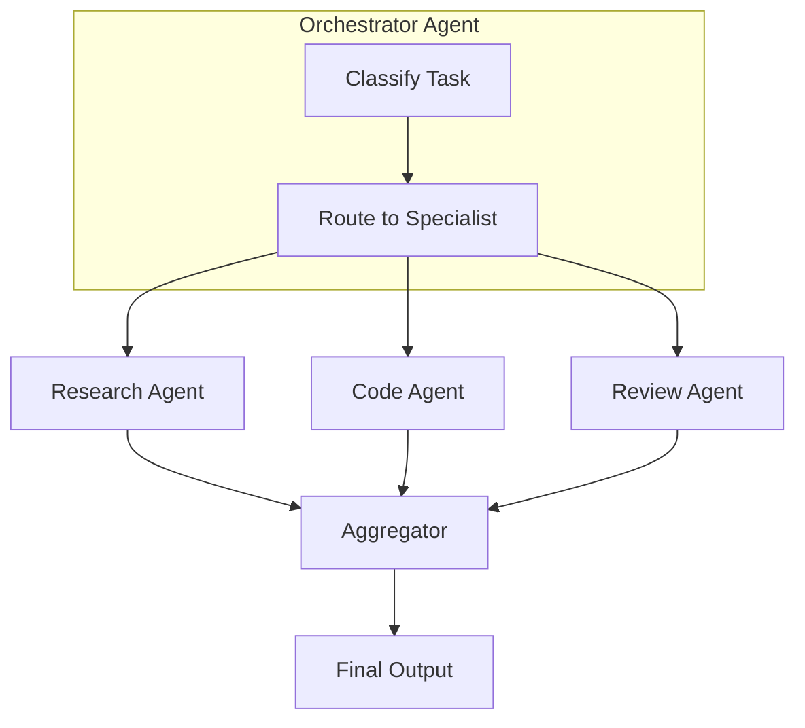

</details>

---
---

# TEMPLATE 3 — `senior.md`

<details open>
<summary><strong>Template Content</strong></summary>

# {{TOPIC_NAME}} — Senior Level

## Table of Contents

1. [Introduction](#introduction)
2. [Core Concepts](#core-concepts)
3. [Pros & Cons](#pros--cons)
4. [Use Cases](#use-cases)
5. [Code Examples](#code-examples)
6. [Coding Patterns](#coding-patterns)
7. [Clean Code](#clean-code)
8. [Best Practices](#best-practices)
9. [Product Use / Feature](#product-use--feature)
10. [Data Quality and Model Failure Handling](#data-quality-and-model-failure-handling)
11. [Security Considerations](#security-considerations)
12. [Performance Optimization](#performance-optimization)
13. [Metrics & Analytics](#metrics--analytics)
14. [Debugging Guide](#debugging-guide)
15. [Edge Cases & Pitfalls](#edge-cases--pitfalls)
16. [Postmortems & System Failures](#postmortems--system-failures)
17. [Common Mistakes](#common-mistakes)
18. [Tricky Points](#tricky-points)
19. [Comparison with Alternatives](#comparison-with-alternatives)
20. [Test](#test)
21. [Tricky Questions](#tricky-questions)
22. [Cheat Sheet](#cheat-sheet)
23. [Summary](#summary)
24. [What You Can Build](#what-you-can-build)
25. [Further Reading](#further-reading)
26. [Related Topics](#related-topics)
27. [Diagrams & Visual Aids](#diagrams--visual-aids)

---

## Introduction

> Focus: "How to optimize?" and "How to architect?"

For developers who:
- Design multi-agent systems and make architectural decisions
- Optimize agent pipelines for cost, latency, and reliability
- Mentor junior/middle developers on agent design
- Review and improve agent codebases at scale

---

## Core Concepts

### Concept 1: Agent Orchestration Patterns

Deep dive into orchestrator-worker, supervisor-agent, and peer-to-peer multi-agent patterns.

```python
# Supervisor pattern — central agent delegates and reviews
class SupervisorAgent:
    def __init__(self, worker_agents: dict[str, Agent]):
        self.workers = worker_agents

    def run(self, task: str) -> str:
        plan = self._create_plan(task)
        results = {}
        for step in plan:
            worker = self.workers[step.agent_type]
            results[step.id] = worker.run(step.task)
        return self._synthesize_results(results)
```

### Concept 2: Reliability and SLA Design

Benchmark comparisons for agent reliability strategies:

```
Circuit Breaker OFF:  mean latency 850ms, p99 8000ms (tool hang)
Circuit Breaker ON:   mean latency 820ms, p99 1200ms (fail fast)
```

---

## Code Examples

### Example 1: Production agent with observability

```python
import time
import logging
from dataclasses import dataclass, field
from anthropic import Anthropic

logger = logging.getLogger(__name__)

@dataclass
class AgentMetrics:
    iterations: int = 0
    tool_calls: int = 0
    total_tokens: int = 0
    latency_ms: float = 0.0
    errors: list = field(default_factory=list)

class ProductionAgent:
    def __init__(self, tools: list, system_prompt: str, max_iterations: int = 10):
        self.client = Anthropic()
        self.tools = tools
        self.system_prompt = system_prompt
        self.max_iterations = max_iterations

    def run(self, user_input: str) -> tuple[str, AgentMetrics]:
        metrics = AgentMetrics()
        messages = [{"role": "user", "content": user_input}]
        start = time.time()

        for iteration in range(self.max_iterations):
            metrics.iterations += 1
            try:
                response = self.client.messages.create(
                    model="claude-opus-4-5",
                    max_tokens=4096,
                    system=self.system_prompt,
                    tools=self.tools,
                    messages=messages
                )
                metrics.total_tokens += response.usage.input_tokens + response.usage.output_tokens

                if response.stop_reason == "end_turn":
                    metrics.latency_ms = (time.time() - start) * 1000
                    logger.info("Agent completed: iter=%d tokens=%d latency=%.1fms",
                                metrics.iterations, metrics.total_tokens, metrics.latency_ms)
                    return response.content[0].text, metrics

                tool_results = self._execute_tools(response.content, metrics)
                messages.append({"role": "assistant", "content": response.content})
                messages.append({"role": "user", "content": tool_results})

            except Exception as e:
                metrics.errors.append(str(e))
                logger.error("Agent error: %s", e)
                raise

        return "Max iterations reached", metrics

    def _execute_tools(self, content: list, metrics: AgentMetrics) -> list:
        results = []
        for block in content:
            if block.type == "tool_use":
                metrics.tool_calls += 1
                result = self._safe_tool_call(block.name, block.input)
                results.append({
                    "type": "tool_result",
                    "tool_use_id": block.id,
                    "content": result
                })
        return results

    def _safe_tool_call(self, name: str, inputs: dict) -> str:
        try:
            return TOOL_REGISTRY[name](inputs)
        except Exception as e:
            logger.warning("Tool '%s' failed: %s", name, e)
            return f"Tool error: {str(e)}"
```

---

## Coding Patterns

### Pattern 1: Circuit Breaker for Tools

**Category:** Resilience / Distributed Systems
**Intent:** Fail fast when a tool is repeatedly failing; auto-recover when it stabilizes.

**Architecture diagram:**

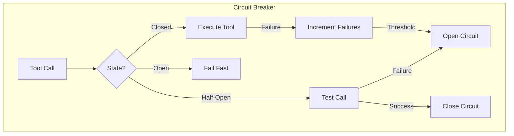

```python
from enum import Enum
import time

class CircuitState(Enum):
    CLOSED = "closed"
    OPEN = "open"
    HALF_OPEN = "half_open"

class CircuitBreaker:
    def __init__(self, failure_threshold: int = 3, recovery_timeout: float = 30.0):
        self.state = CircuitState.CLOSED
        self.failure_count = 0
        self.failure_threshold = failure_threshold
        self.recovery_timeout = recovery_timeout
        self.last_failure_time = 0.0

    def call(self, fn, *args, **kwargs):
        if self.state == CircuitState.OPEN:
            if time.time() - self.last_failure_time > self.recovery_timeout:
                self.state = CircuitState.HALF_OPEN
            else:
                raise RuntimeError("Circuit is OPEN — tool unavailable")

        try:
            result = fn(*args, **kwargs)
            if self.state == CircuitState.HALF_OPEN:
                self.state = CircuitState.CLOSED
                self.failure_count = 0
            return result
        except Exception as e:
            self.failure_count += 1
            self.last_failure_time = time.time()
            if self.failure_count >= self.failure_threshold:
                self.state = CircuitState.OPEN
            raise
```

---

### Pattern 2: Agent Memory with RAG

**Category:** Performance / Scalability
**Intent:** Give agents long-term memory without filling the context window.

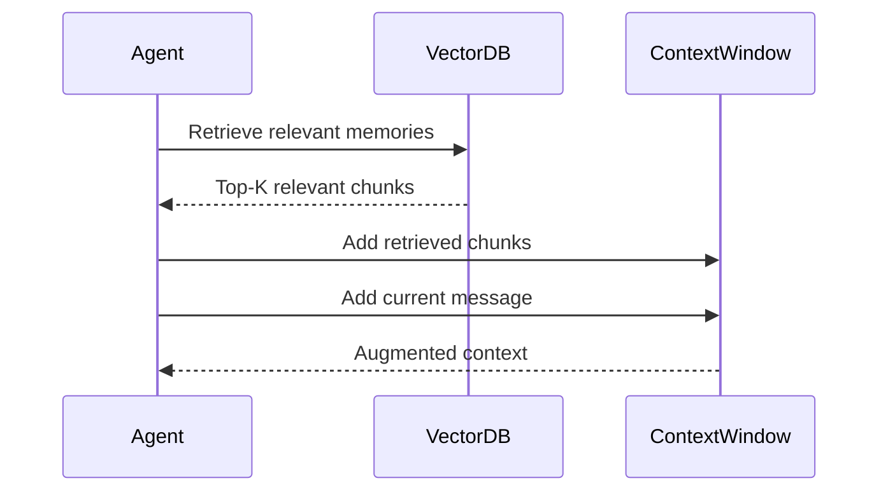

```python
from typing import Optional
import numpy as np

class AgentWithRAGMemory:
    def __init__(self, vector_store, embedding_model):
        self.vector_store = vector_store
        self.embedding_model = embedding_model

    def retrieve_relevant_context(self, query: str, top_k: int = 5) -> str:
        query_embedding = self.embedding_model.embed(query)
        results = self.vector_store.search(query_embedding, top_k=top_k)
        return "\n".join([r.text for r in results])

    def run(self, user_input: str) -> str:
        memory_context = self.retrieve_relevant_context(user_input)
        system = f"Relevant context from memory:\n{memory_context}"
        return self.agent.run(user_input, system_prompt=system)
```

---

### Pattern 3: Parallel Sub-Agent Fan-Out

**Category:** Performance / Concurrency
**Intent:** Run independent sub-tasks in parallel to reduce total latency.

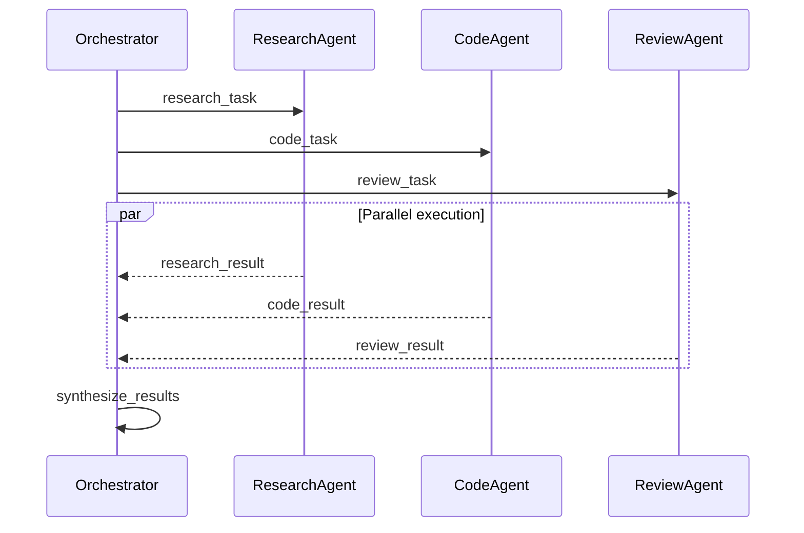

```python
import asyncio

async def fan_out_agents(task: str) -> dict:
    sub_tasks = decompose_task(task)
    coroutines = [
        sub_agent.run_async(sub_task)
        for sub_task in sub_tasks
    ]
    results = await asyncio.gather(*coroutines, return_exceptions=True)
    return {task.id: result for task, result in zip(sub_tasks, results)}
```

---

### Pattern 4: Human-in-the-Loop Checkpoint

**Category:** Safety / Reliability
**Intent:** Pause agent execution at high-stakes decisions to get human approval.

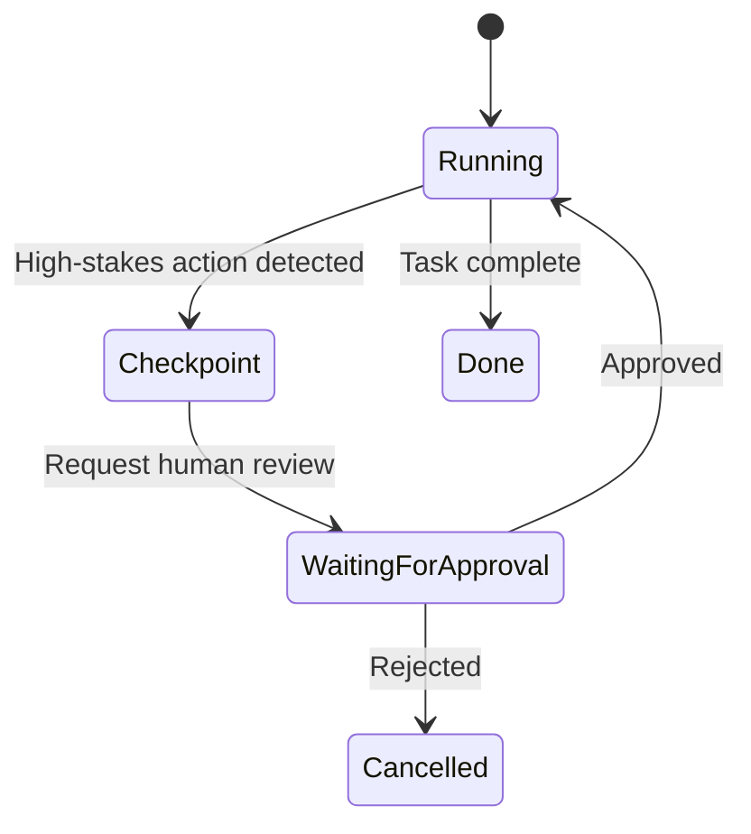

```python
def run_with_human_checkpoints(agent, task: str, approval_fn) -> str:
    messages = [{"role": "user", "content": task}]

    while True:
        response = agent.step(messages)
        if response.requires_approval:
            if not approval_fn(response.proposed_action):
                return "Task cancelled by human reviewer"
        messages = agent.apply_response(messages, response)
        if response.is_final:
            return response.result
```

### Pattern Comparison Matrix

| Pattern | Use When | Avoid When | Complexity |
|---------|----------|------------|------------|
| Circuit Breaker | External tools are unreliable | Tools are always local/fast | Medium |
| RAG Memory | Task history > 100K tokens | Simple single-turn tasks | High |
| Fan-Out | Sub-tasks are independent | Tasks have sequential dependencies | Medium |
| Human-in-the-Loop | High-stakes irreversible actions | High-frequency automated tasks | Low |

---

## Clean Code

Senior-level clean code for agent systems:

### Clean Architecture Boundaries

```python
# Bad — business logic in the agent runner
class AgentRunner:
    def run(self, task):
        response = self.llm.call(task)
        # Business logic mixed in
        if "invoice" in task:
            self.db.save_invoice(response)
        return response

# Good — dependency inversion
class AgentRunner:
    def __init__(self, llm_client, task_handler):
        self.llm = llm_client
        self.handler = task_handler

    def run(self, task):
        response = self.llm.call(task)
        return self.handler.process(task, response)
```

### Code Smells at Senior Level

| Smell | Symptom | Refactoring |
|-------|---------|-------------|
| **God Agent** | One agent class handles 20+ tools | Split by domain |
| **Prompt Obsession** | Raw strings everywhere | Use typed prompt templates |
| **Tool Sprawl** | 50+ tools registered | Curate per-task toolsets |

### Code Review Checklist (Senior)

- [ ] No business logic in agent runner — use handlers/services
- [ ] Tool descriptions are precise and distinct — reduces wrong tool selection
- [ ] Max iterations enforced — no infinite loops
- [ ] All tool errors return structured error messages
- [ ] Token usage is logged and alerted on

---

## Best Practices

### Must Do

1. **Track token cost per agent run** — prevents runaway spend
   ```python
   cost = (response.usage.input_tokens * 0.000003 +
           response.usage.output_tokens * 0.000015)
   metrics.record("agent_cost_usd", cost)
   ```

2. **Use structured tool schemas with strict validation** — reduces hallucinated inputs
   ```json
   {"type": "object", "properties": {"query": {"type": "string", "minLength": 1}}, "required": ["query"], "additionalProperties": false}
   ```

3. **Set system prompts for every production agent** — defines persona, constraints, output format

4. **Implement graceful degradation** — if an agent fails, fall back to simpler workflow

5. **Version your agent configurations** — model, tools, system prompt, temperature

### Never Do

1. **Never run agents without an iteration cap** — production agents must have `max_iterations`
   ```python
   # Bad — infinite loop risk
   while response.stop_reason != "end_turn":
       response = call_agent(messages)
   ```

2. **Never inject raw user input into system prompts** — prompt injection attack surface
3. **Never skip tool result validation** — empty or malformed results cause agent confusion
4. **Never hardcode model names** — use env vars for easy model updates
5. **Never give agents irreversible permissions without human-in-the-loop**

### Production Checklist

- [ ] Max iteration limit set and tested
- [ ] Token cost monitoring and alerting configured
- [ ] Tool schemas validated with JSON Schema
- [ ] Tool errors return structured, informative messages
- [ ] System prompt stored in version control
- [ ] Agent output format validated before downstream use
- [ ] Human-in-the-loop for any irreversible actions
- [ ] Circuit breakers on all external tool dependencies
- [ ] Distributed trace ID propagated through all agent steps

---

## Diagrams & Visual Aids

### Agent System Architecture

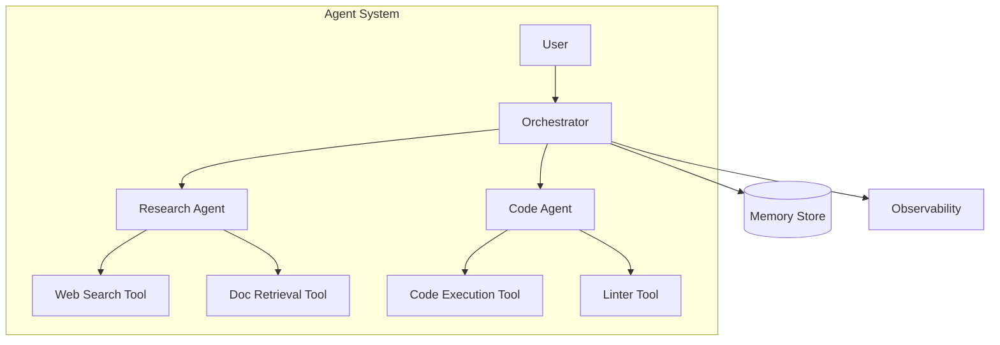

</details>

---
---

# TEMPLATE 4 — `professional.md`

<details open>
<summary><strong>Template Content</strong></summary>

# {{TOPIC_NAME}} — Under the Hood

## Table of Contents

1. [Introduction](#introduction)
2. [How It Works Internally](#how-it-works-internally)
3. [Agent Loop Internals](#agent-loop-internals)
4. [Tool Use Protocol](#tool-use-protocol)
5. [Context Window Management](#context-window-management)
6. [Streaming Internals](#streaming-internals)
7. [Gradient Trace / Activation Analysis](#gradient-trace--activation-analysis)
8. [Model Computation Graph / Execution Engine](#model-computation-graph--execution-engine)
9. [GPU Kernel / Hardware Acceleration Internals](#gpu-kernel--hardware-acceleration-internals)
10. [Performance Internals](#performance-internals)
11. [Edge Cases at the Lowest Level](#edge-cases-at-the-lowest-level)
12. [Test](#test)
13. [Tricky Questions](#tricky-questions)
14. [Summary](#summary)
15. [Further Reading](#further-reading)
16. [Diagrams & Visual Aids](#diagrams--visual-aids)

---

## Introduction

> Focus: "What happens under the hood?"

This document explores the internals of AI agent execution:
- How the tool use protocol works at the API level
- How context windows are managed and truncated
- How streaming affects agent behavior
- How token generation relates to tool decision-making

---

## How It Works Internally

Step-by-step of what happens when an agent calls a tool:

1. **User message** → Tokenized and encoded
2. **System prompt + tools** → Included in context as special tokens
3. **Model forward pass** → Attention over entire context
4. **Tool decision** → Logit scores for tool_use vs text tokens
5. **Tool call JSON** → Streamed token-by-token
6. **Tool execution** → External call; result appended
7. **Continuation** → Another forward pass with tool result in context

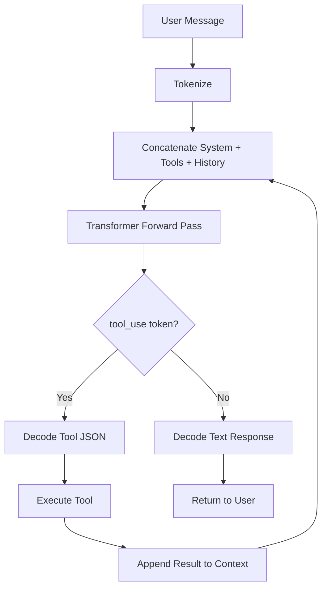

---

## Agent Loop Internals

The agent loop is not a special API feature — it is implemented by the client:

```python
# This is what happens under the hood in every agent framework
def agent_loop_internal(system, tools, messages, client):
    while True:
        # Single HTTP POST to /v1/messages
        http_response = client._post("/v1/messages", {
            "model": "claude-opus-4-5",
            "system": system,
            "tools": tools,    # Tool schemas added to context
            "messages": messages
        })

        if http_response["stop_reason"] == "end_turn":
            return http_response["content"][0]["text"]

        # Tool result appended as next user turn
        tool_results = execute_all_tools(http_response["content"])
        messages = messages + [
            {"role": "assistant", "content": http_response["content"]},
            {"role": "user", "content": tool_results}
        ]
```

**Key insight:** Each "iteration" is a full, independent HTTP request. The model has no persistent state between calls — all context is re-sent every time.

---

## Tool Use Protocol

How tool schemas are serialized into the model's context:

```json
{
  "type": "tool_use",
  "id": "toolu_01A09q90qw90lq917835lq9",
  "name": "get_weather",
  "input": {
    "location": "Paris, France"
  }
}
```

The model generates this JSON token-by-token. The `input` object is produced by the model via constrained decoding — the schema guides what tokens are valid at each position.

**Tool result format in the wire protocol:**

```json
{
  "role": "user",
  "content": [
    {
      "type": "tool_result",
      "tool_use_id": "toolu_01A09q90qw90lq917835lq9",
      "content": "72°F, partly cloudy"
    }
  ]
}
```

---

## Context Window Management

What happens when the context exceeds the model's limit:

```
Model context window: 200,000 tokens (Claude claude-opus-4-5)

Composition of tokens in a typical agent call:
- System prompt:      ~500 tokens
- Tool schemas:       ~300 tokens per tool × N tools
- Conversation:       grows with each iteration
- Tool results:       can be very large (e.g., web page content)
```

**Truncation strategies compared:**

| Strategy | How it works | Risk |
|----------|-------------|------|
| Drop oldest messages | Remove earliest turns | Loses early context |
| Summarize history | LLM call to compress | Extra cost + latency |
| Trim tool results | Truncate large tool outputs | May lose key info |
| Sliding window | Keep last N turns | May lose task start |

---

## Streaming Internals

How streaming affects agent behavior:

```python
# Streaming vs non-streaming at the protocol level
# Non-streaming: one HTTP response with complete JSON
# Streaming: series of SSE events

with client.messages.stream(
    model="claude-opus-4-5",
    tools=tools,
    messages=messages
) as stream:
    for event in stream:
        if event.type == "content_block_start":
            if event.content_block.type == "tool_use":
                # Tool call starting — inputs will stream in
                pass
        elif event.type == "input_json_delta":
            # Partial JSON for tool inputs
            partial_json += event.partial_json
```

**Critical subtlety:** Tool inputs are streamed as partial JSON. You cannot execute the tool until the full `input_json` is received.

---

## Gradient Trace / Activation Analysis

How the model "decides" to call a tool:

The model's attention mechanism processes the tool schema tokens alongside the user message. The probability of generating a `tool_use` content block vs a `text` content block is determined by the softmax over the vocabulary at the position where the response begins.

```python
# Conceptual (not real API) — token probability distribution
# at the decision point:
token_logits = {
    "<tool_use>": 8.3,   # High score → tool will be called
    "<text>": 2.1,
    ...
}
```

Higher tool description quality → stronger signal in the attention weights → more reliable tool selection.

---

## Model Computation Graph / Execution Engine

The agent system overlaid on the transformer computation graph:

```
[System Prompt Tokens] → Attention heads → KV Cache
[Tool Schema Tokens]  → Attention heads → KV Cache
[Message Tokens]      → Attention heads → KV Cache
                                              ↓
                                    Feed-Forward Layers
                                              ↓
                                    Next Token Logits
                                              ↓
                              Sampling (temp=0 → argmax)
```

**KV cache impact on agent loops:** Each iteration re-sends the entire context — the KV cache is NOT preserved across API calls. This is why long agent loops become progressively more expensive.

---

## GPU Kernel / Hardware Acceleration Internals

Attention computation for long agent contexts:

```
For context length L and model dimension D:

Attention cost: O(L²) — quadratic in context length
Memory: 2 × L × num_layers × num_heads × head_dim × 2 bytes (fp16)

At L=100K tokens, Claude claude-opus-4-5:
Memory for KV cache: ~40GB
```

**Flash Attention:** Modern inference engines use Flash Attention to compute attention in tiles, reducing memory from O(L²) to O(L). This makes 200K context windows feasible.

---

## Performance Internals

### Token Cost per Agent Run

```python
def estimate_agent_cost(
    iterations: int,
    avg_input_tokens_per_iter: int,
    avg_output_tokens_per_iter: int,
    input_price_per_mtok: float = 3.0,
    output_price_per_mtok: float = 15.0
) -> float:
    total_input = iterations * avg_input_tokens_per_iter
    total_output = iterations * avg_output_tokens_per_iter
    return (total_input * input_price_per_mtok +
            total_output * output_price_per_mtok) / 1_000_000
```

**Empirical timing:**
```
Agent call (200 input tokens, no tools):   ~400ms
Agent call (2000 input tokens, 3 tools):   ~1200ms
Agent call (50K input tokens, 5 tools):    ~4500ms
```

---

## Edge Cases at the Lowest Level

### Edge Case 1: Tool Input Truncation

When the model generates very long tool inputs, the JSON can be truncated mid-stream:

```python
# This can happen with large code generation tool calls
partial_input = '{"code": "def very_long_function():\n    ...'
# Stream ends here — invalid JSON
import json
try:
    parsed = json.loads(partial_input)
except json.JSONDecodeError:
    # Handle gracefully
    pass
```

### Edge Case 2: Parallel Tool Calls

Claude claude-opus-4-5 can emit multiple `tool_use` blocks in a single response. Client code must handle this:

```python
# Bad — assumes only one tool call
tool_block = next(b for b in response.content if b.type == "tool_use")

# Correct — handle multiple simultaneous tool calls
tool_blocks = [b for b in response.content if b.type == "tool_use"]
results = [execute_tool(b.name, b.input) for b in tool_blocks]
```

---

## Test

**1. Why does each agent iteration incur the full context cost even if the system prompt hasn't changed?**

<details>
<summary>Answer</summary>
The API is stateless — there is no KV cache persistence across API calls. Every call re-sends and re-processes the entire context from scratch.
</details>

**2. What token type signals that the model wants to call a tool?**

<details>
<summary>Answer</summary>
A `content_block_start` event with `type: "tool_use"` in streaming, or a content block of type `tool_use` in the final response.
</details>

---

## Summary

- The agent loop is client-side logic — the model has no built-in looping
- Each iteration is a full HTTP request; context grows linearly with iterations
- Tool schemas consume significant context tokens — curate them per task
- Flash Attention makes long contexts feasible but not free

---

## Further Reading

- **Anthropic docs:** [Tool Use — Streaming](https://docs.anthropic.com/en/docs/tool-use#streaming)
- **Paper:** [ReAct: Synergizing Reasoning and Acting in Language Models](https://arxiv.org/abs/2210.03629)
- **Paper:** [FlashAttention-2](https://arxiv.org/abs/2307.08691)

</details>

---
---

# TEMPLATE 5 — `interview.md`

<details open>
<summary><strong>Template Content</strong></summary>

# {{TOPIC_NAME}} — Interview Questions

## Table of Contents

1. [Junior Level](#junior-level)
2. [Middle Level](#middle-level)
3. [Senior Level](#senior-level)
4. [Scenario-Based Questions](#scenario-based-questions)
5. [FAQ](#faq)

---

## Junior Level

### 1. What is an AI agent and how does it differ from a regular LLM call?

**Answer:**
A regular LLM call generates text in response to a prompt. An AI agent uses an LLM plus tools — the model can call external functions, retrieve data, run code, and take actions. The key difference is the agent loop: after a tool is called, the result is fed back to the model, and the process repeats until the task is complete.

---

### 2. What is a tool schema?

**Answer:**
A tool schema is a JSON description of a tool: its name, description, and the parameters it accepts. The LLM uses the schema to decide when and how to call the tool. Well-written schemas are precise and unambiguous — vague descriptions lead to wrong tool selections.

---

### 3. What does `stop_reason = "tool_use"` mean?

**Answer:**
It means the model has decided to call one or more tools before continuing. The client code must extract the tool call details from `response.content`, execute the tool, and append the result back to the message history before calling the model again.

---

> 5-7 junior questions. Test basic understanding and terminology.

---

## Middle Level

### 4. How would you prevent an agent from running indefinitely?

**Answer:**
Always enforce a maximum iteration count. Use a `for` loop with a fixed upper bound rather than `while True`. Additionally, add a "give up" instruction in the system prompt: "If you cannot complete the task in 10 steps, summarize what you've done and stop."

---

### 5. What are the trade-offs between using many tools vs few tools?

**Answer:**
More tools increase the model's capability but also increase context length (each schema consumes tokens), raise the chance of wrong tool selection, and make debugging harder. Best practice: provide only the tools relevant to the current task type. Dynamically filter the toolset based on user intent.

---

### 6. How do you debug an agent that keeps calling the same tool?

**Answer:**
1. Log every tool call with inputs and outputs
2. Check if the tool result is actually being appended to the message history
3. Inspect whether the tool result satisfies the model's goal
4. Add explicit success conditions to the system prompt
5. Use LangSmith or similar to trace the full conversation

---

## Senior Level

### 7. How would you architect a multi-agent system for a complex research task?

**Answer:**
Use an orchestrator-worker pattern: an orchestrator agent decomposes the task into sub-tasks, routes them to specialized workers (research agent, code agent, writing agent), collects results, and synthesizes a final output. Use async fan-out for independent sub-tasks. Add a review agent to validate outputs before returning to the user.

---

### 8. How do you control token costs in production agents?

**Answer:**
1. Token budget enforcement — trim message history when approaching context limit
2. Tool schema compression — use minimal but precise schemas
3. Caching — cache tool results for repeated queries
4. Model routing — use smaller/cheaper models for simple sub-tasks
5. Monitoring — alert on cost per task exceeding threshold

---

## Scenario-Based Questions

### 9. Your production agent is spending $50/hour in API costs. How do you diagnose and fix this?

**Answer:**
1. Log input/output token counts per agent run
2. Identify which tasks are consuming the most tokens
3. Check for runaway loops (high iteration count)
4. Look for large tool results being passed in full
5. Fix: add iteration cap, truncate large tool results, cache repeated tool calls, route simple tasks to cheaper models

---

## FAQ

### Q: What do interviewers look for in agent design answers?

**A:** Key evaluation criteria:
- Junior: understands tool call → result → loop cycle
- Middle: can handle failure cases, cost control, multi-step planning
- Senior: can architect multi-agent systems, design for reliability and observability

</details>

---
---

# TEMPLATE 6 — `tasks.md`

<details open>
<summary><strong>Template Content</strong></summary>

# {{TOPIC_NAME}} — Practical Tasks

## Table of Contents

1. [Junior Tasks](#junior-tasks)
2. [Middle Tasks](#middle-tasks)
3. [Senior Tasks](#senior-tasks)
4. [Questions](#questions)
5. [Mini Projects](#mini-projects)
6. [Challenge](#challenge)

---

## Junior Tasks

### Task 1: Build a single-tool agent

**Type:** Code

**Goal:** Practice writing a tool schema and making a tool-using API call.

**Instructions:**
1. Define a `get_current_time` tool that accepts a `timezone` parameter
2. Make an API call with the tool and a user message asking for the current time
3. Handle the tool call response and print the tool name and inputs

**Starter code:**

```python
from anthropic import Anthropic

client = Anthropic()

# TODO: Define the get_current_time tool schema
tools = []

# TODO: Make the API call and print the result
```

**Expected output:**
```
Tool called: get_current_time
Inputs: {"timezone": "UTC"}
```

**Evaluation criteria:**
- [ ] Tool schema is valid JSON with correct structure
- [ ] API call succeeds
- [ ] Tool call details are extracted and printed

---

### Task 2: Design a tool schema

**Type:** Design

**Goal:** Practice writing clear, precise tool descriptions.

**Instructions:**
1. Design 3 tools for a customer support agent
2. Each tool must have: name, description, and input_schema
3. Write descriptions that are unambiguous and distinct

**Deliverable:** 3 JSON tool schemas

**Evaluation criteria:**
- [ ] Each tool has a unique, clear purpose
- [ ] Descriptions would not confuse the model
- [ ] Input schemas have proper types and required fields

---

## Middle Tasks

### Task 4: Implement a full agent loop

**Type:** Code

**Goal:** Build a production-quality agent loop with error handling and iteration limits.

**Scenario:** Build an agent that can answer questions by searching a simulated knowledge base.

**Requirements:**
- [ ] Implement the full agent loop with max 8 iterations
- [ ] Handle tool call errors gracefully
- [ ] Log each iteration with tool calls and results
- [ ] Write tests for the loop termination logic

**Hints:**
<details>
<summary>Hint 1</summary>
Check `response.stop_reason` to know when to stop.
</details>
<details>
<summary>Hint 2</summary>
Append both assistant response and tool results to messages before the next iteration.
</details>

---

## Senior Tasks

### Task 7: Design a multi-agent research system

**Type:** Design

**Goal:** Architect a multi-agent system for autonomous research.

**Scenario:** Design a system that takes a research topic, searches multiple sources, synthesizes findings, and produces a structured report.

**Requirements:**
- [ ] Create a full architecture diagram
- [ ] Define agent roles: orchestrator, researcher, writer, reviewer
- [ ] Plan for failure scenarios (tool down, agent loops)
- [ ] Document token cost estimates per run

**Deliverable:**
- Architecture diagram (Mermaid)
- Agent interaction sequence diagram
- Written design document with trade-off analysis

---

## Questions

### 1. Why is the agent loop implemented client-side rather than server-side?

**Answer:**
The LLM API is stateless — it processes one request at a time. The loop logic (append tool results, call again) must be managed by the client. This also gives developers full control over iteration limits, tool execution, and error handling.

---

## Mini Projects

### Project 1: Autonomous Research Agent

**Goal:** Build an agent that researches a topic and produces a structured summary.

**Requirements:**
- [ ] At least 3 tools (web search, document retrieval, calculator)
- [ ] Multi-step reasoning with up to 10 iterations
- [ ] Structured output (JSON report)
- [ ] Cost tracking per run

**Estimated time:** 4-6 hours

---

## Challenge

### Sub-$0.10 Agent Challenge

**Problem:** Build an agent that answers complex 5-part research questions for under $0.10 in API costs per query.

**Constraints:**
- Max $0.10 per query
- Must answer all 5 parts correctly
- No hardcoded answers

**Scoring:**
- Correctness: 50%
- Cost efficiency: 30%
- Code quality: 20%

</details>

---
---

# TEMPLATE 7 — `find-bug.md`

<details open>
<summary><strong>Template Content</strong></summary>

# {{TOPIC_NAME}} — Find the Bug

> **Practice finding and fixing bugs in AI agent code.**
> Each exercise contains buggy code — your job is to find the bug, explain why it happens, and fix it.

---

## How to Use

1. Read the buggy code carefully
2. Try to find the bug **without** looking at the hint
3. Write the fix yourself before checking the solution
4. Understand **why** the bug happens

### Difficulty Levels

| Level | Description |
|:-----:|:-----------|
| 🟢 | **Easy** — Common beginner mistakes |
| 🟡 | **Medium** — Logic errors, subtle agent behavior |
| 🔴 | **Hard** — Race conditions, context overflow, protocol errors |

---

## Bug 1: Missing tool result in message history 🟢

**What the code should do:** Run an agent that uses a tool and returns the final answer.

```python
def run_agent(user_message: str) -> str:
    messages = [{"role": "user", "content": user_message}]
    for _ in range(5):
        response = client.messages.create(
            model="claude-opus-4-5", tools=tools, messages=messages
        )
        if response.stop_reason == "end_turn":
            return response.content[0].text
        # Execute tool
        tool_result = execute_tool(response.content)
        # BUG: missing append of assistant response and tool result
        messages.append({"role": "user", "content": tool_result})
    return "Max iterations reached"
```

<details>
<summary>💡 Hint</summary>
Look at what gets appended to `messages` — what's missing?
</details>

<details>
<summary>🐛 Bug Explanation</summary>

**Bug:** The assistant's response is never appended to messages before appending the tool result.
**Why it happens:** The API requires alternating user/assistant turns. Skipping the assistant turn breaks the conversation format.
**Impact:** API error — "messages must alternate between user and assistant roles"

</details>

<details>
<summary>✅ Fixed Code</summary>

```python
messages.append({"role": "assistant", "content": response.content})
messages.append({"role": "user", "content": tool_result})
```

**What changed:** Added the assistant response before appending the tool result.

</details>

---

## Bug 2: Infinite loop — no iteration limit 🟢

**What the code should do:** Run agent loop safely.

```python
def run_agent(messages):
    while True:  # BUG: no exit condition besides end_turn
        response = client.messages.create(tools=tools, messages=messages)
        if response.stop_reason == "end_turn":
            return response.content[0].text
        messages = append_tool_result(messages, response)
```

<details>
<summary>🐛 Bug Explanation</summary>

**Bug:** No maximum iteration limit.
**Why it happens:** If the agent never reaches `end_turn` (due to a bad tool or model confusion), the loop runs forever.
**Impact:** Unbounded API cost, possible service timeout.

</details>

<details>
<summary>✅ Fixed Code</summary>

```python
def run_agent(messages, max_iterations=10):
    for _ in range(max_iterations):
        response = client.messages.create(tools=tools, messages=messages)
        if response.stop_reason == "end_turn":
            return response.content[0].text
        messages = append_tool_result(messages, response)
    return "Max iterations reached"
```

</details>

---

## Score Card

| Bug | Difficulty | Found without hint? | Understood why? | Fixed correctly? |
|:---:|:---------:|:-------------------:|:---------------:|:----------------:|
| 1 | 🟢 | ☐ | ☐ | ☐ |
| 2 | 🟢 | ☐ | ☐ | ☐ |

</details>

---
---

# TEMPLATE 8 — `optimize.md`

<details open>
<summary><strong>Template Content</strong></summary>

# {{TOPIC_NAME}} — Optimize the Code

> **Practice optimizing slow, expensive, or unreliable AI agent code.**
> Each exercise contains working but suboptimal code — make it faster, cheaper, or more reliable.

---

## How to Use

1. Read the slow code and understand what it does
2. Identify the performance bottleneck
3. Write your optimized version
4. Compare with the solution

### Difficulty Levels

| Level | Focus |
|:-----:|:------|
| 🟢 | **Easy** — Obvious inefficiencies |
| 🟡 | **Medium** — Parallelism, caching, prompt optimization |
| 🔴 | **Hard** — Token budget management, model routing, cost architecture |

### Optimization Categories

| Category | Icon | Description |
|:--------:|:----:|:-----------|
| **Token Cost** | 💰 | Reduce input/output tokens |
| **Latency** | ⚡ | Reduce wall-clock time |
| **Reliability** | 🛡️ | Reduce failure rate |
| **Tool Efficiency** | 🔧 | Reduce redundant tool calls |

---

## Exercise 1: Sequential tool calls 🟢 ⚡

**What the code does:** Searches for information from 3 independent sources.

**The problem:** Tools are called sequentially — no need since they're independent.

```python
def research_agent(topic: str) -> str:
    result1 = call_tool("search_web", {"query": topic})
    result2 = call_tool("search_arxiv", {"query": topic})
    result3 = call_tool("search_wikipedia", {"query": topic})
    return synthesize([result1, result2, result3])
```

**Current benchmark:**
```
3 tools × 800ms each = 2400ms total
```

<details>
<summary>💡 Hint</summary>
The three searches are independent — they can run in parallel with `asyncio.gather`.
</details>

<details>
<summary>⚡ Optimized Code</summary>

```python
import asyncio

async def research_agent_fast(topic: str) -> str:
    result1, result2, result3 = await asyncio.gather(
        call_tool_async("search_web", {"query": topic}),
        call_tool_async("search_arxiv", {"query": topic}),
        call_tool_async("search_wikipedia", {"query": topic})
    )
    return synthesize([result1, result2, result3])
```

**Optimized benchmark:**
```
max(800ms, 800ms, 800ms) = 800ms total
```

**Improvement:** 3x faster, same token cost.

</details>

---

## Score Card

| Exercise | Difficulty | Category | Found bottleneck? | Your improvement | Target improvement |
|:--------:|:---------:|:--------:|:-----------------:|:----------------:|:-----------------:|
| 1 | 🟢 | ⚡ | ☐ | ___ x | 3x |

---

## Optimization Cheat Sheet

| Problem | Solution | Impact |
|:--------|:---------|:------:|
| Sequential independent tools | `asyncio.gather` | High |
| Large tool results in context | Truncate to 2K tokens | High |
| Repeated tool calls for same query | LRU cache on tool results | Medium-High |
| Expensive model for simple routing | Route simple tasks to haiku | High |
| Growing message history | Summarize older turns | Medium |

</details>
