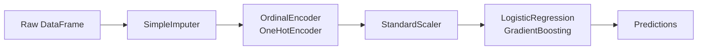
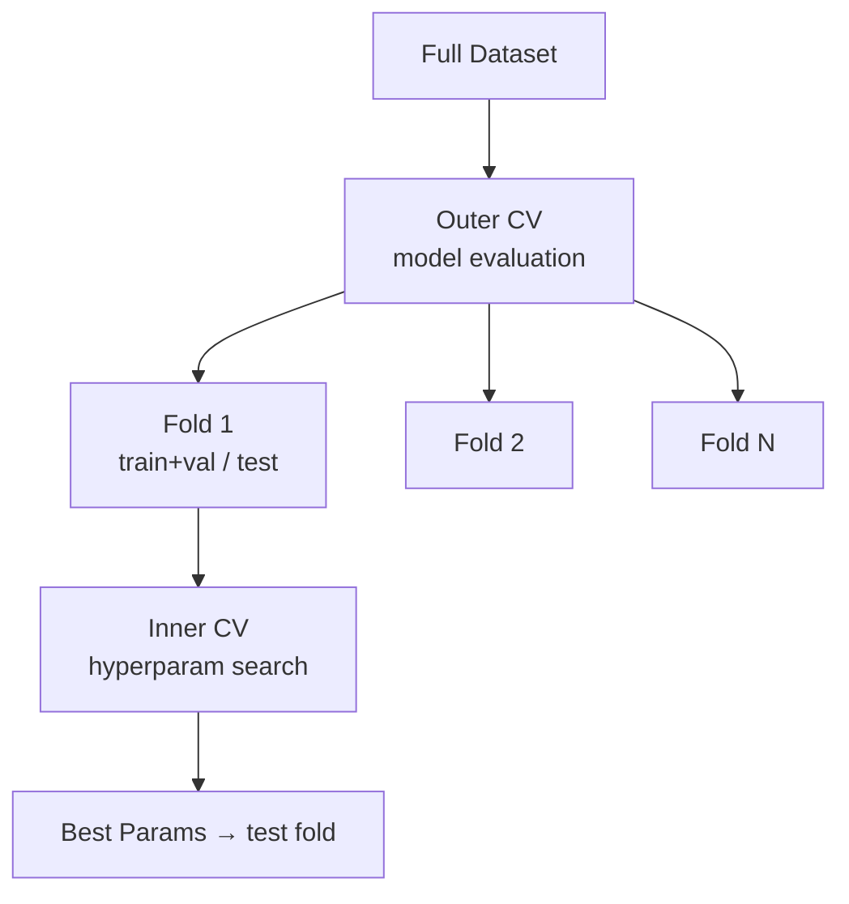
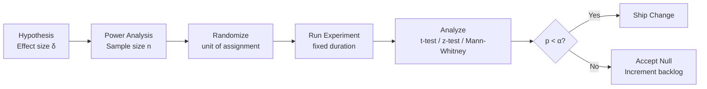
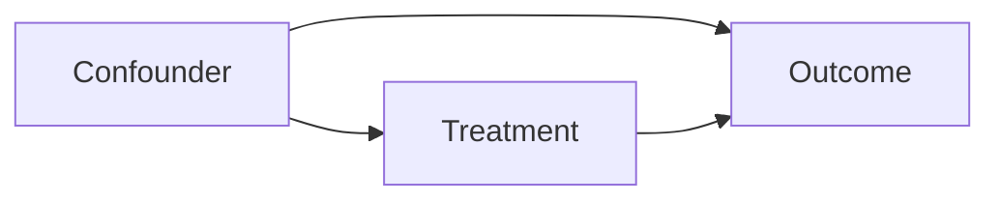
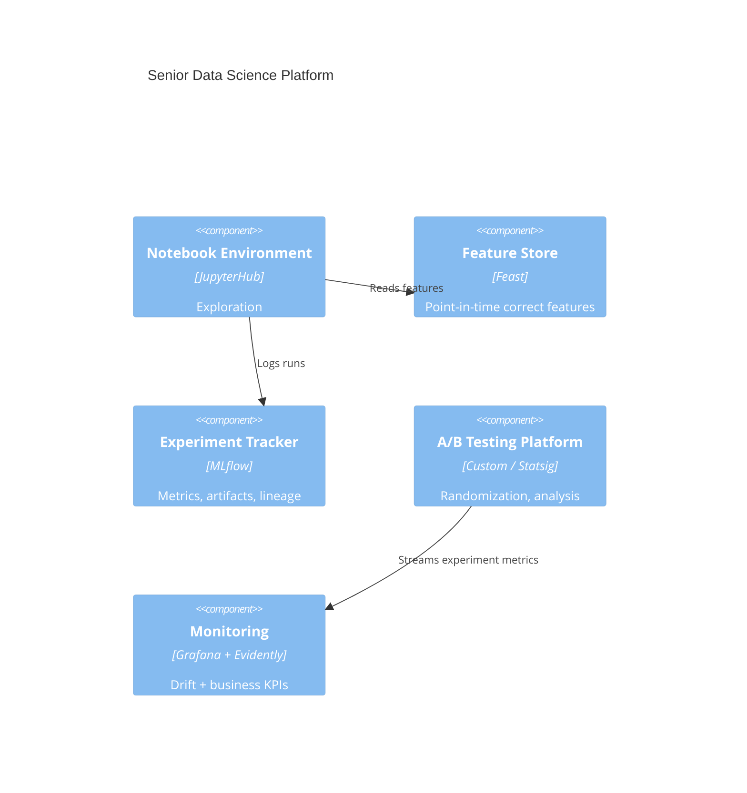

# AI Data Scientist Roadmap — Universal Template

> **A comprehensive template system for generating AI Data Scientist roadmap content across all skill levels.**

---

## Overview

| | Description |
|---|---|
| **Purpose** | Universal template for all AI Data Scientist roadmap topics |
| **Files per topic** | 8 files: `junior.md`, `middle.md`, `senior.md`, `professional.md`, `interview.md`, `tasks.md`, `find-bug.md`, `optimize.md` |
| **Language** | All content must be generated in **English** |
| **Table of Contents** | **Optional** — include only if relevant to the topic. For practice files (`tasks.md`, `find-bug.md`, `optimize.md`) it is NOT required |

### Topic Structure

```
XX-topic-name/
├── junior.md          ← "What?" and "How?"
├── middle.md          ← "Why?" and "When?"
├── senior.md          ← "How to architect?" and "How to scale?"
├── professional.md    ← "Mathematical and Algorithmic Foundations"
├── interview.md       ← Interview prep across all levels
├── tasks.md           ← Hands-on practice tasks
├── find-bug.md        ← Find and fix bugs in analysis and modeling code (10+ exercises)
└── optimize.md        ← Optimize slow/inefficient data science pipelines (10+ exercises)
```

---

## Level Comparison Matrix

| Aspect | Junior | Middle | Senior | Professional |
|:------:|:------:|:------:|:------:|:------------:|
| **Depth** | Basic EDA, simple model training | Feature engineering, model selection, validation | Experimental design, causal inference, platform design | Statistical theory, gradient descent derivation, information theory |
| **Code** | pandas + scikit-learn | Pipeline objects, cross-validation, hyperparameter search | Custom estimators, distributed training, AB testing frameworks | Deriving update rules, information gain proofs, MCMC from scratch |
| **Tricky Points** | Overfitting, wrong metric choice | Data leakage, imbalanced classes | Simpson's paradox, p-hacking, confounding | Asymptotic theory, variance-bias decomposition, identifiability |
| **Focus** | "What?" and "How?" | "Why?" and "When?" | "How to design rigorously?" | "What is the mathematical justification?" |

---
---

# TEMPLATE 1 — `junior.md`

<details open>
<summary><strong>Template Content</strong></summary>

# {{TOPIC_NAME}} — Junior Level

## Table of Contents

1. [Introduction](#introduction)
2. [Prerequisites](#prerequisites)
3. [Glossary](#glossary)
4. [Core Concepts](#core-concepts)
5. [Real-World Analogies](#real-world-analogies)
6. [Mental Models](#mental-models)
7. [Pros & Cons](#pros--cons)
8. [Use Cases](#use-cases)
9. [Code Examples](#code-examples)
10. [Error Handling](#error-handling)
11. [Security Considerations](#security-considerations)
12. [Performance Tips](#performance-tips)
13. [Best Practices](#best-practices)
14. [Edge Cases & Pitfalls](#edge-cases--pitfalls)
15. [Common Mistakes](#common-mistakes)
16. [Tricky Points](#tricky-points)
17. [Test](#test)
18. [Cheat Sheet](#cheat-sheet)
19. [Summary](#summary)
20. [What You Can Build](#what-you-can-build)
21. [Further Reading](#further-reading)

---

## Introduction

> Focus: "What is it?" and "How to use it?"

Brief explanation of what {{TOPIC_NAME}} is in data science and why a beginner needs to know it.
Assume the reader knows basic Python and statistics but has not applied them to real datasets before.

---

## Prerequisites

- **Required:** Python fundamentals — loops, functions, lists, dicts
- **Required:** Basic statistics — mean, variance, probability, distributions
- **Helpful but not required:** Linear algebra basics — vectors and matrices

---

## Glossary

| Term | Definition |
|------|-----------|
| **Feature** | An input variable used to make a prediction |
| **Target** | The output variable the model tries to predict |
| **Overfitting** | When a model memorizes training data but fails on new data |
| **Underfitting** | When a model is too simple to capture the underlying pattern |
| **Cross-validation** | A technique to estimate model performance by splitting data multiple ways |
| **{{Term 6}}** | Simple, one-sentence definition |
| **{{Term 7}}** | Simple, one-sentence definition |

---

## Core Concepts

### Concept 1: {{name}}

Simple explanation with analogy if helpful.

### Concept 2: {{name}}

...

> - Each concept in 3-5 sentences max.
> - Use bullet points for lists.
> - Include small code snippets inline where helpful.

---

## Real-World Analogies

| Concept | Analogy |
|---------|--------|
| **Training a Model** | Like studying for an exam — you learn from past examples to answer new questions |
| **Overfitting** | Like memorizing last year's exam answers verbatim — useless when the questions change |
| **Feature Engineering** | Like summarizing a book into chapter headings — capture the essence, discard the noise |
| **Cross-validation** | Like taking practice tests before the real exam to estimate your true knowledge |

---

## Mental Models

**The intuition:** {{A simple mental model — e.g., "Think of a classifier as a decision boundary drawn in feature space that separates classes."}}

**Why this model helps:** {{Prevents confusion about why more features aren't always better, or why train accuracy differs from test accuracy}}

---

## Pros & Cons

| Pros | Cons |
|------|------|
| {{Advantage 1}} | {{Disadvantage 1}} |
| {{Advantage 2}} | {{Disadvantage 2}} |
| {{Advantage 3}} | {{Disadvantage 3}} |

### When to use:
- {{Scenario where this approach shines}}

### When NOT to use:
- {{Scenario where another approach is better}}

---

## Use Cases

- **{{Use Case 1}}:** {{Brief description}}
- **{{Use Case 2}}:** {{Brief description}}
- **{{Use Case 3}}:** {{Brief description}}
- **{{Use Case 4}}:** {{Brief description}}

---

## Code Examples

```python
# {{TOPIC_NAME}} — minimal working example
import pandas as pd
from sklearn.model_selection import train_test_split
from sklearn.preprocessing import StandardScaler
from sklearn.linear_model import LogisticRegression
from sklearn.metrics import classification_report

df = pd.read_csv("dataset.csv")
X = df.drop(columns=["target"])
y = df["target"]

X_train, X_test, y_train, y_test = train_test_split(
    X, y, test_size=0.2, random_state=42, stratify=y
)

scaler = StandardScaler()
X_train_scaled = scaler.fit_transform(X_train)
X_test_scaled = scaler.transform(X_test)  # transform only, never fit on test

model = LogisticRegression()
model.fit(X_train_scaled, y_train)

print(classification_report(y_test, model.predict(X_test_scaled)))
```

---

## Error Handling

- Check for `NaN` before model training: `df.isnull().sum()`
- Validate that `y` has more than one unique class before classification
- Check for data type mismatches: `df.dtypes` before passing to sklearn

---

## Security Considerations

- Do not train models on data you don't have consent to use
- Remove PII from training datasets before sharing model artifacts
- Be cautious about model inversion attacks — do not expose raw training data through the model API

---

## Performance Tips

- Use `dtype` optimization in pandas: `pd.read_csv(..., dtype={"col": "float32"})`
- Avoid `DataFrame.apply` with Python lambdas — prefer vectorized operations
- Sample a subset for EDA and prototyping; scale up only when the approach is validated

---

## Best Practices

- Always use `random_state` for reproducibility
- Use `stratify=y` in `train_test_split` for classification — preserves class ratios
- Never transform test data with statistics from test data — only from train

---

## Edge Cases & Pitfalls

- **Target leakage** — a feature inadvertently encodes the target variable; e.g., using post-event data
- **Class imbalance** — accuracy metric is misleading; use F1, AUC-ROC, or precision-recall
- **{{Pitfall 3}}** — {{brief explanation}}

---

## Common Mistakes

- Calling `scaler.fit_transform` on the full dataset before the train/test split
- Evaluating on training data and reporting as test performance
- Using default hyperparameters without any tuning or validation

---

## Tricky Points

- {{Tricky behavior 1 specific to {{TOPIC_NAME}}}}
- {{Tricky behavior 2}}

---

## Test

1. What is the difference between overfitting and underfitting?
2. Why must you call `fit` only on training data, not the full dataset?
3. When would you choose AUC-ROC over accuracy as your evaluation metric?
4. {{Question 4}}
5. {{Question 5}}

---

## Cheat Sheet

| Task | Snippet |
|------|---------|
| Load CSV | `pd.read_csv("file.csv")` |
| Check nulls | `df.isnull().sum()` |
| Split data | `train_test_split(X, y, test_size=0.2, stratify=y)` |
| Scale features | `StandardScaler().fit_transform(X_train)` |
| Train model | `model.fit(X_train, y_train)` |
| Evaluate | `classification_report(y_test, y_pred)` |

---

## Summary

{{TOPIC_NAME}} at the junior level is about the core workflow: load → explore → clean → split → encode → train → evaluate. The most important habits are never touching test data during preprocessing and always reporting honest metrics.

---

## What You Can Build

- A churn prediction model for a telecom dataset
- A house price regressor on the Kaggle Housing dataset
- {{Project 3}}

---

## Further Reading

- [Scikit-learn User Guide](https://scikit-learn.org/stable/user_guide.html)
- [Hands-On Machine Learning — Aurélien Géron](https://www.oreilly.com/library/view/hands-on-machine-learning/9781492032632/)
- [Kaggle Learn — Intro to Machine Learning](https://www.kaggle.com/learn/intro-to-machine-learning)

</details>

---
---

# TEMPLATE 2 — `middle.md`

<details open>
<summary><strong>Template Content</strong></summary>

# {{TOPIC_NAME}} — Middle Level

## Table of Contents

1. [Introduction](#introduction)
2. [Prerequisites](#prerequisites)
3. [Deep Dive](#deep-dive)
4. [Architecture Patterns](#architecture-patterns)
5. [Comparison with Alternatives](#comparison-with-alternatives)
6. [Advanced Code Examples](#advanced-code-examples)
7. [Testing Strategy](#testing-strategy)
8. [Observability & Monitoring](#observability--monitoring)
9. [Security](#security)
10. [Performance & Scalability](#performance--scalability)
11. [Anti-Patterns](#anti-patterns)
12. [Tricky Points](#tricky-points)
13. [Cheat Sheet](#cheat-sheet)
14. [Summary](#summary)
15. [Further Reading](#further-reading)

---

## Introduction

> Focus: "Why does this technique work?" and "When should I choose it over alternatives?"

{{TOPIC_NAME}} at the middle level is about making deliberate modeling choices, designing reliable experiments, and building pipelines that are reproducible and production-ready.

---

## Prerequisites

- Junior-level mastery of {{TOPIC_NAME}}
- Solid understanding of bias-variance trade-off
- Experience with at least one end-to-end project
- Familiarity with pandas, scikit-learn, and matplotlib/seaborn

---

## Deep Dive

### Why feature engineering matters more than model choice

{{Explanation of the fact that in most tabular problems, well-engineered features with a linear model beat poor features with a complex model}}

### Model selection and evaluation rigor

{{Explanation of nested cross-validation, holdout sets, and why validation leakage is the #1 source of over-optimistic results}}

### Handling class imbalance

{{Explanation of SMOTE, class weights, threshold optimization, and why accuracy is the wrong metric}}

---

## Architecture Patterns

### Pattern 1: sklearn Pipeline



### Pattern 2: Nested Cross-Validation



### Pattern 3: {{Name}}

{{Description and diagram}}

---

## Comparison with Alternatives

| Approach | Strength | Weakness | Best For |
|----------|----------|----------|----------|
| **Logistic Regression** | Interpretable, fast, calibrated probabilities | Underfits nonlinear relationships | Baselines, regulatory contexts |
| **Gradient Boosting (XGBoost/LightGBM)** | Best tabular performance out-of-the-box | Black box, slow to interpret | Kaggle, business tabular data |
| **Neural Networks** | Handles unstructured data (text, images) | Needs large data, hard to debug | NLP, CV, large-scale tabular |
| **Random Forest** | Robust to outliers, low tuning | Slower than GBDT, higher memory | Medium datasets, quick baselines |
| **{{Alt 5}}** | {{Strength}} | {{Weakness}} | {{Best For}} |

---

## Advanced Code Examples

```python
# Full sklearn pipeline with preprocessing and hyperparameter search
from sklearn.pipeline import Pipeline
from sklearn.compose import ColumnTransformer
from sklearn.preprocessing import StandardScaler, OneHotEncoder
from sklearn.impute import SimpleImputer
from sklearn.ensemble import GradientBoostingClassifier
from sklearn.model_selection import StratifiedKFold, RandomizedSearchCV
from sklearn.metrics import roc_auc_score
import numpy as np

numeric_features = ["age", "income", "tenure"]
categorical_features = ["region", "plan_type"]

numeric_transformer = Pipeline([
    ("imputer", SimpleImputer(strategy="median")),
    ("scaler", StandardScaler()),
])

categorical_transformer = Pipeline([
    ("imputer", SimpleImputer(strategy="most_frequent")),
    ("encoder", OneHotEncoder(handle_unknown="ignore", sparse_output=False)),
])

preprocessor = ColumnTransformer([
    ("num", numeric_transformer, numeric_features),
    ("cat", categorical_transformer, categorical_features),
])

pipeline = Pipeline([
    ("preprocessor", preprocessor),
    ("classifier", GradientBoostingClassifier(random_state=42)),
])

param_dist = {
    "classifier__n_estimators": [100, 300, 500],
    "classifier__max_depth": [3, 5, 7],
    "classifier__learning_rate": [0.01, 0.05, 0.1],
}

cv = StratifiedKFold(n_splits=5, shuffle=True, random_state=42)
search = RandomizedSearchCV(
    pipeline, param_dist, n_iter=20, cv=cv,
    scoring="roc_auc", n_jobs=-1, random_state=42
)
search.fit(X_train, y_train)
print(f"Best CV AUC: {search.best_score_:.4f}")
print(f"Test AUC: {roc_auc_score(y_test, search.predict_proba(X_test)[:, 1]):.4f}")
```

---

## Testing Strategy

| Test Type | What to Test | Tool |
|-----------|-------------|------|
| **Data Schema** | Column names, dtypes, null rates | Pandera, Great Expectations |
| **Feature Ranges** | No unexpected outliers pre-model | pytest + pandas assertions |
| **Model Quality Gate** | AUC / F1 above baseline | pytest with stored baseline metric |
| **Pipeline Serialization** | Saved pipeline produces same output | joblib round-trip test |
| **Statistical Power** | A/B test is powered before launch | scipy.stats.ttest_ind power calculation |

---

## Observability & Monitoring

- Log all hyperparameter search results, not just the winner
- Monitor prediction score distribution in production — shift indicates drift
- Track feature importance stability across retraining runs
- Alert on null rates exceeding a threshold in incoming data

---

## Security

- Sanitize user-provided inputs before feature extraction — adversarial inputs can manipulate model behavior
- Differential privacy techniques if training on sensitive data
- Model output should not expose membership — consider membership inference attack testing

---

## Performance & Scalability

- Use LightGBM over XGBoost for datasets > 1M rows — faster histogram-based algorithm
- Use `n_jobs=-1` in sklearn estimators to parallelize across CPU cores
- For datasets too large for RAM, use Dask DataFrames or PySpark

---

## Anti-Patterns

| Anti-Pattern | Problem | Fix |
|-------------|---------|-----|
| **Leaky validation** | Over-optimistic CV scores | Fit preprocessors inside the pipeline/fold |
| **Report accuracy on imbalanced data** | Misleads stakeholders | Use F1, AUC-PR, or MCC |
| **P-hacking features** | Model doesn't generalize | Pre-register feature hypotheses; use holdout |
| **No baseline** | Can't tell if model is useful | Always compare to majority-class or mean predictor |

---

## Tricky Points

- **Data leakage through time** — for time-series problems, always use `TimeSeriesSplit`, never random split
- **Class weight vs. threshold** — adjusting `class_weight` changes the decision boundary; adjusting the threshold doesn't retrain the model
- {{Tricky point 3}}

---

## Cheat Sheet

| Task | Snippet |
|------|---------|
| Stratified K-fold | `StratifiedKFold(n_splits=5, shuffle=True)` |
| Calibration | `CalibratedClassifierCV(model, cv=5)` |
| Feature importance | `model.feature_importances_` |
| SHAP values | `shap.Explainer(model)(X_test)` |
| Imbalanced classes | `class_weight="balanced"` or SMOTE |

---

## Summary

At the middle level, {{TOPIC_NAME}} is about building robust, reproducible pipelines: use sklearn `Pipeline` to prevent leakage, stratified cross-validation for honest evaluation, and deliberate metric selection that matches the business problem.

---

## Further Reading

- [The Elements of Statistical Learning — Hastie et al.](https://hastie.su.domains/ElemStatLearn/)
- [Feature Engineering for Machine Learning — A. Zheng](https://www.oreilly.com/library/view/feature-engineering-for/9781491953235/)
- [SHAP Documentation](https://shap.readthedocs.io/)

</details>

---
---

# TEMPLATE 3 — `senior.md`

<details open>
<summary><strong>Template Content</strong></summary>

# {{TOPIC_NAME}} — Senior Level

## Table of Contents

1. [Introduction](#introduction)
2. [Experimental Design](#experimental-design)
3. [Causal Inference](#causal-inference)
4. [Advanced Modeling](#advanced-modeling)
5. [System Design for Data Science](#system-design-for-data-science)
6. [Reliability & Reproducibility](#reliability--reproducibility)
7. [Code Examples](#code-examples)
8. [Tricky Points](#tricky-points)
9. [Summary](#summary)

---

## Introduction

> Focus: "How to design experiments rigorously?" and "How to build systems that scale?"

At the senior level, {{TOPIC_NAME}} is about experimental rigor, causal thinking, and designing data science systems that are trustworthy and interpretable under scrutiny.

---

## Experimental Design

### A/B Testing Principles



### Pre-registration

Before running an experiment:
1. Define the primary metric (one, not many)
2. Define the minimum detectable effect (MDE)
3. Calculate required sample size using power analysis
4. Set significance level α = 0.05 and power 1-β = 0.80

### Simpson's Paradox

A trend that appears in aggregated data can reverse when data is stratified by a confounding variable. Always stratify results by key segments before reporting.

---

## Causal Inference

### Correlation vs. Causation



Methods to estimate causal effects:
- **Randomized Controlled Trial (RCT):** Gold standard — randomization eliminates confounders
- **Propensity Score Matching (PSM):** Match treated and control units on covariates
- **Difference-in-Differences (DiD):** Use pre-post comparison with a control group
- **Instrumental Variables (IV):** Use an exogenous instrument to isolate causal effect

---

## Advanced Modeling

### Calibration

```python
from sklearn.calibration import CalibratedClassifierCV, calibration_curve
import matplotlib.pyplot as plt

calibrated = CalibratedClassifierCV(base_model, cv=5, method="isotonic")
calibrated.fit(X_train, y_train)

prob_true, prob_pred = calibration_curve(y_test, calibrated.predict_proba(X_test)[:, 1], n_bins=10)
plt.plot(prob_pred, prob_true, marker="o", label="Calibrated model")
plt.plot([0, 1], [0, 1], linestyle="--", label="Perfect calibration")
plt.legend()
```

### Uncertainty Quantification

```python
# Conformal prediction — model-agnostic prediction intervals
from mapie.regression import MapieRegressor

mapie = MapieRegressor(estimator=base_model, method="plus", cv=5)
mapie.fit(X_train, y_train)
y_pred, y_pis = mapie.predict(X_test, alpha=0.1)
# y_pis gives 90% prediction intervals
```

---

## System Design for Data Science



---

## Reliability & Reproducibility

- **Lock dependency versions:** `pip freeze > requirements.txt` or `poetry.lock`
- **Version datasets:** Store training data as immutable snapshots with checksums
- **Seed everything:** `random.seed`, `np.random.seed`, `torch.manual_seed`
- **Code review for notebooks:** Convert to scripts before merging; use `nbval` for notebook testing

---

## Code Examples

```python
# Power analysis before launching an A/B test
from scipy.stats import norm
import numpy as np

def required_sample_size(
    baseline_rate: float,
    mde: float,         # minimum detectable effect (absolute)
    alpha: float = 0.05,
    power: float = 0.80,
) -> int:
    """Two-sided z-test sample size per group."""
    z_alpha = norm.ppf(1 - alpha / 2)
    z_beta = norm.ppf(power)
    p1 = baseline_rate
    p2 = baseline_rate + mde
    pooled = (p1 + p2) / 2
    n = (z_alpha + z_beta) ** 2 * 2 * pooled * (1 - pooled) / mde ** 2
    return int(np.ceil(n))

n = required_sample_size(baseline_rate=0.05, mde=0.005)
print(f"Required n per group: {n}")
```

---

## Tricky Points

- **Multiple testing problem** — running many metrics in one experiment inflates false positive rate; use Bonferroni or Benjamini-Hochberg correction
- **SUTVA violation** — in network A/B tests, user outcomes can influence each other; use cluster-level randomization
- {{Tricky point 3}}

---

## Summary

At the senior level, {{TOPIC_NAME}} is about designing experiments with rigor, thinking causally, quantifying uncertainty honestly, and building systems that make results reproducible and trustworthy under external scrutiny.

</details>

---
---

# TEMPLATE 4 — `professional.md`

<details open>
<summary><strong>Template Content</strong></summary>

# {{TOPIC_NAME}} — Professional Level: Mathematical and Algorithmic Foundations

## Table of Contents

1. [Introduction](#introduction)
2. [Statistical Theory](#statistical-theory)
3. [Gradient Descent Derivation](#gradient-descent-derivation)
4. [Information Theory](#information-theory)
5. [Experimental Design Theory](#experimental-design-theory)
6. [Deep Code Examples](#deep-code-examples)
7. [Tricky Points](#tricky-points)
8. [Summary](#summary)

---

## Introduction

> Focus: "What is the mathematical justification?" — statistical theory, gradient descent derivation, information theory, experimental design.

This level is for practitioners who want to derive algorithms from first principles, understand asymptotic guarantees, and make theoretically grounded design decisions.

---

## Statistical Theory

### Maximum Likelihood Estimation

For a dataset `X = {x₁, ..., xₙ}` drawn i.i.d. from distribution `p(x; θ)`, MLE finds:

```
θ̂_MLE = argmax_θ Σᵢ log p(xᵢ; θ)
```

**Why log likelihood?** Products of small probabilities underflow. The log is monotone, so maximizing log-likelihood is equivalent.

**Logistic Regression as MLE:**
The cross-entropy loss IS the negative log-likelihood of a Bernoulli distribution:

```
L(θ) = -Σᵢ [yᵢ log σ(θᵀxᵢ) + (1-yᵢ) log(1 - σ(θᵀxᵢ))]
```

Minimizing cross-entropy = maximizing likelihood of the Bernoulli model.

### Bias-Variance Decomposition

For a squared-error regression problem, the expected test error decomposes as:

```
E[(y - ŷ)²] = Bias(ŷ)² + Var(ŷ) + σ²_ε
              ←irreducible noise→
```

**Implications:**
- High-capacity models (deep nets, high-degree polynomials): low bias, high variance
- Low-capacity models (linear regression): high bias, low variance
- Regularization (L2/L1) increases bias but reduces variance — net effect is lower test error when data is limited

### Consistency and Asymptotic Normality

An estimator `θ̂ₙ` is **consistent** if `θ̂ₙ →ᵖ θ₀` as n → ∞. MLE estimators are consistent under mild regularity conditions (Cramér–Rao bound is tight asymptotically).

---

## Gradient Descent Derivation

### From Calculus to the Update Rule

For loss `L(θ)`:
1. A first-order Taylor expansion around the current point: `L(θ + Δθ) ≈ L(θ) + ∇L(θ)ᵀ Δθ`
2. To minimize `L`, choose `Δθ = -η ∇L(θ)` — steepest descent direction
3. This gives the update rule: `θ_{t+1} = θ_t - η ∇_θ L(θ_t)`

```python
# Gradient descent from scratch — logistic regression
import numpy as np

def sigmoid(z):
    return 1 / (1 + np.exp(-z))

def cross_entropy_loss(X, y, theta):
    p = sigmoid(X @ theta)
    return -np.mean(y * np.log(p + 1e-9) + (1 - y) * np.log(1 - p + 1e-9))

def gradient(X, y, theta):
    p = sigmoid(X @ theta)
    return X.T @ (p - y) / len(y)

def gradient_descent(X, y, lr=0.1, epochs=1000):
    theta = np.zeros(X.shape[1])
    for epoch in range(epochs):
        grad = gradient(X, y, theta)
        theta -= lr * grad
        if epoch % 100 == 0:
            print(f"Epoch {epoch}: loss={cross_entropy_loss(X, y, theta):.4f}")
    return theta
```

### Stochastic vs. Mini-Batch vs. Full-Batch

| Method | Gradient Estimate | Noise | Memory | Convergence |
|--------|-------------------|-------|--------|-------------|
| Full-batch GD | Exact | None | O(N) | Slow but smooth |
| Mini-batch SGD | Unbiased | Low | O(B) | Fast, noisy |
| SGD (B=1) | Unbiased | High | O(1) | Fastest per step, noisiest |

The noise in SGD acts as regularization — helps escape local minima.

### Adam Optimizer

Adam combines momentum and adaptive learning rates:

```
m_t = β₁ m_{t-1} + (1-β₁) g_t          # first moment (momentum)
v_t = β₂ v_{t-1} + (1-β₂) g_t²         # second moment (adaptive scale)
m̂_t = m_t / (1 - β₁ᵗ)                  # bias correction
v̂_t = v_t / (1 - β₂ᵗ)
θ_{t+1} = θ_t - η m̂_t / (√v̂_t + ε)
```

Default: β₁=0.9, β₂=0.999, ε=1e-8.

---

## Information Theory

### Entropy

Shannon entropy measures the average uncertainty in a random variable `X`:

```
H(X) = -Σ p(x) log₂ p(x)      [bits]
```

Maximum entropy: uniform distribution. Minimum: deterministic distribution (H=0).

### KL Divergence

```
KL(P || Q) = Σ p(x) log [p(x) / q(x)]
```

KL divergence is NOT symmetric: KL(P||Q) ≠ KL(Q||P). It measures information lost when Q is used to approximate P.

**Cross-entropy as KL divergence:**
```
H(P, Q) = H(P) + KL(P || Q)
```

Minimizing cross-entropy loss is equivalent to minimizing KL(P_data || P_model).

### Mutual Information

```
I(X; Y) = H(X) - H(X|Y) = KL(P(X,Y) || P(X)P(Y))
```

Used in feature selection (maximal information coefficient) and decision tree splitting criteria (information gain).

```python
# Information gain for a split (decision tree criterion)
def entropy(y):
    p = np.bincount(y) / len(y)
    return -np.sum(p * np.log2(p + 1e-9))

def information_gain(y, mask):
    return entropy(y) - (mask.sum()/len(y)) * entropy(y[mask]) \
                      - (~mask).sum()/len(y) * entropy(y[~mask])
```

---

## Experimental Design Theory

### Neyman-Rubin Potential Outcomes Framework

Each unit `i` has two potential outcomes: `Y_i(1)` (treated) and `Y_i(0)` (control). The causal effect for unit `i` is `τᵢ = Y_i(1) - Y_i(0)`, which is fundamentally unobservable (fundamental problem of causal inference).

The Average Treatment Effect (ATE) is:
```
ATE = E[Y(1) - Y(0)]
```

Under random assignment: `E[Y|T=1] - E[Y|T=0]` is an unbiased estimate of ATE.

### Multiple Testing Correction

When testing `m` hypotheses simultaneously, the probability of at least one false positive (family-wise error rate) is `1 - (1-α)^m ≈ mα`.

**Bonferroni correction:** reject at `α/m` — conservative.
**Benjamini-Hochberg (FDR):** controls false discovery rate — less conservative, preferred for feature selection.

```python
from statsmodels.stats.multitest import multipletests

pvalues = [0.001, 0.04, 0.03, 0.20, 0.001]
rejected, pvals_corrected, _, _ = multipletests(pvalues, alpha=0.05, method="fdr_bh")
print(rejected)  # which hypotheses survive FDR correction
```

---

## Deep Code Examples

```python
# Derive linear regression normal equation from first principles
import numpy as np

def ols_fit(X, y):
    """
    Minimize ||y - Xβ||² by setting derivative to zero.
    dL/dβ = -2Xᵀ(y - Xβ) = 0
    → Xᵀy = XᵀXβ
    → β = (XᵀX)⁻¹ Xᵀy
    """
    return np.linalg.solve(X.T @ X, X.T @ y)

# Compare to sklearn
X_with_bias = np.c_[np.ones(len(X_train)), X_train]
beta = ols_fit(X_with_bias, y_train)
```

```python
# Bootstrap confidence interval — non-parametric
def bootstrap_ci(data, stat_fn, n_bootstrap=10_000, alpha=0.05):
    stats = [stat_fn(np.random.choice(data, size=len(data), replace=True))
             for _ in range(n_bootstrap)]
    lower = np.percentile(stats, 100 * alpha / 2)
    upper = np.percentile(stats, 100 * (1 - alpha / 2))
    return lower, upper

ci = bootstrap_ci(y_test, np.mean)
print(f"95% CI for mean: {ci}")
```

---

## Tricky Points

- **Jensen's inequality** — `E[f(X)] ≥ f(E[X])` for convex `f`; this is why cross-entropy of expected predictions is not the same as expected cross-entropy
- **p-hacking** — running many tests and stopping when p < 0.05 inflates false positive rate; pre-registration and correction are mandatory
- **Wrong metric for imbalanced classes** — accuracy reports 99% on a dataset where 99% are negative; use precision-recall AUC or F1
- **Simpson's paradox** — when an aggregate correlation reverses within subgroups; always stratify by confounders before reporting
- **Gradient vanishing in deep nets** — sigmoid activations saturate: `σ'(z) = σ(z)(1-σ(z)) → 0` for large |z|; use ReLU or batch normalization

---

## Summary

The professional level of {{TOPIC_NAME}} shows that the algorithms we apply daily are optimal under specific probabilistic assumptions. Cross-entropy minimizes KL divergence. Gradient descent follows the local steepest descent on the loss manifold. Information gain maximizes the reduction in uncertainty. Understanding these foundations lets you extend, debug, and reason about model behavior in edge cases that the standard toolkit doesn't cover.

</details>

---
---

# TEMPLATE 5 — `interview.md`

<details open>
<summary><strong>Template Content</strong></summary>

# {{TOPIC_NAME}} — Interview Preparation

## Junior Questions

**Q1: What is overfitting and how do you detect it?**
> Overfitting is when the model memorizes training data — high training accuracy but low test accuracy. Detect it by comparing training vs. validation metrics.

**Q2: Why should you use stratified splitting for classification?**
> Stratified splitting preserves the class ratio in train and test sets — critical for imbalanced datasets where random splits can produce a test set with no minority class examples.

**Q3: {{Question}}**
> {{Answer}}

**Q4: {{Question}}**
> {{Answer}}

**Q5: {{Question}}**
> {{Answer}}

---

## Middle Questions

**Q1: Explain data leakage. Give an example.**
> Data leakage is when information from outside the training set contaminates the model, causing inflated validation metrics. Example: fitting a `StandardScaler` on the full dataset before the train/test split leaks test-set statistics into training.

**Q2: How do you handle class imbalance?**
> Approaches: (1) `class_weight="balanced"` — weights loss by inverse class frequency; (2) SMOTE — oversample minority class synthetically; (3) threshold tuning — adjust the decision boundary on the ROC curve; (4) choose the right metric (F1, PR-AUC) instead of accuracy.

**Q3: What is the difference between precision and recall? When would you optimize for each?**
> Precision = TP/(TP+FP) — of all positive predictions, how many were correct. Recall = TP/(TP+FN) — of all actual positives, how many did we catch. Optimize precision when false positives are costly (spam filter). Optimize recall when false negatives are costly (cancer screening).

**Q4: {{Question}}**
> {{Answer}}

---

## Senior Questions

**Q1: How do you design an A/B test from scratch?**
> {{Answer: define hypothesis, primary metric, MDE; power analysis for sample size; randomization unit; guardrail metrics; fixed-horizon test; analysis with two-sided t-test; FDR correction if multiple metrics}}

**Q2: What is Simpson's paradox and how does it affect analysis?**
> {{Answer: aggregate trend reverses within subgroups; example with medical trial; fix by stratifying results; relate to confounding variables}}

**Q3: How would you detect and correct for p-hacking in an analysis?**
> {{Answer: pre-registration, Bonferroni/BH correction, holdout set, single primary metric, sequential testing with alpha-spending}}

**Q4: {{Question}}**
> {{Answer}}

---

## Professional / Theoretical Questions

**Q1: Derive the gradient descent update rule from a Taylor expansion.**
> {{Answer: first-order Taylor expansion, choose Δθ = -η∇L, giving θ_{t+1} = θ_t - η∇L(θ_t)}}

**Q2: Why is minimizing cross-entropy equivalent to minimizing KL divergence from the data distribution?**
> {{Answer: H(P,Q) = H(P) + KL(P||Q); H(P) is fixed w.r.t. model params; so minimizing H(P,Q) minimizes KL(P||Q)}}

**Q3: {{Question}}**
> {{Answer}}

---

## Behavioral / Situational Questions

- Tell me about a time your model performed great in offline evaluation but degraded in production. What was the root cause?
- How do you communicate model uncertainty to a non-technical stakeholder?
- {{Question 3}}

</details>

---
---

# TEMPLATE 6 — `tasks.md`

<details open>
<summary><strong>Template Content</strong></summary>

# {{TOPIC_NAME}} — Hands-On Tasks

> Each task has a difficulty level: 🟢 Beginner · 🟡 Intermediate · 🔴 Advanced

---

## Task 1 — EDA and Baseline Model 🟢

**Goal:** Explore a dataset and build a baseline classification model.

**Requirements:**
- Identify null values, dtypes, and class distribution
- Plot feature distributions and correlation matrix
- Build a logistic regression baseline with `classification_report`
- Report F1 and AUC-ROC (not just accuracy)

---

## Task 2 — sklearn Pipeline with Preprocessing 🟢

**Goal:** Replace ad-hoc preprocessing with a proper sklearn `Pipeline`.

**Requirements:**
- Use `ColumnTransformer` for numeric and categorical features
- All preprocessing steps fit only on training data
- Serialize the full pipeline with `joblib`

---

## Task 3 — Cross-Validation and Hyperparameter Tuning 🟡

**Goal:** Select the best model using nested cross-validation.

**Requirements:**
- Outer loop: `StratifiedKFold(n_splits=5)` for evaluation
- Inner loop: `RandomizedSearchCV` for hyperparameter search
- Report mean ± std of AUC-ROC across outer folds

---

## Task 4 — Imbalanced Classification 🟡

**Goal:** Build a model for a highly imbalanced dataset (1% positive class).

**Requirements:**
- Demonstrate that accuracy is a misleading metric
- Apply at least two strategies: `class_weight`, SMOTE, and threshold tuning
- Compare precision-recall curves across strategies

---

## Task 5 — Feature Importance and SHAP 🟡

**Goal:** Explain model predictions using SHAP values.

**Requirements:**
- Train a GradientBoostingClassifier
- Compute SHAP values for the test set
- Plot SHAP summary plot and one waterfall plot for a single prediction

---

## Task 6 — A/B Test Design and Analysis 🔴

**Goal:** Design and analyze a simulated A/B test.

**Requirements:**
- Define hypothesis and MDE
- Calculate required sample size with power analysis
- Simulate experiment data with a known effect
- Run two-sided t-test and report with confidence interval
- Apply Benjamini-Hochberg correction for 5 secondary metrics

---

## Task 7 — Causal Analysis with Propensity Score Matching 🔴

**Goal:** Estimate the causal effect of a treatment using observational data.

**Requirements:**
- Train a propensity score model (logistic regression)
- Match treated and control units on propensity score
- Estimate ATE and compare to naive difference-in-means

---

## Task 8 — Time-Series Forecasting with Proper Validation 🔴

**Goal:** Build a time-series model without data leakage.

**Requirements:**
- Use `TimeSeriesSplit` — never random split
- Demonstrate leakage in a random-split baseline
- Build a feature-based model with lag features
- Evaluate with MAPE and RMSE on a true holdout window

---

## Task 9 — {{Topic-Specific Task}} 🟡

**Goal:** {{Description}}

**Requirements:**
- {{Requirement 1}}
- {{Requirement 2}}
- {{Requirement 3}}

---

## Task 10 — End-to-End ML Project 🔴

**Goal:** Complete an end-to-end data science project with full rigor.

**Requirements:**
- Data validation (Pandera schema)
- Feature engineering pipeline (sklearn Pipeline)
- Nested cross-validation for honest evaluation
- SHAP-based explanation for top predictions
- MLflow experiment tracking
- Report with confidence intervals, not point estimates

</details>

---
---

# TEMPLATE 7 — `find-bug.md`

<details open>
<summary><strong>Template Content</strong></summary>

# {{TOPIC_NAME}} — Find the Bug

> Each exercise contains broken analysis or modeling code. Find the bug, explain why it's wrong, and write the fix.

---

## Exercise 1 — Data Leakage: Scaler Fit on Full Dataset

**Buggy Code:**

```python
from sklearn.preprocessing import StandardScaler
from sklearn.model_selection import train_test_split

X_scaled = StandardScaler().fit_transform(X)   # BUG
X_train, X_test = train_test_split(X_scaled, test_size=0.2)
```

**What's wrong?**
> The scaler is fit on the full dataset — including the test set. Test statistics (mean, std) contaminate the scaled training features, causing over-optimistic evaluation metrics.

**Fix:**
```python
X_train, X_test = train_test_split(X, test_size=0.2, random_state=42)
scaler = StandardScaler()
X_train_scaled = scaler.fit_transform(X_train)
X_test_scaled = scaler.transform(X_test)   # no fit here
```

---

## Exercise 2 — P-Hacking in A/B Test

**Buggy Code:**

```python
from scipy.stats import ttest_ind

for day in range(1, 31):
    data = experiment_data[experiment_data["day"] <= day]
    control = data[data["group"] == "control"]["metric"]
    treatment = data[data["group"] == "treatment"]["metric"]
    t, p = ttest_ind(control, treatment)
    if p < 0.05:
        print(f"Day {day}: Significant! p={p:.4f}. Ship it.")
        break   # BUG: peeking inflates false positive rate
```

**What's wrong?**
> Repeatedly checking significance and stopping when p < 0.05 (peeking) inflates the Type I error far above 5%. This is p-hacking.

**Fix:**
```python
# Pre-determine sample size and analyze only once at the end
from scipy.stats import ttest_ind

required_n = compute_required_sample_size(baseline=0.05, mde=0.005)
final_data = experiment_data[experiment_data["n_per_group"] >= required_n]
control = final_data[final_data["group"] == "control"]["metric"]
treatment = final_data[final_data["group"] == "treatment"]["metric"]
t, p = ttest_ind(control, treatment)
print(f"Final result: p={p:.4f}")
```

---

## Exercise 3 — Wrong Metric for Imbalanced Class

**Buggy Code:**

```python
from sklearn.metrics import accuracy_score

model.fit(X_train, y_train)
preds = model.predict(X_test)
print(f"Model accuracy: {accuracy_score(y_test, preds):.2%}")
# Output: Model accuracy: 99.10%  — reported as success
```

**What's wrong?**
> The dataset has 99% negative class. A model that predicts all-negative achieves 99% accuracy. Accuracy is misleading on imbalanced datasets.

**Fix:**
```python
from sklearn.metrics import classification_report, roc_auc_score

print(classification_report(y_test, preds))
proba = model.predict_proba(X_test)[:, 1]
print(f"AUC-ROC: {roc_auc_score(y_test, proba):.4f}")
# Also consider: precision_recall_curve, average_precision_score
```

---

## Exercise 4 — Simpson's Paradox Ignored

**Buggy Code:**

```python
# Aggregate analysis only
mean_recovery = df.groupby("treatment")["recovery_rate"].mean()
print(mean_recovery)
# treatment A: 60%, treatment B: 55%
# Conclusion: A is better   # BUG: ignores severity confounder
```

**What's wrong?**
> The aggregate favors treatment A, but when stratified by patient severity, treatment B may be better in both mild and severe groups — Simpson's paradox due to confounding by severity.

**Fix:**
```python
# Always stratify by key confounders
stratified = df.groupby(["treatment", "severity"])["recovery_rate"].mean()
print(stratified)
# Now examine each stratum before drawing conclusions
```

---

## Exercise 5 — Train/Test Split Before Time-Series Feature Engineering

**Buggy Code:**

```python
# Compute 7-day rolling mean on full dataset
df["rolling_mean_7d"] = df["sales"].rolling(7).mean()   # BUG
X_train, X_test = train_test_split(df, test_size=0.2)   # random split
```

**What's wrong?**
> Rolling mean computed on the full dataset before splitting allows future values to leak into the past. A random split compounds this — test rows are interspersed with train rows in time.

**Fix:**
```python
# Split by time first, then compute features
cutoff = df["date"].quantile(0.8)
train_df = df[df["date"] <= cutoff].copy()
test_df = df[df["date"] > cutoff].copy()

train_df["rolling_mean_7d"] = train_df["sales"].rolling(7).mean()
# For test, rolling mean uses only historical (train) context
```

---

## Exercise 6 — Hardcoded Threshold Instead of Optimization

**Buggy Code:**

```python
preds = (model.predict_proba(X_test)[:, 1] > 0.5).astype(int)  # BUG
print(f"F1: {f1_score(y_test, preds):.4f}")
```

**What's wrong?**
> The default threshold of 0.5 is arbitrary. For imbalanced problems, the optimal threshold is almost never 0.5.

**Fix:**
```python
from sklearn.metrics import precision_recall_curve, f1_score
import numpy as np

proba = model.predict_proba(X_test)[:, 1]
precisions, recalls, thresholds = precision_recall_curve(y_test, proba)
f1_scores = 2 * precisions * recalls / (precisions + recalls + 1e-9)
best_threshold = thresholds[np.argmax(f1_scores[:-1])]
preds = (proba >= best_threshold).astype(int)
print(f"Optimal threshold: {best_threshold:.3f}, F1: {f1_score(y_test, preds):.4f}")
```

---

## Exercise 7 — No Baseline Comparison

**Buggy Code:**

```python
model = RandomForestClassifier().fit(X_train, y_train)
print(f"Test F1: {f1_score(y_test, model.predict(X_test)):.4f}")
# Output: 0.72
# Conclusion: model is good   # BUG: no baseline
```

**What's wrong?**
> 0.72 F1 sounds good in isolation, but if a majority-class baseline achieves F1=0.70, the model adds little value.

**Fix:**
```python
from sklearn.dummy import DummyClassifier

dummy = DummyClassifier(strategy="most_frequent").fit(X_train, y_train)
print(f"Baseline F1: {f1_score(y_test, dummy.predict(X_test)):.4f}")
print(f"Model F1: {f1_score(y_test, model.predict(X_test)):.4f}")
```

---

## Exercise 8 — Evaluating on Training Data

**Buggy Code:**

```python
model.fit(X_train, y_train)
print(f"Accuracy: {accuracy_score(y_train, model.predict(X_train)):.4f}")  # BUG
```

**What's wrong?**
> Evaluating on training data measures memorization, not generalization. A model that overfits will report 100% accuracy.

**Fix:**
```python
print(f"Train accuracy: {accuracy_score(y_train, model.predict(X_train)):.4f}")
print(f"Test accuracy: {accuracy_score(y_test, model.predict(X_test)):.4f}")
# A large gap indicates overfitting
```

---

## Exercise 9 — No Random State — Non-Reproducible Results

**Buggy Code:**

```python
from sklearn.model_selection import train_test_split
from sklearn.ensemble import RandomForestClassifier

X_train, X_test, y_train, y_test = train_test_split(X, y, test_size=0.2)
model = RandomForestClassifier(n_estimators=100)
model.fit(X_train, y_train)
```

**What's wrong?**
> No `random_state` means every run produces a different split and a different model. Metrics are non-reproducible — impossible to debug or compare runs.

**Fix:**
```python
X_train, X_test, y_train, y_test = train_test_split(
    X, y, test_size=0.2, random_state=42, stratify=y
)
model = RandomForestClassifier(n_estimators=100, random_state=42)
```

---

## Exercise 10 — {{Topic-Specific Bug}}

**Buggy Code:**

```python
# {{Description of buggy scenario}}
{{buggy code}}
```

**What's wrong?**
> {{Explanation}}

**Fix:**
```python
{{fixed code}}
```

</details>

---
---

# TEMPLATE 8 — `optimize.md`

<details open>
<summary><strong>Template Content</strong></summary>

# {{TOPIC_NAME}} — Optimize

> Each exercise presents slow or memory-inefficient data science code. Profile it, identify the bottleneck, and apply the fix.

---

## Exercise 1 — Slow Feature Computation: Python Loop vs. Vectorized

**Slow Code:**

```python
for i in range(len(df)):
    df.loc[i, "feature"] = expensive_fn(df.loc[i, "a"], df.loc[i, "b"])
```

**Problem:** `.loc` in a loop triggers a full index lookup per row — O(n²) effectively.

**Optimized:**

```python
df["feature"] = np.vectorize(expensive_fn)(df["a"].values, df["b"].values)
# or if truly vectorizable:
df["feature"] = df["a"] / (df["b"] + 1)
```

---

## Exercise 2 — High Memory Usage: Loading Full Dataset

**Slow Code:**

```python
df = pd.read_csv("dataset_10gb.csv")
```

**Problem:** Entire 10GB dataset loaded into RAM — worker crashes on 8GB machines.

**Optimized:**

```python
# Option 1: chunked processing
chunk_results = []
for chunk in pd.read_csv("dataset_10gb.csv", chunksize=100_000):
    chunk_results.append(process(chunk))
result = pd.concat(chunk_results)

# Option 2: dtype optimization reduces memory by ~50%
dtypes = {"user_id": "int32", "amount": "float32", "category": "category"}
df = pd.read_csv("dataset_10gb.csv", dtype=dtypes, usecols=list(dtypes.keys()))
```

---

## Exercise 3 — Slow Training: No Parallelism

**Slow Code:**

```python
model = RandomForestClassifier(n_estimators=500)
model.fit(X_train, y_train)  # single-core, 8 minutes
```

**Optimized:**

```python
model = RandomForestClassifier(n_estimators=500, n_jobs=-1)  # all cores
# Or use LightGBM — faster histogram-based algorithm
import lightgbm as lgb
model = lgb.LGBMClassifier(n_estimators=500, n_jobs=-1)
```

---

## Exercise 4 — Slow Hyperparameter Search: Grid Search

**Slow Code:**

```python
from sklearn.model_selection import GridSearchCV

param_grid = {
    "n_estimators": [100, 200, 300, 500],
    "max_depth": [3, 5, 7, 10],
    "min_samples_leaf": [1, 2, 5, 10],
}
# 4 × 4 × 4 = 64 combinations × 5 folds = 320 fits
search = GridSearchCV(model, param_grid, cv=5)
```

**Optimized:**

```python
from sklearn.model_selection import RandomizedSearchCV
from scipy.stats import randint

param_dist = {
    "n_estimators": randint(100, 600),
    "max_depth": randint(3, 12),
    "min_samples_leaf": randint(1, 20),
}
# 30 random combinations × 5 folds = 150 fits — 53% fewer
search = RandomizedSearchCV(model, param_dist, n_iter=30, cv=5, n_jobs=-1, random_state=42)
```

---

## Exercise 5 — Slow Feature Pipeline: Recomputing on Every Run

**Problem:** A 45-minute feature engineering step runs on every notebook restart.

**Fix:**

```python
import hashlib, joblib, os

def feature_cache(raw_df, compute_fn, cache_dir="feature_cache"):
    os.makedirs(cache_dir, exist_ok=True)
    key = hashlib.md5(pd.util.hash_pandas_object(raw_df).values).hexdigest()
    path = f"{cache_dir}/{key}.pkl"
    if os.path.exists(path):
        return joblib.load(path)
    features = compute_fn(raw_df)
    joblib.dump(features, path)
    return features
```

---

## Exercise 6 — Memory Inefficiency: Storing All Predictions in RAM

**Slow Code:**

```python
all_preds = []
for chunk in data_chunks:   # 10,000 chunks
    all_preds.extend(model.predict(chunk).tolist())  # grows indefinitely
```

**Optimized:**

```python
with open("predictions.csv", "w") as f:
    for chunk in data_chunks:
        preds = model.predict(chunk)
        np.savetxt(f, preds, delimiter=",")
```

---

## Exercise 7 — Slow Cross-Validation: Sequential Folds

**Slow Code:**

```python
from sklearn.model_selection import cross_val_score
scores = cross_val_score(model, X, y, cv=10)   # sequential by default
```

**Optimized:**

```python
scores = cross_val_score(model, X, y, cv=10, n_jobs=-1)  # parallel folds
```

---

## Exercise 8 — Slow SHAP: Computing All Features

**Slow Code:**

```python
import shap
explainer = shap.Explainer(model)
shap_values = explainer(X_test)   # X_test has 100,000 rows — takes 20 minutes
```

**Optimized:**

```python
# Subsample for global analysis; use full set only for critical predictions
sample_idx = np.random.choice(len(X_test), size=1000, replace=False)
shap_values = explainer(X_test.iloc[sample_idx])
shap.summary_plot(shap_values)
```

---

## Exercise 9 — Inefficient Pandas Merge: No Index

**Slow Code:**

```python
result = df1.merge(df2, on="user_id")   # O(n×m) without index
```

**Optimized:**

```python
df1 = df1.set_index("user_id")
df2 = df2.set_index("user_id")
result = df1.join(df2, how="inner")  # hash join on index — O(n)
```

---

## Exercise 10 — {{Topic-Specific Optimization}}

**Slow Code:**

```python
# {{Description of inefficient code}}
{{slow code}}
```

**Problem:** {{Explanation of bottleneck}}

**Optimized:**

```python
{{optimized code}}
```

**Measurement:** Before: `{{baseline}}` · After: `{{improved}}`

</details>
