# AI Data Scientist Roadmap — Universal Template

> **A comprehensive template system for generating AI Data Scientist roadmap content across all skill levels.**

---

## Overview

| | Description |
|---|---|
| **Purpose** | Universal template for all AI Data Scientist roadmap topics |
| **Files per topic** | 8 files: `junior.md`, `middle.md`, `senior.md`, `professional.md`, `interview.md`, `tasks.md`, `find-bug.md`, `optimize.md` |
| **Language** | All content must be generated in **English** |
| **Table of Contents** | **Optional** — include only if relevant to the topic. For practice files (`tasks.md`, `find-bug.md`, `optimize.md`) it is NOT required |

### Topic Structure

```
XX-topic-name/
├── junior.md          ← "What?" and "How?"
├── middle.md          ← "Why?" and "When?"
├── senior.md          ← "How to architect?" and "How to scale?"
├── professional.md    ← "Mathematical and Algorithmic Foundations"
├── interview.md       ← Interview prep across all levels
├── tasks.md           ← Hands-on practice tasks
├── find-bug.md        ← Find and fix bugs in analysis and modeling code (10+ exercises)
└── optimize.md        ← Optimize slow/inefficient data science pipelines (10+ exercises)
```

---

## Level Comparison Matrix

| Aspect | Junior | Middle | Senior | Professional |
|:------:|:------:|:------:|:------:|:------------:|
| **Depth** | Basic EDA, simple model training | Feature engineering, model selection, validation | MLOps, experiment design, causal inference | Statistical theory, gradient derivations, information theory |
| **Code** | pandas + scikit-learn basics | Pipeline objects, cross-validation, MLflow | Custom estimators, distributed compute, A/B frameworks | Deriving update rules, proofs, numerical methods from scratch |
| **Tricky Points** | Overfitting, wrong metric choice | Data leakage, imbalanced classes | Simpson's paradox, p-hacking, confounding | Variance-bias decomposition, identifiability, convergence |
| **Focus** | "What?" and "How?" | "Why?" and "When?" | "How to design rigorously?" | "What is the mathematical justification?" |

---
---

# TEMPLATE 1 — `junior.md`

<details open>
<summary><strong>Template Content</strong></summary>

# {{TOPIC_NAME}} — Junior Level

<!-- Table of Contents is OPTIONAL. Include only if the topic has many sections and it helps navigation. Remove this section entirely if not needed. -->

## Table of Contents

1. [Introduction](#introduction)
2. [Prerequisites](#prerequisites)
3. [Glossary](#glossary)
4. [Core Concepts](#core-concepts)
5. [Real-World Analogies](#real-world-analogies)
6. [Mental Models](#mental-models)
7. [Pros & Cons](#pros--cons)
8. [Use Cases](#use-cases)
9. [Code Examples](#code-examples)
10. [Coding Patterns](#coding-patterns)
11. [Clean Code](#clean-code)
12. [Product Use / Feature](#product-use--feature)
13. [Data Quality and Model Failure Handling](#data-quality-and-model-failure-handling)
14. [Security Considerations](#security-considerations)
15. [Performance Tips](#performance-tips)
16. [Metrics & Analytics](#metrics--analytics)
17. [Best Practices](#best-practices)
18. [Edge Cases & Pitfalls](#edge-cases--pitfalls)
19. [Common Mistakes](#common-mistakes)
20. [Common Misconceptions](#common-misconceptions)
21. [Tricky Points](#tricky-points)
22. [Test](#test)
23. [What If? Scenarios](#what-if-scenarios)
24. [Tricky Questions](#tricky-questions)
25. [Cheat Sheet](#cheat-sheet)
26. [Self-Assessment Checklist](#self-assessment-checklist)
27. [Summary](#summary)
28. [What You Can Build](#what-you-can-build)
29. [Further Reading](#further-reading)
30. [Related Topics](#related-topics)
31. [Diagrams & Visual Aids](#diagrams--visual-aids)

---

## Introduction

> Focus: "What is it?" and "How to use it?"

Brief explanation of what {{TOPIC_NAME}} is in data science and why a beginner needs to know it.
Assume the reader knows basic Python and math but has never applied them to real datasets.

Key questions answered at this level:
- What problem does {{TOPIC_NAME}} solve?
- What Python libraries are involved?
- How do I run my first experiment?

---

## Prerequisites

What you should know before studying this topic:

- **Required:** Python fundamentals — functions, lists, dicts, loops
- **Required:** Basic statistics — mean, median, standard deviation, distributions
- **Required:** NumPy basics — arrays, vectorized operations
- **Helpful but not required:** Linear algebra — vectors and matrix multiplication

> List 2-4 prerequisites. Link to related roadmap topics if available.

---

## Glossary

Key terms used in this topic:

| Term | Definition |
|------|-----------|
| **Feature** | An input variable used to train or make predictions |
| **Target** | The output variable the model tries to predict |
| **Overfitting** | When a model memorizes training data and fails on new data |
| **Underfitting** | When a model is too simple to capture the underlying pattern |
| **EDA** | Exploratory Data Analysis — inspecting data before modeling |
| **Train/Test Split** | Dividing data into a training set and a held-out evaluation set |
| **{{Term 7}}** | Simple, one-sentence definition |
| **{{Term 8}}** | Simple, one-sentence definition |

> 6-10 terms. Keep definitions beginner-friendly.

---

## Core Concepts

### Concept 1: Python Data Science Stack (NumPy, Pandas, Matplotlib)

The three foundational libraries every data scientist uses:

- **NumPy** — fast numerical arrays and math operations
- **Pandas** — tabular data manipulation with DataFrames
- **Matplotlib / Seaborn** — data visualization

```python
import numpy as np
import pandas as pd
import matplotlib.pyplot as plt

arr = np.array([1, 2, 3, 4, 5])
print(arr.mean(), arr.std())   # 3.0  1.4142...

df = pd.DataFrame({"x": arr, "y": arr ** 2})
df.plot(x="x", y="y", title="y = x^2")
plt.show()
```

### Concept 2: Loading and Exploring Datasets

Before modeling, always understand your data:

```python
df = pd.read_csv("data.csv")

print(df.shape)          # (rows, columns)
print(df.dtypes)         # column data types
print(df.isnull().sum()) # missing values per column
print(df.describe())     # basic statistics
```

### Concept 3: Basic Statistics in Data Science

```text
Mean:   μ = (1/n) Σ xᵢ
Std:    σ = sqrt((1/n) Σ (xᵢ - μ)²)
Median: middle value of sorted data
```

Understanding these helps you detect anomalies and choose the right preprocessing.

### Concept 4: Train/Test Split

```python
from sklearn.model_selection import train_test_split

X_train, X_test, y_train, y_test = train_test_split(
    X, y, test_size=0.2, random_state=42, stratify=y
)
# stratify=y preserves class proportions in both splits
```

### Concept 5: First ML Model with scikit-learn

```python
from sklearn.linear_model import LogisticRegression
from sklearn.metrics import classification_report

model = LogisticRegression()
model.fit(X_train, y_train)
y_pred = model.predict(X_test)

print(classification_report(y_test, y_pred))
```

### Concept 6: Reading Metrics (Accuracy, Precision, Recall, F1)

```text
Accuracy  = correct predictions / total predictions
Precision = TP / (TP + FP)   ← "of what I predicted positive, how many are right?"
Recall    = TP / (TP + FN)   ← "of all actual positives, how many did I find?"
F1        = 2 * (P * R) / (P + R)   ← harmonic mean of precision and recall
```

> Each concept should be explained in 3-5 sentences max.

---

## Real-World Analogies

| Concept | Analogy |
|---------|--------|
| **Training a Model** | Studying for an exam — you learn from past examples to answer new questions |
| **Overfitting** | Memorizing last year's exam verbatim — useless when questions change |
| **Feature Engineering** | Summarizing a book into chapter headings — capture the essence, discard noise |
| **Train/Test Split** | Using practice tests before the real exam to estimate your true knowledge |
| **Precision vs Recall** | A doctor who only diagnoses cancer when 100% sure (high precision, low recall) vs one who flags everyone (high recall, low precision) |

> 3-5 analogies. Mention where the analogy breaks down.

---

## Mental Models

**The intuition:** Think of a supervised ML model as a function approximator — given labeled examples, it learns a mapping `f(X) → y` that generalizes to unseen X.

**Why this model helps:** It explains why we need a test set (to measure generalization), why more data generally helps, and why the features you give the model matter more than the algorithm you choose.

> 1-2 mental models. Strong mental models prevent common mistakes.

---

## Pros & Cons

| Pros | Cons |
|------|------|
| {{Advantage 1}} | {{Disadvantage 1}} |
| {{Advantage 2}} | {{Disadvantage 2}} |
| {{Advantage 3}} | {{Disadvantage 3}} |

### When to use:
- {{Scenario where this approach shines}}

### When NOT to use:
- {{Scenario where another approach is better}}

---

## Use Cases

When and where you would use this in real projects:

- **Use Case 1:** {{Description}} — e.g., "Predicting customer churn from behavioral features"
- **Use Case 2:** {{Description}}
- **Use Case 3:** {{Description}}
- **Use Case 4:** {{Description}}

> Keep it practical — things a junior data scientist would encounter.

---

## Code Examples

### Example 1: Exploratory Data Analysis (EDA)

```python
import pandas as pd
import matplotlib.pyplot as plt
import seaborn as sns

df = pd.read_csv("titanic.csv")

# Shape and types
print(df.shape)
print(df.dtypes)

# Missing values
print(df.isnull().sum())

# Distribution of numeric columns
df.hist(figsize=(12, 8))
plt.tight_layout()
plt.show()

# Correlation heatmap
sns.heatmap(df.corr(numeric_only=True), annot=True, cmap="coolwarm")
plt.title("Feature Correlations")
plt.show()
```

**What it does:** Gives a complete picture of data shape, types, missing values, distributions, and correlations.
**How to run:** `python eda.py`

### Example 2: Full Minimal Pipeline — Load, Split, Train, Evaluate

```python
import pandas as pd
from sklearn.model_selection import train_test_split
from sklearn.preprocessing import StandardScaler
from sklearn.linear_model import LogisticRegression
from sklearn.metrics import classification_report, confusion_matrix

# Load
df = pd.read_csv("dataset.csv")
X = df.drop(columns=["target"])
y = df["target"]

# Split
X_train, X_test, y_train, y_test = train_test_split(
    X, y, test_size=0.2, random_state=42, stratify=y
)

# Scale — fit ONLY on train, transform both
scaler = StandardScaler()
X_train = scaler.fit_transform(X_train)
X_test  = scaler.transform(X_test)      # NEVER fit on test data

# Train
model = LogisticRegression(max_iter=1000)
model.fit(X_train, y_train)

# Evaluate
y_pred = model.predict(X_test)
print(classification_report(y_test, y_pred))
print(confusion_matrix(y_test, y_pred))
```

**What it does:** End-to-end supervised classification pipeline.

> Every example must be runnable. Add comments explaining each important line.

---

## Coding Patterns

Common patterns beginners encounter when working with {{TOPIC_NAME}}:

### Pattern 1: Load → Clean → Split → Scale → Model → Evaluate

**Intent:** Structure every data science project reproducibly.
**When to use:** Any supervised learning task.

```python
# 1. Load
df = pd.read_csv("data.csv")

# 2. Clean (drop or impute missing values)
df = df.dropna()

# 3. Split features and target
X, y = df.drop("target", axis=1), df["target"]

# 4. Train/test split
X_train, X_test, y_train, y_test = train_test_split(X, y, test_size=0.2, random_state=42)

# 5. Scale
from sklearn.preprocessing import StandardScaler
scaler = StandardScaler()
X_train = scaler.fit_transform(X_train)
X_test  = scaler.transform(X_test)

# 6. Train
from sklearn.ensemble import RandomForestClassifier
model = RandomForestClassifier(random_state=42)
model.fit(X_train, y_train)

# 7. Evaluate
from sklearn.metrics import f1_score
print("F1:", f1_score(y_test, model.predict(X_test)))
```

**Diagram:**

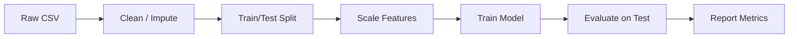

**Remember:** Fit the scaler only on training data — otherwise you leak test information.

---

### Pattern 2: Confusion Matrix Interpretation

**Intent:** Go beyond accuracy to understand where the model fails.

```python
from sklearn.metrics import ConfusionMatrixDisplay, confusion_matrix
import matplotlib.pyplot as plt

cm = confusion_matrix(y_test, y_pred)
ConfusionMatrixDisplay(cm, display_labels=model.classes_).plot()
plt.title("Confusion Matrix")
plt.show()
```

**Diagram:**

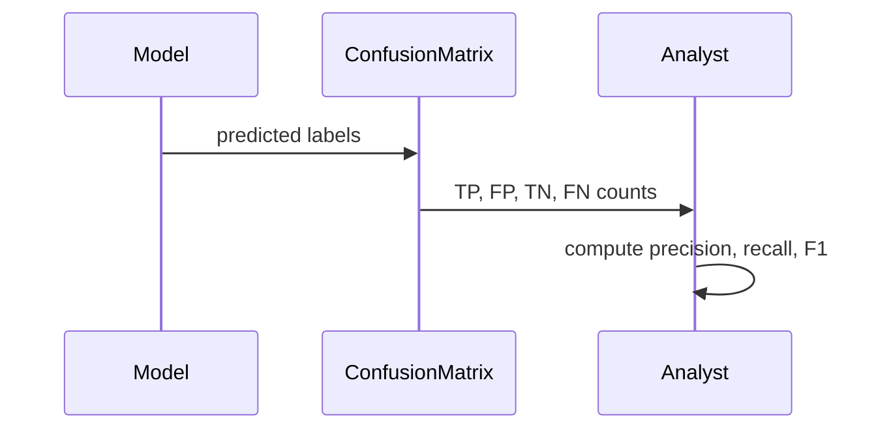

> Include 2-3 patterns at junior level. Keep diagrams simple.

---

## Clean Code

Basic clean code principles when working with {{TOPIC_NAME}}:

### Naming

```python
# Bad naming
def proc(d):
    return d.dropna()

t = pd.read_csv("f.csv")

# Clean naming
def remove_missing_rows(df: pd.DataFrame) -> pd.DataFrame:
    return df.dropna()

titanic_df = pd.read_csv("titanic.csv")
```

**Rules:**
- DataFrames: use descriptive names (`titanic_df`, `sales_df`, not `df`, `d`, `data`)
- Functions: describe WHAT they do (`compute_f1_score`, not `calc`, `do_stuff`)
- Booleans: use `is_`, `has_` prefix (`is_trained`, `has_missing_values`)

---

### Functions

```python
# Bad — one giant function
def run(df):
    df = df.dropna()
    X = df.drop("target", axis=1)
    y = df["target"]
    X_train, X_test, y_train, y_test = train_test_split(X, y)
    scaler = StandardScaler()
    X_train = scaler.fit_transform(X_train)
    X_test  = scaler.transform(X_test)
    model = LogisticRegression()
    model.fit(X_train, y_train)
    print(classification_report(y_test, model.predict(X_test)))

# Clean — single responsibility
def preprocess(df):           ...
def split_features_target(df): ...
def scale_features(X_train, X_test): ...
def train_model(X_train, y_train):   ...
def evaluate(model, X_test, y_test): ...
```

**Rule:** If a function does more than one thing — split it.

---

### Comments

```python
# Bad — states the obvious
# drop nulls
df = df.dropna()

# Good — explains WHY
# Drop rows with missing target; imputing target values would introduce bias
df = df.dropna(subset=["target"])
```

> Good code explains itself. Comments explain **why**, not **what**.

---

## Product Use / Feature

How this topic is used in real-world products and tools:

### 1. Netflix Recommendation System

- **How it uses {{TOPIC_NAME}}:** Trains collaborative filtering models on user-watch history
- **Why it matters:** Personalized recommendations drive 80% of content discovery

### 2. Kaggle Competitions

- **How it uses {{TOPIC_NAME}}:** Competitors apply EDA, feature engineering, and model evaluation to win on held-out test sets
- **Why it matters:** Gold standard for benchmarking data science skills

### 3. scikit-learn

- **How it uses {{TOPIC_NAME}}:** Provides consistent `fit/predict` API for dozens of algorithms
- **Why it matters:** Industry-standard tool for every junior data scientist

> 3-5 real products/tools. Show how the topic is applied in industry.

---

## Data Quality and Model Failure Handling

How to handle data quality issues and model errors when working with {{TOPIC_NAME}}:

### Error 1: Missing Values in Features

```python
# Code that produces this error
model.fit(X_train, y_train)
# ValueError: Input contains NaN
```

**Why it happens:** scikit-learn estimators do not handle NaN by default.
**How to fix:**

```python
from sklearn.impute import SimpleImputer

imputer = SimpleImputer(strategy="median")
X_train = imputer.fit_transform(X_train)
X_test  = imputer.transform(X_test)
```

### Error 2: Wrong Feature Count at Prediction Time

```python
# Trained on 10 features, predicting with 9
model.predict(X_new)  # ValueError: X has 9 features but model expects 10
```

**Why it happens:** Feature list changed between training and inference.
**How to fix:** Save feature names and validate before prediction.

```python
feature_names = X_train.columns.tolist()
assert list(X_new.columns) == feature_names, "Feature mismatch!"
```

### Error 3: Fitting the Scaler on Test Data

```python
# Bad — data leakage
scaler.fit_transform(X_test)

# Good — transform only
scaler.transform(X_test)
```

> 2-4 common errors. Show the error, explain why, and provide the fix.

---

## Security Considerations

Security aspects when working with {{TOPIC_NAME}}:

### 1. Model Inversion Attacks

```python
# Risk: A deployed model can be queried to reconstruct training data
# Mitigation: Limit prediction confidence in API responses
# Instead of returning raw probabilities, return only class labels
```

**Risk:** Exposure of sensitive training data through repeated model queries.
**Mitigation:** Rate limiting, output perturbation (differential privacy), or returning only top-1 label.

### 2. Training Data Privacy

```python
# Risk: PII in training data
# Mitigation: Anonymize before training
df["email"] = df["email"].apply(lambda x: hash(x))
df = df.drop(columns=["ssn", "phone"])
```

> 2-3 security considerations relevant to data science pipelines.

---

## Performance Tips

Basic performance considerations for {{TOPIC_NAME}}:

### Tip 1: Use Vectorized Operations Instead of Loops

```python
# Slow — Python loop
result = []
for val in df["price"]:
    result.append(val * 1.1)

# Fast — vectorized
df["price_with_tax"] = df["price"] * 1.1
```

**Why it's faster:** NumPy/Pandas operations are implemented in C under the hood.

### Tip 2: Use `sample()` for Quick EDA on Large Datasets

```python
# Instead of loading 10M rows for exploration
sample_df = df.sample(n=10000, random_state=42)
sample_df.describe()
```

> 2-4 tips. Focus on tips that are always applicable.

---

## Metrics & Analytics

Key metrics to track when evaluating {{TOPIC_NAME}}:

### What to Measure

| Metric | Why it matters | When to use |
|--------|---------------|-------------|
| **Accuracy** | Overall correctness | Balanced classes only |
| **F1 Score** | Balance of precision/recall | Imbalanced classes |
| **ROC-AUC** | Discrimination ability | Binary classification |
| **MAE / RMSE** | Prediction error magnitude | Regression tasks |

### Basic Instrumentation

```python
from sklearn.metrics import accuracy_score, f1_score, roc_auc_score

acc   = accuracy_score(y_test, y_pred)
f1    = f1_score(y_test, y_pred, average="weighted")
auc   = roc_auc_score(y_test, model.predict_proba(X_test)[:, 1])

print(f"Accuracy: {acc:.3f}, F1: {f1:.3f}, AUC: {auc:.3f}")
```

> Keep it simple — 2-3 metrics that tell you "is it working?".

---

## Best Practices

- **Always split before scaling:** Fit the scaler on training data only — never on the full dataset or test set.
- **Use `stratify=y` in train_test_split:** Preserve class proportions when splitting.
- **Report multiple metrics:** Accuracy alone is misleading on imbalanced datasets — always report F1 or AUC.
- **Version your data:** Save the dataset version used for each experiment so results are reproducible.
- **Set `random_state`:** For reproducible splits and model initialization.

---

## Edge Cases & Pitfalls

### Pitfall 1: Scaling Before Splitting

```python
# Bad — scaler sees test data distribution
scaler = StandardScaler()
X_all_scaled = scaler.fit_transform(X)
X_train, X_test = train_test_split(X_all_scaled, ...)

# Good — fit only on train
X_train, X_test, y_train, y_test = train_test_split(X, y, ...)
X_train = scaler.fit_transform(X_train)
X_test  = scaler.transform(X_test)
```

**What happens:** Information from the test set leaks into training via the scaler's mean/std.
**How to fix:** Always split first, scale after.

### Pitfall 2: Using Accuracy on Imbalanced Data

**What happens:** A model that always predicts the majority class gets 95% accuracy on a 95/5 split.
**How to fix:** Use F1 score, AUC-ROC, or `balanced_accuracy_score` instead.

---

## Common Mistakes

### Mistake 1: Calling `fit_transform` on Test Data

```python
# Wrong
X_test_scaled = scaler.fit_transform(X_test)

# Correct
X_test_scaled = scaler.transform(X_test)
```

### Mistake 2: Not Setting `random_state`

```python
# Wrong — different results every run
X_train, X_test, ... = train_test_split(X, y)

# Correct
X_train, X_test, ... = train_test_split(X, y, random_state=42)
```

### Mistake 3: Reporting Only Training Accuracy

```python
# Wrong — this is not generalization performance
print("Accuracy:", model.score(X_train, y_train))

# Correct
print("Test Accuracy:", model.score(X_test, y_test))
```

---

## Common Misconceptions

### Misconception 1: "More features always mean better models"

**Reality:** Adding irrelevant or redundant features adds noise and can worsen performance (curse of dimensionality).

**Why people think this:** Intuitively, more information seems helpful. But models can't always tell signal from noise.

### Misconception 2: "High accuracy means the model is good"

**Reality:** On a dataset where 99% of samples are class 0, predicting class 0 always achieves 99% accuracy but learns nothing useful.

> 2-4 misconceptions. These are conceptual misunderstandings, not just code errors.

---

## Tricky Points

### Tricky Point 1: `fit_transform` vs `transform`

```python
# This looks equivalent but is not:
scaler.fit_transform(X_test)   # modifies scaler's internal state
scaler.transform(X_test)       # uses previously computed mean/std
```

**Why it's tricky:** Both return the same shape — the bug is invisible until you deploy.
**Key takeaway:** After training, always use `.transform()` on new data, never `.fit_transform()`.

### Tricky Point 2: `stratify=y` Matters for Small Datasets

```python
# Without stratify — one class might be missing from test set entirely
X_train, X_test, y_train, y_test = train_test_split(X, y, test_size=0.2)

# With stratify — class ratios are preserved
X_train, X_test, y_train, y_test = train_test_split(X, y, test_size=0.2, stratify=y)
```

---

## Test

### Multiple Choice

**1. You train a model and get 99% accuracy on a binary classification problem. What should you check first?**

- A) The model architecture
- B) Whether the dataset is imbalanced
- C) The learning rate
- D) Whether dropout is applied

<details>
<summary>Answer</summary>
**B)** — High accuracy on imbalanced data is misleading. A naive classifier that always predicts the majority class can achieve 99% if one class makes up 99% of the data.
</details>

**2. You apply `StandardScaler().fit_transform()` to the entire dataset before splitting. What is the problem?**

- A) The scaler will produce wrong results
- B) The model will fail to converge
- C) Test data statistics leak into the scaler's learned mean and std
- D) There is no problem

<details>
<summary>Answer</summary>
**C)** — The scaler computes statistics over the entire dataset including test data. This leaks future information and inflates validation scores.
</details>

### True or False

**3. F1 score is always better than accuracy as a metric.**

<details>
<summary>Answer</summary>
**False** — For perfectly balanced datasets, accuracy is fine. F1 is preferred when class imbalance exists or when false positives and false negatives have different costs.
</details>

### What's the Output?

**4. What does this code print?**

```python
from sklearn.preprocessing import StandardScaler
import numpy as np

X_train = np.array([[1.0], [2.0], [3.0]])
X_test  = np.array([[4.0], [5.0]])

scaler = StandardScaler()
X_train_s = scaler.fit_transform(X_train)

# Intentional mistake:
X_test_s = scaler.fit_transform(X_test)
print(scaler.mean_)
```

<details>
<summary>Answer</summary>
Output: `[4.5]`
Explanation: The scaler was re-fitted on X_test (mean = (4+5)/2 = 4.5). The original mean from X_train (2.0) was overwritten — this is the data leakage / refit bug.
</details>

> 5-8 test questions total. Mix of multiple choice, true/false, and "what's the output".

---

## "What If?" Scenarios

**What if you forget `stratify=y` and one class is completely absent from the test set?**
- **You might think:** The model will still train fine.
- **But actually:** `f1_score` will warn about undefined precision, and your evaluation is meaningless.

**What if you have 10,000 features and only 100 rows?**
- **You might think:** More features always help.
- **But actually:** The model massively overfits. This is the high-dimensional, low-sample regime — use regularization or dimensionality reduction first.

---

## Tricky Questions

**1. A colleague trains a model, evaluates on the test set, adjusts hyperparameters, and evaluates again on the same test set. What is wrong?**

- A) Nothing is wrong
- B) The model will underfit
- C) The test set has become a validation set — future performance will be overestimated
- D) The learning rate needs adjustment

<details>
<summary>Answer</summary>
**C)** — Once you make decisions based on test set performance, it effectively becomes a validation set. True generalization performance is no longer measurable.
</details>

---

## Cheat Sheet

Quick reference for this topic:

| What | Code | Notes |
|------|------|-------|
| Load CSV | `pd.read_csv("file.csv")` | Check encoding for non-ASCII |
| Check missing | `df.isnull().sum()` | Per-column counts |
| Train/test split | `train_test_split(X, y, test_size=0.2, stratify=y)` | Always stratify for classification |
| Scale features | `scaler.fit_transform(X_train)` + `scaler.transform(X_test)` | Fit on train only |
| Evaluate | `classification_report(y_test, y_pred)` | Shows P, R, F1 per class |
| Feature importance | `model.feature_importances_` | For tree-based models |

---

## Self-Assessment Checklist

### I can explain:
- [ ] What {{TOPIC_NAME}} is and why it exists
- [ ] When to use accuracy vs F1 vs AUC
- [ ] Why we split data before scaling
- [ ] What overfitting and underfitting mean

### I can do:
- [ ] Load a CSV and run basic EDA
- [ ] Create a train/test split correctly
- [ ] Train a logistic regression or random forest
- [ ] Interpret a classification report

### I can answer:
- [ ] All multiple choice questions in this document
- [ ] "What's the output?" questions correctly

---

## Summary

- NumPy, Pandas, and Matplotlib are the three pillars of the Python data science stack.
- Always perform EDA before modeling — understand your data's shape, types, and missing values.
- Split data before applying any transformation to prevent data leakage.
- Use multiple metrics (F1, AUC) instead of relying on accuracy alone.

**Next step:** Feature engineering, cross-validation, and model comparison (middle level).

---

## What You Can Build

### Projects you can create:
- **{{Project 1}}:** End-to-end classification pipeline on a public dataset (Titanic, Iris, Heart Disease)
- **{{Project 2}}:** EDA report using pandas-profiling or ydata-profiling
- **{{Project 3}}:** Regression pipeline predicting house prices from features

### Technologies / tools that use this:
- **scikit-learn** — standard API for all supervised learning tasks
- **Kaggle** — competitive benchmarking on real datasets
- **pandas** — the universal tool for data manipulation

### Learning path — what to study next:

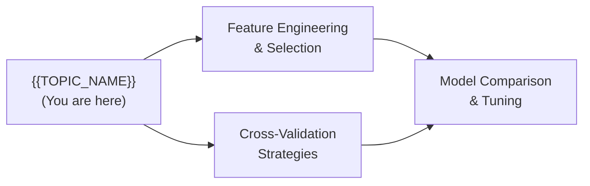

---

## Further Reading

- **Official docs:** [scikit-learn User Guide](https://scikit-learn.org/stable/user_guide.html)
- **Book:** *Hands-On Machine Learning* by Aurélien Géron — Chapter 1-3
- **Video:** Andrej Karpathy's Neural Networks Zero to Hero (context for why ML works)
- **Blog:** [Towards Data Science](https://towardsdatascience.com) — practical beginner tutorials

---

## Related Topics

- **[Feature Engineering](../feature-engineering/)** — how it connects to improving model inputs
- **[Cross-Validation](../cross-validation/)** — more rigorous model evaluation
- **[EDA](../eda/)** — deeper dive into exploratory analysis

---

## Diagrams & Visual Aids

> Include **at least 2-3 visual aids** per document.

### Mind Map

```mermaid
mindmap
  root(({{TOPIC_NAME}}))
    Data Loading
      pandas read_csv
      data types
      missing values
    EDA
      describe
      histograms
      correlation
    Modeling
      train/test split
      scaling
      fit/predict
    Evaluation
      accuracy
      precision
      recall
      F1
```

### ML Pipeline Flowchart

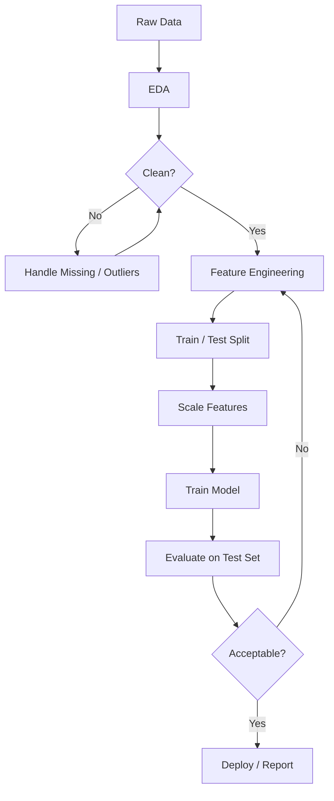

</details>

---
---

# TEMPLATE 2 — `middle.md`

<details open>
<summary><strong>Template Content</strong></summary>

# {{TOPIC_NAME}} — Middle Level

<!-- Table of Contents is OPTIONAL. Include only if the topic has many sections and it helps navigation. Remove this section entirely if not needed. -->

## Table of Contents

1. [Introduction](#introduction)
2. [Core Concepts](#core-concepts)
3. [Evolution & Historical Context](#evolution--historical-context)
4. [Pros & Cons](#pros--cons)
5. [Alternative Approaches (Plan B)](#alternative-approaches-plan-b)
6. [Use Cases](#use-cases)
7. [Code Examples](#code-examples)
8. [Coding Patterns](#coding-patterns)
9. [Clean Code](#clean-code)
10. [Product Use / Feature](#product-use--feature)
11. [Data Quality and Model Failure Handling](#data-quality-and-model-failure-handling)
12. [Security Considerations](#security-considerations)
13. [Performance Optimization](#performance-optimization)
14. [Metrics & Analytics](#metrics--analytics)
15. [Debugging Model and Data Pipeline Issues](#debugging-model-and-data-pipeline-issues)
16. [Best Practices](#best-practices)
17. [Edge Cases & Pitfalls](#edge-cases--pitfalls)
18. [Common Mistakes](#common-mistakes)
19. [Common Misconceptions](#common-misconceptions)
20. [Anti-Patterns](#anti-patterns)
21. [Tricky Points](#tricky-points)
22. [Comparison with R/Julia/MATLAB](#comparison-with-rjuliamatlab)
23. [Test](#test)
24. [Tricky Questions](#tricky-questions)
25. [Cheat Sheet](#cheat-sheet)
26. [Self-Assessment Checklist](#self-assessment-checklist)
27. [Summary](#summary)
28. [What You Can Build](#what-you-can-build)
29. [Further Reading](#further-reading)
30. [Related Topics](#related-topics)
31. [Diagrams & Visual Aids](#diagrams--visual-aids)

---

## Introduction

> Focus: "Why?" and "When to use?"

Assumes the reader can already run a basic sklearn pipeline. This level covers:
- Deeper understanding of model families and when to choose each
- Feature engineering and selection strategies
- Production-quality validation strategies
- Data imbalance, leakage prevention, and experiment tracking
- SQL for data science and A/B testing fundamentals

---

## Core Concepts

### Concept 1: Feature Engineering and Selection

Feature engineering transforms raw variables into representations that algorithms can exploit:

```python
import pandas as pd
from sklearn.preprocessing import PolynomialFeatures, LabelEncoder
from sklearn.feature_selection import SelectKBest, f_classif

# Interaction feature
df["price_per_sqft"] = df["price"] / df["sqft"]

# Polynomial features
poly = PolynomialFeatures(degree=2, include_bias=False)
X_poly = poly.fit_transform(X_numeric)

# Select top-K features by ANOVA F-score
selector = SelectKBest(f_classif, k=10)
X_selected = selector.fit_transform(X_train, y_train)
```

### Concept 2: Comparing Model Families

| Family | Examples | Best for | Weaknesses |
|--------|----------|----------|------------|
| **Linear** | LogReg, Ridge, Lasso | Interpretability, large sparse data | Non-linear patterns |
| **Tree-based** | RF, GBM, XGBoost | Mixed types, nonlinearity, feature importance | Can overfit, expensive tuning |
| **Neural** | MLP, CNN, Transformer | Images, text, sequences | Data-hungry, black box |
| **Kernel** | SVM | Small datasets, text | Slow on large N |

### Concept 3: Cross-Validation Strategies

```python
from sklearn.model_selection import (
    KFold, StratifiedKFold, TimeSeriesSplit, cross_val_score
)

# Standard k-fold
kf = KFold(n_splits=5, shuffle=True, random_state=42)

# Stratified (preserves class ratios in each fold)
skf = StratifiedKFold(n_splits=5, shuffle=True, random_state=42)

# Time series (no future leakage)
tscv = TimeSeriesSplit(n_splits=5)

scores = cross_val_score(model, X, y, cv=skf, scoring="f1_weighted")
print(f"CV F1: {scores.mean():.3f} ± {scores.std():.3f}")
```

### Concept 4: Hyperparameter Tuning

```python
from sklearn.model_selection import GridSearchCV, RandomizedSearchCV

param_grid = {"max_depth": [3, 5, 10], "n_estimators": [50, 100, 200]}

# GridSearchCV — exhaustive
gs = GridSearchCV(RandomForestClassifier(), param_grid, cv=5, scoring="f1_weighted", n_jobs=-1)
gs.fit(X_train, y_train)
print("Best params:", gs.best_params_)

# RandomizedSearchCV — faster for large spaces
from scipy.stats import randint
rs = RandomizedSearchCV(
    RandomForestClassifier(),
    {"n_estimators": randint(50, 300), "max_depth": randint(3, 15)},
    n_iter=20, cv=5, random_state=42
)
```

### Concept 5: Handling Imbalanced Datasets

```python
from imblearn.over_sampling import SMOTE
from sklearn.utils.class_weight import compute_class_weight

# Option 1: SMOTE oversampling
sm = SMOTE(random_state=42)
X_res, y_res = sm.fit_resample(X_train, y_train)

# Option 2: Class weights in the model
weights = compute_class_weight("balanced", classes=np.unique(y_train), y=y_train)
model = LogisticRegression(class_weight="balanced")
```

### Concept 6: Data Leakage Prevention

Data leakage occurs when information from outside the training set is used to train the model:

```python
# Safe pipeline — all preprocessing inside the pipeline
from sklearn.pipeline import Pipeline

pipeline = Pipeline([
    ("imputer", SimpleImputer(strategy="median")),
    ("scaler",  StandardScaler()),
    ("model",   LogisticRegression()),
])

# Cross-validate the entire pipeline — no leakage possible
cross_val_score(pipeline, X, y, cv=5)
```

### Concept 7: Experiment Tracking with MLflow

```python
import mlflow
import mlflow.sklearn

with mlflow.start_run():
    model = RandomForestClassifier(n_estimators=100, max_depth=5)
    model.fit(X_train, y_train)

    f1 = f1_score(y_test, model.predict(X_test), average="weighted")

    mlflow.log_param("n_estimators", 100)
    mlflow.log_param("max_depth", 5)
    mlflow.log_metric("test_f1", f1)
    mlflow.sklearn.log_model(model, "model")
```

### Concept 8: A/B Testing Fundamentals

```python
from scipy import stats

control_cvr   = np.array([...])   # conversion rates for group A
treatment_cvr = np.array([...])   # conversion rates for group B

t_stat, p_value = stats.ttest_ind(control_cvr, treatment_cvr)
print(f"p-value: {p_value:.4f} — {'significant' if p_value < 0.05 else 'not significant'}")
```

### Concept 9: SQL for Data Scientists

```python
import sqlite3
import pandas as pd

conn = sqlite3.connect("analytics.db")

# Aggregation query common in data science
query = """
SELECT
    user_segment,
    COUNT(*)                  AS user_count,
    AVG(purchase_value)       AS avg_order_value,
    SUM(purchase_value)       AS total_revenue
FROM orders
GROUP BY user_segment
ORDER BY total_revenue DESC
"""

df = pd.read_sql(query, conn)
```

> Compare different approaches and their trade-offs.

---

## Evolution & Historical Context

**Before automated feature engineering:** Data scientists spent 80% of their time on manual feature crafting. AutoML and feature stores changed this.

**How cross-validation changed things:** Early practitioners used a single hold-out split, leading to high variance in reported performance. K-fold became the standard because it uses all data for evaluation.

**Why MLflow exists:** As experiments multiplied, teams lost track of which model version and parameters produced which results. MLflow introduced reproducible experiment tracking.

---

## Pros & Cons

| Pros | Cons |
|------|------|
| {{Advantage 1 with production context}} | {{Disadvantage 1 with impact analysis}} |
| {{Advantage 2}} | {{Disadvantage 2}} |
| {{Advantage 3}} | {{Disadvantage 3}} |

### Trade-off analysis:

- **Feature selection vs feature engineering:** Selecting fewer features speeds up training but may discard information; engineering new ones adds signal but increases dimensionality.
- **GridSearch vs RandomSearch:** Grid is exhaustive but exponentially expensive; random covers the space more efficiently for high-dimensional param grids.

### Comparison with alternatives:

| Approach | Pros | Cons | Best for |
|----------|------|------|----------|
| Manual feature engineering | Full control | Labor-intensive | Tabular, domain-expert available |
| AutoML | Fast iteration | Black box, expensive | Baselines, prototyping |
| Neural feature learning | End-to-end | Data-hungry | Images, text, sequences |

---

## Alternative Approaches (Plan B)

| Alternative | How it works | When you might be forced to use it |
|-------------|--------------|------------------------------------|
| **Bayesian Optimization** | Models the hyperparameter-to-performance mapping probabilistically | When GridSearch is too slow |
| **No cross-validation** | Single holdout | When data is time-series and CV would create leakage |

---

## Use Cases

Real-world, production scenarios:

- **Feature Engineering:** Building click-through-rate features (session length, time since last visit) for ad targeting
- **Model Comparison:** Evaluating logistic regression vs gradient boosting on a credit scoring dataset
- **A/B Testing:** Testing whether a new recommendation algorithm increases engagement
- **Imbalanced Classification:** Detecting fraud in transactions where fraud rate is 0.1%

---

## Code Examples

### Example 1: Full sklearn Pipeline with Cross-Validation

```python
from sklearn.pipeline import Pipeline
from sklearn.impute import SimpleImputer
from sklearn.preprocessing import StandardScaler, OneHotEncoder
from sklearn.compose import ColumnTransformer
from sklearn.ensemble import GradientBoostingClassifier
from sklearn.model_selection import cross_validate
from sklearn.metrics import make_scorer, f1_score

numeric_features  = ["age", "income", "tenure"]
categorical_features = ["region", "plan_type"]

numeric_transformer = Pipeline([
    ("imputer", SimpleImputer(strategy="median")),
    ("scaler",  StandardScaler()),
])
categorical_transformer = Pipeline([
    ("imputer", SimpleImputer(strategy="most_frequent")),
    ("onehot",  OneHotEncoder(handle_unknown="ignore")),
])

preprocessor = ColumnTransformer([
    ("num", numeric_transformer,  numeric_features),
    ("cat", categorical_transformer, categorical_features),
])

pipeline = Pipeline([
    ("preprocessor", preprocessor),
    ("model", GradientBoostingClassifier(n_estimators=100, max_depth=4)),
])

scores = cross_validate(
    pipeline, X, y, cv=5,
    scoring={"f1": make_scorer(f1_score, average="weighted"), "roc_auc": "roc_auc"},
    return_train_score=True,
)

print("Test F1:  ", scores["test_f1"].mean())
print("Train F1: ", scores["train_f1"].mean())  # check for overfit gap
```

**Why this pattern:** The pipeline guarantees no leakage — preprocessing is refitted on each fold's training data only.

### Example 2: MLflow Experiment Tracking

```python
import mlflow
from sklearn.ensemble import RandomForestClassifier
from sklearn.metrics import f1_score, roc_auc_score

mlflow.set_experiment("churn-prediction-v2")

for n_est in [50, 100, 200]:
    for depth in [3, 5, 10]:
        with mlflow.start_run():
            model = RandomForestClassifier(n_estimators=n_est, max_depth=depth, random_state=42)
            model.fit(X_train, y_train)
            y_pred = model.predict(X_test)

            mlflow.log_params({"n_estimators": n_est, "max_depth": depth})
            mlflow.log_metrics({
                "f1":  f1_score(y_test, y_pred, average="weighted"),
                "auc": roc_auc_score(y_test, model.predict_proba(X_test)[:, 1]),
            })
            mlflow.sklearn.log_model(model, "rf_model")
```

---

## Coding Patterns

### Pattern 1: Pipeline Pattern (Leakage-safe Preprocessing)

**Category:** Data Engineering
**Intent:** Encapsulate all preprocessing steps to prevent leakage and enable reproducible cross-validation.
**When to use:** Any ML project with preprocessing steps.
**When NOT to use:** When preprocessing is genuinely global (e.g., vocabulary built on all text data in NLP).

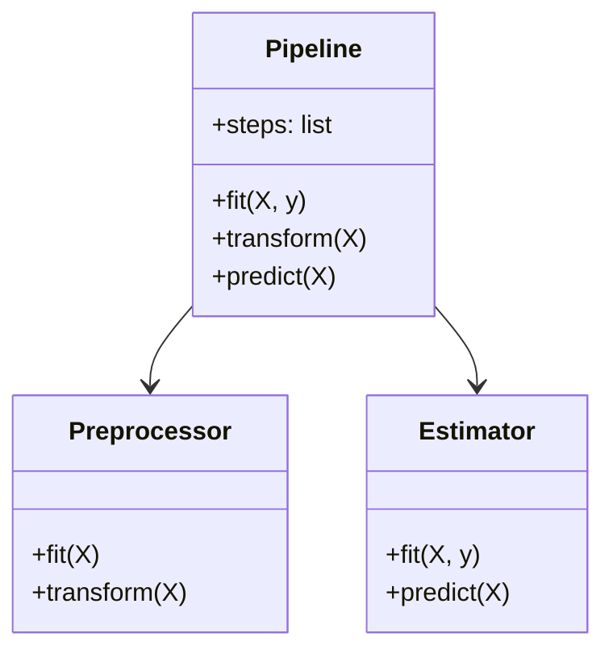

```python
from sklearn.pipeline import Pipeline
from sklearn.preprocessing import StandardScaler
from sklearn.linear_model import LogisticRegression

pipe = Pipeline([
    ("scaler", StandardScaler()),
    ("clf",    LogisticRegression()),
])
pipe.fit(X_train, y_train)
y_pred = pipe.predict(X_test)
```

---

### Pattern 2: Stratified K-Fold for Imbalanced Data

**Intent:** Ensure each fold has representative class distribution.

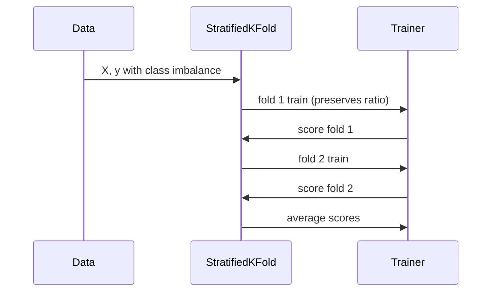

```python
from sklearn.model_selection import StratifiedKFold, cross_val_score

skf = StratifiedKFold(n_splits=5, shuffle=True, random_state=42)
scores = cross_val_score(model, X, y, cv=skf, scoring="roc_auc")
print(f"AUC: {scores.mean():.3f} ± {scores.std():.3f}")
```

---

## Clean Code

### Naming & Readability

```python
# Cryptic
def proc(d, f):
    return d[f].fillna(d[f].median())

# Self-documenting
def impute_with_median(df: pd.DataFrame, column: str) -> pd.DataFrame:
    median_val = df[column].median()
    return df.assign(**{column: df[column].fillna(median_val)})
```

---

### SOLID in Data Science

**Single Responsibility:**
```python
# Bad — one function does everything
def run_experiment(df):
    df = df.dropna()
    X, y = df.drop("label", axis=1), df["label"]
    X_train, X_test, y_train, y_test = train_test_split(X, y)
    model = RandomForestClassifier().fit(X_train, y_train)
    print(f1_score(y_test, model.predict(X_test), average="weighted"))

# Good — separate responsibilities
def preprocess(df):          ...
def build_model():           ...
def evaluate(model, X, y):   ...
def run_experiment(df):
    df_clean = preprocess(df)
    model    = build_model()
    model.fit(*split(df_clean))
    evaluate(model, X_test, y_test)
```

---

## Product Use / Feature

### 1. Spotify — Feature Engineering for Music Recommendations

- **How it uses {{TOPIC_NAME}}:** Audio features (tempo, danceability, energy) + user skip patterns
- **Scale:** 500M+ user-track interactions per day
- **Key insight:** Handcrafted audio features outperform raw audio spectrograms for shallow models

### 2. Airbnb — A/B Testing Platform

- **How it uses {{TOPIC_NAME}}:** Tests pricing algorithm changes on booking rate
- **Why this approach:** Statistical significance tests prevent premature conclusions

---

## Data Quality and Model Failure Handling

### Pattern 1: Detecting Data Leakage

```python
# Warning sign: training AUC >> test AUC
if train_auc - test_auc > 0.15:
    print("Warning: possible data leakage or severe overfitting")
    # Check: are any features created using future information?
    # Check: is the preprocessor fit on the full dataset?
```

### Pattern 2: Custom Error Types for Pipeline Failures

```python
class DataQualityError(Exception):
    pass

def validate_features(df, required_columns):
    missing = set(required_columns) - set(df.columns)
    if missing:
        raise DataQualityError(f"Missing required columns: {missing}")
```

---

## Security Considerations

### 1. Model Poisoning via Training Data

**Risk level:** High

```python
# Risk: adversarial examples in training data skew model behavior
# Mitigation: monitor label distribution and feature statistics before retraining
assert df["label"].value_counts(normalize=True).min() > 0.01, "Suspicious class imbalance"
```

---

## Performance Optimization

### Optimization 1: Use Pipelines to Avoid Redundant Preprocessing

```python
# Slow — manual repeat preprocessing
for fold in folds:
    X_scaled = scaler.fit_transform(X_fold_train)
    ...

# Fast — Pipeline handles it per-fold automatically
cross_val_score(pipe, X, y, cv=5)
```

### Performance Decision Matrix

| Scenario | Approach | Why |
|----------|----------|-----|
| < 10K rows | GridSearchCV | Exhaustive but affordable |
| > 100K rows | RandomizedSearchCV + Optuna | Grid is prohibitive |
| Time series | TimeSeriesSplit | Prevents temporal leakage |

---

## Metrics & Analytics

### Key Metrics

| Metric | Type | Description | Alert threshold |
|--------|------|-------------|-----------------|
| **Test F1** | Gauge | Weighted F1 score on held-out set | < 0.7 |
| **Train-Test Gap** | Gauge | Difference between train and test AUC | > 0.15 |
| **CV Std Dev** | Gauge | Stability across folds | > 0.05 |

---

## Debugging Model and Data Pipeline Issues

### Problem 1: Model Performs Well in CV But Poorly on New Data

**Symptoms:** CV AUC = 0.92, production AUC = 0.71.

**Diagnostic steps:**
```python
# Check for temporal leakage
df.sort_values("timestamp", inplace=True)
# Use TimeSeriesSplit instead of KFold
```

**Root cause:** KFold shuffles data randomly, allowing future data to appear in train folds.
**Fix:** Use `TimeSeriesSplit` for time-ordered data.

### Problem 2: A Feature Has High Importance But Was Created After the Event

**Symptoms:** Model accuracy is suspiciously high.

**Diagnostic steps:**
```python
# Check: was this feature available at prediction time?
for col in top_features:
    print(col, "— created at:", feature_creation_timestamps[col])
```

---

## Best Practices

- **Use sklearn Pipelines:** Prevent all leakage by encapsulating preprocessing inside cross-validation.
- **Always track experiments with MLflow:** Never rely on memory or comments for parameter tracking.
- **Report confidence intervals:** Always show `mean ± std` across CV folds, not just a single number.
- **Baseline first:** Build the simplest possible model (majority class, linear model) before complex ones.
- **Check the train-test gap:** A gap > 0.1 AUC is a strong signal of overfitting or leakage.

---

## Edge Cases & Pitfalls

### Pitfall 1: Data Leakage via Global Statistics

```python
# Bad — median computed on entire dataset including test rows
median = df["age"].median()
df["age"] = df["age"].fillna(median)

# Good — compute median only on training data
imputer = SimpleImputer(strategy="median")
X_train = imputer.fit_transform(X_train)
X_test  = imputer.transform(X_test)
```

### Pitfall 2: Temporal Leakage in Time Series

**What happens:** KFold lets future observations train the model.
**Detection:** Compare performance with `KFold` vs `TimeSeriesSplit` — if there's a big gap, temporal leakage exists.

---

## Common Mistakes

### Mistake 1: Using Test Set to Choose Hyperparameters

```python
# Wrong — test set used for model selection
for depth in [3, 5, 10]:
    model.fit(X_train, y_train)
    score = model.score(X_test, y_test)   # test set contaminated

# Correct — use validation set or cross-validation
gs = GridSearchCV(model, {"max_depth": [3, 5, 10]}, cv=5)
gs.fit(X_train, y_train)
final_score = gs.score(X_test, y_test)   # test set used only once
```

### Mistake 2: Ignoring Class Imbalance

```python
# Wrong — accuracy misleads on 95/5 split
accuracy_score(y_test, y_pred)  # 95% means nothing

# Correct
f1_score(y_test, y_pred, average="weighted")
roc_auc_score(y_test, model.predict_proba(X_test)[:, 1])
```

---

## Common Misconceptions

### Misconception 1: "A larger model always overfits"

**Reality:** With proper regularization and sufficient data, larger models can generalize well. Modern deep learning theory (double descent) shows this explicitly.

**Evidence:**
```python
# Adding L2 regularization can allow larger models to generalize
model = LogisticRegression(C=0.01)  # strong regularization
```

### Misconception 2: "Cross-validation gives an unbiased estimate if you tune on it"

**Reality:** Using CV scores to select hyperparameters makes the CV estimate optimistic. You need a separate held-out test set for the final unbiased evaluation.

---

## Anti-Patterns

### Anti-Pattern 1: The "Notebook Monster"

```python
# All code in one 500-line notebook, no functions, no pipelines
# Works on your laptop, breaks in production
```

**Why it's bad:** Non-reproducible, leakage-prone, impossible to test.
**The refactoring:** Break into `data.py`, `features.py`, `model.py`, `evaluate.py`.

---

## Tricky Points

### Tricky Point 1: `RandomizedSearchCV` Doesn't Sample Uniformly

```python
# This samples integers from a list — not a continuous distribution
param_dist = {"n_estimators": [50, 100, 200]}  # 3 choices only

# This samples from a continuous distribution
from scipy.stats import randint
param_dist = {"n_estimators": randint(50, 300)}  # any integer 50-299
```

---

## Comparison with R/Julia/MATLAB

How Python handles {{TOPIC_NAME}} compared to other data science languages:

| Aspect | Python | R | Julia | MATLAB |
|--------|--------|---|-------|--------|
| Feature engineering | pandas + sklearn | tidyverse + recipes | DataFrames.jl | Manually |
| Cross-validation | sklearn GridSearchCV | caret / tidymodels | MLJ.jl | Statistics Toolbox |
| A/B testing | scipy.stats | built-in t.test | HypothesisTests.jl | ttest2 |
| Experiment tracking | MLflow | experimentr | MLflow.jl | Manual |

### Key differences:

- **Python vs R:** R has superior statistical testing libraries (lme4 for mixed models) but Python dominates in ML tooling.
- **Python vs Julia:** Julia is faster for numerical compute (no Python overhead) but has a smaller ecosystem.
- **Python vs MATLAB:** MATLAB is used in industry for signal processing and control; Python has replaced it in data science.

---

## Test

### Multiple Choice (harder)

**1. You train a model on shuffled folds with KFold but your data has temporal ordering. What is the risk?**

- A) The model will underfit
- B) Future data leaks into training folds, inflating CV performance
- C) The model will produce NaN predictions
- D) Precision will always be higher than recall

<details>
<summary>Answer</summary>
**B)** — KFold does not respect time ordering. Future observations appear in training folds when the data is shuffled. Use `TimeSeriesSplit` for time-ordered data.
</details>

### Code Analysis

**2. What is wrong with this cross-validation setup?**

```python
scaler = StandardScaler()
X_scaled = scaler.fit_transform(X)   # fit on full dataset

scores = cross_val_score(LogisticRegression(), X_scaled, y, cv=5)
```

<details>
<summary>Answer</summary>
The scaler was fit on the entire dataset including test folds. Test data statistics (mean, std) leaked into every training fold. Fix: use a `Pipeline` so the scaler is fit inside each fold.
</details>

---

## Tricky Questions

**1. You run GridSearchCV with cv=5 on 10,000 samples. How many models are trained in total for a 3x3 parameter grid?**

- A) 9
- B) 45
- C) 90
- D) 10,000

<details>
<summary>Answer</summary>
**B) 45** — 9 parameter combinations × 5 folds = 45 models trained.
</details>

---

## Cheat Sheet

| Scenario | Pattern | Key consideration |
|----------|---------|-------------------|
| Imbalanced classes | SMOTE or class_weight="balanced" | Apply SMOTE inside CV, not before |
| Feature selection | SelectKBest inside Pipeline | Must fit on train fold only |
| Hyperparameter search | RandomizedSearchCV + n_iter=50 | More efficient than GridSearch for many params |
| Time series CV | TimeSeriesSplit | Never shuffle time-ordered data |
| Experiment tracking | MLflow `log_param` + `log_metric` | Log before and after every run |

### Decision Matrix

| If you need... | Use... | Because... |
|----------------|--------|------------|
| Speed on large param space | RandomizedSearchCV | Exponential grid is prohibitive |
| Statistical rigor | StratifiedKFold | Preserves class ratios per fold |
| Reproducibility | sklearn Pipeline | Prevents leakage, fits inside CV |

---

## Self-Assessment Checklist

### I can explain:
- [ ] Why {{TOPIC_NAME}} requires Pipeline to prevent leakage
- [ ] Trade-offs between linear, tree, and neural model families
- [ ] When to use StratifiedKFold vs TimeSeriesSplit
- [ ] What data leakage is and three ways it can happen

### I can do:
- [ ] Build a production-quality sklearn Pipeline
- [ ] Run cross-validation and report mean ± std
- [ ] Track an experiment with MLflow
- [ ] Design a basic A/B test with a t-test

### I can answer:
- [ ] "Why?" questions about design decisions
- [ ] Compare approaches with trade-offs

---

## Summary

- Feature engineering is often more impactful than algorithm choice.
- Use sklearn Pipelines to guarantee leakage-free cross-validation.
- Track every experiment with MLflow — reproducibility is non-negotiable.
- A/B testing requires statistical rigor: define power and significance threshold before running.

**Key difference from Junior:** Understands WHY leakage happens and uses Pipelines to prevent it systematically.
**Next step:** MLOps pipelines, production monitoring, large-scale data processing (senior level).

---

## What You Can Build

### Production systems:
- **Churn prediction pipeline:** Feature engineering + Pipeline + MLflow tracking + threshold tuning
- **A/B testing framework:** Statistical test harness with power analysis

### Learning path:

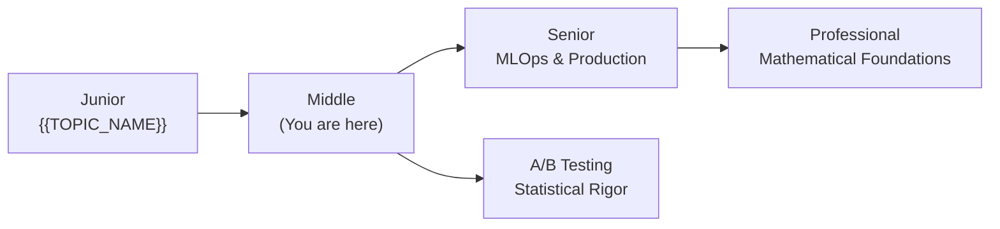

---

## Further Reading

- **Book:** *Feature Engineering for Machine Learning* by Alice Zheng
- **Blog:** [MLflow Documentation](https://mlflow.org/docs/latest/index.html)
- **Conference talk:** Chip Huyen — "Designing Machine Learning Systems"
- **Open source:** [imbalanced-learn](https://imbalanced-learn.org) — SMOTE and resampling strategies

---

## Related Topics

- **[MLOps Pipeline Design](../mlops/)** — how feature engineering connects to deployment
- **[Statistical Testing](../statistical-testing/)** — rigorous A/B test design
- **[Feature Stores](../feature-stores/)** — reusing features across teams

---

## Diagrams & Visual Aids

### Pipeline Architecture

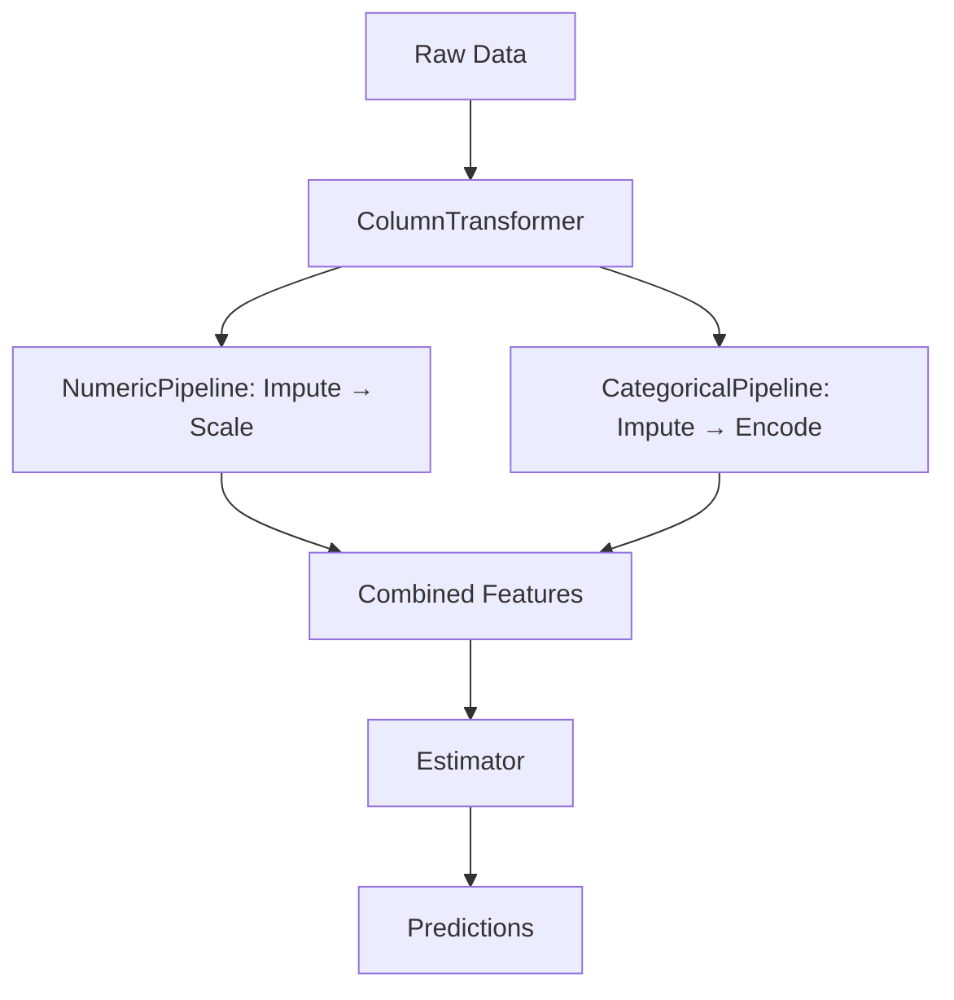

### Cross-Validation Flow

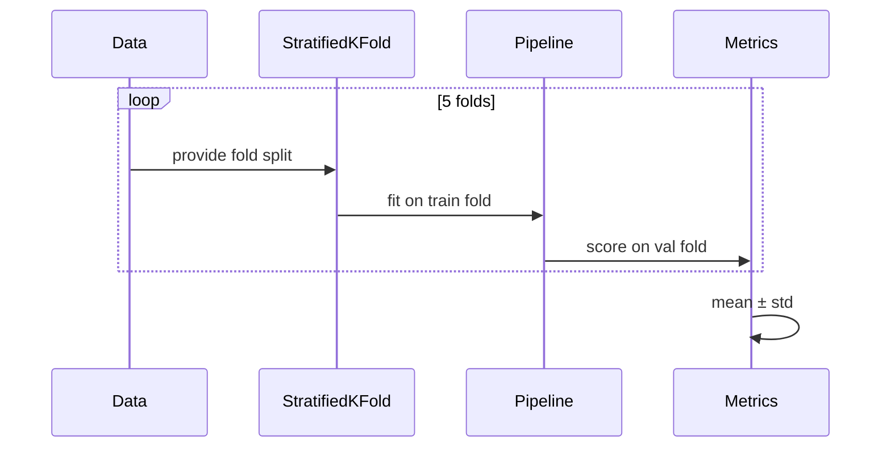

</details>

---
---

# TEMPLATE 3 — `senior.md`

<details open>
<summary><strong>Template Content</strong></summary>

# {{TOPIC_NAME}} — Senior Level

<!-- Table of Contents is OPTIONAL. -->

## Table of Contents

1. [Introduction](#introduction)
2. [Core Concepts](#core-concepts)
3. [Pros & Cons](#pros--cons)
4. [Use Cases](#use-cases)
5. [Code Examples](#code-examples)
6. [Coding Patterns](#coding-patterns)
7. [Clean Code](#clean-code)
8. [Product Use / Feature](#product-use--feature)
9. [Data Quality and Model Failure Handling](#data-quality-and-model-failure-handling)
10. [Security Considerations](#security-considerations)
11. [Performance Optimization](#performance-optimization)
12. [Metrics & Analytics](#metrics--analytics)
13. [Debugging Model and Data Pipeline Issues](#debugging-model-and-data-pipeline-issues)
14. [Best Practices](#best-practices)
15. [Edge Cases & Pitfalls](#edge-cases--pitfalls)
16. [Postmortems & System Failures](#postmortems--system-failures)
17. [Common Mistakes](#common-mistakes)
18. [Tricky Points](#tricky-points)
19. [Comparison with R/Julia/MATLAB](#comparison-with-rjuliamatlab)
20. [Test](#test)
21. [Tricky Questions](#tricky-questions)
22. [Cheat Sheet](#cheat-sheet)
23. [Self-Assessment Checklist](#self-assessment-checklist)
24. [Summary](#summary)
25. [Further Reading](#further-reading)
26. [Diagrams & Visual Aids](#diagrams--visual-aids)

---

## Introduction

> Focus: "How to optimize?" and "How to architect?"

For data scientists who:
- Design and own end-to-end ML systems in production
- Set statistical standards for A/B testing and causal inference
- Optimize pipelines for large-scale data (millions of rows, hundreds of features)
- Mentor junior and middle data scientists
- Present results with rigor to stakeholders

---

## Core Concepts

### Concept 1: MLOps Pipeline Design

A production ML pipeline is more than a notebook — it includes versioning, validation, deployment, and monitoring:

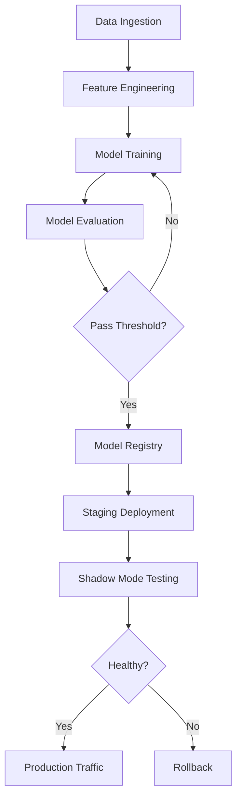

### Concept 2: Model Versioning and Registry

```python
import mlflow
from mlflow.tracking import MlflowClient

client = MlflowClient()

# Register a model
result = mlflow.register_model(
    "runs:/abc123/rf_model",
    "churn-classifier"
)

# Promote to production
client.transition_model_version_stage(
    name="churn-classifier",
    version=result.version,
    stage="Production",
)
```

### Concept 3: Production Monitoring — Data Drift and Model Drift

```python
from evidently.report import Report
from evidently.metric_preset import DataDriftPreset, ClassificationPreset

# Data drift report
report = Report(metrics=[DataDriftPreset()])
report.run(reference_data=X_train, current_data=X_production)
report.save_html("drift_report.html")
```

| Drift Type | What changes | Detection method |
|-----------|--------------|-----------------|
| **Data drift** | Input feature distribution | KS test, PSI |
| **Label drift** | Target distribution | Chi-square test |
| **Model drift** | Performance metrics | Sliding window AUC |
| **Concept drift** | Relationship between X and y | CUSUM, ADWIN |

### Concept 4: Feature Stores

```python
# Feature store provides consistent features across training and serving
from feast import FeatureStore

store = FeatureStore(repo_path=".")

# Retrieve features for training
training_df = store.get_historical_features(
    entity_df=user_events,
    features=["user_stats:avg_session_length", "user_stats:purchase_count_7d"]
).to_df()

# Retrieve same features for online serving (no training-serving skew)
online_features = store.get_online_features(
    features=["user_stats:avg_session_length"],
    entity_rows=[{"user_id": "u123"}]
)
```

### Concept 5: Large-Scale Data Processing with Spark and Dask

```python
# Dask — drop-in replacement for pandas on large datasets
import dask.dataframe as dd

df = dd.read_parquet("s3://bucket/data/*.parquet")
result = df.groupby("user_id")["revenue"].sum().compute()

# PySpark — distributed compute for Hadoop/cloud ecosystems
from pyspark.sql import SparkSession

spark = SparkSession.builder.appName("FeatureEngineering").getOrCreate()
df = spark.read.parquet("s3://bucket/data/")
df.createOrReplaceTempView("events")
result = spark.sql("SELECT user_id, SUM(revenue) as total FROM events GROUP BY user_id")
```

### Concept 6: Statistical Rigor in A/B Testing

```python
from statsmodels.stats.power import TTestIndPower

# Power analysis — compute required sample size before running the test
analysis = TTestIndPower()
n = analysis.solve_power(
    effect_size=0.2,   # minimum detectable effect (Cohen's d)
    power=0.80,        # desired statistical power
    alpha=0.05,        # significance level
)
print(f"Required n per group: {int(n)}")

# Multiple testing correction (Bonferroni)
from statsmodels.stats.multitest import multipletests
p_values = [0.02, 0.04, 0.001, 0.08]
reject, corrected_pvals, _, _ = multipletests(p_values, alpha=0.05, method="bonferroni")
```

### Concept 7: Communicating Results to Stakeholders

Key principles for senior data scientists:
- Lead with business impact, not model metrics ("Revenue increase of $2M" not "AUC = 0.87")
- Quantify uncertainty — always show confidence intervals
- Explain what the model CAN'T do as clearly as what it can
- Use visualizations that a non-technical audience can interpret

### Concept 8: Data Science Team Leadership

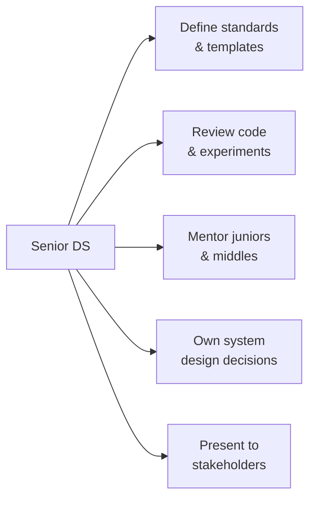

---

## Code Examples

### Example 1: Production-Grade Feature Engineering Pipeline

```python
from sklearn.pipeline import Pipeline
from sklearn.base import BaseEstimator, TransformerMixin
import pandas as pd
import numpy as np

class RecencyFeatureTransformer(BaseEstimator, TransformerMixin):
    """Custom transformer: compute days since last event."""

    def __init__(self, date_col: str, reference_date: str):
        self.date_col       = date_col
        self.reference_date = pd.Timestamp(reference_date)

    def fit(self, X, y=None):
        return self  # stateless

    def transform(self, X: pd.DataFrame) -> np.ndarray:
        recency = (self.reference_date - pd.to_datetime(X[self.date_col])).dt.days
        return recency.values.reshape(-1, 1)

# Compose with sklearn Pipeline
from sklearn.compose import ColumnTransformer
from sklearn.preprocessing import StandardScaler

feature_pipeline = Pipeline([
    ("recency", RecencyFeatureTransformer("last_purchase_date", "2024-01-01")),
    ("scaler",  StandardScaler()),
])
```

### Example 2: MLOps Pipeline with Validation Gates

```python
import mlflow
from sklearn.metrics import roc_auc_score

PRODUCTION_THRESHOLD_AUC = 0.82

def train_and_register(X_train, y_train, X_val, y_val, params):
    with mlflow.start_run() as run:
        model = GradientBoostingClassifier(**params)
        model.fit(X_train, y_train)

        val_auc = roc_auc_score(y_val, model.predict_proba(X_val)[:, 1])
        mlflow.log_metric("val_auc", val_auc)

        if val_auc >= PRODUCTION_THRESHOLD_AUC:
            mlflow.sklearn.log_model(model, "model")
            mlflow.register_model(
                f"runs:/{run.info.run_id}/model",
                "churn-classifier",
            )
            print(f"Model registered. AUC={val_auc:.4f}")
        else:
            print(f"Model rejected. AUC={val_auc:.4f} < {PRODUCTION_THRESHOLD_AUC}")
```

---

## Coding Patterns

### Pattern 1: Custom sklearn Estimator

**Category:** Data Engineering / MLOps
**Intent:** Encapsulate domain-specific transformations that can participate in cross-validation.

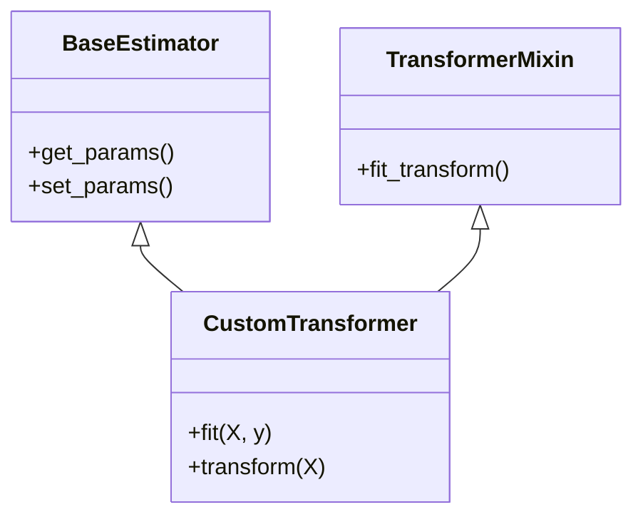

### Pattern 2: Champion-Challenger Model Deployment

**Category:** MLOps / Resilience

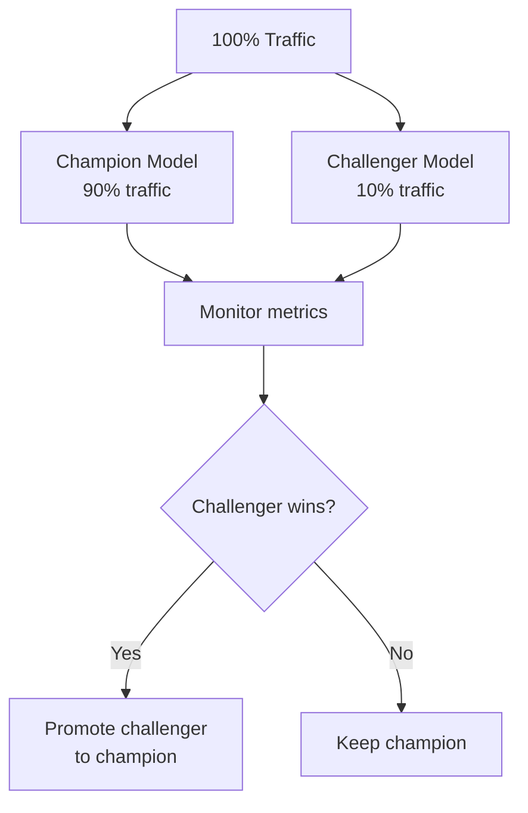

### Pattern 3: Drift Detection State Machine

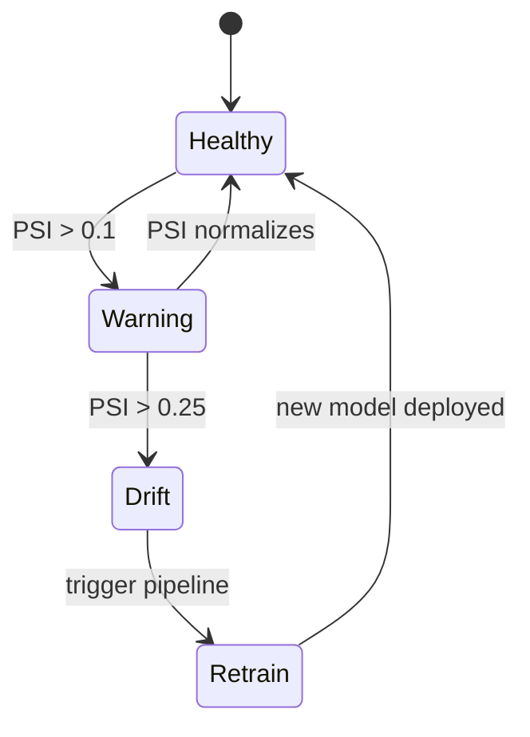

---

## Product Use / Feature

### 1. Uber Eats — Real-time ETA Prediction

- **Architecture:** Feature store for real-time features (driver GPS, restaurant prep time); GBM trained daily on 6 months of trip data
- **Scale:** 50M trips per month, p99 prediction latency < 50ms
- **Lessons learned:** Training-serving skew caused by inconsistent feature computation was the #1 source of production bugs

### 2. LinkedIn — Skill Recommendation

- **Architecture:** Offline feature engineering on 800M profiles, model retrained weekly
- **Trade-offs:** Weekly retraining chosen over real-time to reduce infrastructure cost; acceptable because user skills change slowly

---

## Data Quality and Model Failure Handling

### Strategy 1: Pre-Training Data Validation

```python
import great_expectations as ge

df_ge = ge.from_pandas(df)
df_ge.expect_column_values_to_not_be_null("user_id")
df_ge.expect_column_values_to_be_between("age", min_value=0, max_value=120)
df_ge.expect_column_proportion_of_unique_values_to_be_between("plan_type", min_value=0.001)

results = df_ge.validate()
if not results["success"]:
    raise DataQualityError("Dataset failed validation checks")
```

### Error Handling Architecture

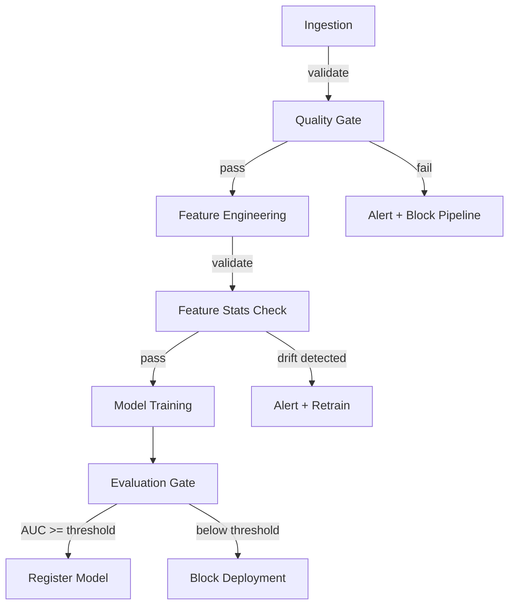

---

## Metrics & Analytics

### SLO / SLA Definition

| SLI | SLO Target | Measurement window | Consequence if breached |
|-----|-----------|-------------------|------------------------|
| **Model AUC** | > 0.82 | 7-day rolling | Trigger retraining |
| **Prediction latency p99** | < 100ms | 5-min rolling | PagerDuty alert |
| **Data freshness** | < 24 hours | Continuous | Block pipeline |
| **Feature drift PSI** | < 0.10 | Daily | Warning alert |

---

## Debugging Model and Data Pipeline Issues

### Problem 1: Silent Degradation — AUC Drops Gradually

**Symptoms:** Production AUC drifts from 0.88 to 0.74 over 6 weeks with no deployment changes.

**Diagnostic steps:**
```python
# Step 1: Check for data drift
from evidently.report import Report
from evidently.metric_preset import DataDriftPreset
report = Report(metrics=[DataDriftPreset()])
report.run(reference_data=X_train, current_data=X_recent)

# Step 2: Check feature importance stability
importances_old = old_model.feature_importances_
importances_new = new_model.feature_importances_
drift = np.abs(importances_old - importances_new).mean()
print(f"Feature importance drift: {drift:.4f}")
```

**Root cause:** Concept drift — the relationship between features and target changed (e.g., seasonality, macro event).
**Fix:** Add automated drift detection to the CI/CD pipeline; schedule proactive retraining.

---

## Best Practices

### Must Do

1. **Set a minimum AUC/F1 threshold before deploying:** Automate rejection of underperforming models.
2. **Use shadow mode before full rollout:** Route 5% of traffic to the new model without exposing users.
3. **Always run power analysis before A/B tests:** Never "peek" at p-values mid-test.

### Never Do

1. **Never deploy without a rollback plan:** Keep the previous model version registered and tested.
2. **Never present metrics without confidence intervals to stakeholders.**

### Production Readiness Checklist

- [ ] Model has been validated on a held-out test set from the same time period as production data
- [ ] Data drift monitoring is configured with alert thresholds
- [ ] Model registry entry includes: training date, data version, hyperparameters, validation metrics
- [ ] Rollback procedure documented and tested
- [ ] Prediction latency SLO defined and measured

---

## Postmortems & System Failures

### The Knight Capital Algorithmic Failure (Analogy to ML)

- **The goal:** Automated trading algorithm replacing manual orders
- **The mistake:** Deployed new model without removing legacy code — both ran simultaneously
- **The impact:** $440M loss in 45 minutes
- **The fix:** Blue/green deployment with atomic switchover; kill switch in all production models

**Key takeaway for ML:** Never run two model versions against the same traffic simultaneously without a traffic split that sums to 100%.

---

## Comparison with R/Julia/MATLAB

| Aspect | Python | R | Julia | MATLAB |
|--------|--------|---|-------|--------|
| MLOps tooling | MLflow, Kubeflow, Airflow | Vetiver | JuliaHub | No standard tool |
| Distributed compute | Spark, Dask | SparkR | Distributed.jl | Parallel Computing Toolbox |
| Feature store | Feast, Tecton | None native | None native | None native |
| A/B test power analysis | statsmodels | pwr package | HypothesisTests.jl | Statistics Toolbox |

---

## Cheat Sheet

### Architecture Decision Matrix

| Scenario | Recommended pattern | Avoid | Why |
|----------|-------------------|-------|-----|
| Time series data | TimeSeriesSplit CV | KFold | Temporal leakage |
| Concept drift | Periodic retraining | Static model | Relationship changes over time |
| High-cardinality categoricals | Target encoding inside CV | Global target encoding | Leakage |
| 100M+ row dataset | Dask / Spark | Pandas | Memory overflow |

### Heuristics & Rules of Thumb

- **The 15% Rule:** If train AUC − test AUC > 0.15, investigate leakage or overfitting before proceeding.
- **The PSI Rule:** Population Stability Index > 0.25 → significant drift, retrain immediately.
- **The Power Rule:** Always compute sample size before running an A/B test; stopping early inflates false positive rate.

---

## Self-Assessment Checklist

### I can architect:
- [ ] Design a full MLOps pipeline with drift monitoring and automated retraining
- [ ] Choose appropriate CV strategy based on data characteristics
- [ ] Define SLOs for a production ML model

### I can lead:
- [ ] Review experiments and identify statistical errors
- [ ] Present results with uncertainty quantification to executives
- [ ] Mentor middle data scientists on leakage prevention and experiment design

### I can optimize:
- [ ] Migrate a pandas-based pipeline to Dask or Spark
- [ ] Profile and optimize slow feature engineering code

---

## Summary

- Production ML requires MLOps: versioning, monitoring, and automated retraining.
- Statistical rigor in A/B testing requires pre-specifying sample size and significance before running.
- Feature stores eliminate training-serving skew — the #1 source of silent model degradation.
- Senior data scientists communicate business impact, not model metrics, to non-technical audiences.

**Senior mindset:** Not just "does it work?" but "will it keep working in production six months from now?"

---

## Further Reading

- **Book:** *Designing Machine Learning Systems* by Chip Huyen
- **Conference talk:** [Hidden Technical Debt in ML Systems](https://papers.nips.cc/paper/5656) — Sculley et al., NeurIPS 2015
- **Blog:** [Evidently AI Blog](https://www.evidentlyai.com/blog) — production ML monitoring
- **Open source:** [Feast Feature Store](https://feast.dev) — real-time feature serving

---

## Diagrams & Visual Aids

### MLOps System Architecture

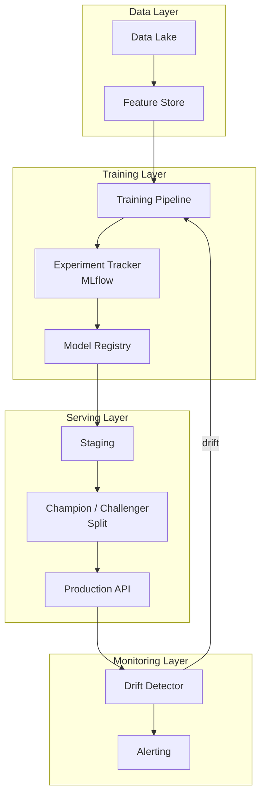

</details>

---
---

# TEMPLATE 4 — `professional.md`

<details open>
<summary><strong>Template Content</strong></summary>

# {{TOPIC_NAME}} — Mathematical and Algorithmic Foundations

<!-- Table of Contents is OPTIONAL. -->

## Table of Contents

1. [Introduction](#introduction)
2. [How It Works Internally](#how-it-works-internally)
3. [Training Loop and Optimization Internals](#training-loop-and-optimization-internals)
4. [Model Computation Graph](#model-computation-graph)
5. [Tensor Memory Layout and Numerical Precision](#tensor-memory-layout-and-numerical-precision)
6. [GPU Kernel / Hardware Acceleration Internals](#gpu-kernel--hardware-acceleration-internals)
7. [Source Code Walkthrough](#source-code-walkthrough)
8. [Gradient Trace / Activation Analysis](#gradient-trace--activation-analysis)
9. [Performance Internals](#performance-internals)
10. [Edge Cases at the Lowest Level](#edge-cases-at-the-lowest-level)
11. [Test](#test)
12. [Tricky Questions](#tricky-questions)
13. [Summary](#summary)
14. [Further Reading](#further-reading)
15. [Diagrams & Visual Aids](#diagrams--visual-aids)

---

## Introduction

> Focus: "What happens under the hood? What is the mathematical justification?"

This document explores the mathematical and computational foundations of {{TOPIC_NAME}}.
For practitioners who want to understand:
- The exact gradient computations during training
- How automatic differentiation works in PyTorch/TensorFlow
- How GPU hardware accelerates tensor operations
- Numerical precision and memory layout of tensors
- Key source internals in PyTorch and scikit-learn

---

## How It Works Internally

Step-by-step breakdown of what happens when the framework executes {{TOPIC_NAME}}:

1. **Forward pass** — compute predictions given parameters
2. **Loss computation** — measure distance from true labels
3. **Backward pass** — compute gradients via chain rule
4. **Optimizer step** — update parameters

```mermaid
flowchart TD
    A[Input Tensor X] --> B[Forward Pass\nf_theta(X)]
    B --> C[Loss L(y_pred, y_true)]
    C --> D[Backward Pass\n∂L/∂theta via autograd]
    D --> E[Optimizer Step\ntheta -= lr * grad]
    E --> F{Converged?}
    F -->|No| A
    F -->|Yes| G[Final Model]
```

---

## Training Loop and Optimization Internals

### SGD / Adam Mathematical Derivation

**Stochastic Gradient Descent:**

```text
theta_{t+1} = theta_t - lr * ∇_theta L(f_theta(x_i), y_i)
```

**Adam (Adaptive Moment Estimation):**

```text
m_t = beta1 * m_{t-1} + (1 - beta1) * g_t          # first moment (mean)
v_t = beta2 * v_{t-1} + (1 - beta2) * g_t^2         # second moment (variance)

m_hat = m_t / (1 - beta1^t)                          # bias correction
v_hat = v_t / (1 - beta2^t)

theta_{t+1} = theta_t - lr * m_hat / (sqrt(v_hat) + epsilon)
```

```python
import torch
import torch.optim as optim

model = MyModel()
optimizer = optim.Adam(model.parameters(), lr=1e-3, betas=(0.9, 0.999), eps=1e-8)

for epoch in range(100):
    for X_batch, y_batch in dataloader:
        optimizer.zero_grad()                    # reset gradients
        y_pred = model(X_batch)
        loss = criterion(y_pred, y_batch)
        loss.backward()                          # compute gradients
        torch.nn.utils.clip_grad_norm_(model.parameters(), max_norm=1.0)
        optimizer.step()                         # apply update
```

### Learning Rate Scheduling

```python
# Cosine annealing — smoothly reduces lr to min value
scheduler = optim.lr_scheduler.CosineAnnealingLR(optimizer, T_max=100)

# One-cycle policy — warmup + decay, often best for transformers
scheduler = optim.lr_scheduler.OneCycleLR(
    optimizer, max_lr=1e-2, total_steps=len(dataloader) * epochs
)
```

---

## Model Computation Graph

### PyTorch Autograd Internals

PyTorch builds a dynamic computation graph during the forward pass. Each tensor operation records a `grad_fn`:

```python
import torch

x = torch.tensor([2.0], requires_grad=True)
y = x ** 2 + 3 * x + 1   # y = x^2 + 3x + 1

print(y.grad_fn)           # <AddBackward0>

y.backward()
print(x.grad)              # dy/dx = 2x + 3 = 4+3 = 7
```

**Key classes in PyTorch source:**
- `torch.autograd.Function` — defines forward and backward rules
- `AccumulateGrad` — accumulates gradients into `.grad`
- `Engine` (`torch/csrc/autograd/engine.cpp`) — topological sort + backward traversal

### TensorFlow XLA (Accelerated Linear Algebra)

```python
import tensorflow as tf

@tf.function(jit_compile=True)   # enables XLA compilation
def train_step(x, y):
    with tf.GradientTape() as tape:
        y_pred = model(x, training=True)
        loss   = loss_fn(y, y_pred)
    grads = tape.gradient(loss, model.trainable_variables)
    optimizer.apply_gradients(zip(grads, model.trainable_variables))
    return loss
```

XLA fuses multiple operations into a single kernel, eliminating kernel launch overhead and reducing memory traffic.

---

## Tensor Memory Layout and Numerical Precision

### float32 vs float16

```text
float32: 1 sign bit + 8 exponent bits + 23 mantissa bits = 32 bits
         Range: ~1.4e-45 to 3.4e38   Precision: ~7 decimal digits

float16: 1 sign bit + 5 exponent bits + 10 mantissa bits = 16 bits
         Range: ~6.1e-5 to 65504     Precision: ~3 decimal digits
```

```python
import torch

# Mixed precision training — float16 for forward/backward, float32 for optimizer state
from torch.cuda.amp import autocast, GradScaler

scaler = GradScaler()

with autocast():
    output = model(input_tensor)
    loss   = criterion(output, target)

scaler.scale(loss).backward()
scaler.step(optimizer)
scaler.update()
```

**Why this matters:** float16 reduces memory by 2x, enabling larger batch sizes. GradScaler prevents underflow in gradients.

### Gradient Checkpointing

```python
from torch.utils.checkpoint import checkpoint

# Trade compute for memory: recompute activations during backward instead of storing them
def forward_with_checkpointing(self, x):
    x = checkpoint(self.layer1, x)
    x = checkpoint(self.layer2, x)
    return x
```

### Memory Layout — Contiguous vs Non-Contiguous

```
Contiguous tensor (row-major, C order):
┌────────────────────────────────────────┐
│ row 0: [0.1, 0.2, 0.3] ─ sequential  │
│ row 1: [0.4, 0.5, 0.6] ─ sequential  │
└────────────────────────────────────────┘
Stride: (3, 1)   ← next row = +3 elements, next col = +1 element

Non-contiguous (after transpose):
Stride: (1, 3)   ← GPU cache misses on column access
Fix: .contiguous() materializes a new contiguous copy
```

```python
x = torch.randn(3, 4)
y = x.T                    # transpose — non-contiguous
print(y.is_contiguous())   # False

z = y.contiguous()         # copy to contiguous layout
print(z.is_contiguous())   # True
```

---

## GPU Kernel / Hardware Acceleration Internals

### CUDA and Tensor Cores

Modern GPUs (A100, H100) have specialized **Tensor Cores** that perform 4×4 matrix multiply-accumulate (MMA) operations in a single clock cycle:

```text
Tensor Core MMA: D = A * B + C
where A, B are float16 matrices, D, C are float32 (accumulator)
Throughput: up to 312 TFLOPS (A100 float16)
```

```python
# Ensure shapes are multiples of 8 or 16 for Tensor Core utilization
batch_size  = 256  # multiple of 8
hidden_dim  = 1024 # multiple of 8

# Checking memory bandwidth utilization
import torch
start = torch.cuda.Event(enable_timing=True)
end   = torch.cuda.Event(enable_timing=True)

start.record()
output = model(input_tensor)
end.record()
torch.cuda.synchronize()
print(f"Kernel time: {start.elapsed_time(end):.2f} ms")
```

### Memory Bandwidth Bottleneck

```text
A100 GPU specs:
- VRAM: 80 GB HBM2e
- Memory bandwidth: 2 TB/s
- FP32 TFLOPS: 19.5
- FP16 TFLOPS: 312 (with Tensor Cores)

Rule of thumb: If FLOP count / bytes accessed < arithmetic intensity,
the operation is memory-bound (not compute-bound).
Matrix multiply: usually compute-bound
Elementwise ops (ReLU, Dropout): usually memory-bound
```

---

## Source Code Walkthrough

### Key scikit-learn Source Internals

**File:** `sklearn/ensemble/_gb.py` — GradientBoostingClassifier

```python
# Annotated key logic (simplified)
class GradientBoostingClassifier(BaseGradientBoosting):
    def _fit_stages(self, X, y, y_pred, sample_weight, ...):
        for i in range(self.n_estimators):
            # Compute negative gradient (pseudo-residuals)
            residuals = self.loss_.negative_gradient(y, y_pred)
            # Fit a regression tree to residuals
            tree = DecisionTreeRegressor(max_depth=self.max_depth)
            tree.fit(X, residuals)
            # Line search for optimal step size (leaf values)
            self.estimators_[i] = tree
            # Update predictions
            y_pred += self.learning_rate * tree.predict(X)
```

**Key insight:** Gradient boosting literally fits regression trees to the gradient of the loss function — each tree corrects the errors of the previous ensemble.

### Key PyTorch Source Internals

**File:** `torch/optim/adam.py`

```python
# Simplified Adam implementation
def step(self):
    for group in self.param_groups:
        for p in group["params"]:
            grad = p.grad.data
            state = self.state[p]

            exp_avg, exp_avg_sq = state["exp_avg"], state["exp_avg_sq"]
            beta1, beta2 = group["betas"]

            exp_avg.mul_(beta1).add_(grad, alpha=1 - beta1)
            exp_avg_sq.mul_(beta2).addcmul_(grad, grad, value=1 - beta2)

            bias_correction1 = 1 - beta1 ** state["step"]
            bias_correction2 = 1 - beta2 ** state["step"]
            step_size = group["lr"] / bias_correction1

            denom = (exp_avg_sq.sqrt() / math.sqrt(bias_correction2)).add_(group["eps"])
            p.data.addcdiv_(exp_avg, denom, value=-step_size)
```

> Reference specific library version since internals change.

---

## Gradient Trace / Activation Analysis

### Vanishing and Exploding Gradients

**Vanishing gradients** occur in deep networks when gradients become exponentially small as they propagate backward:

```text
Sigmoid activation: σ'(x) = σ(x)(1 - σ(x)) ∈ (0, 0.25)
For L layers: ||∂L/∂W_1|| ≈ ||∂L/∂W_L|| × Π_{i=2}^{L} 0.25 → 0 as L → ∞
```

**Detection and mitigation:**

```python
import torch

def check_gradient_flow(model):
    for name, param in model.named_parameters():
        if param.grad is not None:
            grad_norm = param.grad.norm().item()
            if grad_norm < 1e-6:
                print(f"Vanishing gradient in {name}: {grad_norm:.2e}")
            elif grad_norm > 1e3:
                print(f"Exploding gradient in {name}: {grad_norm:.2e}")

# Mitigations
# 1. Gradient clipping (exploding)
torch.nn.utils.clip_grad_norm_(model.parameters(), max_norm=1.0)

# 2. He initialization (vanishing)
torch.nn.init.kaiming_normal_(layer.weight, mode="fan_in", nonlinearity="relu")

# 3. Batch normalization
nn.BatchNorm1d(hidden_dim)

# 4. Residual connections (skip connections)
out = layer(x) + x  # gradient highway bypasses problematic layers
```

### Activation Statistics Monitoring

```python
# Hook to monitor activations during forward pass
activation_stats = {}

def make_hook(name):
    def hook(module, input, output):
        activation_stats[name] = {
            "mean": output.mean().item(),
            "std":  output.std().item(),
            "dead_neurons": (output == 0).float().mean().item(),
        }
    return hook

for name, layer in model.named_modules():
    layer.register_forward_hook(make_hook(name))
```

**Diagram:**

```mermaid
flowchart LR
    A[Input] --> B[Layer 1\nσ(Wx+b)]
    B --> C[Layer 2\nσ(Wx+b)]
    C --> D[Layer 3\nσ(Wx+b)]
    D --> E[Loss]
    E -->|∂L/∂W_3| D
    D -->|∂L/∂W_2 = ∂L/∂W_3 × σ'| C
    C -->|∂L/∂W_1 = ∂L/∂W_2 × σ'| B
    B -->|vanishes if σ' < 1| A
```

---

## Performance Internals

### Profiling with PyTorch Profiler

```python
from torch.profiler import profile, record_function, ProfilerActivity

with profile(
    activities=[ProfilerActivity.CPU, ProfilerActivity.CUDA],
    record_shapes=True,
) as prof:
    with record_function("model_inference"):
        output = model(input_tensor)

print(prof.key_averages().table(sort_by="cuda_time_total", row_limit=10))
```

**Key metrics to examine:**
- `cuda_time_total` — time spent on GPU kernels
- `cpu_time_total` — Python overhead and CPU operations
- `self_memory_usage` — memory allocated by each operation

### Memory Profiling

```python
import torch

torch.cuda.reset_peak_memory_stats()
output = model(input_tensor)
peak_memory_mb = torch.cuda.max_memory_allocated() / 1e6
print(f"Peak GPU memory: {peak_memory_mb:.1f} MB")
```

---

## Edge Cases at the Lowest Level

### Edge Case 1: NaN Gradients from Log(0)

```python
# Numerically unstable
loss = -torch.log(y_pred)

# Stable — uses log(softmax) trick, avoids log(0)
loss = F.cross_entropy(logits, targets)   # combines softmax + NLL internally
# Or: F.nll_loss(F.log_softmax(logits, dim=1), targets)
```

**Internal behavior:** PyTorch's `cross_entropy` uses the log-sum-exp trick:
```text
log_softmax(x_i) = x_i - log(Σ_j exp(x_j))
                 = x_i - (max_j x_j + log(Σ_j exp(x_j - max_j x_j)))
```

### Edge Case 2: Dead ReLU Neurons

```python
# Diagnosis: neurons that never activate
dead_pct = (activations == 0).float().mean().item()
if dead_pct > 0.5:
    print(f"Warning: {dead_pct*100:.1f}% of ReLU neurons are dead")
    # Fix: LeakyReLU, ELU, or lower learning rate
    nn.LeakyReLU(negative_slope=0.01)
```

---

## Test

### Internal Knowledge Questions

**1. Why does Adam converge faster than SGD in most cases?**

<details>
<summary>Answer</summary>
Adam adapts the learning rate per-parameter based on the history of gradients (first and second moments). Parameters with sparse gradients get larger effective learning rates, while frequently-updated parameters get smaller rates. This reduces the need for careful global learning rate tuning and is especially beneficial for sparse data (NLP, recommendations).
</details>

**2. What does `.contiguous()` do, and when is it necessary?**

<details>
<summary>Answer</summary>
`.contiguous()` creates a new tensor with row-major memory layout. It is necessary after operations like `.transpose()`, `.permute()`, or `.view()` that change strides without copying memory. Non-contiguous tensors can cause `RuntimeError: input is not contiguous` in some operations, and also cause GPU cache misses that slow down computation.
</details>

**3. Why is gradient checkpointing useful, and what is its cost?**

<details>
<summary>Answer</summary>
Gradient checkpointing trades GPU memory for compute time. Instead of storing all intermediate activations during the forward pass (needed for backpropagation), it recomputes them on the fly during backward. This reduces memory by a factor of ~sqrt(L) for an L-layer network, at the cost of ~30% longer training time.
</details>

---

## Tricky Questions

**1. You initialize all weights in a neural network to zero. What happens during training?**

<details>
<summary>Answer</summary>
All neurons in each layer compute identical outputs (symmetry problem). All gradients are identical, so all weights update identically — the network never breaks symmetry and effectively collapses to a single-neuron network per layer regardless of width. Fix: random initialization (Xavier or He initialization).
</details>

**2. Why does float16 mixed precision training sometimes cause NaN losses even with GradScaler?**

<details>
<summary>Answer</summary>
float16 has a limited range (max ~65504). If gradients are large (e.g., near the beginning of training or after a bad batch), they overflow to Inf/NaN. GradScaler attempts to manage this by scaling the loss upward and detecting Inf/NaN. If the scale factor itself overflows, or if the model architecture generates inherently large gradients (e.g., attention without scaling), NaN can still appear. Fix: reduce loss scale, use gradient clipping, or add layer normalization.
</details>

---

## Self-Assessment Checklist

### I can explain internals:
- [ ] How PyTorch's autograd computes gradients via the computation graph
- [ ] The mathematics of Adam vs SGD
- [ ] How Tensor Cores accelerate matrix multiplication
- [ ] float16 vs float32 trade-offs in mixed precision training

### I can analyze:
- [ ] Read PyTorch profiler output and identify bottlenecks
- [ ] Detect vanishing/exploding gradients from gradient norms
- [ ] Interpret tensor memory strides and contiguity

### I can prove:
- [ ] Derive the Adam update rule from first principles
- [ ] Explain why ReLU is preferred over sigmoid in deep networks (gradient flow)
- [ ] Show the log-sum-exp trick for numerical stability

---

## Summary

- Training loops are gradient descent over a computational graph — autograd automates chain rule application.
- Adam adapts per-parameter learning rates using first and second gradient moments.
- float16 reduces memory 2x but requires GradScaler to prevent gradient underflow.
- Tensor Cores require multiples-of-8 dimensions for full throughput utilization.
- Vanishing gradients are addressed by residual connections, batch normalization, and proper initialization.

**Key takeaway:** Understanding internals helps you write faster, more numerically stable training code and diagnose mysterious failures.

---

## Further Reading

- **PyTorch source:** [torch/optim/adam.py](https://github.com/pytorch/pytorch/blob/main/torch/optim/adam.py)
- **Paper:** *Adam: A Method for Stochastic Optimization* — Kingma & Ba, 2014
- **Paper:** *Deep Residual Learning for Image Recognition* — He et al., 2016
- **Book:** *Deep Learning* by Goodfellow, Bengio & Courville — Chapter 8 (Optimization)
- **Blog:** [Lilian Weng — Gradient Descent Optimization](https://lilianweng.github.io/posts/2017-09-08-nasty-bugs/)

---

## Diagrams & Visual Aids

### Autograd Computation Graph

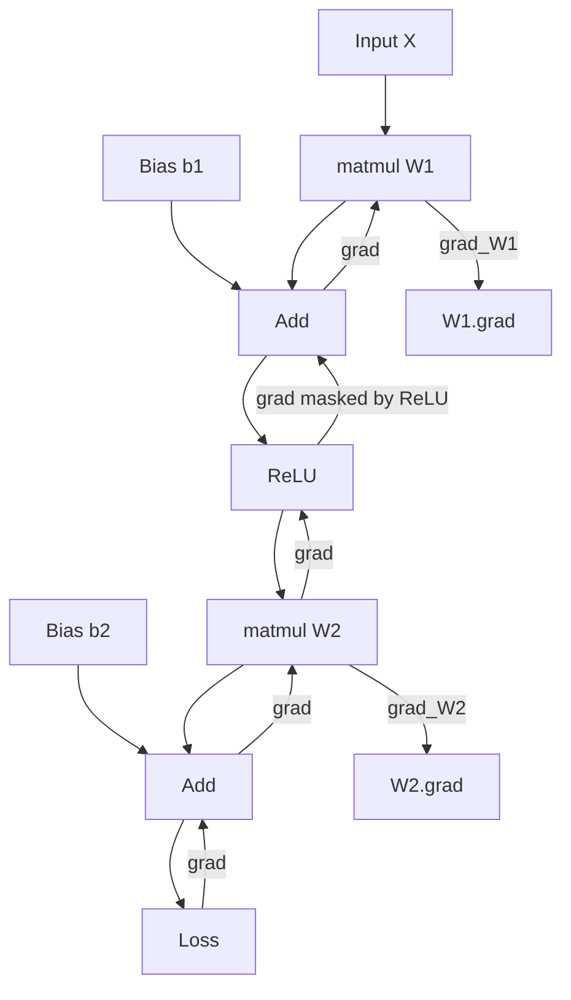

### Memory Layout

```
Tensor shape: (2, 3)   dtype: float32

Contiguous (strides 3, 1):
┌──────┬──────┬──────┐
│ 0.10 │ 0.20 │ 0.30 │  row 0 — addresses 0, 4, 8 bytes
├──────┼──────┼──────┤
│ 0.40 │ 0.50 │ 0.60 │  row 1 — addresses 12, 16, 20 bytes
└──────┴──────┴──────┘

After .T (transpose, strides 1, 3):
Logical (0,0) = physical address 0
Logical (1,0) = physical address 4  (not adjacent — cache miss on column access)
```

</details>

---
---

# TEMPLATE 5 — `interview.md`

<details open>
<summary><strong>Template Content</strong></summary>

# {{TOPIC_NAME}} — Interview Questions

## By Level

### Junior
1. What is the difference between supervised and unsupervised learning?
2. Explain bias-variance tradeoff in your own words.
3. What is cross-validation and why do we use it?
4. How do you handle missing values in a dataset?
5. What metrics would you use to evaluate a classification model?

> Cover: core ML concepts, data preprocessing, basic statistics, Python data science libraries.

### Middle
1. How do you detect and handle class imbalance?
2. Explain the curse of dimensionality and how to mitigate it.
3. When would you choose a tree-based model over a linear model for {{TOPIC_NAME}}?
4. How do you design an A/B test? What are common pitfalls?
5. What is regularization and when would you use L1 vs L2?

> Cover: model selection, experimental design, feature engineering, production considerations.

### Senior
1. How do you build an end-to-end ML pipeline for {{TOPIC_NAME}} in production?
2. How do you monitor model drift and decide when to retrain?
3. Describe a time you identified and fixed data leakage in a real project.
4. How do you communicate model uncertainty to non-technical stakeholders?

> Cover: MLOps, experimentation, stakeholder communication, system design.

### Professional
1. Derive the gradient descent update rule from first principles.
2. Prove why maximum likelihood estimation and cross-entropy minimization are equivalent.
3. Explain the bias-variance decomposition using the squared loss formula.
4. What is the VC dimension and how does it relate to generalization?

> Cover: mathematical proofs, statistical theory, algorithmic complexity.

## Practical Case Study
> "You are given a dataset related to {{TOPIC_NAME}}. Walk through your complete approach from EDA to deployment."

## Common Interview Mistakes
- Jumping to modeling before understanding the problem
- Ignoring data quality and leakage risks
- Choosing accuracy as the only metric for imbalanced data
- Not discussing production/deployment concerns

</details>

---
---

# TEMPLATE 6 — `tasks.md`

<details open>
<summary><strong>Template Content</strong></summary>

# {{TOPIC_NAME}} — Practical Tasks

## Junior Tasks

### Task 1: Exploratory Data Analysis
**Goal:** Explore and visualize a dataset related to {{TOPIC_NAME}}.

```python
import pandas as pd
import matplotlib.pyplot as plt

df = pd.read_csv("{{dataset}}.csv")
# TODO: Check shape, dtypes, nulls
# TODO: Plot distributions of key features
# TODO: Compute correlation matrix
# TODO: Write 3 business insights from EDA
```

### Task 2: Baseline Model
**Goal:** Train and evaluate a simple model for {{TOPIC_NAME}}.
- Split data (train/val/test — no leakage)
- Train logistic regression or decision tree baseline
- Report precision, recall, F1, and AUC

## Middle Tasks

### Task 3: Feature Engineering Pipeline
**Goal:** Build a reproducible sklearn `Pipeline` with `ColumnTransformer`.
- Handle missing values, encode categoricals, scale numerics
- Evaluate pipeline end-to-end with cross-validation

### Task 4: Model Comparison
**Goal:** Compare 3 models (LogReg, RandomForest, XGBoost) for {{TOPIC_NAME}}.
- Report performance + training time + interpretability trade-off
- Justify the winner

## Senior Tasks

### Task 5: Production ML Design
**Goal:** Design a production ML system for {{TOPIC_NAME}}.
- Feature store interface, model registry, drift detection strategy
- A/B test plan for deploying new model

## Professional Tasks

### Task 6: Implement from Scratch
**Goal:** Implement {{TOPIC_NAME}} algorithm from mathematical foundations without library calls.
- Verify against sklearn on same dataset
- Analyze convergence behavior

</details>

---
---

# TEMPLATE 7 — `find-bug.md`

<details open>
<summary><strong>Template Content</strong></summary>

# {{TOPIC_NAME}} — Find the Bug

> These exercises contain real data science mistakes. Find the bug, explain why it's wrong, and provide the fix.

## Easy — Data Leakage

```python
from sklearn.preprocessing import StandardScaler
from sklearn.model_selection import train_test_split

X, y = load_data()

scaler = StandardScaler()
X_scaled = scaler.fit_transform(X)  # BUG: fit on full dataset including test

X_train, X_test, y_train, y_test = train_test_split(X_scaled, y, test_size=0.2)
```

**Bug:** Test statistics leak into training via the scaler.
**Fix:** Fit scaler only on `X_train`, then `transform` both splits.

---

## Medium — Wrong Metric for Imbalanced Classes

```python
y_true = [0]*950 + [1]*50
y_pred = [0]*1000  # Always predict majority class

accuracy = accuracy_score(y_true, y_pred)
print(f"Model accuracy: {accuracy}")  # 0.95 — misleadingly high
```

**Bug:** Accuracy is misleading for 95/5 imbalanced dataset.
**Fix:** Use F1, precision-recall AUC, or Matthews Correlation Coefficient.

---

## Hard — P-Hacking / Optional Stopping

```python
for day in range(30):
    p_value = run_ttest(control_data, treatment_data)
    if p_value < 0.05:
        print(f"Significant on day {day}! Stopping.")
        break  # BUG: inflates false positive rate
```

**Bug:** Peeking at p-values and stopping early inflates Type I error rate far above 5%.
**Fix:** Pre-register sample size with power analysis; use sequential testing (SPRT) if early stopping is needed.

---

## Expert — Simpson's Paradox

```python
# Hospital A better at both minor and severe cases individually
# but appears worse overall due to case mix
hospital_a_rate = (90 + 200) / (100 + 1000)   # 0.263
hospital_b_rate = (1 + 1000) / (10 + 2000)    # 0.498
print(f"Hospital B is better: {hospital_b_rate > hospital_a_rate}")  # Wrong conclusion
```

**Bug:** Aggregating without controlling for case severity creates a confounded comparison.
**Fix:** Stratify analysis by severity; never aggregate across strata with different compositions.

</details>

---
---

# TEMPLATE 8 — `optimize.md`

<details open>
<summary><strong>Template Content</strong></summary>

# {{TOPIC_NAME}} — Optimization Exercises

> Each exercise shows a slow or inefficient data science workflow. Profile, identify the bottleneck, and optimize.

## Exercise 1 — Slow Feature Computation (Easy)

### Before
```python
features = []
for i, row in df.iterrows():  # iterrows is very slow
    features.append(compute_feature(row["col_a"], row["col_b"]))
df["feature"] = features
# Profile: 45s for 100k rows
```

### After
```python
df["feature"] = np.vectorize(compute_feature)(df["col_a"].values, df["col_b"].values)
# Result: 0.3s — 150× speedup
```

---

## Exercise 2 — Reloading Model on Every Request (Medium)

### Before
```python
def predict(input_data):
    model = pickle.load(open("model.pkl", "rb"))  # Disk I/O on every call
    return model.predict([input_data])
# p99 latency: 800ms
```

### After
```python
_model = pickle.load(open("model.pkl", "rb"))  # Load once at startup

def predict(input_data):
    return _model.predict([input_data])
# p99 latency: 2ms — 400× speedup
```

---

## Exercise 3 — Unvectorized Training Loop (Hard)

### Before
```python
for epoch in range(1000):
    for i in range(len(X)):  # Python loop over rows — extremely slow
        pred = sum(w * x for w, x in zip(weights, X[i]))
        error = pred - y[i]
        weights = [w - lr * error * x for w, x in zip(weights, X[i])]
# 180s for 10k samples
```

### After
```python
for epoch in range(1000):
    preds = X @ weights           # Matrix multiply
    errors = preds - y
    weights -= lr * (X.T @ errors) / len(X)
# 0.8s — 225× speedup
```

---

## Optimization Cheat Sheet

| Problem | Symptom | Fix |
|---|---|---|
| Row-wise ops | `iterrows()` slow | Vectorize with numpy/pandas |
| Model reload latency | High p99 | Cache at module load |
| Unvectorized math | Training slow | NumPy matrix operations |
| Redundant feature computation | Repeated expensive calls | `joblib.Memory` or `@lru_cache` |
| OOM on large data | MemoryError | Chunking or Dask |
| Single-threaded CV | Slow cross-validation | `n_jobs=-1` in sklearn |

> Always profile before optimizing: use `cProfile`, `line_profiler`, or `memory_profiler`.

</details>

---
---


