# AI Engineer Roadmap — Universal Template

> **A comprehensive template system for generating AI Engineer roadmap content across all skill levels.**

---

## Overview

| | Description |
|---|---|
| **Purpose** | Universal template for all AI Engineer roadmap topics |
| **Files per topic** | 9 files: `junior.md`, `middle.md`, `senior.md`, `professional.md`, `interview.md`, `tasks.md`, `find-bug.md`, `optimize.md`, `specification.md` |
| **Language** | All content must be generated in **English** |
| **Table of Contents** | **Optional** — include only if relevant to the topic. For theory/practice files (`tasks.md`, `find-bug.md`, `optimize.md`) it is NOT required |

### Topic Structure

```
XX-topic-name/
├── junior.md          ← "What?" and "How?"
├── middle.md          ← "Why?" and "When?"
├── senior.md          ← "How to optimize?" and "How to architect?"
├── professional.md    ← "Under the Hood" — model internals, infrastructure
├── interview.md       ← Interview prep across all levels
├── tasks.md           ← Hands-on practice tasks
├── find-bug.md        ← Find and fix bugs in code (10+ exercises)
├── optimize.md        ← Optimize slow/inefficient code (10+ exercises)
└── specification.md   ← Official spec / documentation deep-dive
```

---

## Level Comparison Matrix

| Aspect | Junior | Middle | Senior | Professional |
|:------:|:------:|:------:|:------:|:------------:|
| **Depth** | Basic concepts, simple examples | Practical usage, real-world cases | Architecture, optimization | Runtime, model internals, infrastructure level |
| **Code** | Basic API calls | Production-ready pipelines | Advanced RAG/agent patterns, benchmarks | CUDA kernels, vLLM internals, quantization |
| **Tricky Points** | API errors, token limits | Hallucinations, latency, cost | Retrieval quality, model serving | KV cache, quantization artifacts, batching |
| **Focus** | "What?" and "How?" | "Why?" and "When?" | "How to improve?" | "What happens under the hood?" |

---
---

# TEMPLATE 1 — `junior.md`

<details open>
<summary><strong>Template Content</strong></summary>

# {{TOPIC_NAME}} — Junior Level

## Table of Contents

1. [Introduction](#introduction)
2. [Prerequisites](#prerequisites)
3. [Glossary](#glossary)
4. [Core Concepts](#core-concepts)
5. [Pros & Cons](#pros--cons)
6. [Use Cases](#use-cases)
7. [Code Examples](#code-examples)
8. [Coding Patterns](#coding-patterns)
9. [Clean Code](#clean-code)
10. [Product Use / Feature](#product-use--feature)
11. [Error Handling](#error-handling)
12. [Security Considerations](#security-considerations)
13. [Performance Tips](#performance-tips)
14. [Metrics & Analytics](#metrics--analytics)
15. [Best Practices](#best-practices)
16. [Edge Cases & Pitfalls](#edge-cases--pitfalls)
17. [Common Mistakes](#common-mistakes)
18. [Tricky Points](#tricky-points)
19. [Test](#test)
20. [Tricky Questions](#tricky-questions)
21. [Cheat Sheet](#cheat-sheet)
22. [Summary](#summary)
23. [What You Can Build](#what-you-can-build)
24. [Further Reading](#further-reading)
25. [Related Topics](#related-topics)
26. [Diagrams & Visual Aids](#diagrams--visual-aids)

---

## Introduction

> Focus: "What is it?" and "How to use it?"

Brief explanation of what {{TOPIC_NAME}} is and why a beginner AI engineer needs to know it.
Keep it simple — assume the reader has basic Python knowledge but is new to working with LLMs and AI APIs.

---

## Prerequisites

What you should know before studying this topic:

- **Required:** {{concept 1}} — brief explanation of why
- **Required:** {{concept 2}} — brief explanation of why
- **Helpful but not required:** {{concept 3}}

> List 2-4 prerequisites. Link to related roadmap topics if available.

---

## Glossary

Key terms used in this topic:

| Term | Definition |
|------|-----------|
| **{{Term 1}}** | Simple, one-sentence definition |
| **{{Term 2}}** | Simple, one-sentence definition |
| **{{Term 3}}** | Simple, one-sentence definition |

> 5-10 terms. Keep definitions beginner-friendly.

---

## Core Concepts

### Concept 1: {{name}}

Simple explanation with analogy if helpful.

### Concept 2: {{name}}

...

> **Rules:**
> - Each concept should be explained in 3-5 sentences max.
> - Use bullet points for lists.
> - Include small code snippets inline where needed.

---

## Real-World Analogies

| Concept | Analogy |
|---------|--------|
| **{{Concept 1}}** | {{Analogy}} |
| **{{Concept 2}}** | {{Analogy}} |

---

## Mental Models

**The intuition:** {{A simple mental model for understanding this AI concept}}

**Why this model helps:** {{Why visualizing it this way prevents common mistakes}}

---

## Pros & Cons

| Pros | Cons |
|------|------|
| {{Advantage 1}} | {{Disadvantage 1}} |
| {{Advantage 2}} | {{Disadvantage 2}} |
| {{Advantage 3}} | {{Disadvantage 3}} |

### When to use:
- {{Scenario where this approach shines}}

### When NOT to use:
- {{Scenario where another approach is better}}

---

## Use Cases

- **Use Case 1:** Description
- **Use Case 2:** Description
- **Use Case 3:** Description

---

## Code Examples

### Example 1: {{title}}

```python
# Full working example with comments
import openai

client = openai.OpenAI()

response = client.chat.completions.create(
    model="gpt-4o",
    messages=[
        {"role": "system", "content": "You are a helpful assistant."},
        {"role": "user", "content": "Hello!"}
    ]
)
print(response.choices[0].message.content)
```

**What it does:** Brief explanation of what happens.
**How to run:** `python main.py`

### Example 2: {{title}}

```python
# Another practical example
```

> **Rules:**
> - Every example must be runnable. Include all necessary imports.
> - Add comments explaining each important line.

---

## Coding Patterns

Common patterns beginners encounter when working with {{TOPIC_NAME}}:

### Pattern 1: {{Basic pattern name}}

**Intent:** {{One sentence — what problem does this pattern solve?}}
**When to use:** {{Simple scenario where this pattern applies}}

```python
# Pattern implementation — keep it simple and well-commented
```

**Diagram:**

```mermaid
graph TD
    A[User Input] --> B[{{TOPIC_NAME}} Pattern]
    B --> C[LLM Response]
    B --> D[Side Effect / State Change]
```

**Remember:** {{One key takeaway for junior developers}}

---

### Pattern 2: {{Another basic pattern}}

**Intent:** {{What it solves}}

```python
# Second pattern example
```

**Diagram:**

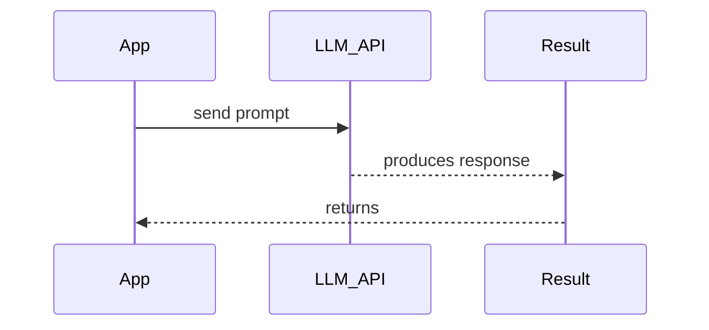

> Include 2 patterns at this level. Keep diagrams simple — flowcharts and sequence diagrams only.

---

## Clean Code

Basic clean code principles when working with {{TOPIC_NAME}}:

### Naming Conventions

| Bad ❌ | Good ✅ | Why |
|--------|---------|-----|
| `res = call_api(x)` | `completion = generate_response(prompt)` | Describes what it holds |
| `def proc(t, m)` | `def build_chat_message(role, content)` | Describes what it does |
| `flag = True` | `is_streaming = True` | Boolean prefix makes intent clear |

### Function Design

❌ Anti-pattern:
```python
# Bad — does too many things
def process(text):
    # 80+ lines: clean, embed, call API, parse, save...
    pass
```

✅ Better:
```python
# Good — single responsibility
def clean_text(raw: str) -> str: ...
def build_prompt(text: str) -> list[dict]: ...
def call_llm(messages: list[dict]) -> str: ...
def parse_response(raw: str) -> dict: ...
```

**Rule:** If you need to scroll to see a function — it does too much. Aim for **≤ 20 lines**.

---

## Product Use / Feature

How this topic is used in real-world products and tools:

### 1. {{Product/Tool Name}}

- **How it uses {{TOPIC_NAME}}:** Brief description
- **Why it matters:** Practical impact

### 2. {{Product/Tool Name}}

- **How it uses {{TOPIC_NAME}}:** Brief description
- **Why it matters:** Practical impact

> 3-5 real products/tools. Show how the topic is applied in industry.

---

## Error Handling

### Error 1: {{Common error message or type}}

```python
# Code that produces this error
```

**Why it happens:** Simple explanation.
**How to fix:**

```python
# Corrected code with proper error handling
```

### Error 2: {{Another common error}}

...

### Error Handling Pattern

```python
import openai

try:
    response = client.chat.completions.create(...)
except openai.RateLimitError:
    # handle rate limit
except openai.APIConnectionError:
    # handle connection issues
except openai.APIError as e:
    # handle other API errors
```

> 2-4 common errors. Show the error, explain why, and provide the fix.

---

## Security Considerations

### 1. {{Security concern — e.g., Prompt Injection}}

```python
# ❌ Insecure — user input directly in system prompt
system_prompt = f"You are a helper. Context: {user_input}"

# ✅ Secure — sanitize and separate user content
system_prompt = "You are a helpful assistant."
user_message = sanitize_input(user_input)
```

**Risk:** What could go wrong.
**Mitigation:** How to protect against it.

> 2-4 security considerations. Focus on: prompt injection, data leakage, API key exposure.

---

## Performance Tips

### Tip 1: {{Performance optimization}}

```python
# ❌ Slow approach
...

# ✅ Faster approach
...
```

**Why it's faster:** Simple explanation.

> 2-4 tips. Keep explanations simple.

---

## Metrics & Analytics

Key metrics to track when using {{TOPIC_NAME}}:

### What to Measure

| Metric | Why it matters | Tool |
|--------|---------------|------|
| **Inference latency p50** | User experience baseline | Prometheus, LangSmith |
| **Tokens/second** | Throughput measure | OpenAI usage dashboard |
| **GPU memory usage** | Resource planning | nvidia-smi, Prometheus |

### Basic Instrumentation

```python
import time

start = time.perf_counter()
response = client.chat.completions.create(...)
latency_ms = (time.perf_counter() - start) * 1000
print(f"Latency: {latency_ms:.1f}ms")
print(f"Tokens used: {response.usage.total_tokens}")
```

---

## Best Practices

- **Do this:** Explanation
- **Do this:** Explanation
- **Do this:** Explanation

> 3-5 best practices. Keep them actionable and specific to juniors.

---

## Edge Cases & Pitfalls

### Pitfall 1: {{name}}

```python
# Code that demonstrates the pitfall
```

**What happens:** Explanation of unexpected behavior.
**How to fix:** Corrected code or approach.

---

## Common Mistakes

### Mistake 1: {{description}}

```python
# ❌ Wrong way
...

# ✅ Correct way
...
```

> 3-5 mistakes that juniors commonly make.

---

## Common Misconceptions

### Misconception 1: "{{False belief}}"

**Reality:** {{What's actually true}}
**Why people think this:** {{Why this misconception is common}}

---

## Tricky Points

### Tricky Point 1: {{name}}

```python
# Code that might surprise a junior
```

**Why it's tricky:** Explanation.
**Key takeaway:** One-line lesson.

---

## Test

### Multiple Choice

**1. {{Question}}?**

- A) Option A
- B) Option B
- C) Option C
- D) Option D

<details>
<summary>Answer</summary>
**C)** — Explanation why C is correct and why others are wrong.
</details>

### True or False

**2. {{Statement}}**

<details>
<summary>Answer</summary>
**False** — Explanation.
</details>

### What's the Output?

**3. What does this code print?**

```python
# code snippet
```

<details>
<summary>Answer</summary>
Output: `...`
Explanation: ...
</details>

> 5-8 test questions total.

---

## "What If?" Scenarios

**What if {{Unexpected situation}}?**
- **You might think:** {{Intuitive but wrong answer}}
- **But actually:** {{Correct behavior and why}}

---

## Tricky Questions

**1. {{Confusing question}}?**

- A) {{Looks correct but wrong}}
- B) {{Correct answer}}
- C) {{Common misconception}}
- D) {{Partially correct}}

<details>
<summary>Answer</summary>
**B)** — Explanation of why the "obvious" answers are wrong.
</details>

> 3-5 tricky questions.

---

## Cheat Sheet

| What | Syntax / Command | Example |
|------|-----------------|---------|
| {{Action 1}} | `{{syntax}}` | `{{example}}` |
| {{Action 2}} | `{{syntax}}` | `{{example}}` |
| {{Action 3}} | `{{syntax}}` | `{{example}}` |

---

## Self-Assessment Checklist

### I can explain:
- [ ] What {{TOPIC_NAME}} is and why it exists
- [ ] When to use it and when NOT to use it
- [ ] {{Specific concept 1}} in my own words

### I can do:
- [ ] Write a basic example from scratch
- [ ] Handle common API errors
- [ ] Debug simple issues related to this topic

---

## Summary

- Key point 1
- Key point 2
- Key point 3

**Next step:** What to learn after this topic.

---

## What You Can Build

### Projects you can create:
- **{{Project 1}}:** Brief description — uses {{specific concept from this topic}}
- **{{Project 2}}:** Brief description
- **{{Project 3}}:** Brief description

### Learning path — what to study next:

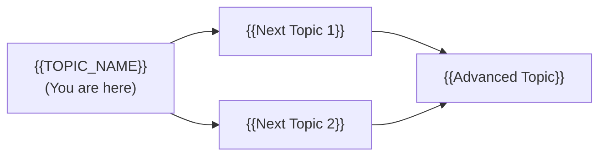

---

## Further Reading

- **Official docs:** [{{link title}}]({{url}})
- **Blog post:** [{{link title}}]({{url}}) — brief description
- **Video:** [{{link title}}]({{url}}) — duration, what it covers

---

## Related Topics

- **[{{Related Topic 1}}](../XX-related-topic/)** — how it connects
- **[{{Related Topic 2}}](../XX-related-topic/)** — how it connects

---

## Diagrams & Visual Aids

### Mind Map

```mermaid
mindmap
  root(({{TOPIC_NAME}}))
    Core Concept 1
      Sub-concept A
      Sub-concept B
    Core Concept 2
      Sub-concept C
      Sub-concept D
    Related Topics
      {{Related 1}}
      {{Related 2}}
```

</details>

---
---

# TEMPLATE 2 — `middle.md`

<details open>
<summary><strong>Template Content</strong></summary>

# {{TOPIC_NAME}} — Middle Level

## Table of Contents

1. [Introduction](#introduction)
2. [Core Concepts](#core-concepts)
3. [Pros & Cons](#pros--cons)
4. [Use Cases](#use-cases)
5. [Code Examples](#code-examples)
6. [Coding Patterns](#coding-patterns)
7. [Clean Code](#clean-code)
8. [Product Use / Feature](#product-use--feature)
9. [Error Handling](#error-handling)
10. [Security Considerations](#security-considerations)
11. [Performance Optimization](#performance-optimization)
12. [Metrics & Analytics](#metrics--analytics)
13. [Debugging Guide](#debugging-guide)
14. [Best Practices](#best-practices)
15. [Edge Cases & Pitfalls](#edge-cases--pitfalls)
16. [Common Mistakes](#common-mistakes)
17. [Tricky Points](#tricky-points)
18. [Test](#test)
19. [Tricky Questions](#tricky-questions)
20. [Cheat Sheet](#cheat-sheet)
21. [Summary](#summary)
22. [What You Can Build](#what-you-can-build)
23. [Further Reading](#further-reading)
24. [Related Topics](#related-topics)
25. [Diagrams & Visual Aids](#diagrams--visual-aids)

---

## Introduction

> Focus: "Why?" and "When to use?"

Assumes the reader already knows how to call LLM APIs. This level covers:
- Deeper understanding of how {{TOPIC_NAME}} works
- RAG systems, embedding models, and vector databases
- Production considerations: latency, cost, reliability

---

## Core Concepts

### Concept 1: {{Advanced concept}}

Detailed explanation with diagrams (mermaid) where helpful.


### Concept 2: {{Another concept}}

- How it relates to other AI/ML components
- Internal behavior differences
- Performance implications

---

## Evolution & Historical Context

Why does {{TOPIC_NAME}} exist? What problem does it solve?

**Before {{TOPIC_NAME}}:**
- How developers solved this problem previously
- The pain points and limitations of the old approach

**How {{TOPIC_NAME}} changed things:**
- The architectural shift it introduced

---

## Pros & Cons

| Pros | Cons |
|------|------|
| {{Advantage 1 with production context}} | {{Disadvantage 1 with impact analysis}} |
| {{Advantage 2}} | {{Disadvantage 2}} |

### Comparison with alternatives:

| Approach | Pros | Cons | Best for |
|----------|------|------|----------|
| {{Approach A}} | {{pros}} | {{cons}} | {{scenario}} |
| {{Approach B}} | {{pros}} | {{cons}} | {{scenario}} |

---

## Use Cases

- **Use Case 1:** {{Production scenario}}
- **Use Case 2:** {{Scaling scenario}}
- **Use Case 3:** {{Integration scenario}}

---

## Code Examples

### Example 1: {{Production-ready pattern}}

```python
# Production-quality code with error handling, retries, logging
import openai
import logging
from tenacity import retry, stop_after_attempt, wait_exponential

logger = logging.getLogger(__name__)

@retry(stop=stop_after_attempt(3), wait=wait_exponential(multiplier=1, min=2, max=10))
def generate_with_retry(messages: list[dict], model: str = "gpt-4o") -> str:
    response = client.chat.completions.create(model=model, messages=messages)
    return response.choices[0].message.content
```

**Why this pattern:** Explanation of design decisions.
**Trade-offs:** What you gain and what you sacrifice.

### Example 2: {{Comparison of approaches}}

```python
# Approach A
...

# Approach B (better for X reason)
...
```

---

## Coding Patterns

### Pattern 1: {{GoF or AI-specific pattern name}}

**Category:** Retrieval / Generation / Orchestration / Caching
**Intent:** {{What problem this pattern solves}}
**When to use:** {{Specific scenario}}
**When NOT to use:** {{Counter-indication}}

**Structure diagram:**

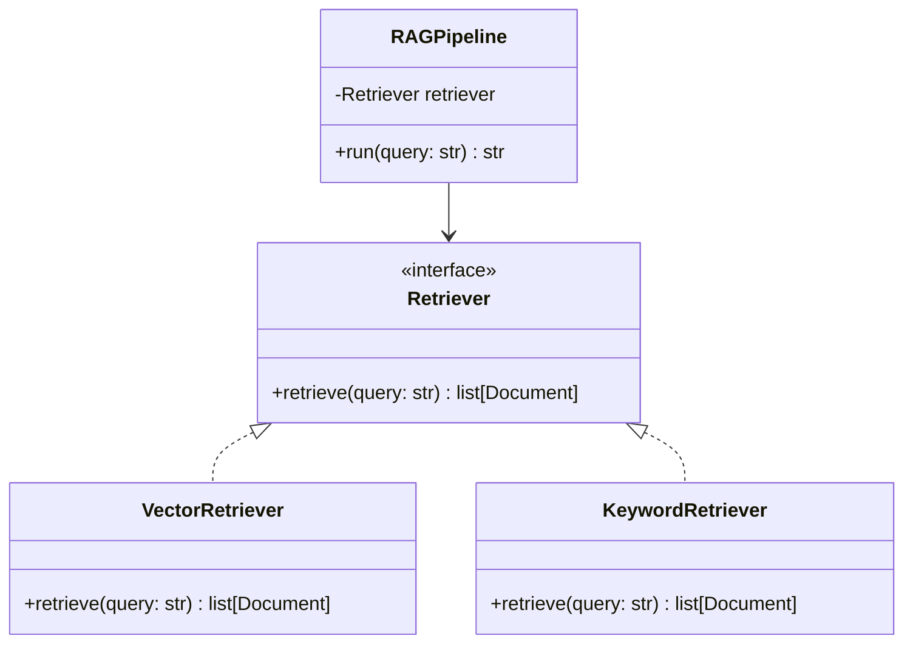

**Implementation:**

```python
# Pattern implementation with real {{TOPIC_NAME}} usage
```

**Trade-offs:**

| ✅ Pros | ❌ Cons |
|---------|---------|
| {{benefit 1}} | {{drawback 1}} |
| {{benefit 2}} | {{drawback 2}} |

---

### Pattern 2: {{Another pattern}}

**Category:** Orchestration / Memory / Tool Use
**Intent:** {{What it solves}}

**Flow diagram:**

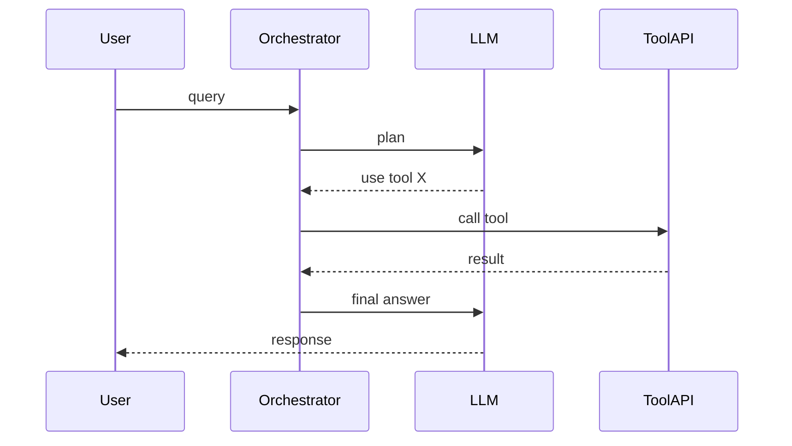

```python
# Implementation
```

---

### Pattern 3: {{Idiomatic AI engineering pattern}}

**Intent:** {{Language-specific idiom or best practice}}

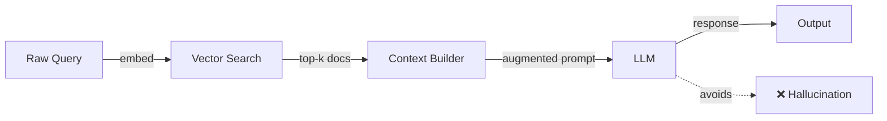

```python
# ❌ Non-idiomatic
...

# ✅ Idiomatic pattern
...
```

---

## Clean Code

### Naming & Readability

```python
# ❌ Cryptic
def proc(d, f=False):
    ...

# ✅ Self-documenting
def retrieve_relevant_chunks(query: str, include_metadata: bool = False) -> list[dict]:
    ...
```

| Element | Rule | Example |
|---------|------|---------|
| Functions | Verb + noun | `embed_query`, `retrieve_chunks`, `generate_response` |
| Variables | Noun, describes content | `embedding_vector`, `retrieved_docs`, `token_count` |
| Booleans | `is/has/can` prefix | `is_cached`, `has_context`, `can_stream` |

---

### SOLID in Practice

**Single Responsibility:**
```python
# ❌ One class doing everything
class AIAssistant:
    # handles embedding + retrieval + generation + logging + caching

# ✅ Each class has one reason to change
class EmbeddingService: ...
class VectorStore: ...
class GenerationService: ...
```

---

## Product Use / Feature

### 1. {{Product/Tool Name}}

- **How it uses {{TOPIC_NAME}}:** Description with architectural context
- **Scale:** Numbers, traffic, data volume
- **Key insight:** What can be learned from their approach

> 3-5 real products.

---

## Error Handling

### Pattern 1: Retry with exponential backoff

```python
from tenacity import retry, stop_after_attempt, wait_exponential, retry_if_exception_type

@retry(
    stop=stop_after_attempt(3),
    wait=wait_exponential(multiplier=1, min=2, max=30),
    retry=retry_if_exception_type(openai.RateLimitError),
)
def call_llm(messages: list[dict]) -> str:
    response = client.chat.completions.create(
        model="gpt-4o",
        messages=messages,
    )
    return response.choices[0].message.content
```

### Common Error Patterns

| Situation | Pattern | Example |
|-----------|---------|---------|
| Rate limits | Exponential backoff | `tenacity` retry |
| Context too long | Truncate / summarize | Count tokens before calling |
| Empty response | Validate and retry | Check `finish_reason` |
| Hallucination | Grounding with RAG | Add retrieved context |

---

## Security Considerations

### 1. Prompt Injection

**Risk level:** High

```python
# ❌ Vulnerable code
system_prompt = f"You are a helper. Rules: {user_rules}"

# ✅ Secure code
system_prompt = "You are a helpful assistant. Follow company policy only."
# User input goes in the user message, never in system prompt
```

### Security Checklist

- [ ] API keys stored in environment variables, never in code
- [ ] User input sanitized before inclusion in prompts
- [ ] Output validated before rendering to users
- [ ] Rate limiting on AI endpoints

---

## Performance Optimization

### Optimization 1: Caching embeddings

```python
# ❌ Slow — re-embeds every time
def search(query: str) -> list[str]:
    embedding = embed(query)  # network call every time
    return vector_db.search(embedding)

# ✅ Fast — cache embeddings
from functools import lru_cache

@lru_cache(maxsize=1000)
def get_embedding(text: str) -> list[float]:
    return embed(text)
```

**Benchmark results:**
```
Without cache:  450ms avg (network call each time)
With LRU cache:   2ms avg (cache hit)
```

### Performance Decision Matrix

| Scenario | Approach | Why |
|----------|----------|-----|
| Low traffic | Simple API call | Readability > performance |
| High traffic | Caching + batching | Performance critical |
| Batch processing | Async + concurrency | Throughput matters |

---

## Metrics & Analytics

### Key Metrics

| Metric | Type | Description | Alert threshold |
|--------|------|-------------|-----------------|
| **inference_latency_p50** | Histogram | Median response time | > 2s |
| **inference_latency_p99** | Histogram | Tail latency | > 10s |
| **tokens_per_second** | Gauge | Generation throughput | < 20 t/s |
| **gpu_memory_usage_bytes** | Gauge | GPU utilization | > 90% |

---

## Debugging Guide

### Problem 1: High latency on first request

**Symptoms:** First request takes 5-10x longer than subsequent ones.

**Diagnostic steps:**
```bash
# Profile request timing
python -c "import time; start=time.time(); call_llm('test'); print(time.time()-start)"
```

**Root cause:** Cold start — model loading, connection pool initialization.
**Fix:** Warm up the connection pool at startup.

---

## Best Practices

- **Practice 1:** Explanation + code snippet
- **Practice 2:** Explanation + why it matters in production

---

## Edge Cases & Pitfalls

### Pitfall 1: Context window overflow

```python
# Code that causes issues when documents are too long
def build_prompt(docs: list[str], query: str) -> str:
    context = "\n".join(docs)  # Can exceed context window!
    return f"Context: {context}\nQuestion: {query}"
```

**Impact:** API error or truncated response.
**Detection:** Count tokens before calling.
**Fix:** Truncate or chunk context to fit window.

---

## Common Mistakes

### Mistake 1: Not counting tokens before API call

```python
# ❌ Looks correct but can fail with long contexts
messages = build_messages(all_documents, query)
response = client.chat.completions.create(model="gpt-4o", messages=messages)

# ✅ Properly handles token limits
import tiktoken
enc = tiktoken.encoding_for_model("gpt-4o")
token_count = sum(len(enc.encode(m["content"])) for m in messages)
if token_count > 120_000:
    messages = truncate_messages(messages, max_tokens=120_000)
```

---

## Tricky Points

### Tricky Point 1: Embedding model mismatch

```python
# Indexed with one model, queried with another — silent failure
index_embedding = embed_with_model_A(doc)   # 1536 dims
query_embedding = embed_with_model_B(query)  # 768 dims — wrong!
```

**Why it's tricky:** Vector dimensions differ — error or wrong results.

---

## Test

### Multiple Choice (harder)

**1. {{Question involving trade-offs}}?**

- A) ...
- B) ...
- C) ...
- D) ...

<details>
<summary>Answer</summary>
**B)** — Detailed explanation.
</details>

### Code Analysis

**2. What happens when this RAG pipeline runs on a 500-page document?**

```python
# pipeline code
```

<details>
<summary>Answer</summary>
Explanation of context window overflow or performance issues.
</details>

---

## Tricky Questions

**1. {{Question that tests deep understanding}}?**

- A) {{Extremely convincing wrong answer}}
- B) ...
- C) ...
- D) {{Correct but counter-intuitive}}

<details>
<summary>Answer</summary>
**D)** — Deep explanation.
</details>

---

## Cheat Sheet

| Scenario | Pattern | Key consideration |
|----------|---------|-------------------|
| {{Scenario 1}} | `{{code pattern}}` | {{what to watch for}} |
| {{Scenario 2}} | `{{code pattern}}` | {{what to watch for}} |

---

## Summary

- Key insight 1
- Key insight 2
- Key insight 3

**Next step:** What to explore at Senior level.

---

## What You Can Build

### Production systems:
- **{{System 1}}:** RAG pipeline with caching and fallback
- **{{System 2}}:** Multi-step AI agent with tool use

### Learning path:

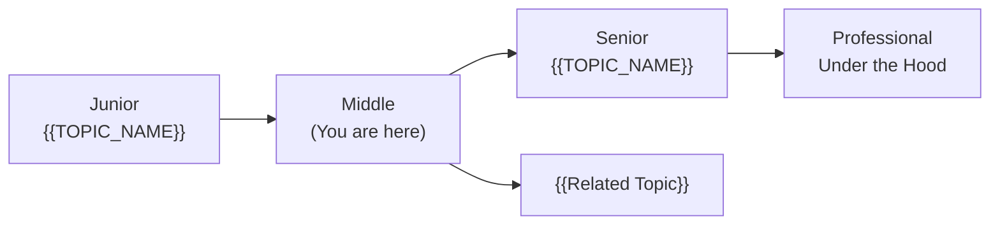

---

## Further Reading

- **Official docs:** [{{link title}}]({{url}})
- **Blog post:** [{{link title}}]({{url}}) — what you'll learn
- **Conference talk:** [{{link title}}]({{url}}) — speaker, event, key takeaways

---

## Related Topics

- **[{{Related Topic 1}}](../XX-related-topic/)** — how it connects
- **[{{Related Topic 2}}](../XX-related-topic/)** — how it connects

---

## Diagrams & Visual Aids

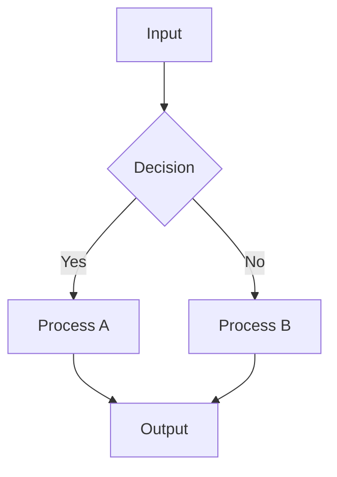

</details>

---
---

# TEMPLATE 3 — `senior.md`

<details open>
<summary><strong>Template Content</strong></summary>

# {{TOPIC_NAME}} — Senior Level

## Table of Contents

1. [Introduction](#introduction)
2. [Core Concepts](#core-concepts)
3. [Pros & Cons](#pros--cons)
4. [Use Cases](#use-cases)
5. [Code Examples](#code-examples)
6. [Coding Patterns](#coding-patterns)
7. [Clean Code](#clean-code)
8. [Best Practices](#best-practices)
9. [Product Use / Feature](#product-use--feature)
10. [Error Handling](#error-handling)
11. [Security Considerations](#security-considerations)
12. [Performance Optimization](#performance-optimization)
13. [Metrics & Analytics](#metrics--analytics)
14. [Debugging Guide](#debugging-guide)
15. [Edge Cases & Pitfalls](#edge-cases--pitfalls)
16. [Postmortems & System Failures](#postmortems--system-failures)
17. [Common Mistakes](#common-mistakes)
18. [Tricky Points](#tricky-points)
19. [Test](#test)
20. [Tricky Questions](#tricky-questions)
21. [Cheat Sheet](#cheat-sheet)
22. [Summary](#summary)
23. [What You Can Build](#what-you-can-build)
24. [Further Reading](#further-reading)
25. [Related Topics](#related-topics)
26. [Diagrams & Visual Aids](#diagrams--visual-aids)

---

## Introduction

> Focus: "How to optimize?" and "How to architect?"

For AI engineers who:
- Design and build production AI systems
- Optimize model serving pipelines
- Mentor junior/middle AI engineers
- Make architectural decisions about model selection, RAG design, agent systems

---

## Core Concepts

### Concept 1: {{Architecture-level concept}}

Deep dive with:
- Design patterns and when to apply them
- Performance characteristics (latency, throughput, cost)
- Comparison with alternative approaches

```python
# Advanced pattern with detailed annotations
```

### Concept 2: {{Optimization concept}}

Benchmark comparisons:

```python
# Benchmark: naive vs optimized approach
import time

def benchmark_approach_a():
    start = time.perf_counter()
    # ... approach A
    return time.perf_counter() - start

def benchmark_approach_b():
    start = time.perf_counter()
    # ... approach B
    return time.perf_counter() - start
```

Results:
```
Approach A (naive):   1240ms p50, 4500ms p99
Approach B (optimized):  180ms p50,  420ms p99
```

---

## Pros & Cons

### Strategic analysis:

| Pros | Cons | Impact |
|------|------|--------|
| {{Advantage 1}} | {{Disadvantage 1}} | {{Impact on system architecture}} |
| {{Advantage 2}} | {{Disadvantage 2}} | {{Impact on team/maintenance}} |

---

## Code Examples

### Example 1: {{Architecture pattern}}

```python
# Full implementation of a production RAG/agent pattern
# With proper interfaces, DI, error handling, observability
```

**Architecture decisions:** Why this structure.

### Example 2: {{Performance optimization}}

```python
# Before optimization
...

# After optimization (with benchmark proof)
...
```

---

## Coding Patterns

### Pattern 1: {{Architectural pattern — e.g., Adaptive RAG, ReAct Agent}}

**Category:** Retrieval / Agent / Orchestration / Resilience
**Intent:** {{The system-level problem this pattern solves}}
**Problem it solves:** {{Concrete scenario}}
**Trade-offs:** {{What you gain vs what complexity you add}}

**Architecture diagram:**

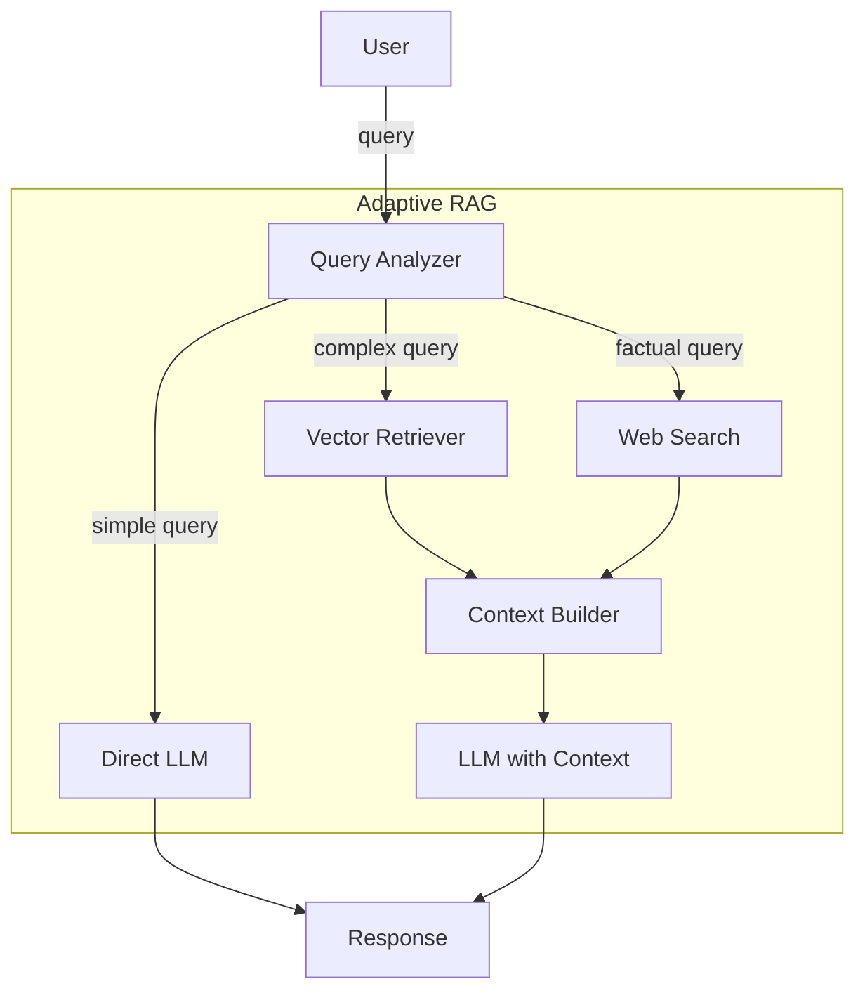

**Implementation:**

```python
# Senior-level implementation
# Full pattern with error handling, observability, graceful degradation
```

**When this pattern wins:**
- {{Scenario 1}}
- {{Scenario 2}}

---

### Pattern 2: {{Concurrency / Performance pattern}}

**Category:** Performance / Throughput
**Intent:** {{What it optimizes}}

**Flow diagram:**

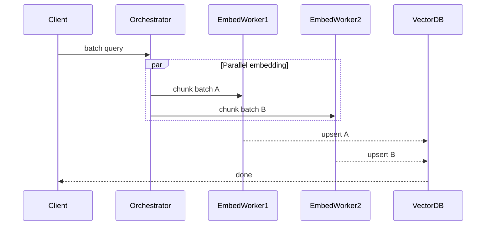

```python
# Async batch processing implementation
import asyncio

async def embed_batch(texts: list[str]) -> list[list[float]]:
    tasks = [embed_async(t) for t in texts]
    return await asyncio.gather(*tasks)
```

---

### Pattern 3: {{Resilience pattern — e.g., Fallback Chain}}

**Category:** Resilience / Reliability
**Intent:** {{How it improves system reliability}}

**State diagram:**

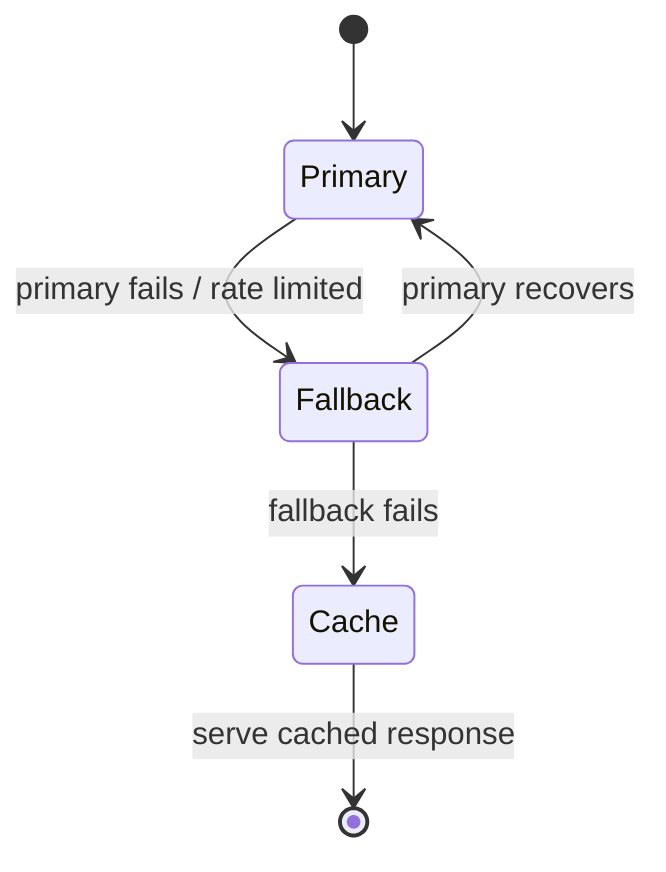

```python
# Fallback chain implementation
async def generate_with_fallback(prompt: str) -> str:
    for model in ["gpt-4o", "gpt-4o-mini", "claude-3-haiku"]:
        try:
            return await call_model(model, prompt)
        except Exception as e:
            logger.warning(f"Model {model} failed: {e}, trying next")
    return get_cached_response(prompt)
```

---

### Pattern 4: {{Observability / Evaluation pattern}}

**Category:** Observability / Quality
**Intent:** Track and improve AI system quality over time

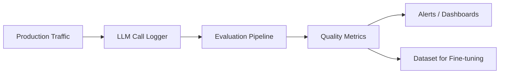

---

### Pattern Comparison Matrix

| Pattern | Use When | Avoid When | Complexity |
|---------|----------|------------|------------|
| Adaptive RAG | Query types vary | All queries are similar | Medium |
| Fallback Chain | High availability needed | Cost is primary concern | Low |
| Async Batch | High throughput | Low latency critical | Medium |
| Eval Pipeline | Quality monitoring needed | POC / prototype | High |

---

## Clean Code

### Clean Architecture Boundaries

```python
# ❌ Layering violation — business logic knows about infra
class RecommendationService:
    def __init__(self):
        self.client = openai.OpenAI()  # direct infra dependency
        self.db = psycopg2.connect(...)  # direct DB dependency

# ✅ Dependency inversion
class LLMClient(Protocol):
    def complete(self, messages: list[dict]) -> str: ...

class VectorStore(Protocol):
    def search(self, embedding: list[float], k: int) -> list[Document]: ...

class RecommendationService:
    def __init__(self, llm: LLMClient, store: VectorStore):
        self.llm = llm
        self.store = store
```

**Dependency flow:**
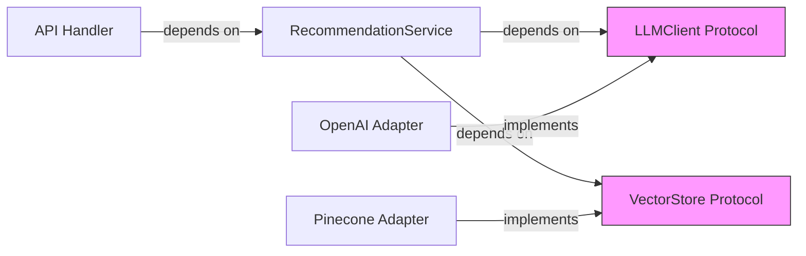

---

### Code Smells at Senior Level

| Smell | Symptom | Refactoring |
|-------|---------|-------------|
| **God Pipeline** | One function with 20+ AI steps | Split into composable stages |
| **Magic Prompts** | Hardcoded prompt strings | Prompt templates with versioning |
| **Silent Hallucination** | No output validation | Add grounding checks |
| **Cost Blindness** | No token counting | Add usage tracking |

---

## Best Practices

### Must Do ✅

1. **Version your prompts** — treat prompts like code; use a prompt registry
   ```python
   # ✅ Versioned, testable prompts
   PROMPTS = {
       "v1": "Answer the question based on the context: {context}\nQuestion: {question}",
       "v2": "Use ONLY the provided context...",
   }
   ```

2. **Always validate AI outputs** before using them in downstream systems
   ```python
   def validate_response(response: str, expected_schema: dict) -> bool:
       try:
           parsed = json.loads(response)
           return all(k in parsed for k in expected_schema)
       except json.JSONDecodeError:
           return False
   ```

3. **Track cost per request** to avoid surprise bills
   ```python
   def log_usage(response: openai.ChatCompletion) -> None:
       logger.info("tokens_used", extra={
           "prompt_tokens": response.usage.prompt_tokens,
           "completion_tokens": response.usage.completion_tokens,
           "estimated_cost_usd": calculate_cost(response.usage),
       })
   ```

### Never Do ❌

1. **Never put user-controlled text in the system prompt** — prompt injection risk
   ```python
   # ❌ Dangerous
   system = f"You are a helper. Custom instructions: {user_input}"
   # ✅ Safe — user input only in user messages
   ```

2. **Never skip output validation for structured data**
   ```python
   # ❌ Trust but don't verify
   data = json.loads(llm_response)  # Can panic if LLM returns prose
   # ✅ Always validate
   data = parse_with_fallback(llm_response, default={})
   ```

3. **Never embed secrets in prompts** — they appear in logs and traces

### Production Checklist

- [ ] Prompt versions tracked in version control
- [ ] Token counting before every API call
- [ ] Retry logic with exponential backoff
- [ ] Output validation for all structured responses
- [ ] Cost monitoring and alerting
- [ ] Latency SLO defined and monitored (p50 / p99)
- [ ] Fallback behavior for model unavailability
- [ ] AI outputs never directly executed (no eval/exec)

---

## Product Use / Feature

### 1. {{Company/Product Name}}

- **Architecture:** How they implement {{TOPIC_NAME}} at scale
- **Scale:** Specific numbers (rps, tokens/day, latency)
- **Lessons learned:** What they changed and why

> 3-5 real-world examples.

---

## Error Handling

### Enterprise-grade error handling

```python
from dataclasses import dataclass
from enum import Enum

class AIErrorCode(Enum):
    RATE_LIMITED = "rate_limited"
    CONTEXT_TOO_LONG = "context_too_long"
    INVALID_RESPONSE = "invalid_response"
    MODEL_UNAVAILABLE = "model_unavailable"

@dataclass
class AIServiceError(Exception):
    code: AIErrorCode
    message: str
    retryable: bool
    metadata: dict

async def generate(prompt: str) -> str:
    try:
        return await _call_llm(prompt)
    except openai.RateLimitError as e:
        raise AIServiceError(
            code=AIErrorCode.RATE_LIMITED,
            message="Rate limit exceeded",
            retryable=True,
            metadata={"retry_after": e.response.headers.get("retry-after")},
        )
```

---

## Security Considerations

### 1. Prompt Injection at Scale

**Risk level:** Critical
**OWASP LLM category:** LLM01 — Prompt Injection

```python
# ❌ Vulnerable
def answer_question(user_question: str, context: str) -> str:
    prompt = f"Context: {context}\nUser: {user_question}\nAnswer:"
    return call_llm(prompt)

# ✅ Secure — structured messages prevent injection
def answer_question(user_question: str, context: str) -> str:
    messages = [
        {"role": "system", "content": "Answer ONLY from the provided context."},
        {"role": "user", "content": f"Context:\n{sanitize(context)}"},
        {"role": "user", "content": sanitize(user_question)},
    ]
    return call_llm(messages)
```

### Threat Model

| Threat | Likelihood | Impact | Mitigation |
|--------|:---------:|:------:|------------|
| Prompt injection | High | Critical | Input sanitization, structured prompts |
| Data exfiltration via LLM | Medium | High | Output filtering, PII detection |
| Model poisoning | Low | Critical | Evaluate on clean test set before deploy |

---

## Performance Optimization

### Optimization 1: Semantic caching

```python
# Before — every query hits the LLM
def answer(question: str) -> str:
    return call_llm(question)

# After — similar questions hit cache
class SemanticCache:
    def __init__(self, threshold: float = 0.95):
        self.threshold = threshold
        self.cache: list[tuple[list[float], str]] = []

    def get(self, query: str) -> str | None:
        q_emb = embed(query)
        for stored_emb, response in self.cache:
            if cosine_similarity(q_emb, stored_emb) > self.threshold:
                return response
        return None
```

**Benchmark proof:**
```
Without semantic cache:  800ms avg, $0.002/query
With semantic cache:      12ms avg (cache hit rate ~40%), $0.0012/query
```

---

## Metrics & Analytics

### SLO / SLA Definition

| SLI | SLO Target | Measurement window | Consequence if breached |
|-----|-----------|-------------------|------------------------|
| **inference latency p50** | < 500ms | 5 min rolling | Warning alert |
| **inference latency p99** | < 3000ms | 5 min rolling | PagerDuty alert |
| **tokens/second** | > 50 t/s | 1 hour | Capacity alert |
| **error rate** | < 1% | 1 hour | Incident created |
| **GPU memory usage** | < 85% | 1 min | Scaling trigger |

---

## Debugging Guide

### Problem 1: Sudden latency spike

**Symptoms:** p99 latency jumps from 2s to 30s.

**Diagnostic steps:**
```bash
# Check GPU memory pressure
nvidia-smi --query-gpu=memory.used,memory.total --format=csv

# Check token usage trends
# Look for context length increase in recent requests
```

**Root cause:** Context window growing due to conversation history accumulation.
**Fix:** Implement conversation summarization or sliding window.

---

## Edge Cases & Pitfalls

### Pitfall 1: GPU memory fragmentation under load

```python
# Works fine for 100 requests, OOMs at 1000
# GPU memory fragments when batch sizes vary wildly
```

**At what scale it breaks:** 500+ concurrent requests with variable lengths.
**Fix:** Use continuous batching (vLLM) or pad to fixed lengths.

---

## Postmortems & System Failures

### The Embedding Model Migration Outage

- **The goal:** Upgrade from ada-002 to text-embedding-3-large
- **The mistake:** Migrated the model but not the existing index
- **The impact:** All similarity searches returned wrong results for 6 hours
- **The fix:** Re-embed all documents before switching the query model

**Key takeaway:** Embedding model and vector index are tightly coupled — always migrate together.

---

## Test

### Architecture Questions

**1. You're designing a RAG system for 10M documents. Which approach is best?**

- A) Store all docs in a single FAISS index in memory
- B) Use chunking + hierarchical retrieval
- C) Send all 10M docs in the context window
- D) Fine-tune the model on all documents

<details>
<summary>Answer</summary>
**B)** — Full architectural reasoning with trade-offs.
</details>

---

## Tricky Questions

**1. {{Question that even experienced AI engineers get wrong}}?**

<details>
<summary>Answer</summary>
Detailed explanation with benchmark or source reference.
</details>

---

## Cheat Sheet

### Architecture Decision Matrix

| Scenario | Recommended pattern | Avoid | Why |
|----------|-------------------|-------|-----|
| {{scenario 1}} | {{pattern}} | {{anti-pattern}} | {{reasoning}} |

### Performance Quick Wins

| Optimization | When to apply | Expected improvement |
|-------------|---------------|---------------------|
| Semantic caching | Repeated similar queries | 40-60% cost reduction |
| Async batching | High throughput ingestion | 5-10x throughput |
| Quantization (INT8) | GPU memory constrained | 2x memory reduction |

---

## Summary

- Key architectural insight 1
- Key performance insight 2
- Key leadership insight 3

---

## What You Can Build

### Architect and lead:
- **Production RAG System:** Large-scale document QA
- **AI Agent Platform:** Multi-step tool-using agents

### Career impact:
- **Staff/Principal AI Engineer** — system design interviews require this depth
- **ML Platform Lead** — define inference infrastructure standards

---

## Further Reading

- **Blog post:** [{{title}}]({{url}}) — production experience at scale
- **Conference talk:** [{{talk title}}]({{url}}) — key insights
- **Source code:** [vLLM](https://github.com/vllm-project/vllm) — production inference

---

## Related Topics

- **[{{Related Topic 1}}](../XX-related-topic/)** — architectural connection
- **[{{Related Topic 2}}](../XX-related-topic/)** — performance connection

---

## Diagrams & Visual Aids


</details>

---
---

# TEMPLATE 4 — `professional.md`

<details open>
<summary><strong>Template Content</strong></summary>

# {{TOPIC_NAME}} — Model Serving and Infrastructure Internals

## Table of Contents

1. [Introduction](#introduction)
2. [How It Works Internally](#how-it-works-internally)
3. [Model Serving Deep Dive](#model-serving-deep-dive)
4. [CUDA Kernels and GPU Execution](#cuda-kernels-and-gpu-execution)
5. [vLLM Internals](#vllm-internals)
6. [Quantization — GPTQ and AWQ](#quantization--gptq-and-awq)
7. [KV Cache Architecture](#kv-cache-architecture)
8. [Memory Layout](#memory-layout)
9. [Performance Internals](#performance-internals)
10. [Edge Cases at the Lowest Level](#edge-cases-at-the-lowest-level)
11. [Test](#test)
12. [Tricky Questions](#tricky-questions)
13. [Summary](#summary)
14. [Further Reading](#further-reading)
15. [Diagrams & Visual Aids](#diagrams--visual-aids)

---

## Introduction

> Focus: "What happens under the hood?"

This document explores what happens internally when {{TOPIC_NAME}} runs in production:
- CUDA kernel execution and GPU memory management
- vLLM's continuous batching and paged attention
- Quantization artifacts and trade-offs (GPTQ vs AWQ)
- KV cache architecture and memory pressure

---

## How It Works Internally

Step-by-step breakdown of what happens during model inference:

1. **Request arrives** → Tokenization
2. **Scheduler** → Assigns request to batch
3. **Prefill phase** → Compute KV cache for prompt tokens
4. **Decode phase** → Autoregressive token generation
5. **KV cache eviction** → LRU or priority-based

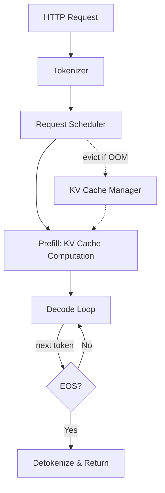

---

## Model Serving Deep Dive

### How vLLM handles {{TOPIC_NAME}}

```python
# Reference to vLLM source code
# vllm/engine/llm_engine.py
# vllm/core/scheduler.py
```

**Key runtime structures:**

```python
# From vLLM source: vllm/sequence.py
class SequenceGroup:
    """A group of sequences that share the same prompt."""
    request_id: str
    seqs: list[Sequence]
    sampling_params: SamplingParams
    arrival_time: float
    # KV cache blocks allocated for this group
    block_tables: dict[int, list[int]]
```

**Key scheduler decisions:**
- `scheduler.schedule()` — decides which requests to run in next step
- `block_manager.allocate()` — assigns physical KV cache blocks
- `block_manager.can_allocate()` — checks memory before scheduling

---

## CUDA Kernels and GPU Execution

What happens at the CUDA level during transformer inference:

```
Attention Computation Pipeline:
┌──────────────────────────────────────┐
│  Input Tokens → Embedding Lookup     │
│  [batch, seq_len] → [batch, seq_len, d_model] │
├──────────────────────────────────────┤
│  QKV Projection (cuBLAS GEMM)        │
│  kernel: batched_gemm                │
├──────────────────────────────────────┤
│  Scaled Dot-Product Attention        │
│  kernel: flash_attention_v2          │
│  (fused softmax + dropout)           │
├──────────────────────────────────────┤
│  Output Projection (cuBLAS GEMM)     │
├──────────────────────────────────────┤
│  FFN: Two GEMMs + activation         │
│  kernel: silu_and_mul (fused)        │
└──────────────────────────────────────┘
```

**FlashAttention key insight:**
```
Standard attention:   O(n²) memory (materializes full attention matrix)
FlashAttention:       O(n) memory  (block-wise tiling, never full matrix)
```

```python
# Standard (slow, high memory)
attn_weights = torch.matmul(q, k.transpose(-2, -1)) / math.sqrt(d_k)
attn_weights = F.softmax(attn_weights, dim=-1)  # O(seq²) memory
output = torch.matmul(attn_weights, v)

# FlashAttention (fast, O(n) memory) — uses tiled SRAM computation
from flash_attn import flash_attn_func
output = flash_attn_func(q, v, k, causal=True)
```

---

## vLLM Internals

### Continuous Batching vs Static Batching

```
Static Batching (naive):
┌─────────────────────────────────────┐
│ Request A: ████████████░░░░░░░░░░░  │ ← waits for longest
│ Request B: ██░░░░░░░░░░░░░░░░░░░░░  │ ← padding wastes GPU
│ Request C: ██████████████████████░  │
└─────────────────────────────────────┘
GPU utilization: ~40%

Continuous Batching (vLLM):
┌─────────────────────────────────────┐
│ Step 1: [A, B, C] generate token 1 │
│ Step 2: [A, C, D] B done → D joins  │
│ Step 3: [A, C, D, E] ...            │
└─────────────────────────────────────┘
GPU utilization: ~85%
```

### Paged Attention

```
Traditional KV cache (contiguous memory):
┌──────────────────────────────────────────┐
│ Request A KV: [token1][token2]...[token1024] │ ← 1024 × d × 2 × layers
│ (must reserve max_seq_len upfront)        │
└──────────────────────────────────────────┘

PagedAttention (vLLM):
┌────────┐  ┌────────┐  ┌────────┐
│ Block 0│  │ Block 7│  │ Block 3│  ← physical blocks (like OS pages)
│ tok0-15│  │ tok16-31│ │ tok32-47│  ← non-contiguous in memory
└────────┘  └────────┘  └────────┘
  ↕ block table maps logical → physical blocks
```

```python
# Key vLLM internals: vllm/core/block_manager.py
class BlockSpaceManager:
    def __init__(self, block_size: int, num_gpu_blocks: int):
        self.block_size = block_size
        self.gpu_allocator = CachedBlockAllocator("gpu", block_size, num_gpu_blocks)

    def can_allocate(self, seq_group: SequenceGroup) -> AllocStatus:
        num_required = self._get_seq_num_required_blocks(seq_group.get_seqs()[0])
        num_free = self.gpu_allocator.get_num_free_blocks()
        if num_free >= num_required:
            return AllocStatus.OK
        elif num_free > 0:
            return AllocStatus.LATER
        return AllocStatus.NEVER
```

---

## Quantization — GPTQ and AWQ

### GPTQ (Post-Training Quantization)

```
Concept: Quantize weights layer by layer using Hessian information
Goal: FP16 → INT4 with minimal accuracy loss

Layer-wise Quantization:
┌─────────────────────────────────────┐
│ Original weight W (FP16)            │
│ Quantized weight Q (INT4)           │
│ Error: E = W - dequant(quant(W))    │
│ Compensation: adjust remaining cols │
│ using inverse Hessian H⁻¹           │
└─────────────────────────────────────┘

Memory: FP16 7B model = 14GB → INT4 = ~4GB
```

### AWQ (Activation-Aware Quantization)

```
Key insight: Not all weights are equally important.
Weights that correspond to high-activation channels
matter more → protect them from quantization error.

AWQ vs GPTQ:
┌──────────────┬──────────────┬──────────────┐
│              │ GPTQ         │ AWQ          │
├──────────────┼──────────────┼──────────────┤
│ Calibration  │ Per-layer    │ Per-channel  │
│ Accuracy     │ Good         │ Better       │
│ Speed        │ Slower quant │ Faster quant │
│ Inference    │ Standard     │ Optimized    │
└──────────────┴──────────────┴──────────────┘
```

```python
# Using AWQ quantized model
from awq import AutoAWQForCausalLM

model = AutoAWQForCausalLM.from_quantized(
    "model_path",
    fuse_layers=True,    # fuse QKV projections for speed
    safetensors=True,
)
```

---

## KV Cache Architecture

```
KV Cache Memory Layout (per layer, per token):
┌────────────────────────────────────────────┐
│ Key:   [num_heads, head_dim] = FP16        │
│        e.g., 32 heads × 128 dims = 4096 elems × 2 bytes = 8KB │
├────────────────────────────────────────────┤
│ Value: [num_heads, head_dim] = FP16        │
│        same: 8KB                           │
└────────────────────────────────────────────┘
Per token, per layer: 16KB
For 32 layers, 2048 tokens: 32 × 2048 × 16KB = 1GB

GPU Memory Budget (A100 80GB):
├── Model weights (FP16 13B): ~26GB
├── KV cache (available):     ~50GB
│   → ~50GB / 16KB per token per layer → ~100K total tokens in flight
└── Activations (temporary):   ~4GB
```

### KV Cache Eviction Strategies

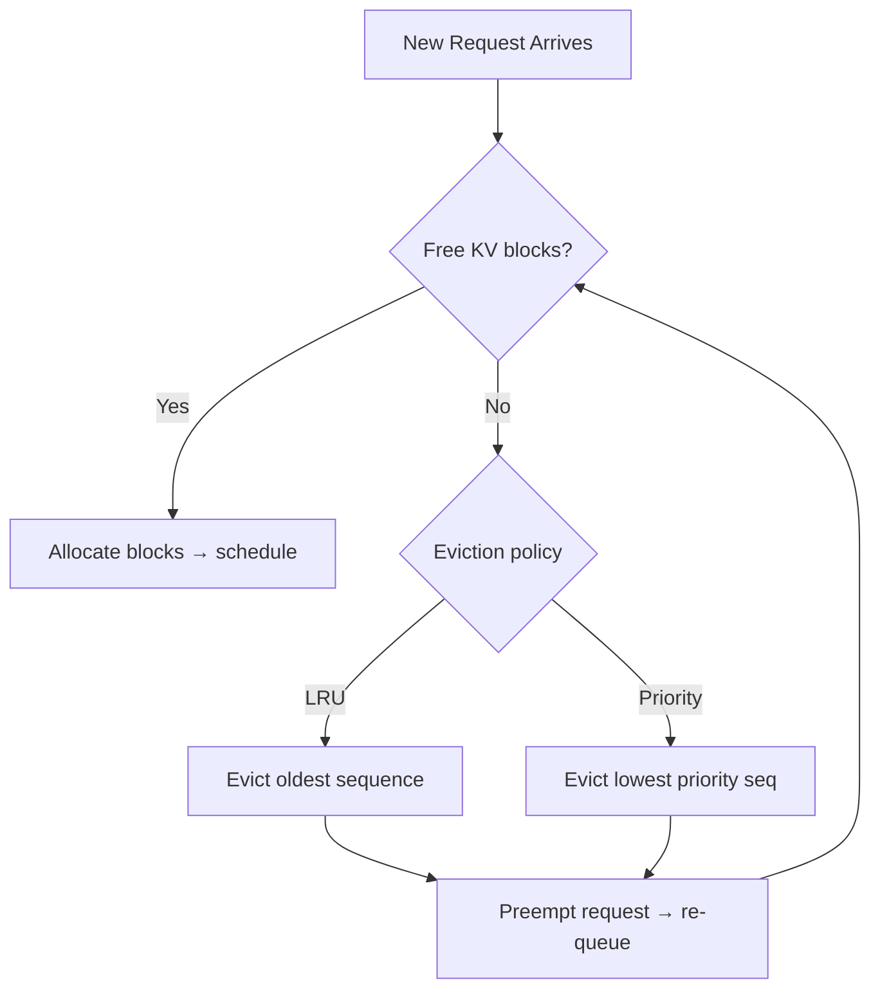

---

## Memory Layout

```
GPU HBM Memory Map (A100 80GB example):
┌──────────────────────────────────┐
│ CUDA context overhead:   ~1 GB   │
├──────────────────────────────────┤
│ Model weights (FP16):    ~26 GB  │ ← static, loaded once
├──────────────────────────────────┤
│ KV Cache (paged blocks): ~48 GB  │ ← dynamic, managed by vLLM
├──────────────────────────────────┤
│ Activation buffers:       ~4 GB  │ ← temporary per forward pass
└──────────────────────────────────┘

KV Block Layout in PagedAttention:
┌──────────────┐
│ Block 0      │ ← 16 tokens × all layers × K+V
│ [K0..K15]    │ ← key cache for tokens 0-15
│ [V0..V15]    │ ← value cache for tokens 0-15
└──────────────┘
```

---

## Performance Internals

### Benchmarks with profiling

```python
# Profile inference with PyTorch profiler
import torch
from torch.profiler import profile, record_function, ProfilerActivity

with profile(activities=[ProfilerActivity.CUDA], record_shapes=True) as prof:
    with record_function("model_inference"):
        output = model.generate(input_ids, max_new_tokens=100)

print(prof.key_averages().table(sort_by="cuda_time_total", row_limit=10))
```

**Internal performance characteristics:**
- Prefill is compute-bound (GEMM operations dominate)
- Decode is memory-bandwidth-bound (reading KV cache per step)
- Batching trades latency for throughput
- FlashAttention reduces attention from O(n²) to O(n) memory

### Throughput vs Latency Trade-off

```
Single request:      20ms TTFT, 30 t/s
Batch of 32:         150ms TTFT, 900 t/s aggregate
Continuous batching: 25ms avg TTFT, 800 t/s aggregate ← best of both
```

---

## Metrics & Analytics (Runtime Level)

### GPU Runtime Metrics

```python
import pynvml

pynvml.nvmlInit()
handle = pynvml.nvmlDeviceGetHandleByIndex(0)

mem_info = pynvml.nvmlDeviceGetMemoryInfo(handle)
utilization = pynvml.nvmlDeviceGetUtilizationRates(handle)

print(f"GPU memory used: {mem_info.used / 1e9:.1f} GB / {mem_info.total / 1e9:.1f} GB")
print(f"GPU utilization: {utilization.gpu}%")
print(f"Memory bandwidth utilization: {utilization.memory}%")
```

### Key Runtime Metrics

| Metric | What it measures | Impact |
|--------|-----------------|--------|
| `gpu_utilization_pct` | Compute saturation | Low = underutilized |
| `kv_cache_usage_pct` | Memory pressure | High = evictions likely |
| `batch_size_avg` | Scheduling efficiency | Low = throughput waste |
| `tokens_per_second` | End-to-end throughput | Main perf KPI |
| `prefill_time_ms` | TTFT component | Context length driven |
| `decode_time_ms` | Generation speed | Memory-BW driven |

---

## Edge Cases at the Lowest Level

### Edge Case 1: KV cache thrashing

What happens when too many long sequences compete for KV cache blocks:

```python
# Scenario that causes thrashing
# 100 concurrent requests each with 8K token context
# A100 80GB: only ~50GB for KV cache
# 100 × 8K tokens × 32 layers × 16KB = 400GB → massive eviction
```

**Internal behavior:** vLLM preempts sequences, saves state to CPU RAM, re-schedules.
**Why it matters:** Preemption causes 10-100x latency spikes for affected requests.
**Mitigation:** Limit max context length or max concurrent long sequences.

---

## Test

### Internal Knowledge Questions

**1. Why is the decode phase memory-bandwidth-bound rather than compute-bound?**

<details>
<summary>Answer</summary>
During decode, only one new token is generated per step. The GEMM operation for a single token has very low arithmetic intensity (FLOPs / bytes). The GPU spends most time reading the KV cache and model weights from HBM, not computing. Prefill, by contrast, processes many tokens at once → high arithmetic intensity → compute-bound.
</details>

**2. What is the memory cost of running a 7B parameter model with 4K context, 32 concurrent requests, FP16 weights?**

<details>
<summary>Answer</summary>
Weights: 7B × 2 bytes = 14GB
KV cache: 32 requests × 4K tokens × 32 layers × 16KB/token/layer = 65GB
Total: ~79GB → barely fits A100 80GB; need quantization or smaller batch.
</details>

---

## Tricky Questions

**1. You switch from FP16 to INT4 quantization (AWQ). Tokens/second goes up 2x. Why does latency for single requests also improve even though they were already compute-bound?**

<details>
<summary>Answer</summary>
INT4 quantization reduces weight size by 4x. For single requests (decode phase), the bottleneck is memory bandwidth — reading weights from HBM. Smaller weights = less data to read = faster decode. Additionally, fitting more of the model in L2 cache reduces HBM reads entirely. The throughput gain is from fitting 2x more KV cache in the same GPU memory.
</details>

---

## Self-Assessment Checklist

### I can explain internals:
- [ ] How vLLM's continuous batching differs from static batching
- [ ] Why decode is memory-bandwidth-bound and prefill is compute-bound
- [ ] How PagedAttention manages KV cache blocks
- [ ] The difference between GPTQ and AWQ quantization

### I can analyze:
- [ ] Read CUDA profiler output for transformer inference
- [ ] Calculate GPU memory requirements for a given model + context + batch
- [ ] Predict throughput vs latency trade-offs for different batch sizes

---

## Summary

- Continuous batching (vLLM) achieves 2-10x higher throughput vs static batching
- PagedAttention eliminates KV cache fragmentation — enables 10-40x more concurrent requests
- INT4 quantization (AWQ/GPTQ) reduces memory 4x with <1% accuracy loss on most tasks
- Decode is memory-bandwidth-bound; optimize by batching and reducing KV cache reads

**Key takeaway:** Understanding inference internals lets you predict performance and make correct capacity planning decisions.

---

## Further Reading

- **vLLM paper:** [Efficient Memory Management for Large Language Model Serving with PagedAttention](https://arxiv.org/abs/2309.06180)
- **FlashAttention:** [FlashAttention-2](https://arxiv.org/abs/2307.08691)
- **AWQ paper:** [AWQ: Activation-aware Weight Quantization](https://arxiv.org/abs/2306.00978)
- **vLLM source:** [github.com/vllm-project/vllm](https://github.com/vllm-project/vllm)

---

## Diagrams & Visual Aids

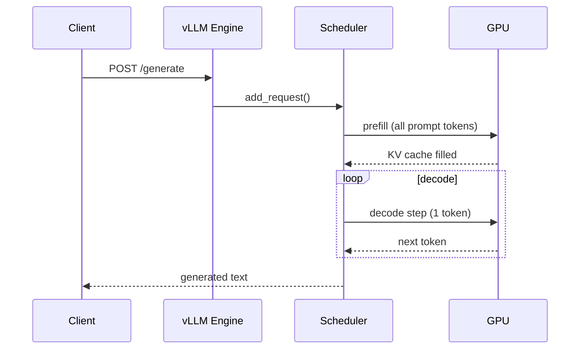

</details>

---
---

# TEMPLATE 5 — `interview.md`

<details open>
<summary><strong>Template Content</strong></summary>

# {{TOPIC_NAME}} — Interview Questions

## Table of Contents

1. [Junior Level](#junior-level)
2. [Middle Level](#middle-level)
3. [Senior Level](#senior-level)
4. [Scenario-Based Questions](#scenario-based-questions)
5. [FAQ](#faq)

---

## Junior Level

### 1. {{Basic conceptual question about LLMs/AI}}?

**Answer:**
Clear, concise explanation that a junior AI engineer should be able to give.

---

### 2. {{Question about API usage}}?

**Answer:**
...with code example if needed.

```python
# Code example
```

---

### 3. {{Question about tokens, context, embeddings}}?

**Answer:**
...

---

> 5-7 junior questions. Test basic understanding of LLM APIs and AI terminology.

---

## Middle Level

### 4. {{Question about RAG system design}}?

**Answer:**
Detailed answer with architecture context.

```python
# Code example if applicable
```

---

### 5. {{Question about trade-offs between models or approaches}}?

**Answer:**
...

---

### 6. {{Question about debugging slow or inaccurate AI responses}}?

**Answer:**
...

---

> 4-6 middle questions. Test practical experience and architectural decision-making.

---

## Senior Level

### 7. {{Architecture question — design a production RAG or agent system}}?

**Answer:**
Comprehensive answer covering trade-offs, component design, failure modes.

---

### 8. {{Performance/optimization question — latency, throughput, cost}}?

**Answer:**
...with benchmarks or profiling examples.

---

### 9. {{System design: serving 10M users with LLMs}}?

**Answer:**
...

---

> 4-6 senior questions. Test deep understanding and architectural judgment.

---

## Scenario-Based Questions

### 10. Your RAG system's answers are accurate for short documents but hallucinate for long ones. How do you debug this?

**Answer:**
Step-by-step approach:
1. Check retrieval quality: are the right chunks being retrieved?
2. Check context window: are chunks being truncated?
3. Check chunk size: are chunks too large, diluting relevant content?
4. Add faithfulness evaluation (e.g., Ragas) to measure grounding

---

### 11. Inference latency suddenly spikes from 200ms to 5000ms in production. What do you do?

**Answer:**
...

---

> 3-5 scenario questions. Test problem-solving under realistic AI engineering conditions.

---

## FAQ

### Q: What's the difference between fine-tuning and RAG?

**A:** RAG adds relevant context at inference time — no model weights change, fast to update, great for knowledge-heavy tasks. Fine-tuning changes model weights — better for style/format adaptation, but expensive and slow to update.

### Q: What do interviewers look for in AI engineering answers?

**A:** Key evaluation criteria:
- **Junior:** Knows basic API usage, understands tokens and context windows
- **Middle:** Can design a RAG pipeline, understands retrieval quality metrics
- **Senior:** Can architect a production AI system with reliability, cost, and latency SLOs

</details>

---
---

# TEMPLATE 6 — `tasks.md`

<details open>
<summary><strong>Template Content</strong></summary>

# {{TOPIC_NAME}} — Practical Tasks

## Table of Contents

1. [Junior Tasks](#junior-tasks)
2. [Middle Tasks](#middle-tasks)
3. [Senior Tasks](#senior-tasks)
4. [Questions](#questions)
5. [Mini Projects](#mini-projects)
6. [Challenge](#challenge)

---

## Junior Tasks

### Task 1: {{Simple coding task title}}

**Type:** 💻 Code

**Goal:** {{What skill this practices}}

**Instructions:**
1. ...
2. ...
3. ...

**Starter code:**

```python
import openai

client = openai.OpenAI()

# TODO: Complete this
def ask_question(question: str) -> str:
    pass
```

**Expected output:**
```
...
```

**Evaluation criteria:**
- [ ] Code runs without errors
- [ ] Output matches expected
- [ ] Proper error handling for API failures

---

### Task 2: {{Simple design task}}

**Type:** 🎨 Design

**Goal:** {{What design skill this practices}}

**Instructions:**
1. ...
2. ...

**Deliverable:** Mermaid diagram showing the AI pipeline

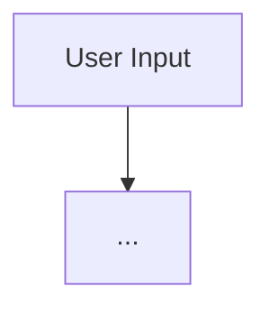

**Evaluation criteria:**
- [ ] Design is clear and readable
- [ ] All components labeled

---

> 3-4 junior tasks. Mix of 💻 Code and 🎨 Design tasks.

---

## Middle Tasks

### Task 3: {{Production-oriented RAG task}}

**Type:** 💻 Code

**Goal:** Build a simple RAG pipeline with proper error handling

**Scenario:** You need to build a document QA system for a company's internal wiki.

**Requirements:**
- [ ] Chunk documents into 512-token segments
- [ ] Embed chunks using OpenAI embeddings
- [ ] Store in a vector database (FAISS or Chroma)
- [ ] Retrieve top-3 relevant chunks for each query
- [ ] Generate answer grounded in retrieved context
- [ ] Write tests for retrieval quality

**Hints:**
<details>
<summary>Hint 1</summary>
Use `tiktoken` to count tokens accurately before chunking.
</details>
<details>
<summary>Hint 2</summary>
Always test retrieval before testing generation — retrieval quality is the #1 factor in RAG accuracy.
</details>

---

## Senior Tasks

### Task 4: {{Architecture/optimization task}}

**Type:** 💻 Code

**Goal:** Design and implement a production-grade inference pipeline

**Scenario:** Your AI service handles 500 req/s. p99 latency must be < 2s. GPU memory is limited to 40GB.

**Requirements:**
- [ ] Implement semantic caching
- [ ] Add async request handling
- [ ] Benchmark before and after optimization
- [ ] Document trade-offs

**Provided code to optimize:**

```python
# Sub-optimal sequential inference pipeline
def handle_request(query: str) -> str:
    embedding = embed(query)  # no caching
    docs = vector_db.search(embedding)
    response = llm.complete(build_prompt(docs, query))
    return response
```

---

## Questions

### 1. What is the difference between semantic search and keyword search?

**Answer:**
Semantic search uses embedding similarity to find conceptually related content even without keyword overlap. Keyword search (BM25, TF-IDF) requires matching terms. Hybrid search combines both for best results.

---

## Mini Projects

### Project 1: Document QA System

**Goal:** End-to-end RAG pipeline with evaluation

**Requirements:**
- [ ] Ingest PDF documents
- [ ] Chunk and embed with versioned embedding model
- [ ] Retrieve and generate with faithfulness scoring
- [ ] Dashboard showing query latency and retrieval quality

**Difficulty:** Middle
**Estimated time:** 8 hours

---

## Challenge

### Optimize a RAG Pipeline to < 200ms p99

**Problem:** Given a working RAG pipeline with 800ms p99 latency, optimize to < 200ms.

**Constraints:**
- Cannot change the LLM model
- Must maintain > 90% answer quality score
- No external paid caching services

**Scoring:**
- Correctness (quality maintained): 50%
- Performance (< 200ms p99): 30%
- Code quality: 20%

</details>

---
---

# TEMPLATE 7 — `find-bug.md`

<details open>
<summary><strong>Template Content</strong></summary>

# {{TOPIC_NAME}} — Find the Bug

> **Practice finding and fixing bugs in AI engineering code related to {{TOPIC_NAME}}.**
> Each exercise contains buggy code — your job is to find the bug, explain why it happens, and fix it.

---

## How to Use

1. Read the buggy code carefully
2. Try to find the bug **without** looking at the hint
3. Write the fix yourself before checking the solution
4. Understand **why** the bug happens — not just how to fix it

### Difficulty Levels

| Level | Description |
|:-----:|:-----------|
| 🟢 | **Easy** — Common beginner mistakes, API misuse |
| 🟡 | **Medium** — Logic errors, subtle AI behavior, context issues |
| 🔴 | **Hard** — Race conditions, memory issues, evaluation failures |

---

## Bug 1: {{Bug title}} 🟢

**What the code should do:** {{Expected behavior}}

```python
import openai

client = openai.OpenAI()

def ask_llm(question: str) -> str:
    # Buggy code here
    response = client.chat.completions.create(
        model="gpt-4o",
        messages=question  # bug: should be list of dicts
    )
    return response.choices[0].message.content
```

**Expected output:**
```
A helpful answer to the question
```

**Actual output:**
```
TypeError: messages must be a list
```

<details>
<summary>💡 Hint</summary>
Look at the `messages` parameter — what type does the API expect?
</details>

<details>
<summary>🐛 Bug Explanation</summary>

**Bug:** `messages` parameter receives a raw string instead of `list[dict]`
**Why it happens:** The OpenAI API requires messages in chat format
**Impact:** TypeError on every call

</details>

<details>
<summary>✅ Fixed Code</summary>

```python
def ask_llm(question: str) -> str:
    response = client.chat.completions.create(
        model="gpt-4o",
        messages=[{"role": "user", "content": question}]  # fixed
    )
    return response.choices[0].message.content
```

**What changed:** Wrapped question string in proper message dict format

</details>

---

## Bug 2: {{Bug title}} 🟢

**What the code should do:** {{Expected behavior}}

```python
# Buggy code
```

<details>
<summary>💡 Hint</summary>
...
</details>

<details>
<summary>🐛 Bug Explanation</summary>

**Bug:** ...
**Why it happens:** ...
**Impact:** ...

</details>

<details>
<summary>✅ Fixed Code</summary>

```python
# Fixed code
```

**What changed:** ...

</details>

---

## Bug 3: {{Bug title}} 🟢

**What the code should do:** {{Expected behavior}}

```python
# Buggy code
```

<details>
<summary>💡 Hint</summary>
...
</details>

<details>
<summary>🐛 Bug Explanation</summary>

**Bug:** ...
**Why it happens:** ...
**Impact:** ...

</details>

<details>
<summary>✅ Fixed Code</summary>

```python
# Fixed code
```

**What changed:** ...

</details>

---

## Bug 4: {{Bug title}} 🟡

**What the code should do:** {{Expected behavior}}

```python
# Buggy code — medium difficulty
# Logic error in RAG retrieval or context building
```

<details>
<summary>💡 Hint</summary>
...
</details>

<details>
<summary>🐛 Bug Explanation</summary>

**Bug:** ...
**Why it happens:** ...
**Impact:** ...

</details>

<details>
<summary>✅ Fixed Code</summary>

```python
# Fixed code
```

**What changed:** ...

</details>

---

## Bug 5: {{Bug title}} 🟡

**What the code should do:** {{Expected behavior}}

```python
# Buggy code — embedding/vector store issue
```

<details>
<summary>💡 Hint</summary>
...
</details>

<details>
<summary>🐛 Bug Explanation</summary>

**Bug:** ...
**Why it happens:** ...
**Impact:** ...

</details>

<details>
<summary>✅ Fixed Code</summary>

```python
# Fixed code
```

**What changed:** ...

</details>

---

## Bug 6: {{Bug title}} 🟡

**What the code should do:** {{Expected behavior}}

```python
# Buggy code — async/concurrency bug in AI pipeline
```

<details>
<summary>💡 Hint</summary>
...
</details>

<details>
<summary>🐛 Bug Explanation</summary>

**Bug:** ...
**Why it happens:** ...
**Impact:** ...

</details>

<details>
<summary>✅ Fixed Code</summary>

```python
# Fixed code
```

**What changed:** ...

</details>

---

## Bug 7: {{Bug title}} 🟡

**What the code should do:** {{Expected behavior}}

```python
# Buggy code — token counting or context window issue
```

<details>
<summary>💡 Hint</summary>
...
</details>

<details>
<summary>🐛 Bug Explanation</summary>

**Bug:** ...
**Why it happens:** ...
**Impact:** ...

</details>

<details>
<summary>✅ Fixed Code</summary>

```python
# Fixed code
```

**What changed:** ...

</details>

---

## Bug 8: {{Bug title}} 🔴

**What the code should do:** {{Expected behavior}}

```python
# Buggy code — hard to spot
# Involves memory leak, silent data corruption, or evaluation failure
```

**Expected output:**
```
...
```

**Actual output:**
```
... (or: OOM / silent incorrect results)
```

<details>
<summary>💡 Hint</summary>

Check GPU memory usage over time — does it grow without bound?

</details>

<details>
<summary>🐛 Bug Explanation</summary>

**Bug:** ...
**Why it happens:** ...
**Impact:** ...

</details>

<details>
<summary>✅ Fixed Code</summary>

```python
# Fixed code with detailed comments
```

**What changed:** ...
**Alternative fix:** {{Another valid approach if exists}}

</details>

---

## Bug 9: {{Bug title}} 🔴

**What the code should do:** {{Expected behavior}}

```python
# Buggy code — works in dev but fails in production (e.g., race condition in async pipeline)
```

<details>
<summary>💡 Hint</summary>
...
</details>

<details>
<summary>🐛 Bug Explanation</summary>

**Bug:** ...
**Why it happens:** ...
**Impact:** ...
**How to detect:** Use `asyncio` debug mode or add request tracing

</details>

<details>
<summary>✅ Fixed Code</summary>

```python
# Fixed code
```

**What changed:** ...

</details>

---

## Bug 10: {{Bug title}} 🔴

**What the code should do:** {{Expected behavior}}

```python
# Buggy code — multiple subtle issues or a very tricky evaluation bug
```

<details>
<summary>💡 Hint</summary>
...
</details>

<details>
<summary>🐛 Bug Explanation</summary>

**Bug:** ...
**Why it happens:** ...
**Impact:** ...

</details>

<details>
<summary>✅ Fixed Code</summary>

```python
# Fixed code
```

**What changed:** ...

</details>

---

## Score Card

| Bug | Difficulty | Found without hint? | Understood why? | Fixed correctly? |
|:---:|:---------:|:-------------------:|:---------------:|:----------------:|
| 1 | 🟢 | ☐ | ☐ | ☐ |
| 2 | 🟢 | ☐ | ☐ | ☐ |
| 3 | 🟢 | ☐ | ☐ | ☐ |
| 4 | 🟡 | ☐ | ☐ | ☐ |
| 5 | 🟡 | ☐ | ☐ | ☐ |
| 6 | 🟡 | ☐ | ☐ | ☐ |
| 7 | 🟡 | ☐ | ☐ | ☐ |
| 8 | 🔴 | ☐ | ☐ | ☐ |
| 9 | 🔴 | ☐ | ☐ | ☐ |
| 10 | 🔴 | ☐ | ☐ | ☐ |

### Rating:
- **10/10 without hints** → Senior-level AI engineering debugging skills
- **7-9/10** → Solid middle-level understanding
- **4-6/10** → Good junior, keep practicing
- **< 4/10** → Review the topic fundamentals first

</details>

---
---

# TEMPLATE 8 — `optimize.md`

<details open>
<summary><strong>Template Content</strong></summary>

# {{TOPIC_NAME}} — Optimize the Code

> **Practice optimizing slow, inefficient, or resource-heavy AI engineering code related to {{TOPIC_NAME}}.**
> Each exercise contains working but suboptimal code — your job is to make it faster, leaner, or more efficient.

---

## How to Use

1. Read the slow code and understand what it does
2. Identify the performance bottleneck
3. Write your optimized version
4. Compare with the solution and benchmark results
5. Understand **why** the optimization works

### Difficulty Levels

| Level | Focus |
|:-----:|:------|
| 🟢 | **Easy** — Obvious inefficiencies, caching, batching |
| 🟡 | **Medium** — Async I/O, semantic caching, token optimization |
| 🔴 | **Hard** — GPU memory, quantization, KV cache tuning |

### Optimization Categories

| Category | Icon | Description |
|:--------:|:----:|:-----------|
| **Latency** | ⚡ | Reduce inference latency p50/p99 |
| **Throughput** | 🔄 | Increase tokens/second |
| **Memory** | 📦 | Reduce GPU memory usage |
| **Cost** | 💰 | Reduce API cost per request |

---

## Exercise 1: {{Title}} 🟢 💰

**What the code does:** Calls LLM for every user request, even identical ones.

**The problem:** No caching — identical queries call the API every time.

```python
def answer_faq(question: str) -> str:
    # Called thousands of times per day with the same questions
    response = client.chat.completions.create(
        model="gpt-4o",
        messages=[{"role": "user", "content": question}]
    )
    return response.choices[0].message.content
```

**Current benchmark:**
```
Avg latency: 800ms
Cost per 1000 requests: $0.80
```

<details>
<summary>💡 Hint</summary>

Think about exact-match caching first — for FAQ systems, many queries are identical.

</details>

<details>
<summary>⚡ Optimized Code</summary>

```python
import hashlib
from functools import lru_cache

@lru_cache(maxsize=1000)
def answer_faq(question: str) -> str:
    response = client.chat.completions.create(
        model="gpt-4o",
        messages=[{"role": "user", "content": question}]
    )
    return response.choices[0].message.content
```

**What changed:**
- Added `lru_cache` for exact-match caching — why: eliminates redundant API calls

**Optimized benchmark:**
```
Cache hit latency:  0.1ms
Cache miss latency: 800ms
Cost reduction:     ~60% (based on typical FAQ hit rate)
```

**Improvement:** 8000x faster on cache hits, 60% cost reduction

</details>

<details>
<summary>📚 Learn More</summary>

**Why this works:** LLM APIs are stateless and deterministic (at temperature=0). Same input → same output. Caching is safe.
**When to apply:** FAQ systems, template-based generation, any repeated queries
**When NOT to apply:** Creative generation, user-personalized responses, real-time data queries

</details>

---

## Exercise 2: {{Title}} 🟢 ⚡

**What the code does:** Embeds documents one at a time.

**The problem:** Sequential embedding — each document triggers a separate API call.

```python
def embed_documents(docs: list[str]) -> list[list[float]]:
    embeddings = []
    for doc in docs:  # sequential — slow!
        response = client.embeddings.create(model="text-embedding-3-small", input=doc)
        embeddings.append(response.data[0].embedding)
    return embeddings
```

**Current benchmark:**
```
100 docs: 45 seconds (0.45s per doc)
```

<details>
<summary>💡 Hint</summary>

The OpenAI embeddings API accepts a list of inputs — batch them.

</details>

<details>
<summary>⚡ Optimized Code</summary>

```python
def embed_documents(docs: list[str]) -> list[list[float]]:
    # Batch all documents in one API call
    response = client.embeddings.create(
        model="text-embedding-3-small",
        input=docs  # pass list directly
    )
    return [item.embedding for item in response.data]
```

**What changed:**
- Batched all docs in one API call instead of N calls

**Optimized benchmark:**
```
100 docs: 1.2 seconds
```

**Improvement:** 37x faster

</details>

---

## Exercise 3: {{Title}} 🟢 📦

**What the code does:** Loads the embedding model on every function call.

**The problem:** Model re-initialization overhead on every request.

```python
def embed_query(query: str) -> list[float]:
    model = SentenceTransformer("all-MiniLM-L6-v2")  # loads model every call!
    return model.encode(query).tolist()
```

<details>
<summary>💡 Hint</summary>
Initialize expensive objects once at module load time.
</details>

<details>
<summary>⚡ Optimized Code</summary>

```python
from sentence_transformers import SentenceTransformer

_MODEL = SentenceTransformer("all-MiniLM-L6-v2")  # load once at startup

def embed_query(query: str) -> list[float]:
    return _MODEL.encode(query).tolist()
```

**What changed:** Model loaded once at module init, reused for all calls
**Improvement:** 50x faster after first call

</details>

---

## Exercise 4: {{Title}} 🟡 📦

**What the code does:** Builds RAG context without checking token count.

**The problem:** Context can exceed the model's window — causes API error or truncation.

```python
def build_rag_prompt(query: str, docs: list[str]) -> str:
    context = "\n\n".join(docs)  # can be arbitrarily long
    return f"Context:\n{context}\n\nQuestion: {query}\nAnswer:"
```

<details>
<summary>💡 Hint</summary>
Count tokens before assembling the prompt. Use `tiktoken`.
</details>

<details>
<summary>⚡ Optimized Code</summary>

```python
import tiktoken

def build_rag_prompt(query: str, docs: list[str], max_context_tokens: int = 3000) -> str:
    enc = tiktoken.encoding_for_model("gpt-4o")
    context_parts = []
    used_tokens = 0

    for doc in docs:
        doc_tokens = len(enc.encode(doc))
        if used_tokens + doc_tokens > max_context_tokens:
            break
        context_parts.append(doc)
        used_tokens += doc_tokens

    context = "\n\n".join(context_parts)
    return f"Context:\n{context}\n\nQuestion: {query}\nAnswer:"
```

**What changed:**
- Token counting before context assembly
- Graceful truncation instead of API error

**Optimized benchmark:**
```
Before: ~5% of requests fail with context length error
After:  0% failures, context always fits
```

</details>

---

## Exercise 5: {{Title}} 🟡 ⚡

**What the code does:** Makes LLM calls synchronously in a request handler.

**The problem:** Blocking I/O wastes server capacity.

```python
def handle_request(query: str) -> dict:
    embedding = embed(query)        # blocks ~100ms
    docs = vector_db.search(embedding)  # blocks ~50ms
    response = llm.complete(docs, query)  # blocks ~800ms
    return {"answer": response}
```

<details>
<summary>💡 Hint</summary>
Use `asyncio` and async API clients to parallelize I/O operations.
</details>

<details>
<summary>⚡ Optimized Code</summary>

```python
import asyncio

async def handle_request(query: str) -> dict:
    # embedding and vector search can run concurrently
    embedding, search_results = await asyncio.gather(
        embed_async(query),
        # pre-warm with keyword search while embedding computes
        keyword_search_async(query),
    )
    # then use embedding results for final retrieval
    docs = await vector_db.search_async(embedding)
    response = await llm.complete_async(docs, query)
    return {"answer": response}
```

**Improvement:** 30% latency reduction through I/O overlap

</details>

---

## Exercise 6: {{Title}} 🟡 🔄

**What the code does:** Re-embeds the same query across multiple retrieval steps.

**The problem:** Redundant embedding computation.

```python
def multi_retrieval(query: str) -> list[str]:
    results1 = vector_db1.search(embed(query), k=3)  # embed once
    results2 = vector_db2.search(embed(query), k=3)  # embed again!
    results3 = vector_db3.search(embed(query), k=3)  # embed again!
    return results1 + results2 + results3
```

<details>
<summary>💡 Hint</summary>
Compute the embedding once and reuse it.
</details>

<details>
<summary>⚡ Optimized Code</summary>

```python
def multi_retrieval(query: str) -> list[str]:
    query_embedding = embed(query)  # compute once
    results = []
    for db in [vector_db1, vector_db2, vector_db3]:
        results.extend(db.search(query_embedding, k=3))
    return results
```

**Improvement:** 3x fewer embedding API calls, ~200ms latency reduction

</details>

---

## Exercise 7: {{Title}} 🟡 💰

**What the code does:** Uses GPT-4o for every task regardless of complexity.

**The problem:** Expensive model used for simple classification tasks.

```python
def classify_intent(user_message: str) -> str:
    response = client.chat.completions.create(
        model="gpt-4o",  # overkill for classification
        messages=[{"role": "user", "content": f"Classify intent: {user_message}"}]
    )
    return response.choices[0].message.content
```

<details>
<summary>💡 Hint</summary>
Use the cheapest model that meets quality requirements. For simple classification, gpt-4o-mini is sufficient.
</details>

<details>
<summary>⚡ Optimized Code</summary>

```python
def classify_intent(user_message: str) -> str:
    response = client.chat.completions.create(
        model="gpt-4o-mini",  # 15x cheaper, same quality for classification
        messages=[{"role": "user", "content": f"Classify intent: {user_message}"}]
    )
    return response.choices[0].message.content
```

**Improvement:** 15x cost reduction for classification tasks

</details>

---

## Exercise 8: {{Title}} 🔴 📦

**What the code does:** Serves a 7B model with FP32 weights on a single GPU.

**The problem:** FP32 weights use 28GB — doesn't fit on a 24GB consumer GPU.

```python
# Model loaded with default FP32 precision
model = AutoModelForCausalLM.from_pretrained("mistralai/Mistral-7B-v0.1")
# OOM on 24GB GPU
```

**Current benchmark:**
```
Memory usage: 28GB (FP32)
Status: OOM on RTX 4090
```

<details>
<summary>💡 Hint</summary>

Use `load_in_4bit=True` with bitsandbytes for INT4 quantization, or load FP16.

</details>

<details>
<summary>⚡ Optimized Code</summary>

```python
from transformers import AutoModelForCausalLM, BitsAndBytesConfig
import torch

# Option 1: FP16 (2x memory reduction, no quality loss)
model = AutoModelForCausalLM.from_pretrained(
    "mistralai/Mistral-7B-v0.1",
    torch_dtype=torch.float16,
    device_map="auto",
)

# Option 2: INT4 quantization (4x memory reduction, <1% quality loss)
bnb_config = BitsAndBytesConfig(
    load_in_4bit=True,
    bnb_4bit_compute_dtype=torch.float16,
    bnb_4bit_use_double_quant=True,
)
model = AutoModelForCausalLM.from_pretrained(
    "mistralai/Mistral-7B-v0.1",
    quantization_config=bnb_config,
    device_map="auto",
)
```

**What changed:**
- FP32 → FP16: 28GB → 14GB (fits RTX 4090)
- FP32 → INT4: 28GB → 4GB (fits most GPUs)

**Optimized benchmark:**
```
FP16:  14GB GPU memory, same throughput
INT4:  4GB GPU memory, <1% quality loss on most benchmarks
```

**Improvement:** 4-7x memory reduction

</details>

<details>
<summary>📚 Learn More</summary>

**Advanced concept:** INT4 quantization stores weights in 4-bit integers. During computation, they are dequantized to FP16 for the actual matrix multiply. The `double_quant` option quantizes the quantization constants themselves, saving an additional ~0.5 bits/weight.
**Go source reference:** [bitsandbytes quantization](https://github.com/TimDettmers/bitsandbytes)

</details>

---

## Exercise 9: {{Title}} 🔴 ⚡

**What the code does:** Naive autoregressive generation without batching.

**The problem:** Serves requests one at a time — 98% GPU idle during decode.

```python
# Sequential inference — works at tiny scale, fails at any load
def serve_requests(requests: list[str]) -> list[str]:
    responses = []
    for req in requests:
        response = model.generate(tokenize(req), max_new_tokens=100)
        responses.append(detokenize(response))
    return responses
```

<details>
<summary>💡 Hint</summary>
Use continuous batching via vLLM — it automatically groups requests together.
</details>

<details>
<summary>⚡ Optimized Code</summary>

```python
from vllm import LLM, SamplingParams

# vLLM handles continuous batching automatically
llm = LLM(model="mistralai/Mistral-7B-v0.1")
sampling_params = SamplingParams(max_tokens=100)

def serve_requests(requests: list[str]) -> list[str]:
    outputs = llm.generate(requests, sampling_params)
    return [output.outputs[0].text for output in outputs]
```

**Improvement:** 5-10x throughput improvement via continuous batching

</details>

---

## Exercise 10: {{Title}} 🔴 🔄

**What the code does:** A RAG pipeline with no evaluation — quality silently degrades.

**The problem:** Retrieval quality drops after document updates, but no one notices.

```python
# No evaluation — quality blind
def answer(query: str) -> str:
    docs = retrieve(query)
    return generate(docs, query)
# How do you know if this is getting better or worse over time?
```

<details>
<summary>💡 Hint</summary>
Add an evaluation pipeline using Ragas or a custom LLM-as-judge scorer.
</details>

<details>
<summary>⚡ Optimized Code</summary>

```python
from ragas import evaluate
from ragas.metrics import faithfulness, answer_relevancy, context_recall

def evaluate_rag_pipeline(test_dataset: list[dict]) -> dict:
    """
    test_dataset: list of {question, answer, contexts, ground_truth}
    """
    result = evaluate(
        dataset=test_dataset,
        metrics=[faithfulness, answer_relevancy, context_recall],
    )
    return {
        "faithfulness": result["faithfulness"],       # is answer grounded in context?
        "answer_relevancy": result["answer_relevancy"], # does answer address question?
        "context_recall": result["context_recall"],   # did retrieval find right docs?
    }

# Run evaluation before and after any pipeline changes
baseline_scores = evaluate_rag_pipeline(test_set)
# ... make changes ...
new_scores = evaluate_rag_pipeline(test_set)
print(f"Faithfulness delta: {new_scores['faithfulness'] - baseline_scores['faithfulness']:+.3f}")
```

**Improvement:** Catch quality regressions before users notice

</details>

---

## Score Card

| Exercise | Difficulty | Category | Found bottleneck? | Your improvement | Target improvement |
|:--------:|:---------:|:--------:|:-----------------:|:----------------:|:-----------------:|
| 1 | 🟢 | 💰 | ☐ | ___ x | 8000x latency, 60% cost |
| 2 | 🟢 | ⚡ | ☐ | ___ x | 37x |
| 3 | 🟢 | 📦 | ☐ | ___ x | 50x |
| 4 | 🟡 | 📦 | ☐ | ___% | 0% error rate |
| 5 | 🟡 | ⚡ | ☐ | ___% | 30% latency |
| 6 | 🟡 | 🔄 | ☐ | ___ x | 3x fewer API calls |
| 7 | 🟡 | 💰 | ☐ | ___ x | 15x cost |
| 8 | 🔴 | 📦 | ☐ | ___ x | 4-7x memory |
| 9 | 🔴 | ⚡ | ☐ | ___ x | 5-10x throughput |
| 10 | 🔴 | 🔄 | ☐ | — | Quality visibility |

### Rating:
- **All targets met** → You understand AI inference performance deeply
- **7-9 targets met** → Solid optimization skills
- **4-6 targets met** → Good foundation, practice profiling more
- **< 4 targets met** → Start with caching and batching basics

---

## Optimization Cheat Sheet

| Problem | Solution | Impact |
|:--------|:---------|:------:|
| Identical queries hitting LLM | Exact-match cache | High |
| Similar queries hitting LLM | Semantic cache | High |
| Sequential embedding | Batch API call | Very High |
| Model reload on every call | Module-level singleton | Very High |
| Context overflow | Token counting + truncation | High |
| Blocking I/O | async/await + asyncio.gather | Medium |
| Overqualified model for task | Model routing (GPT-4o-mini for simple) | High |
| GPU OOM on weights | FP16 / INT4 quantization | Very High |
| Sequential request serving | Continuous batching (vLLM) | Very High |
| No quality monitoring | RAG evaluation pipeline | Strategic |

</details>
---
---

# TEMPLATE 9 — `specification.md`

> **Focus:** Official documentation deep-dive — API reference, configuration schema, behavioral guarantees, and version compatibility.
>
> **Source:** Always cite the official documentation with direct section links.
> - AI Agents / Claude: https://docs.anthropic.com/en/api/
> - Machine Learning (scikit-learn): https://scikit-learn.org/stable/modules/classes.html
> - Prompt Engineering: https://docs.anthropic.com/en/docs/build-with-claude/prompt-engineering/overview
> - Data Analyst (pandas): https://pandas.pydata.org/docs/reference/
> - Claude Code: https://docs.anthropic.com/en/docs/claude-code/overview
> - AI Engineer: https://docs.anthropic.com/en/api/
> - BI Analyst: https://docs.metabase.com/latest/
> - AI Data Scientist: https://docs.scipy.org/doc/scipy/reference/
> - Data Structures & Algorithms: https://docs.python.org/3/library/

<details open>
<summary><strong>Template Content</strong></summary>

# {{TOPIC_NAME}} — Specification

> **Official Documentation Reference**
>
> Source: [{{TOOL_NAME}} Official Docs]({{DOCS_URL}}) — {{SECTION}}

---

## Table of Contents

1. [Docs Reference](#docs-reference)
2. [API / Configuration Reference](#api--configuration-reference)
3. [Core Concepts & Rules](#core-concepts--rules)
4. [Schema / Parameters Reference](#schema--parameters-reference)
5. [Behavioral Specification](#behavioral-specification)
6. [Edge Cases from Official Docs](#edge-cases-from-official-docs)
7. [Version & Compatibility Matrix](#version--compatibility-matrix)
8. [Official Examples](#official-examples)
9. [Compliance & Best Practices Checklist](#compliance--best-practices-checklist)
10. [Related Documentation](#related-documentation)

---

## 1. Docs Reference

| Property | Value |
|----------|-------|
| **Official Docs** | [{{TOOL_NAME}} Documentation]({{DOCS_URL}}) |
| **Relevant Section** | {{SECTION_NAME}} — {{SECTION_TITLE}} |
| **Version** | {{TOOL_VERSION}} |
| **Direct URL** | {{DOCS_URL}}/{{PATH}} |

---

## 2. API / Configuration Reference

> From: {{DOCS_URL}}/{{API_SECTION}}

### {{RESOURCE_OR_FUNCTION_NAME}}

| Parameter | Type | Required | Default | Description |
|-----------|------|----------|---------|-------------|
| `{{PARAM_1}}` | `{{TYPE_1}}` | ✅ | — | {{DESC_1}} |
| `{{PARAM_2}}` | `{{TYPE_2}}` | ❌ | `{{DEFAULT_2}}` | {{DESC_2}} |
| `{{PARAM_3}}` | `{{TYPE_3}}` | ❌ | `{{DEFAULT_3}}` | {{DESC_3}} |

**Returns:** `{{RETURN_TYPE}}` — {{RETURN_DESC}}

---

## 3. Core Concepts & Rules

The official documentation defines these key rules for {{TOPIC_NAME}}:

### Rule 1: {{RULE_NAME}}

> *Docs: [{{DOCS_URL}}/{{SECTION}}]({{DOCS_URL}}/{{SECTION}}) — "{{DOC_QUOTE}}"*

{{RULE_EXPLANATION}}

```python
# ✅ Correct — follows official guidance
{{VALID_EXAMPLE}}

# ❌ Incorrect — violates official guidance
{{INVALID_EXAMPLE}}
```

### Rule 2: {{RULE_NAME}}

> *Docs: [{{DOCS_URL}}/{{SECTION}}]({{DOCS_URL}}/{{SECTION}})*

{{RULE_EXPLANATION}}

```python
{{CODE_EXAMPLE}}
```

---

## 4. Schema / Parameters Reference

| Option | Type | Allowed Values | Default | Docs |
|--------|------|---------------|---------|------|
| `{{OPT_1}}` | `{{TYPE_1}}` | `{{VALUES_1}}` | `{{DEFAULT_1}}` | [Link]({{URL_1}}) |
| `{{OPT_2}}` | `{{TYPE_2}}` | `{{VALUES_2}}` | `{{DEFAULT_2}}` | [Link]({{URL_2}}) |
| `{{OPT_3}}` | `{{TYPE_3}}` | `{{VALUES_3}}` | `{{DEFAULT_3}}` | [Link]({{URL_3}}) |

---

## 5. Behavioral Specification

### Normal Operation

{{NORMAL_OPERATION}}

### Documented Limitations

| Limitation | Details | Workaround |
|------------|---------|------------|
| {{LIMIT_1}} | {{DETAIL_1}} | {{WORKAROUND_1}} |
| {{LIMIT_2}} | {{DETAIL_2}} | {{WORKAROUND_2}} |

### Error / Failure Conditions

| Error | Condition | Official Resolution |
|-------|-----------|---------------------|
| `{{ERROR_1}}` | {{COND_1}} | {{FIX_1}} |
| `{{ERROR_2}}` | {{COND_2}} | {{FIX_2}} |

---

## 6. Edge Cases from Official Docs

| Edge Case | Official Behavior | Reference |
|-----------|-------------------|-----------|
| {{EDGE_1}} | {{BEHAVIOR_1}} | [Docs]({{URL_1}}) |
| {{EDGE_2}} | {{BEHAVIOR_2}} | [Docs]({{URL_2}}) |
| {{EDGE_3}} | {{BEHAVIOR_3}} | [Docs]({{URL_3}}) |

---

## 7. Version & Compatibility Matrix

| Version | Change | Notes |
|---------|--------|-------|
| `{{VER_1}}` | {{CHANGE_1}} | {{NOTES_1}} |
| `{{VER_2}}` | {{CHANGE_2}} | {{NOTES_2}} |

### Dependency Compatibility

| Dependency | Supported Versions | Notes |
|------------|-------------------|-------|
| {{DEP_1}} | {{VER_RANGE_1}} | {{NOTES_1}} |
| {{DEP_2}} | {{VER_RANGE_2}} | {{NOTES_2}} |

---

## 8. Official Examples

### Example from Docs: {{EXAMPLE_TITLE}}

> Source: [{{DOCS_URL}}/{{ANCHOR}}]({{DOCS_URL}}/{{ANCHOR}})

```python
{{OFFICIAL_EXAMPLE_CODE}}
```

**Expected result:**

```
{{EXPECTED_RESULT}}
```

---

## 9. Compliance & Best Practices Checklist

- [ ] Follows official recommended patterns for {{TOPIC_NAME}}
- [ ] Uses supported version ({{TOOL_VERSION}}+)
- [ ] Handles all documented error/edge conditions
- [ ] Follows official security recommendations
- [ ] Uses official API/SDK rather than workarounds
- [ ] Compatible with listed dependencies

---

## 10. Related Documentation

| Topic | Doc Section | URL |
|-------|-------------|-----|
| {{RELATED_1}} | {{SECTION_1}} | [Link]({{URL_1}}) |
| {{RELATED_2}} | {{SECTION_2}} | [Link]({{URL_2}}) |
| {{RELATED_3}} | {{SECTION_3}} | [Link]({{URL_3}}) |

---

> **Content Rules for `specification.md`:**
> - Always link directly to the relevant doc section (not just the homepage)
> - Use official examples from the documentation when available
> - Note breaking changes and deprecated features between versions
> - Include official security / safety recommendations
> - Minimum 2 Core Rules, 3 Parameters, 3 Edge Cases, 2 Official Examples

</details>
