# BI Analyst Roadmap — Universal Template

> **A comprehensive template system for generating BI Analyst roadmap content across all skill levels.**

---

## Overview

| | Description |
|---|---|
| **Purpose** | Universal template for all BI Analyst roadmap topics |
| **Files per topic** | 9 files: `junior.md`, `middle.md`, `senior.md`, `professional.md`, `interview.md`, `tasks.md`, `find-bug.md`, `optimize.md`, `specification.md` |
| **Language** | All content must be generated in **English** |
| **Table of Contents** | **Optional** — include only if relevant to the topic. For theory/practice files (`tasks.md`, `find-bug.md`, `optimize.md`) it is NOT required |

### Topic Structure

```
XX-topic-name/
├── junior.md          ← "What?" and "How?"
├── middle.md          ← "Why?" and "When?"
├── senior.md          ← "How to optimize?" and "How to architect?"
├── professional.md    ← "Under the Hood" — query engines, warehouse internals
├── interview.md       ← Interview prep across all levels
├── tasks.md           ← Hands-on practice tasks
├── find-bug.md        ← Find and fix bugs in SQL/Python (10+ exercises)
├── optimize.md        ← Optimize slow queries and dashboards (10+ exercises)
└── specification.md   ← Official spec / documentation deep-dive
```

---

## Level Comparison Matrix

| Aspect | Junior | Middle | Senior | Professional |
|:------:|:------:|:------:|:------:|:------------:|
| **Depth** | Basic concepts, simple queries | Practical usage, real-world analysis | Architecture, optimization | Query engine internals, columnar storage |
| **Code** | SELECT / GROUP BY / JOIN | Window functions, CTEs, complex aggregations | Query optimization, data modeling | Execution plans, columnar storage, statistics |
| **Tricky Points** | NULL handling, aggregation | Slow queries, data quality | Data modeling trade-offs | Snowflake/BigQuery internals, query planner |
| **Focus** | "What?" and "How?" | "Why?" and "When?" | "How to improve?" | "What happens under the hood?" |

---
---

# TEMPLATE 1 — `junior.md`

<details open>
<summary><strong>Template Content</strong></summary>

# {{TOPIC_NAME}} — Junior Level

## Table of Contents

1. [Introduction](#introduction)
2. [Prerequisites](#prerequisites)
3. [Glossary](#glossary)
4. [Core Concepts](#core-concepts)
5. [Pros & Cons](#pros--cons)
6. [Use Cases](#use-cases)
7. [Query & Dashboard Examples](#query--dashboard-examples)
8. [Analysis Patterns](#analysis-patterns)
9. [Clean Code](#clean-code)
10. [Product Use / Feature](#product-use--feature)
11. [Error Handling](#error-handling)
12. [Security Considerations](#security-considerations)
13. [Performance Tips](#performance-tips)
14. [Metrics & Analytics](#metrics--analytics)
15. [Best Practices](#best-practices)
16. [Edge Cases & Pitfalls](#edge-cases--pitfalls)
17. [Common Mistakes](#common-mistakes)
18. [Tricky Points](#tricky-points)
19. [Test](#test)
20. [Tricky Questions](#tricky-questions)
21. [Cheat Sheet](#cheat-sheet)
22. [Summary](#summary)
23. [What You Can Build](#what-you-can-build)
24. [Further Reading](#further-reading)
25. [Related Topics](#related-topics)
26. [Diagrams & Visual Aids](#diagrams--visual-aids)

---

## Introduction

> Focus: "What is it?" and "How to use it?"

Brief explanation of what {{TOPIC_NAME}} is and why a beginner BI analyst needs to know it.
Keep it simple — assume the reader has basic spreadsheet knowledge but is new to SQL and BI tools.

---

## Prerequisites

What you should know before studying this topic:

- **Required:** {{concept 1}} — brief explanation of why
- **Required:** {{concept 2}} — brief explanation of why
- **Helpful but not required:** {{concept 3}}

> List 2-4 prerequisites. Link to related roadmap topics if available.

---

## Glossary

Key terms used in this topic:

| Term | Definition |
|------|-----------|
| **{{Term 1}}** | Simple, one-sentence definition |
| **{{Term 2}}** | Simple, one-sentence definition |
| **{{Term 3}}** | Simple, one-sentence definition |

> 5-10 terms. Keep definitions beginner-friendly.

---

## Core Concepts

### Concept 1: {{name}}

Simple explanation with analogy if helpful.

### Concept 2: {{name}}

...

> **Rules:**
> - Each concept should be explained in 3-5 sentences max.
> - Use bullet points for lists.
> - Include small SQL snippets inline where needed.

---

## Real-World Analogies

| Concept | Analogy |
|---------|--------|
| **{{Concept 1}}** | {{Analogy — e.g., "A JOIN is like merging two spreadsheets using a common column"}} |
| **{{Concept 2}}** | {{Analogy}} |

---

## Mental Models

**The intuition:** {{A simple mental model for understanding this BI concept}}

**Why this model helps:** {{Why visualizing it this way prevents common mistakes}}

---

## Pros & Cons

| Pros | Cons |
|------|------|
| {{Advantage 1}} | {{Disadvantage 1}} |
| {{Advantage 2}} | {{Disadvantage 2}} |
| {{Advantage 3}} | {{Disadvantage 3}} |

### When to use:
- {{Scenario where this approach shines}}

### When NOT to use:
- {{Scenario where another approach is better}}

---

## Use Cases

- **Use Case 1:** Description — e.g., "Monthly revenue reporting"
- **Use Case 2:** Description
- **Use Case 3:** Description

---

## Query & Dashboard Examples

### Example 1: {{title}}

```sql
-- Full working query with comments
SELECT
    DATE_TRUNC('month', order_date) AS order_month,
    SUM(revenue)                    AS total_revenue,
    COUNT(DISTINCT customer_id)     AS unique_customers
FROM orders
WHERE order_date >= '2024-01-01'
GROUP BY 1
ORDER BY 1;
```

**What it does:** Brief explanation of what this query returns.
**Where to run:** Snowflake / BigQuery / PostgreSQL

### Example 2: {{title — Python/pandas example}}

```python
import pandas as pd

# Load and aggregate data
df = pd.read_csv("orders.csv")
monthly = (
    df.groupby(df["order_date"].str[:7])
      .agg(total_revenue=("revenue", "sum"),
           unique_customers=("customer_id", "nunique"))
      .reset_index()
)
print(monthly)
```

**What it does:** Brief explanation.

> **Rules:**
> - Every SQL example must be runnable with clear column names.
> - Add comments explaining each important clause.

---

## Analysis Patterns

Common patterns beginners encounter when working with {{TOPIC_NAME}}:

### Pattern 1: {{Basic analysis pattern name}}

**Intent:** {{One sentence — what analytical problem does this pattern solve?}}
**When to use:** {{Simple scenario where this pattern applies}}

```sql
-- Pattern implementation — well-commented
SELECT
    category,
    SUM(revenue) AS total_revenue,
    SUM(revenue) * 100.0 / SUM(SUM(revenue)) OVER () AS pct_of_total
FROM sales
GROUP BY category
ORDER BY total_revenue DESC;
```

**Diagram:**

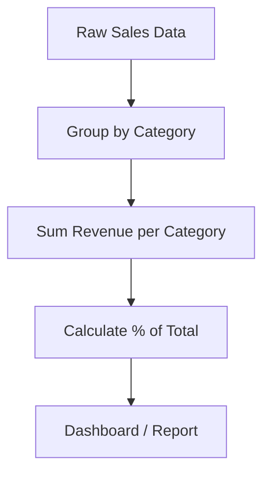

**Remember:** {{One key takeaway for junior analysts}}

---

### Pattern 2: {{Another basic analysis pattern}}

**Intent:** {{What it solves}}

```sql
-- Second pattern example
```

**Diagram:**

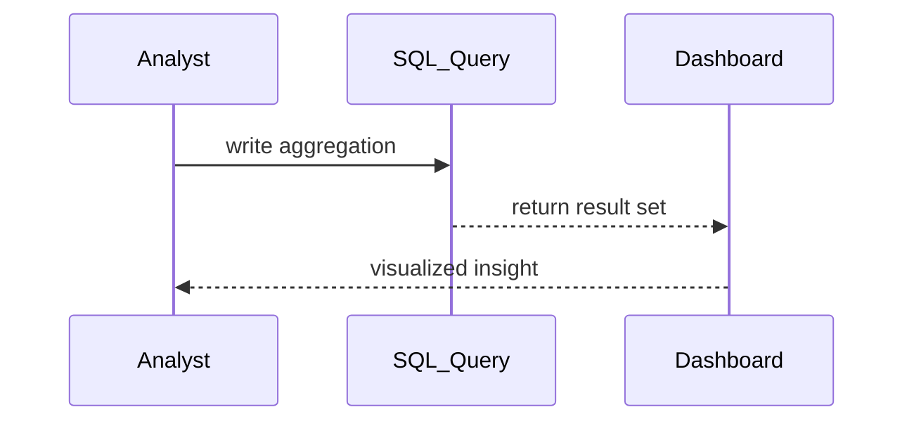

> Include 2 patterns at this level. Keep diagrams simple — flowcharts and sequence diagrams only.

---

## Clean Code

Basic clean code principles when writing SQL and Python for {{TOPIC_NAME}}:

### Naming Conventions

| Bad ❌ | Good ✅ | Why |
|--------|---------|-----|
| `SELECT a, b, c FROM t` | `SELECT user_id, revenue, order_date FROM orders` | Self-documenting column names |
| `WHERE dt > '2024'` | `WHERE order_date >= '2024-01-01'` | Explicit, unambiguous filter |
| `SUM(x)` | `SUM(revenue) AS total_revenue` | Always alias aggregations |

### Function Design

❌ Anti-pattern:
```sql
-- Bad — one monster query doing everything
SELECT a, b, c, d, e, f,
    SUM(CASE WHEN ...) / COUNT(CASE WHEN ...) ...  -- 50 lines, unreadable
FROM huge_table
JOIN another_table ON ...
JOIN yet_another ON ...
WHERE complex_condition
```

✅ Better:
```sql
-- Good — use CTEs to break into readable steps
WITH base_data AS (
    SELECT user_id, revenue, order_date
    FROM orders
    WHERE order_date >= '2024-01-01'
),
monthly_summary AS (
    SELECT DATE_TRUNC('month', order_date) AS month,
           SUM(revenue) AS revenue
    FROM base_data
    GROUP BY 1
)
SELECT * FROM monthly_summary;
```

**Rule:** If a query is too long to understand at a glance — break it into CTEs.

---

## Product Use / Feature

How this topic is used in real-world products and tools:

### 1. {{Product/Tool Name — e.g., Tableau, Power BI, Looker}}

- **How it uses {{TOPIC_NAME}}:** Brief description
- **Why it matters:** Practical impact

### 2. {{Product/Tool Name}}

- **How it uses {{TOPIC_NAME}}:** Brief description
- **Why it matters:** Practical impact

> 3-5 real products/tools. Show how the topic is applied in industry.

---

## Error Handling

### Error 1: {{Common SQL error}}

```sql
-- Code that produces this error
SELECT customer_id, SUM(revenue)
FROM orders
-- Missing GROUP BY!
```

**Why it happens:** Simple explanation.
**How to fix:**

```sql
-- Corrected query
SELECT customer_id, SUM(revenue) AS total_revenue
FROM orders
GROUP BY customer_id;
```

### Error 2: {{Another common error}}

...

> 2-4 common errors. Show the error, explain why, and provide the fix.

---

## Security Considerations

### 1. {{Security concern — e.g., SQL Injection}}

```sql
-- ❌ Insecure — user input directly in query string
query = f"SELECT * FROM users WHERE name = '{user_input}'"

-- ✅ Secure — parameterized query
query = "SELECT * FROM users WHERE name = %s"
cursor.execute(query, (user_input,))
```

**Risk:** SQL injection, data exposure.
**Mitigation:** Always use parameterized queries; never concatenate user input into SQL.

> 2-4 security considerations. Focus on: SQL injection, row-level security, PII exposure.

---

## Performance Tips

### Tip 1: {{Performance optimization — e.g., filter early}}

```sql
-- ❌ Slow — filter after join
SELECT *
FROM orders o
JOIN customers c ON o.customer_id = c.id
WHERE c.country = 'US';

-- ✅ Faster — filter before join using subquery or CTE
WITH us_customers AS (
    SELECT id FROM customers WHERE country = 'US'
)
SELECT * FROM orders o
JOIN us_customers c ON o.customer_id = c.id;
```

**Why it's faster:** Reduces rows before the expensive join operation.

> 2-4 tips. Keep explanations simple.

---

## Metrics & Analytics

Key metrics to track when using {{TOPIC_NAME}}:

### What to Measure

| Metric | Why it matters | Tool |
|--------|---------------|------|
| **Query execution time** | User experience for dashboards | Query profiler, Snowflake Query History |
| **Dashboard load time** | End-user wait time | Tableau performance recorder |
| **Data freshness** | How stale is the data shown | Pipeline monitoring, dbt |

### Basic Instrumentation

```sql
-- Snowflake: check query execution time
SELECT query_text, total_elapsed_time / 1000 AS seconds
FROM snowflake.account_usage.query_history
WHERE start_time > DATEADD('hour', -1, CURRENT_TIMESTAMP())
ORDER BY total_elapsed_time DESC
LIMIT 10;
```

> **What to expose:** query time, row count, data freshness timestamp.

---

## Best Practices

- **Do this:** Explanation
- **Do this:** Explanation
- **Do this:** Explanation

> 3-5 best practices. Keep them actionable and specific to juniors.

---

## Edge Cases & Pitfalls

### Pitfall 1: NULL handling in aggregations

```sql
-- NULL values are silently ignored by SUM, COUNT, AVG
SELECT AVG(revenue) FROM orders;
-- If 10% of rows have NULL revenue, AVG ignores them — misleading result!
```

**What happens:** NULLs are excluded from aggregations without warning.
**How to fix:**
```sql
SELECT AVG(COALESCE(revenue, 0)) AS avg_revenue FROM orders;
```

### Pitfall 2: {{Another common pitfall}}

...

---

## Common Mistakes

### Mistake 1: COUNT(*) vs COUNT(column)

```sql
-- ❌ Wrong — counts all rows including NULLs
SELECT COUNT(*) FROM orders;

-- ✅ Correct — counts only non-NULL values in that column
SELECT COUNT(customer_id) FROM orders;
```

> 3-5 mistakes that junior analysts commonly make.

---

## Common Misconceptions

### Misconception 1: "GROUP BY orders the result"

**Reality:** GROUP BY does not guarantee order. Always use ORDER BY if you need sorted results.

---

## Tricky Points

### Tricky Point 1: {{name}}

```sql
-- Query that might surprise a junior analyst
```

**Why it's tricky:** Explanation.
**Key takeaway:** One-line lesson.

---

## Test

### Multiple Choice

**1. {{Question}}?**

- A) Option A
- B) Option B
- C) Option C
- D) Option D

<details>
<summary>Answer</summary>
**C)** — Explanation why C is correct and why others are wrong.
</details>

### True or False

**2. {{Statement}}**

<details>
<summary>Answer</summary>
**False** — Explanation.
</details>

### What's the Output?

**3. What does this query return?**

```sql
SELECT COUNT(*) FROM (SELECT 1 UNION ALL SELECT NULL) t;
```

<details>
<summary>Answer</summary>
Output: `2`
Explanation: COUNT(*) counts rows, not values. NULL is still a row.
</details>

> 5-8 test questions total.

---

## "What If?" Scenarios

**What if a JOIN produces more rows than the original table?**
- **You might think:** A JOIN can only reduce rows
- **But actually:** A many-to-many join duplicates rows — always check row counts after joins

---

## Tricky Questions

**1. {{Confusing question}}?**

- A) {{Looks correct but wrong}}
- B) {{Correct answer}}
- C) {{Common misconception}}
- D) {{Partially correct}}

<details>
<summary>Answer</summary>
**B)** — Explanation.
</details>

---

## Cheat Sheet

| What | Syntax | Example |
|------|--------|---------|
| Group and aggregate | `GROUP BY col` | `GROUP BY month` |
| Filter aggregation | `HAVING condition` | `HAVING SUM(rev) > 1000` |
| Remove duplicates | `SELECT DISTINCT` | `SELECT DISTINCT user_id` |
| NULL safe compare | `IS NULL` / `IS NOT NULL` | `WHERE col IS NOT NULL` |
| Replace NULL | `COALESCE(col, default)` | `COALESCE(revenue, 0)` |

---

## Self-Assessment Checklist

### I can explain:
- [ ] What {{TOPIC_NAME}} is and why it exists
- [ ] When to use GROUP BY vs window functions
- [ ] How JOINs work and what can go wrong

### I can do:
- [ ] Write a basic aggregation query from scratch
- [ ] Identify and fix NULL handling issues
- [ ] Build a simple dashboard in Tableau / Power BI

---

## Summary

- Key point 1
- Key point 2
- Key point 3

**Next step:** What to learn after this topic.

---

## What You Can Build

### Projects you can create:
- **{{Project 1}}:** Monthly sales report dashboard
- **{{Project 2}}:** Customer cohort analysis
- **{{Project 3}}:** KPI monitoring dashboard

### Learning path:


---

## Further Reading

- **Official docs:** [{{link title}}]({{url}})
- **Blog post:** [{{link title}}]({{url}}) — brief description

---

## Related Topics

- **[{{Related Topic 1}}](../XX-related-topic/)** — how it connects
- **[{{Related Topic 2}}](../XX-related-topic/)** — how it connects

---

## Diagrams & Visual Aids

### Mind Map

```mermaid
mindmap
  root(({{TOPIC_NAME}}))
    Core Concept 1
      Sub-concept A
      Sub-concept B
    Core Concept 2
      Sub-concept C
    Related Topics
      {{Related 1}}
      {{Related 2}}
```

</details>

---
---

# TEMPLATE 2 — `middle.md`

<details open>
<summary><strong>Template Content</strong></summary>

# {{TOPIC_NAME}} — Middle Level

## Table of Contents

1. [Introduction](#introduction)
2. [Core Concepts](#core-concepts)
3. [Pros & Cons](#pros--cons)
4. [Use Cases](#use-cases)
5. [Query & Dashboard Examples](#query--dashboard-examples)
6. [Analysis Patterns](#analysis-patterns)
7. [Clean Code](#clean-code)
8. [Product Use / Feature](#product-use--feature)
9. [Error Handling](#error-handling)
10. [Security Considerations](#security-considerations)
11. [Performance Optimization](#performance-optimization)
12. [Metrics & Analytics](#metrics--analytics)
13. [Debugging Guide](#debugging-guide)
14. [Best Practices](#best-practices)
15. [Edge Cases & Pitfalls](#edge-cases--pitfalls)
16. [Common Mistakes](#common-mistakes)
17. [Tricky Points](#tricky-points)
18. [Test](#test)
19. [Tricky Questions](#tricky-questions)
20. [Cheat Sheet](#cheat-sheet)
21. [Summary](#summary)
22. [What You Can Build](#what-you-can-build)
23. [Further Reading](#further-reading)
24. [Related Topics](#related-topics)
25. [Diagrams & Visual Aids](#diagrams--visual-aids)

---

## Introduction

> Focus: "Why?" and "When to use?"

Assumes the reader already knows basic SQL. This level covers:
- Deeper understanding of how {{TOPIC_NAME}} works
- Window functions, complex CTEs, and data modeling
- Production considerations: query performance, data quality, KPI design

---

## Core Concepts

### Concept 1: {{Advanced concept — e.g., window functions}}

Detailed explanation with diagrams (mermaid) where helpful.

```sql
-- Window function example
SELECT
    user_id,
    revenue,
    SUM(revenue) OVER (PARTITION BY segment ORDER BY order_date) AS running_total,
    ROW_NUMBER() OVER (PARTITION BY user_id ORDER BY order_date DESC) AS recency_rank
FROM orders;
```

### Concept 2: {{Another concept}}

- How it relates to other BI concepts
- Performance implications
- When to use vs alternatives

---

## Evolution & Historical Context

Why does {{TOPIC_NAME}} exist? What problem does it solve?

**Before {{TOPIC_NAME}}:**
- How analysts solved this problem previously

**How {{TOPIC_NAME}} changed things:**
- The analytical shift it introduced

---

## Pros & Cons

| Pros | Cons |
|------|------|
| {{Advantage 1 with production context}} | {{Disadvantage 1 with impact analysis}} |
| {{Advantage 2}} | {{Disadvantage 2}} |

### Comparison with alternatives:

| Approach | Pros | Cons | Best for |
|----------|------|------|----------|
| {{Approach A}} | {{pros}} | {{cons}} | {{scenario}} |
| {{Approach B}} | {{pros}} | {{cons}} | {{scenario}} |

---

## Query & Dashboard Examples

### Example 1: {{Production-ready analysis pattern}}

```sql
-- Production-quality: cohort retention analysis
WITH cohorts AS (
    SELECT
        user_id,
        DATE_TRUNC('month', MIN(order_date)) AS cohort_month
    FROM orders
    GROUP BY user_id
),
activity AS (
    SELECT
        o.user_id,
        c.cohort_month,
        DATE_TRUNC('month', o.order_date) AS activity_month,
        DATEDIFF('month', c.cohort_month, DATE_TRUNC('month', o.order_date)) AS months_since_cohort
    FROM orders o
    JOIN cohorts c ON o.user_id = c.user_id
)
SELECT
    cohort_month,
    months_since_cohort,
    COUNT(DISTINCT user_id) AS active_users
FROM activity
GROUP BY 1, 2
ORDER BY 1, 2;
```

**Why this pattern:** Cohort analysis reveals true retention vs. mix-shift effects.
**Trade-offs:** Computationally heavy on large datasets — use materialized views.

### Example 2: KPI dashboard query

```sql
-- Key business metrics with period-over-period comparison
WITH current_period AS (
    SELECT
        SUM(revenue)                       AS revenue,
        COUNT(DISTINCT customer_id)        AS customers,
        SUM(revenue) / COUNT(DISTINCT customer_id) AS arpu
    FROM orders
    WHERE order_date BETWEEN '2024-01-01' AND '2024-01-31'
),
prior_period AS (
    SELECT
        SUM(revenue)                       AS revenue,
        COUNT(DISTINCT customer_id)        AS customers,
        SUM(revenue) / COUNT(DISTINCT customer_id) AS arpu
    FROM orders
    WHERE order_date BETWEEN '2023-12-01' AND '2023-12-31'
)
SELECT
    c.revenue,
    (c.revenue - p.revenue) / p.revenue * 100 AS revenue_growth_pct,
    c.customers,
    c.arpu
FROM current_period c
CROSS JOIN prior_period p;
```

---

## Analysis Patterns

### Pattern 1: {{Analytical design pattern}}

**Category:** Reporting / Cohort / Funnel / Attribution
**Intent:** {{What analytical problem this pattern solves}}
**When to use:** {{Specific scenario}}
**When NOT to use:** {{Counter-indication}}

**Structure diagram:**

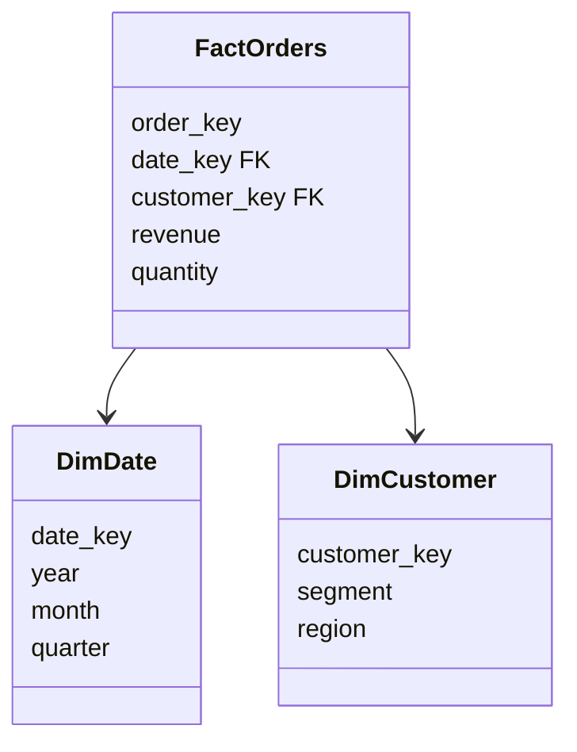

**Implementation:**

```sql
-- Pattern implementation
```

**Trade-offs:**

| ✅ Pros | ❌ Cons |
|---------|---------|
| {{benefit 1}} | {{drawback 1}} |
| {{benefit 2}} | {{drawback 2}} |

---

### Pattern 2: {{Funnel / Conversion pattern}}

**Category:** Funnel Analysis
**Intent:** Measure drop-off at each step of a user journey

**Flow diagram:**

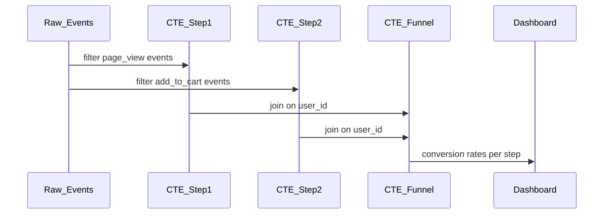

```sql
-- Funnel analysis pattern
WITH step1 AS (SELECT DISTINCT user_id FROM events WHERE event = 'page_view'),
     step2 AS (SELECT DISTINCT user_id FROM events WHERE event = 'add_to_cart'),
     step3 AS (SELECT DISTINCT user_id FROM events WHERE event = 'purchase')
SELECT
    COUNT(DISTINCT s1.user_id)                       AS step1_users,
    COUNT(DISTINCT s2.user_id)                       AS step2_users,
    COUNT(DISTINCT s3.user_id)                       AS step3_users,
    COUNT(DISTINCT s2.user_id) * 100.0 / COUNT(DISTINCT s1.user_id) AS s1_to_s2_pct,
    COUNT(DISTINCT s3.user_id) * 100.0 / COUNT(DISTINCT s2.user_id) AS s2_to_s3_pct
FROM step1 s1
LEFT JOIN step2 s2 ON s1.user_id = s2.user_id
LEFT JOIN step3 s3 ON s2.user_id = s3.user_id;
```

---

### Pattern 3: {{Time-series / trend pattern}}

**Intent:** Identify trends and seasonality in business metrics

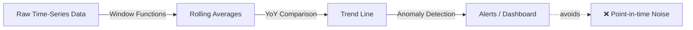

```sql
-- ❌ Non-idiomatic — raw daily data is noisy
SELECT order_date, SUM(revenue) FROM orders GROUP BY 1;

-- ✅ Idiomatic — 7-day rolling average smooths noise
SELECT
    order_date,
    SUM(revenue) AS daily_revenue,
    AVG(SUM(revenue)) OVER (ORDER BY order_date ROWS BETWEEN 6 PRECEDING AND CURRENT ROW) AS rolling_7d_avg
FROM orders
GROUP BY order_date
ORDER BY order_date;
```

---

## Clean Code

### Naming & Readability

```sql
-- ❌ Cryptic
SELECT a, b, c, SUM(d) AS e FROM t1 JOIN t2 ON t1.x = t2.y GROUP BY a, b, c;

-- ✅ Self-documenting
SELECT
    o.customer_id,
    c.segment,
    DATE_TRUNC('month', o.order_date) AS order_month,
    SUM(o.revenue)                    AS total_revenue
FROM orders o
JOIN customers c ON o.customer_id = c.id
GROUP BY 1, 2, 3;
```

| Element | Rule | Example |
|---------|------|---------|
| Aliases | Descriptive, not single letter | `orders o`, not `t1` |
| CTEs | Named by what they produce | `cohort_users`, `monthly_revenue` |
| Metrics | Include unit in name | `revenue_usd`, `duration_seconds` |

---

### SOLID in Practice (Data Modeling)

**Single Responsibility:**
```sql
-- ❌ One query doing too many things — hard to test and maintain
...

-- ✅ Separate CTEs, each with one clear purpose
WITH raw_orders   AS (SELECT ... FROM orders WHERE ...),
     clean_orders AS (SELECT ... FROM raw_orders WHERE revenue > 0),
     agg_orders   AS (SELECT ... FROM clean_orders GROUP BY ...)
SELECT * FROM agg_orders;
```

---

## Product Use / Feature

### 1. {{Product/Tool Name}}

- **How it uses {{TOPIC_NAME}}:** Description with architectural context
- **Scale:** Numbers, data volume

> 3-5 real products.

---

## Error Handling

### Pattern 1: Data quality checks before reporting

```sql
-- Always validate before publishing metrics
WITH data_quality_check AS (
    SELECT
        COUNT(*) AS total_rows,
        COUNT(revenue) AS non_null_revenue,
        COUNT(CASE WHEN revenue < 0 THEN 1 END) AS negative_revenue,
        MIN(order_date) AS earliest_date,
        MAX(order_date) AS latest_date
    FROM orders
    WHERE order_date BETWEEN :start_date AND :end_date
)
SELECT
    *,
    CASE
        WHEN non_null_revenue < total_rows * 0.99 THEN 'WARNING: >1% NULL revenue'
        WHEN negative_revenue > 0 THEN 'WARNING: Negative revenue exists'
        ELSE 'OK'
    END AS data_quality_status
FROM data_quality_check;
```

### Common Error Patterns

| Situation | Pattern | Example |
|-----------|---------|---------|
| NULL in aggregation | `COALESCE(col, 0)` | `COALESCE(revenue, 0)` |
| Division by zero | `NULLIF(denominator, 0)` | `numerator / NULLIF(count, 0)` |
| Wrong join type | Verify row counts after join | `SELECT COUNT(*) before vs after` |
| Duplicate rows | `COUNT(DISTINCT id)` | Deduplicate with `ROW_NUMBER()` |

---

## Security Considerations

### 1. Row-Level Security

**Risk level:** High

```sql
-- ❌ Everyone can see all regions
SELECT * FROM revenue_by_region;

-- ✅ Apply row-level security policy
-- In Snowflake:
CREATE ROW ACCESS POLICY region_policy AS (region_col VARCHAR)
RETURNS BOOLEAN ->
  current_role() = 'ADMIN' OR region_col = current_user_region();
```

### Security Checklist

- [ ] PII columns masked for non-privileged roles
- [ ] Row-level security policies applied where needed
- [ ] Audit logs enabled for sensitive data access
- [ ] Dashboard filters prevent full-table scans

---

## Performance Optimization

### Optimization 1: Use clustering keys for large tables

```sql
-- ❌ Slow — full table scan on 1B row table
SELECT * FROM orders WHERE order_date = '2024-01-15';

-- ✅ Fast — clustered/partitioned table
-- Snowflake: add cluster key
ALTER TABLE orders CLUSTER BY (DATE_TRUNC('month', order_date));
-- BigQuery: partition by date
-- CREATE TABLE orders PARTITION BY DATE(order_date)
```

**Benchmark results:**
```
Without clustering:  45s, scans 1B rows
With clustering:     0.8s, scans ~3M rows (one day's partition)
```

### Performance Decision Matrix

| Scenario | Approach | Why |
|----------|----------|-----|
| Small table (< 1M rows) | No optimization needed | Readability > performance |
| Large table, date filter | Partition / cluster by date | Eliminate full scans |
| Repeated complex query | Materialized view | Pre-compute expensive aggregations |
| Dashboard refresh | Incremental refresh | Only process new data |

---

## Metrics & Analytics

### Key Metrics

| Metric | Type | Description | Alert threshold |
|--------|------|-------------|-----------------|
| **query_execution_time_ms** | Histogram | Query duration | p99 > 30s |
| **dashboard_load_time_ms** | Histogram | End-user wait | > 10s |
| **data_freshness_minutes** | Gauge | How stale is data | > 60 min |
| **rows_scanned** | Counter | Table scan volume | > 10B rows/day |

---

## Debugging Guide

### Problem 1: Query runs for 10+ minutes

**Symptoms:** Dashboard times out, query profiler shows full table scans.

**Diagnostic steps:**
```sql
-- Snowflake: check query plan
EXPLAIN SELECT ...;

-- BigQuery: check execution plan
-- Use Query Execution Details in Console
```

**Root cause:** Missing partition filter / clustering key.
**Fix:** Add `WHERE date_col BETWEEN :start AND :end` to leverage partitioning.

---

## Best Practices

- **Practice 1:** Always add a date filter to queries on large tables
- **Practice 2:** Use CTEs instead of nested subqueries for readability

---

## Edge Cases & Pitfalls

### Pitfall 1: Fan-out in multi-grain joins

```sql
-- Joining daily orders to monthly targets creates duplicates
SELECT o.*, t.monthly_target
FROM daily_orders o
JOIN monthly_targets t ON o.month = t.month;
-- Each daily order now has monthly_target duplicated 30x → SUM is wrong!
```

**Impact:** Revenue and target metrics are inflated by 30x.
**Fix:** Aggregate before joining, or use window functions.

---

## Common Mistakes

### Mistake 1: Using HAVING without GROUP BY

```sql
-- ❌ Looks correct but wrong — HAVING on ungrouped data
SELECT customer_id, revenue FROM orders
HAVING revenue > 1000;

-- ✅ Correct — filter row-level with WHERE, aggregate with HAVING
SELECT customer_id, SUM(revenue) AS total
FROM orders
GROUP BY customer_id
HAVING SUM(revenue) > 1000;
```

---

## Tricky Points

### Tricky Point 1: Window function vs GROUP BY ordering

```sql
-- Window functions compute over the ordered partition, not the query output order
SELECT
    user_id,
    ROW_NUMBER() OVER (ORDER BY revenue DESC) AS rank
FROM orders
ORDER BY user_id;  -- output is ordered by user_id, but rank was assigned by revenue
```

---

## Test

### Multiple Choice (harder)

**1. {{Question involving window functions or CTEs}}?**

- A) ...
- B) ...
- C) ...
- D) ...

<details>
<summary>Answer</summary>
**B)** — Detailed explanation.
</details>

---

## Tricky Questions

**1. What is the difference between WHERE and HAVING?**

- A) They are interchangeable
- B) WHERE filters rows, HAVING filters groups after aggregation
- C) HAVING is always faster
- D) WHERE works with aggregates, HAVING does not

<details>
<summary>Answer</summary>
**B)** — WHERE filters individual rows before grouping. HAVING filters aggregated groups. You cannot use aggregate functions in WHERE.
</details>

---

## Cheat Sheet

| Scenario | Pattern | Key consideration |
|----------|---------|-------------------|
| Running total | `SUM() OVER (ORDER BY date)` | Partition correctly |
| Rank within group | `ROW_NUMBER() OVER (PARTITION BY group ORDER BY metric)` | Ties handled differently by RANK() |
| Period comparison | `LAG(metric, 1) OVER (ORDER BY date)` | Handle first row (NULL) |

---

## Summary

- Key insight 1: Window functions replace self-joins for running calculations
- Key insight 2: CTEs improve readability and maintainability

**Next step:** Senior level — data modeling, performance architecture.

---

## What You Can Build

### Production systems:
- **Executive KPI Dashboard:** Real-time business metrics with period comparison
- **Cohort Retention Analysis:** Customer lifecycle tracking

---

## Further Reading

- **Official docs:** [{{link title}}]({{url}})
- **Blog post:** [{{link title}}]({{url}})

---

## Diagrams & Visual Aids

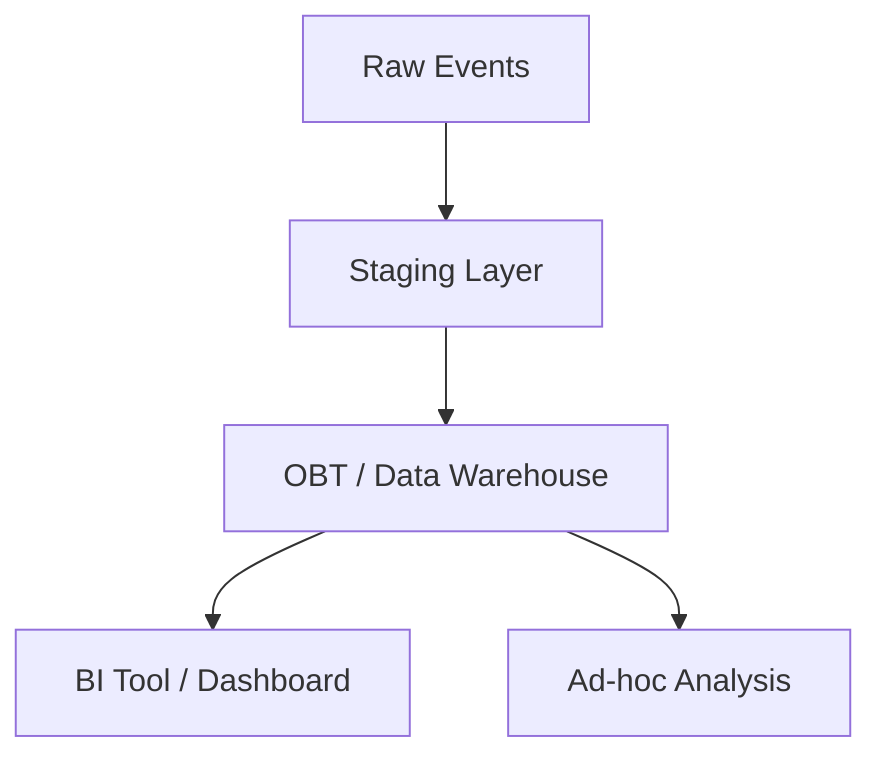

</details>

---
---

# TEMPLATE 3 — `senior.md`

<details open>
<summary><strong>Template Content</strong></summary>

# {{TOPIC_NAME}} — Senior Level

## Table of Contents

1. [Introduction](#introduction)
2. [Core Concepts](#core-concepts)
3. [Pros & Cons](#pros--cons)
4. [Use Cases](#use-cases)
5. [Query & Dashboard Examples](#query--dashboard-examples)
6. [Analysis Patterns](#analysis-patterns)
7. [Clean Code](#clean-code)
8. [Best Practices](#best-practices)
9. [Product Use / Feature](#product-use--feature)
10. [Error Handling](#error-handling)
11. [Security Considerations](#security-considerations)
12. [Performance Optimization](#performance-optimization)
13. [Metrics & Analytics](#metrics--analytics)
14. [Debugging Guide](#debugging-guide)
15. [Edge Cases & Pitfalls](#edge-cases--pitfalls)
16. [Postmortems & System Failures](#postmortems--system-failures)
17. [Common Mistakes](#common-mistakes)
18. [Tricky Points](#tricky-points)
19. [Test](#test)
20. [Tricky Questions](#tricky-questions)
21. [Cheat Sheet](#cheat-sheet)
22. [Summary](#summary)
23. [What You Can Build](#what-you-can-build)
24. [Further Reading](#further-reading)
25. [Related Topics](#related-topics)
26. [Diagrams & Visual Aids](#diagrams--visual-aids)

---

## Introduction

> Focus: "How to optimize?" and "How to architect?"

For BI analysts / data engineers who:
- Design data warehouses and data models
- Optimize query performance at scale
- Define KPI frameworks and metric governance
- Mentor junior/middle analysts

---

## Core Concepts

### Concept 1: {{Architecture-level concept — data modeling}}

Deep dive with:
- Star schema vs snowflake schema vs OBT trade-offs
- Performance characteristics (scan volume, join cost)
- Comparison with alternative approaches

```sql
-- Advanced star schema design
-- Fact table: one row per event
-- Dimension tables: descriptive attributes
CREATE TABLE fact_orders (
    order_sk      BIGINT PRIMARY KEY,  -- surrogate key
    date_key      INT    REFERENCES dim_date(date_key),
    customer_key  INT    REFERENCES dim_customer(customer_key),
    product_key   INT    REFERENCES dim_product(product_key),
    -- measures
    revenue_usd   NUMERIC(12,2),
    quantity      INT,
    cost_usd      NUMERIC(12,2)
) CLUSTER BY (date_key);
```

---

## Pros & Cons

| Pros | Cons | Impact |
|------|------|--------|
| {{Advantage 1}} | {{Disadvantage 1}} | {{Impact on architecture}} |
| {{Advantage 2}} | {{Disadvantage 2}} | {{Impact on maintenance}} |

---

## Query & Dashboard Examples

### Example 1: Advanced data modeling pattern

```sql
-- Slowly Changing Dimension Type 2 (SCD2)
-- Preserves history when customer attributes change
CREATE TABLE dim_customer_scd2 (
    customer_sk       BIGINT GENERATED ALWAYS AS IDENTITY PRIMARY KEY,
    customer_id       INT     NOT NULL,  -- natural key
    email             VARCHAR(255),
    segment           VARCHAR(50),
    region            VARCHAR(50),
    -- SCD2 metadata
    effective_from    DATE    NOT NULL,
    effective_to      DATE,              -- NULL = current record
    is_current        BOOLEAN NOT NULL DEFAULT TRUE
);

-- Query current state
SELECT * FROM dim_customer_scd2 WHERE is_current = TRUE;

-- Query historical state as of a date
SELECT * FROM dim_customer_scd2
WHERE effective_from <= '2023-06-01'
  AND (effective_to > '2023-06-01' OR effective_to IS NULL);
```

---

## Analysis Patterns

### Pattern 1: {{Architectural pattern — e.g., Medallion Architecture}}

**Category:** Data Architecture
**Intent:** Organize data into progressive quality layers
**Problem it solves:** Raw data is unreliable; reporting needs validated, clean data

**Architecture diagram:**

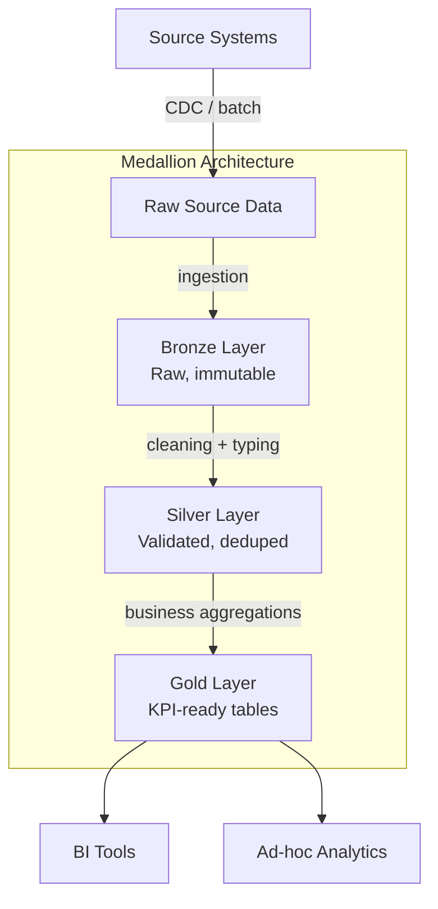

**Implementation:**

```sql
-- Silver layer: clean and validate
CREATE OR REPLACE TABLE silver.orders AS
SELECT
    order_id,
    CAST(order_date AS DATE)       AS order_date,
    customer_id,
    COALESCE(revenue, 0)           AS revenue_usd,
    CASE WHEN status IN ('completed','shipped') THEN status
         ELSE 'other' END          AS order_status
FROM bronze.raw_orders
WHERE order_id IS NOT NULL
  AND order_date IS NOT NULL
  AND order_date >= '2020-01-01'  -- data quality floor
QUALIFY ROW_NUMBER() OVER (PARTITION BY order_id ORDER BY _loaded_at DESC) = 1;
```

---

### Pattern 2: {{Incremental processing pattern}}

**Category:** Performance / Cost
**Intent:** Process only new/changed data instead of full refresh

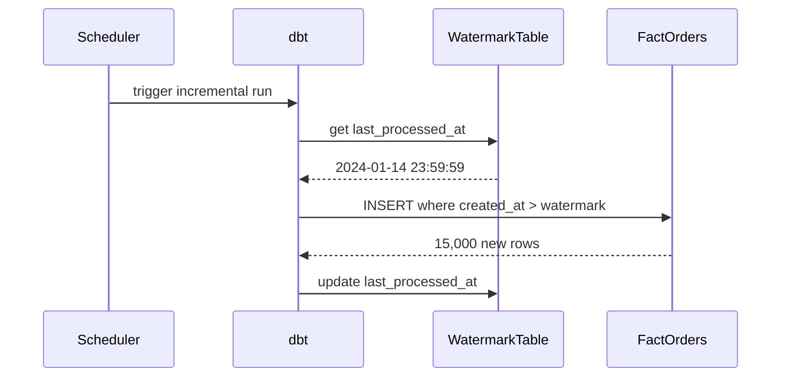

```sql
-- dbt incremental model pattern
{{ config(materialized='incremental', unique_key='order_id') }}

SELECT order_id, order_date, revenue_usd
FROM {{ source('raw', 'orders') }}


WHERE created_at > (SELECT MAX(created_at) FROM {{ this }})

```

---

### Pattern 3: {{Semantic layer / metrics layer pattern}}

**Category:** Metric Governance
**Intent:** Define metrics once, use everywhere — prevents metric inconsistency

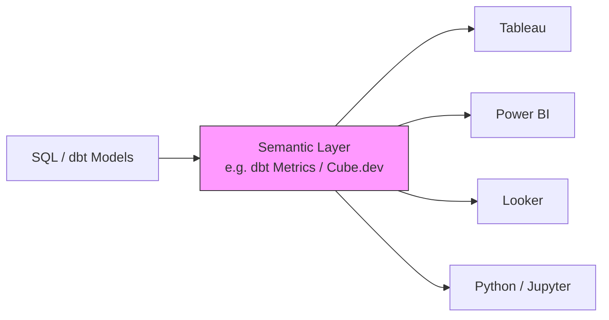

---

### Pattern 4: {{Attribution modeling pattern}}

**Category:** Marketing Analytics
**Intent:** Credit revenue to the right marketing touchpoints

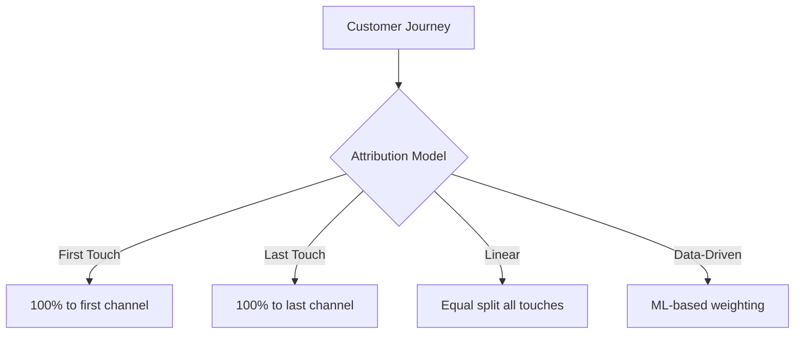

### Pattern Comparison Matrix

| Pattern | Use When | Avoid When | Complexity |
|---------|----------|------------|------------|
| Medallion Architecture | Need data quality tiers | Small, single-source data | Medium |
| Incremental Processing | Large tables, frequent refresh | Small tables | Medium |
| Semantic Layer | Multiple BI tools, metric consistency | Single tool, small team | High |
| SCD2 | History matters | Current state only | Medium |

---

## Clean Code

### Clean Architecture Boundaries

```sql
-- ❌ Gold layer query with raw data logic
SELECT
    REGEXP_REPLACE(email, '[^a-zA-Z0-9@.]', '') AS clean_email  -- should be in Silver
    ...
FROM gold.fact_orders;

-- ✅ Each layer has clear responsibility
-- Silver: clean data
-- Gold: aggregate cleaned data
```

### Code Smells at Senior Level

| Smell | Symptom | Refactoring |
|-------|---------|-------------|
| **God Query** | 200-line SQL doing everything | Split into dbt models / CTEs |
| **Magic Numbers** | `WHERE status = 3` | Use meaningful constants / lookup tables |
| **Undocumented Metrics** | `revenue` — gross or net? including tax? | Add metric definitions to docs |
| **Copy-Paste KPIs** | Same metric defined 5 different ways | Centralize in semantic layer |

### Code Review Checklist (Senior)

- [ ] All metrics have documented definitions (grain, inclusions, exclusions)
- [ ] No business logic in raw/bronze layer
- [ ] Incremental models handle late-arriving data
- [ ] Partition/cluster keys align with common filter patterns
- [ ] NULL handling is explicit, not accidental

---

## Best Practices

### Must Do ✅

1. **Document every metric** — include definition, grain, and edge case handling
   ```sql
   -- revenue_usd: gross revenue before refunds, excluding tax
   -- grain: one row per completed order
   -- excludes: cancelled, draft, test orders
   ```

2. **Test your data models** with dbt tests or custom checks
   ```yaml
   # dbt schema.yml
   models:
     - name: fact_orders
       columns:
         - name: order_id
           tests: [unique, not_null]
         - name: revenue_usd
           tests:
             - not_null
             - dbt_utils.accepted_range:
                 min_value: 0
                 max_value: 1000000
   ```

3. **Separate business logic from infrastructure** — keep transformation in the BI layer, not the source system

### Never Do ❌

1. **Never define the same metric differently** in two places — it will cause trust issues with stakeholders
2. **Never skip a partition filter** on large production tables — it will cause cost explosions
3. **Never publish a dashboard without data freshness indicators**

### Production Checklist

- [ ] Metric definitions documented and reviewed by business stakeholders
- [ ] Data quality tests pass in CI before deployment
- [ ] Dashboard has "last updated" timestamp visible
- [ ] Query execution time < 30s for interactive dashboards
- [ ] PII columns masked / excluded from dashboards accessible to non-privileged users
- [ ] Incremental refresh tested with late-arriving data scenarios

---

## Product Use / Feature

### 1. {{Company/Product Name}}

- **Architecture:** How they implement {{TOPIC_NAME}} at scale
- **Scale:** Specific numbers (query volume, data volume)
- **Lessons learned:** What they changed and why

---

## Error Handling

### Enterprise-grade data quality

```python
# dbt test + alerting
from dbt.tests import assert_column_not_null, assert_unique

def post_model_hook(model_name: str, results: dict) -> None:
    if results.get("status") == "error":
        pagerduty.trigger_alert(
            title=f"dbt model {model_name} failed",
            severity="critical",
        )

    if results.get("tests_failed") > 0:
        slack.send_message(
            channel="#data-quality",
            text=f":warning: {results['tests_failed']} data quality tests failed for {model_name}",
        )
```

---

## Security Considerations

### Threat Model

| Threat | Likelihood | Impact | Mitigation |
|--------|:---------:|:------:|------------|
| Unauthorized PII access | High | Critical | Column-level masking, role separation |
| SQL injection via BI tool | Medium | High | Parameterized queries only |
| Data exfiltration via export | Medium | High | Row-level security, export audit |

---

## Performance Optimization

### Optimization 1: Partition pruning

```sql
-- Before — full table scan
SELECT SUM(revenue) FROM fact_orders WHERE YEAR(order_date) = 2024;

-- After — partition pruning
SELECT SUM(revenue) FROM fact_orders WHERE order_date BETWEEN '2024-01-01' AND '2024-12-31';
-- Use explicit date ranges, not date functions on the column (prevents pruning)
```

**Profiling evidence:**
```sql
EXPLAIN SELECT SUM(revenue) FROM fact_orders WHERE order_date BETWEEN '2024-01-01' AND '2024-12-31';
-- partitions scanned: 12 of 1460 (vs 1460 without partition)
```

---

## Metrics & Analytics

### SLO / SLA Definition

| SLI | SLO Target | Measurement window | Consequence if breached |
|-----|-----------|-------------------|------------------------|
| **query_execution_time p99** | < 30s | 1 hour rolling | Alert to BI team |
| **dashboard_load_time** | < 10s | 1 hour rolling | PagerDuty alert |
| **data_freshness** | < 1 hour | Continuous | Incident created |

---

## Postmortems & System Failures

### The Metric Definition Mismatch Incident

- **The goal:** Compare revenue from Salesforce vs data warehouse
- **The mistake:** Salesforce used "bookings" (signed deals), warehouse used "recognized revenue" — different definitions with the same column name `revenue`
- **The impact:** 6-hour executive meeting trying to reconcile a $2M discrepancy that didn't exist
- **The fix:** Created a company-wide metric glossary, enforced in the semantic layer

**Key takeaway:** Metric definitions are more important than the data itself. Build a semantic layer.

---

## Test

### Architecture Questions

**1. You need to support 50 analysts querying a 10TB orders table. Dashboard must load in < 5s. What do you do?**

- A) Give all analysts direct access to the raw table
- B) Pre-aggregate into summary tables, cache in BI tool, use clustered keys
- C) Increase warehouse size to 4XL
- D) Move everything to pandas

<details>
<summary>Answer</summary>
**B)** — Pre-aggregation reduces data scanned. Caching eliminates redundant queries. Clustering keys enable partition pruning. Warehouse size helps but is much more expensive than proper modeling.
</details>

---

## Tricky Questions

**1. Your "Monthly Active Users" metric shows different numbers in Tableau vs Looker. Both connect to the same Snowflake table. Why might this happen?**

<details>
<summary>Answer</summary>
Most likely causes: (1) Different date filters — one tool uses calendar month, the other uses rolling 30 days. (2) Different deduplication logic — one counts user_id, the other counts session_id. (3) Timezone handling difference. Solution: define MAU in a semantic layer that both tools share.
</details>

---

## Cheat Sheet

### Architecture Decision Matrix

| Scenario | Recommended | Avoid | Why |
|----------|-------------|-------|-----|
| Real-time KPI dashboard | Materialized view + refresh | Direct query on raw | Latency |
| Historical analysis | Star schema + clustering | Flat denormalized table | Query cost |
| Multi-tool metric sharing | Semantic layer (dbt Metrics) | Per-tool custom metrics | Inconsistency |
| Slowly changing attributes | SCD2 | Overwrite in place | History loss |

---

## Summary

- Senior BI = data modeling + metric governance + performance architecture
- Star schema + partitioning = fast dashboards at scale
- Semantic layer = single source of truth for metrics

---

## Further Reading

- **Blog post:** [The Analytics Engineering Guide](https://www.getdbt.com/analytics-engineering/)
- **Book:** "Data Warehouse Toolkit" — Kimball methodology

---

## Diagrams & Visual Aids

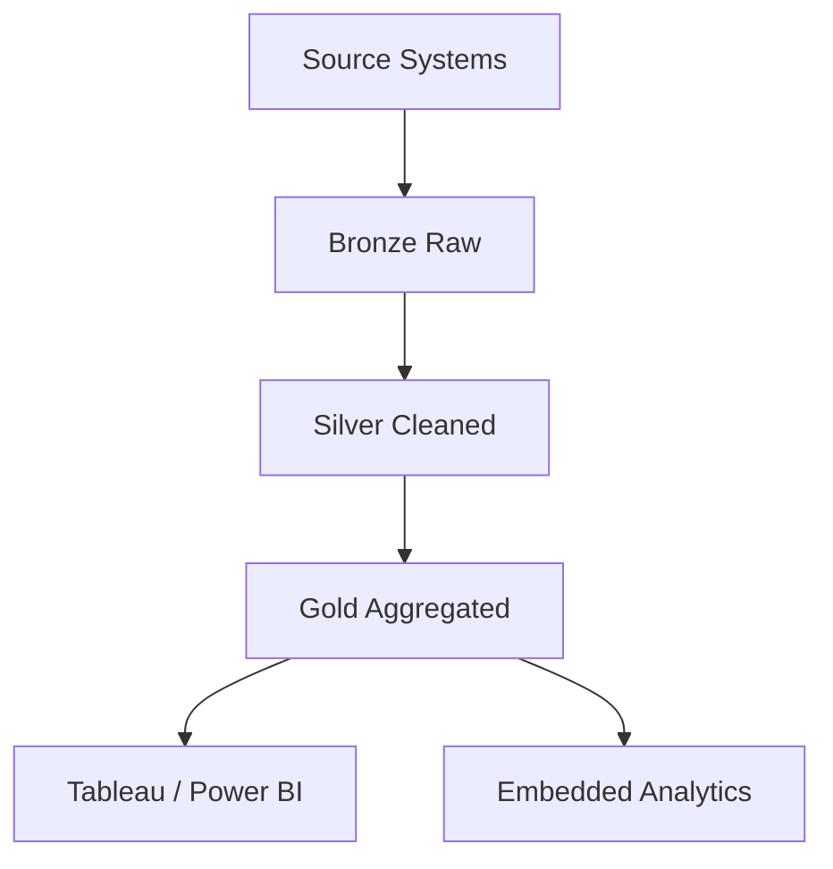

</details>

---
---

# TEMPLATE 4 — `professional.md`

<details open>
<summary><strong>Template Content</strong></summary>

# {{TOPIC_NAME}} — Data Warehouse and Query Engine Internals

## Table of Contents

1. [Introduction](#introduction)
2. [How It Works Internally](#how-it-works-internally)
3. [Columnar Storage Deep Dive](#columnar-storage-deep-dive)
4. [Query Execution Engines](#query-execution-engines)
5. [Snowflake Internals](#snowflake-internals)
6. [BigQuery Internals](#bigquery-internals)
7. [Query Optimization Internals](#query-optimization-internals)
8. [Memory Layout](#memory-layout)
9. [Performance Internals](#performance-internals)
10. [Edge Cases at the Lowest Level](#edge-cases-at-the-lowest-level)
11. [Test](#test)
12. [Tricky Questions](#tricky-questions)
13. [Summary](#summary)
14. [Further Reading](#further-reading)
15. [Diagrams & Visual Aids](#diagrams--visual-aids)

---

## Introduction

> Focus: "What happens under the hood?"

This document explores what happens internally when {{TOPIC_NAME}} executes in a modern cloud data warehouse:
- Columnar storage format and compression
- Query execution engine architecture
- Snowflake and BigQuery internal execution
- Query optimizer decisions

---

## How It Works Internally

Step-by-step breakdown of what happens when a SQL query executes:

1. **SQL text** → Parser → AST
2. **AST** → Logical plan
3. **Logical plan** → Query optimizer → Physical plan
4. **Physical plan** → Execution engine → Result

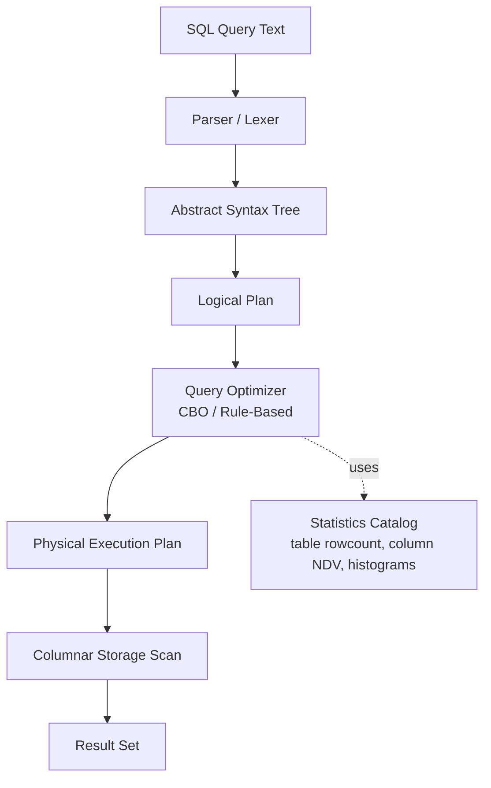

---

## Columnar Storage Deep Dive

### Row Store vs Columnar Store

```
Row Store (OLTP — PostgreSQL, MySQL):
┌──────────────────────────────────────┐
│ Row 1: [id=1][name="Alice"][rev=100] │
│ Row 2: [id=2][name="Bob"]  [rev=200] │
│ Row 3: [id=3][name="Carol"][rev=300] │
└──────────────────────────────────────┘
Read for SELECT SUM(rev): must read ALL columns

Columnar Store (OLAP — Snowflake, BigQuery, Parquet):
┌───────────────┐ ┌─────────────────────────┐ ┌────────────────┐
│ id column     │ │ name column             │ │ rev column     │
│ [1][2][3]...  │ │ ["Alice"]["Bob"]...     │ │ [100][200]...  │
└───────────────┘ └─────────────────────────┘ └────────────────┘
Read for SELECT SUM(rev): reads ONLY rev column → 10-100x less I/O
```

### Compression in Columnar Storage

```
Column of integers [1,1,1,2,2,3,3,3,3]:
┌─────────────────────────────────────────┐
│ Run-Length Encoding (RLE):              │
│ [(1,×3), (2,×2), (3,×4)]               │
│ 9 values → 3 tuples                    │
├─────────────────────────────────────────┤
│ Dictionary Encoding (string columns):  │
│ ["US","US","UK","US","UK"]              │
│ dict: {0="US", 1="UK"}                 │
│ encoded: [0,0,1,0,1] — INT not STRING  │
├─────────────────────────────────────────┤
│ Delta Encoding (timestamp columns):    │
│ [1000000, 1000001, 1000002, 1000005]   │
│ deltas: [1000000, +1, +1, +3]          │
└─────────────────────────────────────────┘
```

```python
# Reading Parquet columnar file (Apache Parquet format)
import pyarrow.parquet as pq

# Read only needed columns — skip others entirely
table = pq.read_table("orders.parquet", columns=["order_date", "revenue"])
# vs reading all columns
table_all = pq.read_table("orders.parquet")  # much slower

print(f"File metadata: {pq.read_metadata('orders.parquet')}")
```

---

## Query Execution Engines

### Vectorized Execution (DuckDB, Snowflake, BigQuery)

```
Traditional Row-at-a-time (Volcano model):
┌────────────────────────────────┐
│ for each row:                  │
│   filter(row) → aggregate(row) │
│   → 1B function calls for 1B rows │
└────────────────────────────────┘

Vectorized Execution (Batch processing):
┌────────────────────────────────────────────┐
│ for each batch of 1024 rows:               │
│   filter_batch(rows[0:1024])               │
│   → aggregate_batch(filtered_rows)         │
│   → CPU SIMD instructions operate on batch │
│   → 1M function calls for 1B rows (1000x less) │
└────────────────────────────────────────────┘
```

```sql
-- Demonstrating vectorized execution benefit
-- DuckDB internal execution
EXPLAIN ANALYZE
SELECT SUM(revenue) FROM orders WHERE order_date >= '2024-01-01';
-- Output shows: "Vectorized Aggregation — processed 1M rows in batches of 1024"
```

---

## Snowflake Internals

### Architecture: Shared Storage, Separate Compute

```
Snowflake Architecture:
┌─────────────────────────────────────────────────────┐
│                 Cloud Services Layer                  │
│  Query optimizer | Metadata | Security | Transactions │
└─────────────────────────────────────────────────────┘
         │ query plan          │ metadata
         ▼                     ▼
┌──────────────┐   ┌──────────────┐   ← Virtual Warehouses
│  Warehouse A │   │  Warehouse B │     (independent compute clusters)
│  (2 nodes)   │   │  (4 nodes)   │
└──────────────┘   └──────────────┘
         │ read                 │ read
         ▼                     ▼
┌─────────────────────────────────────────────────────┐
│                  Storage Layer (S3/GCS/Azure)         │
│  Micro-partitions (50-500MB compressed Parquet)      │
│  Automatically clustered + metadata statistics       │
└─────────────────────────────────────────────────────┘
```

### Micro-Partitions

```
Each micro-partition stores:
┌─────────────────────────────────────┐
│ Metadata header:                    │
│   min(order_date) = 2024-01-01      │
│   max(order_date) = 2024-01-07      │
│   min(revenue)    = 0.50            │
│   max(revenue)    = 99999.00        │
│   row_count       = 150,000         │
├─────────────────────────────────────┤
│ Columnar data (compressed):         │
│   order_date column                 │
│   revenue column                    │
│   customer_id column                │
└─────────────────────────────────────┘

Query: WHERE order_date = '2024-06-15'
Pruned: partitions where max < '2024-06-15' or min > '2024-06-15'
Result: scans 1-2 of 1000 partitions
```

---

## BigQuery Internals

### Dremel: Column-Oriented Query Engine

```
BigQuery execution model:
1. Query received by Query Router
2. Disaggregated into table scans (column pruning applied)
3. Distributed across thousands of "slots" (compute units)
4. Each slot reads one columnar shard
5. Results shuffled and aggregated

Shuffle:
┌──────────────────────────────────────────┐
│  Worker 1: scans partition A, B, C       │
│  Worker 2: scans partition D, E, F       │
│  ...                                     │
│  Shuffle layer: redistribute by GROUP BY key │
│  Aggregation workers: final SUM/COUNT    │
└──────────────────────────────────────────┘
```

```sql
-- BigQuery: see bytes scanned (cost indicator) before running
SELECT SUM(revenue) FROM `project.dataset.orders`
WHERE _PARTITIONDATE = '2024-01-15'
-- Bytes processed: 2.1 GB (with partition)
-- vs 1.2 TB (without partition filter)
```

---

## Query Optimization Internals

### Cost-Based Optimizer (CBO)

```
The optimizer uses statistics to choose the best plan:

Statistics maintained:
- Table row count
- Column cardinality (number of distinct values — NDV)
- Column histograms (value distribution)
- Column NULL fraction

Join order decision example:
┌────────────────────────────────────────────┐
│ Query: orders JOIN customers JOIN products  │
│                                             │
│ Plan A: orders (1B rows) ⋈ customers ⋈ products │
│   Cost: 1B × hash table size ← expensive   │
│                                             │
│ Plan B: customers (10K) ⋈ products (1K) ⋈ orders │
│   Cost: 10K × 1K hash table → filter → 1B  │
│   → CBO chooses Plan B (smaller build side) │
└────────────────────────────────────────────┘
```

```sql
-- Snowflake: check if statistics are stale
SELECT table_name, row_count, last_altered
FROM information_schema.tables
WHERE table_schema = 'PUBLIC';

-- BigQuery: check table statistics
SELECT * FROM `region-us`.INFORMATION_SCHEMA.TABLE_STORAGE
WHERE table_name = 'orders';
```

---

## Memory Layout

### Query Execution Memory Architecture

```
Snowflake node memory during query execution:
┌──────────────────────────────────────┐
│ Query operator state:        ~2 GB   │
│   Hash tables for JOIN              │
│   Sort buffers                      │
├──────────────────────────────────────┤
│ Result set cache:           ~4 GB   │
│   Cached query results (24h TTL)    │
├──────────────────────────────────────┤
│ Local disk spill:           unlimited │
│   Overflow when hash table > memory  │
└──────────────────────────────────────┘

CRITICAL: Hash join spills to disk when build side > memory
→ "spill to disk" warning = query is memory-constrained
→ Fix: increase warehouse size OR reduce join cardinality
```

---

## Performance Internals

### Benchmarks with profiling

```sql
-- Snowflake Query Profile reveals:
-- 1. Bytes scanned (partition pruning effectiveness)
-- 2. Spill to disk (memory pressure)
-- 3. Remote disk vs local cache reads
-- 4. Join type (hash vs merge vs nested loop)

-- Check query profile
SELECT query_id, total_elapsed_time, bytes_scanned,
       bytes_spilled_to_local_storage,
       bytes_spilled_to_remote_storage
FROM snowflake.account_usage.query_history
WHERE query_text LIKE '%your_query%'
ORDER BY start_time DESC
LIMIT 5;
```

**Internal performance characteristics:**
- Partition pruning: most impactful optimization (reduces bytes scanned by 99%+)
- Result cache: identical queries served in < 100ms (no compute)
- Vectorized scan: 4-8x faster than row-at-a-time for analytics
- Hash join: O(n) but limited by memory; spill causes 10-100x slowdown

---

## Metrics & Analytics (Runtime Level)

### Warehouse-Level Metrics

```sql
-- Snowflake: warehouse utilization and queue depth
SELECT
    warehouse_name,
    AVG(avg_query_execution_time) / 1000 AS avg_exec_seconds,
    MAX(queued_load)                      AS max_queue_depth,
    SUM(total_elapsed_time) / 3600000     AS total_hours
FROM snowflake.account_usage.warehouse_metering_history
WHERE start_time > DATEADD('day', -7, CURRENT_TIMESTAMP())
GROUP BY warehouse_name;
```

| Metric | What it measures | Impact |
|--------|-----------------|--------|
| `bytes_scanned` | Partition pruning effectiveness | High — affects cost |
| `bytes_spilled_to_disk` | Memory pressure | Critical — causes 10-100x slowdown |
| `queued_load` | Warehouse queue depth | Indicates undersized warehouse |
| `result_cache_hit_rate` | Repeated query efficiency | High hit rate = cost savings |

---

## Edge Cases at the Lowest Level

### Edge Case 1: CBO choosing wrong join order on stale statistics

```sql
-- Statistics were last collected 30 days ago
-- Table row count changed from 1M to 1B
-- CBO still thinks it's 1M → builds wrong hash table → 100x slowdown

-- Fix: update statistics
-- Snowflake: statistics are automatic
-- PostgreSQL: ANALYZE orders;
-- Hive/Spark: ANALYZE TABLE orders COMPUTE STATISTICS;
```

**Internal behavior:** CBO uses stale row count → overestimates hash table fit in memory → queries spill to disk.

---

## Test

### Internal Knowledge Questions

**1. Why does `WHERE YEAR(order_date) = 2024` prevent partition pruning but `WHERE order_date BETWEEN '2024-01-01' AND '2024-12-31'` enables it?**

<details>
<summary>Answer</summary>
Partition pruning works by comparing query filter values against partition metadata (min/max values). When you apply a function like `YEAR()` to the column, the optimizer cannot directly compare the result to partition metadata without evaluating the function for every partition. An explicit range filter on the raw column can be directly compared against min/max metadata, enabling pruning.
</details>

**2. What causes Snowflake to "spill to disk" and how do you fix it?**

<details>
<summary>Answer</summary>
Spill to disk occurs when a query operator (usually hash join or hash aggregate) requires more memory than available on the warehouse nodes. The in-memory hash table overflows to local (then remote) disk storage, causing 10-100x performance degradation. Fix: (1) Use a larger warehouse size, (2) Reduce join cardinality by pre-filtering, (3) Use more selective filters to reduce the build side of the hash join.
</details>

---

## Tricky Questions

**1. Two identical queries on the same Snowflake table run 10 seconds the first time and 0.1 seconds the second time. Why?**

<details>
<summary>Answer</summary>
Snowflake has a result cache at the Cloud Services layer. If the underlying data hasn't changed and the query is identical (same text, same parameters, same role), the second execution returns the cached result from the previous 24 hours without any compute. The 0.1s is just metadata lookup time, not actual query execution.
</details>

---

## Self-Assessment Checklist

### I can explain internals:
- [ ] How columnar storage reduces I/O for analytics queries
- [ ] How the cost-based optimizer chooses join order
- [ ] How Snowflake micro-partition metadata enables partition pruning
- [ ] Why spilling to disk causes catastrophic query slowdowns

### I can analyze:
- [ ] Read a Snowflake Query Profile and identify bottlenecks
- [ ] Calculate bytes scanned before and after adding partition filters
- [ ] Interpret an EXPLAIN plan to predict query cost

---

## Summary

- Columnar storage reads only needed columns → 10-100x less I/O for analytics
- Partition pruning via metadata → scans 1-2% of data instead of 100%
- Vectorized execution → CPU SIMD processes 1024 rows per instruction
- Spill to disk → avoid at all costs (10-100x slowdown)
- Result cache → free for identical queries within 24h

**Key takeaway:** Understanding query engine internals lets you write queries that are 10-1000x faster and 10-100x cheaper.

---

## Further Reading

- **Snowflake docs:** [Understanding Query Performance](https://docs.snowflake.com/en/user-guide/query-profile.html)
- **BigQuery paper:** [Dremel: Interactive Analysis of Web-Scale Datasets](https://research.google/pubs/pub36632/)
- **Parquet format:** [Apache Parquet Spec](https://parquet.apache.org/docs/file-format/)
- **Book:** "Designing Data-Intensive Applications" — Chapter 3: Storage and Retrieval

---

## Diagrams & Visual Aids

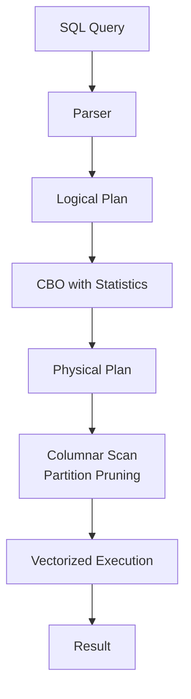

</details>

---
---

# TEMPLATE 5 — `interview.md`

<details open>
<summary><strong>Template Content</strong></summary>

# {{TOPIC_NAME}} — Interview Questions

## Table of Contents

1. [Junior Level](#junior-level)
2. [Middle Level](#middle-level)
3. [Senior Level](#senior-level)
4. [Scenario-Based Questions](#scenario-based-questions)
5. [FAQ](#faq)

---

## Junior Level

### 1. {{Basic SQL question}}?

**Answer:**
Clear explanation with a short SQL example.

```sql
-- Example
```

---

### 2. What is the difference between WHERE and HAVING?

**Answer:**
WHERE filters rows before aggregation. HAVING filters groups after aggregation. You cannot use aggregate functions in WHERE.

---

### 3. {{Question about JOIN types}}?

**Answer:**
...

---

> 5-7 junior questions. Test basic SQL and BI terminology.

---

## Middle Level

### 4. How would you calculate month-over-month revenue growth using window functions?

**Answer:**

```sql
SELECT
    order_month,
    revenue,
    LAG(revenue) OVER (ORDER BY order_month) AS prev_month_revenue,
    (revenue - LAG(revenue) OVER (ORDER BY order_month)) /
        NULLIF(LAG(revenue) OVER (ORDER BY order_month), 0) * 100 AS mom_growth_pct
FROM monthly_revenue
ORDER BY order_month;
```

---

### 5. {{Question about data modeling trade-offs}}?

**Answer:**
...

---

> 4-6 middle questions. Test practical SQL experience and analytical thinking.

---

## Senior Level

### 6. You need to design a data model for an e-commerce company. Describe your approach.

**Answer:**
Star schema: `fact_orders` with FKs to `dim_date`, `dim_customer`, `dim_product`. SCD2 for customer dimension to preserve history. Partition `fact_orders` by month. Pre-aggregate top KPIs into gold-layer summary tables.

---

### 7. {{Performance question — slow dashboard}}?

**Answer:**
...

---

> 4-6 senior questions. Test data modeling and performance expertise.

---

## Scenario-Based Questions

### 8. Your revenue dashboard is showing different numbers than the finance team's spreadsheet. How do you investigate?

**Answer:**
1. Compare metric definitions: gross vs net, include/exclude refunds, timezone
2. Compare date ranges: calendar month vs fiscal month
3. Compare customer segmentation: B2B vs B2C included?
4. Trace to source: check if both come from the same base table

---

> 3-5 scenario questions.

---

## FAQ

### Q: What's the difference between a star schema and a snowflake schema?

**A:** Star schema: denormalized dimensions (fewer joins, faster queries). Snowflake schema: normalized dimensions (saves storage, more complex queries). Most BI tools work better with star schema.

### Q: What do interviewers look for in BI analyst answers?

**A:**
- **Junior:** Clean SQL, understands GROUP BY, JOIN, aggregations
- **Middle:** Window functions, data quality awareness, performance intuition
- **Senior:** Data modeling, metric governance, stakeholder communication

</details>

---
---

# TEMPLATE 6 — `tasks.md`

<details open>
<summary><strong>Template Content</strong></summary>

# {{TOPIC_NAME}} — Practical Tasks

## Table of Contents

1. [Junior Tasks](#junior-tasks)
2. [Middle Tasks](#middle-tasks)
3. [Senior Tasks](#senior-tasks)
4. [Questions](#questions)
5. [Mini Projects](#mini-projects)
6. [Challenge](#challenge)

---

## Junior Tasks

### Task 1: {{Simple SQL task}}

**Type:** 💻 Code (SQL)

**Goal:** Practice basic aggregation

**Instructions:**
1. Write a query to find the top 5 customers by total revenue
2. Include customer name and total revenue
3. Format revenue to 2 decimal places

**Starter code:**

```sql
SELECT
    -- TODO: Complete this
FROM orders
JOIN customers ON ...
GROUP BY ...
ORDER BY ...
LIMIT 5;
```

**Expected output:**
```
customer_name | total_revenue
Alice         | 12500.00
Bob           | 9800.00
```

**Evaluation criteria:**
- [ ] Query runs without errors
- [ ] Correct JOIN used
- [ ] Revenue formatted correctly
- [ ] Sorted in descending order

---

### Task 2: {{Simple dashboard design task}}

**Type:** 🎨 Design

**Goal:** Design a sales KPI dashboard layout

**Deliverable:** Wireframe or mermaid diagram showing dashboard layout

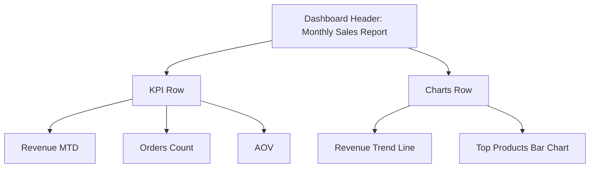

---

## Middle Tasks

### Task 3: Cohort Retention Analysis

**Type:** 💻 Code (SQL)

**Goal:** Build a cohort retention table

**Requirements:**
- [ ] Define cohort by first purchase month
- [ ] Calculate retention for months 0-12
- [ ] Return a matrix: cohort_month × months_since_first_purchase

**Hints:**
<details>
<summary>Hint 1</summary>
Use `MIN(order_date)` with `GROUP BY user_id` to find each user's cohort month.
</details>

---

## Senior Tasks

### Task 4: Design a Metrics Layer

**Type:** 🎨 Design

**Goal:** Design a company-wide metrics layer for 20 analysts using 3 different BI tools

**Requirements:**
- [ ] Define 5 core business metrics with precise definitions
- [ ] Design the semantic layer schema (dbt Metrics or Cube.dev)
- [ ] Document grain, inclusions, exclusions for each metric
- [ ] Show how 3 different BI tools connect to this layer

---

## Questions

### 1. What is the difference between RANK() and DENSE_RANK()?

**Answer:**
Both assign ranks based on ORDER BY. `RANK()` leaves gaps after ties (1,2,2,4). `DENSE_RANK()` does not leave gaps (1,2,2,3).

---

## Mini Projects

### Project 1: E-commerce Analytics Dashboard

**Goal:** End-to-end BI pipeline from raw data to dashboard

**Requirements:**
- [ ] Create staging, intermediate, and mart layers (dbt)
- [ ] Implement fact_orders and key dimensions
- [ ] Build Tableau / Power BI dashboard with 5 KPIs
- [ ] Add dbt data quality tests

**Difficulty:** Middle
**Estimated time:** 10 hours

---

## Challenge

### Optimize a 10-Second Dashboard to < 1 Second

**Problem:** Given a Tableau dashboard that queries a 500M row table and takes 10s to load, optimize to < 1s.

**Constraints:**
- Cannot change the BI tool
- Must maintain exact same metrics

**Scoring:**
- Performance (< 1s): 50%
- Data accuracy maintained: 30%
- Documentation of approach: 20%

</details>

---
---

# TEMPLATE 7 — `find-bug.md`

<details open>
<summary><strong>Template Content</strong></summary>

# {{TOPIC_NAME}} — Find the Bug

> **Practice finding and fixing bugs in SQL and Python BI code related to {{TOPIC_NAME}}.**

---

## How to Use

1. Read the buggy query carefully
2. Try to find the bug **without** looking at the hint
3. Write the fix yourself before checking the solution
4. Understand **why** the bug happens

### Difficulty Levels

| Level | Description |
|:-----:|:-----------|
| 🟢 | **Easy** — Syntax errors, missing GROUP BY, NULL issues |
| 🟡 | **Medium** — Logic errors, wrong join type, metric calculation bugs |
| 🔴 | **Hard** — Subtle aggregation issues, fan-out, window function mistakes |

---

## Bug 1: Missing GROUP BY 🟢

**What the code should do:** Return total revenue per customer

```sql
SELECT customer_id, SUM(revenue)
FROM orders;
-- Bug: missing GROUP BY
```

**Expected output:**
```
customer_id | SUM(revenue)
1           | 500
2           | 300
```

**Actual output:**
```
ERROR: column "customer_id" must appear in the GROUP BY clause
```

<details>
<summary>💡 Hint</summary>
When selecting a non-aggregated column alongside an aggregate function, what clause is required?
</details>

<details>
<summary>🐛 Bug Explanation</summary>

**Bug:** Non-aggregated column `customer_id` without GROUP BY
**Why it happens:** SQL requires all non-aggregated SELECT columns to appear in GROUP BY
**Impact:** Query fails to execute

</details>

<details>
<summary>✅ Fixed Code</summary>

```sql
SELECT customer_id, SUM(revenue) AS total_revenue
FROM orders
GROUP BY customer_id;
```

**What changed:** Added `GROUP BY customer_id`

</details>

---

## Bug 2: {{Bug title}} 🟢

**What the code should do:** {{Expected behavior}}

```sql
-- Buggy SQL
```

<details>
<summary>💡 Hint</summary>
...
</details>

<details>
<summary>🐛 Bug Explanation</summary>

**Bug:** ...
**Why it happens:** ...
**Impact:** ...

</details>

<details>
<summary>✅ Fixed Code</summary>

```sql
-- Fixed SQL
```

**What changed:** ...

</details>

---

## Bug 3: {{Bug title}} 🟢

**What the code should do:** {{Expected behavior}}

```sql
-- Buggy SQL
```

<details>
<summary>💡 Hint</summary>
...
</details>

<details>
<summary>🐛 Bug Explanation</summary>

**Bug:** ...
**Why it happens:** ...
**Impact:** ...

</details>

<details>
<summary>✅ Fixed Code</summary>

```sql
-- Fixed SQL
```

</details>

---

## Bug 4: Division by Zero in Conversion Rate 🟡

**What the code should do:** Calculate add-to-cart conversion rate

```sql
SELECT
    DATE_TRUNC('week', event_date) AS week,
    COUNT(CASE WHEN event = 'add_to_cart' THEN 1 END) /
    COUNT(CASE WHEN event = 'page_view' THEN 1 END)   AS conversion_rate
FROM events
GROUP BY 1;
```

**Expected output:** Conversion rate per week

**Actual output:**
```
ERROR: Division by zero (on weeks with page views but no add-to-cart)
```

<details>
<summary>💡 Hint</summary>
What happens when the denominator is 0? How do you safely handle division?
</details>

<details>
<summary>🐛 Bug Explanation</summary>

**Bug:** No protection against division by zero
**Why it happens:** Some weeks may have 0 page views (or data gaps)
**Impact:** Query fails entirely

</details>

<details>
<summary>✅ Fixed Code</summary>

```sql
SELECT
    DATE_TRUNC('week', event_date) AS week,
    COUNT(CASE WHEN event = 'add_to_cart' THEN 1 END) /
    NULLIF(COUNT(CASE WHEN event = 'page_view' THEN 1 END), 0) AS conversion_rate
FROM events
GROUP BY 1;
```

**What changed:** Wrapped denominator with `NULLIF(..., 0)` — returns NULL instead of error

</details>

---

## Bug 5: {{Bug title}} 🟡

**What the code should do:** {{Expected behavior}}

```sql
-- Buggy SQL — wrong join type causing data loss
```

<details>
<summary>💡 Hint</summary>
...
</details>

<details>
<summary>🐛 Bug Explanation</summary>

**Bug:** ...
**Why it happens:** ...
**Impact:** ...

</details>

<details>
<summary>✅ Fixed Code</summary>

```sql
-- Fixed SQL
```

</details>

---

## Bug 6: {{Bug title}} 🟡

**What the code should do:** {{Expected behavior}}

```sql
-- Buggy SQL — window function partition error
```

<details>
<summary>💡 Hint</summary>
...
</details>

<details>
<summary>🐛 Bug Explanation</summary>

**Bug:** ...
**Why it happens:** ...
**Impact:** ...

</details>

<details>
<summary>✅ Fixed Code</summary>

```sql
-- Fixed SQL
```

</details>

---

## Bug 7: {{Bug title}} 🟡

**What the code should do:** {{Expected behavior}}

```sql
-- Buggy SQL — metric double-counting due to fan-out
```

<details>
<summary>💡 Hint</summary>
...
</details>

<details>
<summary>🐛 Bug Explanation</summary>

**Bug:** ...
**Why it happens:** ...
**Impact:** ...

</details>

<details>
<summary>✅ Fixed Code</summary>

```sql
-- Fixed SQL
```

</details>

---

## Bug 8: Fan-Out in Multi-Grain Join 🔴

**What the code should do:** Show daily revenue with monthly target

```sql
SELECT
    o.order_date,
    SUM(o.revenue)          AS daily_revenue,
    SUM(t.monthly_target)   AS daily_target  -- Bug!
FROM daily_orders o
JOIN monthly_targets t ON DATE_TRUNC('month', o.order_date) = t.month
GROUP BY o.order_date;
```

**Expected output:** Daily revenue vs the one monthly target value

**Actual output:**
```
daily_target = monthly_target × (number of days in month)
-- Target appears 30x larger than it should be!
```

<details>
<summary>💡 Hint</summary>

When joining a daily table to a monthly table, how many rows in `monthly_targets` match each day?

</details>

<details>
<summary>🐛 Bug Explanation</summary>

**Bug:** Many-to-one join fan-out inflates `monthly_target`
**Why it happens:** Each day joins to the same monthly target row, then `SUM` adds it up for each matching daily row
**Impact:** Target appears 28-31x larger depending on month length

</details>

<details>
<summary>✅ Fixed Code</summary>

```sql
SELECT
    o.order_date,
    SUM(o.revenue)                           AS daily_revenue,
    -- Divide monthly target by days in month to get daily target
    AVG(t.monthly_target) /
        DAY(LAST_DAY(o.order_date))          AS daily_target
FROM daily_orders o
JOIN monthly_targets t ON DATE_TRUNC('month', o.order_date) = t.month
GROUP BY o.order_date;
```

**What changed:** Used `AVG()` to prevent fan-out, then divided by days in month

</details>

---

## Bug 9: {{Bug title}} 🔴

**What the code should do:** {{Expected behavior}}

```sql
-- Very subtle SQL bug — works on sample, fails on full data
```

<details>
<summary>💡 Hint</summary>
...
</details>

<details>
<summary>🐛 Bug Explanation</summary>

**Bug:** ...
**Why it happens:** ...
**Impact:** ...
**How to detect:** Run data quality checks on result vs source

</details>

<details>
<summary>✅ Fixed Code</summary>

```sql
-- Fixed SQL
```

</details>

---

## Bug 10: {{Bug title}} 🔴

**What the code should do:** {{Expected behavior}}

```sql
-- Most subtle bug — only manifests on edge cases
```

<details>
<summary>💡 Hint</summary>
...
</details>

<details>
<summary>🐛 Bug Explanation</summary>

**Bug:** ...
**Why it happens:** ...
**Impact:** ...

</details>

<details>
<summary>✅ Fixed Code</summary>

```sql
-- Fixed SQL
```

</details>

---

## Score Card

| Bug | Difficulty | Found without hint? | Understood why? | Fixed correctly? |
|:---:|:---------:|:-------------------:|:---------------:|:----------------:|
| 1 | 🟢 | ☐ | ☐ | ☐ |
| 2 | 🟢 | ☐ | ☐ | ☐ |
| 3 | 🟢 | ☐ | ☐ | ☐ |
| 4 | 🟡 | ☐ | ☐ | ☐ |
| 5 | 🟡 | ☐ | ☐ | ☐ |
| 6 | 🟡 | ☐ | ☐ | ☐ |
| 7 | 🟡 | ☐ | ☐ | ☐ |
| 8 | 🔴 | ☐ | ☐ | ☐ |
| 9 | 🔴 | ☐ | ☐ | ☐ |
| 10 | 🔴 | ☐ | ☐ | ☐ |

</details>

---
---

# TEMPLATE 8 — `optimize.md`

<details open>
<summary><strong>Template Content</strong></summary>

# {{TOPIC_NAME}} — Optimize the Code

> **Practice optimizing slow SQL queries and dashboards related to {{TOPIC_NAME}}.**

---

## How to Use

1. Read the slow query and understand what it does
2. Identify the performance bottleneck
3. Write your optimized version
4. Compare with the solution and benchmark results

### Difficulty Levels

| Level | Focus |
|:-----:|:------|
| 🟢 | **Easy** — Add indexes, fix missing filters, remove SELECT * |
| 🟡 | **Medium** — Partition pruning, CTE refactoring, join optimization |
| 🔴 | **Hard** — Materialized views, query plan analysis, warehouse tuning |

### Optimization Categories

| Category | Icon | Description |
|:--------:|:----:|:-----------|
| **Query Time** | ⚡ | Reduce query execution time |
| **Data Scanned** | 📦 | Reduce bytes/rows processed |
| **Dashboard** | 🖥️ | Reduce dashboard load time |
| **Cost** | 💰 | Reduce cloud data warehouse costs |

---

## Exercise 1: Remove SELECT * 🟢 📦

**What the code does:** Queries all columns from a wide table.

**The problem:** SELECT * reads every column — 99% may be unused.

```sql
-- Slow version
SELECT *
FROM orders
WHERE order_date >= '2024-01-01';
-- Scans 200 columns including large TEXT blobs
```

**Current benchmark:**
```
Execution time: 45s
Bytes scanned:  500 GB
```

<details>
<summary>💡 Hint</summary>
List only the columns your analysis actually needs.
</details>

<details>
<summary>⚡ Optimized Code</summary>

```sql
-- Fast version — only needed columns
SELECT order_id, customer_id, order_date, revenue_usd
FROM orders
WHERE order_date >= '2024-01-01';
```

**What changed:**
- Replaced `SELECT *` with specific columns — reads only 4 of 200 columns

**Optimized benchmark:**
```
Execution time: 2s
Bytes scanned:  10 GB
```

**Improvement:** 22x faster, 50x less data scanned, 50x cost reduction

</details>

<details>
<summary>📚 Learn More</summary>

**Why this works:** Columnar storage reads only requested columns from disk. Selecting 4 of 200 columns reads 2% of the data.
**When to apply:** Always — there is no reason to SELECT * in production analytics queries.

</details>

---

## Exercise 2: Add Partition Filter 🟢 📦

**What the code does:** Aggregates revenue across all time.

**The problem:** No date filter → full table scan on partitioned table.

```sql
SELECT customer_id, SUM(revenue) AS total_revenue
FROM orders
GROUP BY customer_id;
-- Scans all 5 years of history for a "last 30 days" dashboard
```

**Current benchmark:**
```
Execution time: 3 minutes
Bytes scanned:  5 TB (5 years of data)
```

<details>
<summary>💡 Hint</summary>
Add a date range filter that matches the partition key.
</details>

<details>
<summary>⚡ Optimized Code</summary>

```sql
SELECT customer_id, SUM(revenue) AS total_revenue
FROM orders
WHERE order_date >= DATEADD('day', -30, CURRENT_DATE())
GROUP BY customer_id;
```

**Improvement:** 60x faster, 99% less data scanned

</details>

---

## Exercise 3: Use COALESCE to avoid function in WHERE 🟢 ⚡

**What the code does:** Filters active customers with no NULL in status.

**The problem:** Using a function on a column in WHERE prevents index use.

```sql
-- Slow
SELECT * FROM customers WHERE UPPER(status) = 'ACTIVE';
-- Forces full scan — index on `status` is unused

-- Fast
SELECT * FROM customers WHERE status = 'ACTIVE';
-- Use consistent casing in source data
-- Or: create index on UPPER(status) if mixed case is unavoidable
```

<details>
<summary>⚡ Optimized Code</summary>

```sql
-- Option 1: fix data at source (best)
SELECT * FROM customers WHERE status = 'ACTIVE';

-- Option 2: function-based index (if you can't fix source)
CREATE INDEX idx_status_upper ON customers (UPPER(status));
SELECT * FROM customers WHERE UPPER(status) = 'ACTIVE';
```

**Improvement:** 10-100x faster on large tables

</details>

---

## Exercise 4: Replace Correlated Subquery with JOIN 🟡 ⚡

**What the code does:** For each customer, finds their first order date.

**The problem:** Correlated subquery runs once per row — O(n²).

```sql
-- Slow — correlated subquery (O(n²))
SELECT
    c.customer_id,
    c.name,
    (SELECT MIN(order_date)
     FROM orders o
     WHERE o.customer_id = c.customer_id) AS first_order_date
FROM customers c;
```

**Current benchmark:**
```
1M customers × subquery = 1M queries → 45 minutes
```

<details>
<summary>💡 Hint</summary>
Pre-aggregate first order dates, then JOIN once.
</details>

<details>
<summary>⚡ Optimized Code</summary>

```sql
-- Fast — pre-aggregate then join (O(n))
WITH first_orders AS (
    SELECT customer_id, MIN(order_date) AS first_order_date
    FROM orders
    GROUP BY customer_id
)
SELECT c.customer_id, c.name, fo.first_order_date
FROM customers c
LEFT JOIN first_orders fo ON c.customer_id = fo.customer_id;
```

**Improvement:** 1000x faster — single scan instead of per-row subquery

</details>

---

## Exercise 5: Incremental Aggregation for Daily Dashboard 🟡 💰

**What the code does:** Recalculates all-time revenue metrics on every dashboard load.

**The problem:** Reprocesses years of history for metrics that only change daily.

```sql
-- Slow — full recalculation every time dashboard loads
SELECT
    DATE_TRUNC('month', order_date) AS month,
    SUM(revenue)                    AS monthly_revenue
FROM orders  -- 3 billion rows, 5 years of history
GROUP BY 1;
```

<details>
<summary>⚡ Optimized Code</summary>

```sql
-- Fast — pre-aggregate into summary table, refresh incrementally
-- Step 1: pre-aggregate (run once)
CREATE TABLE monthly_revenue_summary AS
SELECT DATE_TRUNC('month', order_date) AS month, SUM(revenue) AS revenue
FROM orders
GROUP BY 1;

-- Step 2: daily incremental refresh
INSERT INTO monthly_revenue_summary
SELECT DATE_TRUNC('month', order_date) AS month, SUM(revenue) AS revenue
FROM orders
WHERE order_date >= DATEADD('day', -2, CURRENT_DATE())  -- last 2 days for safety
GROUP BY 1
ON CONFLICT (month) DO UPDATE SET revenue = EXCLUDED.revenue;
```

**Improvement:** Dashboard query runs in 0.1s instead of 3 minutes

</details>

---

## Exercise 6: Avoid DISTINCT in Large Aggregations 🟡 ⚡

**What the code does:** Counts unique customers across multiple dimensions.

**The problem:** `COUNT(DISTINCT ...)` on large tables is very expensive.

```sql
-- Slow
SELECT
    segment,
    region,
    COUNT(DISTINCT customer_id) AS unique_customers
FROM orders
GROUP BY segment, region;
```

<details>
<summary>⚡ Optimized Code</summary>

```sql
-- Fast — pre-deduplicate then aggregate
WITH unique_customers AS (
    SELECT DISTINCT customer_id, segment, region FROM orders
)
SELECT segment, region, COUNT(customer_id) AS unique_customers
FROM unique_customers
GROUP BY segment, region;

-- Alternative: approximate count (acceptable for dashboards)
SELECT segment, region, APPROX_COUNT_DISTINCT(customer_id) AS unique_customers
FROM orders
GROUP BY segment, region;
-- APPROX_COUNT_DISTINCT is 2-3% error but 10-100x faster
```

**Improvement:** 5-20x faster for large datasets

</details>

---

## Exercise 7: Fix N+1 in dbt/Python Loop 🟡 💰

**What the code does:** Runs a separate query for each date to calculate daily metrics.

**The problem:** Loop with one query per day = 365 API calls per year.

```python
# Slow — N+1 pattern
results = []
for date in date_range:
    row = snowflake.execute(
        f"SELECT SUM(revenue) FROM orders WHERE order_date = '{date}'"
    )
    results.append(row)
```

<details>
<summary>⚡ Optimized Code</summary>

```python
# Fast — single query for all dates
results = snowflake.execute("""
    SELECT order_date, SUM(revenue) AS daily_revenue
    FROM orders
    WHERE order_date BETWEEN :start_date AND :end_date
    GROUP BY order_date
    ORDER BY order_date
""", {"start_date": start, "end_date": end})
```

**Improvement:** 365 queries → 1 query; 300x faster, 99% cost reduction

</details>

---

## Exercise 8: Materialized View for Complex Aggregation 🔴 🖥️

**What the code does:** Complex 5-join query powers the executive dashboard.

**The problem:** 10-second query runs every time someone opens the dashboard.

```sql
-- Complex production query — 10 seconds, runs 500x/day
SELECT
    d.year, d.quarter, c.segment, p.category,
    SUM(f.revenue_usd) AS revenue,
    COUNT(DISTINCT f.customer_key) AS customers,
    SUM(f.revenue_usd) / COUNT(DISTINCT f.customer_key) AS arpu
FROM fact_orders f
JOIN dim_date d     ON f.date_key = d.date_key
JOIN dim_customer c ON f.customer_key = c.customer_key
JOIN dim_product p  ON f.product_key = p.product_key
GROUP BY 1, 2, 3, 4;
```

**Current benchmark:**
```
Execution time: 10 seconds
Daily cost: 500 runs × 10s × warehouse cost = $50/day
```

<details>
<summary>⚡ Optimized Code</summary>

```sql
-- Create materialized view (Snowflake dynamic table or BigQuery materialized view)
CREATE OR REPLACE DYNAMIC TABLE mv_revenue_by_segment
    TARGET_LAG = '1 hour'
    WAREHOUSE = reporting_wh
AS
SELECT
    d.year, d.quarter, c.segment, p.category,
    SUM(f.revenue_usd) AS revenue,
    COUNT(DISTINCT f.customer_key) AS customers,
    SUM(f.revenue_usd) / NULLIF(COUNT(DISTINCT f.customer_key), 0) AS arpu
FROM fact_orders f
JOIN dim_date d     ON f.date_key = d.date_key
JOIN dim_customer c ON f.customer_key = c.customer_key
JOIN dim_product p  ON f.product_key = p.product_key
GROUP BY 1, 2, 3, 4;

-- Dashboard now queries pre-computed table
SELECT * FROM mv_revenue_by_segment WHERE year = 2024;
```

**Improvement:** Dashboard loads in 0.1s, daily cost drops 99%

</details>

---

## Exercise 9: Partition Elimination on Clustered Column 🔴 📦

**What the code does:** Finds all orders for a specific customer in the last 3 months.

**The problem:** Table is partitioned by date, but query filters by customer_id first — pruning doesn't apply.

```sql
-- Slow — customer filter evaluated after scanning all partitions
SELECT * FROM orders
WHERE customer_id = 12345
  AND order_date >= DATEADD('month', -3, CURRENT_DATE());
```

<details>
<summary>💡 Hint</summary>
Ensure the partition/cluster key column appears prominently in the WHERE clause. Check the query profile for "partitions scanned".
</details>

<details>
<summary>⚡ Optimized Code</summary>

```sql
-- Fast — date filter enables partition pruning
-- (rewrite with date first — optimizer evaluates partition key first)
SELECT * FROM orders
WHERE order_date >= DATEADD('month', -3, CURRENT_DATE())
  AND customer_id = 12345;

-- For Snowflake: also add customer_id as secondary cluster key
ALTER TABLE orders CLUSTER BY (DATE_TRUNC('month', order_date), customer_id);
```

**Improvement:** Partitions scanned: 3 of 60 → 95% reduction in data scanned

</details>

---

## Exercise 10: Optimize COUNT DISTINCT with HyperLogLog 🔴 ⚡

**What the code does:** Counts unique visitors for a 1-billion-row events table.

**The problem:** Exact COUNT(DISTINCT) requires deduplication in memory — slow and expensive.

```sql
-- Slow — exact distinct count on 1B rows
SELECT DATE_TRUNC('day', event_date) AS day,
       COUNT(DISTINCT user_id)       AS dau
FROM events
GROUP BY 1;
-- Execution: 8 minutes, 50 GB memory
```

<details>
<summary>⚡ Optimized Code</summary>

```sql
-- Fast — HyperLogLog approximate distinct count
-- Snowflake: HLL() function, ~2% error, 100x faster
SELECT DATE_TRUNC('day', event_date) AS day,
       HLL(user_id)                  AS dau_approx
FROM events
GROUP BY 1;

-- BigQuery: APPROX_COUNT_DISTINCT
SELECT DATE_TRUNC(event_date, DAY) AS day,
       APPROX_COUNT_DISTINCT(user_id) AS dau_approx
FROM events
GROUP BY 1;
```

**Improvement:** 8 minutes → 5 seconds, 50GB → 1GB memory

</details>

---

## Score Card

| Exercise | Difficulty | Category | Found bottleneck? | Your improvement | Target |
|:--------:|:---------:|:--------:|:-----------------:|:----------------:|:------:|
| 1 | 🟢 | 📦 | ☐ | ___ x | 50x |
| 2 | 🟢 | 📦 | ☐ | ___ x | 60x |
| 3 | 🟢 | ⚡ | ☐ | ___ x | 10-100x |
| 4 | 🟡 | ⚡ | ☐ | ___ x | 1000x |
| 5 | 🟡 | 💰 | ☐ | ___ x | 1800x |
| 6 | 🟡 | ⚡ | ☐ | ___ x | 5-20x |
| 7 | 🟡 | 💰 | ☐ | ___ x | 300x |
| 8 | 🔴 | 🖥️ | ☐ | ___ x | 100x |
| 9 | 🔴 | 📦 | ☐ | ___% | 95% |
| 10 | 🔴 | ⚡ | ☐ | ___ x | 100x |

---

## Optimization Cheat Sheet

| Problem | Solution | Impact |
|:--------|:---------|:------:|
| SELECT * | Select only needed columns | Very High |
| No date filter on partitioned table | Add explicit date range | Very High |
| Function on WHERE column | Move function to comparison side | High |
| Correlated subquery | Rewrite as JOIN with pre-aggregation | Very High |
| Full refresh for incremental data | Incremental materialized view | Very High |
| COUNT(DISTINCT) on large table | APPROX_COUNT_DISTINCT (HLL) | High |
| Dashboard runs complex query live | Materialized view + cache | Very High |
| N+1 loop queries | Single batch query | Very High |
| DISTINCT in large aggregation | Pre-deduplicate then aggregate | Medium-High |

</details>
---
---

# TEMPLATE 9 — `specification.md`

> **Focus:** Official documentation deep-dive — API reference, configuration schema, behavioral guarantees, and version compatibility.
>
> **Source:** Always cite the official documentation with direct section links.
> - AI Agents / Claude: https://docs.anthropic.com/en/api/
> - Machine Learning (scikit-learn): https://scikit-learn.org/stable/modules/classes.html
> - Prompt Engineering: https://docs.anthropic.com/en/docs/build-with-claude/prompt-engineering/overview
> - Data Analyst (pandas): https://pandas.pydata.org/docs/reference/
> - Claude Code: https://docs.anthropic.com/en/docs/claude-code/overview
> - AI Engineer: https://docs.anthropic.com/en/api/
> - BI Analyst: https://docs.metabase.com/latest/
> - AI Data Scientist: https://docs.scipy.org/doc/scipy/reference/
> - Data Structures & Algorithms: https://docs.python.org/3/library/

<details open>
<summary><strong>Template Content</strong></summary>

# {{TOPIC_NAME}} — Specification

> **Official Documentation Reference**
>
> Source: [{{TOOL_NAME}} Official Docs]({{DOCS_URL}}) — {{SECTION}}

---

## Table of Contents

1. [Docs Reference](#docs-reference)
2. [API / Configuration Reference](#api--configuration-reference)
3. [Core Concepts & Rules](#core-concepts--rules)
4. [Schema / Parameters Reference](#schema--parameters-reference)
5. [Behavioral Specification](#behavioral-specification)
6. [Edge Cases from Official Docs](#edge-cases-from-official-docs)
7. [Version & Compatibility Matrix](#version--compatibility-matrix)
8. [Official Examples](#official-examples)
9. [Compliance & Best Practices Checklist](#compliance--best-practices-checklist)
10. [Related Documentation](#related-documentation)

---

## 1. Docs Reference

| Property | Value |
|----------|-------|
| **Official Docs** | [{{TOOL_NAME}} Documentation]({{DOCS_URL}}) |
| **Relevant Section** | {{SECTION_NAME}} — {{SECTION_TITLE}} |
| **Version** | {{TOOL_VERSION}} |
| **Direct URL** | {{DOCS_URL}}/{{PATH}} |

---

## 2. API / Configuration Reference

> From: {{DOCS_URL}}/{{API_SECTION}}

### {{RESOURCE_OR_FUNCTION_NAME}}

| Parameter | Type | Required | Default | Description |
|-----------|------|----------|---------|-------------|
| `{{PARAM_1}}` | `{{TYPE_1}}` | ✅ | — | {{DESC_1}} |
| `{{PARAM_2}}` | `{{TYPE_2}}` | ❌ | `{{DEFAULT_2}}` | {{DESC_2}} |
| `{{PARAM_3}}` | `{{TYPE_3}}` | ❌ | `{{DEFAULT_3}}` | {{DESC_3}} |

**Returns:** `{{RETURN_TYPE}}` — {{RETURN_DESC}}

---

## 3. Core Concepts & Rules

The official documentation defines these key rules for {{TOPIC_NAME}}:

### Rule 1: {{RULE_NAME}}

> *Docs: [{{DOCS_URL}}/{{SECTION}}]({{DOCS_URL}}/{{SECTION}}) — "{{DOC_QUOTE}}"*

{{RULE_EXPLANATION}}

```python
# ✅ Correct — follows official guidance
{{VALID_EXAMPLE}}

# ❌ Incorrect — violates official guidance
{{INVALID_EXAMPLE}}
```

### Rule 2: {{RULE_NAME}}

> *Docs: [{{DOCS_URL}}/{{SECTION}}]({{DOCS_URL}}/{{SECTION}})*

{{RULE_EXPLANATION}}

```python
{{CODE_EXAMPLE}}
```

---

## 4. Schema / Parameters Reference

| Option | Type | Allowed Values | Default | Docs |
|--------|------|---------------|---------|------|
| `{{OPT_1}}` | `{{TYPE_1}}` | `{{VALUES_1}}` | `{{DEFAULT_1}}` | [Link]({{URL_1}}) |
| `{{OPT_2}}` | `{{TYPE_2}}` | `{{VALUES_2}}` | `{{DEFAULT_2}}` | [Link]({{URL_2}}) |
| `{{OPT_3}}` | `{{TYPE_3}}` | `{{VALUES_3}}` | `{{DEFAULT_3}}` | [Link]({{URL_3}}) |

---

## 5. Behavioral Specification

### Normal Operation

{{NORMAL_OPERATION}}

### Documented Limitations

| Limitation | Details | Workaround |
|------------|---------|------------|
| {{LIMIT_1}} | {{DETAIL_1}} | {{WORKAROUND_1}} |
| {{LIMIT_2}} | {{DETAIL_2}} | {{WORKAROUND_2}} |

### Error / Failure Conditions

| Error | Condition | Official Resolution |
|-------|-----------|---------------------|
| `{{ERROR_1}}` | {{COND_1}} | {{FIX_1}} |
| `{{ERROR_2}}` | {{COND_2}} | {{FIX_2}} |

---

## 6. Edge Cases from Official Docs

| Edge Case | Official Behavior | Reference |
|-----------|-------------------|-----------|
| {{EDGE_1}} | {{BEHAVIOR_1}} | [Docs]({{URL_1}}) |
| {{EDGE_2}} | {{BEHAVIOR_2}} | [Docs]({{URL_2}}) |
| {{EDGE_3}} | {{BEHAVIOR_3}} | [Docs]({{URL_3}}) |

---

## 7. Version & Compatibility Matrix

| Version | Change | Notes |
|---------|--------|-------|
| `{{VER_1}}` | {{CHANGE_1}} | {{NOTES_1}} |
| `{{VER_2}}` | {{CHANGE_2}} | {{NOTES_2}} |

### Dependency Compatibility

| Dependency | Supported Versions | Notes |
|------------|-------------------|-------|
| {{DEP_1}} | {{VER_RANGE_1}} | {{NOTES_1}} |
| {{DEP_2}} | {{VER_RANGE_2}} | {{NOTES_2}} |

---

## 8. Official Examples

### Example from Docs: {{EXAMPLE_TITLE}}

> Source: [{{DOCS_URL}}/{{ANCHOR}}]({{DOCS_URL}}/{{ANCHOR}})

```python
{{OFFICIAL_EXAMPLE_CODE}}
```

**Expected result:**

```
{{EXPECTED_RESULT}}
```

---

## 9. Compliance & Best Practices Checklist

- [ ] Follows official recommended patterns for {{TOPIC_NAME}}
- [ ] Uses supported version ({{TOOL_VERSION}}+)
- [ ] Handles all documented error/edge conditions
- [ ] Follows official security recommendations
- [ ] Uses official API/SDK rather than workarounds
- [ ] Compatible with listed dependencies

---

## 10. Related Documentation

| Topic | Doc Section | URL |
|-------|-------------|-----|
| {{RELATED_1}} | {{SECTION_1}} | [Link]({{URL_1}}) |
| {{RELATED_2}} | {{SECTION_2}} | [Link]({{URL_2}}) |
| {{RELATED_3}} | {{SECTION_3}} | [Link]({{URL_3}}) |

---

> **Content Rules for `specification.md`:**
> - Always link directly to the relevant doc section (not just the homepage)
> - Use official examples from the documentation when available
> - Note breaking changes and deprecated features between versions
> - Include official security / safety recommendations
> - Minimum 2 Core Rules, 3 Parameters, 3 Edge Cases, 2 Official Examples

</details>
