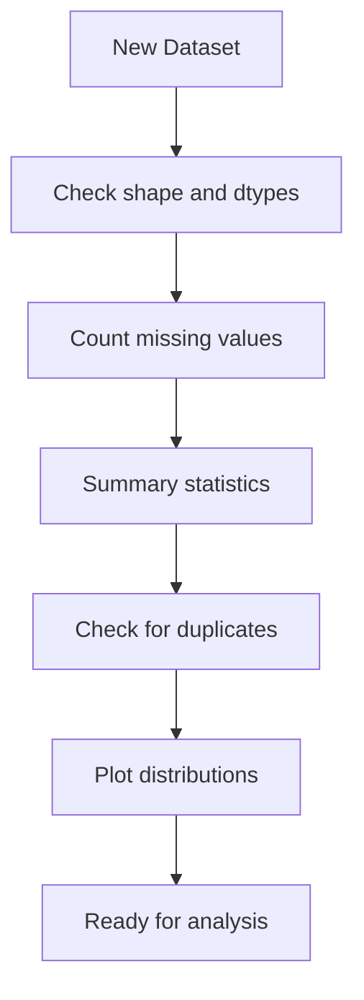
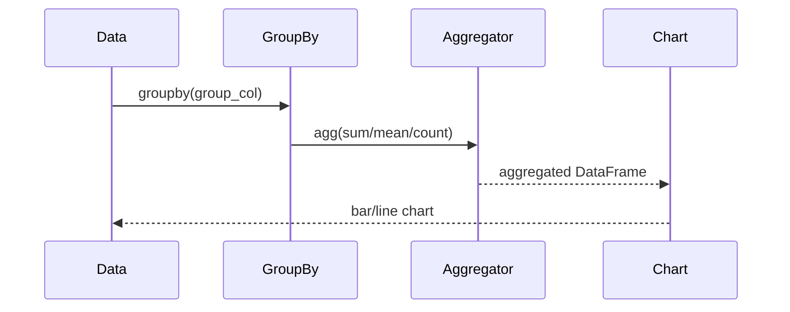
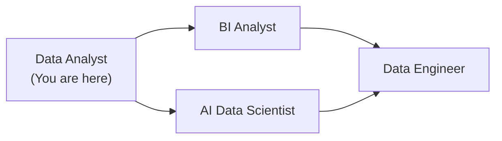
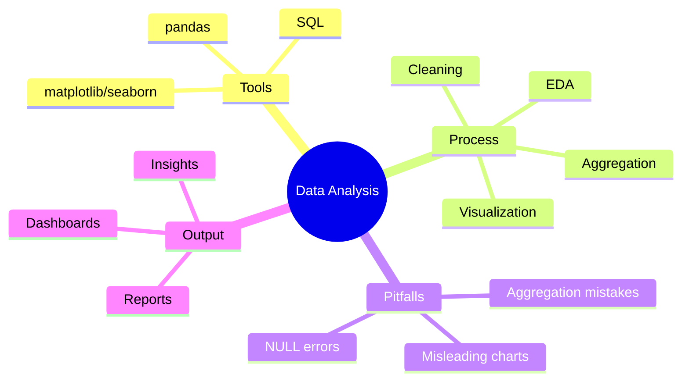
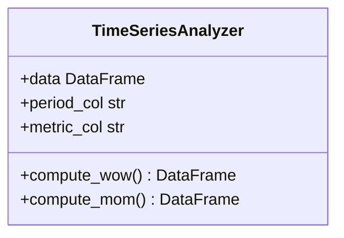
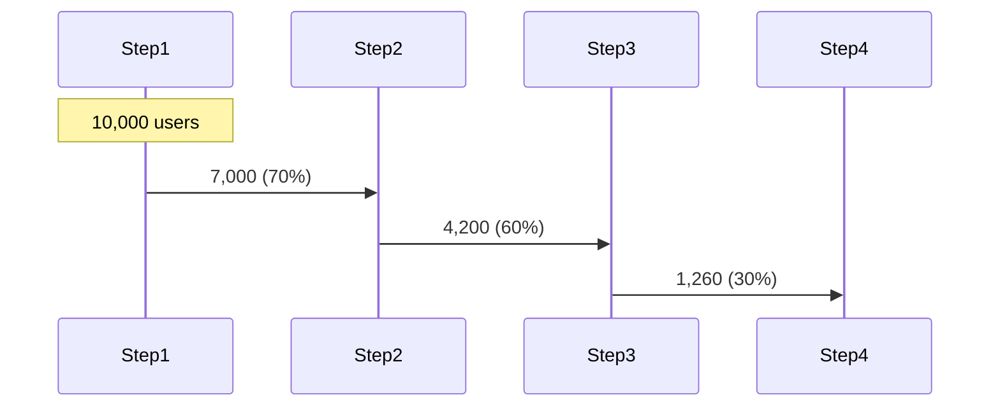
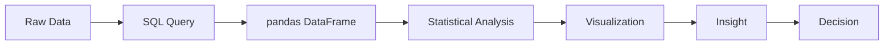
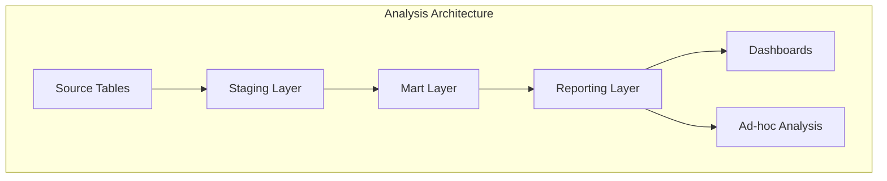
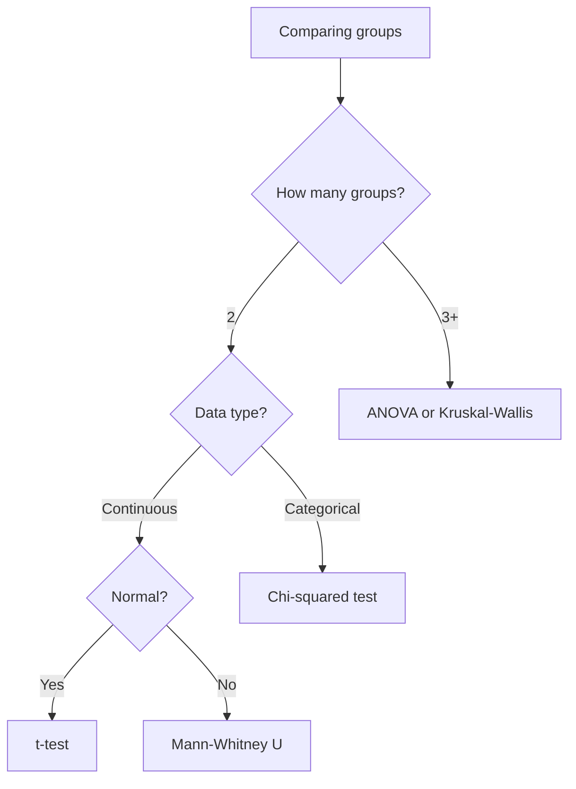

# Data Analyst Roadmap — Universal Template

> **A comprehensive template system for generating Data Analyst roadmap content across all skill levels.**

---

## Overview

| | Description |
|---|---|
| **Purpose** | Universal template for all Data Analyst roadmap topics |
| **Files per topic** | 8 files: `junior.md`, `middle.md`, `senior.md`, `professional.md`, `interview.md`, `tasks.md`, `find-bug.md`, `optimize.md` |
| **Language** | All content must be generated in **English** |
| **Table of Contents** | **Optional** — include only if relevant to the topic |

### Topic Structure

```
XX-topic-name/
├── junior.md          ← "What?" and "How?"
├── middle.md          ← "Why?" and "When?"
├── senior.md          ← "How to optimize?" and "How to architect?"
├── professional.md    ← "Mathematical and Algorithmic Foundations"
├── interview.md       ← Interview prep across all levels
├── tasks.md           ← Hands-on practice tasks
├── find-bug.md        ← Find and fix bugs in analysis code (10+ exercises)
└── optimize.md        ← Optimize slow queries and pipelines (10+ exercises)
```

---

## Level Comparison Matrix

| Aspect | Junior | Middle | Senior | Professional |
|:------:|:------:|:------:|:------:|:------------:|
| **Depth** | Basic SQL, pandas, visualization | Advanced SQL, statistics, dashboards | Analytical architecture, data storytelling | Query optimization internals, statistical theory |
| **Code** | Simple SELECT queries, basic pandas | Window functions, complex joins, pivot tables | Query optimization, data pipeline design | Query execution plans, B-tree internals |
| **Tricky Points** | NULL handling, wrong aggregations | Sampling bias, confounding variables | Misleading visualizations, p-hacking | Query planner behavior, index selectivity |
| **Focus** | "What?" and "How?" | "Why?" and "When?" | "How to improve?" | "What happens under the hood?" |

---
---

# TEMPLATE 1 — `junior.md`

<details open>
<summary><strong>Template Content</strong></summary>

# {{TOPIC_NAME}} — Junior Level

## Table of Contents

1. [Introduction](#introduction)
2. [Prerequisites](#prerequisites)
3. [Glossary](#glossary)
4. [Core Concepts](#core-concepts)
5. [Pros & Cons](#pros--cons)
6. [Use Cases](#use-cases)
7. [Code Examples](#code-examples)
8. [Coding Patterns](#coding-patterns)
9. [Clean Code](#clean-code)
10. [Product Use / Feature](#product-use--feature)
11. [Data Quality and Model Failure Handling](#data-quality-and-model-failure-handling)
12. [Security Considerations](#security-considerations)
13. [Performance Tips](#performance-tips)
14. [Metrics & Analytics](#metrics--analytics)
15. [Best Practices](#best-practices)
16. [Edge Cases & Pitfalls](#edge-cases--pitfalls)
17. [Common Mistakes](#common-mistakes)
18. [Tricky Points](#tricky-points)
19. [Test](#test)
20. [Tricky Questions](#tricky-questions)
21. [Cheat Sheet](#cheat-sheet)
22. [Summary](#summary)
23. [What You Can Build](#what-you-can-build)
24. [Further Reading](#further-reading)
25. [Related Topics](#related-topics)
26. [Diagrams & Visual Aids](#diagrams--visual-aids)

---

## Introduction

> Focus: "What is it?" and "How to use it?"

Data analysis is the process of inspecting, cleaning, transforming, and modeling data to discover useful information, draw conclusions, and support decision-making.

---

## Prerequisites

- **Required:** Basic Python — lists, dicts, functions
- **Required:** Basic math — percentages, averages, ranges
- **Helpful:** Basic SQL syntax — SELECT, WHERE, GROUP BY

---

## Glossary

| Term | Definition |
|------|-----------|
| **DataFrame** | A 2D tabular data structure with rows and columns (like a spreadsheet) |
| **Aggregation** | Computing a summary statistic (sum, mean, count) over a group of values |
| **JOIN** | Combining two tables based on a matching column |
| **NULL** | A missing or undefined value in a dataset |
| **Outlier** | A data point significantly different from others |
| **Distribution** | How values are spread across a dataset |

---

## Core Concepts

### Concept 1: Exploratory Data Analysis (EDA)

EDA is the first step of any analysis — understanding the shape and quality of your data before drawing conclusions.

### Concept 2: Aggregation and Grouping

Most business questions are answered by: count, sum, average, min, max over groups.

---

## Real-World Analogies

| Concept | Analogy |
|---------|--------|
| **DataFrame** | A spreadsheet where each column is a variable and each row is an observation |
| **GROUP BY** | Like sorting bills into piles by category before totaling each pile |
| **JOIN** | Like connecting two lists with a common ID column |

---

## Pros & Cons

| Pros | Cons |
|------|------|
| Python + pandas is powerful and flexible | Learning curve for SQL and Python |
| SQL handles large datasets efficiently | Easy to produce misleading results |
| Visualization makes insights actionable | Data quality issues require constant vigilance |

---

## Use Cases

- **Use Case 1:** Sales reporting — total revenue by region, product, time period
- **Use Case 2:** User behavior analysis — funnel conversion rates
- **Use Case 3:** Quality control — identify anomalies in sensor data

---

## Code Examples

### Example 1: Basic pandas EDA

```python
import pandas as pd
import matplotlib.pyplot as plt

# Load data
df = pd.read_csv("sales_data.csv")

# Basic exploration
print(df.shape)          # (10000, 8) — rows and columns
print(df.dtypes)         # data types per column
print(df.isnull().sum()) # count of missing values per column
print(df.describe())     # summary statistics for numeric columns

# Distribution of sales
df["revenue"].hist(bins=30)
plt.xlabel("Revenue")
plt.ylabel("Count")
plt.title("Revenue Distribution")
plt.savefig("revenue_dist.png")
```

**What it does:** Loads a CSV, checks for missing values, and plots the revenue distribution.

### Example 2: SQL aggregation query

```sql
-- Total revenue by product category
SELECT
    category,
    COUNT(*) AS order_count,
    SUM(revenue) AS total_revenue,
    AVG(revenue) AS avg_revenue,
    MAX(revenue) AS max_revenue
FROM orders
WHERE order_date >= '2024-01-01'
GROUP BY category
ORDER BY total_revenue DESC;
```

```python
# Equivalent in pandas
summary = (
    df[df["order_date"] >= "2024-01-01"]
    .groupby("category")
    .agg(
        order_count=("revenue", "count"),
        total_revenue=("revenue", "sum"),
        avg_revenue=("revenue", "mean")
    )
    .sort_values("total_revenue", ascending=False)
)
```

---

## Coding Patterns

### Pattern 1: EDA Checklist Pattern

**Intent:** Systematically understand a new dataset before analysis.
**When to use:** Every time you receive a new dataset.

```python
def quick_eda(df: pd.DataFrame, dataset_name: str = "dataset") -> None:
    print(f"=== EDA: {dataset_name} ===")
    print(f"Shape: {df.shape[0]:,} rows × {df.shape[1]} columns")
    print(f"\nData types:\n{df.dtypes}")
    print(f"\nMissing values:\n{df.isnull().sum()[df.isnull().sum() > 0]}")
    print(f"\nNumeric summary:\n{df.describe()}")
    print(f"\nDuplicate rows: {df.duplicated().sum()}")
```

**Diagram:**



**Remember:** Never skip EDA — unknown data quality issues will invalidate your conclusions.

---

### Pattern 2: Group-Aggregate-Visualize

**Intent:** Answer "how does X vary by Y?" questions.

```python
def group_analyze(
    df: pd.DataFrame,
    group_col: str,
    value_col: str,
    agg_fn: str = "mean"
) -> pd.DataFrame:
    result = df.groupby(group_col)[value_col].agg(agg_fn).reset_index()
    result.columns = [group_col, f"{agg_fn}_{value_col}"]
    return result.sort_values(f"{agg_fn}_{value_col}", ascending=False)

# Usage
revenue_by_region = group_analyze(sales_df, "region", "revenue", "sum")
revenue_by_region.plot(kind="bar", x="region", y="sum_revenue")
```

**Diagram:**



---

## Clean Code

### Naming

```python
# Bad naming
def proc(d, c):
    return d.groupby(c).sum()

# Clean naming
def aggregate_revenue_by_category(
    sales_dataframe: pd.DataFrame,
    category_column: str
) -> pd.DataFrame:
    return sales_dataframe.groupby(category_column)["revenue"].sum().reset_index()
```

**Rules:**
- No single-letter column names in analysis code
- Functions: describe what they compute (`compute_monthly_churn_rate`, not `calc`)
- DataFrames: describe what data they hold (`customer_orders_df`, not `df2`)

---

### Reproducibility

```python
# Bad — no seed, hardcoded date
sample = df.sample(1000)
today = pd.Timestamp.now()

# Good — seeded sample, parameterized date
ANALYSIS_DATE = pd.Timestamp("2024-01-01")
RANDOM_SEED = 42

sample = df.sample(n=1000, random_state=RANDOM_SEED)
```

---

## Product Use / Feature

### 1. Airbnb Analytics

- **How it uses data analysis:** Hosts and guests analyzed via pricing trends, seasonal demand, review sentiment
- **Why it matters:** Drives dynamic pricing recommendations that increase host revenue

### 2. Spotify Wrapped

- **How it uses data analysis:** Aggregates play counts, listening time, artist frequency per user per year
- **Why it matters:** Shareable personal analytics drive massive social media engagement

### 3. Google Analytics

- **How it uses data analysis:** Real-time aggregation of page views, sessions, conversion funnels
- **Why it matters:** Foundation for web optimization decisions

---

## Data Quality and Model Failure Handling

### Error 1: Wrong aggregation due to NULLs

```sql
-- Bug: AVG ignores NULLs — misleading result
SELECT AVG(revenue) FROM orders;  -- Returns 85 (ignores 200 NULL rows)

-- Fix: explicit NULL handling
SELECT
    AVG(COALESCE(revenue, 0)) AS avg_including_nulls,
    COUNT(*) AS total_rows,
    COUNT(revenue) AS non_null_rows
FROM orders;
```

### Error 2: Division by zero in rate calculation

```python
# Bad — crashes on empty groups
churn_rate = churned_users / total_users

# Fixed — safe division
churn_rate = churned_users / total_users if total_users > 0 else None
```

### Data Quality Pattern

```python
def validate_dataframe(df: pd.DataFrame, required_cols: list[str]) -> None:
    missing_cols = [col for col in required_cols if col not in df.columns]
    assert not missing_cols, f"Missing columns: {missing_cols}"
    assert len(df) > 0, "DataFrame is empty"
    assert df.duplicated().sum() == 0, "Duplicate rows detected"
```

---

## Security Considerations

### 1. SQL Injection

```python
# Insecure — user input directly in SQL
query = f"SELECT * FROM users WHERE name = '{user_input}'"

# Secure — parameterized query
query = "SELECT * FROM users WHERE name = %s"
cursor.execute(query, (user_input,))
```

---

## Performance Tips

### Tip 1: Filter before aggregating

```sql
-- Slow — aggregate then filter
SELECT * FROM (
    SELECT region, SUM(revenue) FROM orders GROUP BY region
) WHERE region = 'North';

-- Fast — filter first, then aggregate
SELECT region, SUM(revenue) FROM orders
WHERE region = 'North'
GROUP BY region;
```

---

## Metrics & Analytics

| Metric | Why it matters | Tool |
|--------|---------------|------|
| **Query execution time** | Identifies slow analyses | `EXPLAIN ANALYZE`, pandas `.time` |
| **Null rate per column** | Data quality signal | `df.isnull().mean()` |
| **Row count over time** | Detects data pipeline issues | Monitoring dashboards |

---

## Best Practices

- **Always check for NULLs before aggregating** — NULL propagates in unexpected ways
- **Document your assumptions** — write down what you assumed about the data
- **Keep raw data untouched** — never modify source data; create derived tables

---

## Cheat Sheet

| What | SQL | Pandas |
|------|-----|--------|
| Count rows | `SELECT COUNT(*) FROM t` | `len(df)` |
| Group sum | `SELECT grp, SUM(val) FROM t GROUP BY grp` | `df.groupby('grp')['val'].sum()` |
| Filter rows | `WHERE col > 10` | `df[df['col'] > 10]` |
| Sort | `ORDER BY col DESC` | `df.sort_values('col', ascending=False)` |
| Missing values | `WHERE col IS NULL` | `df[df['col'].isna()]` |

---

## Summary

- Data analysis answers business questions using aggregated, cleaned data
- Always start with EDA — understand data quality before drawing conclusions
- SQL and pandas are the core tools; visualization makes insights actionable

---

## What You Can Build



---

## Related Topics

- **[BI Analyst](../bi-analyst/)** — dashboards and business intelligence
- **[AI Data Scientist](../ai-data-scientist/)** — applying ML to data problems
- **[Machine Learning](../machine-learning/)** — predictive modeling

---

## Diagrams & Visual Aids



</details>

---
---

# TEMPLATE 2 — `middle.md`

<details open>
<summary><strong>Template Content</strong></summary>

# {{TOPIC_NAME}} — Middle Level

## Table of Contents

1. [Introduction](#introduction)
2. [Core Concepts](#core-concepts)
3. [Code Examples](#code-examples)
4. [Coding Patterns](#coding-patterns)
5. [Clean Code](#clean-code)
6. [Data Quality and Model Failure Handling](#data-quality-and-model-failure-handling)
7. [Performance Optimization](#performance-optimization)
8. [Metrics & Analytics](#metrics--analytics)
9. [Debugging Guide](#debugging-guide)
10. [Best Practices](#best-practices)
11. [Comparison with Alternatives](#comparison-with-alternatives)
12. [Test](#test)
13. [Cheat Sheet](#cheat-sheet)
14. [Summary](#summary)
15. [Diagrams & Visual Aids](#diagrams--visual-aids)

---

## Introduction

> Focus: "Why?" and "When to use?"

This level covers:
- Window functions for running totals, rankings, and period-over-period analysis
- Statistical testing and significance
- Advanced pandas: pivot tables, multi-index, time series
- Dashboard design principles

---

## Core Concepts

### Window Functions in SQL

```sql
-- Running total, rank, and lag all in one query
SELECT
    order_date,
    revenue,
    SUM(revenue) OVER (ORDER BY order_date) AS running_total,
    RANK() OVER (PARTITION BY region ORDER BY revenue DESC) AS revenue_rank,
    LAG(revenue, 1) OVER (ORDER BY order_date) AS prev_day_revenue,
    revenue - LAG(revenue, 1) OVER (ORDER BY order_date) AS day_over_day_change
FROM daily_sales;
```

### Statistical Significance

```python
from scipy import stats

# A/B test: did the treatment group convert at a higher rate?
control_conversions = 120
control_total = 1000
treatment_conversions = 145
treatment_total = 1000

chi2, p_value, _, _ = stats.chi2_contingency([
    [control_conversions, control_total - control_conversions],
    [treatment_conversions, treatment_total - treatment_conversions]
])

print(f"p-value: {p_value:.4f}")
print(f"Significant (p<0.05): {p_value < 0.05}")
```

---

## Code Examples

### Example 1: Cohort retention analysis

```python
import pandas as pd
import numpy as np

def compute_cohort_retention(
    user_activity_df: pd.DataFrame,
    user_id_col: str = "user_id",
    date_col: str = "activity_date"
) -> pd.DataFrame:
    df = user_activity_df.copy()
    df[date_col] = pd.to_datetime(df[date_col])

    # Cohort = month of first activity
    user_first_activity = df.groupby(user_id_col)[date_col].min().reset_index()
    user_first_activity.columns = [user_id_col, "cohort_month"]
    user_first_activity["cohort_month"] = user_first_activity["cohort_month"].dt.to_period("M")

    df = df.merge(user_first_activity, on=user_id_col)
    df["activity_month"] = df[date_col].dt.to_period("M")
    df["months_since_start"] = (df["activity_month"] - df["cohort_month"]).apply(lambda x: x.n)

    cohort_data = df.groupby(["cohort_month", "months_since_start"])[user_id_col].nunique().reset_index()
    cohort_sizes = cohort_data[cohort_data["months_since_start"] == 0].set_index("cohort_month")[user_id_col]

    retention_table = cohort_data.pivot(index="cohort_month", columns="months_since_start", values=user_id_col)
    return retention_table.div(cohort_sizes, axis=0)
```

---

## Coding Patterns

### Pattern 1: Period-over-Period Comparison

**Category:** Time Series Analysis
**Intent:** Compare metrics across time periods (WoW, MoM, YoY).



```sql
SELECT
    week,
    revenue,
    LAG(revenue) OVER (ORDER BY week) AS prev_week_revenue,
    revenue / NULLIF(LAG(revenue) OVER (ORDER BY week), 0) - 1 AS wow_growth
FROM weekly_revenue;
```

---

### Pattern 2: Funnel Analysis

**Category:** Conversion Analysis
**Intent:** Measure drop-off at each step of a user journey.



```python
def funnel_analysis(events_df: pd.DataFrame, steps: list[str]) -> pd.DataFrame:
    funnel_data = []
    for step in steps:
        step_users = events_df[events_df["event"] == step]["user_id"].nunique()
        funnel_data.append({"step": step, "users": step_users})
    funnel_df = pd.DataFrame(funnel_data)
    funnel_df["conversion_rate"] = funnel_df["users"] / funnel_df["users"].iloc[0]
    funnel_df["step_conversion"] = funnel_df["users"] / funnel_df["users"].shift(1)
    return funnel_df
```

---

### Pattern 3: Anomaly Detection in Metrics

**Category:** Monitoring / Data Quality
**Intent:** Automatically detect unusual spikes or drops in KPIs.

```python
def detect_anomalies_zscore(
    time_series: pd.Series,
    threshold: float = 3.0
) -> pd.Series:
    rolling_mean = time_series.rolling(window=7).mean()
    rolling_std = time_series.rolling(window=7).std()
    z_scores = (time_series - rolling_mean) / rolling_std
    return z_scores.abs() > threshold
```

---

## Clean Code

### Data Pipeline Clarity

```python
# Bad — all transformations in one chain, unreadable
result = df.dropna().merge(ref, on='id').groupby('cat').agg({'v': ['sum', 'mean']}).rename(columns={...}).reset_index()

# Good — named, stepwise transformations
cleaned_orders = remove_invalid_orders(raw_orders_df)
enriched_orders = add_product_category(cleaned_orders, products_df)
revenue_by_category = compute_revenue_by_category(enriched_orders)
```

---

## Performance Optimization

### Optimization 1: Use SQL instead of pandas for large aggregations

```python
# Slow — pandas on 10M rows
result = df.groupby("region").agg({"revenue": "sum"})

# Fast — push to database
result = pd.read_sql("""
    SELECT region, SUM(revenue) AS total_revenue
    FROM orders
    GROUP BY region
""", conn)
```

---

## Comparison with Alternatives

| Tool | Best for | Limitations |
|------|----------|------------|
| **pandas** | Interactive exploration, < 10M rows | Slow on very large data |
| **SQL** | Large datasets, production queries | Hard to version control complex transformations |
| **Spark** | Distributed processing, TB-scale | Complex setup, slow for small data |
| **Polars** | Fast pandas alternative | Smaller ecosystem |

---

## Diagrams & Visual Aids



</details>

---
---

# TEMPLATE 3 — `senior.md`

<details open>
<summary><strong>Template Content</strong></summary>

# {{TOPIC_NAME}} — Senior Level

## Best Practices

### Must Do

1. **Separate raw, processed, and output data layers** — never overwrite source data
2. **Document analytical assumptions explicitly** — "We exclude users who signed up < 7 days ago because..."
3. **Test analytical logic with known inputs** — unit test your SQL and pandas transformations
4. **Version control all SQL and Python analysis** — reproducibility is non-negotiable
5. **Validate output data against expectations** — row counts, value ranges, null rates

### Never Do

1. **Never use "eyeball statistics"** — always compute p-values and confidence intervals
2. **Never compare rates without accounting for sample size** — 50% of 2 users is meaningless
3. **Never modify source data directly** — create derived tables
4. **Never ignore data quality issues** — document and handle them explicitly
5. **Never skip the "so what?" step** — every analysis must connect to a business decision

### Production Checklist

- [ ] Analysis question clearly defined before starting
- [ ] Data quality validated (nulls, duplicates, range checks)
- [ ] Statistical significance computed for any comparison
- [ ] Results validated against known data points
- [ ] Assumptions documented
- [ ] Analysis versioned in git
- [ ] Visualizations have clear titles, axis labels, and data source citation
- [ ] Insights connected to actionable recommendations

## Coding Patterns

### Pattern 1: Analytical Abstraction Layer



### Pattern 2: Statistical Test Selection Guide



</details>

---
---

# TEMPLATE 4 — `professional.md`

<details open>
<summary><strong>Template Content</strong></summary>

# {{TOPIC_NAME}} — Mathematical and Algorithmic Foundations

## Table of Contents

1. [Introduction](#introduction)
2. [Query Execution Internals](#query-execution-internals)
3. [Gradient Trace / Activation Analysis](#gradient-trace--activation-analysis)
4. [Model Computation Graph / Execution Engine](#model-computation-graph--execution-engine)
5. [GPU Kernel / Hardware Acceleration Internals](#gpu-kernel--hardware-acceleration-internals)
6. [Statistical Theory](#statistical-theory)
7. [Performance Internals](#performance-internals)
8. [Test](#test)
9. [Summary](#summary)

---

## Introduction

> Focus: "What happens mathematically and computationally?"

SQL query execution plans, index internals, and statistical foundations.

---

## Query Execution Internals

### EXPLAIN ANALYZE

```sql
EXPLAIN ANALYZE
SELECT region, SUM(revenue)
FROM orders
WHERE order_date >= '2024-01-01'
GROUP BY region;
```

```
Finalize GroupAggregate  (cost=12000.00..12001.00 rows=10 width=40)
                          (actual time=89.3..89.4 rows=10 loops=1)
  ->  Sort  (cost=12000.00..12000.25 rows=100 width=40)
        Sort Key: region
  ->  Seq Scan on orders  (cost=0.00..5000.00 rows=100000 width=16)
                           (actual time=0.1..42.1 rows=100000 loops=1)
        Filter: (order_date >= '2024-01-01')
        Rows Removed by Filter: 50000
Planning Time: 0.5ms
Execution Time: 89.8ms
```

**How to read it:**
- `Seq Scan` = full table scan — add an index if this is slow
- `actual time` vs `cost` — cost is estimated, actual time is measured
- `rows=100000` = row estimate accuracy affects plan quality

---

## Gradient Trace / Activation Analysis

For data analysis, this section covers statistical residual analysis — how well a model or trend fits the data:

```python
import numpy as np
import statsmodels.api as sm
import matplotlib.pyplot as plt

# Fit linear regression
X = sm.add_constant(feature_values)
model = sm.OLS(target_values, X).fit()

# Residual analysis
residuals = model.resid
fitted_values = model.fittedvalues

# Plot: are residuals randomly distributed?
plt.scatter(fitted_values, residuals)
plt.axhline(0, color='r', linestyle='--')
plt.xlabel("Fitted Values")
plt.ylabel("Residuals")
plt.title("Residual Plot — check for patterns (there should be none)")
```

---

## Model Computation Graph / Execution Engine

### Database Query Planner

The query optimizer (planner) generates multiple candidate plans and chooses the cheapest:

```
Query: SELECT * FROM orders WHERE customer_id = 123

Plan 1: Sequential scan + filter
  Cost: 5000.00 (must read all 500K rows)

Plan 2: Index scan on customer_id
  Cost: 4.50 (reads ~3 rows via B-tree index)

Planner chooses Plan 2 ← 1000x cheaper
```

### B-Tree Index Internals

```
B-Tree index on customer_id:

                [500]
               /     \
         [250]         [750]
        /     \       /     \
    [100][200] [300][400] [600][700]
    ...
```

- Lookup: O(log N) — 20 comparisons for 1 million rows
- Full scan: O(N) — 1 million comparisons

---

## GPU Kernel / Hardware Acceleration Internals

### Columnar Storage and SIMD

Modern analytical databases (DuckDB, BigQuery, Snowflake) use columnar storage:

```
Row storage (traditional):
  Row 1: [Alice, 34, Seattle, $85]
  Row 2: [Bob,   28, Portland, $120]

Columnar storage:
  Name:    [Alice, Bob, ...]
  Age:     [34, 28, ...]
  Revenue: [85, 120, ...]

Benefit: SUM(revenue) reads ONLY the revenue column
         → much less I/O for analytical queries
         → SIMD: process 8 values in one CPU instruction
```

---

## Statistical Theory

### Central Limit Theorem

```python
import numpy as np
import matplotlib.pyplot as plt

# Demonstrate CLT: sample means approach normal distribution
population = np.random.exponential(scale=2, size=100000)

sample_means = [
    np.mean(np.random.choice(population, size=30))
    for _ in range(10000)
]

plt.hist(sample_means, bins=50, density=True)
plt.title("CLT: Sample Means are Normally Distributed\n(even from non-normal population)")
```

**Why this matters for analysis:**
- Allows use of t-tests and z-tests even when the underlying data is not normal
- Requires sufficient sample size (n ≥ 30 as rule of thumb)

---

## Performance Internals

### Query Optimization Checklist

| Issue | Symptom | Fix |
|-------|---------|-----|
| Full table scan | Seq Scan in EXPLAIN | Add index on filter/join column |
| N+1 query | Query in a loop | Use JOIN instead |
| Row-by-row processing | pandas for loop | Vectorize with pandas/numpy |
| Memory overflow | Pandas MemoryError | Use chunked reading or SQL aggregation |

---

## Test

**1. What does a "Seq Scan" in EXPLAIN ANALYZE tell you?**

<details>
<summary>Answer</summary>
A sequential scan means the database reads the entire table row by row without using an index. This is slow for large tables when filtering or joining. Fix: add an index on the column used in WHERE or JOIN.
</details>

---

## Summary

- B-tree indexes reduce lookup from O(N) to O(log N)
- Columnar storage enables SIMD-accelerated analytical queries
- The Central Limit Theorem justifies parametric tests on large samples
- Residual analysis reveals whether a model or trend fits the data

</details>

---
---

# TEMPLATE 5 — `interview.md`

<details open>
<summary><strong>Template Content</strong></summary>

# {{TOPIC_NAME}} — Interview Questions

## Junior Level

### 1. What is the difference between COUNT(*) and COUNT(column)?

**Answer:** `COUNT(*)` counts all rows including NULLs. `COUNT(column)` counts only non-NULL values in that column. Use `COUNT(*)` for row counts, `COUNT(column)` when you need to know how many rows have a value.

### 2. What does GROUP BY do?

**Answer:** Groups rows with the same value in the specified column(s) so aggregate functions (SUM, AVG, COUNT) are computed per group rather than over the whole table.

## Middle Level

### 3. What is a window function? Give an example.

**Answer:** A window function computes a value over a "window" of rows related to the current row, without collapsing them into groups. Example: `ROW_NUMBER() OVER (PARTITION BY region ORDER BY revenue DESC)` assigns a rank within each region.

### 4. What is survivorship bias and how does it affect analysis?

**Answer:** Survivorship bias occurs when analysis only includes entities that "survived" some process — e.g., analyzing only users who are still active ignores those who churned. This leads to overly optimistic conclusions. Fix: include all cohort members from the start.

## Senior Level

### 5. How do you detect and handle confounding variables?

**Answer:** A confounding variable correlates with both the independent and dependent variable, creating a false causal relationship. Detection: stratify analysis by the suspected confounder and see if the relationship holds within each stratum. Fix: control for confounders using regression or propensity score matching.

## Scenario-Based Questions

### 6. Revenue dropped 15% last week. Walk me through your analysis.

**Answer:** (1) Confirm the data is correct — check for reporting issues, timezone errors, pipeline failures. (2) Segment the drop: by channel, region, product, user type. (3) Look for a single segment driving the drop vs broad decline. (4) Check external factors: holidays, outages, marketing campaigns. (5) Form a hypothesis and validate with a statistical test.

</details>

---
---

# TEMPLATE 6 — `tasks.md`

<details open>
<summary><strong>Template Content</strong></summary>

# {{TOPIC_NAME}} — Practical Tasks

## Junior Tasks

### Task 1: EDA on a real dataset

**Type:** Code

**Instructions:**
1. Download the Titanic dataset from Kaggle
2. Run `quick_eda(df)` to understand the data
3. Identify: which columns have missing values? What is the survival rate?

---

### Task 2: Design a KPI dashboard

**Type:** Design

**Instructions:**
1. Choose a business domain (e.g., e-commerce)
2. Define 5 KPIs the business should track
3. For each KPI: name, formula, target value, visualization type

---

## Middle Tasks

### Task 4: Write a cohort retention analysis

**Type:** Code

**Requirements:**
- [ ] Compute monthly retention for each cohort
- [ ] Plot as a heatmap
- [ ] Identify the cohort with the best 3-month retention

---

## Senior Tasks

### Task 7: Design an analytics data model

**Type:** Design

**Requirements:**
- [ ] Star schema for an e-commerce analytics warehouse
- [ ] Fact table: orders
- [ ] Dimension tables: customers, products, time, geography
- [ ] Write 3 analytical queries that use the schema

---

## Challenge

### Root Cause Analysis Challenge

**Problem:** Revenue dropped 20% in week 3 vs week 2. Using the provided dataset, identify the root cause.

**Deliverable:** 1-page analysis with: (1) data validation, (2) segmentation, (3) statistical test, (4) recommendation.

</details>

---
---

# TEMPLATE 7 — `find-bug.md`

<details open>
<summary><strong>Template Content</strong></summary>

# {{TOPIC_NAME}} — Find the Bug

## Bug 1: Data leakage — scaling before split 🟢

```python
from sklearn.preprocessing import StandardScaler
import pandas as pd

scaler = StandardScaler()
df["scaled_revenue"] = scaler.fit_transform(df[["revenue"]])  # BUG!
train, test = df[:8000], df[8000:]
```

<details>
<summary>🐛 Bug Explanation</summary>

**Bug:** Scaler fit on full dataset, including test rows.
**Impact:** Test set statistics leak into training — optimistic results.

</details>

<details>
<summary>✅ Fixed Code</summary>

```python
train, test = df[:8000], df[8000:]
scaler = StandardScaler()
train["scaled_revenue"] = scaler.fit_transform(train[["revenue"]])
test["scaled_revenue"] = scaler.transform(test[["revenue"]])
```

</details>

---

## Bug 2: Wrong denominator in rate calculation 🟢

```python
# Computing click-through rate
ctr = clicks_df.groupby("campaign")["clicks"].sum() / total_impressions
```

<details>
<summary>🐛 Bug Explanation</summary>

**Bug:** `total_impressions` is a scalar (total across all campaigns) instead of per-campaign impressions.
**Impact:** CTR is wrong for all campaigns except the one with average impressions.

</details>

<details>
<summary>✅ Fixed Code</summary>

```python
campaign_stats = clicks_df.groupby("campaign").agg(
    clicks=("clicks", "sum"),
    impressions=("impressions", "sum")
)
campaign_stats["ctr"] = campaign_stats["clicks"] / campaign_stats["impressions"]
```

</details>

---

## Score Card

| Bug | Difficulty | Found without hint? | Understood why? | Fixed correctly? |
|:---:|:---------:|:-------------------:|:---------------:|:----------------:|
| 1 | 🟢 | ☐ | ☐ | ☐ |
| 2 | 🟢 | ☐ | ☐ | ☐ |

</details>

---
---

# TEMPLATE 8 — `optimize.md`

<details open>
<summary><strong>Template Content</strong></summary>

# {{TOPIC_NAME}} — Optimize the Code

## Exercise 1: Vectorize a pandas loop 🟢 ⚡

```python
# Slow — row-by-row computation
results = []
for _, row in df.iterrows():
    results.append(row["price"] * row["quantity"] * (1 - row["discount"]))
df["revenue"] = results
```

**Current benchmark:** 10,000 rows: 2.3s

<details>
<summary>⚡ Optimized Code</summary>

```python
df["revenue"] = df["price"] * df["quantity"] * (1 - df["discount"])
```

**Optimized benchmark:** 10,000 rows: 0.002s (1150x speedup)

</details>

---

## Optimization Cheat Sheet

| Problem | Solution | Impact |
|:--------|:---------|:------:|
| `iterrows()` loop | Vectorized pandas operation | Very High |
| Full table scan | Add index on filter column | High |
| Large CSV in pandas | Use DuckDB or chunked reading | High |
| Repeated subquery | CTE or materialized view | Medium |
| Python pandas for aggregation | Push to SQL/DuckDB | High |

</details>
