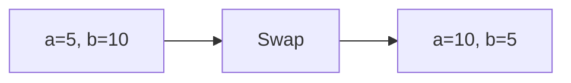

# Language Syntax — Junior Level

## Table of Contents

1. [Introduction](#introduction)
2. [Prerequisites](#prerequisites)
3. [Glossary](#glossary)
4. [Core Concepts](#core-concepts)
5. [Big-O Summary](#big-o-summary)
6. [Real-World Analogies](#real-world-analogies)
7. [Pros & Cons](#pros--cons)
8. [Code Examples](#code-examples)
9. [Coding Patterns](#coding-patterns)
10. [Error Handling](#error-handling)
11. [Performance Tips](#performance-tips)
12. [Best Practices](#best-practices)
13. [Edge Cases & Pitfalls](#edge-cases--pitfalls)
14. [Common Mistakes](#common-mistakes)
15. [Cheat Sheet](#cheat-sheet)
16. [Summary](#summary)
18. [Further Reading](#further-reading)

---

## Introduction

> Focus: "What is it?" and "How to use it?"

Language syntax is the set of rules that define how programs are written in a specific programming language. Just like human languages have grammar rules, programming languages have syntax rules that determine how you write valid instructions for a computer. Understanding syntax is the first step in learning any language — without it, even the simplest program won't compile or run.

In this section, we compare the syntax of **Go**, **Java**, and **Python** — three languages commonly used for solving data structures and algorithms problems.

---

## Prerequisites

- **Required:** Basic understanding of what a program is
- **Required:** A text editor or IDE installed
- **Required:** Go, Java (JDK), and Python installed on your system
- **Helpful:** Experience with any programming language

---

## Glossary

| Term | Definition |
|------|-----------|
| **Syntax** | The set of rules defining the structure of valid statements in a language |
| **Variable** | A named storage location in memory that holds a value |
| **Data Type** | A classification that specifies which type of value a variable can hold |
| **Expression** | A combination of values, variables, and operators that produces a result |
| **Statement** | A single instruction that performs an action |
| **Keyword** | A reserved word with special meaning in the language (e.g., `if`, `for`, `return`) |
| **Identifier** | A name given to a variable, function, class, etc. |
| **Literal** | A fixed value written directly in source code (e.g., `42`, `"hello"`, `true`) |
| **Operator** | A symbol that performs an operation on values (e.g., `+`, `-`, `==`) |
| **Comment** | Text ignored by the compiler/interpreter, used for documentation |

---

## Core Concepts

### Concept 1: Variables and Data Types

Variables are containers for storing data. Each language has its own way of declaring variables and its own set of built-in data types. Go is statically typed with type inference, Java is statically typed with explicit declarations, and Python is dynamically typed.

### Concept 2: Operators

Operators perform actions on values. Arithmetic operators (`+`, `-`, `*`, `/`) work on numbers. Comparison operators (`==`, `!=`, `<`, `>`) compare values and return booleans. Logical operators (`&&`/`and`, `||`/`or`) combine boolean expressions.

### Concept 3: Input/Output

Every program needs to communicate with the outside world. Output displays results to the user, and input reads data from the user. Each language has its own functions/methods for I/O.

### Concept 4: Type Conversion

Sometimes you need to convert one data type to another — for example, turning a string `"42"` into the integer `42`. Each language handles this differently and has different rules about when conversions happen automatically vs. when they must be explicit.

---

## Big-O Summary

| Operation | Complexity | Notes |
|-----------|-----------|-------|
| Variable assignment | O(1) | Constant time — stores value in memory |
| Arithmetic operation | O(1) | Constant time for primitive types |
| String concatenation | O(n) | n = length of resulting string |
| Type conversion | O(1) | For primitive types; O(n) for strings |
| Print to console | O(n) | n = length of output string |

---

## Real-World Analogies

| Concept | Analogy |
|---------|--------|
| **Variable** | A labeled box — you put things in, take them out, and the label tells you what's inside |
| **Data Type** | The shape of the box — a round hole only accepts round pegs (type safety) |
| **Syntax** | Grammar in a language — "I go store" is understood but "store go I" isn't |
| **Type Conversion** | Currency exchange — converting dollars to euros changes the form, not the value |
| **Comments** | Sticky notes on code — the computer ignores them, but humans read them |

> **Where analogies break down:** Variables can hold different values over time (unlike a physical box with a permanent label). Type conversion can lose precision (unlike currency exchange with exact rates).

---

## Pros & Cons

### Go Syntax

| Pros | Cons |
|------|------|
| Clean, minimal syntax | No generics until Go 1.18 |
| Fast compilation | Less expressive than Python |
| Built-in formatting (`gofmt`) | Verbose error handling |

### Java Syntax

| Pros | Cons |
|------|------|
| Strong type safety | Very verbose |
| Huge standard library | Boilerplate code (main class, etc.) |
| Cross-platform (JVM) | Slow startup time |

### Python Syntax

| Pros | Cons |
|------|------|
| Very readable, concise | Slower execution |
| Dynamic typing = faster prototyping | Runtime type errors |
| Huge ecosystem | Indentation-sensitive |

**When to use Go:** Systems programming, microservices, competitive programming (fast execution)
**When to use Java:** Enterprise applications, Android, large codebases
**When to use Python:** Prototyping, data science, scripting, interview prep

---

## Code Examples

### Example 1: Hello World

#### Go

```go
package main

import "fmt"

func main() {
    fmt.Println("Hello, World!")
}
```

#### Java

```java
public class HelloWorld {
    public static void main(String[] args) {
        System.out.println("Hello, World!");
    }
}
```

#### Python

```python
print("Hello, World!")
```

**What it does:** Prints "Hello, World!" to the console.
**Run:** `go run main.go` | `javac HelloWorld.java && java HelloWorld` | `python hello.py`

---

### Example 2: Variables and Data Types

#### Go

```go
package main

import "fmt"

func main() {
    // Explicit type declaration
    var name string = "Alice"
    var age int = 25
    var height float64 = 5.7
    var isStudent bool = true

    // Short declaration (type inference)
    city := "Tokyo"
    score := 95

    fmt.Println(name, age, height, isStudent)
    fmt.Println(city, score)
}
```

#### Java

```java
public class Variables {
    public static void main(String[] args) {
        // Explicit type declaration (required)
        String name = "Alice";
        int age = 25;
        double height = 5.7;
        boolean isStudent = true;

        // var keyword (Java 10+, type inference)
        var city = "Tokyo";
        var score = 95;

        System.out.println(name + " " + age + " " + height + " " + isStudent);
        System.out.println(city + " " + score);
    }
}
```

#### Python

```python
# No type declaration needed (dynamic typing)
name = "Alice"
age = 25
height = 5.7
is_student = True

# Type hints (optional, for documentation)
city: str = "Tokyo"
score: int = 95

print(name, age, height, is_student)
print(city, score)
```

**What it does:** Declares variables of different types and prints them.

---

### Example 3: Arithmetic Operators

#### Go

```go
package main

import "fmt"

func main() {
    a, b := 17, 5

    fmt.Println("Add:      ", a+b)    // 22
    fmt.Println("Subtract: ", a-b)    // 12
    fmt.Println("Multiply: ", a*b)    // 85
    fmt.Println("Divide:   ", a/b)    // 3 (integer division!)
    fmt.Println("Modulo:   ", a%b)    // 2

    // Float division
    fmt.Println("Float div:", float64(a)/float64(b)) // 3.4
}
```

#### Java

```java
public class Operators {
    public static void main(String[] args) {
        int a = 17, b = 5;

        System.out.println("Add:      " + (a + b));    // 22
        System.out.println("Subtract: " + (a - b));    // 12
        System.out.println("Multiply: " + (a * b));    // 85
        System.out.println("Divide:   " + (a / b));    // 3 (integer division!)
        System.out.println("Modulo:   " + (a % b));    // 2

        // Float division
        System.out.println("Float div: " + ((double) a / b)); // 3.4
    }
}
```

#### Python

```python
a, b = 17, 5

print("Add:      ", a + b)     # 22
print("Subtract: ", a - b)     # 12
print("Multiply: ", a * b)     # 85
print("Divide:   ", a / b)     # 3.4 (float division by default!)
print("Floor div:", a // b)    # 3 (integer division)
print("Modulo:   ", a % b)     # 2
print("Power:    ", a ** b)    # 1419857
```

**What it does:** Demonstrates arithmetic operations and the difference between integer and float division.

---

### Example 4: String Operations

#### Go

```go
package main

import (
    "fmt"
    "strings"
)

func main() {
    s := "Hello, World!"

    fmt.Println("Length: ", len(s))                          // 13
    fmt.Println("Upper:  ", strings.ToUpper(s))              // HELLO, WORLD!
    fmt.Println("Lower:  ", strings.ToLower(s))              // hello, world!
    fmt.Println("Contains:", strings.Contains(s, "World"))   // true
    fmt.Println("Replace: ", strings.Replace(s, "World", "Go", 1))
    fmt.Println("Split:  ", strings.Split(s, ", "))          // [Hello World!]

    // String concatenation
    greeting := "Hello" + ", " + "Go!"
    fmt.Println(greeting)

    // Formatted string
    name := "Alice"
    age := 25
    fmt.Printf("%s is %d years old\n", name, age)
}
```

#### Java

```java
public class StringOps {
    public static void main(String[] args) {
        String s = "Hello, World!";

        System.out.println("Length:   " + s.length());            // 13
        System.out.println("Upper:    " + s.toUpperCase());       // HELLO, WORLD!
        System.out.println("Lower:    " + s.toLowerCase());       // hello, world!
        System.out.println("Contains: " + s.contains("World"));   // true
        System.out.println("Replace:  " + s.replace("World", "Java"));
        System.out.println("CharAt:   " + s.charAt(0));           // H
        System.out.println("Substring:" + s.substring(0, 5));     // Hello

        // String concatenation
        String greeting = "Hello" + ", " + "Java!";
        System.out.println(greeting);

        // Formatted string
        String name = "Alice";
        int age = 25;
        System.out.printf("%s is %d years old%n", name, age);
    }
}
```

#### Python

```python
s = "Hello, World!"

print("Length:   ", len(s))              # 13
print("Upper:    ", s.upper())           # HELLO, WORLD!
print("Lower:    ", s.lower())           # hello, world!
print("Contains: ", "World" in s)        # True
print("Replace:  ", s.replace("World", "Python"))
print("Split:    ", s.split(", "))       # ['Hello', 'World!']
print("Strip:    ", "  hi  ".strip())    # hi
print("Slice:    ", s[0:5])              # Hello

# String concatenation
greeting = "Hello" + ", " + "Python!"
print(greeting)

# f-string (formatted string)
name = "Alice"
age = 25
print(f"{name} is {age} years old")
```

**What it does:** Demonstrates common string operations across all 3 languages.

---

### Example 5: Type Conversion

#### Go

```go
package main

import (
    "fmt"
    "strconv"
)

func main() {
    // int <-> float
    x := 42
    y := float64(x)       // int to float
    z := int(y)            // float to int (truncates)
    fmt.Println(x, y, z)  // 42 42.0 42

    // string <-> int
    s := strconv.Itoa(42)           // int to string: "42"
    n, err := strconv.Atoi("42")    // string to int: 42
    fmt.Println(s, n, err)

    // string <-> float
    f, _ := strconv.ParseFloat("3.14", 64)
    sf := strconv.FormatFloat(3.14, 'f', 2, 64)
    fmt.Println(f, sf)
}
```

#### Java

```java
public class TypeConversion {
    public static void main(String[] args) {
        // int <-> double (automatic widening)
        int x = 42;
        double y = x;              // automatic: int to double
        int z = (int) y;           // explicit: double to int (truncates)
        System.out.println(x + " " + y + " " + z);

        // String <-> int
        String s = String.valueOf(42);         // int to String: "42"
        int n = Integer.parseInt("42");        // String to int: 42
        System.out.println(s + " " + n);

        // String <-> double
        double f = Double.parseDouble("3.14");
        String sf = String.format("%.2f", 3.14);
        System.out.println(f + " " + sf);
    }
}
```

#### Python

```python
# int <-> float
x = 42
y = float(x)       # int to float: 42.0
z = int(y)          # float to int: 42 (truncates)
print(x, y, z)

# str <-> int
s = str(42)         # int to str: "42"
n = int("42")       # str to int: 42
print(s, n)

# str <-> float
f = float("3.14")   # str to float: 3.14
sf = f"{3.14:.2f}"  # float to str: "3.14"
print(f, sf)

# Checking types
print(type(x))      # <class 'int'>
print(type(y))      # <class 'float'>
print(type(s))      # <class 'str'>
```

**What it does:** Shows how to convert between types in each language.

---

### Example 6: User Input

#### Go

```go
package main

import (
    "bufio"
    "fmt"
    "os"
    "strconv"
    "strings"
)

func main() {
    reader := bufio.NewReader(os.Stdin)

    fmt.Print("Enter your name: ")
    name, _ := reader.ReadString('\n')
    name = strings.TrimSpace(name)

    fmt.Print("Enter your age: ")
    ageStr, _ := reader.ReadString('\n')
    age, _ := strconv.Atoi(strings.TrimSpace(ageStr))

    fmt.Printf("Hello %s, you are %d years old!\n", name, age)
}
```

#### Java

```java
import java.util.Scanner;

public class UserInput {
    public static void main(String[] args) {
        Scanner scanner = new Scanner(System.in);

        System.out.print("Enter your name: ");
        String name = scanner.nextLine();

        System.out.print("Enter your age: ");
        int age = scanner.nextInt();

        System.out.printf("Hello %s, you are %d years old!%n", name, age);
        scanner.close();
    }
}
```

#### Python

```python
name = input("Enter your name: ")
age = int(input("Enter your age: "))

print(f"Hello {name}, you are {age} years old!")
```

**What it does:** Reads user input from the console and displays it.

---

## Coding Patterns

### Pattern 1: Swap Two Variables

**Intent:** Exchange the values of two variables.

#### Go

```go
a, b := 5, 10
a, b = b, a  // Go supports multiple assignment
fmt.Println(a, b) // 10, 5
```

#### Java

```java
int a = 5, b = 10;
int temp = a;
a = b;
b = temp; // Java needs a temp variable
System.out.println(a + " " + b); // 10 5
```

#### Python

```python
a, b = 5, 10
a, b = b, a  # Python supports tuple unpacking
print(a, b)  # 10 5
```



**Remember:** Go and Python support parallel assignment; Java requires a temp variable.

---

### Pattern 2: Multiple Return Values

**Intent:** Return more than one value from a function.

#### Go

```go
func divide(a, b int) (int, int) {
    return a / b, a % b // quotient and remainder
}

q, r := divide(17, 5)
fmt.Println(q, r) // 3 2
```

#### Java

```java
// Java doesn't support multiple return values directly
// Use an array or a custom class
public static int[] divide(int a, int b) {
    return new int[]{a / b, a % b};
}

int[] result = divide(17, 5);
System.out.println(result[0] + " " + result[1]); // 3 2
```

#### Python

```python
def divide(a, b):
    return a // b, a % b  # returns a tuple

q, r = divide(17, 5)
print(q, r)  # 3 2
```

**Remember:** Go and Python natively support multiple return values; Java uses arrays or objects.

---

## Error Handling

| Error | Language | Cause | Fix |
|-------|----------|-------|-----|
| `undefined: x` | Go | Using undeclared variable | Declare with `var` or `:=` |
| `cannot find symbol` | Java | Using undeclared variable | Declare with type |
| `NameError` | Python | Using undeclared variable | Assign a value first |
| `invalid operation: mismatched types` | Go | Mixing types in expression | Explicit type conversion |
| `incompatible types` | Java | Assigning wrong type | Cast or convert |
| `TypeError` | Python | Invalid operation between types | Use `int()`, `str()`, etc. |
| `strconv.Atoi: parsing "abc"` | Go | Invalid string to int | Validate input first |
| `NumberFormatException` | Java | Invalid string to int | Use try-catch |
| `ValueError` | Python | Invalid string to int | Use try-except |

---

## Performance Tips

- **String concatenation in loops:** Use `strings.Builder` (Go), `StringBuilder` (Java), `"".join()` (Python) — not `+` repeatedly
- **Integer division:** Be aware that Go and Java truncate by default; Python's `/` returns float
- **Type conversions** are O(1) for primitives but O(n) for strings — avoid unnecessary conversions in loops

---

## Best Practices

- Use meaningful variable names (`studentAge` not `x`)
- Follow language conventions:
  - **Go:** `camelCase` for private, `PascalCase` for exported
  - **Java:** `camelCase` for variables/methods, `PascalCase` for classes
  - **Python:** `snake_case` for variables/functions, `PascalCase` for classes
- Always handle type conversion errors
- Use comments sparingly — code should be self-documenting

---

## Edge Cases & Pitfalls

- **Integer overflow:** Go and Java wrap around silently; Python handles big integers natively
- **Division by zero:** All 3 languages throw errors — always check before dividing
- **Floating point precision:** `0.1 + 0.2 != 0.3` in all 3 languages — use `math.Abs(a-b) < epsilon` for comparison
- **Empty string:** `""` is valid — check with `len(s) == 0` or `s == ""`
- **Null/nil/None:** Go has `nil`, Java has `null`, Python has `None` — different default behaviors

---

## Common Mistakes

| Mistake | Language | Example | Fix |
|---------|----------|---------|-----|
| Using `=` instead of `==` | All | `if x = 5` | Use `if x == 5` |
| Integer division surprise | Go, Java | `7/2 = 3` not `3.5` | Cast to float first |
| Forgetting `main` class | Java | No `public static void main` | Always include entry point |
| Indentation errors | Python | Mixed tabs and spaces | Use 4 spaces consistently |
| Unused variables | Go | Declared but not used | Go compiler rejects this — use `_` or remove |
| String immutability | All 3 | Trying to modify string in-place | Create a new string |

---

## Cheat Sheet

### Variable Declaration

| Language | Syntax | Example |
|----------|--------|---------|
| Go | `var x int = 5` or `x := 5` | `name := "Alice"` |
| Java | `int x = 5;` | `String name = "Alice";` |
| Python | `x = 5` | `name = "Alice"` |

### Print

| Language | Syntax |
|----------|--------|
| Go | `fmt.Println(x)` / `fmt.Printf("%d\n", x)` |
| Java | `System.out.println(x)` / `System.out.printf("%d%n", x)` |
| Python | `print(x)` / `print(f"{x}")` |

### Type Conversion

| Conversion | Go | Java | Python |
|-----------|-----|------|--------|
| int → float | `float64(x)` | `(double) x` | `float(x)` |
| float → int | `int(x)` | `(int) x` | `int(x)` |
| int → string | `strconv.Itoa(x)` | `String.valueOf(x)` | `str(x)` |
| string → int | `strconv.Atoi(s)` | `Integer.parseInt(s)` | `int(s)` |

### Operators

| Operator | Go | Java | Python |
|----------|-----|------|--------|
| Add | `+` | `+` | `+` |
| Subtract | `-` | `-` | `-` |
| Multiply | `*` | `*` | `*` |
| Divide (int) | `/` | `/` | `//` |
| Divide (float) | `float64(a)/float64(b)` | `(double)a/b` | `/` |
| Modulo | `%` | `%` | `%` |
| Power | `math.Pow(a,b)` | `Math.pow(a,b)` | `**` |
| Equal | `==` | `==` | `==` |
| Not equal | `!=` | `!=` | `!=` |
| And | `&&` | `&&` | `and` |
| Or | `\|\|` | `\|\|` | `or` |
| Not | `!` | `!` | `not` |

---

## Summary

Language syntax is the foundation of all programming. Go emphasizes simplicity and explicitness, Java provides strong type safety with verbose syntax, and Python prioritizes readability and conciseness. Understanding how each language handles variables, types, operators, and I/O is essential before diving into data structures and algorithms.

---

## Further Reading

- **Go:** [A Tour of Go](https://go.dev/tour/) — official interactive tutorial
- **Java:** [Oracle Java Tutorials](https://docs.oracle.com/javase/tutorial/) — comprehensive guide
- **Python:** [Python Official Tutorial](https://docs.python.org/3/tutorial/) — beginner-friendly
- **Go:** `fmt`, `strconv`, `strings` package docs
- **Java:** `java.lang.String`, `java.lang.Integer` class docs
- **Python:** Built-in functions docs (`print`, `input`, `int`, `str`, `float`)
