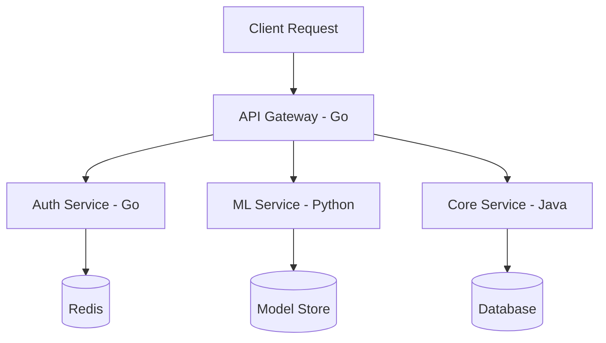

# Language Syntax — Senior Level

## Table of Contents

1. [Introduction](#introduction)
2. [System Design with Language Syntax](#system-design)
3. [Compiler and Runtime Internals](#compiler-and-runtime-internals)
4. [Memory Management Deep Dive](#memory-management-deep-dive)
5. [Concurrency Primitives](#concurrency-primitives)
6. [Code Examples](#code-examples)
7. [Observability](#observability)
8. [Failure Modes](#failure-modes)
9. [Summary](#summary)

---

## Introduction

> Focus: "How do language internals affect system architecture?"

At the senior level, you understand how syntax maps to machine instructions, how the runtime manages memory, and how to choose a language based on system constraints like latency, throughput, and resource budgets.

---

## System Design with Language Syntax

### Language Selection for System Components



| Component | Best Language | Why |
|-----------|-------------|-----|
| API Gateway | Go | Low latency, small memory footprint, goroutines |
| Core Business Logic | Java | Mature ecosystem, strong typing, JVM optimization |
| ML Pipeline | Python | NumPy/Pandas ecosystem, rapid prototyping |
| CLI Tools | Go | Single binary, fast startup, cross-compilation |
| Data Processing | Java/Go | JVM for Spark; Go for streaming pipelines |
| Scripting/Glue | Python | Quick iteration, rich libraries |

---

## Compiler and Runtime Internals

### How Code Becomes Execution

#### Go Compilation Pipeline

```text
Source (.go)
    ↓ Lexer (tokens)
    ↓ Parser (AST)
    ↓ Type Checker
    ↓ SSA (Static Single Assignment)
    ↓ Optimization passes
    ↓ Machine code generation
    ↓ Linker
Native Binary (.exe)
```

#### Java Compilation Pipeline

```text
Source (.java)
    ↓ javac (compiler)
Bytecode (.class)
    ↓ ClassLoader
    ↓ Bytecode Verifier
    ↓ JIT Compiler (HotSpot)
    ↓ C1 (quick compile) → C2 (optimized compile)
Native Code (in memory)
```

#### Python Execution Pipeline

```text
Source (.py)
    ↓ Lexer + Parser
    ↓ AST
    ↓ Compiler
Bytecode (.pyc)
    ↓ CPython VM (interpreter loop)
    ↓ Each opcode dispatched via switch/computed goto
Execution (one bytecode at a time)
```

### Escape Analysis (Go)

```go
package main

// Stack allocation — does NOT escape
func stackAlloc() int {
    x := 42    // stays on stack — fast, no GC pressure
    return x
}

// Heap allocation — escapes
func heapAlloc() *int {
    x := 42    // escapes to heap — returned as pointer
    return &x  // GC must track this
}

// Check with: go build -gcflags="-m" main.go
// Output: "moved to heap: x" for heapAlloc
```

### JIT Warm-up (Java)

```java
public class JITDemo {
    // First ~10,000 calls: interpreted (slow)
    // After threshold: JIT compiles to native (fast)
    // C1 compiler: quick compilation, moderate optimization
    // C2 compiler: slow compilation, aggressive optimization

    public static int compute(int n) {
        int sum = 0;
        for (int i = 0; i < n; i++) {
            sum += i;
        }
        return sum;
    }

    public static void main(String[] args) {
        // Warm up JIT
        for (int i = 0; i < 100_000; i++) {
            compute(1000);
        }

        // Now measure — should be much faster
        long start = System.nanoTime();
        for (int i = 0; i < 1_000_000; i++) {
            compute(1000);
        }
        long elapsed = System.nanoTime() - start;
        System.out.printf("After warmup: %.2f ns/call%n", elapsed / 1_000_000.0);
    }
}
```

---

## Memory Management Deep Dive

### Garbage Collection Comparison

| Aspect | Go GC | Java GC (G1) | Python GC |
|--------|-------|---------------|-----------|
| Algorithm | Concurrent tri-color mark-sweep | Generational (Young + Old) | Reference counting + cycle collector |
| Pause time | < 1ms (target) | 10-200ms (configurable) | ~10ms per cycle collection |
| Throughput | Moderate | High (with tuning) | Low |
| Tuning | `GOGC` env var | Dozens of JVM flags | `gc.set_threshold()` |
| Predictability | Very predictable | Needs tuning | Predictable for non-cyclic |

### Go Memory Profiling

```go
package main

import (
    "fmt"
    "runtime"
)

func main() {
    var m runtime.MemStats

    // Before allocation
    runtime.ReadMemStats(&m)
    fmt.Printf("Before: Alloc=%d KB, NumGC=%d\n", m.Alloc/1024, m.NumGC)

    // Allocate 1M integers
    data := make([]int, 1_000_000)
    for i := range data {
        data[i] = i
    }

    runtime.ReadMemStats(&m)
    fmt.Printf("After:  Alloc=%d KB, NumGC=%d\n", m.Alloc/1024, m.NumGC)

    // Force GC
    runtime.GC()
    runtime.ReadMemStats(&m)
    fmt.Printf("GC'd:   Alloc=%d KB, NumGC=%d\n", m.Alloc/1024, m.NumGC)
}
```

### Java Memory Profiling

```java
public class MemoryProfile {
    public static void main(String[] args) {
        Runtime runtime = Runtime.getRuntime();

        System.out.printf("Before: Used=%d KB%n",
            (runtime.totalMemory() - runtime.freeMemory()) / 1024);

        // Allocate 1M integers
        int[] data = new int[1_000_000];
        for (int i = 0; i < data.length; i++) {
            data[i] = i;
        }

        System.out.printf("After:  Used=%d KB%n",
            (runtime.totalMemory() - runtime.freeMemory()) / 1024);

        // Force GC
        data = null;
        System.gc();
        System.out.printf("GC'd:   Used=%d KB%n",
            (runtime.totalMemory() - runtime.freeMemory()) / 1024);
    }
}
```

### Python Memory Profiling

```python
import sys
import gc

# Before allocation
gc_stats = gc.get_stats()
print(f"GC collections: {[s['collections'] for s in gc_stats]}")

# Object size
x = 42
s = "hello"
lst = [1, 2, 3]
print(f"int:  {sys.getsizeof(x)} bytes")   # 28 bytes
print(f"str:  {sys.getsizeof(s)} bytes")   # 54 bytes
print(f"list: {sys.getsizeof(lst)} bytes") # 88 bytes (just the container)

# Reference counting
a = [1, 2, 3]
print(f"refcount: {sys.getrefcount(a)}")  # 2 (a + getrefcount arg)
b = a
print(f"refcount: {sys.getrefcount(a)}")  # 3
del b
print(f"refcount: {sys.getrefcount(a)}")  # 2

# Force GC
gc.collect()
print(f"GC collections: {[s['collections'] for s in gc.get_stats()]}")
```

---

## Concurrency Primitives

### Concurrency Model Comparison

| Aspect | Go (goroutines) | Java (threads) | Python (threading) |
|--------|----------------|---------------|-------------------|
| Model | M:N (goroutines on OS threads) | 1:1 (Java thread = OS thread) | 1:1 but GIL limits parallelism |
| Stack size | 2 KB initial (grows) | ~1 MB fixed | ~8 MB (OS default) |
| Max concurrent | Millions | Thousands | Hundreds |
| True parallelism | Yes | Yes | No (GIL) — use `multiprocessing` |
| Communication | Channels | `BlockingQueue`, locks | `Queue`, locks |

#### Go — Goroutines + Channels

```go
package main

import (
    "fmt"
    "sync"
)

func main() {
    // WaitGroup for synchronization
    var wg sync.WaitGroup
    results := make(chan int, 10)

    // Launch goroutines
    for i := 0; i < 10; i++ {
        wg.Add(1)
        go func(n int) {
            defer wg.Done()
            results <- n * n
        }(i)
    }

    // Close channel after all goroutines done
    go func() {
        wg.Wait()
        close(results)
    }()

    // Read results
    for r := range results {
        fmt.Println(r)
    }
}
```

#### Java — Virtual Threads (Java 21+)

```java
import java.util.concurrent.*;
import java.util.List;
import java.util.ArrayList;

public class ConcurrencyDemo {
    public static void main(String[] args) throws Exception {
        // Virtual threads (Java 21+) — lightweight like goroutines
        List<Future<Integer>> futures = new ArrayList<>();

        try (var executor = Executors.newVirtualThreadPerTaskExecutor()) {
            for (int i = 0; i < 10; i++) {
                final int n = i;
                futures.add(executor.submit(() -> n * n));
            }

            for (Future<Integer> f : futures) {
                System.out.println(f.get());
            }
        }
    }
}
```

#### Python — asyncio + multiprocessing

```python
import asyncio
from multiprocessing import Pool

# asyncio for I/O-bound concurrency
async def compute(n):
    await asyncio.sleep(0.01)  # simulate I/O
    return n * n

async def main_async():
    tasks = [compute(i) for i in range(10)]
    results = await asyncio.gather(*tasks)
    print(results)

asyncio.run(main_async())

# multiprocessing for CPU-bound parallelism (bypasses GIL)
def square(n):
    return n * n

with Pool(4) as pool:
    results = pool.map(square, range(10))
    print(results)
```

---

## Code Examples

### Production-Grade Hash Map Implementation

#### Go

```go
package main

import (
    "fmt"
    "hash/fnv"
    "sync"
)

type ConcurrentMap struct {
    shards    [16]shard
    shardMask uint32
}

type shard struct {
    mu    sync.RWMutex
    items map[string]interface{}
}

func NewConcurrentMap() *ConcurrentMap {
    m := &ConcurrentMap{shardMask: 15}
    for i := range m.shards {
        m.shards[i].items = make(map[string]interface{})
    }
    return m
}

func (m *ConcurrentMap) getShard(key string) *shard {
    h := fnv.New32a()
    h.Write([]byte(key))
    return &m.shards[h.Sum32()&m.shardMask]
}

func (m *ConcurrentMap) Set(key string, val interface{}) {
    s := m.getShard(key)
    s.mu.Lock()
    s.items[key] = val
    s.mu.Unlock()
}

func (m *ConcurrentMap) Get(key string) (interface{}, bool) {
    s := m.getShard(key)
    s.mu.RLock()
    val, ok := s.items[key]
    s.mu.RUnlock()
    return val, ok
}

func main() {
    m := NewConcurrentMap()
    m.Set("key1", "value1")
    v, _ := m.Get("key1")
    fmt.Println(v)
}
```

#### Java

```java
import java.util.concurrent.ConcurrentHashMap;

public class ConcurrentMapDemo {
    public static void main(String[] args) {
        // Java has built-in ConcurrentHashMap — lock striping internally
        var map = new ConcurrentHashMap<String, String>();

        // Thread-safe operations
        map.put("key1", "value1");
        map.computeIfAbsent("key2", k -> "computed_" + k);
        map.merge("key1", "_updated", String::concat);

        System.out.println(map.get("key1")); // value1_updated
        System.out.println(map.get("key2")); // computed_key2

        // Atomic operations
        map.compute("counter", (k, v) -> v == null ? "1" : String.valueOf(Integer.parseInt(v) + 1));
    }
}
```

#### Python

```python
from collections import defaultdict
from threading import Lock

class ConcurrentDict:
    """Thread-safe dictionary with shard-based locking."""

    def __init__(self, num_shards=16):
        self._shards = [{"lock": Lock(), "data": {}} for _ in range(num_shards)]
        self._num_shards = num_shards

    def _get_shard(self, key):
        return self._shards[hash(key) % self._num_shards]

    def set(self, key, value):
        shard = self._get_shard(key)
        with shard["lock"]:
            shard["data"][key] = value

    def get(self, key, default=None):
        shard = self._get_shard(key)
        with shard["lock"]:
            return shard["data"].get(key, default)

m = ConcurrentDict()
m.set("key1", "value1")
print(m.get("key1"))
```

---

## Observability

### Profiling Commands

| Language | CPU Profile | Memory Profile | Trace |
|----------|-----------|---------------|-------|
| Go | `go tool pprof cpu.prof` | `go tool pprof mem.prof` | `go tool trace trace.out` |
| Java | `jfr` / VisualVM / `async-profiler` | `jmap -heap PID` | JFR events |
| Python | `cProfile` / `py-spy` | `tracemalloc` / `memory_profiler` | `viztracer` |

### Go pprof

```go
import (
    "net/http"
    _ "net/http/pprof"
)

func main() {
    go func() {
        http.ListenAndServe(":6060", nil)
    }()
    // Visit http://localhost:6060/debug/pprof/
}
```

---

## Failure Modes

| Failure | Go | Java | Python |
|---------|-----|------|--------|
| OOM | Process killed by OS | `OutOfMemoryError` | `MemoryError` |
| Stack overflow | goroutine stack grows (rarely hits) | `StackOverflowError` | `RecursionError` (default limit 1000) |
| Deadlock | Go runtime detects some cases | JVM doesn't detect | No built-in detection |
| Data race | `-race` flag detects at runtime | FindBugs / SpotBugs | No built-in tool (GIL hides some) |

---

## Summary

At the senior level, language syntax knowledge expands to compiler internals, memory management, and concurrency models. Choose Go for low-latency services, Java for high-throughput enterprise systems, and Python for rapid ML prototyping. Understand GC behavior, escape analysis, and JIT compilation to make informed architectural decisions.
