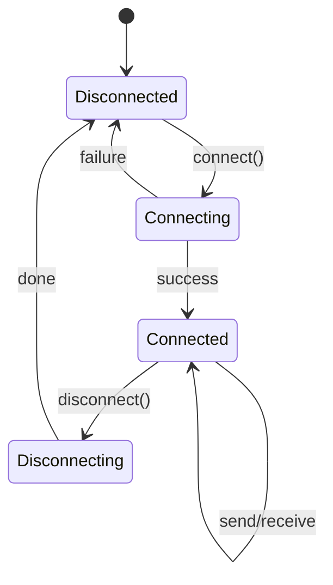

# Control Structures — Senior Level

## Table of Contents

1. [Introduction](#introduction)
2. [Concurrency Control Structures](#concurrency-control-structures)
3. [State Machines](#state-machines)
4. [Backpressure and Flow Control](#backpressure-and-flow-control)
5. [Code Examples](#code-examples)
6. [Summary](#summary)

---

## Introduction

> Focus: "How do control structures scale in concurrent, distributed systems?"

At the senior level, control structures extend to concurrent programming: goroutine coordination with select, thread synchronization patterns, event loops, and state machines for complex workflows.

---

## Concurrency Control Structures

### Go — select (Multiplexed Channel Control)

```go
package main

import (
    "context"
    "fmt"
    "time"
)

func main() {
    ch1 := make(chan string)
    ch2 := make(chan string)
    ctx, cancel := context.WithTimeout(context.Background(), 3*time.Second)
    defer cancel()

    go func() { time.Sleep(1 * time.Second); ch1 <- "result from service A" }()
    go func() { time.Sleep(2 * time.Second); ch2 <- "result from service B" }()

    for i := 0; i < 2; i++ {
        select {
        case msg := <-ch1:
            fmt.Println("Got:", msg)
        case msg := <-ch2:
            fmt.Println("Got:", msg)
        case <-ctx.Done():
            fmt.Println("Timeout!")
            return
        }
    }
}
```

### Java — CompletableFuture Composition

```java
import java.util.concurrent.*;

public class AsyncControl {
    public static void main(String[] args) throws Exception {
        var serviceA = CompletableFuture.supplyAsync(() -> {
            sleep(1000);
            return "result from service A";
        });
        var serviceB = CompletableFuture.supplyAsync(() -> {
            sleep(2000);
            return "result from service B";
        });

        // Wait for first to complete
        var first = CompletableFuture.anyOf(serviceA, serviceB);
        System.out.println("First: " + first.get());

        // Wait for all
        CompletableFuture.allOf(serviceA, serviceB).join();
        System.out.println("A: " + serviceA.get());
        System.out.println("B: " + serviceB.get());
    }

    static void sleep(long ms) {
        try { Thread.sleep(ms); } catch (InterruptedException e) {}
    }
}
```

### Python — asyncio Event Loop

```python
import asyncio

async def service_a():
    await asyncio.sleep(1)
    return "result from service A"

async def service_b():
    await asyncio.sleep(2)
    return "result from service B"

async def main():
    # Wait for first to complete
    done, pending = await asyncio.wait(
        [asyncio.create_task(service_a()), asyncio.create_task(service_b())],
        return_when=asyncio.FIRST_COMPLETED
    )
    for task in done:
        print(f"First: {task.result()}")
    for task in pending:
        task.cancel()

    # Wait for all
    results = await asyncio.gather(service_a(), service_b())
    print(f"All: {results}")

asyncio.run(main())
```

---

## State Machines

### Connection State Machine



#### Go

```go
type State int

const (
    Disconnected State = iota
    Connecting
    Connected
    Disconnecting
)

type Connection struct {
    state State
}

func (c *Connection) Handle(event string) error {
    switch c.state {
    case Disconnected:
        if event == "connect" {
            c.state = Connecting
            // initiate connection...
            c.state = Connected
            return nil
        }
    case Connected:
        switch event {
        case "send":
            // send data
            return nil
        case "disconnect":
            c.state = Disconnecting
            // cleanup...
            c.state = Disconnected
            return nil
        }
    }
    return fmt.Errorf("invalid event %q in state %d", event, c.state)
}
```

#### Java

```java
enum State { DISCONNECTED, CONNECTING, CONNECTED, DISCONNECTING }

class Connection {
    private State state = State.DISCONNECTED;

    public void handle(String event) {
        state = switch (state) {
            case DISCONNECTED -> {
                if ("connect".equals(event)) yield State.CONNECTED;
                else throw new IllegalStateException("Invalid: " + event);
            }
            case CONNECTED -> switch (event) {
                case "send" -> State.CONNECTED;
                case "disconnect" -> State.DISCONNECTED;
                default -> throw new IllegalStateException("Invalid: " + event);
            };
            default -> throw new IllegalStateException("Invalid state: " + state);
        };
    }
}
```

#### Python

```python
from enum import Enum

class State(Enum):
    DISCONNECTED = "disconnected"
    CONNECTING = "connecting"
    CONNECTED = "connected"
    DISCONNECTING = "disconnecting"

class Connection:
    def __init__(self):
        self.state = State.DISCONNECTED
        self._transitions = {
            State.DISCONNECTED: {"connect": State.CONNECTED},
            State.CONNECTED: {"send": State.CONNECTED, "disconnect": State.DISCONNECTED},
        }

    def handle(self, event):
        valid = self._transitions.get(self.state, {})
        if event not in valid:
            raise ValueError(f"Invalid event '{event}' in state {self.state}")
        self.state = valid[event]
```

---

## Backpressure and Flow Control

### Producer-Consumer with Bounded Buffer

#### Go

```go
func producer(ch chan<- int, count int) {
    for i := 0; i < count; i++ {
        ch <- i  // blocks if channel is full (backpressure)
    }
    close(ch)
}

func consumer(ch <-chan int, done chan<- bool) {
    for val := range ch {
        time.Sleep(10 * time.Millisecond)  // slow consumer
        fmt.Println("consumed:", val)
    }
    done <- true
}

func main() {
    ch := make(chan int, 10)   // buffer size = backpressure threshold
    done := make(chan bool)
    go producer(ch, 100)
    go consumer(ch, done)
    <-done
}
```

#### Java

```java
import java.util.concurrent.*;

public class ProducerConsumer {
    public static void main(String[] args) throws Exception {
        BlockingQueue<Integer> queue = new ArrayBlockingQueue<>(10);

        // Producer
        var producer = new Thread(() -> {
            for (int i = 0; i < 100; i++) {
                try { queue.put(i); } catch (InterruptedException e) { break; }
            }
        });

        // Consumer
        var consumer = new Thread(() -> {
            for (int i = 0; i < 100; i++) {
                try {
                    int val = queue.take();
                    Thread.sleep(10);
                    System.out.println("consumed: " + val);
                } catch (InterruptedException e) { break; }
            }
        });

        producer.start(); consumer.start();
        producer.join(); consumer.join();
    }
}
```

#### Python

```python
import asyncio

async def producer(queue, count):
    for i in range(count):
        await queue.put(i)  # blocks if queue is full
    await queue.put(None)   # sentinel

async def consumer(queue):
    while True:
        val = await queue.get()
        if val is None:
            break
        await asyncio.sleep(0.01)
        print(f"consumed: {val}")

async def main():
    queue = asyncio.Queue(maxsize=10)
    await asyncio.gather(producer(queue, 100), consumer(queue))

asyncio.run(main())
```

---

## Code Examples

### Circuit Breaker Pattern

#### Go

```go
type CircuitBreaker struct {
    mu           sync.Mutex
    failures     int
    threshold    int
    state        string  // "closed", "open", "half-open"
    lastFailTime time.Time
    timeout      time.Duration
}

func (cb *CircuitBreaker) Call(fn func() error) error {
    cb.mu.Lock()
    defer cb.mu.Unlock()

    switch cb.state {
    case "open":
        if time.Since(cb.lastFailTime) > cb.timeout {
            cb.state = "half-open"
        } else {
            return errors.New("circuit breaker is open")
        }
    }

    err := fn()
    if err != nil {
        cb.failures++
        cb.lastFailTime = time.Now()
        if cb.failures >= cb.threshold {
            cb.state = "open"
        }
        return err
    }

    cb.failures = 0
    cb.state = "closed"
    return nil
}
```

---

## Summary

At the senior level, control structures include concurrency primitives (`select`, `CompletableFuture`, `asyncio`), state machines for complex workflows, and backpressure mechanisms for flow control. These patterns are essential for building reliable, scalable systems.
