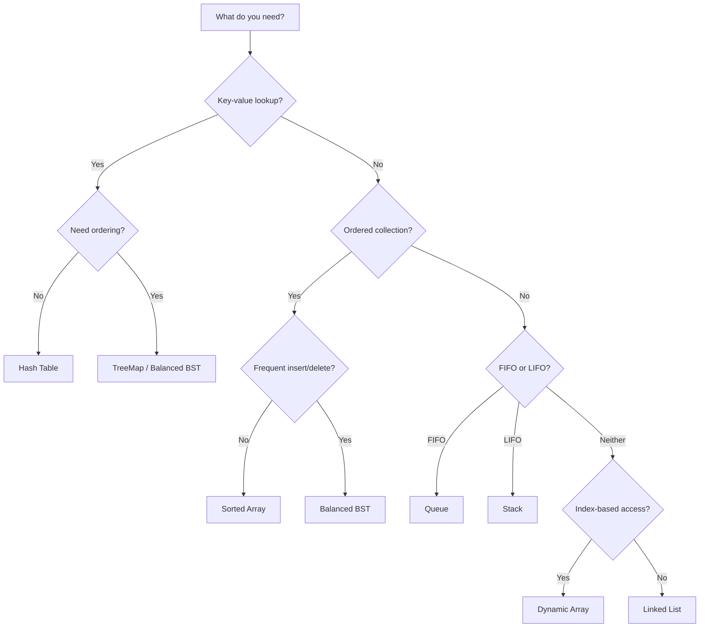
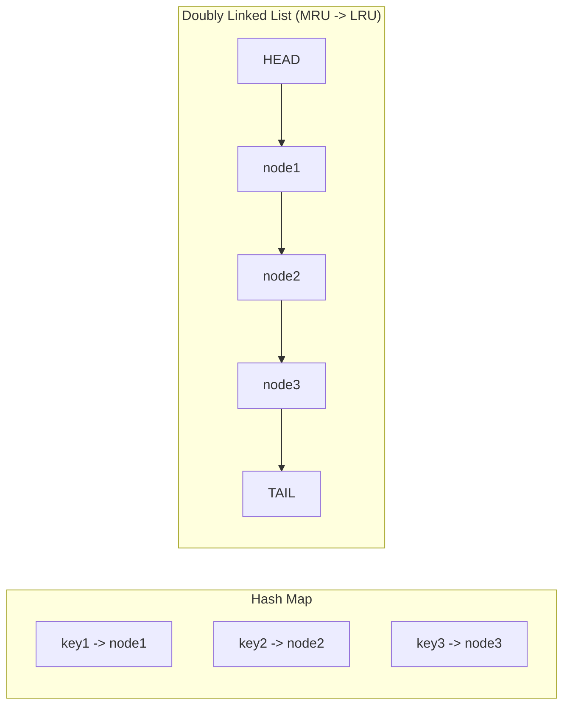
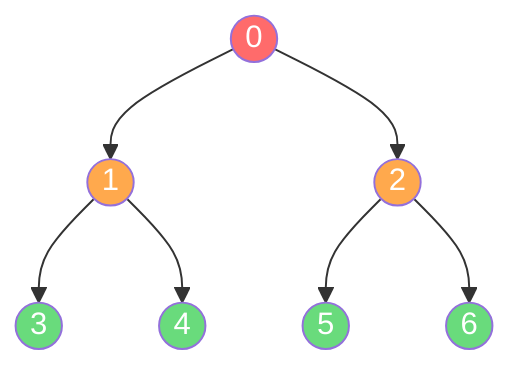

# What are Data Structures? — Middle Level

## Table of Contents

1. [Introduction](#introduction)
2. [Deeper Concepts](#deeper-concepts)
3. [Comparison with Alternatives](#comparison-with-alternatives)
4. [Advanced Patterns](#advanced-patterns)
5. [Graph and Tree Applications](#graph-and-tree-applications)
6. [Dynamic Programming Integration](#dynamic-programming-integration)
7. [Code Examples](#code-examples)
8. [Error Handling](#error-handling)
9. [Performance Analysis](#performance-analysis)
10. [Best Practices](#best-practices)
11. [Summary](#summary)

---

## Introduction

At the beginner level, we learned **what** data structures are. Now we ask the harder questions: **why** does a particular data structure exist, and **when** should you choose one over another?

Every data structure is a contract. It maintains **invariants** — properties that remain true after every operation. A sorted array guarantees elements stay in order. A balanced BST guarantees the height stays logarithmic. A hash table guarantees average constant-time lookups by distributing keys across buckets.

When you pick a data structure, you are choosing which invariants matter for your problem:

| Problem Requirement | Invariant Needed | Best DS |
|---|---|---|
| Fast lookup by key | O(1) average access | Hash Table |
| Ordered traversal | Sorted invariant | BST / Sorted Array |
| FIFO processing | Insertion order preserved | Queue |
| LIFO processing | Last-in-first-out | Stack |
| Fast insert/delete at arbitrary positions | O(1) pointer manipulation | Linked List |
| Priority-based processing | Heap property (parent <= children) | Min/Max Heap |
| Relationship modeling | Adjacency preservation | Graph |

Understanding these invariants is the key to making correct choices under real constraints — memory, latency, concurrency, and data volume.

---

## Deeper Concepts

### Memory Models: Stack vs Heap

The **stack** is a contiguous region of memory used for function call frames and local variables. Allocation and deallocation are instant (just moving a pointer). The **heap** is a large pool where dynamically-sized objects live; allocation requires finding free space and deallocation requires garbage collection or manual freeing.

| Property | Stack | Heap |
|---|---|---|
| Allocation speed | Very fast (pointer bump) | Slower (search for free block) |
| Deallocation | Automatic on function return | GC or manual free |
| Size limit | Small (typically 1-8 MB) | Large (limited by RAM) |
| Access pattern | LIFO only | Random access |
| Fragmentation | None | Possible |

**Why this matters for data structures:**
- Arrays of primitives on the stack are cache-friendly and fast.
- Linked lists allocate each node on the heap, causing scattered memory access.
- Hash tables use a contiguous bucket array (cache-friendly) but may chain to heap-allocated nodes on collision.

### Cache Locality

Modern CPUs do not fetch individual bytes from RAM. They fetch **cache lines** (typically 64 bytes). When you access one element in an array, the next several elements are already in the L1 cache.

```
Array (contiguous):    [A][B][C][D][E][F][G][H]  --> one cache line fetch
                        ^                    ^
                        access A, get B-H for free

Linked List (scattered): [A]-->[C]------>[F]-->[B]
                          ^     ^          ^     ^
                          miss  miss       miss  miss
```

**Cache miss penalty:** Accessing L1 cache takes ~1 ns. Accessing main RAM takes ~100 ns. That is a 100x difference. A linked list with 1 million nodes can be 10-50x slower than an array for sequential traversal purely due to cache misses.

### Contiguous vs Linked Memory

| Property | Contiguous (Array) | Linked (Linked List) |
|---|---|---|
| Memory layout | Sequential addresses | Scattered across heap |
| Cache performance | Excellent | Poor |
| Insert at beginning | O(n) — shift all elements | O(1) — update pointers |
| Insert at end | O(1) amortized | O(1) with tail pointer |
| Random access | O(1) by index | O(n) — must traverse |
| Memory overhead | None beyond data | Pointer per node (8 bytes on 64-bit) |
| Resize cost | O(n) copy to new array | None — just add nodes |

### Amortized Guarantees

Some operations are expensive occasionally but cheap on average. This is called **amortized analysis**.

**Example: Dynamic Array (ArrayList / slice / list)**

When the backing array is full and you append an element:
1. Allocate a new array of 2x the current capacity.
2. Copy all existing elements — O(n).
3. Insert the new element — O(1).

This doubling happens rarely. Over n insertions, the total cost of all copies is:

```
1 + 2 + 4 + 8 + ... + n = 2n - 1
```

So the **amortized cost per insertion is O(1)**, even though a single insertion can cost O(n).

**Key amortized guarantees by data structure:**

| Data Structure | Operation | Worst Case | Amortized |
|---|---|---|---|
| Dynamic Array | Append | O(n) | O(1) |
| Hash Table | Insert | O(n) rehash | O(1) |
| Splay Tree | Search | O(n) | O(log n) |
| Union-Find | Find | O(log n) | O(alpha(n)) ~ O(1) |

---

## Comparison with Alternatives

### Comprehensive Data Structure Comparison

| Data Structure | Insert (Avg) | Insert (Worst) | Search (Avg) | Search (Worst) | Delete (Avg) | Delete (Worst) | Space | Stable? | Best For |
|---|---|---|---|---|---|---|---|---|---|
| Array | O(n) | O(n) | O(n) | O(n) | O(n) | O(n) | O(n) | Yes | Index-based access, iteration |
| Sorted Array | O(n) | O(n) | O(log n) | O(log n) | O(n) | O(n) | O(n) | Yes | Binary search, sorted data |
| Linked List | O(1)* | O(1)* | O(n) | O(n) | O(1)* | O(1)* | O(n) | Yes | Frequent insert/delete at known positions |
| Hash Table | O(1) | O(n) | O(1) | O(n) | O(1) | O(n) | O(n) | No | Key-value lookups |
| BST (balanced) | O(log n) | O(log n) | O(log n) | O(log n) | O(log n) | O(log n) | O(n) | No | Ordered operations, range queries |
| BST (unbalanced) | O(log n) | O(n) | O(log n) | O(n) | O(log n) | O(n) | O(n) | No | Avoid — use balanced variant |
| Heap | O(log n) | O(log n) | O(n) | O(n) | O(log n) | O(log n) | O(n) | No | Priority queue, top-K |
| Graph (adj list) | O(1) | O(1) | O(V+E) | O(V+E) | O(E) | O(E) | O(V+E) | N/A | Relationships, networks, paths |
| Trie | O(m) | O(m) | O(m) | O(m) | O(m) | O(m) | O(ALPHABET*m*n) | Yes | Prefix matching, autocomplete |

*\* O(1) when position is already known (have reference to node).*

### Decision Flowchart



---

## Advanced Patterns

### LRU Cache: HashMap + Doubly Linked List

An LRU (Least Recently Used) cache combines two data structures:
- **Hash Map** for O(1) lookup by key.
- **Doubly Linked List** for O(1) eviction of the least recently used item.

The invariant: the most recently accessed item is at the front of the list; the least recently accessed is at the back.



**Go:**

```go
package main

import "fmt"

type Node struct {
	key, value int
	prev, next *Node
}

type LRUCache struct {
	capacity int
	cache    map[int]*Node
	head     *Node // dummy head (MRU side)
	tail     *Node // dummy tail (LRU side)
}

func NewLRUCache(capacity int) *LRUCache {
	head := &Node{}
	tail := &Node{}
	head.next = tail
	tail.prev = head
	return &LRUCache{
		capacity: capacity,
		cache:    make(map[int]*Node),
		head:     head,
		tail:     tail,
	}
}

func (c *LRUCache) removeNode(node *Node) {
	node.prev.next = node.next
	node.next.prev = node.prev
}

func (c *LRUCache) addToFront(node *Node) {
	node.next = c.head.next
	node.prev = c.head
	c.head.next.prev = node
	c.head.next = node
}

func (c *LRUCache) Get(key int) int {
	if node, ok := c.cache[key]; ok {
		c.removeNode(node)
		c.addToFront(node)
		return node.value
	}
	return -1
}

func (c *LRUCache) Put(key, value int) {
	if node, ok := c.cache[key]; ok {
		node.value = value
		c.removeNode(node)
		c.addToFront(node)
		return
	}

	node := &Node{key: key, value: value}
	c.cache[key] = node
	c.addToFront(node)

	if len(c.cache) > c.capacity {
		lru := c.tail.prev
		c.removeNode(lru)
		delete(c.cache, lru.key)
	}
}

func main() {
	cache := NewLRUCache(3)
	cache.Put(1, 10)
	cache.Put(2, 20)
	cache.Put(3, 30)
	fmt.Println(cache.Get(1)) // 10 — moves key 1 to front
	cache.Put(4, 40)          // evicts key 2 (least recently used)
	fmt.Println(cache.Get(2)) // -1 — evicted
	fmt.Println(cache.Get(3)) // 30
}
```

**Java:**

```java
import java.util.HashMap;
import java.util.Map;

public class LRUCache {
    private static class Node {
        int key, value;
        Node prev, next;
        Node(int key, int value) {
            this.key = key;
            this.value = value;
        }
        Node() {} // dummy node
    }

    private final int capacity;
    private final Map<Integer, Node> cache;
    private final Node head; // dummy head (MRU side)
    private final Node tail; // dummy tail (LRU side)

    public LRUCache(int capacity) {
        this.capacity = capacity;
        this.cache = new HashMap<>();
        this.head = new Node();
        this.tail = new Node();
        head.next = tail;
        tail.prev = head;
    }

    private void removeNode(Node node) {
        node.prev.next = node.next;
        node.next.prev = node.prev;
    }

    private void addToFront(Node node) {
        node.next = head.next;
        node.prev = head;
        head.next.prev = node;
        head.next = node;
    }

    public int get(int key) {
        if (cache.containsKey(key)) {
            Node node = cache.get(key);
            removeNode(node);
            addToFront(node);
            return node.value;
        }
        return -1;
    }

    public void put(int key, int value) {
        if (cache.containsKey(key)) {
            Node node = cache.get(key);
            node.value = value;
            removeNode(node);
            addToFront(node);
            return;
        }

        Node node = new Node(key, value);
        cache.put(key, node);
        addToFront(node);

        if (cache.size() > capacity) {
            Node lru = tail.prev;
            removeNode(lru);
            cache.remove(lru.key);
        }
    }

    public static void main(String[] args) {
        LRUCache cache = new LRUCache(3);
        cache.put(1, 10);
        cache.put(2, 20);
        cache.put(3, 30);
        System.out.println(cache.get(1)); // 10
        cache.put(4, 40);                 // evicts key 2
        System.out.println(cache.get(2)); // -1
        System.out.println(cache.get(3)); // 30
    }
}
```

**Python:**

```python
class Node:
    def __init__(self, key: int = 0, value: int = 0):
        self.key = key
        self.value = value
        self.prev: "Node | None" = None
        self.next: "Node | None" = None


class LRUCache:
    def __init__(self, capacity: int):
        self.capacity = capacity
        self.cache: dict[int, Node] = {}
        self.head = Node()  # dummy head (MRU side)
        self.tail = Node()  # dummy tail (LRU side)
        self.head.next = self.tail
        self.tail.prev = self.head

    def _remove_node(self, node: Node) -> None:
        node.prev.next = node.next
        node.next.prev = node.prev

    def _add_to_front(self, node: Node) -> None:
        node.next = self.head.next
        node.prev = self.head
        self.head.next.prev = node
        self.head.next = node

    def get(self, key: int) -> int:
        if key in self.cache:
            node = self.cache[key]
            self._remove_node(node)
            self._add_to_front(node)
            return node.value
        return -1

    def put(self, key: int, value: int) -> None:
        if key in self.cache:
            node = self.cache[key]
            node.value = value
            self._remove_node(node)
            self._add_to_front(node)
            return

        node = Node(key, value)
        self.cache[key] = node
        self._add_to_front(node)

        if len(self.cache) > self.capacity:
            lru = self.tail.prev
            self._remove_node(lru)
            del self.cache[lru.key]


if __name__ == "__main__":
    cache = LRUCache(3)
    cache.put(1, 10)
    cache.put(2, 20)
    cache.put(3, 30)
    print(cache.get(1))  # 10
    cache.put(4, 40)     # evicts key 2
    print(cache.get(2))  # -1
    print(cache.get(3))  # 30
```

### Two-Pointer Pattern

The two-pointer technique uses two indices to traverse a data structure, typically to find pairs or subarrays that satisfy a condition. It reduces O(n^2) brute force to O(n).

**Classic example: Two Sum on sorted array.**

**Go:**

```go
func twoSumSorted(nums []int, target int) (int, int) {
	left, right := 0, len(nums)-1
	for left < right {
		sum := nums[left] + nums[right]
		if sum == target {
			return left, right
		} else if sum < target {
			left++
		} else {
			right--
		}
	}
	return -1, -1
}
```

**Java:**

```java
public static int[] twoSumSorted(int[] nums, int target) {
    int left = 0, right = nums.length - 1;
    while (left < right) {
        int sum = nums[left] + nums[right];
        if (sum == target) return new int[]{left, right};
        else if (sum < target) left++;
        else right--;
    }
    return new int[]{-1, -1};
}
```

**Python:**

```python
def two_sum_sorted(nums: list[int], target: int) -> tuple[int, int]:
    left, right = 0, len(nums) - 1
    while left < right:
        current = nums[left] + nums[right]
        if current == target:
            return left, right
        elif current < target:
            left += 1
        else:
            right -= 1
    return -1, -1
```

### Sliding Window Pattern

The sliding window maintains a subset of elements as a "window" that slides across the data. It is ideal for finding optimal subarrays/substrings.

**Example: Maximum sum subarray of size k.**

**Go:**

```go
func maxSumSubarray(nums []int, k int) int {
	windowSum := 0
	for i := 0; i < k; i++ {
		windowSum += nums[i]
	}
	maxSum := windowSum

	for i := k; i < len(nums); i++ {
		windowSum += nums[i] - nums[i-k] // slide: add right, remove left
		if windowSum > maxSum {
			maxSum = windowSum
		}
	}
	return maxSum
}
```

**Java:**

```java
public static int maxSumSubarray(int[] nums, int k) {
    int windowSum = 0;
    for (int i = 0; i < k; i++) {
        windowSum += nums[i];
    }
    int maxSum = windowSum;

    for (int i = k; i < nums.length; i++) {
        windowSum += nums[i] - nums[i - k];
        maxSum = Math.max(maxSum, windowSum);
    }
    return maxSum;
}
```

**Python:**

```python
def max_sum_subarray(nums: list[int], k: int) -> int:
    window_sum = sum(nums[:k])
    max_sum = window_sum

    for i in range(k, len(nums)):
        window_sum += nums[i] - nums[i - k]
        max_sum = max(max_sum, window_sum)

    return max_sum
```

---

## Graph and Tree Applications

### BFS with Queue

Breadth-First Search explores all neighbors at the current depth before moving deeper. It uses a **queue** (FIFO) to maintain the frontier.



**Visit order:** 0 -> 1 -> 2 -> 3 -> 4 -> 5 -> 6 (level by level)

**Go:**

```go
package main

import "fmt"

func bfs(graph map[int][]int, start int) []int {
	visited := make(map[int]bool)
	queue := []int{start}
	visited[start] = true
	order := []int{}

	for len(queue) > 0 {
		node := queue[0]
		queue = queue[1:]
		order = append(order, node)

		for _, neighbor := range graph[node] {
			if !visited[neighbor] {
				visited[neighbor] = true
				queue = append(queue, neighbor)
			}
		}
	}
	return order
}

func main() {
	graph := map[int][]int{
		0: {1, 2},
		1: {3, 4},
		2: {5, 6},
		3: {},
		4: {},
		5: {},
		6: {},
	}
	fmt.Println(bfs(graph, 0)) // [0 1 2 3 4 5 6]
}
```

**Java:**

```java
import java.util.*;

public class BFS {
    public static List<Integer> bfs(Map<Integer, List<Integer>> graph, int start) {
        Set<Integer> visited = new HashSet<>();
        Queue<Integer> queue = new LinkedList<>();
        List<Integer> order = new ArrayList<>();

        visited.add(start);
        queue.add(start);

        while (!queue.isEmpty()) {
            int node = queue.poll();
            order.add(node);

            for (int neighbor : graph.getOrDefault(node, List.of())) {
                if (!visited.contains(neighbor)) {
                    visited.add(neighbor);
                    queue.add(neighbor);
                }
            }
        }
        return order;
    }

    public static void main(String[] args) {
        Map<Integer, List<Integer>> graph = Map.of(
            0, List.of(1, 2),
            1, List.of(3, 4),
            2, List.of(5, 6),
            3, List.of(),
            4, List.of(),
            5, List.of(),
            6, List.of()
        );
        System.out.println(bfs(graph, 0)); // [0, 1, 2, 3, 4, 5, 6]
    }
}
```

**Python:**

```python
from collections import deque


def bfs(graph: dict[int, list[int]], start: int) -> list[int]:
    visited = {start}
    queue = deque([start])
    order = []

    while queue:
        node = queue.popleft()
        order.append(node)

        for neighbor in graph[node]:
            if neighbor not in visited:
                visited.add(neighbor)
                queue.append(neighbor)

    return order


if __name__ == "__main__":
    graph = {
        0: [1, 2],
        1: [3, 4],
        2: [5, 6],
        3: [],
        4: [],
        5: [],
        6: [],
    }
    print(bfs(graph, 0))  # [0, 1, 2, 3, 4, 5, 6]
```

### DFS with Stack / Recursion

Depth-First Search explores as deep as possible along each branch before backtracking. It can use an explicit **stack** (iterative) or the **call stack** (recursive).

**Visit order:** 0 -> 1 -> 3 -> 4 -> 2 -> 5 -> 6 (depth-first)

**Go (iterative with stack):**

```go
func dfs(graph map[int][]int, start int) []int {
	visited := make(map[int]bool)
	stack := []int{start}
	order := []int{}

	for len(stack) > 0 {
		node := stack[len(stack)-1]
		stack = stack[:len(stack)-1]

		if visited[node] {
			continue
		}
		visited[node] = true
		order = append(order, node)

		// Add neighbors in reverse so we visit the first neighbor first
		neighbors := graph[node]
		for i := len(neighbors) - 1; i >= 0; i-- {
			if !visited[neighbors[i]] {
				stack = append(stack, neighbors[i])
			}
		}
	}
	return order
}
```

**Java (recursive):**

```java
import java.util.*;

public class DFS {
    public static void dfs(Map<Integer, List<Integer>> graph,
                           int node,
                           Set<Integer> visited,
                           List<Integer> order) {
        if (visited.contains(node)) return;
        visited.add(node);
        order.add(node);

        for (int neighbor : graph.getOrDefault(node, List.of())) {
            dfs(graph, neighbor, visited, order);
        }
    }

    public static void main(String[] args) {
        Map<Integer, List<Integer>> graph = Map.of(
            0, List.of(1, 2),
            1, List.of(3, 4),
            2, List.of(5, 6),
            3, List.of(),
            4, List.of(),
            5, List.of(),
            6, List.of()
        );
        Set<Integer> visited = new HashSet<>();
        List<Integer> order = new ArrayList<>();
        dfs(graph, 0, visited, order);
        System.out.println(order); // [0, 1, 3, 4, 2, 5, 6]
    }
}
```

**Python (both iterative and recursive):**

```python
def dfs_iterative(graph: dict[int, list[int]], start: int) -> list[int]:
    visited = set()
    stack = [start]
    order = []

    while stack:
        node = stack.pop()
        if node in visited:
            continue
        visited.add(node)
        order.append(node)

        for neighbor in reversed(graph[node]):
            if neighbor not in visited:
                stack.append(neighbor)

    return order


def dfs_recursive(graph: dict[int, list[int]], node: int,
                  visited: set[int] | None = None) -> list[int]:
    if visited is None:
        visited = set()
    visited.add(node)
    order = [node]

    for neighbor in graph[node]:
        if neighbor not in visited:
            order.extend(dfs_recursive(graph, neighbor, visited))

    return order


if __name__ == "__main__":
    graph = {0: [1, 2], 1: [3, 4], 2: [5, 6], 3: [], 4: [], 5: [], 6: []}
    print(dfs_iterative(graph, 0))  # [0, 1, 3, 4, 2, 5, 6]
    print(dfs_recursive(graph, 0))  # [0, 1, 3, 4, 2, 5, 6]
```

### BFS vs DFS Comparison

| Property | BFS | DFS |
|---|---|---|
| Data structure | Queue | Stack / Recursion |
| Memory usage | O(w) where w = max width | O(h) where h = max depth |
| Finds shortest path? | Yes (unweighted graphs) | No |
| Complete? | Yes | Yes (finite graphs) |
| Best for | Shortest path, level-order | Cycle detection, topological sort |

---

## Dynamic Programming Integration

Dynamic programming stores solutions to overlapping subproblems. The most natural data structure for memoization is a **hash map** (for sparse problems) or an **array** (for dense, index-based problems).

### Memoization with Hash Map: Fibonacci

**Go:**

```go
package main

import "fmt"

func fibonacci(n int, memo map[int]int) int {
	if n <= 1 {
		return n
	}
	if val, ok := memo[n]; ok {
		return val
	}
	memo[n] = fibonacci(n-1, memo) + fibonacci(n-2, memo)
	return memo[n]
}

func main() {
	memo := make(map[int]int)
	fmt.Println(fibonacci(50, memo)) // 12586269025
}
```

**Java:**

```java
import java.util.HashMap;
import java.util.Map;

public class Fibonacci {
    private static final Map<Integer, Long> memo = new HashMap<>();

    public static long fibonacci(int n) {
        if (n <= 1) return n;
        if (memo.containsKey(n)) return memo.get(n);

        long result = fibonacci(n - 1) + fibonacci(n - 2);
        memo.put(n, result);
        return result;
    }

    public static void main(String[] args) {
        System.out.println(fibonacci(50)); // 12586269025
    }
}
```

**Python:**

```python
def fibonacci(n: int, memo: dict[int, int] | None = None) -> int:
    if memo is None:
        memo = {}
    if n <= 1:
        return n
    if n in memo:
        return memo[n]

    memo[n] = fibonacci(n - 1, memo) + fibonacci(n - 2, memo)
    return memo[n]


if __name__ == "__main__":
    print(fibonacci(50))  # 12586269025
```

### When to Use Array vs Hash Map for DP

| Criterion | Array | Hash Map |
|---|---|---|
| Subproblem keys are 0..n | Use array | Overkill |
| Subproblem keys are sparse (e.g., coordinates, strings) | Wastes memory | Use hash map |
| Access speed | Faster (cache-friendly) | Slightly slower (hashing) |
| Memory | Dense — allocates all slots | Sparse — only used slots |

### Memoization with Hash Map: Coin Change

A more practical DP example where the hash map memoizes minimum coins needed.

**Go:**

```go
func coinChange(coins []int, amount int, memo map[int]int) int {
	if amount == 0 {
		return 0
	}
	if amount < 0 {
		return -1
	}
	if val, ok := memo[amount]; ok {
		return val
	}

	minCoins := int(^uint(0) >> 1) // MaxInt
	for _, coin := range coins {
		sub := coinChange(coins, amount-coin, memo)
		if sub >= 0 && sub+1 < minCoins {
			minCoins = sub + 1
		}
	}

	if minCoins == int(^uint(0)>>1) {
		memo[amount] = -1
	} else {
		memo[amount] = minCoins
	}
	return memo[amount]
}
```

**Java:**

```java
public static int coinChange(int[] coins, int amount, Map<Integer, Integer> memo) {
    if (amount == 0) return 0;
    if (amount < 0) return -1;
    if (memo.containsKey(amount)) return memo.get(amount);

    int minCoins = Integer.MAX_VALUE;
    for (int coin : coins) {
        int sub = coinChange(coins, amount - coin, memo);
        if (sub >= 0 && sub + 1 < minCoins) {
            minCoins = sub + 1;
        }
    }

    int result = (minCoins == Integer.MAX_VALUE) ? -1 : minCoins;
    memo.put(amount, result);
    return result;
}
```

**Python:**

```python
def coin_change(coins: list[int], amount: int,
                memo: dict[int, int] | None = None) -> int:
    if memo is None:
        memo = {}
    if amount == 0:
        return 0
    if amount < 0:
        return -1
    if amount in memo:
        return memo[amount]

    min_coins = float("inf")
    for coin in coins:
        sub = coin_change(coins, amount - coin, memo)
        if sub >= 0:
            min_coins = min(min_coins, sub + 1)

    memo[amount] = -1 if min_coins == float("inf") else min_coins
    return memo[amount]
```

---

## Code Examples

### Data Structure Selector

A practical utility that recommends the best data structure based on the operation profile.

**Go:**

```go
package main

import "fmt"

type OpProfile struct {
	FrequentInsert   bool
	FrequentDelete   bool
	FrequentSearch   bool
	NeedOrdering     bool
	NeedKeyValue     bool
	DataSize         string // "small", "medium", "large"
}

func selectDataStructure(p OpProfile) string {
	if p.NeedKeyValue {
		if p.NeedOrdering {
			return "TreeMap (balanced BST with key-value)"
		}
		return "HashMap"
	}

	if p.NeedOrdering {
		if p.FrequentInsert || p.FrequentDelete {
			return "Balanced BST (e.g., Red-Black Tree, AVL)"
		}
		return "Sorted Array"
	}

	if p.FrequentSearch && !p.FrequentInsert && !p.FrequentDelete {
		if p.DataSize == "small" {
			return "Sorted Array + Binary Search"
		}
		return "Hash Set"
	}

	if p.FrequentInsert && p.FrequentDelete {
		return "Linked List or Deque"
	}

	return "Dynamic Array (slice/ArrayList/list)"
}

func main() {
	profiles := []OpProfile{
		{FrequentSearch: true, NeedKeyValue: true, DataSize: "large"},
		{FrequentInsert: true, FrequentDelete: true, NeedOrdering: true},
		{FrequentSearch: true, DataSize: "small"},
		{FrequentInsert: true, FrequentDelete: true},
	}

	for _, p := range profiles {
		fmt.Printf("Recommendation: %s\n", selectDataStructure(p))
	}
}
```

**Java:**

```java
public class DataStructureSelector {

    record OpProfile(boolean frequentInsert, boolean frequentDelete,
                     boolean frequentSearch, boolean needOrdering,
                     boolean needKeyValue, String dataSize) {}

    public static String select(OpProfile p) {
        if (p.needKeyValue()) {
            if (p.needOrdering()) return "TreeMap (balanced BST with key-value)";
            return "HashMap";
        }
        if (p.needOrdering()) {
            if (p.frequentInsert() || p.frequentDelete())
                return "Balanced BST (e.g., Red-Black Tree, AVL)";
            return "Sorted Array";
        }
        if (p.frequentSearch() && !p.frequentInsert() && !p.frequentDelete()) {
            if ("small".equals(p.dataSize())) return "Sorted Array + Binary Search";
            return "HashSet";
        }
        if (p.frequentInsert() && p.frequentDelete()) {
            return "LinkedList or ArrayDeque";
        }
        return "ArrayList (dynamic array)";
    }

    public static void main(String[] args) {
        var profiles = new OpProfile[]{
            new OpProfile(false, false, true, false, true, "large"),
            new OpProfile(true, true, false, true, false, "medium"),
            new OpProfile(false, false, true, false, false, "small"),
            new OpProfile(true, true, false, false, false, "medium"),
        };
        for (var p : profiles) {
            System.out.println("Recommendation: " + select(p));
        }
    }
}
```

**Python:**

```python
from dataclasses import dataclass


@dataclass
class OpProfile:
    frequent_insert: bool = False
    frequent_delete: bool = False
    frequent_search: bool = False
    need_ordering: bool = False
    need_key_value: bool = False
    data_size: str = "medium"  # "small", "medium", "large"


def select_data_structure(p: OpProfile) -> str:
    if p.need_key_value:
        if p.need_ordering:
            return "TreeMap (balanced BST with key-value)"
        return "dict (HashMap)"

    if p.need_ordering:
        if p.frequent_insert or p.frequent_delete:
            return "Balanced BST (e.g., sortedcontainers.SortedList)"
        return "Sorted list + bisect"

    if p.frequent_search and not p.frequent_insert and not p.frequent_delete:
        if p.data_size == "small":
            return "Sorted list + bisect.bisect_left"
        return "set (HashSet)"

    if p.frequent_insert and p.frequent_delete:
        return "collections.deque or linked list"

    return "list (dynamic array)"


if __name__ == "__main__":
    profiles = [
        OpProfile(frequent_search=True, need_key_value=True, data_size="large"),
        OpProfile(frequent_insert=True, frequent_delete=True, need_ordering=True),
        OpProfile(frequent_search=True, data_size="small"),
        OpProfile(frequent_insert=True, frequent_delete=True),
    ]
    for p in profiles:
        print(f"Recommendation: {select_data_structure(p)}")
```

---

## Error Handling

### Common Data Structure Errors

| Error | Data Structure | Cause | Prevention |
|---|---|---|---|
| Index out of bounds | Array / Dynamic Array | Accessing index >= length or < 0 | Always check bounds before access |
| Null pointer / nil dereference | Linked List, Tree, Graph | Following a nil/null next/child pointer | Check for nil before dereferencing |
| Key not found | Hash Map | Accessing a key that was never inserted | Use `get` with default or check `contains` first |
| Stack overflow | Recursive DFS, Tree traversal | Recursion too deep (>10K frames typical) | Use iterative approach with explicit stack |
| ConcurrentModificationException | HashMap, ArrayList (Java) | Modifying collection while iterating | Use iterator.remove() or ConcurrentHashMap |
| Infinite loop | Graph traversal | Visiting already-visited nodes in cyclic graph | Maintain a visited set |
| Rehash performance spike | Hash Map | Load factor exceeded, triggers O(n) rehash | Pre-size the map if you know the data volume |
| Memory exhaustion | Any | Storing more data than available RAM | Use streaming, pagination, or disk-backed DS |

### Defensive Access Patterns

**Go:**

```go
// Safe map access
func safeGet(m map[string]int, key string) (int, bool) {
	val, ok := m[key]
	return val, ok
}

// Safe slice access
func safeIndex(s []int, i int) (int, bool) {
	if i < 0 || i >= len(s) {
		return 0, false
	}
	return s[i], true
}

// Safe linked list traversal
func safeTraverse(head *Node) []int {
	result := []int{}
	seen := make(map[*Node]bool) // detect cycles
	current := head
	for current != nil {
		if seen[current] {
			break // cycle detected
		}
		seen[current] = true
		result = append(result, current.value)
		current = current.next
	}
	return result
}
```

**Java:**

```java
// Safe map access
int value = map.getOrDefault(key, -1);

// Safe list access
Optional<Integer> safeGet(List<Integer> list, int index) {
    if (index < 0 || index >= list.size()) return Optional.empty();
    return Optional.of(list.get(index));
}

// Safe iteration with modification
Iterator<Map.Entry<String, Integer>> it = map.entrySet().iterator();
while (it.hasNext()) {
    Map.Entry<String, Integer> entry = it.next();
    if (entry.getValue() < 0) {
        it.remove(); // safe removal during iteration
    }
}
```

**Python:**

```python
# Safe dict access
value = my_dict.get(key, default_value)

# Safe list access
def safe_index(lst: list, i: int, default=None):
    return lst[i] if 0 <= i < len(lst) else default

# Safe iteration with modification — iterate over a copy
for key in list(my_dict.keys()):
    if my_dict[key] < 0:
        del my_dict[key]
```

---

## Performance Analysis

### Benchmark: Array vs Linked List vs Hash Map

The following benchmarks insert N elements, search for N elements, and delete N elements, measuring wall-clock time.

**Go:**

```go
package main

import (
	"container/list"
	"fmt"
	"math/rand"
	"time"
)

func benchmarkArray(n int) {
	data := make([]int, 0, n)

	// Insert
	start := time.Now()
	for i := 0; i < n; i++ {
		data = append(data, rand.Intn(n))
	}
	insertTime := time.Since(start)

	// Search
	start = time.Now()
	for i := 0; i < n; i++ {
		target := rand.Intn(n)
		for _, v := range data {
			if v == target {
				break
			}
		}
	}
	searchTime := time.Since(start)

	// Delete (from end to avoid shifting)
	start = time.Now()
	for len(data) > 0 {
		data = data[:len(data)-1]
	}
	deleteTime := time.Since(start)

	fmt.Printf("Array      (n=%d): insert=%v search=%v delete=%v\n",
		n, insertTime, searchTime, deleteTime)
}

func benchmarkLinkedList(n int) {
	ll := list.New()

	start := time.Now()
	for i := 0; i < n; i++ {
		ll.PushBack(rand.Intn(n))
	}
	insertTime := time.Since(start)

	start = time.Now()
	for i := 0; i < n; i++ {
		target := rand.Intn(n)
		for e := ll.Front(); e != nil; e = e.Next() {
			if e.Value.(int) == target {
				break
			}
		}
	}
	searchTime := time.Since(start)

	start = time.Now()
	for ll.Len() > 0 {
		ll.Remove(ll.Front())
	}
	deleteTime := time.Since(start)

	fmt.Printf("LinkedList (n=%d): insert=%v search=%v delete=%v\n",
		n, insertTime, searchTime, deleteTime)
}

func benchmarkHashMap(n int) {
	m := make(map[int]bool, n)

	start := time.Now()
	for i := 0; i < n; i++ {
		m[rand.Intn(n)] = true
	}
	insertTime := time.Since(start)

	start = time.Now()
	for i := 0; i < n; i++ {
		_ = m[rand.Intn(n)]
	}
	searchTime := time.Since(start)

	start = time.Now()
	for k := range m {
		delete(m, k)
	}
	deleteTime := time.Since(start)

	fmt.Printf("HashMap    (n=%d): insert=%v search=%v delete=%v\n",
		n, insertTime, searchTime, deleteTime)
}

func main() {
	for _, n := range []int{1000, 10000, 100000} {
		benchmarkArray(n)
		benchmarkLinkedList(n)
		benchmarkHashMap(n)
		fmt.Println()
	}
}
```

**Java:**

```java
import java.util.*;

public class DSBenchmark {

    public static void benchmarkArray(int n) {
        List<Integer> data = new ArrayList<>();
        Random rand = new Random();

        long start = System.nanoTime();
        for (int i = 0; i < n; i++) data.add(rand.nextInt(n));
        long insertTime = System.nanoTime() - start;

        start = System.nanoTime();
        for (int i = 0; i < n; i++) data.contains(rand.nextInt(n));
        long searchTime = System.nanoTime() - start;

        start = System.nanoTime();
        while (!data.isEmpty()) data.remove(data.size() - 1);
        long deleteTime = System.nanoTime() - start;

        System.out.printf("Array      (n=%d): insert=%dms search=%dms delete=%dms%n",
            n, insertTime / 1_000_000, searchTime / 1_000_000, deleteTime / 1_000_000);
    }

    public static void benchmarkLinkedList(int n) {
        LinkedList<Integer> data = new LinkedList<>();
        Random rand = new Random();

        long start = System.nanoTime();
        for (int i = 0; i < n; i++) data.add(rand.nextInt(n));
        long insertTime = System.nanoTime() - start;

        start = System.nanoTime();
        for (int i = 0; i < n; i++) data.contains(rand.nextInt(n));
        long searchTime = System.nanoTime() - start;

        start = System.nanoTime();
        while (!data.isEmpty()) data.removeFirst();
        long deleteTime = System.nanoTime() - start;

        System.out.printf("LinkedList (n=%d): insert=%dms search=%dms delete=%dms%n",
            n, insertTime / 1_000_000, searchTime / 1_000_000, deleteTime / 1_000_000);
    }

    public static void benchmarkHashMap(int n) {
        Map<Integer, Boolean> data = new HashMap<>();
        Random rand = new Random();

        long start = System.nanoTime();
        for (int i = 0; i < n; i++) data.put(rand.nextInt(n), true);
        long insertTime = System.nanoTime() - start;

        start = System.nanoTime();
        for (int i = 0; i < n; i++) data.containsKey(rand.nextInt(n));
        long searchTime = System.nanoTime() - start;

        start = System.nanoTime();
        data.clear();
        long deleteTime = System.nanoTime() - start;

        System.out.printf("HashMap    (n=%d): insert=%dms search=%dms delete=%dms%n",
            n, insertTime / 1_000_000, searchTime / 1_000_000, deleteTime / 1_000_000);
    }

    public static void main(String[] args) {
        for (int n : new int[]{1000, 10000, 100000}) {
            benchmarkArray(n);
            benchmarkLinkedList(n);
            benchmarkHashMap(n);
            System.out.println();
        }
    }
}
```

**Python:**

```python
import time
import random


def benchmark_array(n: int) -> None:
    data = []

    start = time.perf_counter()
    for _ in range(n):
        data.append(random.randint(0, n))
    insert_time = time.perf_counter() - start

    start = time.perf_counter()
    for _ in range(n):
        _ = random.randint(0, n) in data  # O(n) linear search
    search_time = time.perf_counter() - start

    start = time.perf_counter()
    while data:
        data.pop()
    delete_time = time.perf_counter() - start

    print(f"Array      (n={n}): insert={insert_time:.4f}s "
          f"search={search_time:.4f}s delete={delete_time:.4f}s")


def benchmark_linked_list(n: int) -> None:
    """Python has no built-in linked list; we use collections.deque as proxy."""
    from collections import deque
    data = deque()

    start = time.perf_counter()
    for _ in range(n):
        data.append(random.randint(0, n))
    insert_time = time.perf_counter() - start

    start = time.perf_counter()
    for _ in range(n):
        _ = random.randint(0, n) in data  # O(n) linear search
    search_time = time.perf_counter() - start

    start = time.perf_counter()
    while data:
        data.popleft()
    delete_time = time.perf_counter() - start

    print(f"Deque/LL   (n={n}): insert={insert_time:.4f}s "
          f"search={search_time:.4f}s delete={delete_time:.4f}s")


def benchmark_hashmap(n: int) -> None:
    data: dict[int, bool] = {}

    start = time.perf_counter()
    for _ in range(n):
        data[random.randint(0, n)] = True
    insert_time = time.perf_counter() - start

    start = time.perf_counter()
    for _ in range(n):
        _ = random.randint(0, n) in data  # O(1) average
    search_time = time.perf_counter() - start

    start = time.perf_counter()
    data.clear()
    delete_time = time.perf_counter() - start

    print(f"HashMap    (n={n}): insert={insert_time:.4f}s "
          f"search={search_time:.4f}s delete={delete_time:.4f}s")


if __name__ == "__main__":
    for n in [1000, 10000, 100000]:
        benchmark_array(n)
        benchmark_linked_list(n)
        benchmark_hashmap(n)
        print()
```

### Expected Results Pattern

| n | Operation | Array | Linked List | Hash Map |
|---|---|---|---|---|
| 1,000 | Search | ~1 ms | ~2 ms | ~0.01 ms |
| 10,000 | Search | ~50 ms | ~100 ms | ~0.1 ms |
| 100,000 | Search | ~5,000 ms | ~10,000 ms | ~1 ms |

The key takeaway: hash maps dominate for search-heavy workloads. Arrays win for sequential traversal due to cache locality. Linked lists rarely win in practice unless you have a known pointer to the insertion point.

---

## Best Practices

### When to Choose Which Data Structure

**1. Default to dynamic arrays (slice / ArrayList / list).**
They are the most versatile, cache-friendly, and performant for most workloads. Start here unless you have a specific reason not to.

**2. Use hash maps for lookup-heavy operations.**
If you are doing more lookups than insertions, a hash map is almost always the right answer. Pre-size it if you know the expected volume to avoid rehashing.

**3. Use balanced BSTs (TreeMap / std::map / sortedcontainers) only when you need ordering.**
If you need range queries, predecessor/successor, or iteration in sorted order, a BST is justified. Otherwise, a hash map is faster.

**4. Avoid linked lists in most modern applications.**
They have poor cache locality, high memory overhead (16 bytes per node for prev/next pointers on 64-bit systems), and are slower than arrays for nearly every operation in practice. Use them only when you have a pointer to a node and need O(1) insert/delete.

**5. Use stacks and queues via arrays.**
Do not implement your own linked-list-based stack or queue in production. Use `slice` in Go, `ArrayDeque` in Java, or `collections.deque` in Python.

**6. Profile before optimizing.**
Do not switch from an array to a tree because you think it might be faster. Measure first. Cache effects, memory allocation patterns, and constant factors often matter more than asymptotic complexity for n < 10,000.

**7. Consider the full lifecycle.**
A data structure that is fast to build but slow to query is useless for a read-heavy system. A structure that is fast to query but expensive to update is wrong for a write-heavy system. Match the DS to your workload profile.

### Data Structure Selection Cheat Sheet

| Scenario | Recommended DS | Why |
|---|---|---|
| Store user sessions by ID | Hash Map | O(1) lookup by session ID |
| Leaderboard with rankings | Balanced BST or Sorted Set | O(log n) insert + ordered iteration |
| Undo/Redo history | Stack (array-backed) | LIFO access pattern |
| Task queue / message processing | Queue (array-backed deque) | FIFO access pattern |
| Autocomplete suggestions | Trie | O(m) prefix matching |
| Social network connections | Graph (adjacency list) | Models relationships naturally |
| Cache with eviction | LRU Cache (HashMap + DLL) | O(1) get/put + O(1) eviction |
| Sorted event stream | Min-Heap / Priority Queue | O(log n) insert + O(1) min access |
| Deduplication | Hash Set | O(1) membership check |
| Matrix / grid problems | 2D Array | O(1) index-based access |

---

## Summary

At the middle level, choosing the right data structure is about understanding the trade-offs:

- **Memory layout matters.** Contiguous memory (arrays) is 10-100x faster for sequential access than scattered memory (linked lists) due to CPU cache effects.
- **Amortized analysis is real.** Dynamic arrays and hash tables give O(1) average performance despite occasional O(n) operations.
- **Composite data structures solve hard problems.** LRU Cache combines a hash map and doubly linked list. Priority queues combine arrays with heap ordering.
- **Patterns reduce complexity.** Two-pointer, sliding window, and memoization are not data structures themselves, but they depend on choosing the right underlying structure.
- **Profile, do not guess.** Asymptotic complexity is a guide, not a rule. For small n, constant factors and cache effects dominate.

The next level (advanced) will cover self-balancing trees, concurrent data structures, persistent (immutable) data structures, and designing your own custom data structures for specific problem domains.
