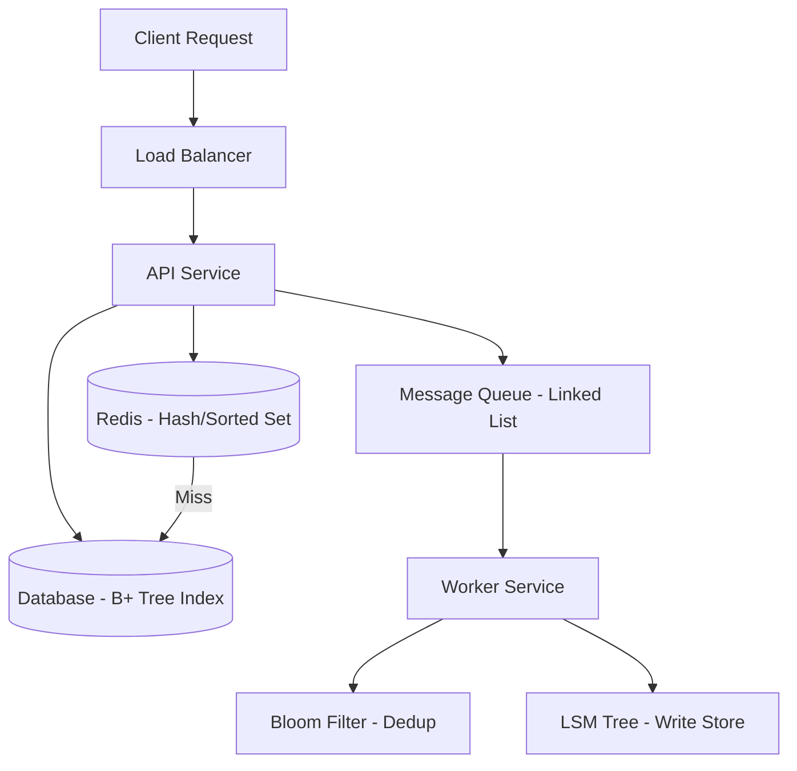
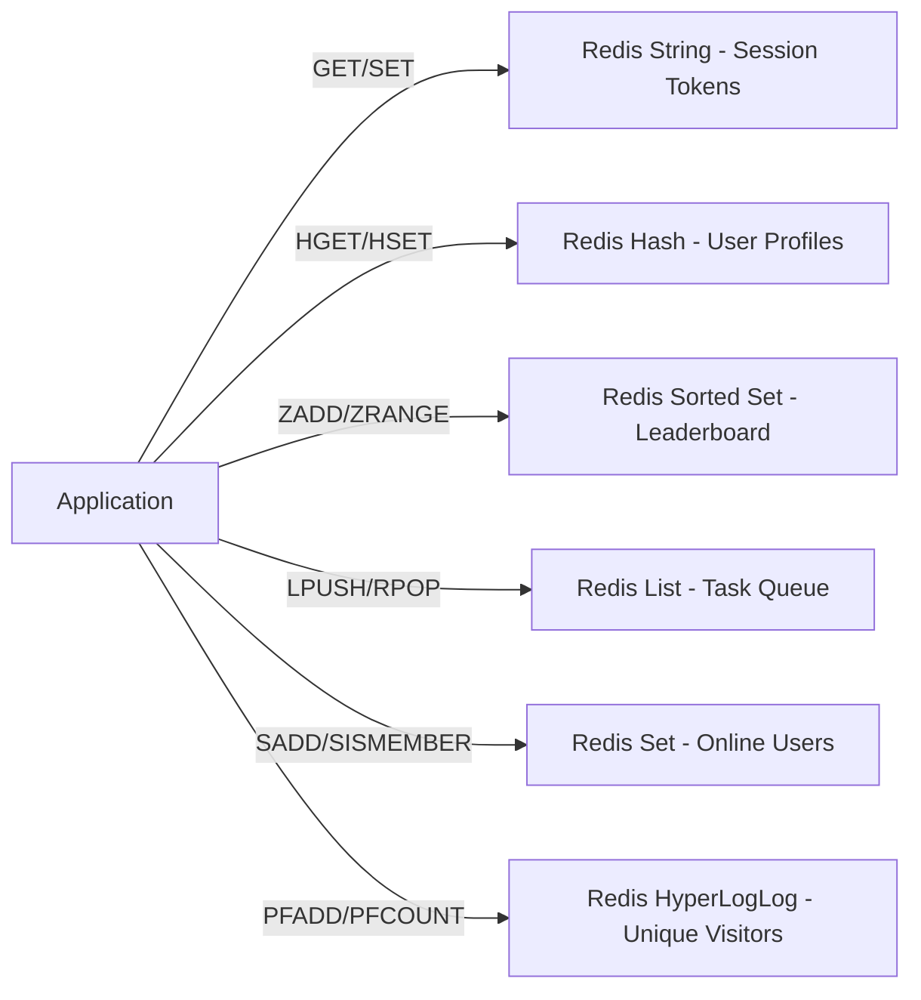
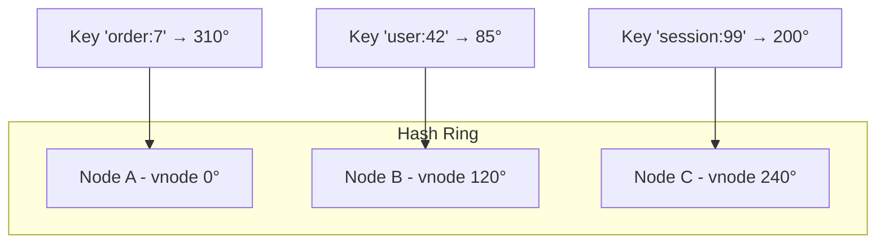
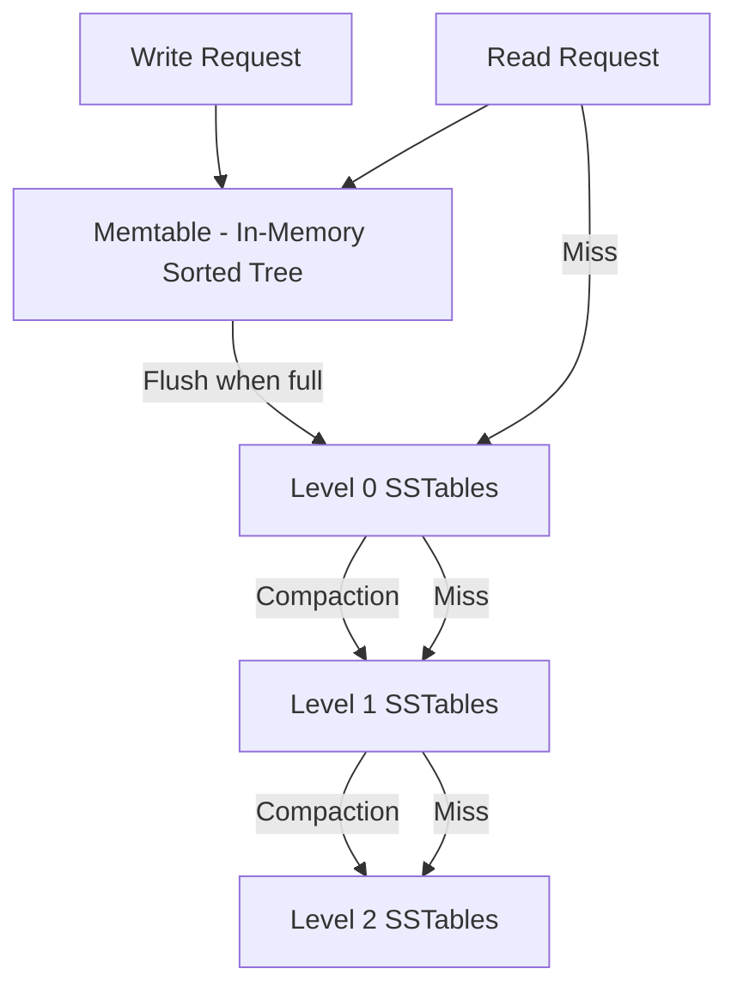
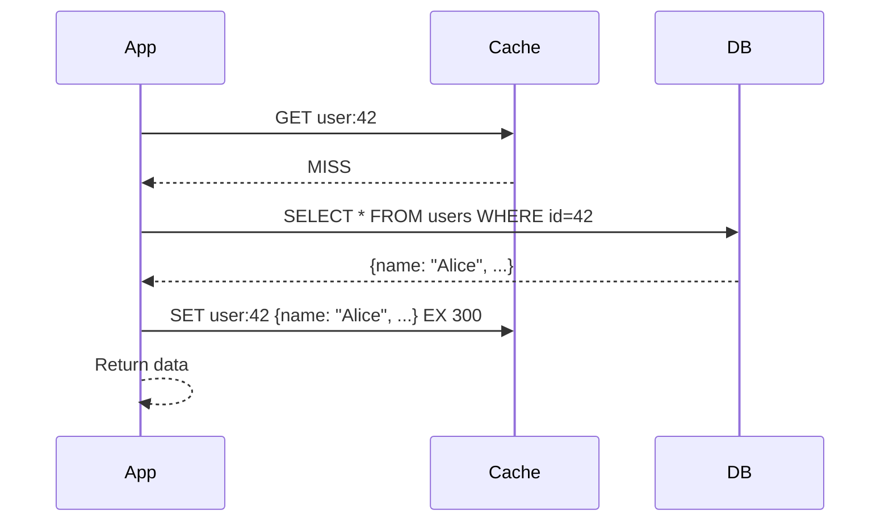
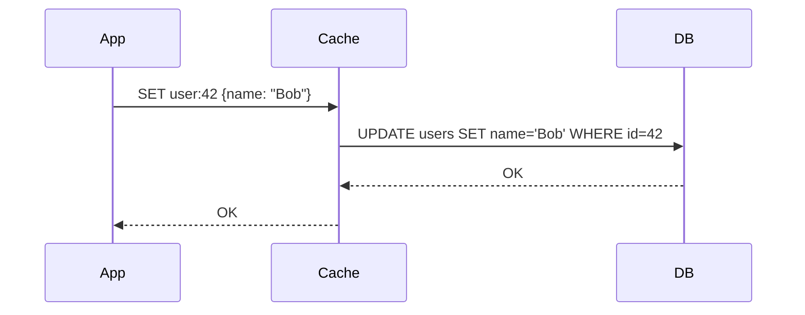
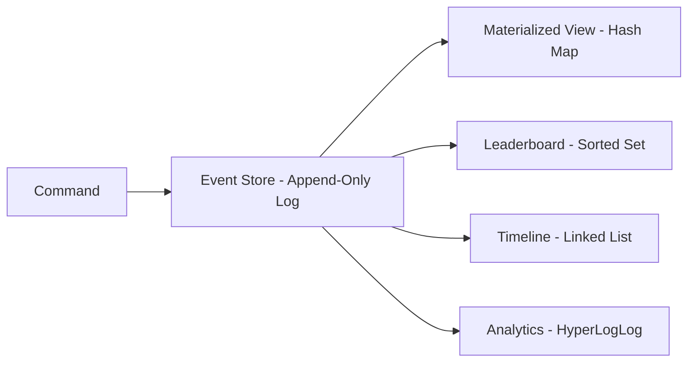
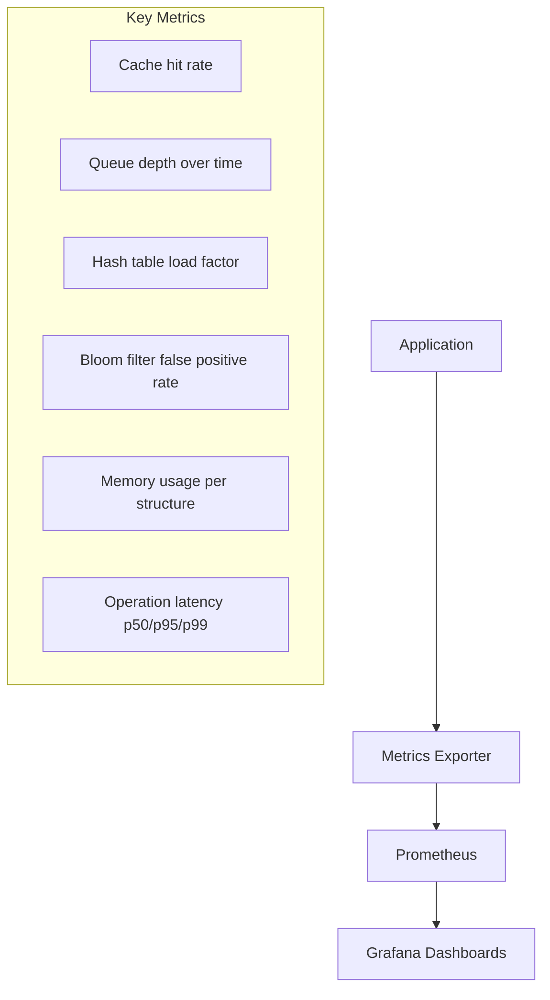

# What Are Data Structures? — Senior Level

## Table of Contents

1. [Introduction](#introduction)
2. [System Design with Data Structures](#system-design-with-data-structures)
3. [Distributed Data Structures](#distributed-data-structures)
4. [Comparison with Alternatives](#comparison-with-alternatives)
5. [Architecture Patterns](#architecture-patterns)
6. [Code Examples](#code-examples)
7. [Observability](#observability)
8. [Failure Modes](#failure-modes)
9. [Summary](#summary)

---

## Introduction

> Focus: "How to architect systems around data structures?"

At the senior level, data structures are no longer just containers for data. They are architectural decisions that determine how your system scales, how it handles failures, and how it performs under production load. Choosing the wrong data structure at the system level can cause cascading outages, while the right choice enables horizontal scaling with minimal operational overhead.

This guide covers distributed data structures, concurrent implementations, cache architectures, and the observability and failure modes you must understand to operate data-structure-heavy systems in production.

---

## System Design with Data Structures

### Choosing Data Structures at the Architecture Level



### Data Structure Selection Matrix for System Components

| System Requirement | Data Structure | Where Used | Why |
|--------------------|---------------|------------|-----|
| Fast key-value lookup | Hash table | Redis, Memcached, in-memory caches | O(1) average read/write |
| Range queries | B+ tree / Skip list | Database indexes, sorted caches | O(log n) range scans |
| Membership testing | Bloom filter | Spam detection, cache prefetch | O(1) with false positive tradeoff |
| Write-heavy workloads | LSM tree | LevelDB, RocksDB, Cassandra | Sequential writes, background compaction |
| Distributed key routing | Consistent hash ring | Load balancers, sharded caches | Minimal key redistribution on node change |
| Conflict-free replication | CRDTs | Multi-region databases, collaborative editing | Eventual consistency without coordination |
| Priority scheduling | Heap / Priority queue | Job schedulers, rate limiters | O(log n) insert/extract-min |
| Deduplication | Hash set | Event processing pipelines | O(1) duplicate detection |

### Cache Architecture: Redis Data Structures in Practice



| Redis Type | Underlying Structure | Use Case | Memory Efficiency |
|------------|---------------------|----------|-------------------|
| String | Simple dynamic string (SDS) | Caching, counters, session tokens | Low overhead per key |
| Hash | Ziplist (small) / Hash table (large) | Object storage, user profiles | Ziplist very compact under 128 entries |
| Sorted Set | Ziplist (small) / Skip list + hash table | Leaderboards, rate limiting windows | Skip list gives O(log n) range queries |
| List | Quicklist (linked list of ziplists) | Message queues, activity feeds | Good for sequential access |
| Set | Intset (small integers) / Hash table | Tags, unique visitors, intersections | Intset very compact for integers |
| HyperLogLog | Sparse/Dense register array | Cardinality estimation (unique counts) | Fixed 12 KB max per key |

---

## Distributed Data Structures

### Consistent Hash Ring

A consistent hash ring distributes keys across nodes so that adding or removing a node only remaps ~1/N of the keys (where N is the number of nodes). Virtual nodes improve balance.



### Bloom Filter

A Bloom filter is a space-efficient probabilistic structure that answers "is this element in the set?" with either "possibly yes" or "definitely no." It uses multiple hash functions mapping to a bit array.

**Properties:**
- False positives possible; false negatives impossible
- Cannot delete elements (use Counting Bloom filter for deletions)
- Memory: ~10 bits per element for 1% false positive rate

### LSM Tree (Log-Structured Merge Tree)

LSM trees optimize for write-heavy workloads by buffering writes in an in-memory sorted structure (memtable), then flushing to sorted on-disk files (SSTables) and periodically compacting them.



**Tradeoffs:**
- Write amplification: data rewritten during compaction
- Read amplification: may check multiple levels
- Space amplification: stale data awaits compaction

### Skip List

A skip list is a probabilistic alternative to balanced trees. It provides O(log n) search, insert, and delete with simpler implementation. Redis Sorted Sets and CockroachDB use skip lists internally.

### CRDTs (Conflict-free Replicated Data Types)

CRDTs allow replicas to be updated independently and concurrently, with a mathematical guarantee that they converge to the same state without coordination.

| CRDT Type | Description | Example Use |
|-----------|-------------|-------------|
| G-Counter | Grow-only counter | Page view counts across regions |
| PN-Counter | Positive-Negative counter | Like/dislike counts |
| G-Set | Grow-only set | Adding tags (never remove) |
| OR-Set | Observed-Remove set | Shopping cart items |
| LWW-Register | Last-Writer-Wins register | User profile fields |

---

## Comparison with Alternatives

### Hash Table vs. B+ Tree vs. LSM Tree for Storage

| Criteria | Hash Table | B+ Tree | LSM Tree |
|----------|-----------|---------|----------|
| Point read | O(1) | O(log n) | O(log n) with Bloom filter |
| Range scan | O(n) — must scan all | O(log n + k) — excellent | O(log n + k) — good |
| Write throughput | O(1) amortized | O(log n) with random I/O | O(1) amortized sequential I/O |
| Space efficiency | Moderate | Good | Moderate (compaction lag) |
| Concurrency | Lock striping / MVCC | Page-level locks / MVCC | Lock-free memtable possible |
| Best for | In-memory caches, key-value stores | Read-heavy OLTP databases | Write-heavy workloads, time-series |

### Redis vs. Memcached

| Aspect | Redis | Memcached |
|--------|-------|-----------|
| Data structures | Strings, hashes, lists, sets, sorted sets, streams | Strings only |
| Persistence | RDB snapshots, AOF log | None |
| Replication | Built-in primary-replica | None (client-side sharding) |
| Memory efficiency | Varies by structure | Slab allocator, very efficient for strings |
| Eviction | Multiple policies (LRU, LFU, volatile-*) | LRU only |
| Threading | Single-threaded (I/O threads in 6.0+) | Multi-threaded |
| Use when | Rich data modeling, persistence needed | Simple key-value caching, max throughput |

---

## Architecture Patterns

### Cache-Aside (Lazy Loading)

The application checks the cache first. On a miss, it reads from the database, then populates the cache. The cache never communicates directly with the database.



**Tradeoffs:**
- Cache can become stale if DB is updated without invalidating cache
- First request for any key is always slow (cold cache)
- Works well for read-heavy workloads

### Write-Through Cache

Every write goes to both cache and database. The cache is always consistent with the database.



**Tradeoffs:**
- Higher write latency (must write to both)
- Cache always fresh — no stale reads
- Wastes cache space for rarely read data

### Event Sourcing with Data Structures



In event sourcing, the event log is the source of truth (an append-only linked list or log). Different projections use different data structures optimized for their query patterns. Rebuilding a projection means replaying events into a fresh data structure.

---

## Code Examples

### Thread-Safe Concurrent Data Structures

#### Go — sync.Map, Channels, and Sharded Map

```go
package main

import (
	"context"
	"fmt"
	"hash/fnv"
	"sync"
	"sync/atomic"
	"time"
)

// --- sync.Map: optimized for read-heavy, key-stable workloads ---

func syncMapExample() {
	var m sync.Map

	// Concurrent writes
	var wg sync.WaitGroup
	for i := 0; i < 100; i++ {
		wg.Add(1)
		go func(n int) {
			defer wg.Done()
			m.Store(fmt.Sprintf("key:%d", n), n*n)
		}(i)
	}
	wg.Wait()

	// Concurrent reads
	m.Range(func(key, value interface{}) bool {
		fmt.Printf("%s = %v\n", key, value)
		return true // continue iteration
	})
}

// --- Sharded concurrent map for write-heavy workloads ---

const numShards = 32

type ShardedMap struct {
	shards [numShards]struct {
		sync.RWMutex
		data map[string]interface{}
	}
	size int64
}

func NewShardedMap() *ShardedMap {
	sm := &ShardedMap{}
	for i := range sm.shards {
		sm.shards[i].data = make(map[string]interface{})
	}
	return sm
}

func (sm *ShardedMap) shardIndex(key string) uint32 {
	h := fnv.New32a()
	h.Write([]byte(key))
	return h.Sum32() % numShards
}

func (sm *ShardedMap) Set(key string, value interface{}) {
	idx := sm.shardIndex(key)
	sm.shards[idx].Lock()
	if _, exists := sm.shards[idx].data[key]; !exists {
		atomic.AddInt64(&sm.size, 1)
	}
	sm.shards[idx].data[key] = value
	sm.shards[idx].Unlock()
}

func (sm *ShardedMap) Get(key string) (interface{}, bool) {
	idx := sm.shardIndex(key)
	sm.shards[idx].RLock()
	val, ok := sm.shards[idx].data[key]
	sm.shards[idx].RUnlock()
	return val, ok
}

func (sm *ShardedMap) Size() int64 {
	return atomic.LoadInt64(&sm.size)
}

// --- Channel-based pipeline pattern ---

func pipeline(ctx context.Context) {
	// Stage 1: Generate
	gen := func(nums ...int) <-chan int {
		out := make(chan int)
		go func() {
			defer close(out)
			for _, n := range nums {
				select {
				case out <- n:
				case <-ctx.Done():
					return
				}
			}
		}()
		return out
	}

	// Stage 2: Square
	sq := func(in <-chan int) <-chan int {
		out := make(chan int)
		go func() {
			defer close(out)
			for n := range in {
				select {
				case out <- n * n:
				case <-ctx.Done():
					return
				}
			}
		}()
		return out
	}

	// Run pipeline
	for result := range sq(gen(2, 3, 4, 5)) {
		fmt.Println(result)
	}
}

func main() {
	ctx, cancel := context.WithTimeout(context.Background(), 5*time.Second)
	defer cancel()

	syncMapExample()

	sm := NewShardedMap()
	sm.Set("host:api-1", "healthy")
	sm.Set("host:api-2", "degraded")
	v, _ := sm.Get("host:api-1")
	fmt.Printf("Status: %s, Total hosts: %d\n", v, sm.Size())

	pipeline(ctx)
}
```

#### Java — ConcurrentHashMap, BlockingQueue, and Striped Lock

```java
import java.util.concurrent.*;
import java.util.concurrent.atomic.AtomicLong;
import java.util.concurrent.atomic.LongAdder;

public class ConcurrentStructures {

    // --- ConcurrentHashMap with atomic operations ---

    static void concurrentHashMapExample() throws InterruptedException {
        ConcurrentHashMap<String, LongAdder> metrics = new ConcurrentHashMap<>();

        // Multiple threads incrementing counters safely
        ExecutorService pool = Executors.newFixedThreadPool(8);
        for (int i = 0; i < 1000; i++) {
            final String key = "endpoint:/api/v" + (i % 3);
            pool.submit(() -> {
                metrics.computeIfAbsent(key, k -> new LongAdder()).increment();
            });
        }
        pool.shutdown();
        pool.awaitTermination(5, TimeUnit.SECONDS);

        metrics.forEach((k, v) -> {
            System.out.printf("%s -> %d requests%n", k, v.sum());
        });
    }

    // --- BlockingQueue for producer-consumer ---

    static void blockingQueueExample() throws InterruptedException {
        BlockingQueue<String> taskQueue = new LinkedBlockingQueue<>(100);
        AtomicLong processed = new AtomicLong(0);

        // Producer
        Thread producer = new Thread(() -> {
            try {
                for (int i = 0; i < 50; i++) {
                    taskQueue.put("task-" + i);
                    System.out.println("Produced: task-" + i);
                }
                taskQueue.put("POISON_PILL"); // signal to stop
            } catch (InterruptedException e) {
                Thread.currentThread().interrupt();
            }
        });

        // Consumer
        Thread consumer = new Thread(() -> {
            try {
                while (true) {
                    String task = taskQueue.take(); // blocks if empty
                    if ("POISON_PILL".equals(task)) break;
                    // Process task
                    processed.incrementAndGet();
                    System.out.println("Consumed: " + task);
                }
            } catch (InterruptedException e) {
                Thread.currentThread().interrupt();
            }
        });

        producer.start();
        consumer.start();
        producer.join();
        consumer.join();

        System.out.printf("Processed %d tasks%n", processed.get());
    }

    // --- ConcurrentSkipListMap for sorted concurrent access ---

    static void skipListMapExample() {
        ConcurrentSkipListMap<Long, String> timeline = new ConcurrentSkipListMap<>();

        // Thread-safe sorted map — useful for time-series data
        timeline.put(System.nanoTime(), "event-A");
        timeline.put(System.nanoTime(), "event-B");
        timeline.put(System.nanoTime(), "event-C");

        // Range query: all events after a timestamp
        long cutoff = timeline.firstKey();
        var recent = timeline.tailMap(cutoff);
        recent.forEach((ts, event) -> {
            System.out.printf("[%d] %s%n", ts, event);
        });
    }

    public static void main(String[] args) throws Exception {
        concurrentHashMapExample();
        blockingQueueExample();
        skipListMapExample();
    }
}
```

#### Python — queue.Queue, threading, and Concurrent Bloom Filter

```python
import hashlib
import math
import queue
import threading
import time
from collections import defaultdict
from typing import Any


# --- Thread-safe queue for producer-consumer ---

def producer_consumer_example():
    task_queue = queue.Queue(maxsize=100)
    results = []
    results_lock = threading.Lock()

    def producer(n_tasks: int):
        for i in range(n_tasks):
            task_queue.put({"id": i, "data": f"payload-{i}"})
        task_queue.put(None)  # sentinel to stop consumer

    def consumer():
        while True:
            task = task_queue.get()  # blocks if empty
            if task is None:
                task_queue.task_done()
                break
            # Simulate processing
            result = task["id"] ** 2
            with results_lock:
                results.append(result)
            task_queue.task_done()

    t1 = threading.Thread(target=producer, args=(50,))
    t2 = threading.Thread(target=consumer)
    t1.start()
    t2.start()
    t1.join()
    t2.join()

    print(f"Processed {len(results)} tasks, sum={sum(results)}")


# --- Thread-safe Bloom Filter ---

class ThreadSafeBloomFilter:
    """Bloom filter with thread-safe add and check operations."""

    def __init__(self, expected_items: int, false_positive_rate: float = 0.01):
        self._size = self._optimal_size(expected_items, false_positive_rate)
        self._hash_count = self._optimal_hashes(self._size, expected_items)
        self._bit_array = bytearray(self._size)
        self._lock = threading.Lock()
        self._count = 0

    @staticmethod
    def _optimal_size(n: int, p: float) -> int:
        return int(-n * math.log(p) / (math.log(2) ** 2))

    @staticmethod
    def _optimal_hashes(m: int, n: int) -> int:
        return max(1, int((m / n) * math.log(2)))

    def _hashes(self, item: str) -> list[int]:
        positions = []
        for i in range(self._hash_count):
            digest = hashlib.sha256(f"{item}:{i}".encode()).hexdigest()
            positions.append(int(digest, 16) % self._size)
        return positions

    def add(self, item: str) -> None:
        positions = self._hashes(item)
        with self._lock:
            for pos in positions:
                self._bit_array[pos] = 1
            self._count += 1

    def might_contain(self, item: str) -> bool:
        positions = self._hashes(item)
        with self._lock:
            return all(self._bit_array[pos] for pos in positions)

    @property
    def count(self) -> int:
        with self._lock:
            return self._count


# --- Thread-safe LRU Cache ---

class ThreadSafeLRUCache:
    """LRU cache with thread safety for concurrent access."""

    def __init__(self, capacity: int):
        self._capacity = capacity
        self._cache: dict[str, Any] = {}
        self._order: list[str] = []  # least recent first
        self._lock = threading.Lock()
        self._hits = 0
        self._misses = 0

    def get(self, key: str) -> Any | None:
        with self._lock:
            if key in self._cache:
                self._hits += 1
                self._order.remove(key)
                self._order.append(key)
                return self._cache[key]
            self._misses += 1
            return None

    def put(self, key: str, value: Any) -> None:
        with self._lock:
            if key in self._cache:
                self._order.remove(key)
            elif len(self._cache) >= self._capacity:
                evicted = self._order.pop(0)
                del self._cache[evicted]
            self._cache[key] = value
            self._order.append(key)

    @property
    def hit_rate(self) -> float:
        total = self._hits + self._misses
        return self._hits / total if total > 0 else 0.0

    @property
    def stats(self) -> dict:
        with self._lock:
            return {
                "size": len(self._cache),
                "capacity": self._capacity,
                "hits": self._hits,
                "misses": self._misses,
                "hit_rate": f"{self.hit_rate:.2%}",
            }


if __name__ == "__main__":
    producer_consumer_example()

    # Bloom filter demo
    bf = ThreadSafeBloomFilter(expected_items=10000, false_positive_rate=0.01)
    for i in range(1000):
        bf.add(f"user:{i}")
    print(f"Contains 'user:42': {bf.might_contain('user:42')}")   # True
    print(f"Contains 'user:9999': {bf.might_contain('user:9999')}")  # Likely False
    print(f"Items added: {bf.count}")

    # LRU cache demo
    cache = ThreadSafeLRUCache(capacity=100)
    for i in range(200):
        cache.put(f"key:{i}", f"value:{i}")
    for i in range(150, 200):
        cache.get(f"key:{i}")
    print(f"Cache stats: {cache.stats}")
```

---

## Observability

### Metrics for Data Structure Performance in Production



### Critical Metrics to Monitor

| Data Structure | Metric | Warning Threshold | Action |
|---------------|--------|-------------------|--------|
| Hash table / Cache | Hit rate | < 80% | Review eviction policy, increase capacity |
| Hash table / Cache | Eviction rate | Sustained high | Increase memory or reduce TTL variance |
| Queue | Depth | Growing steadily | Scale consumers, check for slow consumers |
| Queue | Consumer lag | > N seconds | Add consumers, investigate processing time |
| Bloom filter | False positive rate | > configured rate | Rebuild with larger bit array |
| Sorted set | Operation latency p99 | > SLA target | Check cardinality, consider sharding |
| Any | Memory usage | > 80% of allocation | Scale out, enable eviction, reduce TTL |

### Go — Exporting Data Structure Metrics

```go
package main

import (
	"github.com/prometheus/client_golang/prometheus"
	"github.com/prometheus/client_golang/prometheus/promhttp"
	"net/http"
)

var (
	cacheHits = prometheus.NewCounterVec(
		prometheus.CounterOpts{
			Name: "cache_hits_total",
			Help: "Total cache hits",
		},
		[]string{"cache_name"},
	)
	cacheMisses = prometheus.NewCounterVec(
		prometheus.CounterOpts{
			Name: "cache_misses_total",
			Help: "Total cache misses",
		},
		[]string{"cache_name"},
	)
	queueDepth = prometheus.NewGaugeVec(
		prometheus.GaugeOpts{
			Name: "queue_depth",
			Help: "Current number of items in queue",
		},
		[]string{"queue_name"},
	)
	opDuration = prometheus.NewHistogramVec(
		prometheus.HistogramOpts{
			Name:    "datastructure_operation_seconds",
			Help:    "Latency of data structure operations",
			Buckets: prometheus.ExponentialBuckets(0.0001, 2, 15),
		},
		[]string{"structure", "operation"},
	)
)

func init() {
	prometheus.MustRegister(cacheHits, cacheMisses, queueDepth, opDuration)
}

func main() {
	// Usage in application code:
	// timer := prometheus.NewTimer(opDuration.WithLabelValues("cache", "get"))
	// defer timer.ObserveDuration()
	// cacheHits.WithLabelValues("user-cache").Inc()

	http.Handle("/metrics", promhttp.Handler())
	http.ListenAndServe(":9090", nil)
}
```

### Java — Micrometer Metrics

```java
import io.micrometer.core.instrument.*;

public class DataStructureMetrics {
    private final Counter cacheHits;
    private final Counter cacheMisses;
    private final Gauge queueDepth;
    private final Timer operationTimer;

    public DataStructureMetrics(MeterRegistry registry) {
        cacheHits = registry.counter("cache.hits", "cache", "user-cache");
        cacheMisses = registry.counter("cache.misses", "cache", "user-cache");

        // Gauge tracks current queue size
        var queue = new java.util.concurrent.LinkedBlockingQueue<String>(1000);
        queueDepth = Gauge.builder("queue.depth", queue, java.util.Collection::size)
                .tag("queue", "task-queue")
                .register(registry);

        operationTimer = registry.timer("datastructure.operation",
                "structure", "sorted_set", "operation", "add");
    }

    public void recordCacheHit() {
        cacheHits.increment();
    }

    public void recordCacheMiss() {
        cacheMisses.increment();
    }

    public void timeOperation(Runnable operation) {
        operationTimer.record(operation);
    }
}
```

### Python — Prometheus Client

```python
from prometheus_client import Counter, Gauge, Histogram, start_http_server

cache_hits = Counter("cache_hits_total", "Total cache hits", ["cache_name"])
cache_misses = Counter("cache_misses_total", "Total cache misses", ["cache_name"])
queue_depth = Gauge("queue_depth", "Current items in queue", ["queue_name"])
op_duration = Histogram(
    "datastructure_operation_seconds",
    "Latency of data structure operations",
    ["structure", "operation"],
    buckets=(0.0001, 0.0005, 0.001, 0.005, 0.01, 0.05, 0.1, 0.5, 1.0),
)


# Usage:
# cache_hits.labels(cache_name="user-cache").inc()
# queue_depth.labels(queue_name="task-queue").set(current_size)
# with op_duration.labels(structure="bloom_filter", operation="check").time():
#     result = bloom_filter.might_contain(key)


if __name__ == "__main__":
    start_http_server(9090)
    print("Metrics server running on :9090/metrics")
```

---

## Failure Modes

### Common Failure Modes for Data Structures in Production

```mermaid
graph TD
    subgraph Hot Partition
        HP1[Skewed hash function] --> HP2[One shard overloaded]
        HP2 --> HP3[Latency spike on hot shard]
        HP3 --> HP4[Cascading timeouts]
    end

    subgraph Memory Exhaustion
        ME1[Unbounded cache growth] --> ME2[OOM kill / GC thrashing]
        ME2 --> ME3[Service restarts]
        ME3 --> ME4[Cold cache → DB overload]
    end

    subgraph Thundering Herd
        TH1[Popular cache key expires] --> TH2[All requests hit DB simultaneously]
        TH2 --> TH3[DB overloaded]
        TH3 --> TH4[Cascading failures]
    end
```



### Failure Mode Details

| Failure Mode | Root Cause | Impact | Mitigation |
|-------------|-----------|--------|------------|
| **Hot partition** | Non-uniform key distribution, celebrity user, viral content | One node overloaded while others idle | Virtual nodes, key salting, dedicated shard for hot keys |
| **Memory exhaustion** | Unbounded growth, missing eviction policy, memory leak | OOM kills, GC pauses > seconds, service crash | Set max memory + eviction policy, monitor RSS, capacity planning |
| **Thundering herd** | Popular cache key expires, all clients refetch simultaneously | DB connection pool exhausted, cascading failures | Staggered TTLs, single-flight / request coalescing, lock-based refresh |
| **Stale reads** | Cache-aside without invalidation, replication lag | Users see outdated data | Event-driven invalidation, short TTLs, versioned keys |
| **Hash collision storm** | Adversarial input, poor hash function | O(n) degradation to linked list traversal | Cryptographic hash, randomized seed, switch to tree on collision threshold |
| **Queue backpressure failure** | Producers faster than consumers, no backpressure | Memory exhaustion, dropped messages | Bounded queues, consumer auto-scaling, dead-letter queue |
| **Split brain** | Network partition in distributed data structure | Inconsistent state across replicas | CRDTs, consensus protocol (Raft/Paxos), fencing tokens |

### Mitigation: Thundering Herd with Single-Flight Pattern

#### Go

```go
package main

import (
	"fmt"
	"sync"
	"time"
)

// SingleFlight ensures only one goroutine fetches a key at a time.
// Other callers for the same key wait for the result.
type SingleFlight struct {
	mu    sync.Mutex
	calls map[string]*call
}

type call struct {
	wg  sync.WaitGroup
	val interface{}
	err error
}

func NewSingleFlight() *SingleFlight {
	return &SingleFlight{calls: make(map[string]*call)}
}

func (sf *SingleFlight) Do(key string, fn func() (interface{}, error)) (interface{}, error) {
	sf.mu.Lock()
	if c, ok := sf.calls[key]; ok {
		sf.mu.Unlock()
		c.wg.Wait() // wait for in-flight request
		return c.val, c.err
	}

	c := &call{}
	c.wg.Add(1)
	sf.calls[key] = c
	sf.mu.Unlock()

	c.val, c.err = fn()
	c.wg.Done()

	sf.mu.Lock()
	delete(sf.calls, key)
	sf.mu.Unlock()

	return c.val, c.err
}

func main() {
	sf := NewSingleFlight()
	var wg sync.WaitGroup

	// 100 goroutines all request the same key — only 1 actually fetches
	for i := 0; i < 100; i++ {
		wg.Add(1)
		go func() {
			defer wg.Done()
			val, _ := sf.Do("popular-key", func() (interface{}, error) {
				fmt.Println("Actually fetching from DB (should print once)")
				time.Sleep(100 * time.Millisecond) // simulate DB call
				return "db-result", nil
			})
			_ = val
		}()
	}
	wg.Wait()
}
```

#### Java

```java
import java.util.concurrent.*;

public class SingleFlight<V> {
    private final ConcurrentHashMap<String, CompletableFuture<V>> inFlight =
            new ConcurrentHashMap<>();

    @FunctionalInterface
    public interface Loader<V> {
        V load() throws Exception;
    }

    public V execute(String key, Loader<V> loader) throws Exception {
        CompletableFuture<V> future = new CompletableFuture<>();
        CompletableFuture<V> existing = inFlight.putIfAbsent(key, future);

        if (existing != null) {
            // Another thread is already loading this key — wait for it
            return existing.get();
        }

        try {
            V result = loader.load();
            future.complete(result);
            return result;
        } catch (Exception e) {
            future.completeExceptionally(e);
            throw e;
        } finally {
            inFlight.remove(key);
        }
    }

    public static void main(String[] args) throws Exception {
        SingleFlight<String> sf = new SingleFlight<>();
        ExecutorService pool = Executors.newFixedThreadPool(100);

        // 100 threads request same key — only 1 fetches
        for (int i = 0; i < 100; i++) {
            pool.submit(() -> {
                try {
                    String result = sf.execute("popular-key", () -> {
                        System.out.println("Actually fetching (should print once)");
                        Thread.sleep(100);
                        return "db-result";
                    });
                } catch (Exception e) {
                    e.printStackTrace();
                }
            });
        }

        pool.shutdown();
        pool.awaitTermination(5, TimeUnit.SECONDS);
    }
}
```

#### Python

```python
import threading
import time
from typing import Any, Callable


class SingleFlight:
    """Ensures only one thread fetches a given key at a time."""

    def __init__(self):
        self._lock = threading.Lock()
        self._in_flight: dict[str, threading.Event] = {}
        self._results: dict[str, Any] = {}

    def do(self, key: str, fn: Callable[[], Any]) -> Any:
        with self._lock:
            if key in self._in_flight:
                event = self._in_flight[key]
                # Release lock, wait for the in-flight request
                self._lock.release()
                event.wait()
                self._lock.acquire()
                return self._results.pop(key, None)

            event = threading.Event()
            self._in_flight[key] = event

        try:
            result = fn()
            with self._lock:
                self._results[key] = result
        finally:
            event.set()
            with self._lock:
                del self._in_flight[key]

        return result


if __name__ == "__main__":
    sf = SingleFlight()
    fetch_count = 0
    count_lock = threading.Lock()

    def fetch_from_db() -> str:
        global fetch_count
        with count_lock:
            fetch_count += 1
        print("Actually fetching from DB (should print once)")
        time.sleep(0.1)
        return "db-result"

    threads = []
    for _ in range(100):
        t = threading.Thread(target=sf.do, args=("popular-key", fetch_from_db))
        threads.append(t)
        t.start()

    for t in threads:
        t.join()

    print(f"Total DB fetches: {fetch_count}")  # Should be 1
```

---

## Summary

At the senior level, data structures are architectural building blocks that shape how systems scale, fail, and recover:

- **System design choices** start with data structure selection — hash tables for O(1) lookups, B+ trees for range queries, LSM trees for write-heavy workloads, and Bloom filters for cheap membership tests.
- **Distributed data structures** like consistent hash rings, CRDTs, and skip lists solve problems that single-node structures cannot — key distribution, conflict-free replication, and concurrent sorted access.
- **Cache architectures** (cache-aside, write-through) with Redis or Memcached are data structure decisions at the infrastructure level. Understanding the underlying structures (skip lists in sorted sets, ziplists in hashes) informs capacity planning.
- **Concurrency** requires thread-safe implementations: Go's `sync.Map` and channels, Java's `ConcurrentHashMap` and `BlockingQueue`, Python's `queue.Queue` and threading locks. Shard-based locking reduces contention for write-heavy workloads.
- **Architecture patterns** like event sourcing map naturally to data structures — append-only logs as the source of truth, with materialized views in hash maps, sorted sets, or HyperLogLogs for different query patterns.
- **Observability** means monitoring cache hit rates, queue depths, operation latencies (p99), and memory usage. These metrics are the early warning system for data-structure-related failures.
- **Failure modes** — hot partitions, memory exhaustion, thundering herd, split brain — are predictable consequences of data structure misuse. Mitigations like single-flight patterns, staggered TTLs, and bounded queues are essential production knowledge.

The senior engineer's job is not just to pick the right data structure, but to anticipate how it will behave under load, how it will fail, and how to observe and recover from those failures.
