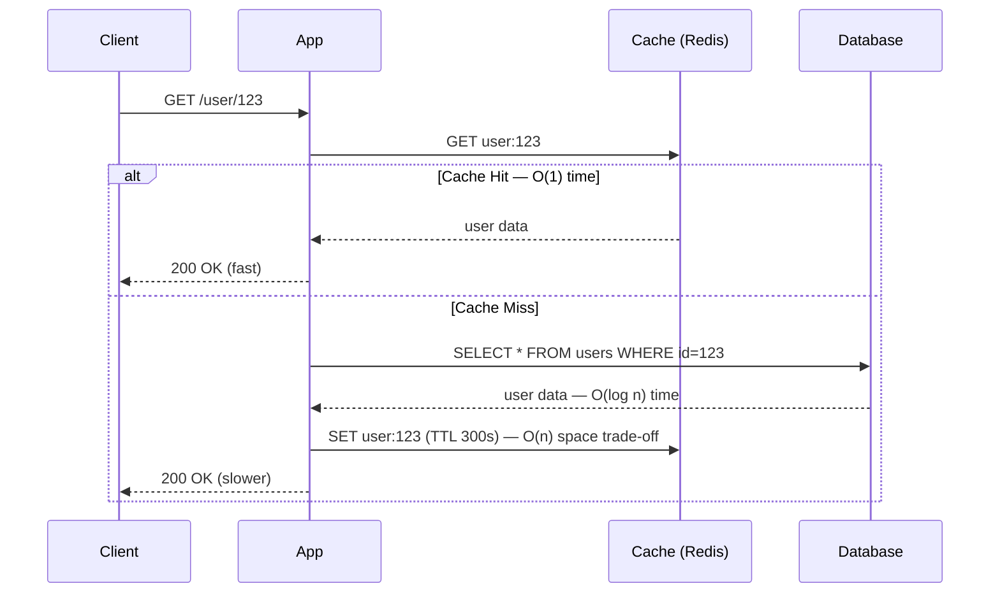

# Time vs Space Complexity — Senior Level

## Table of Contents

1. [Introduction](#introduction)
2. [System Design with Time-Space Trade-Offs](#system-design)
3. [Distributed Data Structures](#distributed-data-structures)
4. [Comparison with Alternatives](#comparison-with-alternatives)
5. [Architecture Patterns](#architecture-patterns)
6. [Code Examples](#code-examples)
7. [Observability](#observability)
8. [Failure Modes](#failure-modes)
9. [Summary](#summary)

---

## Introduction

> Focus: "How to architect systems around time-space trade-offs?"

Senior engineers don't just analyze algorithms — they architect systems where time and space trade-offs span multiple machines, persistence layers, and network boundaries. A cache that trades RAM for latency, a CDN that trades disk for bandwidth, a denormalized database that trades storage for query speed — these are all time-space trade-offs at system scale.

---

## System Design with Time-Space Trade-Offs

```mermaid
graph TD
    Client -->|request| LoadBalancer
    LoadBalancer --> AppServer1
    LoadBalancer --> AppServer2
    AppServer1 -->|cache hit: O(1)| Cache[Redis Cache — O(n) space]
    AppServer1 -->|cache miss: O(log n)| DB[(Database — B+ Tree Index)]
    AppServer2 -->|cache hit: O(1)| Cache
    AppServer2 -->|cache miss: O(log n)| DB
    DB -->|bloom filter check| BloomFilter[Bloom Filter — O(m) space, O(k) time]
```

### Trade-Offs at System Scale

| Component | Time Cost | Space Cost | Trade-Off |
|-----------|-----------|------------|-----------|
| **In-memory cache (Redis)** | O(1) lookup | GB of RAM per node | RAM for latency |
| **CDN** | O(1) edge hit | TB of replicated content | Disk/bandwidth for latency |
| **Database index (B+ Tree)** | O(log n) query | 10-30% extra storage | Disk for query speed |
| **Denormalized tables** | O(1) join-free reads | 2-5x storage | Storage for read latency |
| **Bloom filter** | O(k) membership test | Bits per element | Small space for fast negative lookups |
| **Materialized view** | O(1) precomputed reads | Full copy of derived data | Storage for read speed |
| **Write-ahead log** | O(1) sequential write | Log space | Disk for write durability + speed |

---

## Distributed Data Structures

| Structure | Time | Space | Consistency | Use Case |
|-----------|------|-------|-------------|----------|
| **Consistent hash ring** | O(log n) lookup | O(n) ring | Eventual | Key routing in distributed caches (Memcached, Cassandra) |
| **Bloom filter** | O(k) lookup, no false negatives | O(m) bits | Probabilistic | Checking if key exists before expensive DB query |
| **LSM Tree** | O(1) write, O(log n) read | O(n) + write amplification | Eventual | RocksDB, Cassandra — write-heavy workloads |
| **B+ Tree** | O(log n) read/write | O(n) + index overhead | Strong | MySQL, PostgreSQL — read-heavy workloads |
| **Count-Min Sketch** | O(k) update/query | O(w × d) counters | Approximate | Frequency estimation in streaming data |
| **HyperLogLog** | O(1) update | O(m) bytes (tiny) | Approximate | Cardinality estimation (unique visitor counts) |
| **Skip list** | O(log n) expected | O(n) + pointer overhead | Strong (single node) | Redis sorted sets |

### Bloom Filter: Trading Space for Approximate Membership

A Bloom filter uses m bits and k hash functions. It never gives false negatives but has a false positive rate of approximately (1 - e^(-kn/m))^k.

```text
False positive rate ≈ (1 - e^(-kn/m))^k

Example: n=1,000,000 elements, m=10,000,000 bits (~1.2 MB), k=7
  → False positive rate ≈ 0.8% — saves querying 99.2% of absent keys
```

---

## Comparison with Alternatives

| Strategy | Read Latency | Write Latency | Space Overhead | Best For |
|----------|-------------|---------------|----------------|----------|
| No cache, direct DB | O(log n) | O(log n) | Index only | Simple, low-traffic |
| Read-through cache | O(1) hit / O(log n) miss | O(log n) + invalidation | Cache + DB | Read-heavy, tolerates stale |
| Write-through cache | O(1) hit | O(log n) + cache update | Cache + DB | Consistency-critical reads |
| Write-behind cache | O(1) hit | O(1) buffered | Cache + DB + WAL | Write-heavy, eventual consistency OK |
| CQRS + Event sourcing | O(1) materialized view | O(1) event append | Event log + views | Complex domains, audit trails |

---

## Architecture Patterns

### Pattern: Cache-Aside with TTL



### Pattern: Precomputation vs On-Demand

```mermaid
graph LR
    A[Request] --> B{Precomputed?}
    B -->|Yes: O(1) lookup| C[Materialized View / Cache]
    B -->|No: O(n) compute| D[Compute on Demand]
    C --> E[Response: fast, stale risk]
    D --> F[Response: slow, always fresh]
```

---

## Code Examples

### Thread-Safe LRU Cache — O(1) Time, O(capacity) Space

#### Go

```go
package main

import (
    "container/list"
    "fmt"
    "sync"
)

type LRUCache struct {
    mu       sync.Mutex
    capacity int
    cache    map[string]*list.Element
    order    *list.List
}

type entry struct {
    key   string
    value interface{}
}

func NewLRUCache(capacity int) *LRUCache {
    return &LRUCache{
        capacity: capacity,
        cache:    make(map[string]*list.Element),
        order:    list.New(),
    }
}

func (c *LRUCache) Get(key string) (interface{}, bool) {
    c.mu.Lock()
    defer c.mu.Unlock()
    if elem, ok := c.cache[key]; ok {
        c.order.MoveToFront(elem) // O(1)
        return elem.Value.(*entry).value, true
    }
    return nil, false
}

func (c *LRUCache) Put(key string, value interface{}) {
    c.mu.Lock()
    defer c.mu.Unlock()
    if elem, ok := c.cache[key]; ok {
        c.order.MoveToFront(elem)
        elem.Value.(*entry).value = value
        return
    }
    if c.order.Len() >= c.capacity {
        oldest := c.order.Back()
        c.order.Remove(oldest)
        delete(c.cache, oldest.Value.(*entry).key)
    }
    elem := c.order.PushFront(&entry{key, value})
    c.cache[key] = elem
}

func main() {
    cache := NewLRUCache(3)
    cache.Put("a", 1)
    cache.Put("b", 2)
    cache.Put("c", 3)
    cache.Put("d", 4) // evicts "a"
    _, found := cache.Get("a")
    fmt.Println("a found:", found) // false
    val, _ := cache.Get("b")
    fmt.Println("b:", val) // 2
}
```

#### Java

```java
import java.util.LinkedHashMap;
import java.util.Map;
import java.util.concurrent.locks.ReentrantReadWriteLock;

public class LRUCache<K, V> {
    private final int capacity;
    private final LinkedHashMap<K, V> map;
    private final ReentrantReadWriteLock lock = new ReentrantReadWriteLock();

    public LRUCache(int capacity) {
        this.capacity = capacity;
        this.map = new LinkedHashMap<>(capacity, 0.75f, true) {
            @Override
            protected boolean removeEldestEntry(Map.Entry<K, V> eldest) {
                return size() > LRUCache.this.capacity;
            }
        };
    }

    public V get(K key) {
        lock.readLock().lock();
        try {
            return map.get(key); // O(1)
        } finally {
            lock.readLock().unlock();
        }
    }

    public void put(K key, V value) {
        lock.writeLock().lock();
        try {
            map.put(key, value); // O(1), auto-evicts if over capacity
        } finally {
            lock.writeLock().unlock();
        }
    }

    public static void main(String[] args) {
        LRUCache<String, Integer> cache = new LRUCache<>(3);
        cache.put("a", 1);
        cache.put("b", 2);
        cache.put("c", 3);
        cache.put("d", 4); // evicts "a"
        System.out.println("a: " + cache.get("a")); // null
        System.out.println("b: " + cache.get("b")); // 2
    }
}
```

#### Python

```python
import threading
from collections import OrderedDict

class LRUCache:
    def __init__(self, capacity: int):
        self.capacity = capacity
        self.cache = OrderedDict()
        self.lock = threading.Lock()

    def get(self, key):
        with self.lock:
            if key in self.cache:
                self.cache.move_to_end(key)  # O(1)
                return self.cache[key]
            return None

    def put(self, key, value):
        with self.lock:
            if key in self.cache:
                self.cache.move_to_end(key)
            self.cache[key] = value
            if len(self.cache) > self.capacity:
                self.cache.popitem(last=False)  # O(1) evict oldest

cache = LRUCache(3)
cache.put("a", 1)
cache.put("b", 2)
cache.put("c", 3)
cache.put("d", 4)  # evicts "a"
print("a:", cache.get("a"))  # None
print("b:", cache.get("b"))  # 2
```

### Bloom Filter Implementation

#### Go

```go
package main

import (
    "fmt"
    "hash/fnv"
)

type BloomFilter struct {
    bits []bool
    size uint64
    k    int
}

func NewBloomFilter(size uint64, k int) *BloomFilter {
    return &BloomFilter{bits: make([]bool, size), size: size, k: k}
}

func (bf *BloomFilter) hash(data string, seed int) uint64 {
    h := fnv.New64a()
    h.Write([]byte(data))
    h.Write([]byte{byte(seed)})
    return h.Sum64() % bf.size
}

func (bf *BloomFilter) Add(item string) {
    for i := 0; i < bf.k; i++ {
        bf.bits[bf.hash(item, i)] = true
    }
}

func (bf *BloomFilter) MayContain(item string) bool {
    for i := 0; i < bf.k; i++ {
        if !bf.bits[bf.hash(item, i)] {
            return false // definitely not present
        }
    }
    return true // maybe present (possible false positive)
}

func main() {
    bf := NewBloomFilter(1000, 3)
    bf.Add("hello")
    bf.Add("world")
    fmt.Println("hello:", bf.MayContain("hello")) // true
    fmt.Println("world:", bf.MayContain("world")) // true
    fmt.Println("foo:", bf.MayContain("foo"))      // false (probably)
}
```

#### Java

```java
import java.util.BitSet;

public class BloomFilter {
    private BitSet bits;
    private int size;
    private int k;

    public BloomFilter(int size, int k) {
        this.bits = new BitSet(size);
        this.size = size;
        this.k = k;
    }

    private int hash(String item, int seed) {
        int h = item.hashCode() ^ (seed * 0x9e3779b9);
        return Math.abs(h) % size;
    }

    public void add(String item) {
        for (int i = 0; i < k; i++) bits.set(hash(item, i));
    }

    public boolean mayContain(String item) {
        for (int i = 0; i < k; i++) {
            if (!bits.get(hash(item, i))) return false;
        }
        return true;
    }

    public static void main(String[] args) {
        BloomFilter bf = new BloomFilter(1000, 3);
        bf.add("hello");
        bf.add("world");
        System.out.println("hello: " + bf.mayContain("hello")); // true
        System.out.println("foo: " + bf.mayContain("foo"));      // false
    }
}
```

#### Python

```python
import hashlib

class BloomFilter:
    def __init__(self, size, k):
        self.size = size
        self.k = k
        self.bits = [False] * size

    def _hash(self, item, seed):
        h = hashlib.md5(f"{item}{seed}".encode()).hexdigest()
        return int(h, 16) % self.size

    def add(self, item):
        for i in range(self.k):
            self.bits[self._hash(item, i)] = True

    def may_contain(self, item):
        return all(self.bits[self._hash(item, i)] for i in range(self.k))

bf = BloomFilter(1000, 3)
bf.add("hello")
bf.add("world")
print("hello:", bf.may_contain("hello"))  # True
print("foo:", bf.may_contain("foo"))      # False (probably)
```

---

## Observability

| Metric | Alert Threshold | Why It Matters |
|--------|----------------|----------------|
| `cache_hit_ratio` | < 0.80 | Low hit ratio means cache space is wasted — not saving enough time |
| `cache_eviction_rate` | > 1000/s | Thrashing — cache too small, trade-off not working |
| `p99_latency_ms` | > 50 ms | Time budget exceeded — need more caching or precomputation |
| `memory_usage_percent` | > 85% | Space budget nearly exhausted — reduce cache size or optimize |
| `bloom_filter_false_positive_rate` | > 5% | Filter too small — increase bit array size |
| `db_index_size_ratio` | > 0.30 | Index consuming too much disk — consider partial indexes |

---

## Failure Modes

- **Cache stampede / thundering herd:** Many concurrent cache misses for the same key → all hit DB simultaneously. Fix: lock per key, probabilistic early expiration, or request coalescing.
- **Memory exhaustion:** Unbounded cache growth fills available RAM → OOM kills. Fix: LRU eviction, TTL, max size limits. Monitor with `memory_usage_percent`.
- **Hot partition:** One cache shard receives disproportionate traffic (celebrity problem). Fix: replicate hot keys, use consistent hashing with virtual nodes.
- **Stale read cascade:** Cache serves stale data after write → downstream services propagate stale state. Fix: write-through cache, cache invalidation on write, or short TTLs.
- **Bloom filter saturation:** Too many elements inserted → false positive rate approaches 1.0. Fix: monitor FP rate, rebuild with larger size when threshold exceeded.
- **Index bloat:** Too many database indexes slow writes and consume disk. Fix: audit unused indexes, use partial/filtered indexes, monitor index-to-data size ratio.

---

## Summary

At the senior level, time-space trade-offs become architecture decisions spanning caches, databases, CDNs, and distributed data structures. You choose between consistency models (strong vs eventual), space-efficient probabilistic structures (Bloom filters, HyperLogLog), and caching strategies (read-through, write-behind, cache-aside). Every component in a distributed system represents a time-space trade-off — understanding these trade-offs and their failure modes is essential for building reliable, performant systems at scale.
