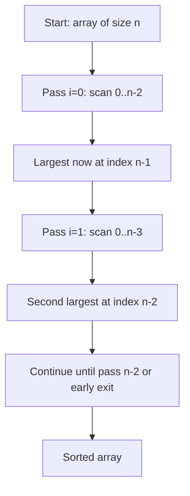

# Bubble Sort — Junior Level

## Table of Contents

1. [Introduction](#introduction)
2. [Prerequisites](#prerequisites)
3. [Glossary](#glossary)
4. [Core Concepts](#core-concepts)
5. [Big-O Summary](#big-o-summary)
6. [Real-World Analogies](#real-world-analogies)
7. [Pros & Cons](#pros--cons)
8. [Step-by-Step Walkthrough](#step-by-step-walkthrough)
9. [Code Examples](#code-examples)
10. [Coding Patterns](#coding-patterns)
11. [Error Handling](#error-handling)
12. [Performance Tips](#performance-tips)
13. [Best Practices](#best-practices)
14. [Edge Cases & Pitfalls](#edge-cases--pitfalls)
15. [Common Mistakes](#common-mistakes)
16. [Cheat Sheet](#cheat-sheet)
17. [Visual Animation](#visual-animation)
18. [Summary](#summary)
19. [Further Reading](#further-reading)

---

## Introduction

> Focus: "What is Bubble Sort?" and "How does it work?"

**Bubble Sort** is the simplest sorting algorithm to understand. It works by repeatedly walking through a list, comparing adjacent pairs of elements, and swapping them if they're in the wrong order. After each full pass, the largest unsorted element "bubbles up" to its correct position at the end of the array — exactly like a bubble of air rising to the surface of water.

It is a **comparison-based**, **in-place**, and **stable** sorting algorithm. Despite being the slowest of the common sorts (O(n²) average and worst case), it is the canonical algorithm taught first because the mechanics are visible and intuitive: compare two neighbors, swap if needed, repeat.

Bubble Sort is rarely used in production for large datasets, but it shines in three places: (1) teaching the fundamentals of sorting and complexity analysis, (2) sorting tiny arrays (n < 10) where its low constant factor sometimes beats more complex algorithms, and (3) detecting whether a list is already sorted in a single O(n) pass with the early-exit optimization.

---

## Prerequisites

- **Required:** Basic programming — variables, loops (`for`, `while`), functions, arrays
- **Required:** Understanding of how to swap two variables (using a temporary variable or tuple unpacking)
- **Required:** Basic comparison operators (`<`, `>`, `<=`, `>=`, `==`)
- **Helpful:** Familiarity with Big-O notation (O(n), O(n²)) — see [`06-algorithmic-complexity/`](../../06-algorithmic-complexity/)
- **Helpful:** Knowing what "in-place" and "stable" mean for sorting algorithms

---

## Glossary

| Term | Definition |
|------|-----------|
| **Sorting** | Arranging elements of a collection in a defined order (ascending, descending, custom) |
| **Comparison sort** | Algorithm that orders elements only by comparing pairs (e.g., `a < b`) — has a Ω(n log n) lower bound |
| **In-place** | Algorithm that uses O(1) auxiliary space — modifies the input array directly |
| **Stable sort** | Preserves the relative order of equal elements (e.g., two records with key `5` stay in original order) |
| **Pass** | One complete walk through the array from start to end |
| **Adjacent swap** | Exchanging two elements that sit next to each other (indices `i` and `i+1`) |
| **Bubbling up** | The visual effect: large values move toward the end of the array, like a bubble rising |
| **Early exit** | Optimization: if no swaps happen in a pass, the array is already sorted — stop |
| **Inversion** | A pair `(i, j)` with `i < j` but `arr[i] > arr[j]` — Bubble Sort fixes one inversion per swap |
| **Pivot (different concept)** | Used in Quick Sort, **not** in Bubble Sort — don't confuse them |

---

## Core Concepts

### Concept 1: The Compare-and-Swap Operation

The heart of Bubble Sort is one operation: compare two adjacent elements, and if they're in the wrong order, swap them. For ascending sort: if `arr[j] > arr[j+1]`, swap. That's the entire decision logic. Everything else is just looping over the array repeatedly until no more swaps are needed.

### Concept 2: One Pass Bubbles One Element to Its Place

After one full pass through the array (comparing every adjacent pair from index 0 to `n-2`), the largest element ends up at index `n-1`. After the second pass, the second-largest ends up at `n-2`. After `n-1` passes, the entire array is sorted. This is why we need (in the naive version) `n` outer iterations.

### Concept 3: The Inner Loop Shrinks Each Pass

Since pass 1 places the largest element at position `n-1`, we don't need to compare it again. Pass 2's inner loop can stop one position earlier. Pass `i`'s inner loop runs from `0` to `n-1-i`. This optimization halves the total number of comparisons (from n² to n²/2), but the Big-O is still O(n²).

### Concept 4: Early Exit on a Sorted Pass

If a full pass completes without performing any swap, the array must already be sorted — so we can stop immediately. This optimization makes Bubble Sort O(n) on already-sorted input (best case), instead of O(n²). Add a `swapped` flag that resets to `false` at the start of each pass and is set to `true` whenever a swap occurs.

### Concept 5: Stability — Equal Elements Stay in Order

Bubble Sort is **stable** because we only swap when `arr[j] > arr[j+1]`, never when they're equal. This means if you have two records with the same key (e.g., two students named "Alice" with different IDs), their relative order from the input is preserved. Stability matters when you sort by multiple keys in succession.

### Concept 6: In-Place — No Extra Memory

Bubble Sort modifies the input array directly. The only extra memory it uses is a single temporary variable for swapping (and maybe a boolean flag for early exit). Total auxiliary space: **O(1)**. That's why bubble sort is sometimes used in environments with severe memory constraints, even if it's slow.

---

## Big-O Summary

| Operation / Case | Complexity | Notes |
|-----------------|-----------|-------|
| Time — Best (already sorted, with early exit) | **O(n)** | One pass, zero swaps, exit immediately |
| Time — Average (random order) | **O(n²)** | Roughly n²/2 comparisons, n²/4 swaps expected |
| Time — Worst (reverse sorted) | **O(n²)** | n²/2 comparisons AND n²/2 swaps |
| Space — Auxiliary | **O(1)** | Only one temp variable for swap |
| Stable | **Yes** | Equal elements never swapped → original order kept |
| In-place | **Yes** | Modifies input directly |
| Adaptive | **Yes** (with early exit) | Faster on nearly-sorted input |
| Comparisons (worst) | n(n-1)/2 ≈ n²/2 | All adjacent pairs over all passes |
| Swaps (worst) | n(n-1)/2 ≈ n²/2 | One swap per inversion; reverse-sorted has max inversions |

---

## Real-World Analogies

| Concept | Analogy |
|---------|--------|
| **Bubbling largest to end** | Air bubbles rising to the top of a glass of soda — the biggest, lightest bubble reaches the surface first |
| **One pass = one bubble surfaces** | Each pass takes the biggest "weight" still floating and pushes it to the back of the line |
| **Compare-and-swap** | Two children in line being asked "who's taller?" — the taller one steps back one spot |
| **Early exit** | A teacher checking a sorted line and finding nobody needs to move — done, dismissed |
| **Stable sort** | When two students are equally tall and the teacher leaves them in the order they originally arrived |

> **Where the analogy breaks:** Real bubbles all rise simultaneously; Bubble Sort handles one bubble per pass sequentially. Also, real sorting in a CPU costs CPU cycles for each comparison and swap — there is no "passive floating" — so a thousand-element array means tens of thousands of operations.

---

## Pros & Cons

| Pros | Cons |
|------|------|
| Simplest sort to understand and implement (~5 lines) | O(n²) — terrible for large arrays |
| In-place — uses O(1) extra memory | Lots of swaps even in average case (O(n²)) |
| Stable — preserves relative order of equals | Cache-unfriendly compared to in-place merge variants |
| Adaptive with early-exit — O(n) on sorted input | Beaten on nearly every input by Insertion Sort |
| Excellent for teaching: every step is visible | Almost never used in production libraries |
| Can detect "is this array sorted?" in one O(n) pass | Even Selection Sort does fewer swaps (n vs. n²) |

**When to use:**
- Teaching sorting fundamentals (every CS course shows this first)
- Tiny arrays (n ≤ 10) where simplicity outweighs performance
- Detecting whether a list is already sorted (one pass)
- Embedded systems with strict memory budgets and tiny n

**When NOT to use:**
- Any array with more than ~50 elements — use Insertion Sort, Merge Sort, or your language's built-in sort
- Performance-critical code paths
- Sorting linked lists (Bubble Sort works but is awful — Merge Sort is the linked-list winner)

---

## Step-by-Step Walkthrough

Sorting `[5, 1, 4, 2, 8]` ascending:

**Pass 1:**
```
[5, 1, 4, 2, 8]   compare 5 and 1 → swap → [1, 5, 4, 2, 8]
[1, 5, 4, 2, 8]   compare 5 and 4 → swap → [1, 4, 5, 2, 8]
[1, 4, 5, 2, 8]   compare 5 and 2 → swap → [1, 4, 2, 5, 8]
[1, 4, 2, 5, 8]   compare 5 and 8 → no swap → [1, 4, 2, 5, 8]
```
Result after pass 1: `[1, 4, 2, 5, 8]` — the `8` is now in its final position.

**Pass 2:** (inner loop runs to `n-1-1 = 3`, but checks indices 0..2)
```
[1, 4, 2, 5, 8]   compare 1 and 4 → no swap
[1, 4, 2, 5, 8]   compare 4 and 2 → swap → [1, 2, 4, 5, 8]
[1, 2, 4, 5, 8]   compare 4 and 5 → no swap
```
Result after pass 2: `[1, 2, 4, 5, 8]` — array is now sorted.

**Pass 3:** With the early-exit optimization, no swaps happen → exit. Without early exit, pass 3 and pass 4 still run but find no work.

**Total work:** ~7 comparisons, 4 swaps. For n=5, the worst case would be 4+3+2+1 = 10 comparisons.

---

## Code Examples

### Example 1: Naive Bubble Sort (no optimizations)

#### Go

```go
package main

import "fmt"

// BubbleSortNaive sorts arr in ascending order — no early exit.
// Time: O(n^2) in all cases. Space: O(1).
func BubbleSortNaive(arr []int) {
    n := len(arr)
    for i := 0; i < n-1; i++ {
        for j := 0; j < n-1; j++ {
            if arr[j] > arr[j+1] {
                arr[j], arr[j+1] = arr[j+1], arr[j]
            }
        }
    }
}

func main() {
    data := []int{5, 1, 4, 2, 8}
    BubbleSortNaive(data)
    fmt.Println(data) // [1 2 4 5 8]
}
```

#### Java

```java
import java.util.Arrays;

public class BubbleSortNaive {
    // Time: O(n^2) in all cases. Space: O(1).
    public static void bubbleSortNaive(int[] arr) {
        int n = arr.length;
        for (int i = 0; i < n - 1; i++) {
            for (int j = 0; j < n - 1; j++) {
                if (arr[j] > arr[j + 1]) {
                    int tmp = arr[j];
                    arr[j] = arr[j + 1];
                    arr[j + 1] = tmp;
                }
            }
        }
    }

    public static void main(String[] args) {
        int[] data = {5, 1, 4, 2, 8};
        bubbleSortNaive(data);
        System.out.println(Arrays.toString(data)); // [1, 2, 4, 5, 8]
    }
}
```

#### Python

```python
def bubble_sort_naive(arr):
    """Sort arr in ascending order. Time: O(n^2). Space: O(1)."""
    n = len(arr)
    for i in range(n - 1):
        for j in range(n - 1):
            if arr[j] > arr[j + 1]:
                arr[j], arr[j + 1] = arr[j + 1], arr[j]

if __name__ == "__main__":
    data = [5, 1, 4, 2, 8]
    bubble_sort_naive(data)
    print(data)  # [1, 2, 4, 5, 8]
```

**What it does:** Runs `n-1` passes; in each pass compares every adjacent pair and swaps when out of order.
**Run:** `go run main.go` | `javac BubbleSortNaive.java && java BubbleSortNaive` | `python bubble.py`

---

### Example 2: Optimized Bubble Sort (shrinking inner loop + early exit)

#### Go

```go
package main

import "fmt"

// BubbleSort sorts arr ascending with two optimizations:
//   1. Inner loop shrinks: after pass i, last i elements are in place.
//   2. Early exit: if no swap in a pass, array is sorted.
// Best: O(n) (sorted input). Avg/Worst: O(n^2). Space: O(1). Stable.
func BubbleSort(arr []int) {
    n := len(arr)
    for i := 0; i < n-1; i++ {
        swapped := false
        for j := 0; j < n-1-i; j++ {
            if arr[j] > arr[j+1] {
                arr[j], arr[j+1] = arr[j+1], arr[j]
                swapped = true
            }
        }
        if !swapped {
            return // already sorted — stop early
        }
    }
}

func main() {
    data := []int{5, 1, 4, 2, 8}
    BubbleSort(data)
    fmt.Println(data) // [1 2 4 5 8]

    sorted := []int{1, 2, 3, 4, 5}
    BubbleSort(sorted) // exits after 1 pass — O(n)
    fmt.Println(sorted)
}
```

#### Java

```java
import java.util.Arrays;

public class BubbleSort {
    // Best: O(n). Avg/Worst: O(n^2). Space: O(1). Stable.
    public static void bubbleSort(int[] arr) {
        int n = arr.length;
        for (int i = 0; i < n - 1; i++) {
            boolean swapped = false;
            for (int j = 0; j < n - 1 - i; j++) {
                if (arr[j] > arr[j + 1]) {
                    int tmp = arr[j];
                    arr[j] = arr[j + 1];
                    arr[j + 1] = tmp;
                    swapped = true;
                }
            }
            if (!swapped) return;
        }
    }

    public static void main(String[] args) {
        int[] data = {5, 1, 4, 2, 8};
        bubbleSort(data);
        System.out.println(Arrays.toString(data));
    }
}
```

#### Python

```python
def bubble_sort(arr):
    """Optimized bubble sort.
    Best: O(n). Average/Worst: O(n^2). Space: O(1). Stable.
    """
    n = len(arr)
    for i in range(n - 1):
        swapped = False
        for j in range(n - 1 - i):
            if arr[j] > arr[j + 1]:
                arr[j], arr[j + 1] = arr[j + 1], arr[j]
                swapped = True
        if not swapped:
            return  # already sorted — stop early

if __name__ == "__main__":
    data = [5, 1, 4, 2, 8]
    bubble_sort(data)
    print(data)  # [1, 2, 4, 5, 8]
```

**What it does:** Adds the `swapped` flag and shrinking inner-loop bound. On already-sorted input, runs in O(n) instead of O(n²).

---

### Example 3: Bubble Sort with Custom Comparator (descending)

#### Go

```go
package main

import "fmt"

// BubbleSortBy sorts arr using a custom less function.
// less(a, b) returns true if a should appear before b.
func BubbleSortBy(arr []int, less func(a, b int) bool) {
    n := len(arr)
    for i := 0; i < n-1; i++ {
        swapped := false
        for j := 0; j < n-1-i; j++ {
            // Swap when arr[j] should NOT come before arr[j+1].
            if !less(arr[j], arr[j+1]) {
                arr[j], arr[j+1] = arr[j+1], arr[j]
                swapped = true
            }
        }
        if !swapped {
            return
        }
    }
}

func main() {
    data := []int{5, 1, 4, 2, 8}
    BubbleSortBy(data, func(a, b int) bool { return a > b }) // descending
    fmt.Println(data) // [8 5 4 2 1]
}
```

#### Java

```java
import java.util.Arrays;
import java.util.Comparator;

public class BubbleSortComparator {
    public static void bubbleSort(Integer[] arr, Comparator<Integer> cmp) {
        int n = arr.length;
        for (int i = 0; i < n - 1; i++) {
            boolean swapped = false;
            for (int j = 0; j < n - 1 - i; j++) {
                if (cmp.compare(arr[j], arr[j + 1]) > 0) {
                    Integer tmp = arr[j];
                    arr[j] = arr[j + 1];
                    arr[j + 1] = tmp;
                    swapped = true;
                }
            }
            if (!swapped) return;
        }
    }

    public static void main(String[] args) {
        Integer[] data = {5, 1, 4, 2, 8};
        bubbleSort(data, Comparator.reverseOrder()); // descending
        System.out.println(Arrays.toString(data));   // [8, 5, 4, 2, 1]
    }
}
```

#### Python

```python
def bubble_sort_by(arr, key=lambda x: x, reverse=False):
    """Sort with custom key and direction. Mirrors Python list.sort() API."""
    n = len(arr)
    for i in range(n - 1):
        swapped = False
        for j in range(n - 1 - i):
            a, b = key(arr[j]), key(arr[j + 1])
            should_swap = (a < b) if reverse else (a > b)
            if should_swap:
                arr[j], arr[j + 1] = arr[j + 1], arr[j]
                swapped = True
        if not swapped:
            return

if __name__ == "__main__":
    data = [5, 1, 4, 2, 8]
    bubble_sort_by(data, reverse=True)
    print(data)  # [8, 5, 4, 2, 1]

    words = ["banana", "fig", "apple"]
    bubble_sort_by(words, key=len)
    print(words)  # ['fig', 'apple', 'banana'] — by length
```

---

## Coding Patterns

### Pattern 1: Swap Two Adjacent Elements

**Intent:** Exchange `arr[j]` and `arr[j+1]` in a single line, no temporary variable in modern languages.

#### Go

```go
arr[j], arr[j+1] = arr[j+1], arr[j] // tuple assignment — atomic from caller's view
```

#### Java

```java
int tmp = arr[j];        // explicit temp — Java has no tuple swap
arr[j] = arr[j + 1];
arr[j + 1] = tmp;
```

#### Python

```python
arr[j], arr[j + 1] = arr[j + 1], arr[j]  # tuple unpacking
```

### Pattern 2: Early-Exit Flag

**Intent:** Stop the outer loop as soon as a pass completes with zero swaps — the array is sorted.

#### Go

```go
swapped := false
// ... inner loop sets swapped = true on any swap
if !swapped {
    break
}
```

#### Java

```java
boolean swapped = false;
// ...
if (!swapped) break;
```

#### Python

```python
swapped = False
# ...
if not swapped:
    break
```

### Pattern 3: Shrinking Inner Bound

**Intent:** After pass `i`, the last `i+1` elements are in their final positions. Don't compare them again.

```text
inner loop: for j in 0 .. n-2-i
```



### Pattern 4: Bidirectional / Cocktail Shaker Variant (preview)

**Intent:** Alternate passes — left-to-right pushes the max right, right-to-left pulls the min left. Halves the number of passes for some inputs (especially "turtles" — small values near the end).

#### Python

```python
def cocktail_sort(arr):
    n = len(arr)
    start, end = 0, n - 1
    swapped = True
    while swapped:
        swapped = False
        for j in range(start, end):
            if arr[j] > arr[j + 1]:
                arr[j], arr[j + 1] = arr[j + 1], arr[j]
                swapped = True
        if not swapped: break
        end -= 1
        for j in range(end - 1, start - 1, -1):
            if arr[j] > arr[j + 1]:
                arr[j], arr[j + 1] = arr[j + 1], arr[j]
                swapped = True
        start += 1
```

> Cocktail sort is still O(n²) — it just has a smaller constant. We cover it in `middle.md`.

---

## Error Handling

| Error | Cause | Fix |
|-------|-------|-----|
| `IndexError` / `panic: runtime error: index out of range` | Inner loop ran to `n` instead of `n-1` (then `arr[j+1]` is out of bounds) | Use `j < n-1-i` (or `j < n-1`) — never `j < n` |
| Infinite loop | Outer loop checks `swapped` but inner loop never sets it (typo) | Always set `swapped = true` immediately after the swap |
| Wrong order in output | Comparison operator reversed (`<` instead of `>` for ascending) | Verify: ascending sort uses `if arr[j] > arr[j+1]: swap` |
| `NullPointerException` (Java) | Sorting `Integer[]` with a `null` element | Filter nulls or use a Comparator that handles them: `Comparator.nullsFirst(...)` |
| Mutating frozen / immutable | Calling on a tuple in Python or `Arrays.asList()` view in Java | Convert to a mutable list first: `arr = list(arr)` / `new ArrayList<>(asList)` |
| Function returns `None` instead of sorted array (Python beginners) | Confusing `sorted(arr)` (returns new) vs. `arr.sort()` (in-place returns None) | Bubble sort in this file is in-place — caller must use the original array, not the return value |

---

## Performance Tips

- **Always include the early-exit flag.** It costs nothing on random input but makes already-sorted detection O(n).
- **Shrink the inner loop.** Without it, you do twice as many comparisons.
- **Avoid Bubble Sort for n > ~50.** Insertion Sort beats it on every realistic input; Merge/Quick Sort beat it for large n.
- **Tight inner loops matter.** In hot code, store `arr[j]` in a local variable to skip repeated indexing — but this rarely matters because Bubble Sort is already too slow to optimize.
- **Cache effects favor Bubble Sort over Selection Sort on small arrays** — adjacent comparisons are sequential memory access (cache-friendly), unlike Selection Sort's scattered min-search.

---

## Best Practices

- **Document your assumptions:** "ascending order, in-place, stable" — make it explicit in the function comment.
- **Test with classical inputs:** empty array, single element, two elements (sorted + reversed), all-equal, already sorted, reverse sorted, random.
- **Implement from scratch once.** You'll never have an excuse to use Bubble Sort in production, but you should be able to write it from memory in any language at any interview.
- **Use the language's built-in sort for real work.** Go: `sort.Ints` (Pattern-Defeating Quicksort/Pdqsort). Java: `Arrays.sort` (Dual-Pivot Quicksort for primitives, TimSort for objects). Python: `sorted` / `list.sort` (TimSort).
- **Prefer Insertion Sort** when you "want a simple sort." Insertion Sort is the same complexity but ~2× faster in practice on random data and almost always faster on nearly-sorted data.

---

## Edge Cases & Pitfalls

- **Empty array (`[]`)** → outer loop body executes 0 times → returns immediately. Verified safe.
- **Single element (`[42]`)** → outer loop runs but inner loop has range `0..0` (empty) → no work. Safe.
- **All equal (`[3, 3, 3, 3]`)** → no swaps in pass 1 → early-exit triggers → O(n). 
- **Two elements (`[2, 1]`)** → pass 1: compare, swap. Pass 2: triggers but does nothing because of shrinking bound. Done.
- **Already sorted (`[1, 2, 3, 4]`)** → pass 1: no swaps → early-exit. O(n).
- **Reverse sorted (`[5, 4, 3, 2, 1]`)** → maximum work: ~n²/2 comparisons AND ~n²/2 swaps. **Worst case.**
- **Negative numbers** → `>` works the same way; no special handling needed.
- **Floating-point with NaN** → `NaN > anything` and `NaN < anything` both return `false` → NaN can end up anywhere; result is undefined. Filter NaN beforehand.
- **Integer overflow during swap** → swapping by addition (`a = a + b; b = a - b; a = a - b`) can overflow. Use a temp variable or XOR swap (XOR works only for distinct memory locations — fails on `swap(arr[i], arr[i])`).
- **Sorting strings** → string `>` is lexicographic; `"10" < "9"` because `'1' < '9'`. Use numeric parsing if you mean numeric order.

---

## Common Mistakes

1. **Forgetting `n-1` in the inner loop bound** → `arr[j+1]` reads beyond array → crash.
2. **Not resetting `swapped` to `false` at the start of each pass** → early exit never triggers.
3. **Using `n-i` instead of `n-1-i`** → off-by-one; one extra useless comparison per pass (not a bug, but wasteful).
4. **Returning the array from an in-place sort and ignoring side effects** → confusing for callers; pick one convention and stick to it.
5. **Reversing the comparison thinking it sorts descending** → it does, but verify your test expectations match.
6. **Comparing `arr[i]` and `arr[i+1]` in the OUTER loop variable** → wrong: outer is the pass counter, inner is the comparison index.
7. **Using Bubble Sort on linked lists** → you can, but every "swap" requires re-linking 4-6 pointers. Use Merge Sort instead.
8. **Forgetting that "in-place" means the caller's data is mutated** → if the caller didn't expect mutation, they'll be confused. Document it loudly.

---

## Cheat Sheet

```text
Bubble Sort — Quick Reference

ALGORITHM (ascending, optimized):
    for i in 0 .. n-2:
        swapped = false
        for j in 0 .. n-2-i:
            if arr[j] > arr[j+1]:
                swap arr[j], arr[j+1]
                swapped = true
        if not swapped: break

COMPLEXITY:
    Best:   O(n)         — already sorted, with early exit
    Avg:    O(n^2)
    Worst:  O(n^2)       — reverse sorted
    Space:  O(1)
    Stable: YES
    In-place: YES

WHEN TO USE:
    - Teaching
    - n ≤ 10 (sometimes)
    - Detecting "is sorted?" in one pass

NEVER USE FOR:
    - Production sorting of n > ~50
    - Anything performance-critical
```

---

## Visual Animation

> See [`animation.html`](./animation.html) for an interactive visual animation of Bubble Sort.
>
> The animation demonstrates:
> - Step-by-step pass execution with adjacent-pair comparisons
> - Color-coded states: comparing (red), swapping (yellow), sorted (green), default (blue)
> - Live counters: pass number, comparisons, swaps
> - Speed control (slow/medium/fast slider)
> - Custom input — paste your own comma-separated array
> - Side-by-side worst-case (reverse-sorted) vs. best-case (already-sorted) demo

---

## Summary

Bubble Sort is the simplest sorting algorithm: walk the array, swap adjacent pairs when out of order, repeat. It is **in-place**, **stable**, **adaptive** (with early exit), and **O(n²)** in the average and worst case — too slow for production use on large data. Master it as your first sort because the mechanics are visible: every comparison and every swap can be traced by hand. Then move to **Insertion Sort** (`03-insertion-sort/`) for a similarly simple but faster O(n²) algorithm, and to **Merge Sort** (`02-merge-sort/`) for the canonical O(n log n) divide-and-conquer strategy.

Two takeaways for your toolbox:
1. Always include the early-exit flag — Bubble Sort detects "already sorted" in O(n) for free.
2. Bubble Sort is a teaching tool, not a production algorithm — your language's built-in sort is always better.

---

## Further Reading

- **CLRS — Introduction to Algorithms (3rd ed.)**, Problem 2-2 "Correctness of Bubble Sort"
- **Sedgewick & Wayne — Algorithms (4th ed.)**, Section 2.1 (elementary sorts)
- **Knuth — The Art of Computer Programming, Vol. 3: Sorting and Searching**, Section 5.2.2
- Go: [`pkg/sort`](https://pkg.go.dev/sort) — production sort uses Pdqsort (pattern-defeating quicksort), not bubble sort, but the API conventions are worth knowing
- Java: [`java.util.Arrays.sort`](https://docs.oracle.com/javase/8/docs/api/java/util/Arrays.html#sort-int:A-) — Dual-Pivot Quicksort for primitives, TimSort for objects
- Python: [`list.sort` and `sorted`](https://docs.python.org/3/library/functions.html#sorted) — TimSort, hybrid of merge + insertion
- [visualgo.net/en/sorting](https://visualgo.net/en/sorting) — interactive animations of all classical sorts
- [Sorting Algorithms Animations — toptal.com](https://www.toptal.com/developers/sorting-algorithms) — visual side-by-side comparison
