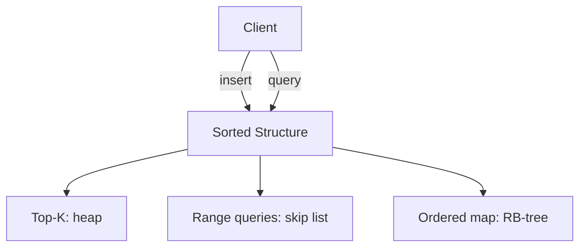

# Bubble Sort — Senior Level

## Table of Contents

1. [Introduction](#introduction)
2. [System Design Reality Check](#system-design-reality-check)
3. [When Bubble Sort Sneaks into Production](#when-bubble-sort-sneaks-into-production)
4. [Sorting Networks and Parallel Bubble Sort](#sorting-networks-and-parallel-bubble-sort)
5. [Distributed Sort and Bubble Sort's Role](#distributed-sort-and-bubble-sorts-role)
6. [Architecture Patterns](#architecture-patterns)
7. [Concurrency and Thread Safety](#concurrency-and-thread-safety)
8. [Code Examples](#code-examples)
9. [Observability](#observability)
10. [Failure Modes](#failure-modes)
11. [Production Anti-Patterns](#production-anti-patterns)
12. [Summary](#summary)

---

## Introduction

> Focus: "How do I architect systems that *don't* end up using Bubble Sort accidentally?"

Senior engineers rarely choose Bubble Sort intentionally. The senior question isn't "how do I use Bubble Sort in production" but rather:

1. **How do I detect that someone *did* use Bubble Sort accidentally** in our codebase, and how do I quantify the impact?
2. **What problems superficially resemble Bubble Sort but are actually fundamentally different** (e.g., parallel sorting networks, online median maintenance)?
3. **When does the *family* of Bubble Sort algorithms (odd-even transposition, cocktail, comb) appear in real systems** like GPU shaders, sorting networks, FPGA pipelines?

We'll cover each of these. The recurring theme: at scale, Bubble Sort's O(n²) is catastrophic. A 10× growth in input means a 100× growth in time. A team that ships Bubble Sort buried inside an inner loop will see latency cliffs as data grows — and the bug can hide for months until a customer's data set crosses some threshold.

---

## System Design Reality Check

### How Bubble Sort Hits Production (and Wrecks It)

Bubble Sort doesn't usually arrive labeled as such. It hides behind innocent-looking patterns:

**Pattern 1: Hand-rolled "is this sorted?" check that becomes a sort.**

```python
# Originally: validate sorted input
def ensure_sorted(items):
    for i in range(len(items) - 1):
        if items[i] > items[i + 1]:
            items[i], items[i + 1] = items[i + 1], items[i]  # "fix it"
    return items
```

This is **one pass of Bubble Sort**. If the input is "mostly sorted," it looks correct in tests. With reverse-sorted input, only the largest element ends up in place; the result is wrong AND silent.

**Pattern 2: Nested loop sort in business code.**

```java
// "fix the order of these line items"
for (LineItem a : items) {
    for (LineItem b : items) {
        if (a.priority < b.priority && items.indexOf(a) > items.indexOf(b)) {
            // swap them somehow
        }
    }
}
```

This is O(n²) at best, O(n³) with `indexOf`. On a 10-element list it's invisible. On a 10,000-element list it's a 30-second request.

**Pattern 3: Linq/Stream patterns that quietly become O(n²).**

```csharp
items.Where(x => items.Count(y => y.Score > x.Score) < 10) // top 10 by Score
```

Looks elegant. It's `O(n²)` because `Count` re-scans for every `x`. For `n = 100k`, that's 10 billion comparisons.

**Engineering response:** Code review checklists, static-analysis rules ("warn on nested loops over the same collection"), and integration tests with realistic data sizes.

---

## When Bubble Sort Sneaks into Production

### Detecting It

| Signal | What to look for | Tool |
|--------|------------------|------|
| Latency cliff at certain input sizes | p99 jumps from 50 ms to 5 s when n crosses some threshold | APM (Datadog, NewRelic) — flame graphs |
| CPU spikes correlated with payload size | Linear payload → quadratic CPU = O(n²) somewhere | Prometheus + trace logs |
| Quadratic growth in unit-test runtime | Test takes 0.1 s for n=100, 10 s for n=1000 → 100× growth = O(n²) | CI duration trends |
| Inner loop calling `indexOf`, `find`, `contains` on the outer collection | Each outer iteration scans entire collection | Static analysis (Sonar, ESLint custom rules) |

### Killing It

When you find an accidental Bubble Sort:

1. **Measure first.** Confirm it's the bottleneck — don't optimize on intuition.
2. **Replace with the language's built-in sort.** Go: `slices.SortFunc`. Java: `Collections.sort`. Python: `sorted` or `list.sort`. All are O(n log n) and battle-tested.
3. **Add a regression test** with realistic n that would fail under O(n²).
4. **Add an SLO/SLI** for this code path so future regressions are caught.

---

## Sorting Networks and Parallel Bubble Sort

### Odd-Even Transposition Sort: The Parallel Bubble Sort

The **only** member of the Bubble Sort family that genuinely matters at scale is **odd-even transposition sort** (also called "brick sort"):

```text
For each phase 0 .. n-1:
    if phase is even:
        in parallel: compare (0,1), (2,3), (4,5), ...
    else:
        in parallel: compare (1,2), (3,4), (5,6), ...
```

Each phase has `~n/2` comparisons that **don't share data** — they can run on independent processors. With `n/2` processors, sorts in **O(n) parallel time** vs. O(n log n) sequential.

### Application: Sorting Networks in Hardware

A **sorting network** is a fixed-circuit comparator topology — every comparison happens at a predetermined position regardless of data. Odd-even transposition is the simplest oblivious sort.

Used in:
- **GPU shaders** for short, fixed-size sorts (e.g., median filter on a 3×3 pixel window)
- **FPGA-based packet routers** that need predictable latency
- **Encrypted computation** (homomorphic encryption requires data-oblivious algorithms)

For these, **bitonic sort** (O(n log² n) parallel time, also a sorting network) usually wins, but odd-even transposition is the conceptual entry point.

### Code: Parallel Odd-Even Sort in Go

#### Go

```go
package main

import (
    "fmt"
    "sync"
)

func oddEvenSortParallel(arr []int) {
    n := len(arr)
    for phase := 0; phase < n; phase++ {
        var wg sync.WaitGroup
        start := phase % 2
        for i := start; i+1 < n; i += 2 {
            wg.Add(1)
            go func(i int) {
                defer wg.Done()
                if arr[i] > arr[i+1] {
                    arr[i], arr[i+1] = arr[i+1], arr[i]
                }
            }(i)
        }
        wg.Wait()
    }
}

func main() {
    data := []int{5, 1, 4, 2, 8, 3, 7, 6}
    oddEvenSortParallel(data)
    fmt.Println(data) // [1 2 3 4 5 6 7 8]
}
```

> **Practical note:** With Go's goroutines, the overhead of spawning a goroutine per comparison (~50 ns) dominates the comparison itself (~1 ns). This is illustrative; real GPU/SIMD implementations use dedicated comparator hardware. For CPU code, batch comparisons into chunks per worker.

---

## Distributed Sort and Bubble Sort's Role

### External / Distributed Sort: Where Bubble Sort *Doesn't* Help

For sorting datasets larger than memory or spanning multiple machines, the production approach is:

1. **Sample-based partitioning** — pick approximate quantiles via reservoir sampling
2. **Distribute** — each node receives one partition
3. **Local sort** — each node runs an in-memory O(n log n) sort (Quick/Merge/Pdqsort)
4. **Merge / shuffle** — concatenate sorted partitions

Bubble Sort has **no role** here. Even at the per-node level, the local sort is O(n log n) because per-node n is still in the millions.

### Where Bubble-Family Helps: GPU-Friendly Sub-Sorts

In Dask/Spark/RAPIDS pipelines on GPUs, very small sub-sorts (per-row top-k, per-window median) sometimes use **sorting networks** internally — odd-even transposition or bitonic — because their oblivious nature plays well with SIMD/CUDA warp execution.

---

## Architecture Patterns

### Pattern: Sort Once, Maintain Sorted

Don't re-sort on every operation. Maintain sorted state via:
- **Insertion** (keep a sorted list and binary-search insert) — O(log n) lookup, O(n) insert
- **Heap** for top-k queries — O(log n) per push/pop
- **B-Tree / skip list / RB-tree** for ordered iteration — O(log n) per op



### Pattern: Detect-and-Refuse Quadratic

In a request-handling tier, set a request payload size limit aligned with your sort budget:

```text
budget = 10 ms
if n > sqrt(budget * ops_per_ms / sort_constant):
    refuse with 413 Payload Too Large
```

For Bubble Sort with ~10 ns per comparison and a 10 ms budget: max n ≈ √(10⁷ / 10) = ~1000.

This is a **load shedding** pattern that catches accidental quadratic blow-ups.

### Pattern: Streaming Median (Sorting Avoidance)

Don't bubble-sort a list every time you need the median. Use:
- **Two heaps** (max-heap for lower half, min-heap for upper half) — O(log n) insert, O(1) median.
- **Online quantile sketches** (P²-quantile, t-digest, GK summary) — sub-linear memory.

---

## Concurrency and Thread Safety

Bubble Sort modifies the array in place. Concurrent access is a nightmare:

- **Read during sort**: returns inconsistent intermediate state.
- **Write during sort**: corrupts the sort, may cause infinite loop or out-of-bounds.

### Correct: Snapshot-then-sort

#### Go

```go
package main

import (
    "fmt"
    "sync"
)

type SortedSnapshot struct {
    mu       sync.RWMutex
    data     []int
    snapshot []int // sorted view, atomic swap
}

func (s *SortedSnapshot) Update(newData []int) {
    s.mu.Lock()
    defer s.mu.Unlock()
    s.data = append([]int(nil), newData...)
    snap := append([]int(nil), s.data...)
    bubbleSort(snap) // sort copy, not original
    s.snapshot = snap
}

func (s *SortedSnapshot) View() []int {
    s.mu.RLock()
    defer s.mu.RUnlock()
    return s.snapshot
}

func bubbleSort(arr []int) {
    n := len(arr)
    for i := 0; i < n-1; i++ {
        swapped := false
        for j := 0; j < n-1-i; j++ {
            if arr[j] > arr[j+1] {
                arr[j], arr[j+1] = arr[j+1], arr[j]
                swapped = true
            }
        }
        if !swapped { return }
    }
}

func main() {
    s := &SortedSnapshot{}
    s.Update([]int{5, 1, 4, 2, 8})
    fmt.Println(s.View())
}
```

#### Java

```java
import java.util.*;
import java.util.concurrent.atomic.AtomicReference;

public class SortedSnapshot {
    private final AtomicReference<int[]> snapshot = new AtomicReference<>(new int[0]);

    public void update(int[] newData) {
        int[] copy = newData.clone();
        bubbleSort(copy);
        snapshot.set(copy); // atomic publish
    }

    public int[] view() {
        return snapshot.get(); // safe to read; treat as immutable
    }

    private static void bubbleSort(int[] arr) {
        int n = arr.length;
        for (int i = 0; i < n - 1; i++) {
            boolean swapped = false;
            for (int j = 0; j < n - 1 - i; j++) {
                if (arr[j] > arr[j + 1]) {
                    int t = arr[j]; arr[j] = arr[j + 1]; arr[j + 1] = t;
                    swapped = true;
                }
            }
            if (!swapped) return;
        }
    }
}
```

#### Python

```python
import threading

class SortedSnapshot:
    def __init__(self):
        self._lock = threading.RLock()
        self._snapshot = []

    def update(self, new_data):
        copy = list(new_data)
        self._bubble_sort(copy)
        with self._lock:
            self._snapshot = copy

    def view(self):
        with self._lock:
            return self._snapshot  # caller must treat as immutable

    @staticmethod
    def _bubble_sort(arr):
        n = len(arr)
        for i in range(n - 1):
            swapped = False
            for j in range(n - 1 - i):
                if arr[j] > arr[j + 1]:
                    arr[j], arr[j + 1] = arr[j + 1], arr[j]
                    swapped = True
            if not swapped:
                return
```

> **Note:** This pattern works for *any* sort, not just bubble. The point is: never sort shared mutable state directly — sort a snapshot and atomically publish.

---

## Code Examples

### Code: Adversarial Test Suite for Bubble-Sort-In-Disguise Detection

Use this in CI to catch accidental quadratic behavior anywhere in your codebase, not just bubble sort.

#### Go

```go
package main

import (
    "fmt"
    "math/rand"
    "testing"
    "time"
)

// Run our suspect function with growing n; assert sub-quadratic growth.
func detectQuadratic(t *testing.T, sortFn func([]int)) {
    sizes := []int{1000, 2000, 4000, 8000}
    times := []time.Duration{}
    for _, n := range sizes {
        data := make([]int, n)
        for i := range data { data[i] = rand.Intn(n) }
        start := time.Now()
        sortFn(data)
        times = append(times, time.Since(start))
    }
    // If doubling n more than triples time → likely O(n^2)
    for i := 1; i < len(times); i++ {
        ratio := float64(times[i]) / float64(times[i-1])
        if ratio > 3.0 {
            t.Errorf("Quadratic growth detected: n=%d→%d, ratio=%.1f",
                     sizes[i-1], sizes[i], ratio)
        }
    }
}

func main() {
    fmt.Println("Use detectQuadratic in tests to flag O(n^2) regressions.")
}
```

This pattern is invaluable: a doubling of input that triples runtime is the smoking gun for quadratic complexity.

---

## Observability

If you suspect or have confirmed Bubble Sort (or any O(n²) hot spot) in production:

| Metric | Threshold | Why |
|--------|-----------|-----|
| `sort_duration_ms_p99` | > 100 ms | Anything sort-related taking 100+ms is suspicious |
| `sort_input_size_p99` | Track over time | Lets you predict latency growth from data growth |
| `sort_input_size_max / sort_duration_ms_max` ratio | Should be ~constant for O(n log n), grows linearly for O(n²) | Cheap quadratic detector |
| CPU profile flame graph | Look for nested loops in sort frames | One frame consuming most of the request = bubble-sort-like |

Set up alerts:
- "p99 latency for endpoint X has doubled in 7 days" — could mean data grew, but should be linear, not quadratic
- "request payload at p99 grew 2× while latency grew 4× → quadratic somewhere"

### Tracing Tags

Annotate your trace spans with input size:
```go
span.SetTag("sort.input_size", len(arr))
span.SetTag("sort.duration_ms", elapsed.Milliseconds())
```

Then plot `duration_ms` vs `input_size` in your APM. A line is O(n log n); a parabola is O(n²).

---

## Failure Modes

| Mode | Symptom | Mitigation |
|------|---------|------------|
| **Quadratic blow-up** | Latency cliff as input grows | Replace with O(n log n); add input-size limits |
| **Concurrent modification** | Inconsistent results, panics | Snapshot-then-sort pattern |
| **Stable-sort assumption broken** | Records re-ordered when sorting by composite key in steps | Verify your sort is stable (Bubble is, Quick isn't typically) |
| **Comparator non-transitive** | Infinite loop or wrong order | Test comparator with random triples |
| **NaN in input** | Undefined order | Pre-filter NaN |
| **Floating-point inequality flapping** | "Sorted" arrays that fail `is_sorted()` checks | Use ε-tolerance comparison or canonical key |

---

## Production Anti-Patterns

1. **`for x in list: for y in list: ...`** — almost always a sign you should use a hash map, sort, or two-pointer technique.
2. **`list.indexOf(item)` inside a loop over `list`** — O(n²). Replace with index tracked during iteration.
3. **`Collections.sort(...)` called repeatedly inside a loop** — re-sort on every outer iteration. Use a sorted data structure or sort once outside.
4. **Custom "simple" sort because "the data is small"** — small data grows. Use the language's built-in, always.
5. **Sorting in the database layer with `ORDER BY` and then re-sorting in the application** — wastes work. Pick one place to enforce order.

---

## Summary

At senior level, your job isn't to *use* Bubble Sort — it's to *prevent its accidental appearance* and to *recognize the rare cases* where its parallel cousin (odd-even transposition / sorting networks) is the right tool. Detect quadratic behavior with payload-vs-latency observability. Replace accidental Bubble Sort with the language's built-in sort. Reach for sorting networks only when you need data-oblivious or hardware-pipelined sorting (GPUs, FPGAs, encrypted computation).

The mental model: **Bubble Sort is the smell of unscalable code.** When you see it, treat it like a memory leak — quantify, isolate, and replace.
