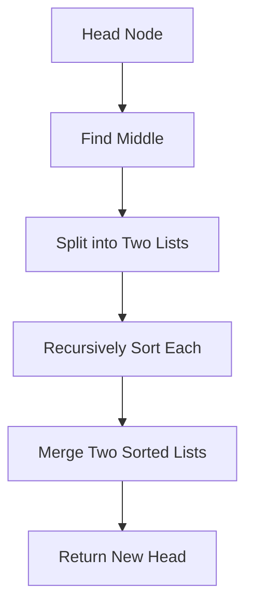

# Merge Sort — Junior Level

## Table of Contents

1. [Introduction](#introduction)
2. [Prerequisites](#prerequisites)
3. [Glossary](#glossary)
4. [Core Concepts](#core-concepts)
5. [Big-O Summary](#big-o-summary)
6. [Real-World Analogies](#real-world-analogies)
7. [Pros & Cons](#pros--cons)
8. [Step-by-Step Walkthrough](#step-by-step-walkthrough)
9. [Code Examples](#code-examples)
10. [Coding Patterns](#coding-patterns)
11. [Error Handling](#error-handling)
12. [Performance Tips](#performance-tips)
13. [Best Practices](#best-practices)
14. [Edge Cases & Pitfalls](#edge-cases--pitfalls)
15. [Common Mistakes](#common-mistakes)
16. [Cheat Sheet](#cheat-sheet)
17. [Visual Animation](#visual-animation)
18. [Summary](#summary)
19. [Further Reading](#further-reading)

---

## Introduction

> Focus: "What is Merge Sort?" and "How does divide-and-conquer work?"

**Merge Sort** is the canonical example of the **divide-and-conquer** algorithmic strategy. It works by recursively splitting an array into halves, sorting each half independently, and then **merging** the two sorted halves back into one sorted whole. The merge step is what gives the algorithm its name and its power: merging two sorted arrays of total size `n` takes only **O(n)** time.

Invented by John von Neumann in 1945, Merge Sort was one of the first algorithms designed for stored-program computers. Today it remains one of the most important sorts because:

1. It is **O(n log n)** in **all cases** — best, average, and worst — unlike Quick Sort which degrades to O(n²) on bad input.
2. It is **stable** — equal elements preserve their original relative order.
3. It works beautifully on **linked lists** (the only sort that does — no extra space needed for linked-list merge sort).
4. It is the **only practical sort for data that doesn't fit in memory** ("external merge sort" reads chunks from disk, sorts them, and merges).
5. It forms the basis of **TimSort** — Python's `sorted()`, Java's `Arrays.sort` (for objects), and Android's default sort.

The trade-off: standard array Merge Sort uses **O(n) auxiliary space** for the merge buffer, making it heavier on memory than in-place sorts like Quick Sort or Heap Sort.

---

## Prerequisites

- **Required:** Recursion fundamentals — base case, recursive call, returning values
- **Required:** Arrays/slices/lists — indexing, slicing, length
- **Required:** Function calls and the call stack — what happens when a function calls itself
- **Helpful:** Understanding of `O(n)` and `O(n log n)` — see [`06-algorithmic-complexity/`](../../06-algorithmic-complexity/)
- **Helpful:** Familiarity with **Bubble Sort** or **Insertion Sort** to appreciate the speedup
- **Helpful:** Understanding of "divide and conquer" as a problem-solving strategy

---

## Glossary

| Term | Definition |
|------|-----------|
| **Divide and Conquer** | Algorithm strategy: split problem into smaller subproblems, solve recursively, combine |
| **Recursion** | Function calling itself with a smaller version of the original problem |
| **Base Case** | The simplest case the recursion handles directly without further calls (e.g., 1 element) |
| **Merge** | Combine two sorted arrays into one sorted array — O(n + m) time |
| **Two-Pointer Technique** | Walk two arrays in parallel using independent index pointers |
| **Stable Sort** | Preserves relative order of equal elements |
| **In-Place** | Modifies input directly using O(1) extra space (Merge Sort is **NOT** in-place in standard form) |
| **Auxiliary Buffer** | Extra array used to hold merged output before copying back |
| **Top-Down** | Recursive form: split first, then merge as recursion unwinds |
| **Bottom-Up** | Iterative form: merge pairs of size 1, then 2, then 4, etc. |
| **External Sort** | Sort for data larger than RAM — reads from disk in chunks (Merge Sort is the canonical external sort) |
| **TimSort** | Hybrid Merge + Insertion Sort used by Python, Java (objects), Android |
| **Recurrence Relation** | T(n) = 2T(n/2) + O(n) — the math that gives Merge Sort its O(n log n) bound |

---

## Core Concepts

### Concept 1: Divide and Conquer in Three Steps

Every divide-and-conquer algorithm follows the same template:
1. **Divide:** split the problem into smaller subproblems (here: split array in half).
2. **Conquer:** recursively solve each subproblem (sort each half).
3. **Combine:** merge the subproblem solutions into the answer (merge the sorted halves).

For Merge Sort:
- Divide: split `arr[low..high]` at `mid = (low + high) / 2` into `arr[low..mid]` and `arr[mid+1..high]`.
- Conquer: recursively sort both halves.
- Combine: merge the two sorted halves into one sorted range.

### Concept 2: The Merge Step Is the Heart of the Algorithm

The merge takes two **already-sorted** arrays A and B and produces one sorted array C. It uses the two-pointer technique:

```text
i = 0; j = 0; k = 0
while i < len(A) and j < len(B):
    if A[i] <= B[j]:
        C[k] = A[i]; i++
    else:
        C[k] = B[j]; j++
    k++
copy any leftover from A or B into C
```

**Why this works:** at every step, the smallest unused element from A or B is appended to C. Since both A and B are sorted, this gives C in sorted order. Time: O(|A| + |B|), space: O(|A| + |B|) for C.

### Concept 3: Splitting Halves Costs Nothing (Almost)

Splitting `arr[low..high]` into two halves doesn't actually copy data — we just compute `mid` and recurse on the two index ranges. This is **O(1)** per split, but the recursion depth is **O(log n)**: we halve the range each level until we hit single elements.

### Concept 4: Why O(n log n)?

There are `log₂(n)` levels of recursion (because we halve each time until size 1). At each level, the total work across all merges is **O(n)** — every element is touched exactly once per level. So total work is **O(n) × O(log n) = O(n log n)**.

Mathematically:
```text
T(n) = 2 · T(n/2) + O(n)   (split into 2, recurse, merge in O(n))
T(1) = O(1)
By Master Theorem (case 2): T(n) = O(n log n)
```

### Concept 5: Stability — Equal Elements Stay in Order

When merging, if `A[i] == B[j]`, we take from A first (using `<=` not `<`). This guarantees that elements from the left half (which appeared earlier in the original array) come before equal elements from the right half. Stability matters for sorting by multiple keys: sort by date first, then by name → records with the same date stay in date-sort order.

### Concept 6: The O(n) Space Cost

Standard array Merge Sort allocates a temporary buffer of size n for each merge. After the merge, we copy back to the original array. That's the price for the algorithm's simplicity and stability. There IS an "in-place" merge sort algorithm but it's complex (block merge sort), slower in practice, and rarely used.

For **linked lists**, Merge Sort is naturally in-place: nodes can be relinked without copying values, so no auxiliary buffer is needed.

---

## Big-O Summary

| Operation / Case | Complexity | Notes |
|-----------------|-----------|-------|
| Time — Best | **O(n log n)** | No early-exit advantage |
| Time — Average | **O(n log n)** | Same as best/worst |
| Time — Worst | **O(n log n)** | **Predictable** — never O(n²) |
| Space — Auxiliary (array) | **O(n)** | Merge buffer |
| Space — Auxiliary (linked list) | **O(log n)** | Recursion stack only |
| Stable | **Yes** | Take from left when equal |
| In-place | **No** (standard array) / Yes (linked list) | |
| Adaptive | **No** (standard) / Yes (TimSort) | Doesn't speed up on sorted input |
| Comparisons (worst) | n log₂ n − n + 1 | Tightest known bound |
| Best for | External sort, linked lists, stable sort | |

---

## Real-World Analogies

| Concept | Analogy |
|---------|--------|
| **Splitting in half** | A team divides a stack of papers into two piles — each person sorts theirs |
| **Merging sorted halves** | Two checkout lines merging into one — pick whoever is shorter (smaller) at each moment |
| **Recursion levels** | Tournament bracket: 8 → 4 → 2 → 1 finalist; merging is "unwind the bracket" |
| **Stability** | Two students with the same height in line — the one who arrived first stays in front |
| **External sort** | Sorting a phone book that won't fit on your desk: sort one drawer at a time, then merge drawers two at a time |

> **Where the analogy breaks:** in real life, merging two checkout lines doesn't require copying everyone to a third line — Merge Sort does, because arrays don't have an "insert in the middle" operation. Linked lists don't have this issue.

---

## Pros & Cons

| Pros | Cons |
|------|------|
| **Guaranteed O(n log n)** — never degrades to O(n²) | **O(n) extra space** (array version) |
| **Stable** — preserves relative order of equals | Not in-place for arrays — copies elements |
| **Excellent for linked lists** — true in-place, no buffer needed | Recursion overhead for small arrays |
| **The standard external sort** — handles datasets > RAM | Cache-unfriendly compared to Quick Sort |
| **Parallelizable** — independent halves run on separate cores | More memory bandwidth than in-place sorts |
| **Predictable runtime** — same time on any input shape | Not adaptive (vanilla version doesn't speed up on sorted input) |

**When to use:**
- You need **stability** and predictable O(n log n) — Merge Sort is your default.
- Sorting **linked lists** — Merge Sort is the only practical choice.
- **External sort** for data larger than RAM (database engines, big-data tools).
- **Parallel sort** on multi-core systems.
- Any time **worst-case guarantee** matters more than peak speed (real-time systems, latency-sensitive APIs).

**When NOT to use:**
- **Memory-constrained** environments where O(n) auxiliary is too much.
- **Small arrays** (n ≤ 10) where Insertion Sort is faster due to recursion overhead.
- **Cache-bound** numeric workloads where Quick Sort's locality wins.

---

## Step-by-Step Walkthrough

Sorting `[5, 2, 8, 1, 9, 3, 7, 4]` (8 elements):

**Divide phase (top-down):**
```
Level 0:  [5, 2, 8, 1, 9, 3, 7, 4]
            /                    \
Level 1:  [5, 2, 8, 1]      [9, 3, 7, 4]
            /     \            /      \
Level 2:  [5, 2]  [8, 1]    [9, 3]  [7, 4]
           /  \   /  \       /  \    /  \
Level 3:  [5][2][8][1]      [9][3] [7][4]   ← base case (size 1)
```

**Merge phase (combine sorted pairs back up):**

Level 2 (merge size-1 pairs):
- merge `[5]` + `[2]` → `[2, 5]`
- merge `[8]` + `[1]` → `[1, 8]`
- merge `[9]` + `[3]` → `[3, 9]`
- merge `[7]` + `[4]` → `[4, 7]`

Level 1 (merge size-2 pairs):
- merge `[2, 5]` + `[1, 8]` → `[1, 2, 5, 8]`
- merge `[3, 9]` + `[4, 7]` → `[3, 4, 7, 9]`

Level 0 (final merge of size-4 arrays):
- merge `[1, 2, 5, 8]` + `[3, 4, 7, 9]` → step by step:
  - i=0, j=0: 1 vs 3 → take 1 → `[1]`
  - i=1, j=0: 2 vs 3 → take 2 → `[1, 2]`
  - i=2, j=0: 5 vs 3 → take 3 → `[1, 2, 3]`
  - i=2, j=1: 5 vs 4 → take 4 → `[1, 2, 3, 4]`
  - i=2, j=2: 5 vs 7 → take 5 → `[1, 2, 3, 4, 5]`
  - i=3, j=2: 8 vs 7 → take 7 → `[1, 2, 3, 4, 5, 7]`
  - i=3, j=3: 8 vs 9 → take 8 → `[1, 2, 3, 4, 5, 7, 8]`
  - left side empty → copy 9 → `[1, 2, 3, 4, 5, 7, 8, 9]` ✓

**Total comparisons:** ~17 (vs. Bubble Sort's ~28 for the same input).
**Levels of recursion:** 3 (= log₂ 8).
**Work per level:** O(n) = 8.

---

## Code Examples

### Example 1: Top-Down Recursive Merge Sort (Standard)

#### Go

```go
package main

import "fmt"

// MergeSort sorts arr ascending using divide-and-conquer.
// Time: O(n log n) all cases. Space: O(n) auxiliary.
func MergeSort(arr []int) []int {
    if len(arr) <= 1 {
        return arr
    }
    mid := len(arr) / 2
    left := MergeSort(append([]int{}, arr[:mid]...))
    right := MergeSort(append([]int{}, arr[mid:]...))
    return merge(left, right)
}

func merge(left, right []int) []int {
    result := make([]int, 0, len(left)+len(right))
    i, j := 0, 0
    for i < len(left) && j < len(right) {
        if left[i] <= right[j] { // <= for stability
            result = append(result, left[i])
            i++
        } else {
            result = append(result, right[j])
            j++
        }
    }
    result = append(result, left[i:]...)
    result = append(result, right[j:]...)
    return result
}

func main() {
    data := []int{5, 2, 8, 1, 9, 3, 7, 4}
    sorted := MergeSort(data)
    fmt.Println(sorted) // [1 2 3 4 5 7 8 9]
}
```

#### Java

```java
import java.util.Arrays;

public class MergeSort {
    public static int[] mergeSort(int[] arr) {
        if (arr.length <= 1) return arr;
        int mid = arr.length / 2;
        int[] left  = mergeSort(Arrays.copyOfRange(arr, 0, mid));
        int[] right = mergeSort(Arrays.copyOfRange(arr, mid, arr.length));
        return merge(left, right);
    }

    private static int[] merge(int[] left, int[] right) {
        int[] result = new int[left.length + right.length];
        int i = 0, j = 0, k = 0;
        while (i < left.length && j < right.length) {
            if (left[i] <= right[j]) result[k++] = left[i++];
            else                     result[k++] = right[j++];
        }
        while (i < left.length)  result[k++] = left[i++];
        while (j < right.length) result[k++] = right[j++];
        return result;
    }

    public static void main(String[] args) {
        int[] data = {5, 2, 8, 1, 9, 3, 7, 4};
        System.out.println(Arrays.toString(mergeSort(data)));
    }
}
```

#### Python

```python
def merge_sort(arr):
    """Sort arr ascending. Time: O(n log n). Space: O(n)."""
    if len(arr) <= 1:
        return arr
    mid = len(arr) // 2
    left = merge_sort(arr[:mid])
    right = merge_sort(arr[mid:])
    return merge(left, right)

def merge(left, right):
    result = []
    i = j = 0
    while i < len(left) and j < len(right):
        if left[i] <= right[j]:  # <= for stability
            result.append(left[i])
            i += 1
        else:
            result.append(right[j])
            j += 1
    result.extend(left[i:])
    result.extend(right[j:])
    return result

if __name__ == "__main__":
    data = [5, 2, 8, 1, 9, 3, 7, 4]
    print(merge_sort(data))  # [1, 2, 3, 4, 5, 7, 8, 9]
```

**What it does:** Splits `arr` in half, recursively sorts each half, then merges. Returns a NEW sorted array (does not mutate input).
**Run:** `go run main.go` | `javac MergeSort.java && java MergeSort` | `python merge.py`

---

### Example 2: In-Place Merge Sort (Reuses One Buffer)

#### Go

```go
package main

import "fmt"

// MergeSortInPlace sorts arr in place using a single auxiliary buffer.
// More efficient than the simple version: avoids per-call allocations.
func MergeSortInPlace(arr []int) {
    aux := make([]int, len(arr))
    mergeSortHelper(arr, aux, 0, len(arr)-1)
}

func mergeSortHelper(arr, aux []int, lo, hi int) {
    if lo >= hi { return }
    mid := lo + (hi-lo)/2
    mergeSortHelper(arr, aux, lo, mid)
    mergeSortHelper(arr, aux, mid+1, hi)
    mergeInPlace(arr, aux, lo, mid, hi)
}

func mergeInPlace(arr, aux []int, lo, mid, hi int) {
    // Copy range to aux
    for k := lo; k <= hi; k++ {
        aux[k] = arr[k]
    }
    i, j := lo, mid+1
    for k := lo; k <= hi; k++ {
        if i > mid                  { arr[k] = aux[j]; j++
        } else if j > hi            { arr[k] = aux[i]; i++
        } else if aux[i] <= aux[j]  { arr[k] = aux[i]; i++  // <= for stability
        } else                      { arr[k] = aux[j]; j++ }
    }
}

func main() {
    data := []int{5, 2, 8, 1, 9, 3, 7, 4}
    MergeSortInPlace(data)
    fmt.Println(data)
}
```

#### Java

```java
import java.util.Arrays;

public class MergeSortInPlace {
    public static void sort(int[] arr) {
        int[] aux = new int[arr.length];
        sortHelper(arr, aux, 0, arr.length - 1);
    }

    private static void sortHelper(int[] arr, int[] aux, int lo, int hi) {
        if (lo >= hi) return;
        int mid = lo + (hi - lo) / 2;
        sortHelper(arr, aux, lo, mid);
        sortHelper(arr, aux, mid + 1, hi);
        merge(arr, aux, lo, mid, hi);
    }

    private static void merge(int[] arr, int[] aux, int lo, int mid, int hi) {
        for (int k = lo; k <= hi; k++) aux[k] = arr[k];
        int i = lo, j = mid + 1;
        for (int k = lo; k <= hi; k++) {
            if      (i > mid)                arr[k] = aux[j++];
            else if (j > hi)                 arr[k] = aux[i++];
            else if (aux[i] <= aux[j])       arr[k] = aux[i++];
            else                             arr[k] = aux[j++];
        }
    }

    public static void main(String[] args) {
        int[] data = {5, 2, 8, 1, 9, 3, 7, 4};
        sort(data);
        System.out.println(Arrays.toString(data));
    }
}
```

#### Python

```python
def merge_sort_in_place(arr):
    """Sort arr in place using a single auxiliary buffer."""
    aux = [0] * len(arr)
    _sort(arr, aux, 0, len(arr) - 1)

def _sort(arr, aux, lo, hi):
    if lo >= hi:
        return
    mid = (lo + hi) // 2
    _sort(arr, aux, lo, mid)
    _sort(arr, aux, mid + 1, hi)
    _merge(arr, aux, lo, mid, hi)

def _merge(arr, aux, lo, mid, hi):
    for k in range(lo, hi + 1):
        aux[k] = arr[k]
    i, j = lo, mid + 1
    for k in range(lo, hi + 1):
        if i > mid:
            arr[k] = aux[j]; j += 1
        elif j > hi:
            arr[k] = aux[i]; i += 1
        elif aux[i] <= aux[j]:
            arr[k] = aux[i]; i += 1
        else:
            arr[k] = aux[j]; j += 1

if __name__ == "__main__":
    data = [5, 2, 8, 1, 9, 3, 7, 4]
    merge_sort_in_place(data)
    print(data)
```

**What it does:** Allocates ONE auxiliary buffer reused for all merges. Mutates input. Same Big-O, much less memory traffic than Example 1.

---

### Example 3: Bottom-Up (Iterative) Merge Sort

#### Go

```go
package main

import "fmt"

// MergeSortBottomUp uses iteration instead of recursion.
// Conceptually: merge size-1 pairs, then size-2, then size-4, etc.
func MergeSortBottomUp(arr []int) {
    n := len(arr)
    aux := make([]int, n)
    for size := 1; size < n; size *= 2 {
        for lo := 0; lo < n-size; lo += size * 2 {
            mid := lo + size - 1
            hi := min(lo+size*2-1, n-1)
            mergeBU(arr, aux, lo, mid, hi)
        }
    }
}

func mergeBU(arr, aux []int, lo, mid, hi int) {
    for k := lo; k <= hi; k++ { aux[k] = arr[k] }
    i, j := lo, mid+1
    for k := lo; k <= hi; k++ {
        if i > mid                 { arr[k] = aux[j]; j++
        } else if j > hi           { arr[k] = aux[i]; i++
        } else if aux[i] <= aux[j] { arr[k] = aux[i]; i++
        } else                     { arr[k] = aux[j]; j++ }
    }
}

func min(a, b int) int { if a < b { return a }; return b }

func main() {
    data := []int{5, 2, 8, 1, 9, 3, 7, 4}
    MergeSortBottomUp(data)
    fmt.Println(data)
}
```

#### Python

```python
def merge_sort_bottom_up(arr):
    """Iterative merge sort: merge size-1 pairs, then 2, 4, 8, ..."""
    n = len(arr)
    aux = [0] * n
    size = 1
    while size < n:
        for lo in range(0, n - size, size * 2):
            mid = lo + size - 1
            hi = min(lo + size * 2 - 1, n - 1)
            _merge(arr, aux, lo, mid, hi)
        size *= 2

def _merge(arr, aux, lo, mid, hi):
    for k in range(lo, hi + 1):
        aux[k] = arr[k]
    i, j = lo, mid + 1
    for k in range(lo, hi + 1):
        if i > mid:        arr[k] = aux[j]; j += 1
        elif j > hi:       arr[k] = aux[i]; i += 1
        elif aux[i] <= aux[j]: arr[k] = aux[i]; i += 1
        else:              arr[k] = aux[j]; j += 1

data = [5, 2, 8, 1, 9, 3, 7, 4]
merge_sort_bottom_up(data)
print(data)
```

**Why bottom-up?** No recursion → no stack overflow risk for huge arrays. Slightly more cache-friendly. Same Big-O.

---

## Coding Patterns

### Pattern 1: Two-Pointer Merge

**Intent:** Walk two sorted sequences in parallel, picking the smaller current element each step.

```python
def merge(left, right):
    out = []
    i = j = 0
    while i < len(left) and j < len(right):
        if left[i] <= right[j]:
            out.append(left[i]); i += 1
        else:
            out.append(right[j]); j += 1
    out += left[i:]; out += right[j:]
    return out
```

This pattern is reusable: merging k sorted streams, merging sorted lists in DBs, merging two database query results.

### Pattern 2: Divide-Recurse-Combine Template

**Intent:** Generic divide-and-conquer skeleton.

```python
def divide_and_conquer(input):
    if base_case(input):
        return base_solution(input)
    parts = divide(input)
    sub_solutions = [divide_and_conquer(p) for p in parts]
    return combine(sub_solutions)
```

Used in: Merge Sort, Quick Sort (no combine needed), Karatsuba multiplication, FFT, closest-pair-of-points.

### Pattern 3: Sort Linked List Without Extra Space

**Intent:** Merge Sort on a linked list — only O(log n) stack space.



```python
class Node:
    def __init__(self, val, nxt=None):
        self.val = val
        self.next = nxt

def merge_sort_list(head):
    if head is None or head.next is None:
        return head
    # Find middle using slow/fast pointers
    slow, fast = head, head.next
    while fast and fast.next:
        slow = slow.next
        fast = fast.next.next
    mid = slow.next
    slow.next = None  # split

    left = merge_sort_list(head)
    right = merge_sort_list(mid)
    return merge_lists(left, right)

def merge_lists(l, r):
    dummy = Node(0)
    tail = dummy
    while l and r:
        if l.val <= r.val:
            tail.next = l; l = l.next
        else:
            tail.next = r; r = r.next
        tail = tail.next
    tail.next = l or r
    return dummy.next
```

---

## Error Handling

| Error | Cause | Fix |
|-------|-------|-----|
| `RecursionError` / `StackOverflowError` | Recursion depth exceeded for huge arrays | Use bottom-up (iterative) merge sort, or increase stack size |
| `IndexError` / `panic: index out of range` | Inner merge index past array end | Always check `i < len(left)` AND `j < len(right)` |
| Lost stability | Used `<` instead of `<=` in merge condition | Use `<=` to prefer left side on ties |
| `MemoryError` | Allocating O(n) buffer for huge n | Use external sort (chunks of disk) or in-place variant |
| Off-by-one in `mid` | `mid = (lo + hi) / 2` integer overflow on huge n | Use `mid = lo + (hi - lo) / 2` |
| Wrong answer (sorted but missing elements) | Forgot to copy leftover elements after main loop | Always include `result += left[i:]; result += right[j:]` |

---

## Performance Tips

- **Use ONE preallocated buffer** for all merges (Example 2), not per-call allocation (Example 1). 5-10× speedup in practice.
- **Switch to Insertion Sort for small subarrays** (n ≤ 10-16). Merge Sort's recursion overhead dominates at tiny sizes. This is the hybrid approach used by TimSort.
- **Use `mid = lo + (hi - lo) / 2`** to avoid integer overflow for large arrays.
- **For linked lists, use Merge Sort.** No other O(n log n) sort works in O(1) extra space on linked lists.
- **For parallel sort,** Merge Sort is naturally parallel — sort the two halves on different threads.

---

## Best Practices

- **Document mutation:** "in-place" or "returns new array" — be explicit.
- **Test edge cases:** empty array, single element, two elements, all equal, already sorted, reverse sorted, duplicates, negative numbers.
- **Implement at least one variant from scratch** before using a library — both top-down and bottom-up.
- **Use `<=` (not `<`)** in the merge condition — this is the difference between stable and unstable.
- **Prefer iterative bottom-up for very deep recursion** (n > 10⁶ might blow the stack on default Python settings).
- **For production:** use the language's built-in stable sort (`sorted` in Python, `Collections.sort` in Java) — they are TimSort, which is Merge Sort + Insertion Sort hybrid.

---

## Edge Cases & Pitfalls

- **Empty array (`[]`)** → base case `len(arr) <= 1` returns immediately. ✓
- **Single element (`[42]`)** → base case returns. ✓
- **Two elements (`[2, 1]`)** → split into `[2]` and `[1]`, merge → `[1, 2]`. ✓
- **All equal (`[3, 3, 3, 3]`)** → still O(n log n); stability matters here.
- **Already sorted (`[1, 2, 3, 4]`)** → still O(n log n) — vanilla Merge Sort is **not** adaptive. TimSort is.
- **Reverse sorted (`[4, 3, 2, 1]`)** → still O(n log n). Merge Sort doesn't care about input shape.
- **Duplicates** → must use `<=` in merge to keep them stable.
- **Floating-point with NaN** → `NaN <= x` returns false → NaNs cluster on the right. Filter NaN first.
- **Recursion depth** → Python default limit is ~1000; for arrays > 2¹⁰ use iterative bottom-up or `sys.setrecursionlimit`.
- **Linked list with 0 or 1 nodes** → base case `head is None or head.next is None` returns directly.

---

## Common Mistakes

1. **Using `<` instead of `<=` in merge** → loses stability silently.
2. **Forgetting to copy leftovers** after the main merge loop → some elements missing from output.
3. **Allocating new arrays for every recursive call** (Example 1 style in production) → excessive memory traffic; use Example 2 / one shared buffer.
4. **Computing `mid = (lo + hi) / 2`** → integer overflow for large arrays. Use `lo + (hi - lo) / 2`.
5. **Returning the array from `merge_sort` but ignoring the return value** when the user expects in-place behavior.
6. **Calling `merge_sort` on a slice/view but mutating the underlying array** → unexpected side effects. Be clear about ownership.
7. **Linked list: forgetting to set `slow.next = None`** before recursing → infinite loop.
8. **Using `arr[:mid]` and `arr[mid:]` in Python recursively** → creates new arrays at every level → O(n log n) extra memory traffic on top of O(n) merge buffer.

---

## Cheat Sheet

```text
Merge Sort — Quick Reference

ALGORITHM (top-down):
    sort(arr):
        if len(arr) <= 1: return arr
        mid = len(arr) // 2
        left  = sort(arr[:mid])
        right = sort(arr[mid:])
        return merge(left, right)

    merge(L, R):
        out = []
        i = j = 0
        while i < |L| and j < |R|:
            if L[i] <= R[j]: out.append(L[i]); i++
            else:            out.append(R[j]); j++
        out += L[i:]; out += R[j:]
        return out

COMPLEXITY:
    Time:   O(n log n)  in ALL cases
    Space:  O(n) (array) | O(log n) (linked list)
    Stable: YES (with <=)
    In-place: NO (array) | YES (linked list)

WHEN TO USE:
    - Need stability + worst-case O(n log n)
    - Sorting linked lists
    - External sort (data > RAM)
    - Parallel sort

NEVER USE FOR:
    - Memory-constrained tiny arrays (use Insertion Sort)
    - Numerical hot loops where Quick Sort's cache wins
```

---

## Visual Animation

> See [`animation.html`](./animation.html) for an interactive visual animation of Merge Sort.
>
> The animation demonstrates:
> - Recursive splitting into halves (top-down view)
> - Merging two sorted halves with two-pointer technique
> - Color-coded states: dividing (purple), comparing (red), merging (yellow), sorted (green)
> - Live counters: comparisons, merges, recursion depth
> - Speed control + step mode
> - Tree visualization showing the divide-and-conquer recursion

---

## Summary

Merge Sort is the canonical **divide-and-conquer** sort: split, recurse, merge. It guarantees **O(n log n)** in all cases (best, average, worst), is **stable**, and is the only practical sort for **linked lists** and **external (disk-based) data**. The cost is **O(n) extra space** for the merge buffer.

Master Merge Sort because:
1. It's the foundation of TimSort (Python, Java) — the most common production sort.
2. It teaches divide-and-conquer — a strategy used in Quick Sort, FFT, Karatsuba, closest-pair, and many more.
3. The merge step (two-pointer) is reused everywhere: merging streams, joining sorted query results, k-way merges in databases.

Two essential takeaways:
1. **Always use `<=`** in the merge condition to preserve stability.
2. **Reuse one auxiliary buffer** instead of allocating new arrays per recursive call — same Big-O, much faster in practice.

Move next to **Quick Sort** (`04-quick-sort/`) to see the in-place divide-and-conquer alternative, or **Insertion Sort** (`03-insertion-sort/`) to understand the small-array optimization that hybrid sorts (TimSort) layer on top of Merge Sort.

---

## Further Reading

- **CLRS — Introduction to Algorithms (4th ed.)**, Chapter 2.3 (Merge Sort) and Chapter 4 (Master Theorem)
- **Sedgewick & Wayne — Algorithms (4th ed.)**, Section 2.2 (mergesort)
- **Knuth — TAOCP Vol. 3**, Section 5.2.4 (sorting by merging)
- **TimSort original spec** — [github.com/python/cpython/Objects/listsort.txt](https://github.com/python/cpython/blob/main/Objects/listsort.txt)
- **External sort survey** — Garcia-Molina, "Database Systems: The Complete Book", Chapter 11
- Go: [`sort.Slice`](https://pkg.go.dev/sort) docs
- Java: [`Arrays.sort`](https://docs.oracle.com/javase/8/docs/api/java/util/Arrays.html) — TimSort for objects, Dual-Pivot Quick Sort for primitives
- Python: [`sorted` and `list.sort`](https://docs.python.org/3/library/functions.html#sorted) — TimSort
- [visualgo.net/en/sorting](https://visualgo.net/en/sorting) — interactive merge sort animation
