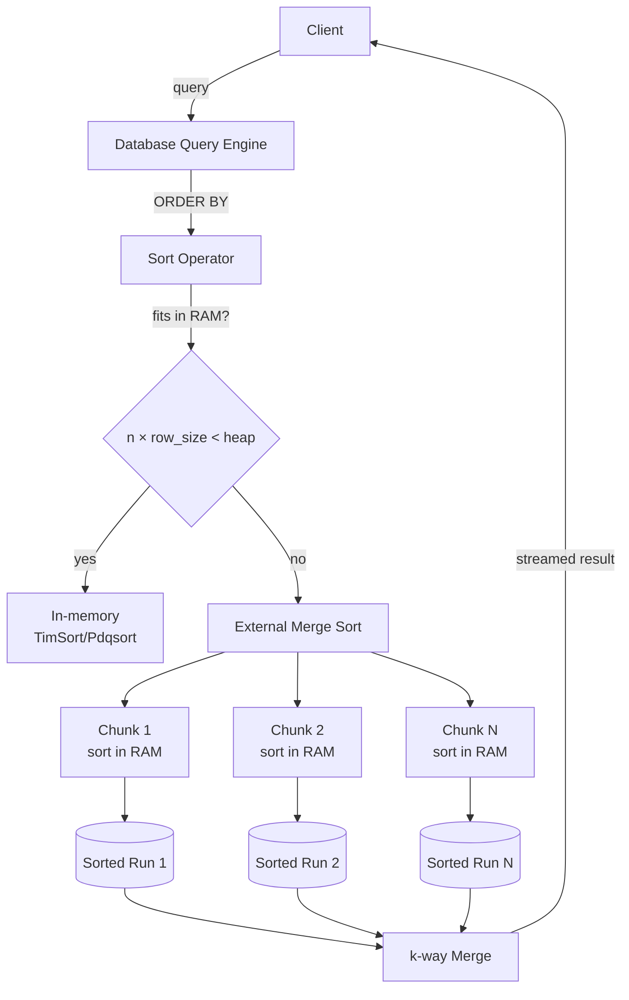
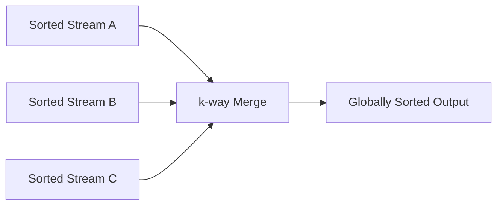

# Merge Sort — Senior Level

## Table of Contents

1. [Introduction](#introduction)
2. [System Design with Merge Sort](#system-design-with-merge-sort)
3. [External Merge Sort — The Database Workhorse](#external-merge-sort)
4. [Distributed Merge Sort (MapReduce, Spark)](#distributed-merge-sort)
5. [Parallel Merge Sort on Multi-Core](#parallel-merge-sort-on-multi-core)
6. [Architecture Patterns](#architecture-patterns)
7. [Code Examples](#code-examples)
8. [Observability](#observability)
9. [Failure Modes](#failure-modes)
10. [Production Trade-offs](#production-trade-offs)
11. [Summary](#summary)

---

## Introduction

> Focus: "How do I architect systems around Merge Sort at scale?"

At the senior level, Merge Sort isn't just a sort — it's the **architectural primitive** behind:
- **Database query engines** (`ORDER BY`, `GROUP BY`, sort-merge join)
- **MapReduce / Spark / Flink** shuffle phase
- **Lucene/Elasticsearch** segment merging
- **Kafka log compaction** and topic partition merging
- **Time-series databases** (InfluxDB, TimescaleDB) merging shards
- **External sort** for any data > RAM
- **Parallel sort** in language runtimes (`java.util.Arrays.parallelSort`, `std::execution::par`)

The senior engineer's job is to recognize when a problem reduces to "sort and merge," choose the right variant (in-memory, external, parallel, distributed), size the resources (RAM, disk, network), and operate the system (monitor merge throughput, set alerts, plan capacity).

---

## System Design with Merge Sort



The decision: **Does the dataset fit in RAM?**
- Yes → in-memory sort (TimSort, Pdqsort).
- No → external merge sort.

The threshold is typically **80-90% of available heap** to leave room for working memory.

---

## External Merge Sort

The standard algorithm for sorting data larger than RAM. Used by every major database (PostgreSQL, MySQL, Oracle, SQL Server) for `ORDER BY` over large result sets, and by every big-data engine (Spark, Flink, Hadoop) for the shuffle phase.

### Two-Phase Algorithm

**Phase 1 — Run Generation (Sort Phase):**
```text
While input has data:
    read RAM-sized chunk
    sort chunk in memory (TimSort / Pdqsort)
    write sorted chunk to disk as "Run i"
```

**Phase 2 — Merge Phase:**
```text
While > 1 run remains on disk:
    pick k runs (k limited by RAM / number of file handles)
    k-way merge using min-heap
    write result as "Run k+1"
    delete merged inputs
```

### Sizing the Algorithm

For input size N and memory M:
- Phase 1 produces ⌈N / M⌉ runs.
- Phase 2 takes ⌈log_k(N / M)⌉ passes if you do k-way merges.

For N = 1 TB, M = 16 GB, k = 16: **2 passes** to merge everything. Total I/O: 2N read + 2N write = 4N.

### Optimizing External Sort

| Technique | What it does | Win |
|-----------|--------------|-----|
| **k-way merge** with heap | Merge k runs at once instead of pairwise | Reduces # passes from log₂(N/M) to log_k(N/M) |
| **Replacement selection** | Generate runs of length 2M instead of M (using a heap) | Halves the number of runs |
| **Compression** | Compress runs on disk | Less I/O |
| **Async I/O** | Read next chunk while merging current | Hides disk latency |
| **NVMe / SSD** | Random reads ~100× faster than spinning disk | Fewer constraints on k |

### Reference: Replacement Selection

Instead of "fill RAM, sort, write," replacement selection uses a **min-heap of size M**:
1. Fill heap with first M elements.
2. Pop min, write to current run, read next input.
3. If next input ≥ last output, push to heap (current run can include it).
4. Else, push to heap with a "frozen" flag (belongs to next run).
5. When heap is empty of "current run" elements, current run is done.

**Result:** Average run length is **2M** (vs M for the basic algorithm). Halves the number of runs and merge passes.

---

## Distributed Merge Sort

### MapReduce / Hadoop Shuffle

The "shuffle" phase in MapReduce IS a distributed merge sort:
1. **Map** stage produces key-value pairs.
2. Each mapper sorts its output by key locally (in-memory sort + spill to disk = external sort).
3. Reducers fetch sorted partitions from each mapper (over the network).
4. Reducer **merges** sorted streams from all mappers (k-way merge).
5. Reducer processes merged-by-key data.

**Bottlenecks:**
- Network bandwidth (mapper → reducer transfer).
- Disk I/O (mapper spill, reducer fetch).
- Memory (heap for k-way merge).

### Spark `sortBy` / `sortByKey`

Spark uses a similar pattern:
1. **Sample** data to estimate quantiles → choose partition boundaries.
2. **Repartition** by range (each partition gets a key range).
3. **Sort within partition** (in-memory or external).
4. **Concatenate sorted partitions** → globally sorted.

Each partition's local sort can use in-memory or external merge sort depending on size.

### Code: Distributed Sort Outline

```python
# Pseudocode for distributed sort
def distributed_sort(rdd, num_partitions):
    # Step 1: sample to find quantile boundaries
    sample = rdd.sample(0.001).collect()
    boundaries = quantile_boundaries(sample, num_partitions)

    # Step 2: assign each element to a partition by range
    partitioned = rdd.map(lambda x: (find_partition(x, boundaries), x))

    # Step 3: sort within each partition
    sorted_local = partitioned.groupByKey().mapValues(sorted)

    # Step 4: collect in order
    return sorted_local.sortByKey().flatMap(lambda kv: kv[1])
```

---

## Parallel Merge Sort on Multi-Core

Merge Sort is naturally parallel: the two halves can be sorted **independently** on separate threads.

### Java's `Arrays.parallelSort`

```java
import java.util.Arrays;

public class ParallelExample {
    public static void main(String[] args) {
        int[] data = new int[10_000_000];
        // ... fill data
        Arrays.parallelSort(data); // uses ForkJoinPool, parallel merge sort
    }
}
```

**Internally:** ForkJoinPool divides the array recursively, sorts subarrays in parallel, then merges in parallel. For n=10M on 8 cores: ~3-5× speedup over single-threaded sort.

### Go: Manual Parallel Merge Sort

```go
package main

import (
    "fmt"
    "sync"
)

const PAR_THRESHOLD = 10000 // below this, single-threaded

func ParallelMergeSort(arr []int) []int {
    if len(arr) <= 1 { return arr }
    if len(arr) < PAR_THRESHOLD {
        return MergeSortSequential(arr)
    }
    mid := len(arr) / 2
    var left, right []int
    var wg sync.WaitGroup
    wg.Add(2)
    go func() { defer wg.Done(); left = ParallelMergeSort(append([]int{}, arr[:mid]...)) }()
    go func() { defer wg.Done(); right = ParallelMergeSort(append([]int{}, arr[mid:]...)) }()
    wg.Wait()
    return merge(left, right)
}

func MergeSortSequential(arr []int) []int {
    if len(arr) <= 1 { return arr }
    mid := len(arr) / 2
    left  := MergeSortSequential(append([]int{}, arr[:mid]...))
    right := MergeSortSequential(append([]int{}, arr[mid:]...))
    return merge(left, right)
}

func merge(l, r []int) []int {
    out := make([]int, 0, len(l)+len(r))
    i, j := 0, 0
    for i < len(l) && j < len(r) {
        if l[i] <= r[j] { out = append(out, l[i]); i++ } else { out = append(out, r[j]); j++ }
    }
    out = append(out, l[i:]...); out = append(out, r[j:]...)
    return out
}

func main() {
    data := []int{5, 2, 8, 1, 9, 3, 7, 4}
    fmt.Println(ParallelMergeSort(data))
}
```

**Key:** the `PAR_THRESHOLD` prevents goroutine-spawning overhead for tiny subarrays. Without it, each base-case call would spawn 2 goroutines and overwhelm the scheduler.

### Speedup Analysis

For perfectly parallel merge sort:
- T_seq = O(n log n)
- T_par(p) ≥ O(n log n / p + log n)  (the merge step itself is sequential without parallel merge)

With **parallel merge** (using parallel binary search to partition the merge), achieves T_par = O(n log n / p + log³ n).

In practice on 8 cores, expect 3-5× speedup. Beyond 16 cores, memory bandwidth becomes the bottleneck.

---

## Architecture Patterns

### Pattern: Merge as a Streaming Primitive

Merge isn't just for sorting — use it as a streaming primitive:



**Use cases:**
- **Time-series databases:** merge per-shard data on read.
- **Logging:** merge logs from multiple sources by timestamp.
- **Database joins:** sort-merge join (when both tables are sorted by join key).
- **Real-time analytics:** merge user event streams from multiple regions.

### Pattern: External Sort for Large Reports

When generating a report sorted by some column over millions of rows:
1. Stream rows from DB.
2. External-sort by the report column.
3. Stream sorted output to PDF/CSV generator.

**Memory budget:** O(chunk_size) — typically 100 MB.
**I/O:** O(N) read input + O(N) write runs + O(N) read+merge → 4× input size in I/O.

### Pattern: Index Building (LSM Trees)

LSM (Log-Structured Merge) trees, used by RocksDB, Cassandra, LevelDB:
1. Writes go to in-memory **memtable** (sorted via skip list or balanced BST).
2. Memtable flushes to disk as a **sorted file (SSTable)** when full.
3. Periodically, **compaction** merges multiple SSTables into one (k-way merge sort).

**Why?** Sequential disk writes are 100× faster than random writes. Sorting then merging amortizes random I/O.

### Pattern: Sort-Merge Join (Database)

```text
SELECT * FROM A JOIN B ON A.id = B.id

If A and B are both sorted by id:
    parallel scan A and B with two pointers
    when A[i].id == B[j].id, emit (A[i], B[j])
    advance the smaller pointer
    
This is the merge step from merge sort, applied to relational join.
```

Used by every major database when both inputs are pre-sorted (e.g., from index scans).

---

## Code Examples

### External Merge Sort (Simplified Implementation)

#### Python

```python
import heapq
import os
import tempfile
from typing import Iterator

CHUNK_SIZE = 100_000  # tune based on RAM budget

def external_merge_sort(input_iter: Iterator[int], output_path: str):
    """
    Sort an iterator of ints, writing the result to output_path.
    Handles inputs larger than RAM by spilling to disk.
    """
    # Phase 1: chunk and sort
    run_files = []
    chunk = []
    for x in input_iter:
        chunk.append(x)
        if len(chunk) >= CHUNK_SIZE:
            chunk.sort()
            run_files.append(_write_run(chunk))
            chunk = []
    if chunk:
        chunk.sort()
        run_files.append(_write_run(chunk))

    # Phase 2: k-way merge (k = number of runs)
    iterators = [_read_run(f) for f in run_files]
    with open(output_path, "w") as out:
        for val in heapq.merge(*iterators):
            out.write(f"{val}\n")

    # Cleanup
    for f in run_files:
        os.unlink(f)

def _write_run(chunk):
    f = tempfile.NamedTemporaryFile(mode="w", delete=False)
    for x in chunk:
        f.write(f"{x}\n")
    f.close()
    return f.name

def _read_run(path):
    with open(path) as f:
        for line in f:
            yield int(line.strip())

# Usage
import random
random.seed(42)
def gen():
    for _ in range(1_000_000):
        yield random.randint(0, 10**9)

external_merge_sort(gen(), "/tmp/sorted.txt")
```

This sorts 1M integers using only ~100k in memory at a time. For 1 TB → 16 GB RAM, the same code works (with bigger CHUNK_SIZE).

### Stream-Based k-Way Merge

#### Go

```go
package main

import (
    "container/heap"
    "fmt"
)

type StreamItem struct {
    Value int
    Stream int
}

type ItemHeap []StreamItem
func (h ItemHeap) Len() int { return len(h) }
func (h ItemHeap) Less(i, j int) bool { return h[i].Value < h[j].Value }
func (h ItemHeap) Swap(i, j int) { h[i], h[j] = h[j], h[i] }
func (h *ItemHeap) Push(x interface{}) { *h = append(*h, x.(StreamItem)) }
func (h *ItemHeap) Pop() interface{} {
    old := *h; n := len(old)
    x := old[n-1]; *h = old[:n-1]; return x
}

func KWayMerge(streams [][]int) []int {
    h := &ItemHeap{}
    heap.Init(h)
    indices := make([]int, len(streams))
    for i, s := range streams {
        if len(s) > 0 {
            heap.Push(h, StreamItem{s[0], i})
        }
    }
    var result []int
    for h.Len() > 0 {
        item := heap.Pop(h).(StreamItem)
        result = append(result, item.Value)
        indices[item.Stream]++
        if indices[item.Stream] < len(streams[item.Stream]) {
            heap.Push(h, StreamItem{streams[item.Stream][indices[item.Stream]], item.Stream})
        }
    }
    return result
}

func main() {
    streams := [][]int{
        {1, 4, 7, 10},
        {2, 5, 8, 11},
        {3, 6, 9, 12},
    }
    fmt.Println(KWayMerge(streams))
}
```

---

## Observability

When operating systems that depend on merge sort (databases, ETL pipelines), monitor:

| Metric | Threshold | What it means |
|--------|-----------|---------------|
| `sort_spill_bytes_total` | Tracks total bytes spilled to disk | High = sort doesn't fit in RAM |
| `external_sort_passes` | > 2 is suspicious | Need bigger heap or higher k in k-way merge |
| `merge_throughput_mb_sec` | < 100 MB/s on SSD = problem | Disk bandwidth issue or CPU-bound merge |
| `sort_duration_p99_ms` | Track baseline | Latency cliff = data growth or memory pressure |
| `parallel_sort_speedup` | < 2× on 8 cores = inefficient | Too small input, or memory bandwidth bound |
| `heap_used_during_sort_pct` | > 80% = risk of OOM | Reduce chunk size |

### Tracing

Annotate spans:
```python
span.set_tag("sort.size_rows", len(input))
span.set_tag("sort.size_bytes", input_bytes)
span.set_tag("sort.spilled_to_disk", spilled_bytes > 0)
span.set_tag("sort.duration_ms", elapsed_ms)
```

This lets you correlate sort failures with specific query patterns.

---

## Failure Modes

| Mode | Symptom | Mitigation |
|------|---------|------------|
| **Memory exhaustion during sort** | OOMKilled / OutOfMemoryError | Reduce chunk size; use external sort; add backpressure |
| **Disk fills during external sort** | `ENOSPC` errors | Set max_disk_usage limit; reject queries that would exceed; clean up runs eagerly |
| **Too many open files (k-way merge)** | `EMFILE` errors | Limit `k` to ulimit / file_descriptor budget |
| **Network congestion in distributed sort** | Slow shuffle phase | Use combiner functions; compress shuffle data; tune partition count |
| **Spill thrashing** | Constant disk I/O, no progress | Increase chunk size; add more RAM; reduce concurrency |
| **Non-deterministic comparator** | Sort gives different results each run | Audit comparator for transitivity; use stable comparator |
| **Merge during concurrent write** | Stale or corrupt data | Snapshot-isolation; copy-on-write |

---

## Production Trade-offs

### Merge Sort vs. Quick Sort in Language Runtimes

**Java's choice:**
- `Arrays.sort(int[])` (primitives) → Dual-Pivot Quick Sort. Why? Primitives don't need stability, cache-friendly, fastest in practice.
- `Arrays.sort(Object[])` (objects) → TimSort (Merge Sort variant). Why? Objects often need stability, real-world data is often pre-sorted.

**Why this split?** Primitives are dense in cache; object arrays are full of pointer-chasing — cache locality matters less, so the algorithmic stability/predictability of Merge Sort wins.

### Memory vs. Time Trade-offs

| Scenario | Choose | Why |
|----------|--------|-----|
| 1 KB array, sort once | Insertion Sort | n is too small to amortize Merge Sort overhead |
| 1 MB array, dense ints | Quick Sort / Pdqsort | Cache wins, stability not needed |
| 100 MB array, mixed data, fits in RAM | TimSort / Merge Sort | Stability + worst-case guarantee |
| 100 GB > RAM | External Merge Sort | Only practical option |
| 1 TB, distributed | MapReduce / Spark sort | Network-aware partitioning + per-node external sort |

### Latency vs. Throughput

- **Latency-sensitive (real-time API):** Merge Sort's predictable O(n log n) worst case wins. Quick Sort's O(n²) tail latency is unacceptable.
- **Throughput-sensitive (batch ETL):** Quick Sort or Pdqsort wins on average; one slow request out of millions doesn't matter.

---

## Summary

At senior level, Merge Sort is the **architectural primitive** behind external sort, database `ORDER BY`, MapReduce shuffle, LSM trees, sort-merge joins, and parallel sort APIs. The key insights:

1. **External merge sort** scales to data > RAM with O(N) I/O per pass, log_k(N/M) passes.
2. **k-way merge with a heap** reduces passes from log₂ to log_k.
3. **Parallel merge sort** achieves 3-5× speedup on 8 cores.
4. **Distributed merge sort** (MapReduce/Spark) extends to terabyte/petabyte scale via range-partitioning + per-partition local sort.
5. **Production language runtimes** use Merge Sort (TimSort) for object arrays where stability matters; Quick Sort (Pdqsort) for primitives where cache wins.

The design pattern: **sort once, merge cheaply**. Whenever you can pre-sort data and exploit the merge step, you trade upfront sort cost (O(n log n)) for cheap downstream merging (O(n) per merge). This is the backbone of LSM trees, database join optimization, and time-series storage.
