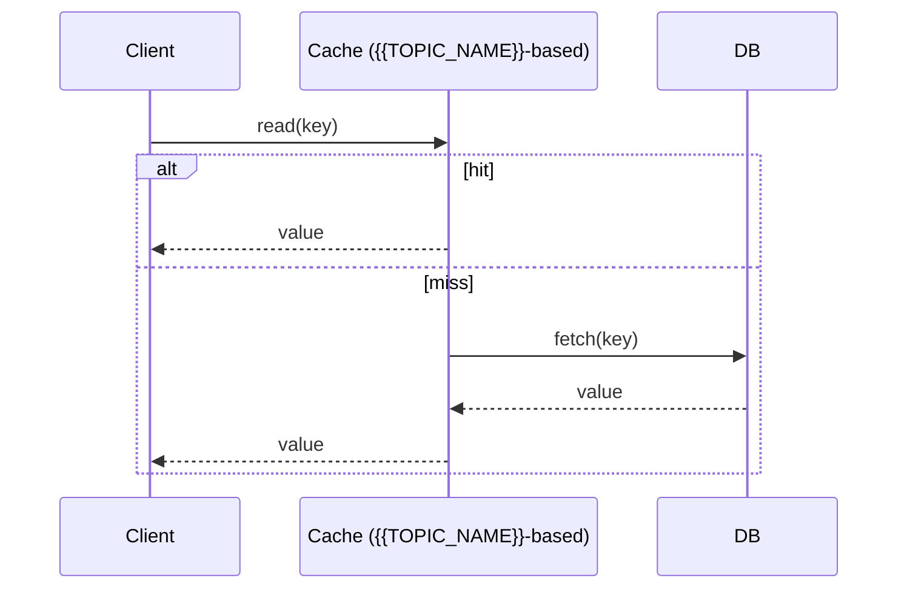

# Data Structures & Algorithms Roadmap — Universal Template

> Guides content generation for **Data Structures & Algorithms** topics.
> All algorithm implementations must be provided in **3 languages: Go, Java, Python**.
> **HTML/CSS/JS visual animations** are included for Algorithm/DS topics.
> Animation is **not required** for theoretical topics (Programming Fundamentals, etc.).

## Overview

| | Description |
|---|---|
| **Purpose** | Universal template for all Data Structures & Algorithms roadmap topics |
| **Files per topic** | 9 files: `junior.md`, `middle.md`, `senior.md`, `professional.md`, `interview.md`, `tasks.md`, `find-bug.md`, `optimize.md`, `specification.md` |
| **Languages** | All code must be in **Go**, **Java**, **Python** (in that order) |
| **Visualization** | `animation.html` — **Required** for DS/algorithm topics (arrays, linked lists, stacks, queues, hash tables, sorting, searching, trees, graphs, Big-O, asymptotic notation). **Skip** for pure theory topics (syntax, pseudo code, OOP, control structures) |
| **Code Fences** | `go`, `java`, `python` for implementations, `text` for pseudocode |
| **Table of Contents** | Optional — omit for `tasks.md`, `find-bug.md`, `optimize.md` |

### Topic Structure

```
XX-topic-name/
├── junior.md          ← "What?" and "How?" — basic DS + Big-O
├── middle.md          ← "Why?" and "When?" — advanced patterns, comparisons
├── senior.md          ← system design with DS + distributed
├── professional.md    ← formal proofs, NP-completeness, amortized analysis
├── interview.md       ← interview prep across all levels
├── tasks.md           ← hands-on practice tasks (3 languages)
├── find-bug.md        ← find and fix bugs (10+ exercises, 3 languages)
├── optimize.md        ← optimize slow/inefficient code (10+ exercises, 3 languages)
├── specification.md   ← Official spec / documentation deep-dive
└── animation.html     ← REQUIRED for DS/algorithm topics — interactive visual animation
                          (arrays, linked lists, stacks, queues, hash tables, sorting,
                           searching, trees, graphs, Big-O, asymptotic notation)
                          SKIP for theory topics (syntax, pseudo code, OOP, control flow)
```

### Animation Rules

| Topic Type | animation.html |
|-----------|---------------|
| Data Structures (Array, Linked List, Stack, Queue, Hash Table) | **Required** |
| Algorithmic Complexity (Big-O, Big-θ, Big-Ω, Common Runtimes) | **Required** |
| Sorting & Searching Algorithms | **Required** |
| Trees & Graphs | **Required** |
| Programming Fundamentals (syntax, pseudo code, OOP, control flow) | Skip |
| Theory-only topics | Skip |

### Animation HTML Template

Each `animation.html` is **fully self-contained** (no CDN, no external dependencies), dark-themed, and responsive.

#### Standard Layout Sections

| Section | Description |
|---------|-------------|
| **Header** | Topic name (`<h1>`), short subtitle, colored complexity badges |
| **Visual Area** | DS-specific visual — rendered via CSS/JS DOM, not canvas |
| **Stats Bar** | Live stats (size, top/front/rear, isEmpty) |
| **Controls** | Value/index inputs + operation buttons (grouped by Insert / Delete / Inspect) |
| **Info Panel** | Last operation name + explanation + time complexity |
| **Big-O Table** | All operations with color-coded complexity |
| **Operation Log** | Scrollable log of all operations performed |

#### CSS Design Tokens (use these variables in every animation.html)

```css
:root {
  --bg:      #0d1117;  /* page background */
  --surface: #161b22;  /* card/panel background */
  --border:  #30363d;  /* borders */
  --text:    #e6edf3;  /* primary text */
  --muted:   #8b949e;  /* secondary text */
  --green:   #3fb950;  /* O(1) / success / insert */
  --yellow:  #d29922;  /* O(n) / warning / scan */
  --red:     #f85149;  /* delete / error */
  --blue:    #58a6ff;  /* accent / head pointer */
  --purple:  #bc8cff;  /* secondary accent / new node */
  --orange:  #ffa657;  /* tail / rear pointer */
}
```

#### Cell/Node State Classes

| Class | Color | Meaning |
|-------|-------|---------|
| `active` / `top-cell` / `front-cell` | Blue | Current pointer (head, top, front) |
| `rear-cell` / `tail-node` | Orange | Rear/tail pointer |
| `inserting` / `pushing` / `enqueueing` / `new-node` | Green | Newly inserted element |
| `deleting` / `popping` / `dequeueing` | Red | Being removed (fades out) |
| `scanning` | Yellow | Currently being visited/traversed |
| `found` | Green (bright) | Search result found |
| `peeking` | Yellow | Read-only inspection |

#### Per-DS Visual Convention

| Data Structure | Visual Orientation | Key Pointers |
|----------------|-------------------|--------------|
| **Array** | Horizontal cells with index labels below | No special pointer |
| **Linked List** | Horizontal nodes with `next→` arrow segments | `head` (blue), `tail` (orange) |
| **Queue** | Horizontal cells, left=front, right=rear | `← front` (blue), `rear →` (orange) |
| **Stack** | Vertical cells (top at top), index labels on left | `TOP` arrow (blue) |
| **Hash Table** | Bucket rows with chain visualization | Bucket index labels |
| **Tree** | SVG-based node tree layout | Root, leaf indicators |
| **Graph** | SVG canvas with draggable nodes | Weighted edge labels |

#### JavaScript Conventions

```js
let busy = false;       // prevents concurrent animations
async function sleep(ms){ return new Promise(r=>setTimeout(r,ms)); }
// Always: render(highlights) → setInfo(op, msg, cplx, cls) → addLog(msg)
// Guard every handler: if (busy) return;
// After animated state: setTimeout(()=>render(), 700)
```

## Roadmap Sections 3–6

### Section 3 — What are Data Structures?
```
03-what-are-data-structures/
├── junior.md
├── middle.md
├── senior.md
├── professional.md
├── interview.md
├── tasks.md
├── find-bug.md
├── optimize.md
└── specification.md
```
> Theory topic — animation.html not required.

---

### Section 4 — Why are Data Structures Important?
```
04-why-are-data-structures-important/
├── junior.md
├── middle.md
├── senior.md
├── professional.md
├── interview.md
├── tasks.md
├── find-bug.md
├── optimize.md
└── specification.md
```
> Theory topic — animation.html not required.

---

### Section 5 — Basic Data Structures
```
05-basic-data-structures/
├── 01-array/
│   ├── junior.md
│   ├── middle.md
│   ├── senior.md
│   ├── professional.md
│   ├── interview.md
│   ├── tasks.md
│   ├── find-bug.md
│   ├── optimize.md
│   ├── specification.md
│   └── animation.html       ← REQUIRED
├── 02-linked-lists/
│   ├── ... (same 9 files)
│   └── animation.html       ← REQUIRED
├── 03-queues/
│   ├── ... (same 9 files)
│   └── animation.html       ← REQUIRED
├── 04-stacks/
│   ├── ... (same 9 files)
│   └── animation.html       ← REQUIRED
└── 05-hash-tables/
    ├── ... (same 9 files)
    └── animation.html       ← REQUIRED
```

---

### Section 6 — Algorithmic Complexity
```
06-algorithmic-complexity/
├── 01-time-vs-space-complexity/
│   ├── junior.md
│   ├── middle.md
│   ├── senior.md
│   ├── professional.md
│   ├── interview.md
│   ├── tasks.md
│   ├── find-bug.md
│   ├── optimize.md
│   └── specification.md
├── 02-how-to-calculate-complexity/
│   └── ... (same 9 files)
├── 03-common-runtimes/
│   ├── 01-constant/
│   │   ├── ... (9 files)
│   │   └── animation.html   ← REQUIRED
│   ├── 02-logarithmic/
│   │   └── animation.html   ← REQUIRED
│   ├── 03-linear/
│   │   └── animation.html   ← REQUIRED
│   ├── 04-polynomial/
│   │   └── animation.html   ← REQUIRED
│   ├── 05-exponential/
│   │   └── animation.html   ← REQUIRED
│   └── 06-factorial/
│       └── animation.html   ← REQUIRED
└── 04-asymptotic-notation/
    ├── 01-big-o-notation/
    │   ├── ... (9 files)
    │   └── animation.html   ← REQUIRED
    ├── 02-big-theta-notation/
    │   └── animation.html   ← REQUIRED
    └── 03-big-omega-notation/
        └── animation.html   ← REQUIRED
```

---

## Level Comparison Matrix

| Aspect | Junior | Middle | Senior | Professional |
|:------:|:------:|:------:|:------:|:------------:|
| **Depth** | Basic DS, Big-O intro | Graphs, DP, advanced trees | System design with DS, distributed | Formal proofs, NP-completeness, amortized analysis |
| **Code** | Simple implementations in 3 languages | Production-ready, optimized | Scalable, concurrent | Correctness proofs + pseudocode |
| **Focus** | "What?" and "How?" | "Why?" and "When?" | "How to scale?" | "Is this provably correct?" |

## Multi-Language Code Block Convention

> **IMPORTANT:** Every code example MUST be provided in all 3 languages in this exact order:

```
### Example: {{title}}

#### Go

` ` `go
// Go implementation
` ` `

#### Java

` ` `java
// Java implementation
` ` `

#### Python

` ` `python
# Python implementation
` ` `
```

---
---

# TEMPLATE 1 — `junior.md`

# {{TOPIC_NAME}} — Junior Level

## Table of Contents

1. [Introduction](#introduction)
2. [Prerequisites](#prerequisites)
3. [Glossary](#glossary)
4. [Core Concepts](#core-concepts)
5. [Big-O Summary](#big-o-summary)
6. [Real-World Analogies](#real-world-analogies)
7. [Pros & Cons](#pros--cons)
8. [Code Examples](#code-examples)
9. [Coding Patterns](#coding-patterns)
10. [Error Handling](#error-handling)
11. [Performance Tips](#performance-tips)
12. [Best Practices](#best-practices)
13. [Edge Cases & Pitfalls](#edge-cases--pitfalls)
14. [Common Mistakes](#common-mistakes)
15. [Cheat Sheet](#cheat-sheet)
16. [Visual Animation](#visual-animation)
17. [Summary](#summary)
18. [Further Reading](#further-reading)

---

## Introduction

> Focus: "What is it?" and "How to use it?"

Brief explanation of what {{TOPIC_NAME}} is. Assume basic programming knowledge, no prior algorithms background.

---

## Prerequisites

- **Required:** Basic programming — loops, functions, arrays (in any of Go/Java/Python)
- **Required:** Understanding of variables and memory
- **Helpful:** Recursion basics

---

## Glossary

| Term | Definition |
|------|-----------|
| **{{Term 1}}** | One-sentence definition |
| **Big-O Notation** | Describes how runtime or memory grows with input size |
| **Time Complexity** | How long an algorithm takes relative to input size |
| **Space Complexity** | How much memory an algorithm uses relative to input size |

---

## Core Concepts

### Concept 1: {{name}}
3-5 sentence explanation with analogy.

### Concept 2: {{name}}
3-5 sentence explanation.

---

## Big-O Summary

| Operation | Complexity | Notes |
|-----------|-----------|-------|
| Access | O(?) | |
| Search | O(?) | |
| Insert | O(?) | |
| Delete | O(?) | |

---

## Real-World Analogies

| Concept | Analogy |
|---------|--------|
| **{{Concept 1}}** | e.g., "A stack is like a pile of plates" |
| **{{Concept 2}}** | Everyday analogy |

> Note where each analogy breaks down.

---

## Pros & Cons

| Pros | Cons |
|------|------|
| {{Advantage 1}} | {{Disadvantage 1}} |
| {{Advantage 2}} | {{Disadvantage 2}} |

**When to use:** {{scenario}}
**When NOT to use:** {{scenario}}

---

## Code Examples

### Example 1: {{title}}

#### Go

```go
package main

import "fmt"

func example(data []int) {
    // Step 1: ...
    fmt.Println(data)
}

func main() {
    example([]int{1, 2, 3})
}
```

#### Java

```java
public class Example {
    public static void example(int[] data) {
        // Step 1: ...
        System.out.println(java.util.Arrays.toString(data));
    }

    public static void main(String[] args) {
        example(new int[]{1, 2, 3});
    }
}
```

#### Python

```python
def example(data):
    # Step 1: ...
    print(data)

if __name__ == "__main__":
    example([1, 2, 3])
```

**What it does:** Brief explanation.
**Run:** `go run main.go` | `javac Example.java && java Example` | `python example.py`

---

## Coding Patterns

### Pattern 1: {{name}}
**Intent:** One sentence.

#### Go

```go
// Pattern implementation — simple and commented
```

#### Java

```java
// Pattern implementation — simple and commented
```

#### Python

```python
# Pattern implementation — simple and commented
```

```mermaid
graph TD
    A[Input] --> B[{{TOPIC_NAME}} Operation]
    B --> C[Output]
    B --> D[State Change]
```

---

## Error Handling

| Error | Cause | Fix |
|-------|-------|-----|
| Index out of bounds | Accessing beyond array length | Check bounds before access |
| Stack overflow | Missing base case in recursion | Define base case first |
| Null pointer | Accessing nil/null node | Check for nil/null before access |

---

## Performance Tips
- Know Big-O of every operation before choosing a structure
- Use language-specific optimized structures (Go: `container/heap`, Java: `java.util.*`, Python: `collections`)

---

## Best Practices
- Validate input, write brute-force first, test empty/single/large inputs
- Implement from scratch at least once before using library

---

## Edge Cases & Pitfalls
- Empty structure, single element, duplicates, already-sorted input, negative numbers

---

## Common Mistakes
- Off-by-one in indices, missing null/nil case, mutating input during iteration, integer overflow

---

## Cheat Sheet

| Operation | Time | Space | Notes |
|-----------|------|-------|-------|
| {{op 1}} | O(?) | O(?) | |
| {{op 2}} | O(?) | O(?) | |

---

## Visual Animation

> See [`animation.html`](./animation.html) for an interactive visual animation of {{TOPIC_NAME}}.
>
> The animation demonstrates:
> - Step-by-step execution of the algorithm
> - Input/output state at each step
> - Color-coded operations (compare, swap, insert, delete)
> - Speed control (slow/medium/fast)
> - Custom input support

---

## Summary
{{TOPIC_NAME}} is used for {{main purpose}}. Focus on basic operations and their complexities. Build working implementations before reaching for libraries.

---

## Further Reading
- *Introduction to Algorithms* (CLRS) — Chapter on {{TOPIC_NAME}}
- Go: `container/heap`, `sort` package docs
- Java: `java.util.Collections`, `java.util.PriorityQueue` docs
- Python: `collections`, `heapq`, `bisect` docs
- visualgo.net — interactive visualizations

---
---

# TEMPLATE 2 — `middle.md`

# {{TOPIC_NAME}} — Middle Level

## Table of Contents

1. [Introduction](#introduction)
2. [Deeper Concepts](#deeper-concepts)
3. [Comparison with Alternatives](#comparison-with-alternatives)
4. [Advanced Patterns](#advanced-patterns)
5. [Graph and Tree Applications](#graph-and-tree-applications)
6. [Dynamic Programming Integration](#dynamic-programming-integration)
7. [Code Examples](#code-examples)
8. [Error Handling](#error-handling)
9. [Performance Analysis](#performance-analysis)
10. [Best Practices](#best-practices)
11. [Visual Animation](#visual-animation)
12. [Summary](#summary)

---

## Introduction
> Focus: "Why does it work?" and "When should I choose this?"

Understand the invariants that make {{TOPIC_NAME}} correct, when it degrades, and how it fits into larger algorithmic strategies.

---

## Deeper Concepts

### Invariant: {{name}}
Describe the structural invariant {{TOPIC_NAME}} maintains and what breaks if violated.

### Recurrence Relations

```text
T(n) = aT(n/b) + f(n)
By Master Theorem: T(n) = O(...)
```

---

## Comparison with Alternatives

| Attribute | {{TOPIC_NAME}} | {{Alternative 1}} | {{Alternative 2}} |
|-----------|--------------|-----------------|-----------------|
| Time (avg) | O(?) | O(?) | O(?) |
| Time (worst) | O(?) | O(?) | O(?) |
| Space | O(?) | O(?) | O(?) |
| Stable? | Yes/No | Yes/No | Yes/No |
| Best for | {{scenario}} | {{scenario}} | {{scenario}} |

**Choose {{TOPIC_NAME}} when:** {{condition}}
**Choose {{Alternative 1}} when:** {{condition}}

---

## Advanced Patterns

### Pattern: Two-Pointer / Sliding Window

#### Go

```go
func twoPointer(arr []int, target int) {
    left, right := 0, len(arr)-1
    for left < right {
        // process arr[left] and arr[right]
        left++
        right--
    }
}
```

#### Java

```java
public static void twoPointer(int[] arr, int target) {
    int left = 0, right = arr.length - 1;
    while (left < right) {
        // process arr[left] and arr[right]
        left++;
        right--;
    }
}
```

#### Python

```python
def two_pointer(arr, target):
    left, right = 0, len(arr) - 1
    while left < right:
        # process arr[left] and arr[right]
        left += 1
        right -= 1
```

### Pattern: Divide and Conquer

#### Go

```go
func divideAndConquer(arr []int, low, high int) {
    if low >= high {
        return
    }
    mid := (low + high) / 2
    divideAndConquer(arr, low, mid)
    divideAndConquer(arr, mid+1, high)
    // combine
}
```

#### Java

```java
public static void divideAndConquer(int[] arr, int low, int high) {
    if (low >= high) return;
    int mid = low + (high - low) / 2;
    divideAndConquer(arr, low, mid);
    divideAndConquer(arr, mid + 1, high);
    // combine
}
```

#### Python

```python
def divide_and_conquer(arr, low, high):
    if low >= high:
        return
    mid = (low + high) // 2
    divide_and_conquer(arr, low, mid)
    divide_and_conquer(arr, mid + 1, high)
    # combine
```

---

## Graph and Tree Applications

```mermaid
graph TD
    A[{{TOPIC_NAME}}] --> B[BFS — uses queue]
    A --> C[DFS — uses stack/recursion]
    A --> D[Dijkstra — uses min-heap]
    A --> E[Union-Find — uses array/tree]
```

### BFS with visited set

#### Go

```go
func bfs(graph map[int][]int, start int) {
    visited := map[int]bool{start: true}
    queue := []int{start}
    for len(queue) > 0 {
        node := queue[0]
        queue = queue[1:]
        for _, neighbor := range graph[node] {
            if !visited[neighbor] {
                visited[neighbor] = true
                queue = append(queue, neighbor)
            }
        }
    }
}
```

#### Java

```java
import java.util.*;

public static void bfs(Map<Integer, List<Integer>> graph, int start) {
    Set<Integer> visited = new HashSet<>(Set.of(start));
    Queue<Integer> queue = new LinkedList<>(List.of(start));
    while (!queue.isEmpty()) {
        int node = queue.poll();
        for (int neighbor : graph.getOrDefault(node, List.of())) {
            if (!visited.contains(neighbor)) {
                visited.add(neighbor);
                queue.add(neighbor);
            }
        }
    }
}
```

#### Python

```python
from collections import deque

def bfs(graph, start):
    visited = set([start])
    queue = deque([start])
    while queue:
        node = queue.popleft()
        for neighbor in graph[node]:
            if neighbor not in visited:
                visited.add(neighbor)
                queue.append(neighbor)
```

---

## Dynamic Programming Integration

#### Go

```go
var memo = map[int]int{}

func dp(state int) int {
    if val, ok := memo[state]; ok {
        return val
    }
    if baseCondition(state) {
        return baseValue
    }
    result := /* min/max of subproblems */
    memo[state] = result
    return result
}
```

#### Java

```java
import java.util.HashMap;

static HashMap<Integer, Integer> memo = new HashMap<>();

public static int dp(int state) {
    if (memo.containsKey(state)) return memo.get(state);
    if (baseCondition(state)) return baseValue;
    int result = /* min/max of subproblems */;
    memo.put(state, result);
    return result;
}
```

#### Python

```python
from functools import lru_cache

@lru_cache(maxsize=None)
def dp(state):
    if base_condition(state):
        return base_value
    return min(dp(s) for s in subproblems(state))
```

---

## Code Examples

### Full Implementation

#### Go

```go
package main

import "fmt"

// {{TopicName}} implementation
// Time: O(?) per operation. Space: O(n).
type TopicName struct {
    data []int
}

func (t *TopicName) Insert(value int) {
    t.data = append(t.data, value)
    // sift up or rebalance
}

func main() {
    t := &TopicName{}
    t.Insert(5)
    fmt.Println(t.data)
}
```

#### Java

```java
import java.util.ArrayList;
import java.util.List;

public class TopicName {
    private List<Integer> data = new ArrayList<>();

    public void insert(int value) {
        data.add(value);
        // sift up or rebalance
    }

    public static void main(String[] args) {
        TopicName t = new TopicName();
        t.insert(5);
        System.out.println(t.data);
    }
}
```

#### Python

```python
class TopicName:
    """
    {{TOPIC_NAME}} implementation.
    Time: O(log n) per operation (average). Space: O(n).
    """
    def __init__(self):
        self._data = []

    def insert(self, value):
        self._data.append(value)
        self._sift_up(len(self._data) - 1)

if __name__ == "__main__":
    t = TopicName()
    t.insert(5)
    print(t._data)
```

---

## Error Handling

| Scenario | What goes wrong | Correct approach |
|----------|----------------|-----------------|
| Cycle without visited set | Infinite BFS loop | Always maintain `visited` |
| Wrong DP base case | All subproblems wrong | Test base cases independently |
| Off-by-one in binary search | Wrong index returned | Use `mid = low + (high - low) / 2` |

---

## Performance Analysis

#### Go

```go
import (
    "fmt"
    "time"
)

func benchmark() {
    sizes := []int{10, 100, 1000, 10000, 100000}
    for _, n := range sizes {
        data := make([]int, n)
        for i := range data { data[i] = i }
        start := time.Now()
        for i := 0; i < 50; i++ {
            yourAlgorithm(append([]int{}, data...))
        }
        elapsed := time.Since(start)
        fmt.Printf("n=%7d: %.3f ms\n", n, float64(elapsed.Milliseconds())/50.0)
    }
}
```

#### Java

```java
public static void benchmark() {
    int[] sizes = {10, 100, 1000, 10000, 100000};
    for (int n : sizes) {
        int[] data = java.util.stream.IntStream.range(0, n).toArray();
        long start = System.nanoTime();
        for (int i = 0; i < 50; i++) {
            yourAlgorithm(data.clone());
        }
        long elapsed = System.nanoTime() - start;
        System.out.printf("n=%7d: %.3f ms%n", n, elapsed / 50.0 / 1_000_000);
    }
}
```

#### Python

```python
import timeit

sizes = [10, 100, 1_000, 10_000, 100_000]
for n in sizes:
    t = timeit.timeit(lambda: your_algorithm(list(range(n))), number=50)
    print(f"n={n:>7}: {t/50*1000:.3f} ms")
```

---

## Best Practices
- Implement from scratch once; understand before using a library
- Document time and space complexity in comments/docstrings
- Prefer iterative over recursive for large inputs (especially in Python)
- Go: use `sort.Slice`, `container/heap` for production code
- Java: use `Collections.sort()`, `PriorityQueue` for production code

---

## Visual Animation

> See [`animation.html`](./animation.html) for interactive visualization.
>
> Middle-level animation includes:
> - Comparison with alternative algorithms (side-by-side)
> - Invariant visualization (what holds true at each step)
> - Worst-case vs best-case input demonstration
> - Step counter and complexity display

---

## Summary
At the middle level, {{TOPIC_NAME}} is understood through its invariants, failure conditions, and role in graphs and DP. Master when to choose it over alternatives.

---
---

# TEMPLATE 3 — `senior.md`

# {{TOPIC_NAME}} — Senior Level

## Table of Contents

1. [Introduction](#introduction)
2. [System Design with {{TOPIC_NAME}}](#system-design)
3. [Distributed Data Structures](#distributed-data-structures)
4. [Comparison with Alternatives](#comparison-with-alternatives)
5. [Architecture Patterns](#architecture-patterns)
6. [Code Examples](#code-examples)
7. [Observability](#observability)
8. [Failure Modes](#failure-modes)
9. [Summary](#summary)

---

## Introduction
> Focus: "How to architect systems around {{TOPIC_NAME}}?"

Senior engineers choose data structures based on system constraints: latency SLAs, memory budgets, fault tolerance, and concurrency.

---

## System Design with {{TOPIC_NAME}}

```mermaid
graph TD
    Client -->|request| LoadBalancer
    LoadBalancer --> Service1
    LoadBalancer --> Service2
    Service1 -->|uses| DS[{{TOPIC_NAME}}]
    Service2 -->|uses| DS
    DS --> Storage[(Distributed Storage)]
```

---

## Distributed Data Structures

| Structure | Consistency | Use Case |
|-----------|------------|---------|
| Consistent hash ring | Eventual | Key routing in distributed caches |
| Bloom filter | Probabilistic | Membership checks across nodes |
| LSM tree | Eventual | RocksDB, Cassandra writes |
| Skip list | Strong (single node) | Redis sorted sets |

---

## Comparison with Alternatives

| Attribute | {{TOPIC_NAME}} | {{Alternative 1}} | {{Alternative 2}} |
|-----------|--------------|-----------------|-----------------|
| Write throughput | | | |
| Read latency p99 | | | |
| Memory overhead | | | |
| Production usage | {{e.g., Redis}} | | |

---

## Architecture Patterns



---

## Code Examples

### Thread-Safe / Concurrent Implementation

#### Go

```go
package main

import "sync"

type ThreadSafeDS struct {
    mu   sync.RWMutex
    data []int
}

func (t *ThreadSafeDS) Insert(value int) {
    t.mu.Lock()
    defer t.mu.Unlock()
    t.data = append(t.data, value)
    // rebalance
}

func (t *ThreadSafeDS) Search(value int) bool {
    t.mu.RLock()
    defer t.mu.RUnlock()
    for _, v := range t.data {
        if v == value {
            return true
        }
    }
    return false
}
```

#### Java

```java
import java.util.concurrent.locks.ReentrantReadWriteLock;
import java.util.ArrayList;
import java.util.List;

public class ThreadSafeDS {
    private final ReentrantReadWriteLock lock = new ReentrantReadWriteLock();
    private final List<Integer> data = new ArrayList<>();

    public void insert(int value) {
        lock.writeLock().lock();
        try {
            data.add(value);
            // rebalance
        } finally {
            lock.writeLock().unlock();
        }
    }

    public boolean search(int value) {
        lock.readLock().lock();
        try {
            return data.contains(value);
        } finally {
            lock.readLock().unlock();
        }
    }
}
```

#### Python

```python
import threading

class ThreadSafeDS:
    def __init__(self):
        self._lock = threading.RLock()
        self._data = []

    def insert(self, value):
        with self._lock:
            self._data.append(value)
            # rebalance

    def search(self, value):
        with self._lock:
            return value in self._data
```

---

## Observability

| Metric | Alert Threshold |
|--------|----------------|
| `operation_latency_p99` | > 10 ms |
| `memory_used_bytes` | > 80% of budget |
| `cache_hit_ratio` | < 0.8 |

---

## Failure Modes
- **Hot partition:** one shard overloaded — use virtual nodes
- **Memory exhaustion:** unbounded growth — add LRU/TTL eviction
- **Thundering herd:** simultaneous cache misses — probabilistic early expiration

---

## Summary
At senior level, evaluate {{TOPIC_NAME}} against system-wide constraints. Complexity analysis expands to cache behavior, concurrency, and distribution.

---
---

# TEMPLATE 4 — `professional.md`

# {{TOPIC_NAME}} — Mathematical Foundations and Complexity Theory

## Table of Contents
1. [Formal Definition](#formal-definition)
2. [Correctness Proof — Loop Invariants](#correctness-proof)
3. [Amortized Analysis](#amortized-analysis)
4. [NP-Completeness and Polynomial Reductions](#np-completeness)
5. [Randomized Algorithm Probability Bounds](#randomized-algorithms)
6. [Cache-Oblivious Analysis](#cache-oblivious-analysis)
7. [Comparison with Alternatives](#comparison)
8. [Summary](#summary)

---

## Formal Definition

```text
Definition: A {{TOPIC_NAME}} is a tuple (S, Sigma, delta, ...) where:
  S = set of states/elements
  Sigma = key space
  delta = operation function

Invariant I(S): [formal predicate true after every operation]
```

---

## Correctness Proof — Loop Invariants

```text
Claim: Algorithm A correctly computes {{result}} for all valid inputs.

Invariant I: At the start of iteration k, {{property holds}}.

Base case (k=0):   {{show I holds initially}}
Inductive step:    Assume I at k. Show I at k+1: {{argument}}
Termination:       {{var}} strictly {{increases/decreases}} by {{amount}},
                   bounded by {{bound}} -> terminates in O(n) iterations.
Postcondition:     I holds and exit condition true -> {{result}} holds. QED
```

---

## Amortized Analysis

### Aggregate Method

```text
Total cost of n operations: Sum cost(op_i) <= O(f(n))
Amortized cost per op = O(f(n)/n)

Dynamic array: n pushes cost n + (1+2+4+...+n) = O(n) -> O(1) amortized
```

### Potential Method

```text
Phi: states -> R>=0

Amortized cost: a_i = c_i + Phi(D_i) - Phi(D_{i-1})
Total actual:   Sum c_i <= Sum a_i + Phi(D_0)

For {{TOPIC_NAME}}: Phi(D) = {{specific potential function and justification}}
```

---

## NP-Completeness and Polynomial Reductions

```text
Problem: {{formal problem statement}}
Theorem: {{Problem}} is NP-complete.
Proof:   Reduction from {{known NP-complete problem}} in poly time:
  1. Given instance x, construct f(x) in O(poly(|x|))
  2. x is YES <=> f(x) is YES   [construction + equivalence proof]
```

---

## Randomized Algorithm Probability Bounds

```text
Theorem: Expected running time is O(f(n)).

Let X_i = indicator for event E_i.  E[X_i] = Pr[E_i].
By linearity of expectation: E[T(n)] = Sum E[X_i] = O(f(n)). QED

High-probability bound (Chernoff):
  Pr[X >= (1+delta)mu] <= e^(-mu*delta^2/3)  ->  Pr[bad event] <= 1/n^c. QED
```

---

## Cache-Oblivious Analysis

```text
Parameters: N = problem size, M = cache size, B = block size

Naive I/Os: O(N)
Cache-oblivious {{TOPIC_NAME}}: O(N/B * log_{M/B}(N/B))

Van Emde Boas layout:
  Split tree at height h/2; store top and bottom subtrees contiguously.
  Cache misses: O((N/B) log log N)
```

---

## Comparison with Alternatives

| Attribute | {{TOPIC_NAME}} | {{Alternative 1}} | {{Alternative 2}} |
|-----------|--------------|-----------------|-----------------|
| Worst-case | O(?) | O(?) | O(?) |
| Cache I/Os | O(?) | O(?) | O(?) |
| Deterministic? | Yes/No | Yes/No | Yes/No |

---

## Summary
At professional level, correctness is proven with loop invariants, efficiency justified with amortized methods, tractability boundaries set by NP-hardness, and hardware reality captured by cache-oblivious analysis.

---
---

# TEMPLATE 5 — `interview.md`

# {{TOPIC_NAME}} — Interview Preparation

## Junior Questions

| # | Question | Expected Answer Focus |
|---|----------|-----------------------|
| 1 | What is {{TOPIC_NAME}} and when would you use it? | Definition, use cases, Big-O |
| 2 | What is the time complexity of [operation]? | Specific complexity with justification |
| 3 | Difference between {{TOPIC_NAME}} and {{Alternative}}? | Key structural difference |
| 4 | How do you spot an off-by-one error? | Loop condition analysis |

## Middle Questions

| # | Question | Expected Answer Focus |
|---|----------|-----------------------|
| 1 | When does {{TOPIC_NAME}} degrade to worst-case? | Adversarial input construction |
| 2 | Implement an LRU cache. | Hash map + doubly-linked list |
| 3 | BFS vs DFS — when to choose each? | Queue/stack, level-order vs depth |
| 4 | Detect a cycle in a directed graph. | DFS with gray/black coloring |

## Senior Questions

| # | Question | Expected Answer Focus |
|---|----------|-----------------------|
| 1 | Design a distributed key-value store. | Hash ring + LSM tree + Bloom filter |
| 2 | Hash map vs BST in production? | Ordering, memory, worst-case latency |
| 3 | How does {{TOPIC_NAME}} behave under concurrent access? | Lock granularity, lock-free options |

## Professional Questions

| # | Question | Expected Answer Focus |
|---|----------|-----------------------|
| 1 | Prove correctness with a loop invariant. | Invariant, induction, termination |
| 2 | Prove comparison sort is Omega(n log n). | Decision tree argument |
| 3 | Derive amortized cost of dynamic array push. | Potential function |

---

## Coding Challenge (3 Languages)

### Challenge: {{title}}

> Solve the problem in all 3 languages. Each solution must pass all test cases.

#### Go

```go
package main

import "fmt"

func solve(arr []int, target int) int {
    // your solution
    return -1
}

func main() {
    fmt.Println(solve([]int{1, 2, 3, 4, 5}, 3)) // expected: index or value
}
```

#### Java

```java
public class Solution {
    public static int solve(int[] arr, int target) {
        // your solution
        return -1;
    }

    public static void main(String[] args) {
        System.out.println(solve(new int[]{1, 2, 3, 4, 5}, 3));
    }
}
```

#### Python

```python
def solve(arr, target):
    # your solution
    return -1

if __name__ == "__main__":
    print(solve([1, 2, 3, 4, 5], 3))
```

---
---

# TEMPLATE 6 — `tasks.md`

# {{TOPIC_NAME}} — Practice Tasks

> All tasks must be solved in **Go**, **Java**, and **Python**.

## Beginner Tasks

**Task 1:** Implement {{TOPIC_NAME}} from scratch without any library.

#### Go

```go
// Starter code
package main

func main() {
    // implement here
}
```

#### Java

```java
// Starter code
public class Task1 {
    public static void main(String[] args) {
        // implement here
    }
}
```

#### Python

```python
# Starter code
def main():
    # implement here
    pass

if __name__ == "__main__":
    main()
```

- **Constraints:** correct Big-O, test with empty/single/duplicate inputs.
- **Expected Output:** {{expected}}
- **Evaluation:** correctness, edge cases, complexity analysis

**Task 2:** {{description}}
- Provide starter code in all 3 languages.
- Constraints: {{constraints}}

**Task 3:** {{description}}

**Task 4:** {{description}}

**Task 5:** {{description}}

## Intermediate Tasks

**Task 6:** {{description}} — provide starter code in all 3 languages.

**Task 7:** {{description}}

**Task 8:** {{description}}

**Task 9:** {{description}}

**Task 10:** {{description}}

## Advanced Tasks

**Task 11:** {{description}} — provide starter code in all 3 languages.

**Task 12:** {{description}}

**Task 13:** {{description}}

**Task 14:** {{description}}

**Task 15:** {{description}}

## Benchmark Task

> Compare performance across all 3 languages.

#### Go

```go
package main

import (
    "fmt"
    "time"
)

func main() {
    sizes := []int{10, 100, 1000, 10000, 100000}
    for _, n := range sizes {
        data := make([]int, n)
        for i := range data { data[i] = i }
        start := time.Now()
        for i := 0; i < 50; i++ {
            tmp := make([]int, n)
            copy(tmp, data)
            yourImplementation(tmp)
        }
        elapsed := time.Since(start)
        fmt.Printf("n=%7d: %.3f ms\n", n, float64(elapsed.Milliseconds())/50.0)
    }
}
```

#### Java

```java
import java.util.stream.IntStream;

public class Benchmark {
    public static void main(String[] args) {
        int[] sizes = {10, 100, 1000, 10000, 100000};
        for (int n : sizes) {
            int[] data = IntStream.range(0, n).toArray();
            long start = System.nanoTime();
            for (int i = 0; i < 50; i++) {
                yourImplementation(data.clone());
            }
            long elapsed = System.nanoTime() - start;
            System.out.printf("n=%7d: %.3f ms%n", n, elapsed / 50.0 / 1_000_000);
        }
    }
}
```

#### Python

```python
import timeit

sizes = [10, 100, 1_000, 10_000, 100_000]
for n in sizes:
    t = timeit.timeit(lambda: your_implementation(list(range(n))), number=50)
    print(f"n={n:>7}: {t/50*1000:.3f} ms")
```

---
---

# TEMPLATE 7 — `find-bug.md`

# {{TOPIC_NAME}} — Find the Bug

> 10+ exercises. Each shows buggy code in **all 3 languages** — find, explain, and fix.

---

## Exercise 1: {{Bug Title}}

### Go (Buggy)

```go
func buggyFunction(arr []int, target int) int {
    left, right := 0, len(arr) // BUG: should be len(arr)-1
    for left < right {         // BUG: should be <=
        mid := (left + right) / 2
        if arr[mid] == target {
            return mid
        } else if arr[mid] < target {
            left = mid + 1
        } else {
            right = mid
        }
    }
    return -1
}
```

### Java (Buggy)

```java
public static int buggyFunction(int[] arr, int target) {
    int left = 0, right = arr.length; // BUG: should be arr.length - 1
    while (left < right) {            // BUG: should be <=
        int mid = (left + right) / 2;
        if (arr[mid] == target) return mid;
        else if (arr[mid] < target) left = mid + 1;
        else right = mid;
    }
    return -1;
}
```

### Python (Buggy)

```python
def buggy_function(arr, target):
    left, right = 0, len(arr)      # BUG: should be len(arr) - 1
    while left < right:             # BUG: should be <=
        mid = (left + right) // 2
        if arr[mid] == target:
            return mid
        elif arr[mid] < target:
            left = mid + 1
        else:
            right = mid
    return -1
```

**Bug:** `right` is one past the last valid index; loop exits too early.

### Fix (all languages)

#### Go

```go
func fixedFunction(arr []int, target int) int {
    left, right := 0, len(arr)-1
    for left <= right {
        mid := left + (right-left)/2
        if arr[mid] == target { return mid }
        if arr[mid] < target { left = mid + 1 } else { right = mid - 1 }
    }
    return -1
}
```

#### Java

```java
public static int fixedFunction(int[] arr, int target) {
    int left = 0, right = arr.length - 1;
    while (left <= right) {
        int mid = left + (right - left) / 2;
        if (arr[mid] == target) return mid;
        else if (arr[mid] < target) left = mid + 1;
        else right = mid - 1;
    }
    return -1;
}
```

#### Python

```python
def fixed_function(arr, target):
    left, right = 0, len(arr) - 1
    while left <= right:
        mid = left + (right - left) // 2
        if arr[mid] == target: return mid
        elif arr[mid] < target: left = mid + 1
        else: right = mid - 1
    return -1
```

---

## Exercise 2: {{Bug Title}}

> Repeat the same 3-language pattern for each exercise.
> Minimum 10 exercises required.

## Exercise 3-10: {{Bug Titles}}

> Same structure: Buggy code in Go/Java/Python -> Explanation -> Fix in Go/Java/Python

---
---

# TEMPLATE 8 — `optimize.md`

# {{TOPIC_NAME}} — Optimize

> 10+ exercises. Show before/after in **all 3 languages** with complexity comparison and benchmarks.

---

## Exercise 1: {{Optimization Title}} — O(n^2) to O(n log n)

### Before (Slow)

#### Go

```go
// O(n^2) — brute force
func slowSolution(arr []int) []int {
    // slow implementation
    return arr
}
```

#### Java

```java
// O(n^2) — brute force
public static int[] slowSolution(int[] arr) {
    // slow implementation
    return arr;
}
```

#### Python

```python
# O(n^2) — brute force
def slow_solution(arr):
    # slow implementation
    return arr
```

### After (Optimized)

#### Go

```go
// O(n log n) — optimized
func fastSolution(arr []int) []int {
    // optimized implementation
    return arr
}
```

#### Java

```java
// O(n log n) — optimized
public static int[] fastSolution(int[] arr) {
    // optimized implementation
    return arr;
}
```

#### Python

```python
# O(n log n) — optimized
def fast_solution(arr):
    # optimized implementation
    return arr
```

### Complexity Comparison

| | Time | Space |
|---|------|-------|
| Before | O(n^2) | O(1) |
| After | O(n log n) | O(n) |

### Benchmark

> Run benchmarks in all 3 languages using the benchmark template from `tasks.md`.

---

## Exercise 2-10: {{Optimization Titles}}

> Same structure: Before/After in Go/Java/Python -> Complexity table -> Benchmark

---

## Optimization Summary

| Exercise | Before | After | Strategy |
|----------|--------|-------|----------|
| 1 | O(n^2) | O(n log n) | Divide and conquer |
| 2 | O(n^2) | O(n) | Hash map |
| 3 | O(2^n) | O(n) | Memoization / DP |
| ... | ... | ... | ... |

---
---

# TEMPLATE 9 — `animation.html`

> Standalone HTML file with embedded CSS and JavaScript.
> No external dependencies — everything in one file.
> Must work by opening the file directly in a browser.

```html
<!DOCTYPE html>
<html lang="en">
<head>
    <meta charset="UTF-8">
    <meta name="viewport" content="width=device-width, initial-scale=1.0">
    <title>{{TOPIC_NAME}} — Visual Animation</title>
    <style>
        /* ===== RESET & BASE ===== */
        * { margin: 0; padding: 0; box-sizing: border-box; }
        body {
            font-family: 'Segoe UI', Tahoma, Geneva, Verdana, sans-serif;
            background: #0f0f23;
            color: #e0e0e0;
            min-height: 100vh;
            display: flex;
            flex-direction: column;
            align-items: center;
            padding: 20px;
        }

        /* ===== HEADER ===== */
        h1 {
            font-size: 2rem;
            color: #00d4ff;
            margin-bottom: 10px;
            text-align: center;
        }
        .subtitle {
            color: #888;
            margin-bottom: 30px;
            text-align: center;
        }

        /* ===== CONTROLS ===== */
        .controls {
            display: flex;
            gap: 12px;
            margin-bottom: 20px;
            flex-wrap: wrap;
            justify-content: center;
        }
        button {
            padding: 10px 24px;
            border: 2px solid #00d4ff;
            background: transparent;
            color: #00d4ff;
            border-radius: 8px;
            cursor: pointer;
            font-size: 1rem;
            transition: all 0.3s;
        }
        button:hover {
            background: #00d4ff;
            color: #0f0f23;
        }
        button:disabled {
            opacity: 0.4;
            cursor: not-allowed;
        }
        button.active {
            background: #00d4ff;
            color: #0f0f23;
        }

        /* ===== SPEED CONTROL ===== */
        .speed-control {
            display: flex;
            align-items: center;
            gap: 8px;
            margin-bottom: 20px;
        }
        .speed-control label { color: #888; }
        .speed-control input[type="range"] {
            width: 150px;
            accent-color: #00d4ff;
        }

        /* ===== INPUT CONTROL ===== */
        .input-control {
            display: flex;
            gap: 12px;
            margin-bottom: 20px;
            align-items: center;
            flex-wrap: wrap;
            justify-content: center;
        }
        input[type="text"] {
            padding: 10px 16px;
            border: 2px solid #333;
            background: #1a1a2e;
            color: #e0e0e0;
            border-radius: 8px;
            font-size: 1rem;
            width: 300px;
        }
        input[type="text"]:focus {
            outline: none;
            border-color: #00d4ff;
        }

        /* ===== CANVAS / VISUALIZATION AREA ===== */
        .canvas-container {
            background: #1a1a2e;
            border: 2px solid #333;
            border-radius: 12px;
            padding: 30px;
            margin-bottom: 20px;
            width: 100%;
            max-width: 900px;
            min-height: 300px;
            display: flex;
            justify-content: center;
            align-items: flex-end;
            gap: 4px;
            flex-wrap: wrap;
            position: relative;
        }

        /* ===== ARRAY BARS ===== */
        .bar {
            display: flex;
            flex-direction: column;
            align-items: center;
            transition: all 0.3s ease;
        }
        .bar-visual {
            width: 40px;
            border-radius: 6px 6px 0 0;
            transition: all 0.3s ease;
            position: relative;
        }
        .bar-label {
            margin-top: 8px;
            font-size: 0.85rem;
            color: #888;
            font-weight: 600;
        }

        /* ===== COLOR STATES ===== */
        .bar-visual.default { background: #4a9eff; }
        .bar-visual.comparing { background: #ff6b6b; }
        .bar-visual.swapping { background: #ffd93d; }
        .bar-visual.sorted { background: #6bcb77; }
        .bar-visual.pivot { background: #c084fc; }
        .bar-visual.active { background: #ff9f43; }

        /* ===== INFO PANEL ===== */
        .info-panel {
            background: #1a1a2e;
            border: 2px solid #333;
            border-radius: 12px;
            padding: 20px;
            width: 100%;
            max-width: 900px;
            margin-bottom: 20px;
        }
        .info-panel h3 {
            color: #00d4ff;
            margin-bottom: 10px;
        }
        .step-info {
            font-family: 'Courier New', monospace;
            font-size: 0.95rem;
            line-height: 1.8;
        }
        .step-info .highlight { color: #ffd93d; }

        /* ===== LEGEND ===== */
        .legend {
            display: flex;
            gap: 20px;
            margin-bottom: 20px;
            flex-wrap: wrap;
            justify-content: center;
        }
        .legend-item {
            display: flex;
            align-items: center;
            gap: 6px;
            font-size: 0.85rem;
        }
        .legend-color {
            width: 16px;
            height: 16px;
            border-radius: 4px;
        }

        /* ===== COMPLEXITY DISPLAY ===== */
        .complexity {
            background: #1a1a2e;
            border: 2px solid #333;
            border-radius: 12px;
            padding: 15px 25px;
            display: flex;
            gap: 30px;
            margin-bottom: 20px;
            flex-wrap: wrap;
            justify-content: center;
        }
        .complexity-item {
            text-align: center;
        }
        .complexity-label { color: #888; font-size: 0.8rem; }
        .complexity-value { color: #00d4ff; font-size: 1.2rem; font-weight: bold; }

        /* ===== STEP COUNTER ===== */
        .step-counter {
            color: #888;
            font-size: 0.9rem;
            margin-bottom: 10px;
        }
    </style>
</head>
<body>
    <h1>{{TOPIC_NAME}}</h1>
    <p class="subtitle">Interactive Visual Animation — Step by Step</p>

    <!-- Complexity Display -->
    <div class="complexity">
        <div class="complexity-item">
            <div class="complexity-label">Time (Best)</div>
            <div class="complexity-value">O(?)</div>
        </div>
        <div class="complexity-item">
            <div class="complexity-label">Time (Avg)</div>
            <div class="complexity-value">O(?)</div>
        </div>
        <div class="complexity-item">
            <div class="complexity-label">Time (Worst)</div>
            <div class="complexity-value">O(?)</div>
        </div>
        <div class="complexity-item">
            <div class="complexity-label">Space</div>
            <div class="complexity-value">O(?)</div>
        </div>
    </div>

    <!-- Custom Input -->
    <div class="input-control">
        <input type="text" id="customInput" placeholder="Enter numbers: 5, 3, 8, 1, 9, 2, 7">
        <button onclick="loadCustomInput()">Load</button>
        <button onclick="generateRandom()">Random</button>
    </div>

    <!-- Controls -->
    <div class="controls">
        <button id="startBtn" onclick="start()">Start</button>
        <button id="stepBtn" onclick="stepForward()">Step</button>
        <button id="pauseBtn" onclick="pause()" disabled>Pause</button>
        <button id="resetBtn" onclick="reset()">Reset</button>
    </div>

    <!-- Speed Control -->
    <div class="speed-control">
        <label>Speed:</label>
        <span>Slow</span>
        <input type="range" id="speedSlider" min="1" max="10" value="5">
        <span>Fast</span>
    </div>

    <!-- Legend -->
    <div class="legend">
        <div class="legend-item">
            <div class="legend-color" style="background: #4a9eff;"></div>
            <span>Default</span>
        </div>
        <div class="legend-item">
            <div class="legend-color" style="background: #ff6b6b;"></div>
            <span>Comparing</span>
        </div>
        <div class="legend-item">
            <div class="legend-color" style="background: #ffd93d;"></div>
            <span>Swapping</span>
        </div>
        <div class="legend-item">
            <div class="legend-color" style="background: #6bcb77;"></div>
            <span>Sorted</span>
        </div>
        <div class="legend-item">
            <div class="legend-color" style="background: #c084fc;"></div>
            <span>Pivot</span>
        </div>
        <div class="legend-item">
            <div class="legend-color" style="background: #ff9f43;"></div>
            <span>Active</span>
        </div>
    </div>

    <!-- Step Counter -->
    <div class="step-counter">
        Step: <span id="currentStep">0</span> / <span id="totalSteps">0</span>
        &nbsp;|&nbsp; Comparisons: <span id="comparisons">0</span>
        &nbsp;|&nbsp; Swaps: <span id="swaps">0</span>
    </div>

    <!-- Visualization Area -->
    <div class="canvas-container" id="canvas">
        <!-- Bars will be rendered here by JavaScript -->
    </div>

    <!-- Info Panel -->
    <div class="info-panel">
        <h3>Algorithm Explanation</h3>
        <div class="step-info" id="stepInfo">
            Press <span class="highlight">Start</span> to begin the animation,
            or <span class="highlight">Step</span> to go one step at a time.
        </div>
    </div>

    <script>
        // ===== CONFIGURATION =====
        let array = [5, 3, 8, 1, 9, 2, 7, 4, 6];
        let steps = [];           // precomputed animation steps
        let currentStepIndex = 0;
        let isRunning = false;
        let animationTimer = null;
        let comparisonCount = 0;
        let swapCount = 0;

        // ===== STEP FORMAT =====
        // Each step is an object:
        // {
        //   array: [...],            // current state of array
        //   highlights: { index: 'comparing' | 'swapping' | 'sorted' | 'pivot' | 'active' },
        //   description: "string",   // what's happening in this step
        //   comparisons: number,
        //   swaps: number
        // }

        // ===== TODO: IMPLEMENT YOUR ALGORITHM HERE =====
        function generateSteps(arr) {
            steps = [];
            let a = [...arr];

            // Example: Bubble Sort step generation
            // Replace this with {{TOPIC_NAME}} algorithm
            for (let i = 0; i < a.length; i++) {
                for (let j = 0; j < a.length - i - 1; j++) {
                    // Compare step
                    comparisonCount++;
                    let highlights = {};
                    highlights[j] = 'comparing';
                    highlights[j + 1] = 'comparing';
                    // Mark sorted elements
                    for (let k = a.length - i; k < a.length; k++) {
                        highlights[k] = 'sorted';
                    }
                    steps.push({
                        array: [...a],
                        highlights: { ...highlights },
                        description: `Comparing a[${j}]=${a[j]} with a[${j+1}]=${a[j+1]}`,
                        comparisons: comparisonCount,
                        swaps: swapCount
                    });

                    if (a[j] > a[j + 1]) {
                        // Swap step
                        [a[j], a[j + 1]] = [a[j + 1], a[j]];
                        swapCount++;
                        let swapHighlights = {};
                        swapHighlights[j] = 'swapping';
                        swapHighlights[j + 1] = 'swapping';
                        for (let k = a.length - i; k < a.length; k++) {
                            swapHighlights[k] = 'sorted';
                        }
                        steps.push({
                            array: [...a],
                            highlights: { ...swapHighlights },
                            description: `Swapped a[${j}]=${a[j+1]} and a[${j+1}]=${a[j]} (${a[j+1]} > ${a[j]})`,
                            comparisons: comparisonCount,
                            swaps: swapCount
                        });
                    }
                }
            }

            // Final sorted state
            let finalHighlights = {};
            for (let i = 0; i < a.length; i++) finalHighlights[i] = 'sorted';
            steps.push({
                array: [...a],
                highlights: finalHighlights,
                description: 'Array is now fully sorted!',
                comparisons: comparisonCount,
                swaps: swapCount
            });

            document.getElementById('totalSteps').textContent = steps.length;
        }

        // ===== RENDERING =====
        function render(step) {
            const canvas = document.getElementById('canvas');
            const maxVal = Math.max(...step.array);
            const barWidth = Math.max(20, Math.min(60, (canvas.clientWidth - 40) / step.array.length - 4));

            canvas.innerHTML = step.array.map((val, i) => {
                const height = (val / maxVal) * 250;
                const colorClass = step.highlights[i] || 'default';
                return `
                    <div class="bar">
                        <div class="bar-visual ${colorClass}"
                             style="height: ${height}px; width: ${barWidth}px;">
                        </div>
                        <div class="bar-label">${val}</div>
                    </div>
                `;
            }).join('');

            document.getElementById('currentStep').textContent = currentStepIndex + 1;
            document.getElementById('comparisons').textContent = step.comparisons;
            document.getElementById('swaps').textContent = step.swaps;
            document.getElementById('stepInfo').innerHTML = step.description;
        }

        // ===== CONTROLS =====
        function getSpeed() {
            const slider = document.getElementById('speedSlider');
            return 1100 - slider.value * 100; // 1000ms (slow) to 100ms (fast)
        }

        function start() {
            if (steps.length === 0) generateSteps(array);
            isRunning = true;
            document.getElementById('startBtn').disabled = true;
            document.getElementById('pauseBtn').disabled = false;
            runAnimation();
        }

        function runAnimation() {
            if (!isRunning || currentStepIndex >= steps.length) {
                pause();
                return;
            }
            render(steps[currentStepIndex]);
            currentStepIndex++;
            animationTimer = setTimeout(runAnimation, getSpeed());
        }

        function stepForward() {
            if (steps.length === 0) generateSteps(array);
            if (currentStepIndex < steps.length) {
                render(steps[currentStepIndex]);
                currentStepIndex++;
            }
        }

        function pause() {
            isRunning = false;
            clearTimeout(animationTimer);
            document.getElementById('startBtn').disabled = false;
            document.getElementById('pauseBtn').disabled = true;
        }

        function reset() {
            pause();
            currentStepIndex = 0;
            comparisonCount = 0;
            swapCount = 0;
            steps = [];
            document.getElementById('currentStep').textContent = '0';
            document.getElementById('totalSteps').textContent = '0';
            document.getElementById('comparisons').textContent = '0';
            document.getElementById('swaps').textContent = '0';
            document.getElementById('stepInfo').innerHTML =
                'Press <span class="highlight">Start</span> to begin the animation, ' +
                'or <span class="highlight">Step</span> to go one step at a time.';
            renderInitial();
        }

        function loadCustomInput() {
            const input = document.getElementById('customInput').value;
            const nums = input.split(',').map(s => parseInt(s.trim())).filter(n => !isNaN(n));
            if (nums.length > 0) {
                array = nums;
                reset();
            }
        }

        function generateRandom() {
            const size = Math.floor(Math.random() * 8) + 5; // 5-12 elements
            array = Array.from({ length: size }, () => Math.floor(Math.random() * 50) + 1);
            document.getElementById('customInput').value = array.join(', ');
            reset();
        }

        function renderInitial() {
            const canvas = document.getElementById('canvas');
            const maxVal = Math.max(...array);
            const barWidth = Math.max(20, Math.min(60, (canvas.clientWidth - 40) / array.length - 4));
            canvas.innerHTML = array.map((val) => {
                const height = (val / maxVal) * 250;
                return `
                    <div class="bar">
                        <div class="bar-visual default"
                             style="height: ${height}px; width: ${barWidth}px;">
                        </div>
                        <div class="bar-label">${val}</div>
                    </div>
                `;
            }).join('');
        }

        // ===== INIT =====
        document.getElementById('customInput').value = array.join(', ');
        renderInitial();
    </script>
</body>
</html>
```

> **IMPORTANT notes for `animation.html`:**
> - Replace the example Bubble Sort algorithm in `generateSteps()` with the actual {{TOPIC_NAME}} algorithm
> - Update complexity values in the HTML
> - Update color legend if needed (add/remove states)
> - Customize `description` strings to explain each step clearly
> - For tree/graph algorithms: replace bar visualization with node-edge SVG rendering
> - For search algorithms: highlight the search target and current position
> - Must work standalone — NO external CDN, NO frameworks, NO build tools
> - Dark theme with neon accent colors for readability
> - Responsive design — works on mobile and desktop
---
---

# TEMPLATE 10 — `specification.md`

> **Focus:** Official documentation deep-dive — API reference, configuration schema, behavioral guarantees, and version compatibility.
>
> **Source:** Always cite the official documentation with direct section links.
> - AI Agents / Claude: https://docs.anthropic.com/en/api/
> - Machine Learning (scikit-learn): https://scikit-learn.org/stable/modules/classes.html
> - Prompt Engineering: https://docs.anthropic.com/en/docs/build-with-claude/prompt-engineering/overview
> - Data Analyst (pandas): https://pandas.pydata.org/docs/reference/
> - Claude Code: https://docs.anthropic.com/en/docs/claude-code/overview
> - AI Engineer: https://docs.anthropic.com/en/api/
> - BI Analyst: https://docs.metabase.com/latest/
> - AI Data Scientist: https://docs.scipy.org/doc/scipy/reference/
> - Data Structures & Algorithms: https://docs.python.org/3/library/

<details open>
<summary><strong>Template Content</strong></summary>

# {{TOPIC_NAME}} — Specification

> **Official Documentation Reference**
>
> Source: [{{TOOL_NAME}} Official Docs]({{DOCS_URL}}) — {{SECTION}}

---

## Table of Contents

1. [Docs Reference](#docs-reference)
2. [API / Configuration Reference](#api--configuration-reference)
3. [Core Concepts & Rules](#core-concepts--rules)
4. [Schema / Parameters Reference](#schema--parameters-reference)
5. [Behavioral Specification](#behavioral-specification)
6. [Edge Cases from Official Docs](#edge-cases-from-official-docs)
7. [Version & Compatibility Matrix](#version--compatibility-matrix)
8. [Official Examples](#official-examples)
9. [Compliance & Best Practices Checklist](#compliance--best-practices-checklist)
10. [Related Documentation](#related-documentation)

---

## 1. Docs Reference

| Property | Value |
|----------|-------|
| **Official Docs** | [{{TOOL_NAME}} Documentation]({{DOCS_URL}}) |
| **Relevant Section** | {{SECTION_NAME}} — {{SECTION_TITLE}} |
| **Version** | {{TOOL_VERSION}} |
| **Direct URL** | {{DOCS_URL}}/{{PATH}} |

---

## 2. API / Configuration Reference

> From: {{DOCS_URL}}/{{API_SECTION}}

### {{RESOURCE_OR_FUNCTION_NAME}}

| Parameter | Type | Required | Default | Description |
|-----------|------|----------|---------|-------------|
| `{{PARAM_1}}` | `{{TYPE_1}}` | ✅ | — | {{DESC_1}} |
| `{{PARAM_2}}` | `{{TYPE_2}}` | ❌ | `{{DEFAULT_2}}` | {{DESC_2}} |
| `{{PARAM_3}}` | `{{TYPE_3}}` | ❌ | `{{DEFAULT_3}}` | {{DESC_3}} |

**Returns:** `{{RETURN_TYPE}}` — {{RETURN_DESC}}

---

## 3. Core Concepts & Rules

The official documentation defines these key rules for {{TOPIC_NAME}}:

### Rule 1: {{RULE_NAME}}

> *Docs: [{{DOCS_URL}}/{{SECTION}}]({{DOCS_URL}}/{{SECTION}}) — "{{DOC_QUOTE}}"*

{{RULE_EXPLANATION}}

```python
# ✅ Correct — follows official guidance
{{VALID_EXAMPLE}}

# ❌ Incorrect — violates official guidance
{{INVALID_EXAMPLE}}
```

### Rule 2: {{RULE_NAME}}

> *Docs: [{{DOCS_URL}}/{{SECTION}}]({{DOCS_URL}}/{{SECTION}})*

{{RULE_EXPLANATION}}

```python
{{CODE_EXAMPLE}}
```

---

## 4. Schema / Parameters Reference

| Option | Type | Allowed Values | Default | Docs |
|--------|------|---------------|---------|------|
| `{{OPT_1}}` | `{{TYPE_1}}` | `{{VALUES_1}}` | `{{DEFAULT_1}}` | [Link]({{URL_1}}) |
| `{{OPT_2}}` | `{{TYPE_2}}` | `{{VALUES_2}}` | `{{DEFAULT_2}}` | [Link]({{URL_2}}) |
| `{{OPT_3}}` | `{{TYPE_3}}` | `{{VALUES_3}}` | `{{DEFAULT_3}}` | [Link]({{URL_3}}) |

---

## 5. Behavioral Specification

### Normal Operation

{{NORMAL_OPERATION}}

### Documented Limitations

| Limitation | Details | Workaround |
|------------|---------|------------|
| {{LIMIT_1}} | {{DETAIL_1}} | {{WORKAROUND_1}} |
| {{LIMIT_2}} | {{DETAIL_2}} | {{WORKAROUND_2}} |

### Error / Failure Conditions

| Error | Condition | Official Resolution |
|-------|-----------|---------------------|
| `{{ERROR_1}}` | {{COND_1}} | {{FIX_1}} |
| `{{ERROR_2}}` | {{COND_2}} | {{FIX_2}} |

---

## 6. Edge Cases from Official Docs

| Edge Case | Official Behavior | Reference |
|-----------|-------------------|-----------|
| {{EDGE_1}} | {{BEHAVIOR_1}} | [Docs]({{URL_1}}) |
| {{EDGE_2}} | {{BEHAVIOR_2}} | [Docs]({{URL_2}}) |
| {{EDGE_3}} | {{BEHAVIOR_3}} | [Docs]({{URL_3}}) |

---

## 7. Version & Compatibility Matrix

| Version | Change | Notes |
|---------|--------|-------|
| `{{VER_1}}` | {{CHANGE_1}} | {{NOTES_1}} |
| `{{VER_2}}` | {{CHANGE_2}} | {{NOTES_2}} |

### Dependency Compatibility

| Dependency | Supported Versions | Notes |
|------------|-------------------|-------|
| {{DEP_1}} | {{VER_RANGE_1}} | {{NOTES_1}} |
| {{DEP_2}} | {{VER_RANGE_2}} | {{NOTES_2}} |

---

## 8. Official Examples

### Example from Docs: {{EXAMPLE_TITLE}}

> Source: [{{DOCS_URL}}/{{ANCHOR}}]({{DOCS_URL}}/{{ANCHOR}})

```python
{{OFFICIAL_EXAMPLE_CODE}}
```

**Expected result:**

```
{{EXPECTED_RESULT}}
```

---

## 9. Compliance & Best Practices Checklist

- [ ] Follows official recommended patterns for {{TOPIC_NAME}}
- [ ] Uses supported version ({{TOOL_VERSION}}+)
- [ ] Handles all documented error/edge conditions
- [ ] Follows official security recommendations
- [ ] Uses official API/SDK rather than workarounds
- [ ] Compatible with listed dependencies

---

## 10. Related Documentation

| Topic | Doc Section | URL |
|-------|-------------|-----|
| {{RELATED_1}} | {{SECTION_1}} | [Link]({{URL_1}}) |
| {{RELATED_2}} | {{SECTION_2}} | [Link]({{URL_2}}) |
| {{RELATED_3}} | {{SECTION_3}} | [Link]({{URL_3}}) |

---

> **Content Rules for `specification.md`:**
> - Always link directly to the relevant doc section (not just the homepage)
> - Use official examples from the documentation when available
> - Note breaking changes and deprecated features between versions
> - Include official security / safety recommendations
> - Minimum 2 Core Rules, 3 Parameters, 3 Edge Cases, 2 Official Examples

</details>
