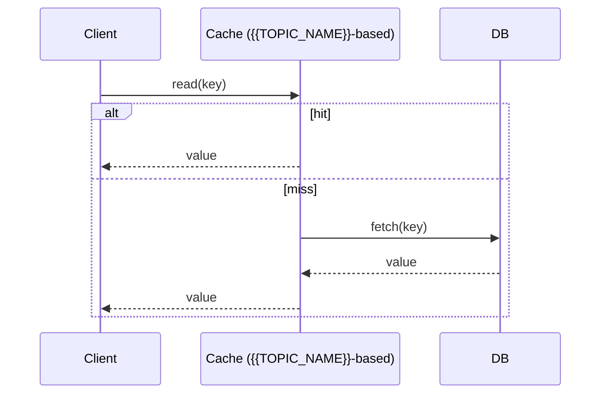

# Data Structures & Algorithms Roadmap — Universal Template

> Guides content generation for **Data Structures & Algorithms** topics.

## Overview

| | Description |
|---|---|
| **Purpose** | Universal template for all Data Structures & Algorithms roadmap topics |
| **Files per topic** | 8 files: `junior.md`, `middle.md`, `senior.md`, `professional.md`, `interview.md`, `tasks.md`, `find-bug.md`, `optimize.md` |
| **Code Fences** | `python` for implementations, `text` for pseudocode |
| **Table of Contents** | Optional — omit for `tasks.md`, `find-bug.md`, `optimize.md` |

### Topic Structure

```
XX-topic-name/
├── junior.md          ← "What?" and "How?" — basic DS + Big-O
├── middle.md          ← "Why?" and "When?" — graphs, DP, advanced trees
├── senior.md          ← system design with DS + distributed
├── professional.md    ← formal proofs, NP-completeness, amortized analysis
├── interview.md       ← interview prep across all levels
├── tasks.md           ← hands-on practice tasks
├── find-bug.md        ← find and fix bugs (10+ exercises)
└── optimize.md        ← optimize slow/inefficient code (10+ exercises)
```

## Level Comparison Matrix

| Aspect | Junior | Middle | Senior | Professional |
|:------:|:------:|:------:|:------:|:------------:|
| **Depth** | Basic DS, Big-O intro | Graphs, DP, advanced trees | System design with DS, distributed | Formal proofs, NP-completeness, amortized analysis |
| **Code** | Simple Python implementations | Production-ready, optimized | Scalable, concurrent | Correctness proofs |
| **Focus** | "What?" and "How?" | "Why?" and "When?" | "How to scale?" | "Is this provably correct?" |

---

# TEMPLATE 1 — `junior.md`

# {{TOPIC_NAME}} — Junior Level

## Introduction
Brief explanation of what {{TOPIC_NAME}} is. Assume basic Python knowledge, no prior algorithms background.

## Prerequisites
- **Required:** Basic Python — loops, functions, lists
- **Required:** Understanding of variables and memory
- **Helpful:** Recursion basics

## Glossary

| Term | Definition |
|------|-----------|
| **{{Term 1}}** | One-sentence definition |
| **Big-O Notation** | Describes how runtime or memory grows with input size |
| **Time Complexity** | How long an algorithm takes relative to input size |
| **Space Complexity** | How much memory an algorithm uses relative to input size |

## Core Concepts

### Concept 1: {{name}}
3-5 sentence explanation with analogy.

### Big-O Summary

| Operation | Complexity | Notes |
|-----------|-----------|-------|
| Access | O(?) | |
| Search | O(?) | |
| Insert | O(?) | |
| Delete | O(?) | |

## Real-World Analogies

| Concept | Analogy |
|---------|--------|
| **{{Concept 1}}** | e.g., "A stack is like a pile of plates" |
| **{{Concept 2}}** | Everyday analogy |

> Note where each analogy breaks down.

## Pros & Cons

| Pros | Cons |
|------|------|
| {{Advantage 1}} | {{Disadvantage 1}} |
| {{Advantage 2}} | {{Disadvantage 2}} |

**When to use:** {{scenario}}
**When NOT to use:** {{scenario}}

## Code Examples

### Example 1: {{title}}

```python
# Full working example with comments
def example(data):
    # Step 1: ...
    pass

if __name__ == "__main__":
    example([1, 2, 3])
```

**What it does:** Brief explanation. **Run:** `python example.py`

## Coding Patterns

### Pattern 1: {{name}}
**Intent:** One sentence.

```python
# Pattern implementation — simple and commented
```

```mermaid
graph TD
    A[Input] --> B[{{TOPIC_NAME}} Operation]
    B --> C[Output]
    B --> D[State Change]
```

## Error Handling

| Error | Cause | Fix |
|-------|-------|-----|
| `IndexError` | Accessing out-of-bounds index | Check bounds before access |
| `RecursionError` | Missing base case | Define base case first |

## Performance Tips
- Know Big-O of every operation before choosing a structure
- Prefer Python built-ins (`list`, `dict`, `set`) — C-optimized

## Best Practices
- Validate input, write brute-force first, test empty/single/large inputs

## Edge Cases & Pitfalls
- Empty structure, single element, duplicates, already-sorted input

## Common Mistakes
- Off-by-one in indices, missing null case, mutating input during iteration

## Cheat Sheet

| Operation | Time | Space | Notes |
|-----------|------|-------|-------|
| {{op 1}} | O(?) | O(?) | |
| {{op 2}} | O(?) | O(?) | |

## Summary
{{TOPIC_NAME}} is used for {{main purpose}}. Focus on basic operations and their complexities. Build working implementations before reaching for libraries.

## Further Reading
- *Introduction to Algorithms* (CLRS) — Chapter on {{TOPIC_NAME}}
- Python docs: `collections`, `heapq`, `bisect`
- visualgo.net — interactive visualizations

---

# TEMPLATE 2 — `middle.md`

# {{TOPIC_NAME}} — Middle Level

## Introduction
> Focus: "Why does it work?" and "When should I choose this?"

Understand the invariants that make {{TOPIC_NAME}} correct, when it degrades, and how it fits into larger algorithmic strategies.

## Deeper Concepts

### Invariant: {{name}}
Describe the structural invariant {{TOPIC_NAME}} maintains and what breaks if violated.

### Recurrence Relations

```text
T(n) = aT(n/b) + f(n)
By Master Theorem: T(n) = O(...)
```

## Comparison with Alternative Algorithms / Data Structures

| Attribute | {{TOPIC_NAME}} | {{Alternative 1}} | {{Alternative 2}} |
|-----------|--------------|-----------------|-----------------|
| Time (avg) | O(?) | O(?) | O(?) |
| Time (worst) | O(?) | O(?) | O(?) |
| Space | O(?) | O(?) | O(?) |
| Best for | {{scenario}} | {{scenario}} | {{scenario}} |

**Choose {{TOPIC_NAME}} when:** {{condition}}
**Choose {{Alternative 1}} when:** {{condition}}

## Advanced Patterns

### Pattern: Two-Pointer / Sliding Window

```python
def two_pointer(arr, target):
    left, right = 0, len(arr) - 1
    while left < right:
        # process arr[left] and arr[right]
        left += 1
        right -= 1
```

### Pattern: Divide and Conquer

```python
def divide_and_conquer(arr, low, high):
    if low >= high:
        return
    mid = (low + high) // 2
    divide_and_conquer(arr, low, mid)
    divide_and_conquer(arr, mid + 1, high)
    # combine
```

## Graph and Tree Applications

```mermaid
graph TD
    A[{{TOPIC_NAME}}] --> B[BFS — uses queue]
    A --> C[DFS — uses stack/recursion]
    A --> D[Dijkstra — uses min-heap]
    A --> E[Union-Find — uses array/tree]
```

### BFS with visited set

```python
from collections import deque

def bfs(graph, start):
    visited = set([start])   # MUST have — prevents infinite loop on cycles
    queue = deque([start])
    while queue:
        node = queue.popleft()
        for neighbor in graph[node]:
            if neighbor not in visited:
                visited.add(neighbor)
                queue.append(neighbor)
```

## Dynamic Programming Integration

```python
from functools import lru_cache

@lru_cache(maxsize=None)
def dp(state):
    if base_condition(state):
        return base_value
    return min(dp(s) for s in subproblems(state))
```

## Code Examples

```python
class {{TopicName}}:
    """
    {{TOPIC_NAME}} implementation.
    Time: O(log n) per operation (average). Space: O(n).
    """
    def __init__(self):
        self._data = []

    def insert(self, value):
        self._data.append(value)
        self._sift_up(len(self._data) - 1)
```

## Error Handling

| Scenario | What goes wrong | Correct approach |
|----------|----------------|-----------------|
| Cycle without visited set | Infinite BFS loop | Always maintain `visited` |
| Wrong DP base case | All subproblems wrong | Test base cases independently |
| Off-by-one in binary search | Wrong index returned | Use `left + (right - left) // 2` |

## Performance Analysis

```python
import timeit

t = timeit.timeit(
    "your_algorithm(data)",
    setup="data = list(range(10_000))",
    number=100
)
print(f"Average: {t / 100 * 1000:.2f} ms")
```

## Best Practices
- Implement from scratch once; understand before using a library
- Document time and space complexity in docstrings
- Prefer iterative over recursive for large inputs in Python

## Summary
At the middle level, {{TOPIC_NAME}} is understood through its invariants, failure conditions, and role in graphs and DP. Master when to choose it over alternatives.

---

# TEMPLATE 3 — `senior.md`

# {{TOPIC_NAME}} — Senior Level

## Introduction
> Focus: "How to architect systems around {{TOPIC_NAME}}?"

Senior engineers choose data structures based on system constraints: latency SLAs, memory budgets, fault tolerance, and concurrency.

## System Design with {{TOPIC_NAME}}

```mermaid
graph TD
    Client -->|request| LoadBalancer
    LoadBalancer --> Service1
    LoadBalancer --> Service2
    Service1 -->|uses| DS[{{TOPIC_NAME}}]
    Service2 -->|uses| DS
    DS --> Storage[(Distributed Storage)]
```

## Distributed Data Structures

| Structure | Consistency | Use Case |
|-----------|------------|---------|
| Consistent hash ring | Eventual | Key routing in distributed caches |
| Bloom filter | Probabilistic | Membership checks across nodes |
| LSM tree | Eventual | RocksDB, Cassandra writes |
| Skip list | Strong (single node) | Redis sorted sets |

## Comparison with Alternative Algorithms / Data Structures

| Attribute | {{TOPIC_NAME}} | {{Alternative 1}} | {{Alternative 2}} |
|-----------|--------------|-----------------|-----------------|
| Write throughput | | | |
| Read latency p99 | | | |
| Memory overhead | | | |
| Production usage | {{e.g., Redis}} | | |

## Architecture Patterns



## Code Examples

```python
import threading

class ThreadSafe{{TopicName}}:
    def __init__(self):
        self._lock = threading.RLock()
        self._data = []

    def insert(self, value):
        with self._lock:
            self._insert_impl(value)
```

## Observability

| Metric | Alert Threshold |
|--------|----------------|
| `operation_latency_p99` | > 10 ms |
| `memory_used_bytes` | > 80% of budget |
| `cache_hit_ratio` | < 0.8 |

## Failure Modes
- **Hot partition:** one shard overloaded — use virtual nodes
- **Memory exhaustion:** unbounded growth — add LRU/TTL eviction
- **Thundering herd:** simultaneous cache misses — probabilistic early expiration

## Summary
At senior level, evaluate {{TOPIC_NAME}} against system-wide constraints. Complexity analysis expands to cache behavior, concurrency, and distribution.

---

# TEMPLATE 4 — `professional.md`

# {{TOPIC_NAME}} — Mathematical Foundations and Complexity Theory

## Table of Contents
1. [Formal Definition](#formal-definition)
2. [Correctness Proof — Loop Invariants](#correctness-proof)
3. [Amortized Analysis](#amortized-analysis)
4. [NP-Completeness and Polynomial Reductions](#np-completeness)
5. [Randomized Algorithm Probability Bounds](#randomized-algorithms)
6. [Cache-Oblivious Analysis](#cache-oblivious-analysis)
7. [Comparison with Alternative Algorithms / Data Structures](#comparison)
8. [Summary](#summary)

---

## Formal Definition

```text
Definition: A {{TOPIC_NAME}} is a tuple (S, Σ, δ, ...) where:
  S = set of states/elements
  Σ = key space
  δ = operation function

Invariant I(S): [formal predicate true after every operation]
```

## Correctness Proof — Loop Invariants

```text
Claim: Algorithm A correctly computes {{result}} for all valid inputs.

Invariant I: At the start of iteration k, {{property holds}}.

Base case (k=0):   {{show I holds initially}}
Inductive step:    Assume I at k. Show I at k+1: {{argument}}
Termination:       {{var}} strictly {{increases/decreases}} by {{amount}},
                   bounded by {{bound}} → terminates in O(n) iterations.
Postcondition:     I holds and exit condition true → {{result}} holds. ∎
```

## Amortized Analysis

### Aggregate Method

```text
Total cost of n operations: Σ cost(opᵢ) ≤ O(f(n))
Amortized cost per op = O(f(n)/n)

Dynamic array: n pushes cost n + (1+2+4+...+n) = O(n) → O(1) amortized
```

### Potential Method

```text
Φ: states → ℝ≥0

Amortized cost: â_i = c_i + Φ(Dᵢ) - Φ(Dᵢ₋₁)
Total actual:   Σ c_i ≤ Σ â_i + Φ(D₀)

For {{TOPIC_NAME}}: Φ(D) = {{specific potential function and justification}}
```

## NP-Completeness and Polynomial Reductions

```text
Problem: {{formal problem statement}}
Theorem: {{Problem}} is NP-complete.
Proof:   Reduction from {{known NP-complete problem}} in poly time:
  1. Given instance x, construct f(x) in O(poly(|x|))
  2. x is YES ⟺ f(x) is YES   [construction + equivalence proof]
```

## Randomized Algorithm Probability Bounds

```text
Theorem: Expected running time is O(f(n)).

Let Xᵢ = indicator for event Eᵢ.  E[Xᵢ] = Pr[Eᵢ].
By linearity of expectation: E[T(n)] = Σ E[Xᵢ] = O(f(n)). ∎

High-probability bound (Chernoff):
  Pr[X ≥ (1+δ)μ] ≤ e^(-μδ²/3)  →  Pr[bad event] ≤ 1/n^c. ∎
```

## Cache-Oblivious Analysis

```text
Parameters: N = problem size, M = cache size, B = block size

Naive I/Os: O(N)
Cache-oblivious {{TOPIC_NAME}}: O(N/B · log_{M/B}(N/B))

Van Emde Boas layout:
  Split tree at height h/2; store top and bottom subtrees contiguously.
  Cache misses: O((N/B) log log N)
```

## Comparison with Alternative Algorithms / Data Structures

| Attribute | {{TOPIC_NAME}} | {{Alternative 1}} | {{Alternative 2}} |
|-----------|--------------|-----------------|-----------------|
| Worst-case | O(?) | O(?) | O(?) |
| Cache I/Os | O(?) | O(?) | O(?) |
| Deterministic? | Yes/No | Yes/No | Yes/No |

## Summary
At professional level, correctness is proven with loop invariants, efficiency justified with amortized methods, tractability boundaries set by NP-hardness, and hardware reality captured by cache-oblivious analysis.

---

# TEMPLATE 5 — `interview.md`

# {{TOPIC_NAME}} — Interview Preparation

## Junior Questions

| # | Question | Expected Answer Focus |
|---|----------|-----------------------|
| 1 | What is {{TOPIC_NAME}} and when would you use it? | Definition, use cases, Big-O |
| 2 | What is the time complexity of [operation]? | Specific complexity with justification |
| 3 | Difference between {{TOPIC_NAME}} and {{Alternative}}? | Key structural difference |
| 4 | How do you spot an off-by-one in binary search? | Loop condition analysis |

## Middle Questions

| # | Question | Expected Answer Focus |
|---|----------|-----------------------|
| 1 | When does {{TOPIC_NAME}} degrade to worst-case? | Adversarial input construction |
| 2 | Implement an LRU cache. | Hash map + doubly-linked list |
| 3 | BFS vs DFS — when to choose each? | Queue/stack, level-order vs depth |
| 4 | Detect a cycle in a directed graph. | DFS with gray/black coloring |

## Senior Questions

| # | Question | Expected Answer Focus |
|---|----------|-----------------------|
| 1 | Design a distributed key-value store. | Hash ring + LSM tree + Bloom filter |
| 2 | Hash map vs BST in production? | Ordering, memory, worst-case latency |
| 3 | How does {{TOPIC_NAME}} behave under concurrent access? | Lock granularity, lock-free options |

## Professional Questions

| # | Question | Expected Answer Focus |
|---|----------|-----------------------|
| 1 | Prove binary search correct with a loop invariant. | Invariant, induction, termination |
| 2 | Prove comparison sort is Ω(n log n). | Decision tree argument |
| 3 | Derive amortized cost of dynamic array push. | Potential function Φ = 2·size - capacity |

## Coding Patterns

```python
# Binary search — canonical form
def binary_search(arr, target):
    left, right = 0, len(arr) - 1
    while left <= right:
        mid = left + (right - left) // 2  # avoids overflow
        if arr[mid] == target:
            return mid
        elif arr[mid] < target:
            left = mid + 1
        else:
            right = mid - 1
    return -1
```

---

# TEMPLATE 6 — `tasks.md`

# {{TOPIC_NAME}} — Practice Tasks

## Beginner Tasks

**Task 1:** Implement {{TOPIC_NAME}} from scratch without any library.
- Constraints: correct Big-O, test with empty/single/duplicate inputs.

**Task 2:** Find the k-th largest element using a heap. Constraint: O(n log k) time.

**Task 3:** Implement a stack supporting `push`, `pop`, and `get_min` in O(1).

**Task 4:** Reverse a singly linked list iteratively and recursively.

**Task 5:** Check whether a binary tree is a valid BST.

## Intermediate Tasks

**Task 6:** Shortest path in an unweighted graph (BFS). Return the path or -1.

**Task 7:** Longest Common Subsequence with DP. Optimize space to O(min(m,n)).

**Task 8:** Dijkstra's algorithm with a priority queue. O((V+E) log V).
Document what breaks with negative weights.

**Task 9:** Merge overlapping intervals. Input: `[[1,3],[2,6],[8,10]]`.

**Task 10:** Implement a Trie with `insert`, `search`, `starts_with`.

## Advanced Tasks

**Task 11:** LRU cache with O(1) get and put — `dict` + doubly-linked list.

**Task 12:** Strongly connected components (Kosaraju's or Tarjan's).

**Task 13:** 0/1 knapsack with DP. Trace the optimal item selection.

**Task 14:** Segment tree for range sum queries and point updates in O(log n).

**Task 15:** Skip list with probabilistic balancing. Analyze expected search time.

## Benchmark Task

```python
import timeit

sizes = [10, 100, 1_000, 10_000, 100_000]
for n in sizes:
    t = timeit.timeit(lambda: your_implementation(list(range(n))), number=50)
    print(f"n={n:>7}: {t/50*1000:.3f} ms")
```

---

# TEMPLATE 7 — `find-bug.md`

# {{TOPIC_NAME}} — Find the Bug

> 10+ exercises. Each shows buggy code — find, explain, and fix.

---

## Exercise 1: Off-by-One in Binary Search

```python
def binary_search(arr, target):
    left, right = 0, len(arr)      # BUG: should be len(arr) - 1
    while left < right:            # BUG: should be <=
        mid = (left + right) // 2
        if arr[mid] == target:
            return mid
        elif arr[mid] < target:
            left = mid + 1
        else:
            right = mid
    return -1
```

**Bug:** `right = len(arr)` is one past the last valid index; `left < right` exits too early.

**Fix:**
```python
def binary_search(arr, target):
    left, right = 0, len(arr) - 1
    while left <= right:
        mid = left + (right - left) // 2
        if arr[mid] == target: return mid
        elif arr[mid] < target: left = mid + 1
        else: right = mid - 1
    return -1
```

---

## Exercise 2: Missing Visited Set in BFS (Infinite Loop)

```python
from collections import deque

def bfs(graph, start):
    queue = deque([start])
    while queue:
        node = queue.popleft()
        for neighbor in graph[node]:
            queue.append(neighbor)   # BUG: no visited check — infinite loop on any cycle
```

**Fix:** Add `visited = set([start])` and guard with `if neighbor not in visited`.

---

## Exercise 3: Wrong Base Case in Recursion

```python
def fibonacci(n):
    if n == 0:
        return 0
    # BUG: missing n == 1 base case — fibonacci(-1) recurses forever
    return fibonacci(n - 1) + fibonacci(n - 2)
```

**Fix:** Add `if n == 1: return 1` and `if n < 0: raise ValueError`.

---

## Exercise 4: Integer Overflow Pattern (typed languages)

```python
# UNSAFE in Java/C++ — left + right can exceed INT_MAX:
# mid = (left + right) / 2

# SAFE pattern — always use this:
mid = left + (right - left) // 2
```

---

## Exercise 5: Mutating a List While Iterating

```python
def remove_evens(arr):
    for i in range(len(arr)):
        if arr[i] % 2 == 0:
            arr.pop(i)    # BUG: shifts indices, skips elements
    return arr
```

**Fix:** `return [x for x in arr if x % 2 != 0]`

---

## Exercise 6: Incorrect Cycle Detection (Directed Graph)

```python
def has_cycle(graph, node, visited):
    visited.add(node)
    for neighbor in graph[node]:
        if neighbor in visited:
            return True    # BUG: visited not cleaned on backtrack — false positives
        if has_cycle(graph, neighbor, visited):
            return True
    return False
```

**Fix:** Use a separate `in_stack` set. Remove node from `in_stack` after the loop.

---

## Exercise 7: Heap Push/Pop Order Confusion

```python
import heapq

def kth_largest(nums, k):
    heap = []
    for n in nums:
        heapq.heappush(heap, n)     # BUG: min-heap returns k-th smallest
    for _ in range(k):
        result = heapq.heappop(heap)
    return result
```

**Fix:** Push `-n` to simulate a max-heap; return `-heapq.heappop(heap)`.

---

## Exercise 8: DP Array Not Initialized Correctly

```python
def lis(nums):
    dp = [0] * len(nums)    # BUG: should be [1] — each element alone has length 1
    for i in range(1, len(nums)):
        for j in range(i):
            if nums[j] < nums[i]:
                dp[i] = max(dp[i], dp[j] + 1)
    return max(dp)
```

**Fix:** `dp = [1] * len(nums)`

---

# TEMPLATE 8 — `optimize.md`

# {{TOPIC_NAME}} — Optimize

> 10+ exercises. Show before/after complexities and `timeit` benchmarks.

---

## Exercise 1: O(n²) → O(n log n) Sorting

```python
# BEFORE — O(n²)
def bubble_sort(arr):
    for i in range(len(arr)):
        for j in range(len(arr) - i - 1):
            if arr[j] > arr[j+1]:
                arr[j], arr[j+1] = arr[j+1], arr[j]
```

```python
# AFTER — O(n log n)
def merge_sort(arr):
    if len(arr) <= 1: return arr
    mid = len(arr) // 2
    left, right = merge_sort(arr[:mid]), merge_sort(arr[mid:])
    result, i, j = [], 0, 0
    while i < len(left) and j < len(right):
        if left[i] <= right[j]: result.append(left[i]); i += 1
        else: result.append(right[j]); j += 1
    return result + left[i:] + right[j:]
```

| | Time | Space |
|---|------|-------|
| Before | O(n²) | O(1) |
| After | O(n log n) | O(n) |

```python
import timeit, random
data = random.sample(range(100_000), 10_000)
print(timeit.timeit(lambda: bubble_sort(data[:]), number=5))
print(timeit.timeit(lambda: merge_sort(data[:]), number=5))
```

---

## Exercise 2: O(n²) Two-Sum → O(n)

```python
# BEFORE — O(n²)
def two_sum_slow(arr, target):
    for i in range(len(arr)):
        for j in range(i+1, len(arr)):
            if arr[i] + arr[j] == target: return (i, j)
```

```python
# AFTER — O(n)
def two_sum_fast(arr, target):
    seen = {}
    for i, val in enumerate(arr):
        if target - val in seen: return (seen[target - val], i)
        seen[val] = i
```

---

## Exercise 3: Exponential Fibonacci → O(n)

```python
# BEFORE — O(2ⁿ)
def fib(n):
    if n <= 1: return n
    return fib(n-1) + fib(n-2)
```

```python
# AFTER — O(n)
from functools import lru_cache

@lru_cache(maxsize=None)
def fib(n):
    if n <= 1: return n
    return fib(n-1) + fib(n-2)
```

---

## Exercise 4: Linear Search → Binary Search (sorted input)

```python
# BEFORE — O(n)
def find(arr, target):
    for i, v in enumerate(arr):
        if v == target: return i
    return -1
```

```python
# AFTER — O(log n)
import bisect

def find_sorted(arr, target):
    idx = bisect.bisect_left(arr, target)
    return idx if idx < len(arr) and arr[idx] == target else -1
```

## Optimization Summary

| Exercise | Before | After | Strategy |
|----------|--------|-------|----------|
| Sorting | O(n²) | O(n log n) | Divide and conquer |
| Two-sum | O(n²) | O(n) | Hash map complement |
| Fibonacci | O(2ⁿ) | O(n) | Memoization |
| Search | O(n) | O(log n) | Binary search on sorted input |

> Additional exercises to add: DP space rolling array O(m×n)→O(n), sliding window max O(n·k)→O(n), string concat O(n²)→O(n) with `join`, membership test O(n²)→O(n) with `set`.
