# Machine Learning Roadmap — Universal Template

> **A comprehensive template system for generating Machine Learning roadmap content across all skill levels.**

---

## Overview

| | Description |
|---|---|
| **Purpose** | Universal template for all Machine Learning roadmap topics |
| **Files per topic** | 8 files: `junior.md`, `middle.md`, `senior.md`, `professional.md`, `interview.md`, `tasks.md`, `find-bug.md`, `optimize.md` |
| **Language** | All content must be generated in **English** |
| **Table of Contents** | **Optional** — include only if relevant to the topic |

### Topic Structure

```
XX-topic-name/
├── junior.md          ← "What?" and "How?"
├── middle.md          ← "Why?" and "When?"
├── senior.md          ← "How to optimize?" and "How to architect?"
├── professional.md    ← "Mathematical and Algorithmic Foundations"
├── interview.md       ← Interview prep across all levels
├── tasks.md           ← Hands-on practice tasks
├── find-bug.md        ← Find and fix bugs in ML code (10+ exercises)
└── optimize.md        ← Optimize slow/inefficient pipelines (10+ exercises)
```

---

## Level Comparison Matrix

| Aspect | Junior | Middle | Senior | Professional |
|:------:|:------:|:------:|:------:|:------------:|
| **Depth** | Basic ML concepts, simple models | Practical usage, real-world pipelines | Architecture, optimization, scaling | Mathematical foundations, gradient analysis |
| **Code** | sklearn hello-world | Production pipelines, cross-validation | Advanced patterns, benchmarks | NumPy from scratch, custom autograd |
| **Tricky Points** | Train/test split errors | Data leakage, overfitting | Distributed training pitfalls | Gradient vanishing, numerical instability |
| **Focus** | "What?" and "How?" | "Why?" and "When?" | "How to improve?" | "What happens mathematically?" |

---
---

# TEMPLATE 1 — `junior.md`

<details open>
<summary><strong>Template Content</strong></summary>

# {{TOPIC_NAME}} — Junior Level

## Table of Contents

1. [Introduction](#introduction)
2. [Prerequisites](#prerequisites)
3. [Glossary](#glossary)
4. [Core Concepts](#core-concepts)
5. [Pros & Cons](#pros--cons)
6. [Use Cases](#use-cases)
7. [Code Examples](#code-examples)
8. [Coding Patterns](#coding-patterns)
9. [Clean Code](#clean-code)
10. [Product Use / Feature](#product-use--feature)
11. [Data Quality and Model Failure Handling](#data-quality-and-model-failure-handling)
12. [Security Considerations](#security-considerations)
13. [Performance Tips](#performance-tips)
14. [Metrics & Analytics](#metrics--analytics)
15. [Best Practices](#best-practices)
16. [Edge Cases & Pitfalls](#edge-cases--pitfalls)
17. [Common Mistakes](#common-mistakes)
18. [Tricky Points](#tricky-points)
19. [Test](#test)
20. [Tricky Questions](#tricky-questions)
21. [Cheat Sheet](#cheat-sheet)
22. [Summary](#summary)
23. [What You Can Build](#what-you-can-build)
24. [Further Reading](#further-reading)
25. [Related Topics](#related-topics)
26. [Diagrams & Visual Aids](#diagrams--visual-aids)

---

## Introduction

> Focus: "What is it?" and "How to use it?"

Brief explanation of what {{TOPIC_NAME}} is and why a beginner needs to know it.
Keep it simple — assume the reader has basic Python knowledge but is new to machine learning.

---

## Prerequisites

- **Required:** Python basics — loops, functions, lists
- **Required:** Basic statistics — mean, variance, probability
- **Helpful but not required:** Linear algebra — vectors, matrices

---

## Glossary

| Term | Definition |
|------|-----------|
| **Feature** | An input variable used to make predictions |
| **Label / Target** | The output variable the model tries to predict |
| **Training set** | Data used to fit the model |
| **Test set** | Held-out data used to evaluate the model |
| **Overfitting** | Model memorizes training data but fails on new data |
| **{{Term 6}}** | Simple, one-sentence definition |

---

## Core Concepts

### Concept 1: {{name}}

Simple explanation with analogy if helpful.

### Concept 2: {{name}}

...

---

## Real-World Analogies

| Concept | Analogy |
|---------|--------|
| **Training** | Like studying for an exam using past papers |
| **Overfitting** | Like memorizing every question instead of understanding the subject |
| **Feature** | Like attributes on a job application (age, experience, education) |

---

## Mental Models

**The intuition:** {{A simple mental model for this ML concept}}

**Why this model helps:** {{Why this prevents common mistakes}}

---

## Pros & Cons

| Pros | Cons |
|------|------|
| {{Advantage 1}} | {{Disadvantage 1}} |
| {{Advantage 2}} | {{Disadvantage 2}} |
| {{Advantage 3}} | {{Disadvantage 3}} |

---

## Use Cases

- **Use Case 1:** Image classification — identifying objects in photos
- **Use Case 2:** Spam detection — classifying emails as spam or not
- **Use Case 3:** Price prediction — estimating house prices from features

---

## Code Examples

### Example 1: {{title}}

```python
from sklearn.datasets import load_iris
from sklearn.model_selection import train_test_split
from sklearn.ensemble import RandomForestClassifier
from sklearn.metrics import accuracy_score

# Load dataset
X, y = load_iris(return_X_y=True)

# Split into training and test sets
X_train, X_test, y_train, y_test = train_test_split(
    X, y, test_size=0.2, random_state=42
)

# Train model
model = RandomForestClassifier(n_estimators=100, random_state=42)
model.fit(X_train, y_train)

# Evaluate
predictions = model.predict(X_test)
accuracy = accuracy_score(y_test, predictions)
print(f"Accuracy: {accuracy:.3f}")
```

**What it does:** Trains a Random Forest classifier on the Iris dataset and evaluates it.
**How to run:** `python train_model.py`

### Example 2: {{title}}

```python
import numpy as np
import matplotlib.pyplot as plt
from sklearn.linear_model import LinearRegression

# Simple linear regression example
X = np.array([[1], [2], [3], [4], [5]])
y = np.array([2.1, 4.0, 5.8, 8.1, 10.2])

model = LinearRegression()
model.fit(X, y)

print(f"Slope: {model.coef_[0]:.2f}")
print(f"Intercept: {model.intercept_:.2f}")
```

---

## Coding Patterns

### Pattern 1: Train-Evaluate-Iterate Loop

**Intent:** Systematic model development with measurable progress.
**When to use:** Every supervised learning project.

```python
from sklearn.model_selection import cross_val_score
from sklearn.pipeline import Pipeline
from sklearn.preprocessing import StandardScaler

pipeline = Pipeline([
    ('scaler', StandardScaler()),
    ('model', RandomForestClassifier(random_state=42))
])

scores = cross_val_score(pipeline, X, y, cv=5, scoring='accuracy')
print(f"Accuracy: {scores.mean():.3f} ± {scores.std():.3f}")
```

**Diagram:**

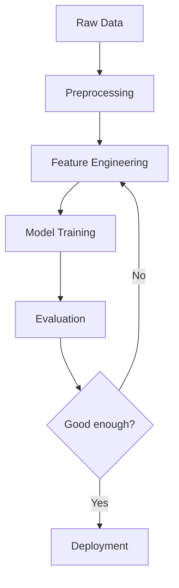

**Remember:** Always evaluate with cross-validation, not a single train/test split.

---

### Pattern 2: Preprocessing Pipeline

**Intent:** Prevent data leakage by fitting preprocessing only on training data.
**When to use:** Any time you scale, encode, or transform features.

```python
from sklearn.pipeline import Pipeline
from sklearn.preprocessing import StandardScaler, OneHotEncoder
from sklearn.compose import ColumnTransformer

# Numeric features: scale; categorical: one-hot encode
preprocessor = ColumnTransformer([
    ('num', StandardScaler(), numeric_features),
    ('cat', OneHotEncoder(handle_unknown='ignore'), categorical_features)
])

pipeline = Pipeline([
    ('preprocessor', preprocessor),
    ('classifier', RandomForestClassifier())
])

# Fit only on training data — no leakage
pipeline.fit(X_train, y_train)
```

**Diagram:**

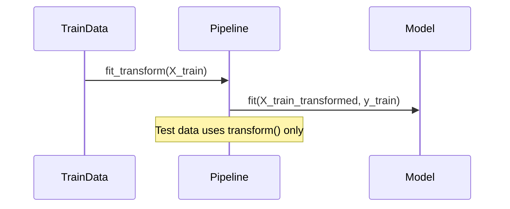

---

## Clean Code

### Naming

```python
# Bad naming
def proc(d, l):
    m = RF()
    m.fit(d, l)
    return m

# Clean naming
def train_classifier(feature_matrix: np.ndarray, labels: np.ndarray) -> RandomForestClassifier:
    model = RandomForestClassifier(n_estimators=100, random_state=42)
    model.fit(feature_matrix, labels)
    return model
```

**Rules:**
- No single-letter variable names for features: use `feature_matrix`, not `X`
- Labels should be named `target_labels` or `y_train`, not just `y`
- Functions: `train_model`, `evaluate_model`, not `run`, `proc`

---

### Reproducibility

```python
# Bad — non-reproducible
model = RandomForestClassifier()
X_train, X_test = train_test_split(X, y)

# Good — seeded, reproducible
import numpy as np
np.random.seed(42)

model = RandomForestClassifier(n_estimators=100, random_state=42)
X_train, X_test, y_train, y_test = train_test_split(
    X, y, test_size=0.2, random_state=42
)
```

**Rule:** Always set `random_state` for any stochastic operation. Results must be reproducible.

---

## Product Use / Feature

### 1. Netflix Recommendation System

- **How it uses ML:** Collaborative filtering + deep learning to predict what users will watch
- **Why it matters:** Directly drives engagement and reduces churn

### 2. Gmail Spam Filter

- **How it uses ML:** Text classification to separate spam from legitimate email
- **Why it matters:** Processes billions of emails daily with high precision

### 3. Google Translate

- **How it uses ML:** Neural machine translation (transformer models)
- **Why it matters:** Handles 100+ languages with near-human quality

---

## Data Quality and Model Failure Handling

### Error 1: Missing values in features

```python
# Code that causes silent failures
model.fit(X_train, y_train)  # Fails if X_train has NaN values
```

**Why it happens:** sklearn models don't handle NaN by default.
**How to fix:**

```python
from sklearn.impute import SimpleImputer

imputer = SimpleImputer(strategy='median')
X_train_clean = imputer.fit_transform(X_train)
X_test_clean = imputer.transform(X_test)
```

### Error 2: Wrong metric for imbalanced data

```python
# Bad — accuracy is misleading on imbalanced datasets
score = accuracy_score(y_test, predictions)

# Better — use F1 or balanced accuracy
from sklearn.metrics import f1_score, balanced_accuracy_score
f1 = f1_score(y_test, predictions, average='macro')
```

### Data Quality Pattern

```python
def validate_dataset(X: np.ndarray, y: np.ndarray) -> None:
    assert not np.any(np.isnan(X)), "Features contain NaN values"
    assert len(X) == len(y), "Feature and label counts don't match"
    assert len(np.unique(y)) > 1, "Only one class in labels"
```

---

## Security Considerations

### 1. Model Inversion Attack

```python
# Insecure — exposing raw model predictions can reveal training data
return {"prediction": float(model.predict_proba(X)[0][1])}

# More secure — return class label only, not probabilities
return {"prediction": int(model.predict(X)[0])}
```

**Risk:** Adversaries can reconstruct training data from prediction probabilities.

---

## Performance Tips

### Tip 1: Use vectorized operations

```python
# Slow — Python loop
results = [model.predict([row]) for row in X_test]

# Fast — vectorized batch prediction
results = model.predict(X_test)
```

### Tip 2: Pre-split your data once

```python
# Save splits to avoid re-splitting on every run
X_train, X_test, y_train, y_test = train_test_split(X, y, random_state=42)
np.save("X_train.npy", X_train)
np.save("y_train.npy", y_train)
```

---

## Metrics & Analytics

### What to Measure

| Metric | Why it matters | Tool |
|--------|---------------|------|
| **Accuracy / F1** | Primary model quality signal | sklearn.metrics |
| **Training time** | Guards against unexpectedly slow training | `time.time()` |
| **Inference latency** | Critical for production serving | p50/p99 timing |

---

## Best Practices

- **Always split before preprocessing** — prevents data leakage
- **Use pipelines** — ensures preprocessing is applied consistently
- **Set all random seeds** — makes experiments reproducible

---

## Edge Cases & Pitfalls

### Pitfall 1: Data leakage

```python
# Bug — scaler fit on entire dataset (including test data)
scaler = StandardScaler()
X_scaled = scaler.fit_transform(X)  # WRONG: uses test data info
X_train_scaled, X_test_scaled = train_test_split(X_scaled)

# Fix — fit scaler only on training data
X_train, X_test = train_test_split(X)
scaler = StandardScaler()
X_train_scaled = scaler.fit_transform(X_train)
X_test_scaled = scaler.transform(X_test)  # transform only
```

---

## Cheat Sheet

| What | Syntax / Command | Example |
|------|-----------------|---------|
| Train model | `model.fit(X_train, y_train)` | See Example 1 |
| Predict | `model.predict(X_test)` | `predictions = model.predict(X_test)` |
| Cross-validate | `cross_val_score(model, X, y, cv=5)` | `scores.mean()` |
| Accuracy | `accuracy_score(y_test, preds)` | `0.95` |
| F1 Score | `f1_score(y_test, preds, average='macro')` | `0.93` |

---

## Summary

- ML models learn patterns from labeled data to make predictions on new data
- Always split data before fitting any preprocessing
- Use cross-validation to get reliable performance estimates
- Set random seeds for reproducibility

**Next step:** Learn feature engineering, hyperparameter tuning, and model selection at the middle level.

---

## What You Can Build

### Projects:
- **Titanic Survival Predictor:** Binary classifier on structured data
- **Iris Classifier:** Multi-class classification with visualization
- **House Price Predictor:** Regression with feature engineering

### Learning path:

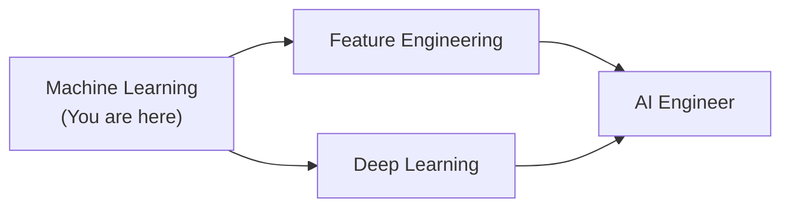

---

## Further Reading

- **Official docs:** [scikit-learn User Guide](https://scikit-learn.org/stable/user_guide.html)
- **Book:** "Hands-On Machine Learning" by Aurélien Géron — Chapters 1-4
- **Course:** fast.ai Practical Deep Learning — Part 1

---

## Related Topics

- **[AI Data Scientist](../ai-data-scientist/)** — applying ML in data science workflows
- **[AI Engineer](../ai-engineer/)** — deploying ML models in production
- **[Data Analyst](../data-analyst/)** — exploratory analysis before ML

---

## Diagrams & Visual Aids

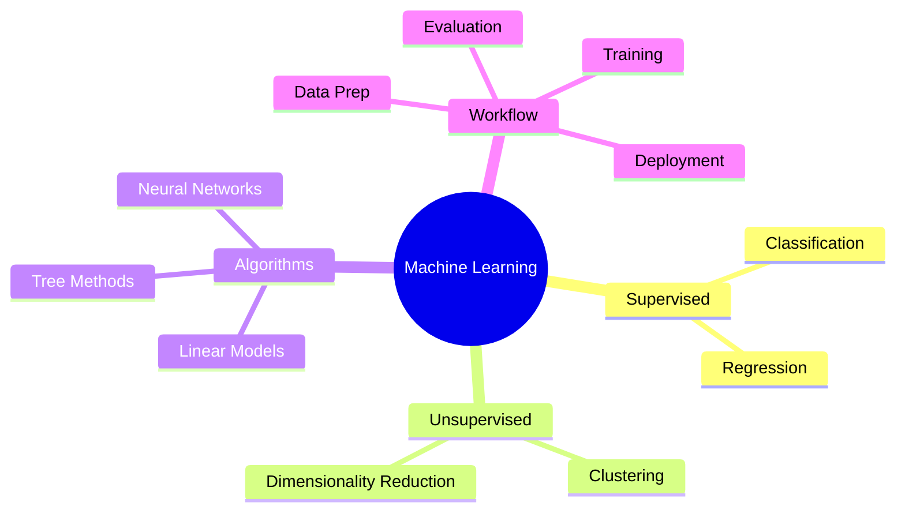

</details>

---
---

# TEMPLATE 2 — `middle.md`

<details open>
<summary><strong>Template Content</strong></summary>

# {{TOPIC_NAME}} — Middle Level

## Table of Contents

1. [Introduction](#introduction)
2. [Core Concepts](#core-concepts)
3. [Pros & Cons](#pros--cons)
4. [Use Cases](#use-cases)
5. [Code Examples](#code-examples)
6. [Coding Patterns](#coding-patterns)
7. [Clean Code](#clean-code)
8. [Product Use / Feature](#product-use--feature)
9. [Data Quality and Model Failure Handling](#data-quality-and-model-failure-handling)
10. [Security Considerations](#security-considerations)
11. [Performance Optimization](#performance-optimization)
12. [Metrics & Analytics](#metrics--analytics)
13. [Debugging Guide](#debugging-guide)
14. [Best Practices](#best-practices)
15. [Edge Cases & Pitfalls](#edge-cases--pitfalls)
16. [Common Mistakes](#common-mistakes)
17. [Tricky Points](#tricky-points)
18. [Comparison with Alternatives](#comparison-with-alternatives)
19. [Test](#test)
20. [Tricky Questions](#tricky-questions)
21. [Cheat Sheet](#cheat-sheet)
22. [Summary](#summary)
23. [What You Can Build](#what-you-can-build)
24. [Further Reading](#further-reading)
25. [Related Topics](#related-topics)
26. [Diagrams & Visual Aids](#diagrams--visual-aids)

---

## Introduction

> Focus: "Why?" and "When to use?"

Assumes basic ML knowledge. This level covers:
- Feature engineering and selection
- Hyperparameter tuning strategies
- Dealing with imbalanced data, missing values, outliers
- Production considerations: model versioning, serving, monitoring

---

## Core Concepts

### Concept 1: Hyperparameter Tuning

Beyond defaults — how to systematically find the best model configuration.

```python
from sklearn.model_selection import GridSearchCV, RandomizedSearchCV

param_grid = {
    'n_estimators': [100, 200, 300],
    'max_depth': [None, 5, 10],
    'min_samples_split': [2, 5, 10]
}

grid_search = GridSearchCV(
    RandomForestClassifier(random_state=42),
    param_grid,
    cv=5,
    scoring='f1_macro',
    n_jobs=-1
)
grid_search.fit(X_train, y_train)
print(f"Best params: {grid_search.best_params_}")
```

### Concept 2: Bias-Variance Trade-off

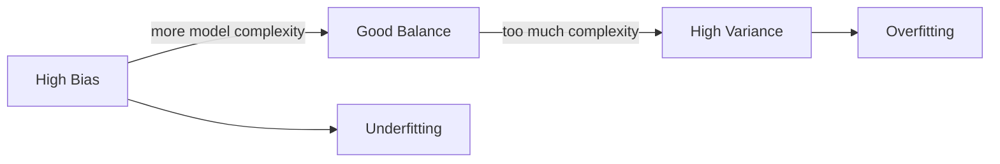

---

## Code Examples

### Example 1: Full ML pipeline with experiment tracking

```python
import mlflow
from sklearn.pipeline import Pipeline
from sklearn.preprocessing import StandardScaler
from sklearn.ensemble import RandomForestClassifier
from sklearn.model_selection import cross_val_score

mlflow.set_experiment("rf-classifier-v2")

with mlflow.start_run():
    # Log parameters
    n_estimators = 200
    max_depth = 10
    mlflow.log_params({"n_estimators": n_estimators, "max_depth": max_depth})

    pipeline = Pipeline([
        ('scaler', StandardScaler()),
        ('model', RandomForestClassifier(
            n_estimators=n_estimators,
            max_depth=max_depth,
            random_state=42
        ))
    ])

    scores = cross_val_score(pipeline, X_train, y_train, cv=5, scoring='f1_macro')
    mlflow.log_metric("cv_f1_mean", scores.mean())
    mlflow.log_metric("cv_f1_std", scores.std())

    pipeline.fit(X_train, y_train)
    mlflow.sklearn.log_model(pipeline, "model")
```

---

## Coding Patterns

### Pattern 1: Train-Evaluate-Iterate Loop

**Category:** Core ML Workflow
**Intent:** Systematic model development with measurable, tracked progress.
**When to use:** Every supervised learning project.

**Structure diagram:**

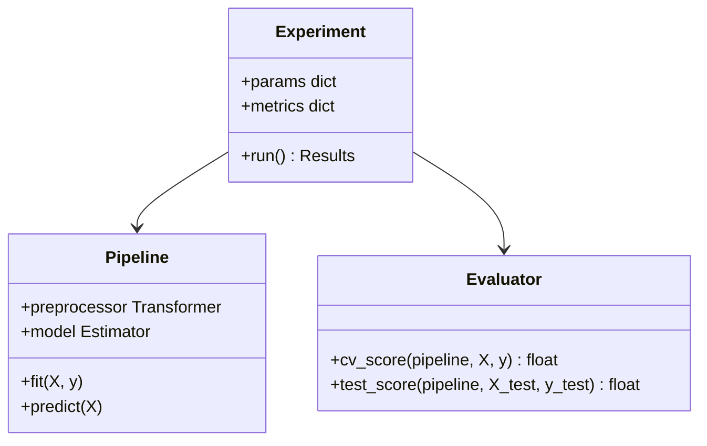

```python
def train_and_evaluate(
    feature_matrix: np.ndarray,
    target_labels: np.ndarray,
    model_params: dict
) -> dict:
    pipeline = build_pipeline(model_params)
    cv_scores = cross_val_score(pipeline, feature_matrix, target_labels, cv=5)
    pipeline.fit(feature_matrix, target_labels)
    return {
        "cv_mean": cv_scores.mean(),
        "cv_std": cv_scores.std(),
        "model": pipeline
    }
```

---

### Pattern 2: Feature Selection Pipeline

**Category:** Feature Engineering
**Intent:** Automatically select the most informative features.

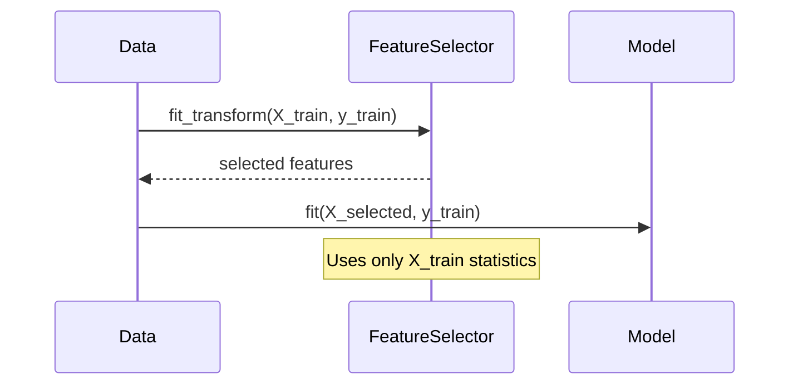

```python
from sklearn.feature_selection import SelectFromModel
from sklearn.ensemble import RandomForestClassifier

selector = SelectFromModel(
    RandomForestClassifier(n_estimators=100, random_state=42),
    threshold='median'
)
X_train_selected = selector.fit_transform(X_train, y_train)
X_test_selected = selector.transform(X_test)
```

---

### Pattern 3: Stratified Cross-Validation for Imbalanced Data

**Category:** Evaluation / Data Quality
**Intent:** Ensure class distribution is preserved across folds.

```python
from sklearn.model_selection import StratifiedKFold, cross_val_score

cv = StratifiedKFold(n_splits=5, shuffle=True, random_state=42)
scores = cross_val_score(
    pipeline, X_train, y_train,
    cv=cv,
    scoring='f1_macro'
)
```

---

## Clean Code

### Naming & Readability

```python
# Cryptic
def run(d, m, n):
    return cross_val_score(m, d[0], d[1], cv=n)

# Self-documenting
def evaluate_model_with_cross_validation(
    feature_matrix: np.ndarray,
    target_labels: np.ndarray,
    model: BaseEstimator,
    num_folds: int = 5
) -> np.ndarray:
    return cross_val_score(model, feature_matrix, target_labels, cv=num_folds)
```

### Data Pipeline Clarity

```python
# Bad — preprocessing mixed with training
X_scaled = StandardScaler().fit_transform(X)  # Leakage risk
model.fit(X_scaled, y)

# Good — modular, explicit stages
preprocessing_pipeline = build_preprocessor(numeric_cols, categorical_cols)
training_pipeline = Pipeline([
    ('preprocessor', preprocessing_pipeline),
    ('classifier', RandomForestClassifier())
])
training_pipeline.fit(X_train, y_train)
```

---

## Performance Optimization

### Optimization 1: Parallel cross-validation

```python
# Slow — single-threaded CV
scores = cross_val_score(model, X, y, cv=10)

# Fast — parallel CV
scores = cross_val_score(model, X, y, cv=10, n_jobs=-1)
```

**Benchmark results:**
```
Single-threaded CV (10 folds):   48.3s
Parallel CV (n_jobs=-1, 8 cores): 7.1s  (6.8x speedup)
```

---

## Metrics & Analytics

### Key Metrics

| Metric | Type | Description | Alert threshold |
|--------|------|-------------|-----------------|
| **Training time** | Timer | Time to fit model | > 60s warning |
| **Inference latency p99** | Histogram | 99th percentile prediction time | > 100ms |
| **F1 score drift** | Gauge | Model quality over time | < 0.05 of baseline |

---

## Comparison with Alternatives

| Approach | Pros | Cons | Best for |
|----------|------|------|----------|
| Random Forest | Robust, interpretable | Slow inference | Tabular data |
| Gradient Boosting (XGBoost) | High accuracy | Needs tuning | Kaggle competitions, structured data |
| Neural Network | Flexible, powerful | Data-hungry, opaque | Images, text, audio |
| Logistic Regression | Fast, interpretable | Limited complexity | Baseline, explainability required |

---

## Diagrams & Visual Aids

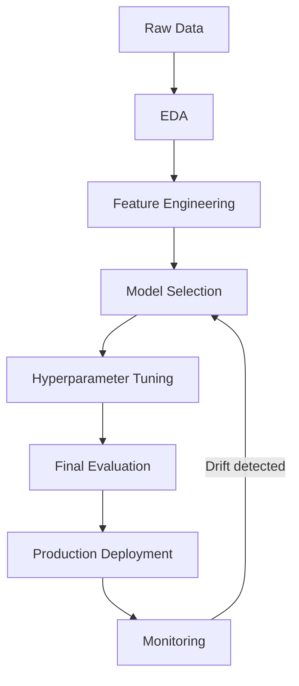

</details>

---
---

# TEMPLATE 3 — `senior.md`

<details open>
<summary><strong>Template Content</strong></summary>

# {{TOPIC_NAME}} — Senior Level

## Table of Contents

1. [Introduction](#introduction)
2. [Core Concepts](#core-concepts)
3. [Code Examples](#code-examples)
4. [Coding Patterns](#coding-patterns)
5. [Clean Code](#clean-code)
6. [Best Practices](#best-practices)
7. [Data Quality and Model Failure Handling](#data-quality-and-model-failure-handling)
8. [Performance Optimization](#performance-optimization)
9. [Metrics & Analytics](#metrics--analytics)
10. [Debugging Guide](#debugging-guide)
11. [Postmortems & System Failures](#postmortems--system-failures)
12. [Comparison with Alternatives](#comparison-with-alternatives)
13. [Test](#test)
14. [Cheat Sheet](#cheat-sheet)
15. [Summary](#summary)
16. [Diagrams & Visual Aids](#diagrams--visual-aids)

---

## Introduction

> Focus: "How to optimize?" and "How to architect?"

For engineers who:
- Design ML platforms and model serving infrastructure
- Build and maintain production ML pipelines at scale
- Optimize training throughput and inference latency
- Establish ML engineering standards and practices

---

## Core Concepts

### Concept 1: ML System Design

Full ML lifecycle: data ingestion → feature store → training → evaluation → serving → monitoring → retraining.

### Concept 2: Model Serving Architectures

- Batch inference vs real-time serving
- Model versioning and A/B testing
- Canary deployments for model rollouts

---

## Code Examples

### Example 1: Production model serving with FastAPI

```python
from fastapi import FastAPI, HTTPException
from pydantic import BaseModel
import joblib
import numpy as np
import time
import logging

logger = logging.getLogger(__name__)
app = FastAPI()

model = joblib.load("model.pkl")

class PredictionRequest(BaseModel):
    features: list[float]

class PredictionResponse(BaseModel):
    prediction: int
    confidence: float
    latency_ms: float

@app.post("/predict", response_model=PredictionResponse)
async def predict(request: PredictionRequest):
    start = time.time()
    try:
        feature_array = np.array(request.features).reshape(1, -1)
        prediction = int(model.predict(feature_array)[0])
        confidence = float(model.predict_proba(feature_array).max())
        latency_ms = (time.time() - start) * 1000
        logger.info("prediction=%d confidence=%.3f latency=%.1fms",
                    prediction, confidence, latency_ms)
        return PredictionResponse(
            prediction=prediction,
            confidence=confidence,
            latency_ms=latency_ms
        )
    except Exception as e:
        logger.error("Prediction failed: %s", e)
        raise HTTPException(status_code=500, detail=str(e))
```

---

## Coding Patterns

### Pattern 1: ML Pipeline with Feature Store

**Category:** Data / MLOps
**Intent:** Decouple feature computation from model training and serving.

**Architecture diagram:**

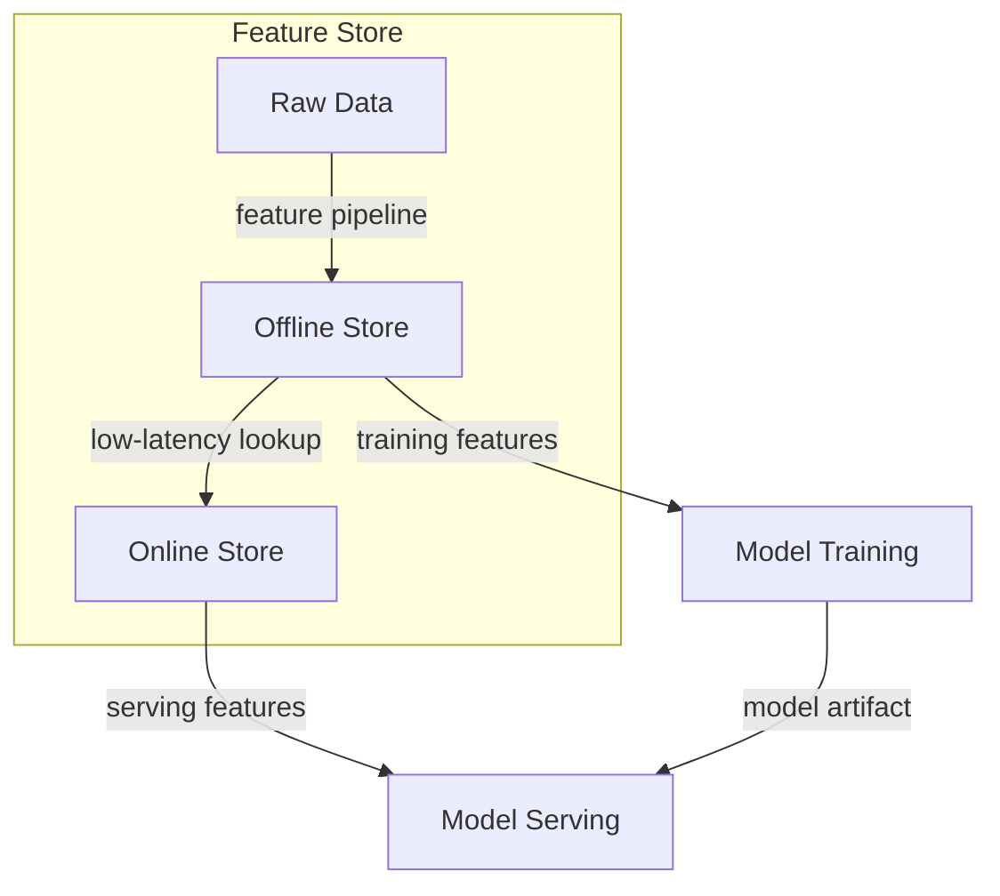

```python
from feast import FeatureStore

store = FeatureStore(repo_path=".")

training_data = store.get_historical_features(
    entity_df=entity_df,
    features=["user_features:age", "user_features:purchase_count"]
).to_df()

online_features = store.get_online_features(
    features=["user_features:age", "user_features:purchase_count"],
    entity_rows=[{"user_id": 12345}]
).to_dict()
```

---

### Pattern 2: Champion-Challenger A/B Testing

**Category:** MLOps / Reliability
**Intent:** Safely roll out new models by comparing against production baseline.

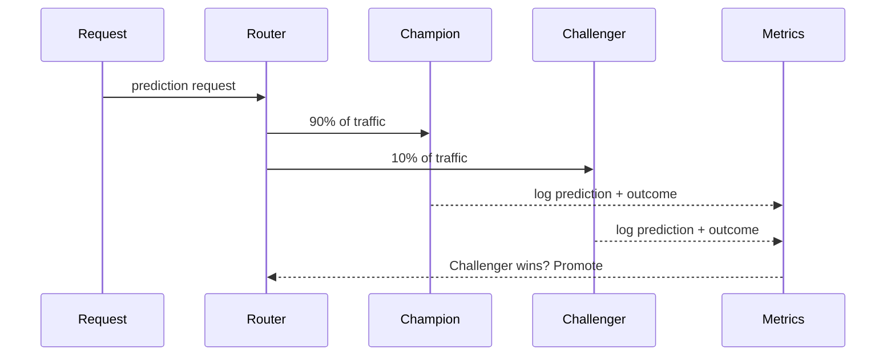

---

### Pattern 3: Retraining Pipeline with Drift Detection

**Category:** MLOps / Monitoring
**Intent:** Automatically retrain when data or concept drift is detected.

```python
from scipy.stats import ks_2samp

def detect_data_drift(
    reference_features: np.ndarray,
    current_features: np.ndarray,
    threshold: float = 0.05
) -> bool:
    p_values = [
        ks_2samp(reference_features[:, i], current_features[:, i]).pvalue
        for i in range(reference_features.shape[1])
    ]
    return any(p < threshold for p in p_values)
```

---

### Pattern 4: Distributed Training with PyTorch DDP

**Category:** Performance / Scalability
**Intent:** Scale training across multiple GPUs or machines.

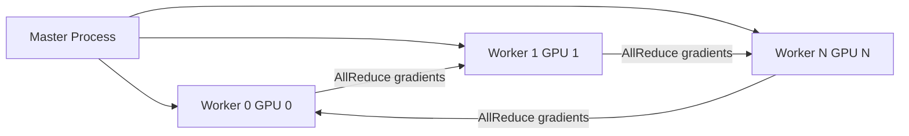

```python
import torch.distributed as dist
from torch.nn.parallel import DistributedDataParallel as DDP

def setup_distributed(rank: int, world_size: int):
    dist.init_process_group("nccl", rank=rank, world_size=world_size)

def train_distributed(rank: int, world_size: int, model, dataset):
    setup_distributed(rank, world_size)
    model = model.to(rank)
    ddp_model = DDP(model, device_ids=[rank])
    # Training loop...
```

### Pattern Comparison Matrix

| Pattern | Use When | Avoid When | Complexity |
|---------|----------|------------|------------|
| Feature Store | Many models share features | Single model, simple features | High |
| Champion-Challenger | Production model needs update | Offline-only, low stakes | Medium |
| Drift Detection | Real-world data distribution shifts | Synthetic/stable data | Low |
| Distributed Training | Model or data too large for 1 GPU | Small datasets, quick experiments | High |

---

## Clean Code

### ML Architecture Boundaries

```python
# Bad — training logic mixed with serving logic
class Model:
    def train(self, raw_csv_path): ...     # training
    def predict(self, features): ...       # serving
    def log_to_db(self, result): ...       # persistence

# Good — separated concerns
class ModelTrainer:
    def fit(self, feature_matrix, labels): ...

class ModelServer:
    def predict(self, features): ...

class PredictionLogger:
    def log(self, request, response): ...
```

---

## Best Practices

### Must Do

1. **Track all experiments with MLflow/W&B** — reproducibility is non-negotiable
   ```python
   with mlflow.start_run():
       mlflow.log_params(model_params)
       mlflow.log_metric("test_f1", test_f1)
   ```

2. **Version datasets and models together** — know exactly which data produced which model

3. **Monitor data drift in production** — models degrade silently without monitoring

4. **Use stratified splits for imbalanced datasets** — prevents misleadingly high accuracy

5. **Validate feature schemas at serving time** — schema drift breaks models silently

### Never Do

1. **Never leak test data into preprocessing** — inflated metrics, broken production model
2. **Never tune hyperparameters on the test set** — use a validation set or cross-validation
3. **Never deploy a model without a rollback plan**
4. **Never ignore class imbalance** — accuracy is meaningless on 99/1 class split
5. **Never skip baseline comparison** — always compare against a simple baseline

### Production Checklist

- [ ] Experiment tracking configured (MLflow, W&B, or similar)
- [ ] Model version tagged with data version and code commit
- [ ] Inference latency p50/p99 measured and within SLA
- [ ] Data schema validation at input
- [ ] Model output schema validation
- [ ] Data drift monitoring configured
- [ ] Concept drift (prediction quality) monitoring configured
- [ ] Rollback procedure documented and tested
- [ ] Feature importance / SHAP values computed for explainability

---

## Postmortems & System Failures

### The Silent Degradation Incident

- **The goal:** Maintain 95% F1 score on customer churn prediction
- **The mistake:** No monitoring configured after deployment; data distribution shifted over 3 months
- **The impact:** Model F1 dropped to 61% — discovered only when business metrics declined
- **The fix:** Implemented weekly KS-test on feature distributions + automated retraining trigger

**Key takeaway:** ML models require active monitoring — they degrade without warning.

---

## Metrics & Analytics

### SLO / SLA Definition

| SLI | SLO Target | Measurement window | Consequence if breached |
|-----|-----------|-------------------|------------------------|
| **Inference latency p99** | < 100ms | 5 min rolling | PagerDuty alert |
| **Model accuracy drift** | < 5% from baseline | 1 week rolling | Retraining trigger |
| **Prediction service availability** | 99.9% | 30 days | Incident |

### Business vs Technical Metrics

| Layer | Metric | Owner |
|-------|--------|-------|
| **Business** | Conversion rate, churn reduction | Product |
| **Model** | F1 score, AUC-ROC, precision/recall | ML Engineer |
| **Infrastructure** | Inference latency, GPU utilization | Platform |

---

## Diagrams & Visual Aids

### ML Platform Architecture

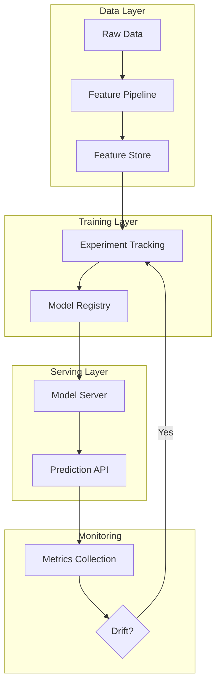

</details>

---
---

# TEMPLATE 4 — `professional.md`

<details open>
<summary><strong>Template Content</strong></summary>

# {{TOPIC_NAME}} — Mathematical and Algorithmic Foundations

## Table of Contents

1. [Introduction](#introduction)
2. [Mathematical Foundations](#mathematical-foundations)
3. [Gradient Trace / Activation Analysis](#gradient-trace--activation-analysis)
4. [Model Computation Graph / Execution Engine](#model-computation-graph--execution-engine)
5. [GPU Kernel / Hardware Acceleration Internals](#gpu-kernel--hardware-acceleration-internals)
6. [Loss Landscape Analysis](#loss-landscape-analysis)
7. [Performance Internals](#performance-internals)
8. [Edge Cases at the Lowest Level](#edge-cases-at-the-lowest-level)
9. [Test](#test)
10. [Summary](#summary)
11. [Further Reading](#further-reading)

---

## Introduction

> Focus: "What happens mathematically and computationally?"

This document explores the mathematical and hardware foundations of ML:
- How gradient descent works at the calculus level
- How computational graphs enable automatic differentiation
- How GPUs accelerate matrix operations
- Numerical instability and how to avoid it

---

## Mathematical Foundations

### Gradient Descent — From First Principles

For a loss function L(θ) where θ are model parameters:

```
θ_{t+1} = θ_t - η · ∇_θ L(θ_t)

where:
  η = learning rate
  ∇_θ L = gradient of loss with respect to parameters
```

### Backpropagation via Chain Rule

For a two-layer network: L = loss(output(hidden(input))):

```
∂L/∂W1 = ∂L/∂output · ∂output/∂hidden · ∂hidden/∂W1
```

```python
import numpy as np

def sigmoid(z):
    return 1 / (1 + np.exp(-z))

def sigmoid_derivative(z):
    s = sigmoid(z)
    return s * (1 - s)

# Manual backprop for a 2-layer network
def backprop(X, y, W1, W2, learning_rate=0.01):
    # Forward pass
    z1 = X @ W1
    a1 = sigmoid(z1)
    z2 = a1 @ W2
    output = sigmoid(z2)

    # Backward pass (chain rule)
    dL_doutput = output - y
    dL_dW2 = a1.T @ (dL_doutput * sigmoid_derivative(z2))
    dL_da1 = (dL_doutput * sigmoid_derivative(z2)) @ W2.T
    dL_dW1 = X.T @ (dL_da1 * sigmoid_derivative(z1))

    W1 -= learning_rate * dL_dW1
    W2 -= learning_rate * dL_dW2
    return W1, W2
```

---

## Gradient Trace / Activation Analysis

### Gradient Flow Visualization

```python
import torch
import matplotlib.pyplot as plt

def plot_gradient_flow(model):
    gradients = []
    names = []
    for name, param in model.named_parameters():
        if param.grad is not None and param.requires_grad:
            gradients.append(param.grad.abs().mean().item())
            names.append(name)

    plt.figure(figsize=(12, 4))
    plt.bar(range(len(gradients)), gradients)
    plt.xticks(range(len(names)), names, rotation=45)
    plt.title("Mean Gradient Magnitude per Layer")
    plt.tight_layout()
    plt.savefig("gradient_flow.png")
```

**Vanishing gradient detection:**
```
Layer 1 gradient: 0.0001  ← Very small — vanishing gradient!
Layer 2 gradient: 0.001
Layer 3 gradient: 0.01
Layer 4 gradient: 0.1     ← Healthy gradient
```

### Activation Statistics

```python
def monitor_activations(model, dataloader):
    activation_stats = {}
    hooks = []

    def make_hook(name):
        def hook(module, input, output):
            activation_stats[name] = {
                "mean": output.mean().item(),
                "std": output.std().item(),
                "dead_neurons": (output == 0).float().mean().item()
            }
        return hook

    for name, layer in model.named_modules():
        hooks.append(layer.register_forward_hook(make_hook(name)))

    # Run a batch
    with torch.no_grad():
        X, _ = next(iter(dataloader))
        model(X)

    for hook in hooks:
        hook.remove()
    return activation_stats
```

---

## Model Computation Graph / Execution Engine

### PyTorch Autograd Computation Graph

```
x = tensor([2.0], requires_grad=True)
y = x ** 2          ← PowBackward node
z = y * 3           ← MulBackward node
loss = z.mean()     ← MeanBackward node

Computation graph:
x → PowBackward(y=x²) → MulBackward(z=3y) → MeanBackward(loss) → scalar
```

```python
import torch

x = torch.tensor([2.0], requires_grad=True)
y = x ** 2
z = y * 3
loss = z.mean()

# Inspect the computation graph
print(loss.grad_fn)            # MeanBackward
print(loss.grad_fn.next_functions)  # (MulBackward, )

loss.backward()
print(x.grad)  # 12.0 — correct: d/dx(3x²) = 6x, at x=2: 12
```

### JIT Compilation for Production

```python
import torch

# Trace a model for optimized execution
model = MyModel()
example_input = torch.randn(1, 10)
traced_model = torch.jit.trace(model, example_input)
traced_model.save("model_traced.pt")

# Script for dynamic control flow
scripted_model = torch.jit.script(model)
```

---

## GPU Kernel / Hardware Acceleration Internals

### Matrix Multiplication on GPU

```
CPU GEMM (General Matrix Multiply):
  A (m×k) × B (k×n) = C (m×n)
  Naive: O(m·k·n) operations, sequential

GPU CUDA GEMM:
  - Tiles A and B into shared memory blocks
  - Each thread block computes one tile of C
  - cuBLAS uses Tensor Cores: 4×4×4 matrix multiply per clock

Practical speedup (1024×1024 fp32):
  CPU (8-core): ~800ms
  GPU (A100):   ~0.3ms  (~2500x speedup)
```

### Memory Hierarchy

```
L1 cache per SM: 32-128 KB  ← registers, fast
L2 cache:        40 MB       ← shared across SMs
GPU DRAM (HBM2): 40-80 GB   ← slow, large
PCIe bandwidth:  ~64 GB/s    ← CPU↔GPU transfer bottleneck
```

**Key insight:** Data transfer between CPU and GPU is often the bottleneck — keep data on GPU for the full training loop.

---

## Loss Landscape Analysis

### Saddle Points vs Local Minima

```python
import numpy as np
import matplotlib.pyplot as plt

# Visualize a 2D loss landscape
def loss_landscape(w1, w2):
    return w1**2 - w2**2  # Saddle point at origin

w1 = np.linspace(-2, 2, 100)
w2 = np.linspace(-2, 2, 100)
W1, W2 = np.meshgrid(w1, w2)
L = loss_landscape(W1, W2)

plt.contourf(W1, W2, L, levels=50)
plt.colorbar()
plt.title("Loss Landscape — Saddle Point at Origin")
```

**SGD vs Adam in non-convex landscapes:**
```
SGD with momentum: good for convex regions, stuck at saddle points
Adam: adaptive learning rates escape saddle points faster
LBFGS: second-order method, best for small problems with smooth loss
```

---

## Performance Internals

### Training Throughput Benchmarks

```python
import time
import torch

def benchmark_training(model, dataloader, device, num_batches=100):
    model = model.to(device)
    optimizer = torch.optim.Adam(model.parameters())
    criterion = torch.nn.CrossEntropyLoss()

    start = time.time()
    samples_processed = 0

    for i, (X, y) in enumerate(dataloader):
        if i >= num_batches:
            break
        X, y = X.to(device), y.to(device)
        optimizer.zero_grad()
        output = model(X)
        loss = criterion(output, y)
        loss.backward()
        optimizer.step()
        samples_processed += X.size(0)

    elapsed = time.time() - start
    throughput = samples_processed / elapsed
    print(f"Throughput: {throughput:.0f} samples/sec")
    return throughput
```

---

## Edge Cases at the Lowest Level

### Edge Case 1: Numerical Instability in Softmax

```python
# Naive softmax — overflows for large logits
def softmax_naive(x):
    return np.exp(x) / np.sum(np.exp(x))
# softmax_naive([1000, 1001]) → nan/nan

# Numerically stable softmax
def softmax_stable(x):
    x = x - np.max(x)  # Shift by max for stability
    return np.exp(x) / np.sum(np.exp(x))
# softmax_stable([1000, 1001]) → [0.269, 0.731]
```

### Edge Case 2: Gradient Explosion

```python
# Detection: monitor gradient norm
total_norm = torch.nn.utils.clip_grad_norm_(model.parameters(), max_norm=float('inf'))
if total_norm > 100:
    print(f"WARNING: large gradient norm: {total_norm:.2f}")

# Fix: gradient clipping
torch.nn.utils.clip_grad_norm_(model.parameters(), max_norm=1.0)
```

---

## Test

**1. What is the chain rule and why is it essential for backpropagation?**

<details>
<summary>Answer</summary>
The chain rule states that the derivative of a composite function f(g(x)) is f'(g(x)) · g'(x). In a neural network, the loss is a composition of many functions (layers). Backpropagation applies the chain rule recursively from the loss backward through each layer to compute gradients for all parameters.
</details>

**2. Why does vanilla softmax overflow for large logits?**

<details>
<summary>Answer</summary>
`exp(1000)` overflows float32. The fix is to subtract the maximum value first: `exp(x - max(x)) / sum(exp(x - max(x)))`. This doesn't change the output (mathematically equivalent) but keeps values in a numerically safe range.
</details>

---

## Summary

- Backpropagation is the chain rule applied recursively through the computation graph
- Computational graphs (PyTorch autograd) make automatic differentiation possible
- GPU acceleration works through massively parallel matrix multiply (GEMM)
- Numerical instability (overflow, vanishing gradients) is a practical concern in deep learning

---

## Further Reading

- **Paper:** [Efficient BackProp — LeCun et al.](http://yann.lecun.com/exdb/publis/pdf/lecun-98b.pdf)
- **Book:** "Mathematics for Machine Learning" — Deisenroth et al.
- **Paper:** [FlashAttention — fast IO-aware exact attention](https://arxiv.org/abs/2205.14135)

</details>

---
---

# TEMPLATE 5 — `interview.md`

<details open>
<summary><strong>Template Content</strong></summary>

# {{TOPIC_NAME}} — Interview Questions

## Junior Level

### 1. What is overfitting and how do you prevent it?

**Answer:**
Overfitting is when a model learns the training data too well — including its noise — and fails to generalize to new data. Prevention: more training data, simpler model, regularization (L1/L2), dropout, early stopping, cross-validation.

---

### 2. What is the difference between classification and regression?

**Answer:**
Classification predicts a discrete label (spam/not spam, cat/dog). Regression predicts a continuous value (house price, temperature). They use different loss functions: cross-entropy for classification, MSE/MAE for regression.

---

### 3. Why do we split data into train, validation, and test sets?

**Answer:**
Train: fit the model. Validation: tune hyperparameters (select between models). Test: final unbiased evaluation — never used during development. Using the test set during development leaks information and produces optimistic results.

---

## Middle Level

### 4. Explain the bias-variance trade-off.

**Answer:**
Bias: error from incorrect assumptions (underfitting — model too simple). Variance: error from sensitivity to noise (overfitting — model too complex). Increasing model complexity decreases bias but increases variance. The goal is to find the sweet spot that minimizes total error.

---

### 5. What is data leakage and give an example?

**Answer:**
Data leakage is when information from outside the training data's time period or scope contaminates the model. Example: scaling features using the mean/std of the full dataset (including test data) before splitting. Fix: always fit preprocessing on training data only, then transform test data.

---

## Senior Level

### 6. How do you design an ML monitoring strategy for production?

**Answer:**
Three layers: (1) Data drift — monitor feature distributions using KS-test or PSI; (2) Concept drift — monitor prediction quality vs ground truth labels; (3) Infrastructure — latency, error rates, throughput. Set automated retraining triggers when drift exceeds thresholds.

---

## Scenario-Based Questions

### 7. Your model has 99% accuracy but the business isn't happy. What happened?

**Answer:**
Almost certainly class imbalance. If 99% of data belongs to one class, predicting always that class gives 99% accuracy but 0% utility. Solutions: use F1/AUC-ROC metrics, oversample minority class (SMOTE), class weights, or reframe the problem.

---

## FAQ

### Q: What makes a great ML interview answer?

**A:** Key evaluation criteria:
- Junior: understands the concept, can implement basic version
- Middle: knows when to use it, trade-offs, and common pitfalls
- Senior: can design systems, debug production issues, explain the math

</details>

---
---

# TEMPLATE 6 — `tasks.md`

<details open>
<summary><strong>Template Content</strong></summary>

# {{TOPIC_NAME}} — Practical Tasks

## Junior Tasks

### Task 1: Train your first classifier

**Type:** Code

**Goal:** Practice the full train-evaluate loop.

**Instructions:**
1. Load the Iris dataset with sklearn
2. Split into 80/20 train/test
3. Train a RandomForestClassifier
4. Print accuracy and classification report

**Starter code:**

```python
from sklearn.datasets import load_iris
from sklearn.model_selection import train_test_split
from sklearn.ensemble import RandomForestClassifier
from sklearn.metrics import accuracy_score, classification_report

# TODO: Complete the training pipeline
```

**Expected output:**
```
Accuracy: 0.95
Classification Report: ...
```

---

### Task 2: Visualize a dataset

**Type:** Design

**Goal:** Practice exploratory data analysis before modeling.

**Instructions:**
1. Load the California Housing dataset
2. Plot feature distributions (histograms)
3. Plot correlation matrix as a heatmap
4. Write 3 observations about the data

---

## Middle Tasks

### Task 4: Build an ML pipeline with preprocessing

**Type:** Code

**Scenario:** Tabular dataset with mixed numeric and categorical features, 5% missing values.

**Requirements:**
- [ ] Handle missing values with imputation
- [ ] Scale numeric features
- [ ] One-hot encode categorical features
- [ ] Use cross-validation (5-fold stratified)
- [ ] Log experiment with MLflow

---

## Senior Tasks

### Task 7: Design a model monitoring system

**Type:** Design

**Requirements:**
- [ ] Detect data drift (feature distribution shift)
- [ ] Detect concept drift (prediction quality drop)
- [ ] Trigger automated retraining
- [ ] Architecture diagram (Mermaid)

---

## Challenge

### Kaggle-Style Competition

**Problem:** Beat a random forest baseline (F1=0.82) on a binary classification dataset with class imbalance (10:1 ratio).

**Constraints:**
- No external data
- Inference time < 50ms per prediction

**Scoring:**
- F1 score: 50%
- Inference latency: 30%
- Code quality: 20%

</details>

---
---

# TEMPLATE 7 — `find-bug.md`

<details open>
<summary><strong>Template Content</strong></summary>

# {{TOPIC_NAME}} — Find the Bug

> **Practice finding and fixing bugs in machine learning code.**

---

## Bug 1: Data leakage in preprocessing 🟢

**What the code should do:** Train a classifier with proper preprocessing.

```python
from sklearn.preprocessing import StandardScaler
from sklearn.model_selection import train_test_split

# BUG: Scaler fit on full dataset before split
scaler = StandardScaler()
X_scaled = scaler.fit_transform(X)
X_train, X_test, y_train, y_test = train_test_split(X_scaled, y, test_size=0.2)
model.fit(X_train, y_train)
```

<details>
<summary>🐛 Bug Explanation</summary>

**Bug:** Scaler is fit on the entire dataset including test data.
**Why it happens:** Test data statistics (mean/std) leak into the scaler.
**Impact:** Optimistic test score that doesn't reflect real-world performance.

</details>

<details>
<summary>✅ Fixed Code</summary>

```python
X_train, X_test, y_train, y_test = train_test_split(X, y, test_size=0.2, random_state=42)
scaler = StandardScaler()
X_train_scaled = scaler.fit_transform(X_train)   # fit only on train
X_test_scaled = scaler.transform(X_test)          # transform only
model.fit(X_train_scaled, y_train)
```

</details>

---

## Bug 2: Wrong metric for imbalanced data 🟢

**What the code should do:** Evaluate a fraud detection model.

```python
from sklearn.metrics import accuracy_score

predictions = model.predict(X_test)
score = accuracy_score(y_test, predictions)
print(f"Model performance: {score:.3f}")  # Prints 0.994 — misleading!
```

<details>
<summary>🐛 Bug Explanation</summary>

**Bug:** Accuracy is used on a highly imbalanced dataset (99.4% negative class).
**Impact:** Model that always predicts "not fraud" scores 0.994 but catches zero fraud cases.

</details>

<details>
<summary>✅ Fixed Code</summary>

```python
from sklearn.metrics import f1_score, classification_report

f1 = f1_score(y_test, predictions, average='macro')
print(classification_report(y_test, predictions))
```

</details>

---

## Score Card

| Bug | Difficulty | Found without hint? | Understood why? | Fixed correctly? |
|:---:|:---------:|:-------------------:|:---------------:|:----------------:|
| 1 | 🟢 | ☐ | ☐ | ☐ |
| 2 | 🟢 | ☐ | ☐ | ☐ |

</details>

---
---

# TEMPLATE 8 — `optimize.md`

<details open>
<summary><strong>Template Content</strong></summary>

# {{TOPIC_NAME}} — Optimize the Code

> **Practice optimizing slow, inefficient, or expensive ML pipelines.**

---

## Exercise 1: Vectorize prediction loop 🟢 ⚡

**What the code does:** Generates predictions for a test set.

**The problem:** Predicts one sample at a time.

```python
predictions = []
for row in X_test:
    pred = model.predict([row])
    predictions.append(pred[0])
```

**Current benchmark:**
```
1000 samples: 12.3s (12.3ms per sample)
```

<details>
<summary>⚡ Optimized Code</summary>

```python
predictions = model.predict(X_test)  # Vectorized batch prediction
```

**Optimized benchmark:**
```
1000 samples: 0.04s  (0.04ms per sample — 307x speedup)
```

</details>

---

## Optimization Cheat Sheet

| Problem | Solution | Impact |
|:--------|:---------|:------:|
| Per-sample prediction loop | Batch `model.predict(X)` | Very High |
| Single-threaded cross-validation | `n_jobs=-1` | High |
| Repeated feature computation | Cache features to disk | High |
| Large grid search | RandomizedSearchCV | Medium |
| Slow pandas operations in pipeline | Vectorized numpy ops | Medium |

</details>
