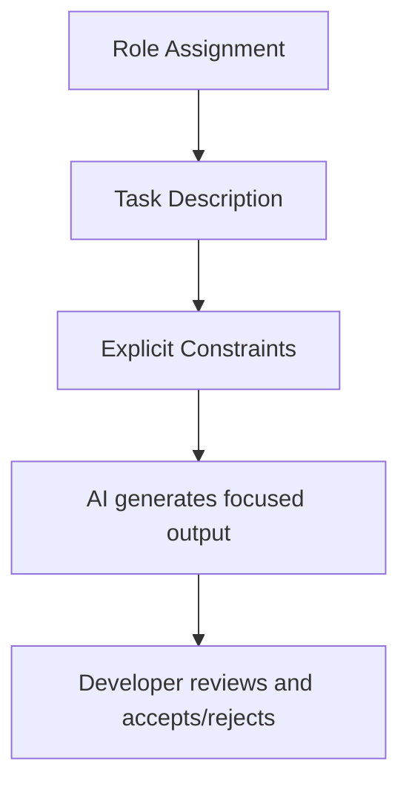
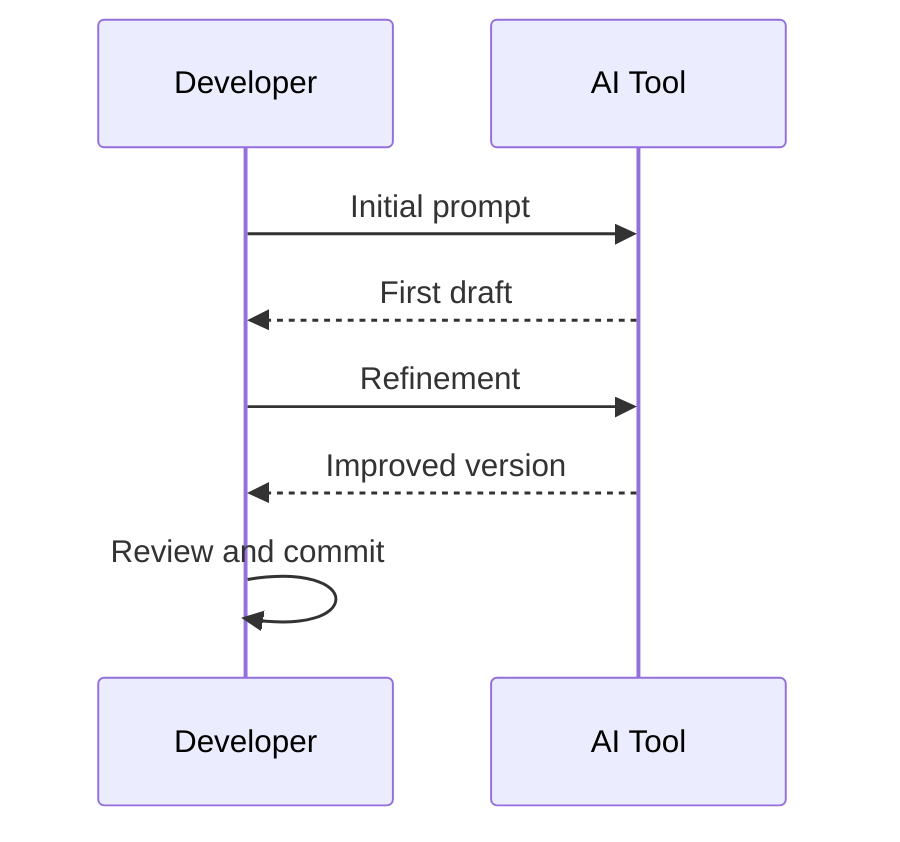
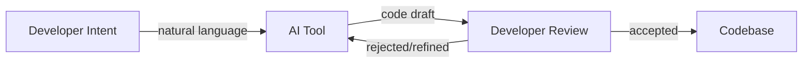
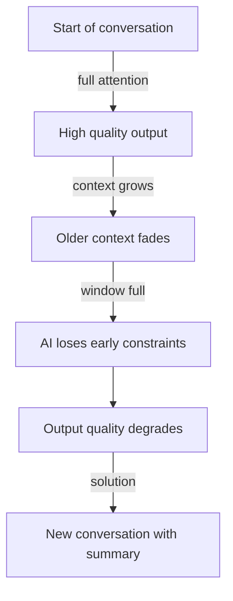
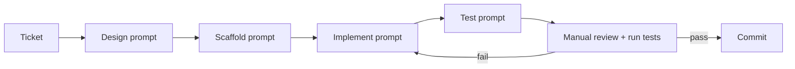
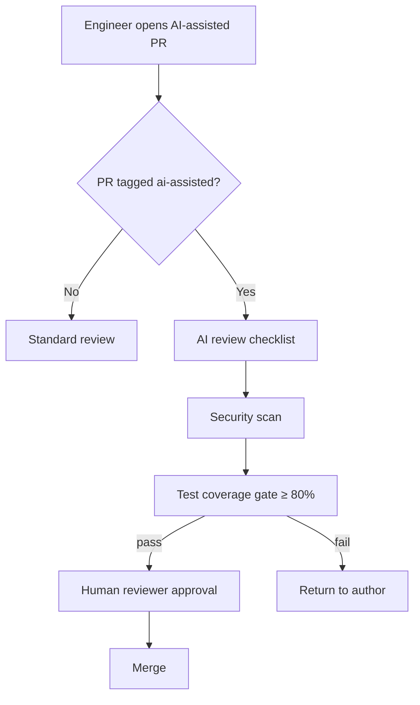
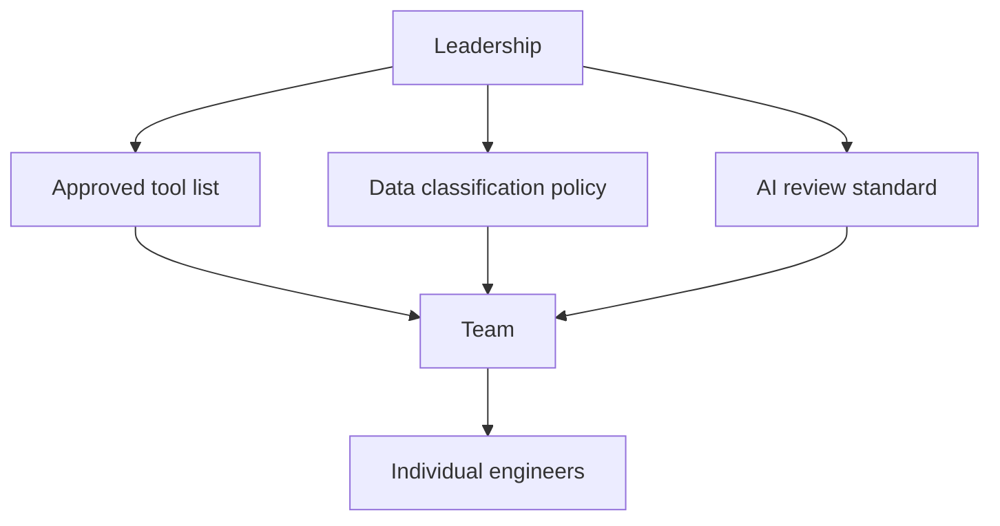
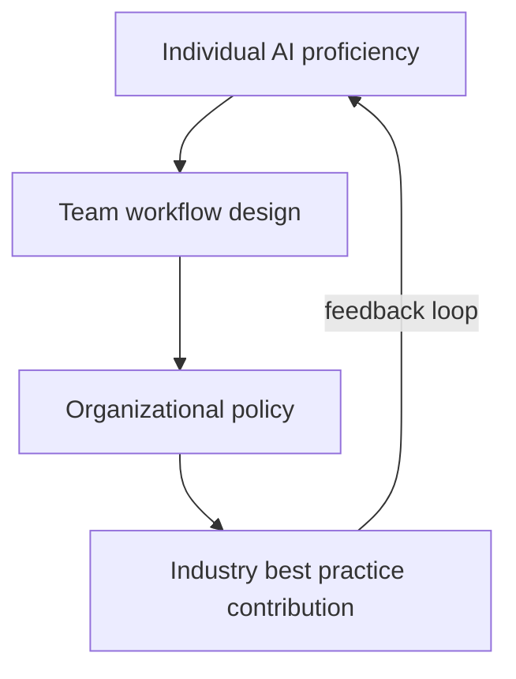
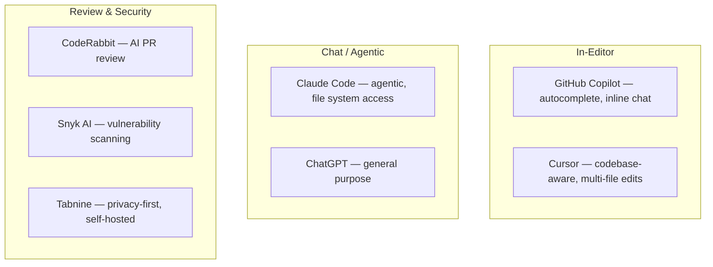

# Vibe Coding Roadmap — Universal Template

> Guides content generation for **Vibe Coding** (AI-assisted development methodology) topics.

## Overview

| | Description |
|---|---|
| **Purpose** | Universal template for all Vibe Coding roadmap topics |
| **Files per topic** | 9 files: `junior.md`, `middle.md`, `senior.md`, `professional.md`, `interview.md`, `tasks.md`, `find-bug.md`, `optimize.md`, `specification.md` |
| **Code Fences** | `text` for prompts/workflows, `mermaid` for diagrams — NO programming language code blocks |
| **Topic type** | METHODOLOGY — not a technology. Describe how humans collaborate with AI. No raw source code. |

### Topic Structure

```
XX-topic-name/
├── junior.md          ← basic prompting + Copilot basics
├── middle.md          ← effective patterns, context management, code review
├── senior.md          ← team workflows, quality control, AI governance
├── professional.md    ← mastery and AI-assisted development leadership
├── interview.md       ← interview prep across all levels
├── tasks.md           ← hands-on practice tasks
├── find-bug.md        ← find and fix AI-generated bugs (10+ exercises)
├── optimize.md        ← optimize AI collaboration workflows (10+ exercises)
└── specification.md   ← Official spec / documentation deep-dive
```

## Level Comparison Matrix

| Aspect | Junior | Middle | Senior | Professional |
|:------:|:------:|:------:|:------:|:------------:|
| **Depth** | Basic prompting, single-turn, Copilot | Prompt patterns, context management, review | Team workflows, quality gates, governance | Mastery, ecosystem design, impact measurement |
| **Focus** | "What is vibe coding?" | "How do I do it well?" | "How do I scale this?" | "How do I lead it?" |
| **AI Failure Modes** | Recognizes hallucinated output | Handles wrong algorithms, bad context | Prevents injections, enforces review gates | Org-wide AI failure policies |

---

# TEMPLATE 1 — `junior.md`

# {{TOPIC_NAME}} — Junior Level

## Introduction
> Focus: "What is it?" and "How to use it?"

Vibe coding is an AI-assisted development methodology where developers use natural language prompts to guide AI tools (GitHub Copilot, Claude, ChatGPT) in generating, editing, and debugging code. The "vibe" refers to communicating intent at a high level rather than writing every line manually.

## Prerequisites
- **Required:** Basic programming concepts — functions, variables, loops
- **Required:** Ability to read and understand simple code output
- **Helpful:** Familiarity with at least one programming language

## Glossary

| Term | Definition |
|------|-----------|
| **Prompt** | A natural language instruction given to an AI to produce a desired output |
| **Hallucination** | When AI generates plausible-sounding but factually incorrect output |
| **Context Window** | The amount of text an AI model can consider at one time |
| **AI Autocomplete** | Inline AI suggestions as you type (e.g., GitHub Copilot) |
| **Iteration** | Refining AI output through follow-up instructions |

## Core Concepts

### Concept 1: The Prompt as a Specification
A prompt is a mini-specification, not a search query. Clearly describe inputs, outputs, and constraints to get a useful response.

### Concept 2: AI as a Fast First Draft
AI excels at generating boilerplate quickly. The developer's job shifts from typing to reviewing, correcting, and guiding.

### Concept 3: You Are Still Responsible
The developer is accountable for all code that ships, regardless of who or what wrote it. Never commit AI-generated code without reading and understanding it.

## Real-World Analogies

| Concept | Analogy |
|---------|--------|
| **Prompting** | Giving instructions to a new intern — vague instructions produce vague results |
| **Iteration** | Editing a draft document — the first pass is never final |
| **Hallucination** | A confident colleague who makes up an answer rather than admitting uncertainty |
| **Context window** | Short-term memory — the AI forgets earlier parts of a long conversation |

## Pros & Cons

| Pros | Cons |
|------|------|
| Speeds up boilerplate and repetitive tasks | AI output can contain subtle bugs or hallucinated APIs |
| Lowers barrier to exploring unfamiliar libraries | Can create false confidence in code quality |
| Faster documentation and test generation | Developer skill atrophy if over-relied upon |

**When to use:** Scaffolding, boilerplate, exploring a new library
**When NOT to use:** Security-critical code without thorough review; when you cannot verify the output

## Prompt and Workflow Examples

### Example 1: Basic function prompt

```text
Write a Python function that takes a list of integers and returns
the two numbers that sum to a given target. Return their indices.
If no pair exists, return None.

Constraints:
- Each input has exactly one solution
- Do not use the same element twice
```

### Example 2: Asking for tests

```text
Write pytest unit tests for the function above. Include tests for:
- Normal case with a valid pair
- No valid pair (expect None)
- List with duplicate values
- Empty list
```

## Prompt Patterns

### Pattern 1: Role + Task + Constraints

```text
You are a senior Python developer. Write a function that [task].
Requirements:
- [requirement 1]
- [requirement 2]
Constraints:
- Time complexity: O(n)
- Do not use external libraries
```



### Pattern 2: Iterative Refinement

```text
Turn 1: "Write a function to parse a CSV file."
Turn 2: "Now add error handling for missing columns."
Turn 3: "Add a return type hint."
Turn 4: "Write a docstring in Google style."
```



## AI Failure Modes and Mitigation

| Failure Mode | Description | Mitigation |
|-------------|-------------|-----------|
| Hallucinated API | AI invents a method that does not exist | Run code; check official docs |
| Plausible but wrong logic | Code fails on edge cases | Write tests immediately after receiving output |
| Outdated information | AI suggests deprecated patterns | Verify library version in docs |

## Best Practices
- Read every line of AI-generated code before accepting it
- Run the output immediately — if it does not execute, do not move on
- Keep prompts focused on one task at a time
- Save effective prompts — build a personal prompt library

## Common Mistakes
- Accepting AI output without running it
- Using AI when you cannot verify the output
- Providing no context about the surrounding codebase

## Cheat Sheet

| Task | Prompt Template |
|------|----------------|
| Generate function | "Write a [language] function that [behavior]. Input: [type]. Output: [type]." |
| Write tests | "Write [framework] tests. Cover: [edge cases]." |
| Debug | "This code throws [error]. Explain why and fix it." |

## Summary
Vibe coding at the junior level: use AI as a productivity accelerator while maintaining ownership. Core skill: clear prompts, critical reading, validate before committing.

## Diagrams & Visual Aids



---

# TEMPLATE 2 — `middle.md`

# {{TOPIC_NAME}} — Middle Level

## Introduction
> Focus: "Why do some prompts work better?" and "How do I make AI output production-ready?"

Shift from getting AI to produce something to getting AI to produce something correct, maintainable, and secure.

## Effective Prompt Patterns

### Pattern 1: Chain-of-Thought

```text
Before writing code, explain your approach:
1. What data structure will you use and why?
2. What is the time complexity?
3. What edge cases need handling?
Then write the implementation.
```

### Pattern 2: Few-Shot

```text
Here are two examples of how I write docstrings in this project:
[paste two real docstrings]

Now write a docstring for this function:
[paste function signature]
```

### Pattern 3: Negative Constraints

```text
Write a SQL query to find the top 10 customers by revenue.
Do NOT use subqueries. Do NOT use window functions.
Use only JOINs and GROUP BY.
```

## Context Management



**Strategies:**
- Start a new conversation for each distinct task
- Paste only the relevant function, not the entire file
- Restate key constraints explicitly in each new prompt

## Reviewing AI-Generated Code

```text
AI Code Review Checklist:
[ ] Compiles/runs without errors
[ ] Handles empty, null, and zero cases
[ ] All external API calls verified in official docs
[ ] No string interpolation in SQL queries
[ ] Error paths handled explicitly
[ ] Matches stated time complexity
[ ] No hardcoded credentials or secrets
[ ] Follows codebase style conventions
```

## Prompt and Workflow Examples

### Example: Iterative feature development

```text
Step 1 — Design:   "Describe an approach for a rate limiter using a sliding window."
Step 2 — Scaffold: "Write the class skeleton with method signatures only. No implementation."
Step 3 — Implement: "Implement is_allowed using a deque."
Step 4 — Test:     "Write pytest tests: single request, burst at limit, burst over limit."
```

## AI Failure Modes and Mitigation

| Failure Mode | Example | Mitigation |
|-------------|---------|-----------|
| Wrong algorithm for stated complexity | Prompt requests O(n), AI returns O(n²) | Ask AI to state the complexity of what it produced |
| Hallucinated library method | `pandas.DataFrame.smart_merge()` — does not exist | Run code immediately; check docs |
| AI-generated SQL injection | Unsanitized f-string in query | Review all string interpolation in DB queries |
| AI test that always passes | `assert True` or assertion never reached | Run tests with deliberate wrong implementation |

## Integrating AI into a Development Workflow



## Best Practices and Tricky Points
- Treat each prompt like a function signature — inputs, outputs, constraints explicit
- Never skip running AI-generated tests against a deliberately broken implementation
- "Make it better" is not a valid prompt — specify the dimension: faster, more readable, more testable
- AI may fix a failing test by deleting it; the same prompt sent twice may produce different output

## Summary
Middle-level vibe coding is about systematic, disciplined use of AI. Reviewing, testing, and integrating AI output without lowering quality standards.

---

# TEMPLATE 3 — `senior.md`

# {{TOPIC_NAME}} — Senior Level

## Introduction
> Focus: "How do I deploy AI-assisted development across a team?"

Senior engineers shape how the entire team uses AI — defining review processes, quality gates, measuring impact, and preventing AI-introduced vulnerabilities.

## Team AI Workflows



## Quality Control at Scale

Automated checks per AI-assisted PR: static analysis, dependency scan, secret scan, parameterized query enforcement.
Manual review focus: auth/authz logic, input validation at API boundaries, error messages that could leak internals.

## AI Governance and Policy



**Policy decisions:**
- Which AI tools are approved (data privacy, licensing)?
- What code/data must NOT go to external AI APIs (PII, trade secrets)?
- How is AI-generated code disclosed in PRs?
- What is the escalation path when AI output causes a production incident?

## Prompt and Workflow Examples

### Generating a team prompt library entry

```text
Prompt name: "Generate parameterized SQL query"
Context: Adding new DB queries to the data layer
Prompt text:
  "Write a [database] query to [task].
   Use parameterized queries only — no string interpolation.
   Return type: [type].
   Error handling: raise [ExceptionType] if no rows found."
Validated: [date] with [model version]
Known limitations: Does not handle multi-schema databases
```

## AI Failure Modes and Mitigation

| Failure Mode | Organizational Risk | Mitigation |
|-------------|-------------------|-----------|
| AI SQL injection in production | Data breach, compliance violation | Mandatory parameterized query rule + automated scan |
| 100% pass rate AI test suite | False quality signal | Mutation testing — verify tests fail on broken code |
| Sensitive data sent to external AI API | Regulatory violation | Data classification policy + AI tool allowlist |
| Skill atrophy from over-reliance | Team cannot debug without AI | Periodic "AI-off" sprints; unassisted debugging assessments |

## Measuring AI Assistance Impact

Track: time-to-first-draft (target: -30%), review round count (target: ≤ 2), AI-introduced defect rate (≤ team baseline), and prompt iteration count (trend down).

## Best Practices
- Tag AI-assisted PRs; run mutation testing on AI-generated test suites; review governance policy quarterly

## Summary
Senior-level vibe coding is an organizational responsibility: team workflow design, quality gate definition, policy development, and metric-driven evaluation.

---

# TEMPLATE 4 — `professional.md`

# {{TOPIC_NAME}} — Mastery and AI-Assisted Development

## Mastery of AI Collaboration

Professional-level vibe coding shapes how an entire engineering organization collaborates with AI — setting standards, building intuition, and leading through rapid tooling change.

**Characteristics of a master AI collaborator:**
- Produces correct, production-ready output with the minimum number of iterations
- Can articulate precisely why a prompt failed and construct a better one without trial-and-error
- Evaluates AI-generated code at the depth of a security and correctness review
- Builds shared tooling (prompt libraries, context injection, review checklists) that multiplies team capability



## Building Intuition for Prompt Quality

| Dimension | Low Quality | High Quality |
|-----------|------------|-------------|
| Specificity | "Write a function" | "Write a Python 3.11 function with type hints that..." |
| Constraints | None stated | Explicit: complexity, no external libs, error handling required |
| Output format | Unspecified | "Return only the function, no explanation, no markdown" |
| Context | No surrounding code | Relevant interfaces and conventions included |
| Verification | No test specified | "Include 3 pytest tests covering normal, empty, and error cases" |

Example: `"Make a login endpoint."` scores 1/5; a prompt specifying FastAPI, bcrypt, JWT on success, HTTPException(401) on failure, no plain-text storage, and OpenAPI docstring scores 5/5.

## AI Tool Ecosystem



**Selection criteria:** data sensitivity, codebase context depth, CI/CD integration, cost and licensing.

## Evaluating AI-Generated Code Critically

Security: verify trust boundaries, validate all untrusted input, check for new attack surface, ensure error handling does not leak internals.

Correctness: verify algorithm is correct for all inputs (not just happy path), confirm stated complexity, check implicit assumptions are validated.

Maintainability: code must be readable without the prompt context; variable names must be domain-specific, not AI-generic placeholders.

## Integrating AI into Engineering Workflows

```mermaid
flowchart LR
    A[Sprint Planning] -->|AI-assisted estimation| B[Ticket decomposition]
    B -->|AI drafts acceptance criteria| C[Development]
    C -->|AI scaffolding + iteration| D[PR creation]
    D -->|AI review + human review| E[QA]
    E -->|AI tests + human exploratory| F[Merge]
    F -->|AI-summarized changelog| G[Release]
```



### Context Injection Pipeline

Automatically inject: style guide rules (constraints), architecture summary (background), representative files per layer (few-shot examples), and OpenAPI schema (prevents hallucinated endpoints). Engineers prompt for the task; injection handles "how we do it here".

## Measuring AI Assistance Impact

| Metric | Collection | Cadence |
|--------|-----------|---------|
| Lines changed per engineer per day | Git analytics | Weekly |
| PR review round count | GitHub API | Per PR |
| AI-introduced bug rate | Incident postmortems | Monthly |

> Survey red flag: engineer confident in AI output (Q1-2 high) but skill not improving (Q3 low) → skill atrophy risk.

## Prompt and Workflow Examples

### Architectural intent prompt

```text
I am designing the data layer for a multi-tenant SaaS.
Each tenant's data must be isolated. 10,000 tenants, 1M rows each.

Evaluate three approaches:
1. Shared schema with tenant_id column
2. Separate schema per tenant
3. Separate database per tenant

For each: implementation approach, top 3 risks, fit against:
isolation, query performance, cost at scale, migration complexity.
Do not recommend — provide analysis only.
```

## AI Failure Modes and Mitigation

| Failure Mode | Business Impact | Professional Response |
|-------------|----------------|----------------------|
| Systematic insecure prompt pattern | Org-wide vulnerability class | Audit all code from that pattern; add to banned prompt list |
| Code sent to external AI API (breach) | IP loss, regulatory violation | AI gateway with data classification enforcement |
| AI hallucinated compliance requirement | Wrong GDPR/HIPAA implementation | All compliance code requires domain expert review |

## Shaping Engineering Culture

- Normalize skepticism: celebrate "I caught an AI error" in code review
- Counter over-reliance with metrics; counter rejection with productivity data
- Document effective prompts; include AI norms in onboarding
- Evaluate new tools quarterly — tooling changes faster than most processes

## Summary
Professional vibe coding mastery is a leadership discipline — deep technical judgment for evaluating AI output, systems thinking for team workflow design, and cultural leadership for shaping how an organization builds software with AI as a collaborator.

---

# TEMPLATE 5 — `interview.md`

# {{TOPIC_NAME}} — Interview Preparation

## Junior Questions

| # | Question | Expected Answer Focus |
|---|----------|-----------------------|
| 1 | What is vibe coding and how does it differ from traditional coding? | Methodology definition, AI as collaborator |
| 2 | Name two AI coding tools and describe what each does. | Copilot autocomplete vs Claude/ChatGPT chat |
| 3 | What is an AI hallucination? Give a coding example. | Invented API or non-existent method |
| 4 | What must you always do before committing AI-generated code? | Read, run, and test it |

## Middle Questions

| # | Question | Expected Answer Focus |
|---|----------|-----------------------|
| 1 | How do you verify AI-generated tests actually test behavior? | Run with deliberately broken implementation |
| 2 | What is context window management and why does it matter? | Quality degrades as context fills |
| 3 | How do you review an AI-generated SQL query for security? | Check for string interpolation; require parameterized queries |
| 4 | Describe chain-of-thought prompting and when to use it. | Force step-by-step reasoning before output |

## Senior Questions

| # | Question | Expected Answer Focus |
|---|----------|-----------------------|
| 1 | Design a code review process for a team using AI tools heavily. | Tagged PRs, security checklist, mutation testing gate |
| 2 | What metrics would you track to measure AI tool impact? | Lines/day, review rounds, AI bug rate, prompt iterations |
| 3 | What is your policy on what code can be sent to external AI APIs? | Data classification policy, approved tool list |

## Professional Questions

| # | Question | Expected Answer Focus |
|---|----------|-----------------------|
| 1 | How do you evaluate prompt quality before seeing the output? | Five quality dimensions: specificity, constraints, format, context, verification |
| 2 | Walk through a postmortem for an AI-generated security incident. | Prompt failure analysis, review gap, three process changes |
| 3 | How do you prevent both AI over-reliance and AI rejection in a team? | Metrics, normalized skepticism, productivity data sharing |

---

# TEMPLATE 6 — `tasks.md`

# {{TOPIC_NAME}} — Practice Tasks

## Beginner Tasks

**Task 1:** Write a prompt to generate a function that reverses a string. Evaluate whether the output handles empty string and Unicode.

**Task 2:** Prompt an AI to write three unit tests for an existing function. Verify at least one test covers an edge case.

**Task 3:** Use AI to explain a function you find confusing. Rate the quality of the explanation.

**Task 4:** Ask AI to refactor a nested if-else block to use early returns. Verify the behavior is unchanged.

**Task 5:** Ask AI to generate a docstring, then convert the style from Google to NumPy format.

## Intermediate Tasks

**Task 6:** Use chain-of-thought prompting to implement a rate limiter. Verify the stated time complexity manually.

**Task 7:** Prompt AI to write a SQL query with parameterized inputs. Then prompt without that constraint and compare the outputs.

**Task 8:** Generate a full pytest test suite with AI. Run mutation testing (`mutmut`) to verify tests fail when code breaks.

**Task 9:** Build a personal prompt library with 5 entries. Each entry: name, use case, prompt text, model version, known limitations.

**Task 10:** Prompt AI to implement a feature. Conduct a full AI code review using the middle-level checklist. Document every finding.

## Advanced Tasks

**Task 11:** Design a team AI workflow for a 5-person team. Produce: a PR process diagram, a review checklist, and a metrics tracking plan.

**Task 12:** Implement a context injection script that reads your project's style guide and prepends it to any AI prompt.

**Task 13:** Run an "AI-off" debugging session — take an AI-introduced bug and debug it without AI. Time yourself.

**Task 14:** Write an AI governance policy for a 50-person team: approved tools, data classification, PR disclosure, incident response.

**Task 15:** Track AI tool impact over two weeks. Measure: time-to-first-draft, prompt iteration count, review round count.

## Reflection Task

After completing any three tasks, document: which prompts worked first try and why; which required 3+ iterations and what was missing; which AI failure mode you encountered; what you would add to your prompt library.

---

# TEMPLATE 7 — `find-bug.md`

# {{TOPIC_NAME}} — Find the Bug

> 10+ exercises. Each shows an AI-generated artifact with a bug. Identify, explain, and correct it.

---

## Exercise 1: Hallucinated API

```text
AI Prompt: "Fetch all users from our REST API and return their emails."

AI Output:
  response = requests.get_paginated("/api/users", auto_page=True)
  return [user["email"] for user in response.all_items()]
```

**Bug:** `requests.get_paginated()`, `auto_page=True`, and `.all_items()` do not exist in the `requests` library.

**How to detect:** Run the code — `AttributeError: module 'requests' has no attribute 'get_paginated'`.

**Correct prompt:**
```text
"Fetch all users from a paginated REST API at /api/users?page=N using the
`requests` library. Increment page until response has no next page. Return list of emails."
```

---

## Exercise 2: AI-Generated SQL Injection

```text
AI Output:
  def get_user(username):
      query = f"SELECT * FROM users WHERE username = '{username}'"
      return db.execute(query)
```

**Bug:** String interpolation in SQL. `username = "' OR '1'='1"` bypasses the WHERE clause.

**Correct prompt:**
```text
"Write a function to look up a user by username. Use parameterized queries only.
No string interpolation or f-strings in the SQL."
```

---

## Exercise 3: AI Code with Wrong Algorithm

```text
AI Prompt: "Find the shortest path between two nodes in a weighted graph."

AI Output: [uses BFS — finds fewest edges, not minimum weight]
```

**Bug:** BFS finds shortest path by edge count, not by weight. For weighted graphs, Dijkstra's algorithm is required.

**Correct prompt:**
```text
"Find the shortest path by total edge weight using Dijkstra's algorithm with
a priority queue. Graph: {node: [(neighbor, weight), ...]}."
```

---

## Exercise 4: AI Test That Always Passes

```text
AI Output:
  def test_is_palindrome():
      result = is_palindrome("racecar")
      assert result is not None   # passes even if result is False
```

**Bug:** `assert result is not None` passes for any non-None return value, including `False`.

**Correct prompt:**
```text
"Write pytest tests for is_palindrome(s: str) -> bool.
Tests must FAIL if is_palindrome always returns True.
Assert True for palindromes and False for non-palindromes explicitly."
```

---

## Exercise 5: Lost Constraint Mid-Conversation

```text
Turn 1: "Write a data export function. Do NOT include PII fields."
Turn 8: "Now add user details to the export."
Output: [includes email, phone — violates turn 1 constraint]
```

**Bug:** AI forgot the "no PII" constraint due to context drift.

**Fix:** Restate constraints in every follow-up that touches sensitive areas:
```text
"Add user details. REMINDER: Do NOT include PII (email, phone, SSN, DOB)."
```

---

## Exercise 6: AI-Generated Credentials Left in Code

```text
AI Output:
  API_KEY = "sk-placeholder-replace-with-real-key"
```

**Bug:** Developer may commit the placeholder, or replace it with a real key and commit that.

**Correct prompt:**
```text
"Load the API key from environment variable OPENAI_API_KEY.
Raise a clear error if the variable is not set. No placeholder strings."
```

---

## Exercise 7: AI Deletes Test to Fix Failure

```text
Prompt: "This test is failing. Fix it."

AI Output:
  # Removed test_invalid_input — this case is not needed
```

**Bug:** AI fixed the failure by deleting the test instead of fixing the implementation.

**Correct prompt:**
```text
"This test is failing. The test is CORRECT — do not modify or delete it.
Find the bug in the implementation and fix that instead."
```

---

## Exercise 8: AI-Generated Regex with Catastrophic Backtracking

```text
AI Output for "validate email":
  pattern = r"^([a-zA-Z0-9]+)*@[a-zA-Z0-9]+\.[a-zA-Z]{2,}$"
```

**Bug:** Nested quantifier `([a-zA-Z0-9]+)*` causes catastrophic backtracking on malformed input (ReDoS vulnerability).

**Correct prompt:**
```text
"Write an email validation regex. It must not be vulnerable to catastrophic
backtracking. Test with a 30-character string with no @ and verify it
completes in under 1ms."
```

---

# TEMPLATE 8 — `optimize.md`

# {{TOPIC_NAME}} — Optimize

> 10+ exercises. Each shows an inefficient AI collaboration pattern. Optimize by reducing iterations, improving specificity, or reducing review overhead.

---

## Exercise 1: Reduce Iteration Count

**Before (5 turns):**
```text
Turn 1: "Write a function to sort users."
Turn 2: "Sort by last name."
Turn 3: "Case-insensitive."
Turn 4: "Handle None last_name."
Turn 5: "Filter to active users only."
```

**After (1 turn):**
```text
"Write a function: input = list of User objects with
{first_name, last_name (may be None), is_active}.
Filter: active users only.
Sort: by last_name, case-insensitive, None treated as empty string.
Output: sorted list of User objects."
```

**Optimization:** Spend 2 minutes listing all requirements before prompting → saves 4 iteration rounds.

---

## Exercise 2: Prevent Security Rework with Upfront Constraints

**Before (2 steps):**
```text
Step 1: "Write a login endpoint." → AI returns SQL with string interpolation
Step 2: "Fix the SQL injection." → AI fixes it
```

**After (1 step):**
```text
"Write a login endpoint. Non-negotiable security requirements:
- Parameterized queries only
- Passwords hashed with bcrypt
- Generic 401 on failure (no username/password distinction)
- Log failed attempts without logging the submitted password"
```

---

## Exercise 3: Constrain Output Format to Reduce Review Time

**Before:** AI returns explanation + 2 code options + a note about alternatives → 10 minutes to extract the decision.

**After:**
```text
"Recommend ONE caching approach for this function.
Output format:
1. Approach name (1 line)
2. Rationale (2 sentences max)
3. Implementation (code only)
4. One risk (1 sentence)"
```

---

## Exercise 4: One-Turn Diagnostic Prompt

**Before (3 turns):**
```text
Turn 1: "This function is broken."
Turn 2: [paste traceback]
Turn 3: [paste input]
```

**After (1 turn):**
```text
"Debug this function. Everything you need:
Function: [paste]
Traceback: [paste]
Input: [paste]
Expected: [describe]
Provide: (1) root cause in one sentence, (2) minimal fix, (3) test that would have caught this."
```

---

## Exercise 5: Build a Reusable Prompt Template

**Before:** Engineer rewrites the same prompt structure for every new CRUD module.

**After — team template:**
```text
Entity: [Name]
Fields: [field: type, ...]
Database: [type]
Framework: [type]
Requirements: parameterized queries, Pydantic validation, 404/422 error handling, Google-style docstrings
Generate: model, repository, router, 5 pytest tests
```

---

## Exercise 6: Pre-Submit Self-Review Prompt

**Before:** AI PR goes through 2 review rounds for style and missing error handling.

**After — add before opening PR:**
```text
"Review the code you just generated:
[ ] All functions have docstrings
[ ] Error handling: empty input, network failure, invalid type
[ ] No string interpolation in queries
[ ] Variable names match domain vocabulary
[ ] No TODO comments
Fix any failures before presenting the final version."
```

## Optimization Summary

| Exercise | Before | After | Strategy |
|----------|--------|-------|----------|
| Iteration count | 5 turns | 1 turn | Front-load all requirements |
| Security rework | 2 steps | 1 step | Include constraints upfront |
| Review time | 10 min parse | 3 min review | Constrain output format |
| Debug session | 3 turns | 1 turn | All context in one prompt |
| Prompt writing | Repeated | Template | Standardize per use case |
| Review rounds | 2 rounds | 1 round | Pre-submit self-review |

> Additional exercises to add: compress context (paste 20-line extract instead of 500-line file), ask AI for its own review checklist.
---
---

# TEMPLATE 9 — `specification.md`

> **Focus:** Official documentation deep-dive — API reference, configuration schema, behavioral guarantees, and version compatibility.
>
> **Source:** Always cite the official documentation with direct section links.
> - AI Agents / Claude: https://docs.anthropic.com/en/api/
> - Machine Learning (scikit-learn): https://scikit-learn.org/stable/modules/classes.html
> - Prompt Engineering: https://docs.anthropic.com/en/docs/build-with-claude/prompt-engineering/overview
> - Data Analyst (pandas): https://pandas.pydata.org/docs/reference/
> - Claude Code: https://docs.anthropic.com/en/docs/claude-code/overview
> - AI Engineer: https://docs.anthropic.com/en/api/
> - BI Analyst: https://docs.metabase.com/latest/
> - AI Data Scientist: https://docs.scipy.org/doc/scipy/reference/
> - Data Structures & Algorithms: https://docs.python.org/3/library/

<details open>
<summary><strong>Template Content</strong></summary>

# {{TOPIC_NAME}} — Specification

> **Official Documentation Reference**
>
> Source: [{{TOOL_NAME}} Official Docs]({{DOCS_URL}}) — {{SECTION}}

---

## Table of Contents

1. [Docs Reference](#docs-reference)
2. [API / Configuration Reference](#api--configuration-reference)
3. [Core Concepts & Rules](#core-concepts--rules)
4. [Schema / Parameters Reference](#schema--parameters-reference)
5. [Behavioral Specification](#behavioral-specification)
6. [Edge Cases from Official Docs](#edge-cases-from-official-docs)
7. [Version & Compatibility Matrix](#version--compatibility-matrix)
8. [Official Examples](#official-examples)
9. [Compliance & Best Practices Checklist](#compliance--best-practices-checklist)
10. [Related Documentation](#related-documentation)

---

## 1. Docs Reference

| Property | Value |
|----------|-------|
| **Official Docs** | [{{TOOL_NAME}} Documentation]({{DOCS_URL}}) |
| **Relevant Section** | {{SECTION_NAME}} — {{SECTION_TITLE}} |
| **Version** | {{TOOL_VERSION}} |
| **Direct URL** | {{DOCS_URL}}/{{PATH}} |

---

## 2. API / Configuration Reference

> From: {{DOCS_URL}}/{{API_SECTION}}

### {{RESOURCE_OR_FUNCTION_NAME}}

| Parameter | Type | Required | Default | Description |
|-----------|------|----------|---------|-------------|
| `{{PARAM_1}}` | `{{TYPE_1}}` | ✅ | — | {{DESC_1}} |
| `{{PARAM_2}}` | `{{TYPE_2}}` | ❌ | `{{DEFAULT_2}}` | {{DESC_2}} |
| `{{PARAM_3}}` | `{{TYPE_3}}` | ❌ | `{{DEFAULT_3}}` | {{DESC_3}} |

**Returns:** `{{RETURN_TYPE}}` — {{RETURN_DESC}}

---

## 3. Core Concepts & Rules

The official documentation defines these key rules for {{TOPIC_NAME}}:

### Rule 1: {{RULE_NAME}}

> *Docs: [{{DOCS_URL}}/{{SECTION}}]({{DOCS_URL}}/{{SECTION}}) — "{{DOC_QUOTE}}"*

{{RULE_EXPLANATION}}

```python
# ✅ Correct — follows official guidance
{{VALID_EXAMPLE}}

# ❌ Incorrect — violates official guidance
{{INVALID_EXAMPLE}}
```

### Rule 2: {{RULE_NAME}}

> *Docs: [{{DOCS_URL}}/{{SECTION}}]({{DOCS_URL}}/{{SECTION}})*

{{RULE_EXPLANATION}}

```python
{{CODE_EXAMPLE}}
```

---

## 4. Schema / Parameters Reference

| Option | Type | Allowed Values | Default | Docs |
|--------|------|---------------|---------|------|
| `{{OPT_1}}` | `{{TYPE_1}}` | `{{VALUES_1}}` | `{{DEFAULT_1}}` | [Link]({{URL_1}}) |
| `{{OPT_2}}` | `{{TYPE_2}}` | `{{VALUES_2}}` | `{{DEFAULT_2}}` | [Link]({{URL_2}}) |
| `{{OPT_3}}` | `{{TYPE_3}}` | `{{VALUES_3}}` | `{{DEFAULT_3}}` | [Link]({{URL_3}}) |

---

## 5. Behavioral Specification

### Normal Operation

{{NORMAL_OPERATION}}

### Documented Limitations

| Limitation | Details | Workaround |
|------------|---------|------------|
| {{LIMIT_1}} | {{DETAIL_1}} | {{WORKAROUND_1}} |
| {{LIMIT_2}} | {{DETAIL_2}} | {{WORKAROUND_2}} |

### Error / Failure Conditions

| Error | Condition | Official Resolution |
|-------|-----------|---------------------|
| `{{ERROR_1}}` | {{COND_1}} | {{FIX_1}} |
| `{{ERROR_2}}` | {{COND_2}} | {{FIX_2}} |

---

## 6. Edge Cases from Official Docs

| Edge Case | Official Behavior | Reference |
|-----------|-------------------|-----------|
| {{EDGE_1}} | {{BEHAVIOR_1}} | [Docs]({{URL_1}}) |
| {{EDGE_2}} | {{BEHAVIOR_2}} | [Docs]({{URL_2}}) |
| {{EDGE_3}} | {{BEHAVIOR_3}} | [Docs]({{URL_3}}) |

---

## 7. Version & Compatibility Matrix

| Version | Change | Notes |
|---------|--------|-------|
| `{{VER_1}}` | {{CHANGE_1}} | {{NOTES_1}} |
| `{{VER_2}}` | {{CHANGE_2}} | {{NOTES_2}} |

### Dependency Compatibility

| Dependency | Supported Versions | Notes |
|------------|-------------------|-------|
| {{DEP_1}} | {{VER_RANGE_1}} | {{NOTES_1}} |
| {{DEP_2}} | {{VER_RANGE_2}} | {{NOTES_2}} |

---

## 8. Official Examples

### Example from Docs: {{EXAMPLE_TITLE}}

> Source: [{{DOCS_URL}}/{{ANCHOR}}]({{DOCS_URL}}/{{ANCHOR}})

```python
{{OFFICIAL_EXAMPLE_CODE}}
```

**Expected result:**

```
{{EXPECTED_RESULT}}
```

---

## 9. Compliance & Best Practices Checklist

- [ ] Follows official recommended patterns for {{TOPIC_NAME}}
- [ ] Uses supported version ({{TOOL_VERSION}}+)
- [ ] Handles all documented error/edge conditions
- [ ] Follows official security recommendations
- [ ] Uses official API/SDK rather than workarounds
- [ ] Compatible with listed dependencies

---

## 10. Related Documentation

| Topic | Doc Section | URL |
|-------|-------------|-----|
| {{RELATED_1}} | {{SECTION_1}} | [Link]({{URL_1}}) |
| {{RELATED_2}} | {{SECTION_2}} | [Link]({{URL_2}}) |
| {{RELATED_3}} | {{SECTION_3}} | [Link]({{URL_3}}) |

---

> **Content Rules for `specification.md`:**
> - Always link directly to the relevant doc section (not just the homepage)
> - Use official examples from the documentation when available
> - Note breaking changes and deprecated features between versions
> - Include official security / safety recommendations
> - Minimum 2 Core Rules, 3 Parameters, 3 Edge Cases, 2 Official Examples

</details>
