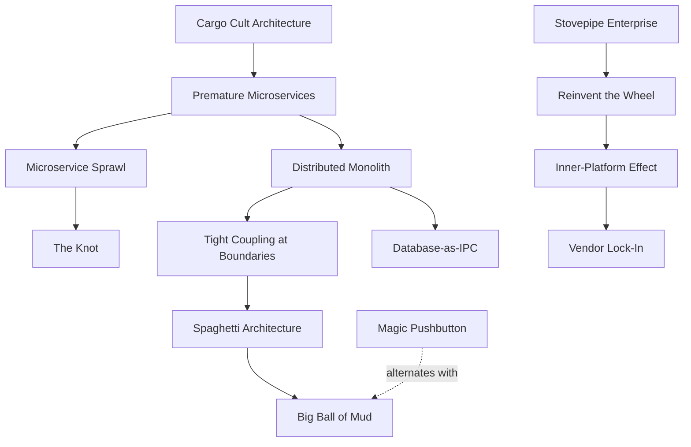
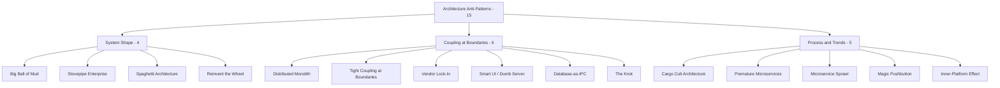

# Architecture Anti-Patterns

> *"Architecture represents the significant design decisions that shape a system, where significant is measured by cost of change."* — Grady Booch

Architecture anti-patterns operate at the **system level** — they describe how services, modules, teams, and technology choices fit together wrongly. You usually cannot see them in any one file. You see them in dependency graphs, deployment topology, on-call rotations, and procurement contracts.

> Looking for **code-level** anti-patterns (God Object, Spaghetti Code, Magic Numbers, etc.)? They live in their own roadmap: [Programming-Languages → Anti-Patterns](../../Programming-Languages/code-craft/anti-patterns/README.md). This roadmap focuses exclusively on **system architecture**.

This roadmap groups **15 anti-patterns** into **3 categories** by which architectural axis they corrupt.

---

## The Three Categories

| Category | What it signals | Anti-patterns |
|---|---|---|
| [System Shape](01-system-shape/junior.md) | The overall topology has decayed or never had structure | 4 |
| [Coupling at Boundaries](02-coupling-at-boundaries/junior.md) | Services or layers depend on each other in ways they shouldn't | 6 |
| [Process & Trend-Chasing](03-process-and-trends/junior.md) | The architecture reflects fashion or politics, not requirements | 5 |

Each category is delivered as an **8-file suite** (junior → professional + tasks/find-bug/optimize/interview), covering every anti-pattern in the category collectively.

---

## All 15 Architecture Anti-Patterns

### System Shape — the topology has decayed

| Anti-pattern | Symptom | Primary cure |
|---|---|---|
| **Big Ball of Mud** | No discernable architecture; every module imports every other; the system "works" only because the same people have kept it running | Identify seams; introduce bounded contexts incrementally — see [DDD](../ddd/README.md) |
| **Stovepipe Enterprise** | Independent silos per business unit/department; the same customer entity is rebuilt in three teams; no shared platform | Build shared platform services; canonical data model; cross-cutting governance |
| **Spaghetti Architecture** | Microservices or modules call each other ad hoc; the runtime call graph has no recognizable layers | [Layered architecture](../software-design-architecture/README.md), [event-driven boundaries](../../Backend/distributed-systems/README.md) |
| **Reinvent the Wheel (Square)** | The team builds its own message broker, ORM, scheduler, or auth — usually worse than open-source alternatives, always more expensive | Buy or adopt; build only the differentiator |

### Coupling at Boundaries — services that depend wrongly

| Anti-pattern | Symptom | Primary cure |
|---|---|---|
| **Distributed Monolith** | Microservices that must be deployed together to work; one repo's release fails the others; coupled by synchronous calls and shared schema | True service boundaries, asynchronous integration via [events](../../Backend/distributed-systems/README.md), independent deployability |
| **Tight Coupling at Service Boundaries** | Services share database tables, deserialize each other's internal types, or call each other through chains of synchronous HTTP | Contract-first APIs, anti-corruption layers, async messaging |
| **Vendor Lock-In** | The system is unmovable from a specific cloud, database, or SaaS without a full rewrite — usually by accident, not by design | Abstract the vendor behind interfaces *where it's worth it*; accept lock-in where it isn't (and document the choice) |
| **Smart UI / Dumb Server (or the inverse)** | One tier holds all logic; the other is a thin shell. Business rules duplicated or relocated arbitrarily | Place logic on the tier that owns the data and the invariants; keep the other tier focused on its job |
| **Database-as-IPC** | Two services "communicate" by writing rows to a shared table that the other polls; the database becomes a message queue with worse semantics | Use a real message broker; if state must be shared, expose an API — not a table |
| **The Knot** | A set of services so densely interdependent that no one can be deployed, tested, or reasoned about in isolation; the graph is a complete subgraph | Identify cycles; break them with events or anti-corruption layers; sometimes merge services that should never have been split |

### Process & Trend-Chasing — architecture as fashion

| Anti-pattern | Symptom | Primary cure |
|---|---|---|
| **Cargo Cult Architecture** | "Netflix has microservices, so we have microservices" — even though the team has 8 engineers and one product | Architect for *your* load, team, and change rate — not someone else's |
| **Premature Microservices** | A new product split into 12 services before there is a single customer; each refactoring crosses six repos | Start with a [modular monolith](../software-design-architecture/README.md); extract services when modules diverge in scale or rate of change |
| **Microservice Sprawl** | The mature form of Premature Microservices — hundreds of tiny services with no ownership, duplicated infra, and a deploy graph nobody understands | Service consolidation; platform-team-owned templates; explicit ownership; merge what should never have been split |
| **Magic Pushbutton (the "We Just Need a Big Rewrite" anti-pattern)** | Every problem is met with "let's rewrite from scratch in $LANGUAGE"; the old system actually encodes years of business knowledge | Strangler-fig migration: replace incrementally, never bet the company on a v2 |
| **Inner-Platform Effect (Architecture flavor)** | Internal "everything platform" that re-implements features the underlying cloud already offers, slower and with one team to support it | Adopt platform features; build only the glue and the differentiator |

---

## How These Anti-Patterns Relate

Architecture anti-patterns are slow-moving — they emerge over years and entrench through organizational structure (Conway's Law).

Reading the graph: a Cargo Cult decision to "go microservices" without justification produces Premature Microservices, which become a Distributed Monolith *and* a Microservice Sprawl, which collapse into Tight Coupling and The Knot — and given enough years without correction, a Big Ball of Mud. The cure is a rare combination: technical refactoring **and** organizational change.

---

## Conway's Law

> *"Any organization that designs a system will produce a design whose structure is a copy of the organization's communication structure."* — Melvin Conway, 1968

Almost every architecture anti-pattern has an organizational mirror:

| Architecture anti-pattern | Organizational mirror |
|---|---|
| Stovepipe Enterprise | Strong business-unit silos, no platform team |
| Big Ball of Mud | Long-tenured team with no architectural ownership |
| Distributed Monolith | Service ownership without genuine team autonomy |
| Premature Microservices / Microservice Sprawl | A team that believes "service per developer" scales |
| The Knot | Mutual hostage-taking between teams that should be independent |
| Reinvent the Wheel | "Not Invented Here" engineering culture |
| Vendor Lock-In | Procurement decisions divorced from engineering review |
| Magic Pushbutton | Leadership rewarded for greenfield launches over maintenance |
| Database-as-IPC | Teams that own different services share one DBA — and one schema |

The implication: fixing the architecture without addressing the org chart usually fails. Process and people changes ship alongside refactors.

---

## Categories at a Glance

---

## How to Read This Roadmap

Each subcategory folder contains an **8-file suite**:

| File | Focus | Audience |
|---|---|---|
| `junior.md` | "What does this look like at the system level?" "Why is it bad?" | Familiar with one service, not the whole system |
| `middle.md` | "How does this emerge?" "What is the alternative architecture?" | Owns a few services |
| `senior.md` | "How do I migrate without a freeze?" "How do I sell the refactor to the org?" | Tech lead / staff engineer |
| `professional.md` | Capacity, cost, on-call, organizational topology | Principal / architect |
| `interview.md` | 50+ Q&A — system design and architectural reasoning | System design interview prep |
| `tasks.md` | 10+ architecture exercises with proposed solutions | Practice |
| `find-bug.md` | 10+ topology diagrams — spot the anti-pattern | Diagram-reading practice |
| `optimize.md` | 10+ flawed architectures to redesign | Migration practice |

**Recommended order:** `junior.md` → `middle.md` → `senior.md` → `professional.md` → practice files → `interview.md` for review.

Because architecture anti-patterns are larger in scope, each file uses **case studies and topology diagrams** rather than per-language snippets. Where code appears, it's pseudocode plus one concrete language (Go preferred for distributed examples, Python for batch/ML, Java for enterprise).

---

## Status

- ⬜ **System Shape** (Big Ball of Mud, Stovepipe Enterprise, Spaghetti Architecture, Reinvent the Wheel) — 0/8 files
- ⬜ **Coupling at Boundaries** (Distributed Monolith, Tight Coupling, Vendor Lock-In, Smart UI / Dumb Server, Database-as-IPC, The Knot) — 0/8 files
- ⬜ **Process & Trend-Chasing** (Cargo Cult Architecture, Premature Microservices, Microservice Sprawl, Magic Pushbutton, Inner-Platform Effect) — 0/8 files

---

## References

- **AntiPatterns: Refactoring Software, Architectures, and Projects in Crisis** — Brown et al. (1998) — chapters on Architecture AntiPatterns.
- **Big Ball of Mud** — Brian Foote & Joseph Yoder (1997). [laputan.org/mud](http://www.laputan.org/mud/) — the foundational paper.
- **Patterns of Enterprise Application Architecture** — Martin Fowler (2002).
- **Building Microservices** — Sam Newman (2nd ed. 2021) — antidotes to Distributed Monolith and Premature Microservices.
- **Monolith to Microservices** — Sam Newman (2019) — strangler-fig migration; the cure for Magic Pushbutton.
- **Conway's Law** — Melvin Conway, "How Do Committees Invent?" (1968).
- **Accelerate** — Forsgren, Humble, Kim (2018) — empirical evidence that loose coupling between teams and services predicts performance.

---

## Related Roadmaps

- [System Design](../system-design/README.md) — the positive catalog of architectural patterns
- [Software Design & Architecture](../software-design-architecture/README.md)
- [Domain-Driven Design](../ddd/README.md) — bounded contexts as the cure for Stovepipe and Big Ball of Mud
- [Distributed Systems](../../Backend/distributed-systems/README.md) — async patterns that resolve coupling at boundaries
- [Programming-Languages → Anti-Patterns](../../Programming-Languages/code-craft/anti-patterns/README.md) — code- and design-level anti-patterns (the layers below this one)

---

## Project Context

This roadmap is part of the [Architecture section](../) of the [Senior Project](../../../../index.md).
