# Blockchain Roadmap — Universal Template

> **A comprehensive template system for generating Blockchain roadmap content across all skill levels.**

---

## Overview

| | Description |
|---|---|
| **Purpose** | Universal template for all Blockchain roadmap topics |
| **Files per topic** | 9 files: `junior.md`, `middle.md`, `senior.md`, `professional.md`, `interview.md`, `tasks.md`, `find-bug.md`, `optimize.md`, `specification.md` |
| **Language** | All content must be generated in **English** |
| **Table of Contents** | **Optional** — include only if relevant to the topic. For theory/practice files (`tasks.md`, `find-bug.md`, `optimize.md`) it is NOT required |

### Topic Structure

```
XX-topic-name/
├── junior.md          ← "What?" and "How?"
├── middle.md          ← "Why?" and "When?"
├── senior.md          ← "How to optimize?" and "How to architect?"
├── professional.md    ← "Under the Hood" — consensus, EVM, Byzantine fault tolerance
├── interview.md       ← Interview prep across all levels
├── tasks.md           ← Hands-on practice tasks
├── find-bug.md        ← Find and fix bugs in smart contracts (10+ exercises)
├── optimize.md        ← Optimize slow/inefficient contracts/code (10+ exercises)
└── specification.md   ← Official spec / documentation deep-dive
```

---

## Level Comparison Matrix

| Aspect | Junior | Middle | Senior | Professional |
|:------:|:------:|:------:|:------:|:------------:|
| **Depth** | Basic concepts, simple examples | Practical usage, real-world cases | Architecture, optimization | Consensus internals, EVM bytecode, Byzantine fault tolerance |
| **Code** | Hello World smart contract | Production-ready contract patterns | Advanced patterns, gas benchmarks | EVM opcode analysis, consensus proofs |
| **Tricky Points** | Syntax errors, Solidity quirks | Reentrancy, access control pitfalls | Economic attacks, upgrade patterns | Byzantine generals, Lamport clocks, fork-choice rules |
| **Focus** | "What?" and "How?" | "Why?" and "When?" | "How to improve?" | "What happens under the hood?" |

---
---

# TEMPLATE 1 — `junior.md`

<details open>
<summary><strong>Template Content</strong></summary>

# {{TOPIC_NAME}} — Junior Level

## Table of Contents

1. [Introduction](#introduction)
2. [Prerequisites](#prerequisites)
3. [Glossary](#glossary)
4. [Core Concepts](#core-concepts)
5. [Pros & Cons](#pros--cons)
6. [Use Cases](#use-cases)
7. [Design Examples / Pseudocode](#design-examples--pseudocode)
8. [Coding Patterns](#coding-patterns)
9. [Clean Code](#clean-code)
10. [Product Use / Feature](#product-use--feature)
11. [Failure Mode Design](#failure-mode-design)
12. [Security Considerations](#security-considerations)
13. [Performance Tips](#performance-tips)
14. [Metrics & Analytics](#metrics--analytics)
15. [Best Practices](#best-practices)
16. [Edge Cases & Pitfalls](#edge-cases--pitfalls)
17. [Common Mistakes](#common-mistakes)
18. [Tricky Points](#tricky-points)
19. [Test](#test)
20. [Tricky Questions](#tricky-questions)
21. [Cheat Sheet](#cheat-sheet)
22. [Summary](#summary)
23. [What You Can Build](#what-you-can-build)
24. [Further Reading](#further-reading)
25. [Related Topics](#related-topics)
26. [Diagrams & Visual Aids](#diagrams--visual-aids)

---

## Introduction

> Focus: "What is it?" and "How to use it?"

Brief explanation of what {{TOPIC_NAME}} is and why a beginner needs to know it.
Keep it simple — assume the reader has basic programming knowledge but is new to blockchain.

---

## Prerequisites

What you should know before studying this topic:

- **Required:** {{concept 1}} — brief explanation of why
- **Required:** {{concept 2}} — brief explanation of why
- **Helpful but not required:** {{concept 3}}

> List 2-4 prerequisites. Link to related roadmap topics if available.

---

## Glossary

Key terms used in this topic:

| Term | Definition |
|------|-----------|
| **{{Term 1}}** | Simple, one-sentence definition |
| **{{Term 2}}** | Simple, one-sentence definition |
| **{{Term 3}}** | Simple, one-sentence definition |

> 5-10 terms. Keep definitions beginner-friendly.
> These terms will appear throughout the document.

---

## Core Concepts

### Concept 1: {{name}}

Simple explanation with analogy if helpful.

### Concept 2: {{name}}

...

> **Rules:**
> - Each concept should be explained in 3-5 sentences max.
> - Use bullet points for lists.
> - Include small pseudocode snippets inline where needed.

---

## Real-World Analogies

Everyday analogies to help you understand {{TOPIC_NAME}} intuitively:

| Concept | Analogy |
|---------|--------|
| **{{Concept 1}}** | {{Analogy — e.g., "A blockchain is like a public ledger nailed to a town square wall — everyone can read it, nobody can erase it"}} |
| **{{Concept 2}}** | {{Analogy}} |
| **{{Concept 3}}** | {{Analogy}} |

> 2-4 analogies. Use everyday objects and situations.
> Avoid over-stretching analogies — mention where the analogy breaks down.

---

## Mental Models

How to picture {{TOPIC_NAME}} in your head:

**The intuition:** {{A simple mental model}}

**Why this model helps:** {{Why visualizing it this way prevents common mistakes}}

---

## Pros & Cons

| Pros | Cons |
|------|------|
| {{Advantage 1}} | {{Disadvantage 1}} |
| {{Advantage 2}} | {{Disadvantage 2}} |
| {{Advantage 3}} | {{Disadvantage 3}} |

### When to use:
- {{Scenario where this approach shines}}

### When NOT to use:
- {{Scenario where another approach is better}}

---

## Use Cases

When and where you would use this in real projects:

- **Use Case 1:** Description — e.g., "Deploying a token contract on Ethereum"
- **Use Case 2:** Description
- **Use Case 3:** Description

---

## Design Examples / Pseudocode

### Example 1: {{title}}

```solidity
// SPDX-License-Identifier: MIT
pragma solidity ^0.8.0;

// Full working example with comments
contract HelloBlockchain {
    string public message;

    constructor(string memory _message) {
        message = _message;
    }

    function setMessage(string memory _newMessage) public {
        message = _newMessage;
    }
}
```

**What it does:** Brief explanation of what happens.
**How to deploy:** Use Remix IDE or Hardhat.

### Example 2: {{title}}

```solidity
// Another practical example
```

> **Rules:**
> - Every example must be deployable. Include pragma and license.
> - Add comments explaining each important line.

---

## Coding Patterns

Common patterns beginners encounter when working with {{TOPIC_NAME}}:

### Pattern 1: {{Basic pattern name}}

**Intent:** {{One sentence — what problem does this pattern solve?}}
**When to use:** {{Simple scenario where this pattern applies}}

```solidity
// Pattern implementation — keep it simple and well-commented
```

**Diagram:**

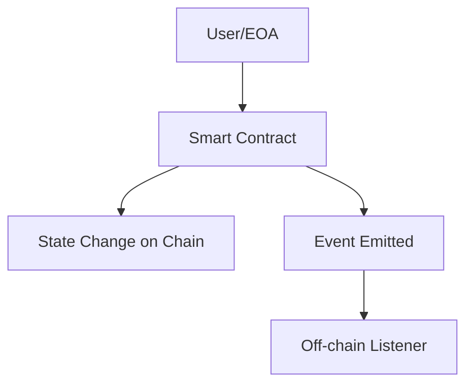

**Remember:** {{One key takeaway for junior developers}}

---

### Pattern 2: {{Another basic pattern}}

**Intent:** {{What it solves}}

```solidity
// Second pattern example
```

**Diagram:**

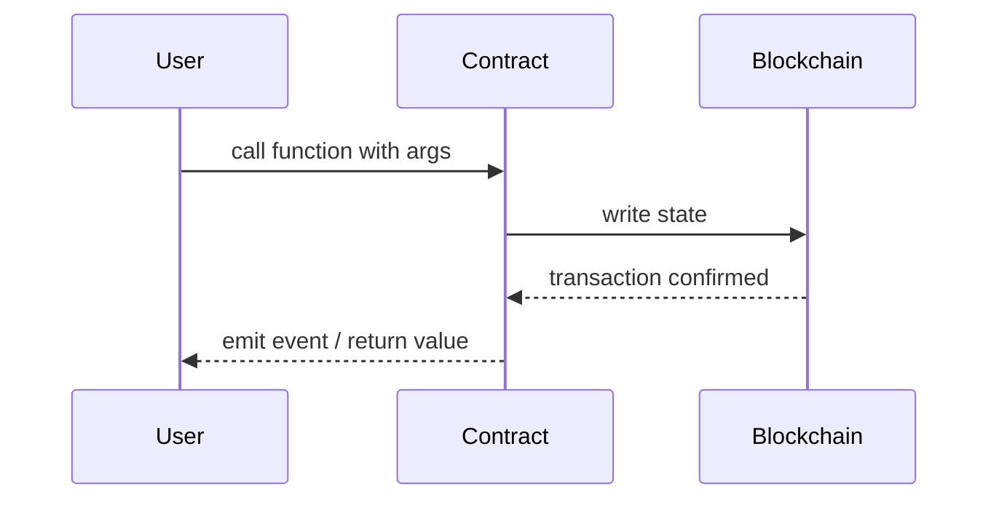

> Include 2 patterns at this level. Keep diagrams simple — flowcharts and sequence diagrams only.
> Focus on patterns the beginner WILL encounter, not advanced ones.

---

## Clean Code

Basic clean code principles for blockchain/smart-contract development:

### Naming

```solidity
// ❌ Bad naming
function d(uint x) public returns (uint) { return x * 2; }
uint t;

// ✅ Clean naming
function doubleValue(uint amount) public returns (uint) { return amount * 2; }
uint public totalSupply;
```

**Rules:**
- State variables: describe WHAT they hold (`ownerAddress`, not `a`, `x`)
- Functions: describe WHAT they do (`transferTokens`, not `transfer2`, `doStuff`)
- Booleans: use `is`, `has`, `can` prefix (`isPaused`, `hasRole`)

---

### Functions

```solidity
// ❌ Too long, does too many things
function processAll(address user, uint amount) public {
    // 80+ lines: validate, transfer, update state, emit events, notify...
}

// ✅ Single responsibility
function _validateTransfer(address user, uint amount) internal view { ... }
function _executeTransfer(address from, address to, uint amount) internal { ... }
function _emitTransferEvent(address from, address to, uint amount) internal { ... }
```

**Rule:** If a function does more than one thing, split it. Aim for **≤ 20 lines**.

---

### Comments

```solidity
// ❌ Noise comment (states the obvious)
// increment balance by 1
balance++;

// ❌ Outdated comment (lies)
// returns user token balance (actually returns ETH balance now)
function getBalance(address user) public view returns (uint) { ... }

// ✅ NatSpec — explains WHY and WHAT for external callers
/// @notice Transfer tokens from caller to recipient
/// @dev Reverts if caller has insufficient balance
/// @param to Recipient address
/// @param amount Number of tokens (in wei-equivalent)
function transfer(address to, uint amount) public { ... }
```

**Rule:** Use NatSpec for all public/external functions. Comments explain **why**, not **what**.

---

## Product Use / Feature

How this topic is used in real-world blockchain products and protocols:

### 1. {{Protocol/Product Name}}

- **How it uses {{TOPIC_NAME}}:** Brief description
- **Why it matters:** Practical impact

### 2. {{Protocol/Product Name}}

- **How it uses {{TOPIC_NAME}}:** Brief description
- **Why it matters:** Practical impact

### 3. {{Protocol/Product Name}}

- **How it uses {{TOPIC_NAME}}:** Brief description
- **Why it matters:** Practical impact

> 3-5 real products/protocols. Show how the topic is applied in industry.

---

## Failure Mode Design

How to handle failures when working with {{TOPIC_NAME}}:

### Failure 1: {{Common revert reason or error type}}

```solidity
// Code that produces this revert
```

**Why it happens:** Simple explanation.
**How to fix:**

```solidity
// Corrected code with proper checks
```

### Failure 2: {{Another common failure}}

...

### Failure Handling Pattern

```solidity
// Recommended pattern for this topic
function safeOperation(address to, uint amount) public {
    require(to != address(0), "Invalid recipient");
    require(amount > 0, "Amount must be positive");
    require(balances[msg.sender] >= amount, "Insufficient balance");
    // execute...
}
```

> 2-4 common failures. Show the revert, explain why, and provide the fix.
> Teach the checks-effects-interactions pattern from the start.

---

## Security Considerations

Security aspects to keep in mind when working with {{TOPIC_NAME}}:

### 1. {{Security concern}}

```solidity
// ❌ Insecure
...

// ✅ Secure
...
```

**Risk:** What could go wrong (reentrancy, front-running, overflow).
**Mitigation:** How to protect against it.

### 2. {{Another security concern}}

...

> 2-4 security considerations relevant to this topic.
> Even juniors should learn secure coding habits from the start.
> Focus on: input validation, reentrancy guards, access control, integer overflow.

---

## Performance Tips

Basic gas optimization considerations for {{TOPIC_NAME}}:

### Tip 1: {{Gas optimization}}

```solidity
// ❌ Gas-heavy approach
...

// ✅ Gas-efficient approach
...
```

**Why it's cheaper:** Simple explanation (fewer storage writes, smaller calldata, etc.)

### Tip 2: {{Another tip}}

...

> 2-4 tips. Keep explanations simple — focus on "what" not "how the EVM works".

---

## Metrics & Analytics

Key metrics to track when using {{TOPIC_NAME}}:

### What to Measure

| Metric | Why it matters | Tool |
|--------|---------------|------|
| **Gas used per tx** | {{reason}} | Hardhat gas reporter |
| **Event emission count** | {{reason}} | The Graph / Etherscan |

### Basic Instrumentation

```javascript
// Track gas usage in tests with Hardhat
const tx = await contract.someFunction(args);
const receipt = await tx.wait();
console.log("Gas used:", receipt.gasUsed.toString());
```

> **What to expose:** gas cost, transaction count, event frequency.
> Keep it simple — 2-3 metrics that tell you "is it working?".

---

## Best Practices

- **Do this:** Explanation
- **Do this:** Explanation
- **Do this:** Explanation

> 3-5 best practices. Keep them actionable and specific to juniors.

---

## Edge Cases & Pitfalls

### Pitfall 1: {{name}}

```solidity
// Code that demonstrates the pitfall
```

**What happens:** Explanation of unexpected behavior.
**How to fix:** Corrected code or approach.

### Pitfall 2: {{name}}

...

---

## Common Mistakes

### Mistake 1: {{description}}

```solidity
// ❌ Wrong way
...

// ✅ Correct way
...
```

### Mistake 2: {{description}}

...

> 3-5 mistakes that juniors commonly make with this topic.

---

## Common Misconceptions

Things people often believe about {{TOPIC_NAME}} that aren't true:

### Misconception 1: "{{False belief}}"

**Reality:** {{What's actually true}}

**Why people think this:** {{Why this misconception is common}}

### Misconception 2: "{{Another false belief}}"

**Reality:** {{What's actually true}}

> 2-4 misconceptions. Directly address false beliefs.

---

## Tricky Points

Things that look simple but have subtle behavior:

### Tricky Point 1: {{name}}

```solidity
// Code that might surprise a junior
```

**Why it's tricky:** Explanation.
**Key takeaway:** One-line lesson.

---

## Test

### Multiple Choice

**1. {{Question}}?**

- A) Option A
- B) Option B
- C) Option C
- D) Option D

<details>
<summary>Answer</summary>
**C)** — Explanation why C is correct and why others are wrong.
</details>

**2. {{Question}}?**

...

### True or False

**3. {{Statement}}**

<details>
<summary>Answer</summary>
**False** — Explanation.
</details>

### What's the Output / Behavior?

**4. What does this contract do when called?**

```solidity
// code snippet
```

<details>
<summary>Answer</summary>
Behavior: `...`
Explanation: ...
</details>

> 5-8 test questions total. Mix of multiple choice, true/false, and "what's the behavior".

---

## "What If?" Scenarios

Thought experiments to test your understanding:

**What if {{Unexpected situation}}?**
- **You might think:** {{Intuitive but wrong answer}}
- **But actually:** {{Correct behavior and why}}

**What if {{Another scenario}}?**
- **You might think:** ...
- **But actually:** ...

---

## Tricky Questions

Questions designed to confuse — with misleading options:

**1. {{Confusing question}}?**

- A) {{Looks correct but wrong}}
- B) {{Correct answer}}
- C) {{Common misconception}}
- D) {{Partially correct}}

<details>
<summary>Answer</summary>
**B)** — Explanation of why the "obvious" answers are wrong.
</details>

**2. {{Another tricky question}}?**

...

---

## Cheat Sheet

Quick reference for this topic:

| What | Syntax / Pattern | Example |
|------|-----------------|---------|
| {{Action 1}} | `{{syntax}}` | `{{example}}` |
| {{Action 2}} | `{{syntax}}` | `{{example}}` |
| {{Action 3}} | `{{syntax}}` | `{{example}}` |

---

## Self-Assessment Checklist

### I can explain:
- [ ] What {{TOPIC_NAME}} is and why it exists
- [ ] When to use it and when NOT to use it
- [ ] {{Specific concept 1}} in my own words

### I can do:
- [ ] Write a basic smart contract from scratch
- [ ] Deploy and interact with a contract using Remix/Hardhat
- [ ] Debug simple revert errors

---

## Summary

- Key point 1
- Key point 2
- Key point 3

**Next step:** What to learn after this topic.

---

## What You Can Build

### Projects you can create:
- **{{Project 1}}:** Brief description
- **{{Project 2}}:** Brief description
- **{{Project 3}}:** Brief description

### Learning path:

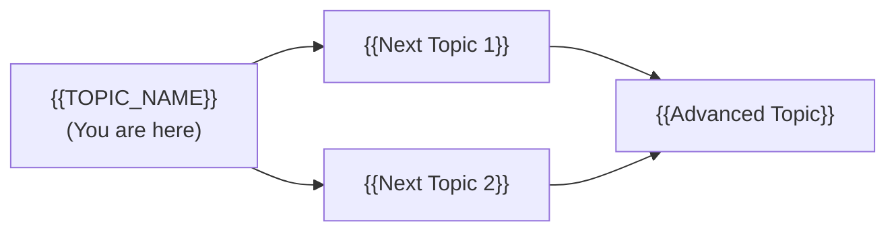

---

## Further Reading

- **Official docs:** [{{link title}}]({{url}})
- **Blog post:** [{{link title}}]({{url}}) — brief description
- **Video:** [{{link title}}]({{url}}) — duration, what it covers
- **Book chapter:** {{book name}}, Chapter X

---

## Related Topics

- **[{{Related Topic 1}}](../XX-related-topic/)** — how it connects
- **[{{Related Topic 2}}](../XX-related-topic/)** — how it connects

---

## Diagrams & Visual Aids

### Mind Map

```mermaid
mindmap
  root(({{TOPIC_NAME}}))
    Core Concept 1
      Sub-concept A
      Sub-concept B
    Core Concept 2
      Sub-concept C
      Sub-concept D
    Related Topics
      {{Related 1}}
      {{Related 2}}
```

### Blockchain Transaction Flow

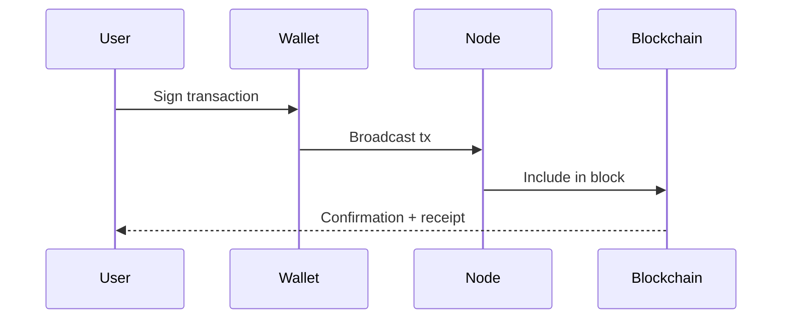

</details>

---
---

# TEMPLATE 2 — `middle.md`

<details open>
<summary><strong>Template Content</strong></summary>

# {{TOPIC_NAME}} — Middle Level

## Table of Contents

1. [Introduction](#introduction)
2. [Core Concepts](#core-concepts)
3. [Pros & Cons](#pros--cons)
4. [Use Cases](#use-cases)
5. [Design Examples / Pseudocode](#design-examples--pseudocode)
6. [Coding Patterns](#coding-patterns)
7. [Clean Code](#clean-code)
8. [Product Use / Feature](#product-use--feature)
9. [Failure Mode Design](#failure-mode-design)
10. [Security Considerations](#security-considerations)
11. [Performance Optimization](#performance-optimization)
12. [Metrics & Analytics](#metrics--analytics)
13. [Debugging Guide](#debugging-guide)
14. [Best Practices](#best-practices)
15. [Edge Cases & Pitfalls](#edge-cases--pitfalls)
16. [Common Mistakes](#common-mistakes)
17. [Tricky Points](#tricky-points)
18. [Comparison with Alternatives](#comparison-with-alternatives)
19. [Test](#test)
20. [Tricky Questions](#tricky-questions)
21. [Cheat Sheet](#cheat-sheet)
22. [Summary](#summary)
23. [What You Can Build](#what-you-can-build)
24. [Further Reading](#further-reading)
25. [Related Topics](#related-topics)
26. [Diagrams & Visual Aids](#diagrams--visual-aids)

---

## Introduction

> Focus: "Why?" and "When to use?"

Assumes the reader already knows Solidity basics. This level covers:
- Deeper understanding of how {{TOPIC_NAME}} works on-chain
- Real-world DeFi/NFT application patterns
- Gas optimization and production considerations

---

## Core Concepts

### Concept 1: {{Advanced concept}}

Detailed explanation with diagrams (mermaid) where helpful.

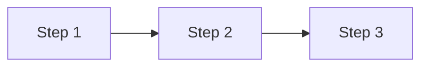

### Concept 2: {{Another concept}}

- How it relates to other EVM/blockchain features
- Internal behavior differences
- Gas implications

---

## Evolution & Historical Context

Why does {{TOPIC_NAME}} exist? What problem does it solve?

**Before {{TOPIC_NAME}}:**
- How developers solved this problem previously
- The pain points and limitations of the old approach

**How {{TOPIC_NAME}} changed things:**
- The architectural shift it introduced
- Why it became the standard in DeFi/NFT/DAO space

---

## Pros & Cons

| Pros | Cons |
|------|------|
| {{Advantage 1 with production context}} | {{Disadvantage 1 with gas impact analysis}} |
| {{Advantage 2}} | {{Disadvantage 2}} |
| {{Advantage 3}} | {{Disadvantage 3}} |

### Trade-off analysis:

- **{{Trade-off 1}}:** When {{advantage}} outweighs {{disadvantage}}
- **{{Trade-off 2}}:** When to accept {{limitation}} for {{benefit}}

### Comparison with alternatives:

| Approach | Pros | Cons | Best for |
|----------|------|------|----------|
| {{Approach A}} | {{pros}} | {{cons}} | {{scenario}} |
| {{Approach B}} | {{pros}} | {{cons}} | {{scenario}} |

---

## Alternative Approaches (Plan B)

If you couldn't use {{TOPIC_NAME}} for some reason:

| Alternative | How it works | When you might be forced to use it |
|-------------|--------------|------------------------------------|
| **{{Alternative 1}}** | {{Brief explanation}} | {{e.g., "If gas cost is strictly constrained"}} |
| **{{Alternative 2}}** | {{Brief explanation}} | {{e.g., "If cross-chain compatibility required"}} |

---

## Use Cases

Real-world, production scenarios:

- **Use Case 1:** {{DeFi scenario}}
- **Use Case 2:** {{NFT/Gaming scenario}}
- **Use Case 3:** {{DAO governance scenario}}

---

## Design Examples / Pseudocode

### Example 1: {{Production-ready pattern}}

```solidity
// Production-quality contract with access control, events, error handling
// SPDX-License-Identifier: MIT
pragma solidity ^0.8.0;

import "@openzeppelin/contracts/access/Ownable.sol";
import "@openzeppelin/contracts/security/ReentrancyGuard.sol";

contract ProductionPattern is Ownable, ReentrancyGuard {
    // Production-quality code
}
```

**Why this pattern:** Explanation of design decisions.
**Trade-offs:** What you gain and what you sacrifice.

### Example 2: {{Comparison of approaches}}

```solidity
// Approach A — mapping-based storage
...

// Approach B — array-based (better for X reason)
...
```

**When to use which:** Decision criteria.

---

## Coding Patterns

Design patterns and idiomatic patterns for {{TOPIC_NAME}} in production contracts:

### Pattern 1: {{Design pattern name — e.g., Checks-Effects-Interactions, Pull Payment, Proxy}}

**Category:** Security / Gas Optimization / Upgradeability / Access Control
**Intent:** {{What problem this pattern solves at the design level}}
**When to use:** {{Specific scenario}}
**When NOT to use:** {{Counter-indication}}

**Structure diagram:**

```mermaid
classDiagram
    class {{Interface}} {
        <<interface>>
        +{{method()}} {{ReturnType}}
    }
    class {{ConcreteA}} {
        +{{method()}} {{ReturnType}}
    }
    class {{ConcreteB}} {
        +{{method()}} {{ReturnType}}
    }
    class {{Client}} {
        -{{Interface}} dep
        +use()
    }
    {{Interface}} <|.. {{ConcreteA}}
    {{Interface}} <|.. {{ConcreteB}}
    {{Client}} --> {{Interface}}
```

**Implementation:**

```solidity
// Pattern implementation with real {{TOPIC_NAME}} usage
```

**Trade-offs:**

| ✅ Pros | ❌ Cons |
|---------|---------|
| {{benefit 1}} | {{drawback 1}} |
| {{benefit 2}} | {{drawback 2}} |

---

### Pattern 2: {{Another pattern}}

**Category:** Security / Upgradeability
**Intent:** {{What it solves}}

**Flow diagram:**

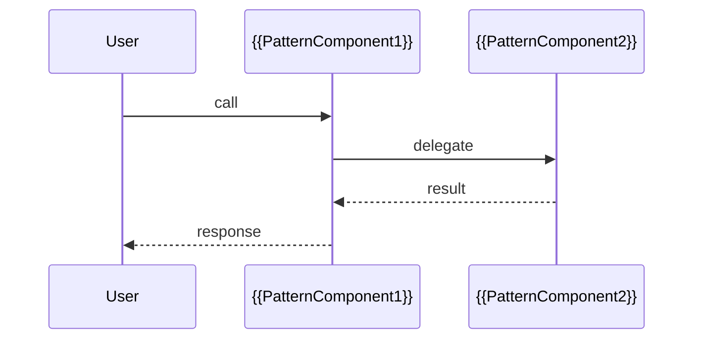

```solidity
// Implementation
```

---

### Pattern 3: {{Idiomatic blockchain pattern}}

**Intent:** {{Language-specific idiom or best practice}}

```mermaid
graph LR
    A[{{Input}}] -->|transform| B[{{TOPIC_NAME}} idiom]
    B -->|result| C[{{Output}}]
    B -.->|avoids| D[❌ Common vulnerability]
```

```solidity
// ❌ Non-idiomatic / vulnerable
...

// ✅ Idiomatic / secure pattern
...
```

---

## Clean Code

Production-level clean code principles for blockchain development:

### Naming & Readability

```solidity
// ❌ Cryptic
function proc(address a, uint256 v, bool f) external returns (bool)

// ✅ Self-documenting
function transferWithFee(address recipient, uint256 amount, bool applyDiscount) external returns (bool success)
```

| Element | Rule | Example |
|---------|------|---------|
| Functions | Verb + noun, describes action | `withdrawRewards`, `mintToken` |
| State vars | Noun, describes content | `totalLiquidity`, `rewardPerBlock` |
| Booleans | `is/has/can` prefix | `isPaused`, `hasWhitelist` |
| Constants | SCREAMING_SNAKE | `MAX_SUPPLY`, `BASIS_POINTS` |

---

### SOLID in Practice (Smart Contracts)

**Single Responsibility:**
```solidity
// ❌ One contract doing everything
contract MonolithicDeFi { /* handles lending + borrowing + staking + governance */ }

// ✅ Separate concerns
interface ILendingPool { function deposit(uint amount) external; }
interface IStakingPool { function stake(uint amount) external; }
contract LendingPool is ILendingPool { ... }
contract StakingPool is IStakingPool { ... }
```

---

### DRY vs WET

```solidity
// ❌ WET — same validation duplicated
function transfer(address to, uint amount) public {
    require(amount > 0, "Zero amount");
    require(balances[msg.sender] >= amount, "Insufficient");
    ...
}
function transferFrom(address from, address to, uint amount) public {
    require(amount > 0, "Zero amount");  // duplicated
    require(balances[from] >= amount, "Insufficient");  // duplicated
    ...
}

// ✅ DRY — extract validation
modifier validTransfer(address from, uint amount) {
    require(amount > 0, "Zero amount");
    require(balances[from] >= amount, "Insufficient");
    _;
}
```

---

## Product Use / Feature

How this topic is applied in production DeFi/NFT protocols:

### 1. {{Protocol Name}}

- **How it uses {{TOPIC_NAME}}:** Description with architectural context
- **Scale:** TVL, transaction volume
- **Key insight:** What can be learned from their approach

### 2. {{Protocol Name}}

- **How it uses {{TOPIC_NAME}}:** Description
- **Why this approach:** Trade-offs they made

---

## Failure Mode Design

Production-grade failure handling patterns for {{TOPIC_NAME}}:

### Pattern 1: {{Failure handling pattern}}

```solidity
// Production error handling with custom errors (gas-efficient)
error InsufficientBalance(address user, uint256 required, uint256 available);
error Unauthorized(address caller);

function withdraw(uint256 amount) external {
    if (balances[msg.sender] < amount)
        revert InsufficientBalance(msg.sender, amount, balances[msg.sender]);
    // ...
}
```

### Pattern 2: {{Circuit breaker / pause pattern}}

```solidity
// Emergency pause mechanism
modifier whenNotPaused() {
    require(!paused, "Contract is paused");
    _;
}
```

### Common Failure Patterns

| Situation | Pattern | Example |
|-----------|---------|---------|
| Invalid input | Custom error with data | `revert InvalidAmount(amount)` |
| Unauthorized | Role-based revert | `revert Unauthorized(msg.sender)` |
| External call failed | Check return value | `require(token.transfer(to, amount))` |
| Reentrancy | ReentrancyGuard | `nonReentrant` modifier |

---

## Security Considerations

Security aspects when using {{TOPIC_NAME}} in production:

### 1. {{Security concern}}

**Risk level:** High / Medium / Low

```solidity
// ❌ Vulnerable code
...

// ✅ Secure code
...
```

**Attack vector:** How this vulnerability can be exploited.
**Impact:** What happens if exploited.
**Mitigation:** Step-by-step fix.

### Security Checklist

- [ ] {{Check 1}} — why it matters
- [ ] {{Check 2}} — why it matters
- [ ] Reentrancy guard applied to state-changing external calls
- [ ] Integer overflow handled (Solidity 0.8+ auto-reverts, but be aware in assembly)
- [ ] Access control on all privileged functions

---

## Performance Optimization

Gas optimization considerations for {{TOPIC_NAME}}:

### Optimization 1: {{name}}

```solidity
// ❌ Gas-heavy — unnecessary storage reads
function expensiveRead() public view returns (uint) {
    return storageVar + storageVar + storageVar; // 3 SLOAD ops
}

// ✅ Cache in memory
function cheapRead() public view returns (uint) {
    uint cached = storageVar; // 1 SLOAD
    return cached + cached + cached;
}
```

**Gas benchmark:**
```
expensiveRead: ~2400 gas (3x SLOAD @ 800 gas each)
cheapRead:     ~900 gas  (1x SLOAD + 2x MLOAD @ 3 gas each)
```

### Performance Decision Matrix

| Scenario | Approach | Why |
|----------|----------|-----|
| {{Low frequency call}} | {{Simple approach}} | Readability > gas |
| {{High frequency call}} | {{Optimized approach}} | Gas critical |
| {{Batch operation}} | {{Batch approach}} | Amortize fixed costs |

---

## Metrics & Analytics

Production-grade metrics for {{TOPIC_NAME}}:

### Key Metrics

| Metric | Type | Description | Alert threshold |
|--------|------|-------------|-----------------|
| **Gas per tx** | Gauge | Average gas used | > {{threshold}} |
| **Revert rate** | Counter | % of failed txns | > 5% |
| **Event volume** | Counter | On-chain activity | — |

### Instrumentation via The Graph / Subgraph

```javascript
// Subgraph schema for tracking events
type Transfer @entity {
  id: ID!
  from: Bytes!
  to: Bytes!
  amount: BigInt!
  blockNumber: BigInt!
  timestamp: BigInt!
}
```

---

## Debugging Guide

How to debug common issues related to {{TOPIC_NAME}}:

### Problem 1: {{Common symptom — e.g., "Transaction reverts with no reason"}}

**Symptoms:** Revert with no error message, or "execution reverted".

**Diagnostic steps:**
```bash
# Decode revert reason with cast (Foundry)
cast call <contract> "function(args)" --trace

# Simulate with tenderly
tenderly simulate --network mainnet --from <addr> --to <contract> --data <calldata>
```

**Root cause:** Why this happens.
**Fix:** How to resolve it.

### Useful Tools

| Tool | Command | What it shows |
|------|---------|---------------|
| Hardhat | `--verbose` flag | Stack trace on revert |
| Foundry | `forge test -vvvv` | Full trace |
| Tenderly | UI simulator | Visual execution trace |

---

## Best Practices

- **Practice 1:** Explanation + code snippet
- **Practice 2:** Explanation + why it matters in production
- **Practice 3:** Always emit events for all state changes

---

## Edge Cases & Pitfalls

### Pitfall 1: {{Production pitfall}}

```solidity
// Code that causes issues in production
```

**Impact:** What goes wrong (reentrancy, frontrunning, etc.)
**Detection:** How to notice the problem.
**Fix:** Corrected approach.

---

## Common Mistakes

### Mistake 1: {{Middle-level mistake}}

```solidity
// ❌ Looks correct but has subtle issues
...

// ✅ Properly handles edge cases
...
```

---

## Common Misconceptions

Things even experienced developers get wrong about {{TOPIC_NAME}}:

### Misconception 1: "{{False belief}}"

**Reality:** {{What's actually true}}

**Evidence:**
```solidity
// Contract or test that proves the misconception wrong
```

---

## Anti-Patterns

### Anti-Pattern 1: {{Name — e.g., "Tx.origin for authentication"}}

```solidity
// ❌ The Anti-Pattern
require(tx.origin == owner, "Not owner"); // phishing vulnerable

// ✅ Correct approach
require(msg.sender == owner, "Not owner");
```

**Why it's bad:** How it causes vulnerabilities.

---

## Tricky Points

### Tricky Point 1: {{Subtle EVM behavior}}

```solidity
// Code with non-obvious behavior
```

**What actually happens:** Step-by-step explanation.
**Why:** Reference to EVM spec or Solidity docs.

---

## Comparison with Alternatives

How this blockchain approach compares to alternatives:

| Aspect | Ethereum/Solidity | Solana/Rust | Cosmos/Go | Polkadot/Rust |
|--------|:-----------------:|:-----------:|:---------:|:-------------:|
| {{Aspect 1}} | {{approach}} | {{approach}} | {{approach}} | {{approach}} |
| {{Aspect 2}} | ... | ... | ... | ... |

### Key differences:

- **Ethereum vs Solana:** {{main difference — account model vs program model}}
- **EVM vs CosmWasm:** {{main difference}}

---

## Test

### Multiple Choice (harder)

**1. {{Question involving trade-offs or subtle EVM behavior}}?**

- A) ...
- B) ...
- C) ...
- D) ...

<details>
<summary>Answer</summary>
**B)** — Detailed explanation with EVM spec reference if applicable.
</details>

### Code Analysis

**2. What happens when this contract is called with 1000 concurrent transactions?**

```solidity
// contract code
```

<details>
<summary>Answer</summary>
Explanation of ordering / MEV / reentrancy behavior.
</details>

---

## Tricky Questions

**1. {{Question that tests deep understanding}}?**

- A) {{Extremely convincing wrong answer}}
- B) ...
- C) ...
- D) {{Correct but counter-intuitive}}

<details>
<summary>Answer</summary>
**D)** — Deep explanation.
</details>

---

## Cheat Sheet

| Scenario | Pattern | Key consideration |
|----------|---------|-------------------|
| {{Scenario 1}} | `{{code pattern}}` | {{what to watch for}} |
| {{Scenario 2}} | `{{code pattern}}` | {{what to watch for}} |

### Decision Matrix

| If you need... | Use... | Because... |
|----------------|--------|------------|
| {{need 1}} | {{approach}} | {{reason}} |
| {{need 2}} | {{approach}} | {{reason}} |

---

## Self-Assessment Checklist

### I can explain:
- [ ] Why {{TOPIC_NAME}} is designed this way
- [ ] Trade-offs between different approaches
- [ ] Gas implications of different patterns

### I can do:
- [ ] Write production-quality contracts using {{TOPIC_NAME}}
- [ ] Write tests covering edge cases with Hardhat/Foundry
- [ ] Identify and fix reentrancy / access control vulnerabilities

---

## Summary

- Key insight 1
- Key insight 2
- Key insight 3

**Key difference from Junior:** What deeper understanding was gained.
**Next step:** What to explore at Senior level.

---

## What You Can Build

### Production systems:
- **{{System 1}}:** Description
- **{{System 2}}:** Description

### Technologies that become accessible:
- **{{Technology 1}}** — how this knowledge unlocks it

### Learning path:

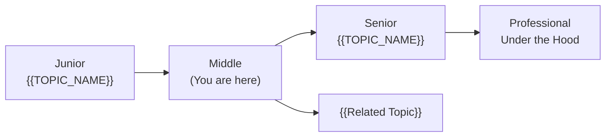

---

## Further Reading

- **Official docs:** [{{link title}}]({{url}})
- **Blog post:** [{{link title}}]({{url}})
- **Conference talk:** [{{link title}}]({{url}})
- **Open source:** [{{project name}}]({{url}})

---

## Related Topics

- **[{{Related Topic 1}}](../XX-related-topic/)** — how it connects
- **[{{Related Topic 2}}](../XX-related-topic/)** — how it connects

---

## Diagrams & Visual Aids

### Example — Transaction Flow

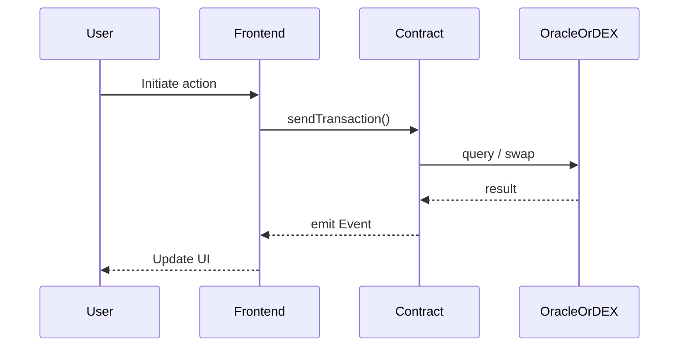

</details>

---
---

# TEMPLATE 3 — `senior.md`

<details open>
<summary><strong>Template Content</strong></summary>

# {{TOPIC_NAME}} — Senior Level

## Table of Contents

1. [Introduction](#introduction)
2. [Core Concepts](#core-concepts)
3. [Pros & Cons](#pros--cons)
4. [Use Cases](#use-cases)
5. [Design Examples / Pseudocode](#design-examples--pseudocode)
6. [Coding Patterns](#coding-patterns)
7. [Clean Code](#clean-code)
8. [Best Practices](#best-practices)
9. [Product Use / Feature](#product-use--feature)
10. [Failure Mode Design](#failure-mode-design)
11. [Security Considerations](#security-considerations)
12. [Performance Optimization](#performance-optimization)
13. [Metrics & Analytics](#metrics--analytics)
14. [Debugging Guide](#debugging-guide)
15. [Edge Cases & Pitfalls](#edge-cases--pitfalls)
16. [Postmortems & System Failures](#postmortems--system-failures)
17. [Common Mistakes](#common-mistakes)
18. [Tricky Points](#tricky-points)
19. [Comparison with Alternatives](#comparison-with-alternatives)
20. [Test](#test)
21. [Tricky Questions](#tricky-questions)
22. [Cheat Sheet](#cheat-sheet)
23. [Summary](#summary)
24. [What You Can Build](#what-you-can-build)
25. [Further Reading](#further-reading)
26. [Related Topics](#related-topics)
27. [Diagrams & Visual Aids](#diagrams--visual-aids)

---

## Introduction

> Focus: "How to optimize?" and "How to architect?"

For developers who:
- Design DeFi protocols and make architectural decisions
- Optimize gas-critical contract code
- Mentor junior/middle blockchain developers
- Audit and improve protocol codebases

---

## Core Concepts

### Concept 1: {{Architecture-level concept}}

Deep dive with:
- Design patterns and when to apply them
- Gas characteristics (storage vs memory vs calldata)
- Comparison with alternative approaches on other chains

```solidity
// Advanced pattern with detailed annotations
```

### Concept 2: {{Optimization concept}}

Gas benchmark comparisons:

```solidity
function approachA() external { /* ... */ }
function approachB() external { /* ... */ }
```

Results:
```
approachA: 45,230 gas
approachB:  8,190 gas (5.5x cheaper)
```

---

## Pros & Cons

### Strategic analysis for architectural decisions:

| Pros | Cons | Impact |
|------|------|--------|
| {{Advantage 1}} | {{Disadvantage 1}} | {{Impact on protocol architecture}} |
| {{Advantage 2}} | {{Disadvantage 2}} | {{Impact on team/audit cost}} |
| {{Advantage 3}} | {{Disadvantage 3}} | {{Impact on gas/scale}} |

### When this approach is the RIGHT choice:
- {{Scenario 1}} — why the pros outweigh the cons here

### When this approach is the WRONG choice:
- {{Scenario 1}} — what to use instead and why

### Real-world decision examples:
- **{{Protocol X}}** chose {{approach}} because {{reasoning}} — result: {{outcome}}

---

## Use Cases

Architectural and system-level scenarios:

- **Use Case 1:** {{Protocol design scenario}}
- **Use Case 2:** {{Economic attack prevention scenario}}
- **Use Case 3:** {{Cross-chain bridge design scenario}}

---

## Design Examples / Pseudocode

### Example 1: {{Architecture pattern}}

```solidity
// Full implementation of a production pattern
// With interfaces, access control, upgradability, events
```

**Architecture decisions:** Why this structure.
**Alternatives considered:** What else could work and why this was chosen.

### Example 2: {{Gas optimization}}

```solidity
// Before optimization
...

// After optimization (with gas proof)
...
```

---

## Coding Patterns

Architectural and advanced patterns for {{TOPIC_NAME}} in production protocols:

### Pattern 1: {{Architectural pattern — e.g., Diamond Standard, UUPS Proxy, Timelock, Multisig}}

**Category:** Upgradeability / Governance / Security / DeFi
**Intent:** {{The system-level problem this pattern solves}}
**Problem it solves:** {{Concrete scenario}}
**Trade-offs:** {{What you gain vs what complexity / audit surface you add}}

**Architecture diagram:**

```mermaid
graph TD
    subgraph "{{Pattern Name}}"
        A[{{Component 1}}] -->|{{action}}| B[{{Component 2}}]
        B -->|{{action}}| C[{{Component 3}}]
        C -.->|async| D[{{Component 4}}]
    end
    E[User/Protocol] -->|call| A
    D -->|event| F[{{Downstream}}]
```

**Implementation:**

```solidity
// Senior-level implementation
// Full pattern with access control, events, upgrade safety
```

**When this pattern wins:**
- {{Scenario 1 where it excels}}

**When to avoid:**
- {{Scenario where it adds unnecessary complexity or audit risk}}

---

### Pattern 2: {{MEV / Economic pattern}}

**Category:** Economic Security / MEV Protection
**Intent:** {{What it optimizes or protects against}}

**Flow diagram:**

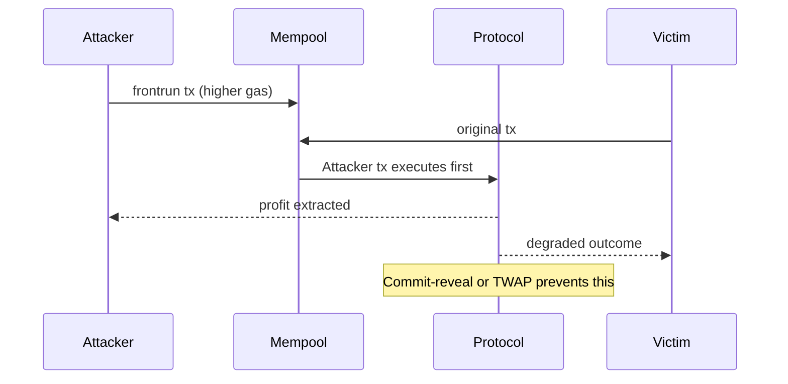

```solidity
// MEV-resistant implementation
```

---

### Pattern 3: {{Cross-contract / Composability pattern}}

**Category:** DeFi Composability / Flash Loans / Callbacks
**Intent:** {{How it enables protocol composability}}

**State diagram:**

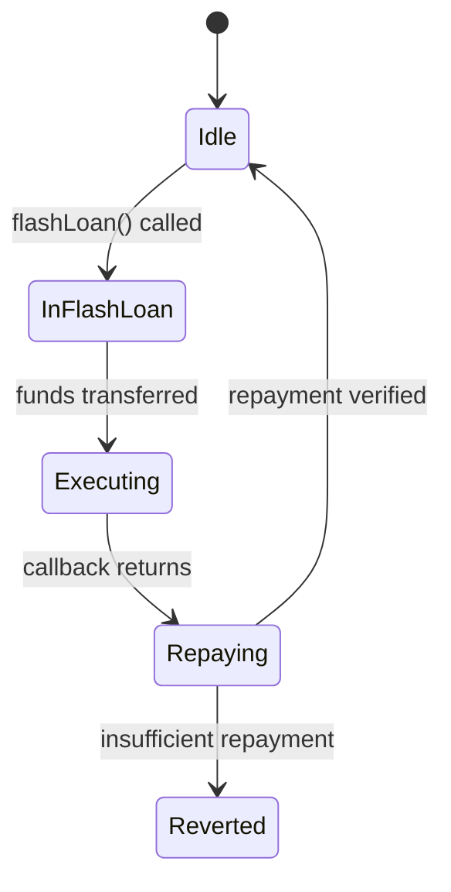

```solidity
// Flash loan callback pattern
```

---

### Pattern 4: {{Oracle / Price feed pattern}}

**Category:** Data Feeds / TWAP / Oracle Security
**Intent:** {{How it brings reliable external data on-chain}}

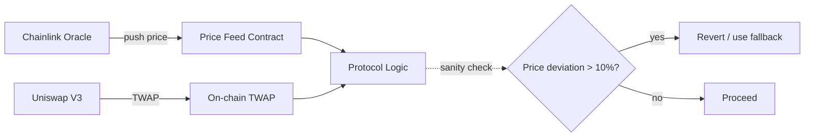

---

### Pattern Comparison Matrix

| Pattern | Use When | Avoid When | Complexity |
|---------|----------|------------|------------|
| {{Pattern 1}} | {{condition}} | {{condition}} | Low/Med/High |
| {{Pattern 2}} | {{condition}} | {{condition}} | Low/Med/High |
| {{Pattern 3}} | {{condition}} | {{condition}} | Low/Med/High |
| {{Pattern 4}} | {{condition}} | {{condition}} | Low/Med/High |

---

## Clean Code

Senior-level clean code: architecture, maintainability, and protocol standards for {{TOPIC_NAME}}:

### Clean Architecture Boundaries

```solidity
// ❌ Layering violation — core logic coupled to storage layout
contract OrderBook {
    mapping(uint => Order) public orders; // storage directly in business logic
    function fillOrder(uint id) external {
        Order storage order = orders[id]; // direct coupling
        ...
    }
}

// ✅ Separation via interface / diamond / library
interface IOrderBook {
    function fillOrder(uint id) external;
}
library OrderLib {
    function validate(Order memory o) internal pure { ... }
}
```

**Dependency flow must be:**
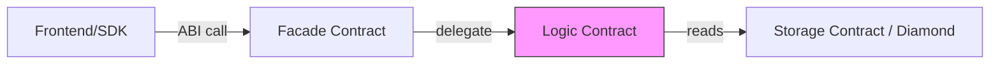

---

### Code Smells at Senior Level

| Smell | Symptom | Refactoring |
|-------|---------|-------------|
| **God Contract** | One contract with 30+ functions | Split by domain |
| **Magic Numbers** | `require(fee < 500)` | `require(fee < MAX_FEE_BPS)` |
| **Hardcoded Addresses** | `address(0x1234...)` | Use immutable + constructor |
| **Unchecked Returns** | Ignoring ERC20 transfer return | Always check or use SafeERC20 |

---

### Code Review Checklist (Senior)

- [ ] No business logic mixed with storage layout
- [ ] All external calls after state changes (CEI pattern)
- [ ] Events emitted for every state change
- [ ] No tx.origin for authorization
- [ ] Upgrade functions behind Timelock
- [ ] Slippage and deadline parameters on all AMM interactions

---

## Best Practices

Production best practices for {{TOPIC_NAME}} — battle-tested rules from top protocols:

### Must Do ✅

1. **Always follow Checks-Effects-Interactions** — prevents reentrancy class of vulnerabilities
   ```solidity
   // ✅ CEI order: check inputs, update state, then interact
   function withdraw(uint amount) external {
       require(balances[msg.sender] >= amount, "Insufficient"); // Check
       balances[msg.sender] -= amount;                          // Effect
       (bool ok,) = msg.sender.call{value: amount}("");         // Interact
       require(ok, "Transfer failed");
   }
   ```

2. **Use custom errors over require strings** — saves ~50 gas per revert
   ```solidity
   error InsufficientBalance(address user, uint256 required);
   // vs require(balance >= amount, "Insufficient balance"); // costs more gas
   ```

3. **Emit events for every meaningful state change** — critical for off-chain indexers and audit trails

4. **Gate upgrades behind Timelocks** — give users time to exit before breaking changes

5. **Test with realistic mainnet fork** — use `anvil --fork-url` or Hardhat mainnet forking

### Never Do ❌

1. **Never use tx.origin for authentication** — phishing contracts can impersonate users
   ```solidity
   // ❌ Vulnerable to phishing
   require(tx.origin == owner);
   // ✅ Safe
   require(msg.sender == owner);
   ```

2. **Never store unbounded arrays on-chain** — causes DoS via gas limit

3. **Never trust external oracle without sanity checks** — flash loan attacks can manipulate single-block prices

4. **Never leave large ETH balances in contracts without time-locks** — reduces attack surface

5. **Never deploy without a comprehensive audit and bug bounty** — protocol risk affects user funds

### Architecture Review Checklist

- [ ] Reentrancy guards on all non-view external-call functions
- [ ] Access control matrix documented and tested
- [ ] Upgrade path defined and timelocked
- [ ] Oracle manipulation resistant (TWAP, circuit breakers)
- [ ] Economic invariants tested under adversarial conditions
- [ ] Emergency pause mechanism with multi-sig
- [ ] Gas limits verified under worst-case storage patterns
- [ ] Cross-contract reentrancy considered (read-only reentrancy)
- [ ] Front-running / MEV vectors analyzed
- [ ] Dependency audit (imported OpenZeppelin version, etc.)

---

## Product Use / Feature

How industry leaders use this topic at scale:

### 1. {{Protocol Name}}

- **Architecture:** How they implement {{TOPIC_NAME}} at scale
- **Scale:** TVL, transaction volume, contract complexity
- **Lessons learned:** What they changed and why
- **Source:** Audit report or blog post reference

---

## Failure Mode Design

Enterprise-grade failure handling for {{TOPIC_NAME}}:

### Strategy 1: {{Failure handling architecture}}

```solidity
// Domain-specific error hierarchy
error ProtocolError(bytes32 code, string message);
error LiquidityError(address pool, uint256 required, uint256 available);
error OracleError(address oracle, uint256 staleness);
```

### Failure Handling Architecture

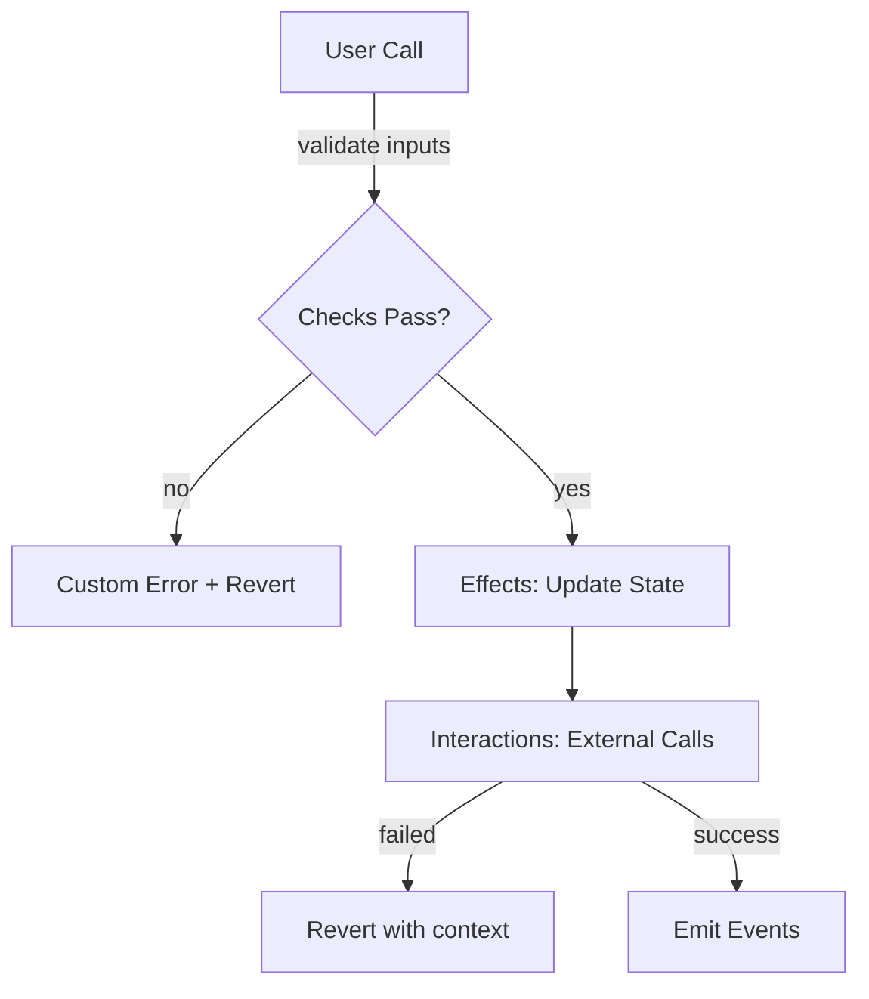

---

## Security Considerations

Security architecture for {{TOPIC_NAME}} at scale:

### 1. {{Critical security concern}}

**Risk level:** Critical
**Attack category:** Reentrancy / Oracle Manipulation / Access Control / Economic Attack

```solidity
// ❌ Vulnerable
...

// ✅ Secure
...
```

**Attack scenario:** Step-by-step of how an attacker exploits this.
**Defense in depth:** Multiple layers of protection.

### Threat Model

| Threat | Likelihood | Impact | Mitigation |
|--------|:---------:|:------:|------------|
| Reentrancy | High | Critical | CEI + ReentrancyGuard |
| Oracle manipulation | Medium | Critical | TWAP + circuit breaker |
| Admin key compromise | Low | Critical | Multisig + Timelock |

---

## Performance Optimization

Advanced gas optimization strategies for {{TOPIC_NAME}}:

### Optimization 1: {{name}}

```solidity
// Before — profiling shows high gas
function slow() external { ... }

// After — significant gas reduction
function fast() external { ... }
```

**Gas evidence:**
```
slow(): 87,432 gas
fast(): 23,105 gas (3.8x cheaper)
```

### Performance Architecture

| Layer | Optimization | Gas Impact | Cost |
|:-----:|:------------|:------:|:----:|
| **Storage layout** | Pack variables in slots | Highest | Requires redesign |
| **Data location** | calldata vs memory | High | Low refactor |
| **Error handling** | Custom errors | Medium | Low effort |
| **Event indexing** | Indexed vs non-indexed | Low | Easy |

---

## Metrics & Analytics

Observability for {{TOPIC_NAME}} at protocol scale:

### SLO / SLA Definition

| SLI | SLO Target | Measurement window | Consequence if breached |
|-----|-----------|-------------------|------------------------|
| **transaction success rate** | 99.5% | 24 hours | Alert + investigation |
| **gas per core operation** | < {{X}} gas | weekly review | Optimize or explain |
| **revert rate** | < 2% | 1 hour | Incident review |

### Subgraph / Event Monitoring

```javascript
// Subgraph handler for key protocol events
export function handleTransfer(event: TransferEvent): void {
  let entity = new Transfer(event.transaction.hash.toHex())
  entity.from = event.params.from
  entity.to = event.params.to
  entity.amount = event.params.amount
  entity.blockTimestamp = event.block.timestamp
  entity.save()
}
```

---

## Debugging Guide

Advanced debugging for {{TOPIC_NAME}} at scale:

### Problem 1: {{Production issue}}

**Symptoms:** On-chain state divergence, unexpected reverts, MEV exploitation.

**Diagnostic steps:**
```bash
# Replay transaction on fork
cast run <tx-hash> --rpc-url mainnet

# Trace internal calls
cast trace <tx-hash> --rpc-url mainnet
```

**Root cause analysis:** Deep explanation.
**Fix:** Architecture-level solution.

---

## Edge Cases & Pitfalls

### Pitfall 1: {{Scale pitfall}}

```solidity
// Code that works fine until 10K liquidity providers / 1M records
```

**At what scale it breaks:** Specific numbers.
**Root cause:** Why it fails.
**Solution:** Architecture-level fix.

---

## Postmortems & System Failures

Real-world examples of protocol exploits related to {{TOPIC_NAME}}:

### The {{Protocol Name}} Exploit

- **The goal:** {{What they were trying to achieve}}
- **The mistake:** {{How they misused this topic/feature}}
- **The impact:** {{Funds lost, TVL drained}}
- **The fix:** {{How they solved it permanently}}

**Key takeaway:** {{Architectural lesson learned}}

---

## Common Mistakes

### Mistake 1: {{Architectural anti-pattern}}

```solidity
// ❌ Common but wrong architecture
...

// ✅ Better approach
...
```

---

## Tricky Points

### Tricky Point 1: {{Solidity/EVM spec subtlety}}

```solidity
// Code that exploits a subtle Solidity/EVM specification detail
```

**EVM/Solidity spec reference:** Link or quote.
**Why this matters:** Real-world impact on protocol safety.

---

## Comparison with Alternatives

Deep architectural comparison:

| Aspect | Ethereum/Solidity | Solana/Anchor | Cosmos/CosmWasm | Near/Rust |
|--------|:-----------------:|:-------------:|:---------------:|:---------:|
| {{Aspect 1}} | {{approach}} | {{approach}} | {{approach}} | {{approach}} |
| {{Aspect 2}} | ... | ... | ... | ... |

---

## Test

### Architecture Questions

**1. You're designing {{protocol}}. Which approach is best and why?**

<details>
<summary>Answer</summary>
Full architectural reasoning with gas analysis and security trade-offs.
</details>

### Gas Analysis

**2. This function uses too much gas. How would you optimize it?**

```solidity
// contract with gas issues
```

<details>
<summary>Answer</summary>
Step-by-step optimization with gas measurements.
</details>

---

## Tricky Questions

**1. {{Question that even experienced blockchain developers get wrong}}?**

<details>
<summary>Answer</summary>
Detailed explanation with EVM spec reference and gas proof.
</details>

---

## "What If?" Scenarios (Architecture)

**What if {{Disaster scenario — e.g., "The oracle is manipulated in the same block"}}?**
- **Expected failure mode:** {{How the protocol should ideally degrade}}
- **Worst-case scenario:** {{Funds drained}}
- **Mitigation:** {{Circuit breaker, TWAP, multisig pause}}

---

## Cheat Sheet

### Architecture Decision Matrix

| Scenario | Recommended pattern | Avoid | Why |
|----------|-------------------|-------|-----|
| {{scenario 1}} | {{pattern}} | {{anti-pattern}} | {{reasoning}} |
| {{scenario 2}} | {{pattern}} | {{anti-pattern}} | {{reasoning}} |

### Gas Quick Wins

| Optimization | When to apply | Expected saving |
|-------------|---------------|----------------|
| {{optimization 1}} | {{condition}} | {{saving}} |
| {{optimization 2}} | {{condition}} | {{saving}} |

---

## Self-Assessment Checklist

### I can architect:
- [ ] Design protocols that use {{TOPIC_NAME}} at scale
- [ ] Evaluate trade-offs and document decisions in ADRs
- [ ] Identify when {{TOPIC_NAME}} is NOT the right solution

### I can lead:
- [ ] Conduct smart contract code reviews
- [ ] Define protocol security standards
- [ ] Debug production exploits and incidents

---

## Summary

- Key architectural insight 1
- Key gas optimization insight 2
- Key security insight 3

**Senior mindset:** Not just "how" but "when", "why", and "what are the attack vectors".

---

## What You Can Build

### Architect and lead:
- **{{Protocol/Platform 1}}:** Large-scale DeFi system design
- **{{Protocol/Platform 2}}:** High-security infrastructure

### Career impact:
- **Protocol Engineer / Smart Contract Architect** — system design interviews require this depth
- **Security Auditor** — deep protocol knowledge essential
- **Open Source Contributor** — contribute to Uniswap/Aave/etc.

---

## Further Reading

- **Security research:** [{{title}}]({{url}})
- **Protocol design doc:** [{{title}}]({{url}})
- **Conference talk:** [{{title}}]({{url}})
- **Audit report:** [{{project}}]({{url}})

---

## Related Topics

- **[{{Related Topic 1}}](../XX-related-topic/)** — architectural connection
- **[{{Related Topic 2}}](../XX-related-topic/)** — security connection

---

## Diagrams & Visual Aids

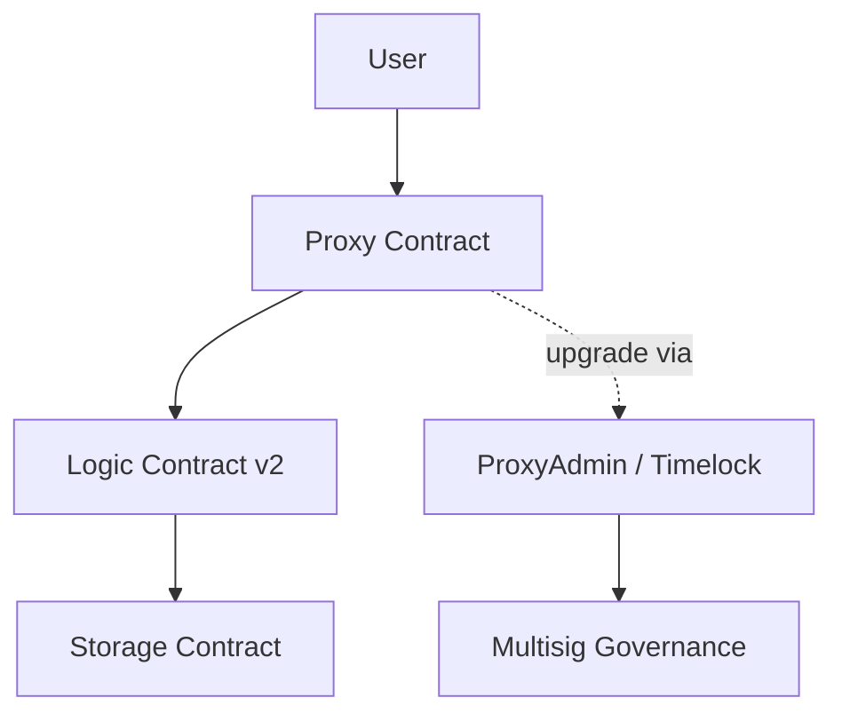

</details>

---
---

# TEMPLATE 4 — `professional.md`

<details open>
<summary><strong>Template Content</strong></summary>

# {{TOPIC_NAME}} — Under the Hood

## Table of Contents

1. [Introduction](#introduction)
2. [How It Works Internally](#how-it-works-internally)
3. [Consensus Algorithm Internals](#consensus-algorithm-internals)
4. [Formal Specification / Algorithm Analysis](#formal-specification--algorithm-analysis)
5. [Algorithm Complexity and Formal Proof](#algorithm-complexity-and-formal-proof)
6. [Distributed Systems Model and Failure Assumptions](#distributed-systems-model-and-failure-assumptions)
7. [EVM Bytecode Analysis](#evm-bytecode-analysis)
8. [Memory Layout](#memory-layout)
9. [Source Code Walkthrough](#source-code-walkthrough)
10. [Performance Internals](#performance-internals)
11. [Edge Cases at the Lowest Level](#edge-cases-at-the-lowest-level)
12. [Test](#test)
13. [Tricky Questions](#tricky-questions)
14. [Summary](#summary)
15. [Further Reading](#further-reading)
16. [Diagrams & Visual Aids](#diagrams--visual-aids)

---

## Introduction

> Focus: "What happens under the hood in the EVM and consensus layer?"

This document explores what the EVM and consensus protocol do internally when you use {{TOPIC_NAME}}.
For developers who want to understand:
- What opcodes are generated
- How consensus validators process this
- What Byzantine fault assumptions apply
- How memory/storage is laid out in the EVM

---

## How It Works Internally

Step-by-step breakdown of what happens when the EVM executes {{feature}}:

1. **Solidity source** → What you write
2. **ABI encoding** → How inputs are encoded
3. **EVM bytecode** → What actually runs
4. **State trie** → How state changes are committed
5. **Consensus** → How validators agree on the result

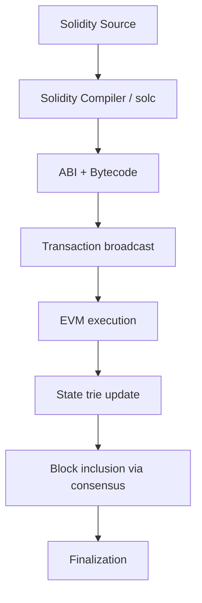

---

## Consensus Algorithm Internals

### How the consensus layer handles {{feature}}

```text
// Proof-of-Stake block proposal flow (Ethereum post-Merge)
1. Proposer selected by RANDAO + VRF
2. Proposer builds block: mempool selection, gas limit, base fee
3. Block broadcast to attesters
4. Attesters vote (LMD-GHOST fork choice + Casper FFG finality)
5. After 2 epochs (~12.8 min), block is finalized (cannot be reorged)
```

**Key consensus structures:**
```text
// Beacon chain block (simplified)
BeaconBlock {
  slot: uint64
  proposer_index: ValidatorIndex
  parent_root: Root
  state_root: Root
  body: BeaconBlockBody {
    eth1_data: Eth1Data
    attestations: List[Attestation]
    deposits: List[Deposit]
    execution_payload: ExecutionPayload  // EVM transactions
  }
}
```

**Key consensus functions:**
- `process_block()` — validates and applies a new block to state
- `process_attestations()` — aggregates validator votes
- `get_head()` — LMD-GHOST fork choice rule

---

## Formal Specification / Algorithm Analysis

### Formal Model of {{TOPIC_NAME}}

```text
// Formal specification — e.g., using TLA+ notation or mathematical pseudocode

State S = { balances: Address -> Uint256, nonces: Address -> Uint64 }

Transfer(from, to, amount):
  Pre: balances[from] >= amount ∧ from ≠ 0 ∧ to ≠ 0
  Post: balances'[from] = balances[from] - amount
        balances'[to]   = balances[to] + amount
        ∀ a ≠ from, a ≠ to: balances'[a] = balances[a]

Invariant: Σ balances[a] = TOTAL_SUPPLY (conservation of tokens)
```

**Safety property:** {{What can never go wrong — e.g., "no double spend"}}

**Liveness property:** {{What eventually happens — e.g., "every valid tx eventually confirms"}}

---

## Algorithm Complexity and Formal Proof

### Time and Space Complexity

| Operation | Time Complexity | Space Complexity | Notes |
|-----------|:---------------:|:----------------:|-------|
| {{Operation 1}} | O(1) | O(1) | {{e.g., SLOAD is O(1) but ~2100 gas}} |
| {{Operation 2}} | O(n) | O(n) | {{e.g., iterating mapping not possible}} |
| {{Operation 3}} | O(log n) | O(log n) | {{e.g., Merkle proof verification}} |

### Byzantine Fault Tolerance Proof

Ethereum's Casper FFG provides safety under the Byzantine Generals Problem assumption:

```text
// Byzantine Fault Tolerance — informal proof sketch
Assumption: At most f < n/3 validators are Byzantine (malicious/faulty)
where n = total validators

Safety: No two conflicting blocks can both be finalized
  Proof sketch:
  - Finalization requires 2/3 of validators to vote
  - Two conflicting blocks would require 4/3 > 1 total votes
  - By pigeonhole, at least 2/3 - 1/3 = 1/3 validators voted for both
  - These 1/3 are slashable (equivocation)
  - If f < n/3, this contradicts our assumption ∎

Liveness: The chain will keep finalizing (under network synchrony assumptions)
  Proof: As long as 2/3 validators are online and honest, attestations accumulate ∎
```

---

## Distributed Systems Model and Failure Assumptions

### Network Model for Ethereum

```text
Partial Synchrony Model (Dwork, Lynch, Stockmeyer 1988):
- Network is NOT always synchronous (messages can be delayed arbitrarily)
- But eventually, a Global Stabilization Time (GST) exists after which
  message delay is bounded by Δ

Implications for {{TOPIC_NAME}}:
- Pre-GST: validator set can diverge (no finality guarantees)
- Post-GST: Casper FFG finalizes blocks within 2 epochs
- Your {{TOPIC_NAME}} design must handle: reorgs, uncle blocks, MEV
```

### Failure Taxonomy

| Failure Type | Description | {{TOPIC_NAME}} Impact |
|-------------|-------------|----------------------|
| **Crash failure** | Node goes offline | Reduced validator participation |
| **Byzantine failure** | Node behaves arbitrarily | Potential double-vote, slashing |
| **Network partition** | Nodes can't communicate | Temporary fork, delayed finality |
| **Timing failure** | Message delayed past bound | Missed attestation window |

### Lamport Logical Clocks in Blockchain Context

```text
// Blockchain as a distributed logical clock
Each block has a Lamport timestamp: block_number (total order)
  - Event A "happened before" Event B if A.block < B.block
  - Or A.block == B.block ∧ A.tx_index < B.tx_index

This gives total ordering of all on-chain events — stronger than
classical Lamport clocks (which only give partial order)
```

---

## EVM Bytecode Analysis

```bash
# Disassemble compiled contract
solc --asm MyContract.sol
# or
cast disassemble $(cast code <contract-address>)
```

```text
; Key EVM opcodes with explanations for {{TOPIC_NAME}}

PUSH1 0x60    ; push 96 to stack
PUSH1 0x40    ; push 64 to stack (free memory pointer)
MSTORE        ; store at memory[0x40] = 0x60 (init memory layout)

CALLDATALOAD  ; load 32 bytes from calldata (function selector + args)
PUSH4 0xa9059cbb  ; ERC20 transfer() selector
EQ            ; compare
JUMPI         ; conditional jump to transfer handler

SLOAD         ; load from storage (2100 gas cold, 100 warm)
SSTORE        ; store to storage (20000 gas new, 2900 warm, 100 refund on zero)
```

**What to look for:**
- Number of SLOAD/SSTORE operations (most expensive)
- CALL/DELEGATECALL patterns (proxy contracts)
- REVERT paths (custom error vs string)
- Stack depth (max 1024)

---

## Memory Layout

How the EVM memory and storage is organized for {{TOPIC_NAME}}:

```
EVM Storage Layout (256-bit slots):
┌──────────────────────────────────────┐
│  Slot 0: totalSupply (uint256)       │  32 bytes
├──────────────────────────────────────┤
│  Slot 1: owner (address)             │  20 bytes used, 12 wasted
├──────────────────────────────────────┤
│  Slot 2: paused (bool)               │  1 byte used, 31 wasted
├──────────────────────────────────────┤
│  Slot 3: balances mapping            │  keccak256(address ++ 3)
│  ...                                 │
└──────────────────────────────────────┘

Packed storage (gas-efficient):
┌──────────────────────────────────────┐
│  Slot 0: owner (20B) + paused (1B)  │  21 bytes in 1 slot — saves 20k gas
└──────────────────────────────────────┘
```

**Key points:**
- Packing variables in same storage slot saves 20,000 gas on first write
- Mapping keys: `keccak256(abi.encode(key, slot))`
- Dynamic arrays: length at slot n, elements at `keccak256(n) + i`

---

## Source Code Walkthrough

Walking through the actual EVM / client source code:

**File:** `go-ethereum/core/vm/evm.go`

```text
// Annotated pseudocode from go-ethereum EVM execution loop
func (evm *EVM) Call(caller ContractRef, addr Address, input []byte, gas uint64, value *big.Int) {
    // 1. Check if address is a contract (has code)
    // 2. Transfer value (ETH)
    // 3. Create contract context
    // 4. Run EVM interpreter loop
    // 5. Return result / revert on error
}
```

**File:** `go-ethereum/core/state/statedb.go`

```text
// State trie update after transaction
func (s *StateDB) Commit(deleteEmptyObjects bool) (common.Hash, error) {
    // 1. Finalize dirty objects
    // 2. Update account trie
    // 3. Update storage tries
    // 4. Return new state root
}
```

---

## Performance Internals

### Gas profiling

```bash
# Profile gas per opcode with Foundry
forge test --gas-report

# Detailed trace
forge test --gas-report -vvvv
```

**Internal performance characteristics:**
- SLOAD: 2100 gas (cold) / 100 gas (warm, EIP-2929)
- SSTORE: 20000 gas (new slot) / 2900 gas (existing slot)
- CALL: 700 gas + memory expansion + value transfer
- Hash operations: SHA3 = 30 + 6*words gas

---

## Edge Cases at the Lowest Level

### Edge Case 1: {{name}}

What happens internally when {{extreme scenario}}:

```solidity
// Code that pushes EVM limits
```

**Internal behavior:** Step-by-step of what the EVM does.
**Why it matters:** Impact on protocol safety or gas.

---

## Test

### Internal Knowledge Questions

**1. What EVM opcode is executed when {{action}}?**

<details>
<summary>Answer</summary>
`OPCODE` — explanation of what it does, gas cost, and when it's triggered.
</details>

**2. What does this bytecode sequence do?**

```text
PUSH1 0x20
CALLDATALOAD
PUSH4 0xa9059cbb
EQ
```

<details>
<summary>Answer</summary>
Loads 32 bytes from calldata at offset 0x20, compares with the ERC20 transfer() selector.
</details>

---

## Tricky Questions

**1. {{Question about EVM internal behavior that contradicts common assumptions}}?**

<details>
<summary>Answer</summary>
Explanation with proof (bytecode analysis, gas measurement, or EVM spec reference).
</details>

---

## Self-Assessment Checklist

### I can explain internals:
- [ ] What happens at the EVM bytecode level when this feature is used
- [ ] How consensus validators process and finalize this
- [ ] Memory and storage layout and gas cost implications
- [ ] Byzantine fault tolerance assumptions that apply

### I can analyze:
- [ ] Read and understand EVM bytecode / disassembly
- [ ] Interpret gas profiles (forge gas-report, tenderly)
- [ ] Identify performance characteristics from bytecode
- [ ] Predict behavior under Byzantine/adversarial conditions

### I can prove:
- [ ] Back claims with formal specifications or invariants
- [ ] Reference EVM Yellow Paper or consensus spec
- [ ] Demonstrate internal behavior with on-chain forensics tools

---

## Summary

- Internal mechanism 1
- Internal mechanism 2
- Internal mechanism 3

**Key takeaway:** Understanding EVM and consensus internals helps you write gas-optimal, economically-secure protocols.

---

## Further Reading

- **EVM spec:** [Ethereum Yellow Paper](https://ethereum.github.io/yellowpaper/paper.pdf)
- **Consensus spec:** [Ethereum Beacon Chain spec](https://github.com/ethereum/consensus-specs)
- **go-ethereum source:** [core/vm/evm.go](https://github.com/ethereum/go-ethereum/blob/master/core/vm/evm.go)
- **Book:** "Mastering Ethereum" by Antonopoulos — chapters on EVM internals

---

## Diagrams & Visual Aids

### EVM Execution Model

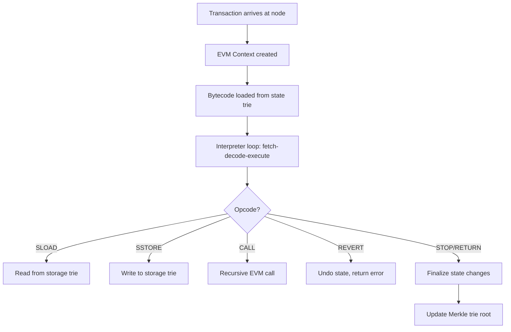

</details>

---
---

# TEMPLATE 5 — `interview.md`

<details open>
<summary><strong>Template Content</strong></summary>

# {{TOPIC_NAME}} — Interview Questions

## Table of Contents

1. [Junior Level](#junior-level)
2. [Middle Level](#middle-level)
3. [Senior Level](#senior-level)
4. [Scenario-Based Questions](#scenario-based-questions)
5. [FAQ](#faq)

---

## Junior Level

### 1. {{Basic conceptual question about blockchain/Solidity}}?

**Answer:**
Clear, concise explanation that a junior should be able to give.

---

### 2. {{Another basic question}}?

**Answer:**
...

---

### 3. {{Practical basic question}}?

**Answer:**
...with Solidity code example if needed.

---

> 5-7 junior questions. Test basic understanding and terminology.

---

## Middle Level

### 4. {{Question about DeFi/NFT pattern application}}?

**Answer:**
Detailed answer with real-world context.

```solidity
// Code example if applicable
```

---

### 5. {{Question about trade-offs}}?

**Answer:**
...

---

> 4-6 middle questions. Test practical experience and decision-making.

---

## Senior Level

### 7. {{Architecture/protocol design question}}?

**Answer:**
Comprehensive answer covering trade-offs, alternatives, and security considerations.

---

### 8. {{Gas optimization / EVM question}}?

**Answer:**
...with bytecode or gas measurements.

---

> 4-6 senior questions. Test deep understanding and leadership ability.

---

## Scenario-Based Questions

### 10. {{Real-world scenario: protocol is being exploited}}. How do you approach this?

**Answer:**
Step-by-step approach:
1. Immediately invoke emergency pause (if available)
2. Notify team and post-mortem channel
3. Trace the exploit transaction on-chain
4. ...

---

> 3-5 scenario questions. Test problem-solving under realistic conditions.

---

## FAQ

### Q: {{Common question candidates ask about blockchain interviews}}?

**A:** Clear answer with context about what interviewers are looking for.

### Q: {{What interviewers actually look for in smart contract answers}}?

**A:** Key evaluation criteria:
- {{What demonstrates junior-level understanding}}
- {{What demonstrates middle-level understanding}}
- {{What demonstrates senior-level understanding}}

</details>

---
---

# TEMPLATE 6 — `tasks.md`

<details open>
<summary><strong>Template Content</strong></summary>

# {{TOPIC_NAME}} — Practical Tasks

## Table of Contents

1. [Junior Tasks](#junior-tasks)
2. [Middle Tasks](#middle-tasks)
3. [Senior Tasks](#senior-tasks)
4. [Questions](#questions)
5. [Mini Projects](#mini-projects)
6. [Challenge](#challenge)

---

## Junior Tasks

### Task 1: {{Simple smart contract task}}

**Type:** 💻 Code

**Goal:** {{What skill this practices}}

**Instructions:**
1. ...
2. ...
3. ...

**Starter code:**

```solidity
// SPDX-License-Identifier: MIT
pragma solidity ^0.8.0;

contract StarterContract {
    // TODO: Complete this
}
```

**Expected behavior:**
```
Contract deploys successfully
Function returns expected value
```

**Evaluation criteria:**
- [ ] Contract compiles and deploys
- [ ] Functions behave as specified
- [ ] {{Specific check}}

---

### Task 2: {{Simple design task}}

**Type:** 🎨 Design

**Goal:** {{What design skill this practices}}

**Instructions:**
1. ...
2. ...

**Deliverable:** Mermaid diagram or pseudocode

```mermaid
graph TD
    A[User] --> B[Contract]
    B --> C[Storage]
```

**Evaluation criteria:**
- [ ] Design is clear and readable
- [ ] All required components present

---

> 3-4 junior tasks. Mix of 💻 Code and 🎨 Design tasks.

---

## Middle Tasks

### Task 4: {{Production DeFi/NFT coding task}}

**Type:** 💻 Code

**Goal:** {{What real-world skill this builds}}

**Scenario:** {{Brief context}}

**Requirements:**
- [ ] {{Requirement 1}}
- [ ] {{Requirement 2}}
- [ ] Write tests with Hardhat/Foundry
- [ ] Handle all edge cases

<details>
<summary>Hint 1</summary>
...
</details>

---

## Senior Tasks

### Task 7: {{Protocol architecture task}}

**Type:** 💻 Code

**Goal:** {{What architectural skill this practices}}

**Scenario:** {{Complex real-world protocol design problem}}

**Requirements:**
- [ ] Full protocol implementation
- [ ] Gas benchmark your solution
- [ ] Document architectural decisions

---

## Questions

### 1. {{Conceptual blockchain question}}?

**Answer:**
Clear explanation.

---

## Mini Projects

### Project 1: {{Larger protocol combining concepts}}

**Goal:** Build a {{description}} that uses {{TOPIC_NAME}} concepts.

**Requirements:**
- [ ] {{Feature 1}}
- [ ] {{Feature 2}}
- [ ] Test coverage > 90%

**Difficulty:** Middle / Senior
**Estimated time:** X hours

---

## Challenge

### {{Hard protocol challenge}}

**Problem:** {{Difficult protocol design or optimization challenge}}

**Constraints:**
- Gas usage under X per core operation
- Must be exploit-resistant

**Scoring:**
- Correctness: 40%
- Gas efficiency: 30%
- Security: 30%

</details>

---
---

# TEMPLATE 7 — `find-bug.md`

<details open>
<summary><strong>Template Content</strong></summary>

# {{TOPIC_NAME}} — Find the Bug

> **Practice finding and fixing bugs in smart contracts related to {{TOPIC_NAME}}.**
> Each exercise contains buggy code — your job is to find the bug, explain why it happens, and fix it.

---

## How to Use

1. Read the buggy contract carefully
2. Try to find the bug **without** looking at the hint
3. Write the fix yourself before checking the solution
4. Understand **why** the bug happens — not just how to fix it

### Difficulty Levels

| Level | Description |
|:-----:|:-----------|
| 🟢 | **Easy** — Common beginner mistakes, missing checks |
| 🟡 | **Medium** — Logic errors, access control issues, integer edge cases |
| 🔴 | **Hard** — Reentrancy, oracle manipulation, economic attacks |

---

## Bug 1: {{Bug title}} 🟢

**What the code should do:** {{Expected behavior}}

```solidity
// SPDX-License-Identifier: MIT
pragma solidity ^0.8.0;

contract BuggyContract {
    // Buggy code here — realistic and related to {{TOPIC_NAME}}
}
```

**Expected behavior:**
```
...
```

**Actual behavior:**
```
...
```

<details>
<summary>💡 Hint</summary>
Look at {{specific area where the bug is}} — what happens when {{condition}}?
</details>

<details>
<summary>🐛 Bug Explanation</summary>

**Bug:** {{What exactly is wrong}}
**Why it happens:** {{Root cause}}
**Impact:** {{Revert, wrong state, funds stuck, etc.}}

</details>

<details>
<summary>✅ Fixed Code</summary>

```solidity
// Fixed contract with comments explaining the fix
```

**What changed:** {{One-line summary of the fix}}

</details>

---

## Bug 2 through Bug 10

> Follow the same pattern as Bug 1, escalating difficulty:
> - Bugs 1-3: 🟢 Easy
> - Bugs 4-7: 🟡 Medium (access control, logic errors, reentrancy vectors)
> - Bugs 8-10: 🔴 Hard (reentrancy, oracle manipulation, economic exploits)

---

## Score Card

| Bug | Difficulty | Found without hint? | Understood why? | Fixed correctly? |
|:---:|:---------:|:-------------------:|:---------------:|:----------------:|
| 1 | 🟢 | ☐ | ☐ | ☐ |
| 2 | 🟢 | ☐ | ☐ | ☐ |
| 3 | 🟢 | ☐ | ☐ | ☐ |
| 4 | 🟡 | ☐ | ☐ | ☐ |
| 5 | 🟡 | ☐ | ☐ | ☐ |
| 6 | 🟡 | ☐ | ☐ | ☐ |
| 7 | 🟡 | ☐ | ☐ | ☐ |
| 8 | 🔴 | ☐ | ☐ | ☐ |
| 9 | 🔴 | ☐ | ☐ | ☐ |
| 10 | 🔴 | ☐ | ☐ | ☐ |

### Rating:
- **10/10 without hints** → Senior-level smart contract debugging
- **7-9/10** → Solid middle-level understanding
- **4-6/10** → Good junior, keep practicing
- **< 4/10** → Review Solidity security fundamentals first

</details>

---
---

# TEMPLATE 8 — `optimize.md`

<details open>
<summary><strong>Template Content</strong></summary>

# {{TOPIC_NAME}} — Optimize the Code

> **Practice optimizing gas-heavy, inefficient smart contracts related to {{TOPIC_NAME}}.**
> Each exercise contains working but suboptimal code — your job is to make it cheaper, leaner, or more efficient.

---

## How to Use

1. Read the contract and understand what it does
2. Identify the gas bottleneck
3. Write your optimized version
4. Compare with the solution and gas measurements
5. Understand **why** the optimization works

### Difficulty Levels

| Level | Focus |
|:-----:|:------|
| 🟢 | **Easy** — Obvious gas waste, simple fixes |
| 🟡 | **Medium** — Storage layout, custom errors, calldata optimization |
| 🔴 | **Hard** — Assembly-level, zero-copy patterns, bit-packing, Yul |

### Optimization Categories

| Category | Icon | Description |
|:--------:|:----:|:-----------|
| **Storage** | 📦 | Reduce SLOAD/SSTORE, pack slots, avoid unnecessary writes |
| **Computation** | ⚡ | Fewer opcodes, use unchecked, short-circuit evaluation |
| **Data Location** | 🔄 | calldata vs memory, avoid copying |
| **Deployment** | 💾 | Reduce contract size, optimize constructor |

---

## Exercise 1: {{Title}} 🟢 📦

**What the code does:** {{Brief description}}

**The problem:** {{What's gas-heavy — e.g., "Multiple SLOAD of same variable in one tx"}}

```solidity
// Expensive version — works correctly but wastes gas
contract Expensive {
    uint256 public counter;
    // Inefficient code here
}
```

**Current gas cost:**
```
someFunction(): 47,832 gas
```

<details>
<summary>💡 Hint</summary>
Think about caching storage variables in memory — how many SLOADs happen?
</details>

<details>
<summary>⚡ Optimized Code</summary>

```solidity
// Cheap version — same behavior, less gas
contract Optimized {
    uint256 public counter;
    // Optimized code with comments explaining each change
}
```

**What changed:**
- {{Change 1}} — why it helps
- {{Change 2}} — why it helps

**Optimized gas cost:**
```
someFunction(): 12,104 gas (3.9x cheaper)
```

**Improvement:** 3.9x cheaper, saves 35,728 gas per call

</details>

<details>
<summary>📚 Learn More</summary>

**Why this works:** {{Detailed explanation — SLOAD costs 2100 gas cold / 100 warm}}
**When to apply:** Hot paths called frequently
**When NOT to apply:** One-time admin functions where readability matters more

</details>

---

## Exercises 2-10

> Follow the same pattern, escalating difficulty:
> - Exercises 1-3: 🟢 Easy (caching, custom errors, event optimization)
> - Exercises 4-7: 🟡 Medium (storage packing, calldata, mapping vs array)
> - Exercises 8-10: 🔴 Hard (Yul/assembly, bit packing, minimal proxy)

---

## Score Card

| Exercise | Difficulty | Category | Found bottleneck? | Your improvement | Target improvement |
|:--------:|:---------:|:--------:|:-----------------:|:----------------:|:-----------------:|
| 1 | 🟢 | 📦 | ☐ | ___ x | {{X}}x |
| 2 | 🟢 | ⚡ | ☐ | ___ x | {{X}}x |
| 3 | 🟢 | 📦 | ☐ | ___ x | {{X}}x |
| 4 | 🟡 | 📦 | ☐ | ___ x | {{X}}x |
| 5 | 🟡 | ⚡ | ☐ | ___ x | {{X}}x |
| 6 | 🟡 | 🔄 | ☐ | ___ x | {{X}}x |
| 7 | 🟡 | 💾 | ☐ | ___ x | {{X}}x |
| 8 | 🔴 | 📦 | ☐ | ___ x | {{X}}x |
| 9 | 🔴 | ⚡ | ☐ | ___ x | {{X}}x |
| 10 | 🔴 | 🔄 | ☐ | ___ x | {{X}}x |

---

## Gas Optimization Cheat Sheet

| Problem | Solution | Gas Impact |
|:--------|:---------|:----------:|
| Multiple SLOADs of same var | Cache in local variable | High |
| Revert strings | Use custom errors | Medium |
| Memory arrays in loops | Pre-allocate with fixed size | Medium |
| address(0) checks | `require(addr != address(0))` early | Low |
| Events with many params | Fewer indexed params | Low |
| Storage bool + address | Pack into one slot | High |
| String error messages | `error InsufficientBalance()` | Medium |
| Public vs external | Use `external` for non-internal calls | Low |

</details>
---
---

# TEMPLATE 9 — `specification.md`

> **Focus:** Official documentation deep-dive — API reference, configuration schema, behavioral guarantees, and version compatibility.
>
> **Source:** Always cite the official documentation with direct section links.
> - Blockchain: https://bitcoin.org/bitcoin.pdf | https://ethereum.org/en/whitepaper/
> - Software Design/Architecture: https://refactoring.guru/design-patterns
> - Computer Science: https://en.wikipedia.org/wiki/List_of_data_structures
> - Software Architect: https://www.oreilly.com/library/view/fundamentals-of-software/9781492043447/
> - System Design: https://github.com/donnemartin/system-design-primer
> - MongoDB: https://www.mongodb.com/docs/manual/reference/
> - PostgreSQL: https://www.postgresql.org/docs/current/
> - API Design: https://swagger.io/specification/ (OpenAPI 3.x)
> - Backend: https://developer.mozilla.org/en-US/docs/Learn/Server-side
> - Elasticsearch: https://www.elastic.co/guide/en/elasticsearch/reference/current/
> - Redis: https://redis.io/docs/latest/commands/
> - Full-Stack: https://developer.mozilla.org/en-US/

<details open>
<summary><strong>Template Content</strong></summary>

# {{TOPIC_NAME}} — Specification

> **Official Documentation Reference**
>
> Source: [{{TOOL_NAME}} Official Docs]({{DOCS_URL}}) — {{SECTION}}

---

## Table of Contents

1. [Docs Reference](#docs-reference)
2. [API / Configuration Reference](#api--configuration-reference)
3. [Core Concepts & Rules](#core-concepts--rules)
4. [Schema / Options Reference](#schema--options-reference)
5. [Behavioral Specification](#behavioral-specification)
6. [Edge Cases from Official Docs](#edge-cases-from-official-docs)
7. [Version & Compatibility Matrix](#version--compatibility-matrix)
8. [Official Examples](#official-examples)
9. [Compliance Checklist](#compliance-checklist)
10. [Related Documentation](#related-documentation)

---

## 1. Docs Reference

| Property | Value |
|----------|-------|
| **Official Docs** | [{{TOOL_NAME}} Documentation]({{DOCS_URL}}) |
| **Relevant Section** | {{SECTION_NAME}} — {{SECTION_TITLE}} |
| **Version** | {{TOOL_VERSION}} |
| **Direct URL** | {{DOCS_URL}}/{{PATH}} |

---

## 2. API / Configuration Reference

> From: {{DOCS_URL}}/{{API_SECTION}}

### {{RESOURCE_OR_ENDPOINT_NAME}}

| Field / Parameter | Type | Required | Default | Description |
|------------------|------|----------|---------|-------------|
| `{{FIELD_1}}` | `{{TYPE_1}}` | ✅ | — | {{DESC_1}} |
| `{{FIELD_2}}` | `{{TYPE_2}}` | ❌ | `{{DEFAULT_2}}` | {{DESC_2}} |
| `{{FIELD_3}}` | `{{TYPE_3}}` | ❌ | `{{DEFAULT_3}}` | {{DESC_3}} |

---

## 3. Core Concepts & Rules

The official documentation defines these key rules for {{TOPIC_NAME}}:

### Rule 1: {{RULE_NAME}}

> *Docs: [{{DOCS_URL}}/{{SECTION}}]({{DOCS_URL}}/{{SECTION}}) — "{{DOC_QUOTE}}"*

{{RULE_EXPLANATION}}

```{{CODE_LANG}}
# ✅ Correct — follows official guidance
{{VALID_EXAMPLE}}

# ❌ Incorrect — violates official guidance
{{INVALID_EXAMPLE}}
```

### Rule 2: {{RULE_NAME}}

> *Docs: [{{DOCS_URL}}/{{SECTION}}]({{DOCS_URL}}/{{SECTION}})*

{{RULE_EXPLANATION}}

```{{CODE_LANG}}
{{CODE_EXAMPLE}}
```

---

## 4. Schema / Options Reference

| Option | Type | Allowed Values | Default | Docs |
|--------|------|---------------|---------|------|
| `{{OPT_1}}` | `{{TYPE_1}}` | `{{VALUES_1}}` | `{{DEFAULT_1}}` | [Link]({{URL_1}}) |
| `{{OPT_2}}` | `{{TYPE_2}}` | `{{VALUES_2}}` | `{{DEFAULT_2}}` | [Link]({{URL_2}}) |
| `{{OPT_3}}` | `{{TYPE_3}}` | `{{VALUES_3}}` | `{{DEFAULT_3}}` | [Link]({{URL_3}}) |

---

## 5. Behavioral Specification

### Normal Operation

{{NORMAL_OPERATION}}

### Performance Characteristics

| Operation | Time Complexity | Space | Notes |
|-----------|----------------|-------|-------|
| {{OP_1}} | {{TIME_1}} | {{SPACE_1}} | {{NOTES_1}} |
| {{OP_2}} | {{TIME_2}} | {{SPACE_2}} | {{NOTES_2}} |

### Error / Failure Conditions

| Error | Condition | Official Resolution |
|-------|-----------|---------------------|
| `{{ERROR_1}}` | {{COND_1}} | {{FIX_1}} |
| `{{ERROR_2}}` | {{COND_2}} | {{FIX_2}} |

---

## 6. Edge Cases from Official Docs

| Edge Case | Official Behavior | Reference |
|-----------|-------------------|-----------|
| {{EDGE_1}} | {{BEHAVIOR_1}} | [Docs]({{URL_1}}) |
| {{EDGE_2}} | {{BEHAVIOR_2}} | [Docs]({{URL_2}}) |
| {{EDGE_3}} | {{BEHAVIOR_3}} | [Docs]({{URL_3}}) |

---

## 7. Version & Compatibility Matrix

| Version | Change | Backward Compatible? | Notes |
|---------|--------|---------------------|-------|
| `{{VER_1}}` | {{CHANGE_1}} | {{COMPAT_1}} | {{NOTES_1}} |
| `{{VER_2}}` | {{CHANGE_2}} | {{COMPAT_2}} | {{NOTES_2}} |

---

## 8. Official Examples

### Example from Docs: {{EXAMPLE_TITLE}}

> Source: [{{DOCS_URL}}/{{ANCHOR}}]({{DOCS_URL}}/{{ANCHOR}})

```{{CODE_LANG}}
{{OFFICIAL_EXAMPLE_CODE}}
```

**Expected result:**

```
{{EXPECTED_RESULT}}
```

---

## 9. Compliance Checklist

- [ ] Follows official recommended patterns for {{TOPIC_NAME}}
- [ ] Uses supported version ({{TOOL_VERSION}}+)
- [ ] Handles all documented error conditions
- [ ] Follows official security recommendations
- [ ] Compatible with listed dependencies
- [ ] Configuration validated against official schema

---

## 10. Related Documentation

| Topic | Doc Section | URL |
|-------|-------------|-----|
| {{RELATED_1}} | {{SECTION_1}} | [Link]({{URL_1}}) |
| {{RELATED_2}} | {{SECTION_2}} | [Link]({{URL_2}}) |
| {{RELATED_3}} | {{SECTION_3}} | [Link]({{URL_3}}) |

---

> **Content Rules for `specification.md`:**
> - Always link directly to the relevant doc section (not just the homepage)
> - Use official examples from the documentation when available
> - Note breaking changes and deprecated features between versions
> - Include official security recommendations
> - Minimum 2 Core Rules, 3 Schema fields, 3 Edge Cases, 2 Official Examples

</details>
