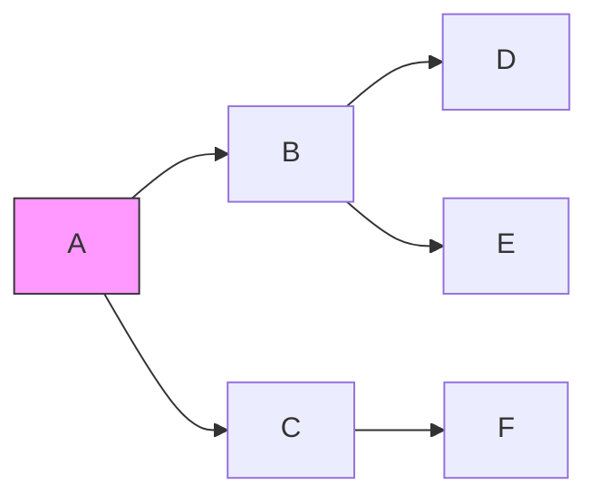
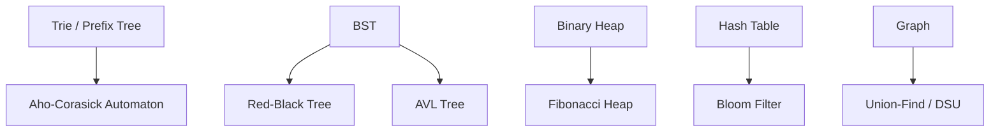
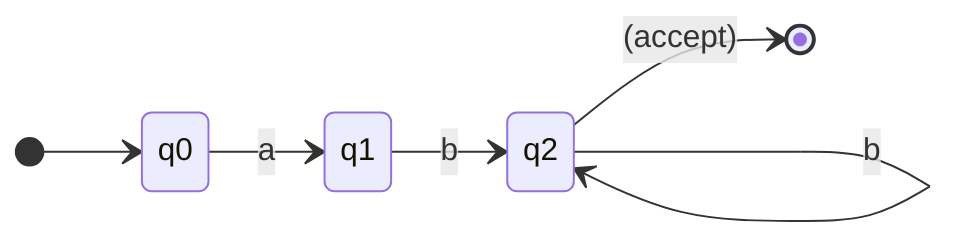
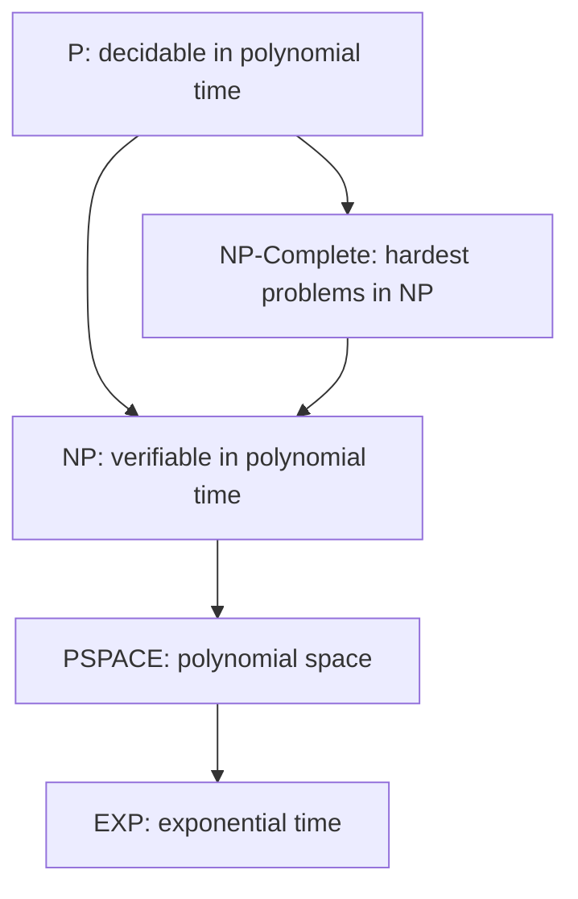

# Computer Science Roadmap — Universal Template

## Overview

| | Description |
|---|---|
| **Purpose** | Universal template for all Computer Science roadmap topics |
| **Files per topic** | 9 files: `junior.md`, `middle.md`, `senior.md`, `professional.md`, `interview.md`, `tasks.md`, `find-bug.md`, `optimize.md`, `specification.md` |
| **Language** | All content must be generated in **English** |

### Topic Structure

```
XX-topic-name/
├── junior.md          ← "What?" and "How?" — basic concepts, algorithms
├── middle.md          ← "Why?" and "When?" — deeper analysis
├── senior.md          ← "How to optimize?" — advanced algorithms
├── professional.md    ← Formal theory — proofs, complexity, computability
├── interview.md       ← Interview prep across all levels
├── tasks.md           ← Hands-on practice tasks
├── find-bug.md        ← Find and fix bugs in code (10+ exercises)
├── optimize.md        ← Optimize slow/inefficient code (10+ exercises)
└── specification.md   ← Official spec / documentation deep-dive
```

> Replace `{{TOPIC_NAME}}` with the specific Computer Science concept being documented.
> Each section below corresponds to one output file in the topic folder.

---

# TEMPLATE 1 — `junior.md`

## {{TOPIC_NAME}} — Junior Level

### What Is It?
Explain `{{TOPIC_NAME}}` in accessible terms. Computer Science is the study of
computation — what problems can be solved by algorithms, how efficiently, and with
what resources. Ground every concept in a concrete example before introducing
formal notation.

### Core Concept

```text
Problem: Find the largest number in a list.

Input:  [3, 1, 4, 1, 5, 9, 2, 6]
Output: 9

Algorithm (plain English):
  1. Start with the first element as the current maximum.
  2. For each remaining element, if it is greater than current max, update max.
  3. Return max.

This is O(n) time — we look at each element exactly once.
```

### Mental Model
- An **algorithm** is a precise, finite sequence of steps to solve a problem.
- **Data structures** organize data so algorithms can operate efficiently.
- `{{TOPIC_NAME}}` is important because: _[fill in]_.

### Key Terms
| Term | Definition |
|------|-----------|
| Algorithm | A finite, deterministic procedure to solve a problem |
| Data structure | A way of organizing data for efficient access and modification |
| Time complexity | How runtime grows as input size grows (Big-O notation) |
| Space complexity | How memory usage grows as input size grows |
| Recursion | A function that calls itself with a smaller sub-problem |
| Base case | The recursion stopping condition |

### Big-O Reference Table
| Notation | Name | Example |
|----------|------|---------|
| O(1) | Constant | Array index lookup |
| O(log n) | Logarithmic | Binary search |
| O(n) | Linear | Linear search |
| O(n log n) | Linearithmic | Merge sort |
| O(n²) | Quadratic | Bubble sort |
| O(2ⁿ) | Exponential | Brute-force subsets |
| O(n!) | Factorial | Brute-force permutations |

### Comparison with Alternatives
| Approach | Use Case | Trade-off |
|----------|---------|-----------|
| Array | Indexed access, cache-friendly | Fixed size or costly resize |
| Linked list | Frequent insertions/deletions | No O(1) random access |
| Hash table | Key-value lookup O(1) avg | Hash collisions, unordered |
| Binary search tree | Sorted data, range queries | O(n) worst if unbalanced |
| Heap | Priority queue, top-k | No arbitrary lookup |

### Common Mistakes at This Level
1. Confusing worst-case and average-case complexity.
2. Forgetting the base case in recursive algorithms → infinite recursion.
3. Assuming O(n²) is always bad — for small n (< 50), it is often fine.
4. Using a list when a set would give O(1) lookup instead of O(n).

### Hands-On Exercise
Implement binary search on a sorted integer array. Trace through the algorithm on
`[1, 3, 5, 7, 9, 11, 13]` searching for `7`. Count the number of comparisons and
verify it matches `ceil(log₂ n)`.

---

# TEMPLATE 2 — `middle.md`

## {{TOPIC_NAME}} — Middle Level

### Prerequisites
- Comfortable implementing common data structures (array, linked list, hash map, tree).
- Understands Big-O notation and can analyze simple algorithms.
- Has implemented sorting algorithms from scratch.

### Deep Dive: {{TOPIC_NAME}}

```text
Graph representation comparison:

Adjacency Matrix (n × n 2D array):
  - Space: O(n²)
  - Edge lookup: O(1)
  - Best for dense graphs (edges ≈ n²)

  Example: 4-node graph
     A  B  C  D
  A [0, 1, 0, 1]
  B [1, 0, 1, 0]
  C [0, 1, 0, 1]
  D [1, 0, 1, 0]

Adjacency List (array of linked lists):
  - Space: O(V + E)
  - Edge lookup: O(degree(v))
  - Best for sparse graphs

  A → [B, D]
  B → [A, C]
  C → [B, D]
  D → [A, C]
```

### Graph Traversal Algorithms



```text
BFS (Breadth-First Search) — explores level by level:
  Queue: [A]
  Visit A → enqueue B, C → Queue: [B, C]
  Visit B → enqueue D, E → Queue: [C, D, E]
  Visit C → enqueue F → Queue: [D, E, F]
  Visit D, E, F
  Order: A, B, C, D, E, F
  Use cases: shortest path (unweighted), level-order traversal

DFS (Depth-First Search) — explores as deep as possible first:
  Stack: [A]
  Visit A → push C, B → Stack: [C, B]
  Visit B → push E, D → Stack: [C, E, D]
  Visit D → Stack: [C, E]
  Visit E → Stack: [C]
  Visit C → push F → Stack: [F]
  Visit F
  Order: A, B, D, E, C, F
  Use cases: cycle detection, topological sort, connected components
```

### Dynamic Programming

```text
Principle: Optimal Substructure + Overlapping Subproblems

Fibonacci — naive recursion: O(2ⁿ)
  fib(5) calls fib(4) and fib(3)
  fib(4) calls fib(3) and fib(2)  ← fib(3) computed twice

Fibonacci — memoization: O(n) time, O(n) space
  Cache[3] = fib(3) computed once, reused everywhere

Fibonacci — bottom-up tabulation: O(n) time, O(1) space
  dp[0] = 0
  dp[1] = 1
  for i in 2..n: dp[i] = dp[i-1] + dp[i-2]
  return dp[n]
```

### Sorting Algorithm Comparison

```text
Algorithm     | Best    | Average  | Worst    | Space  | Stable?
--------------|---------|----------|----------|--------|--------
Merge Sort    | O(n lg n) | O(n lg n) | O(n lg n) | O(n)  | Yes
Quick Sort    | O(n lg n) | O(n lg n) | O(n²)    | O(lg n) | No
Heap Sort     | O(n lg n) | O(n lg n) | O(n lg n) | O(1)  | No
Tim Sort      | O(n)    | O(n lg n) | O(n lg n) | O(n)  | Yes
Counting Sort | O(n+k)  | O(n+k)   | O(n+k)   | O(k)  | Yes
```

### Middle Checklist
- [ ] Can trace through BFS/DFS on a whiteboard diagram.
- [ ] Can identify when a problem has optimal substructure (DP candidate).
- [ ] Knows when to use min-heap vs max-heap.
- [ ] Understands amortized analysis (e.g., dynamic array append is O(1) amortized).

---

# TEMPLATE 3 — `senior.md`

## {{TOPIC_NAME}} — Senior Level

### Responsibilities at This Level
- Select the right algorithm and data structure for production-scale constraints.
- Identify when a problem is NP-complete and choose approximation vs exact algorithms.
- Reason about cache behavior, memory layouts, and hardware-level performance.
- Teach algorithmic thinking to the team; lead technical design for data-intensive systems.

### Advanced Data Structures



```text
Union-Find (Disjoint Set Union) with path compression + union by rank:
  - Find: O(α(n)) amortized — effectively O(1) in practice
  - Union: O(α(n)) amortized
  - Application: Kruskal's MST, connected components, cycle detection

Bloom Filter:
  - Space-efficient probabilistic set membership
  - False positives possible, false negatives impossible
  - Application: database query cache hit check, spell checker, network dedup
```

### Advanced Graph Algorithms

```text
Dijkstra's Shortest Path:
  Time: O((V + E) log V) with binary heap
  Constraint: non-negative edge weights only
  Use: GPS routing, network packet routing

Bellman-Ford:
  Time: O(V × E)
  Handles: negative edge weights
  Detects: negative cycles
  Use: currency arbitrage detection, OSPF routing protocol

Floyd-Warshall (All-pairs shortest paths):
  Time: O(V³)
  Space: O(V²)
  Use: small dense graphs, transitive closure

A* Search:
  Time: O(E) in best case with good heuristic
  Uses: heuristic h(n) = estimated cost to goal
  h(n) must be admissible (never overestimates)
  Use: game pathfinding, robot navigation
```

### Amortized Analysis

```text
Dynamic Array (e.g., Python list, Java ArrayList):
  - Most append operations: O(1)
  - Occasional resize (double capacity): O(n) — copy all elements
  - Amortized cost per append: O(1)

  Proof (accounting method):
    Charge each element $3 on insertion.
    $1 pays for the insert itself.
    $2 is saved for the future copy when capacity doubles.
    When array of size n is copied, each element already saved $2 → total $2n saved covers O(n) copy.
```

### Senior Checklist
- [ ] Can reduce novel problems to known graph/DP formulations.
- [ ] Understands NP-completeness; knows the 21 NP-complete problems (Karp's reductions).
- [ ] Aware of cache-oblivious algorithms (e.g., cache-oblivious sort) for hardware efficiency.
- [ ] Knows when exact solutions are infeasible and can apply greedy approximations.

---

# TEMPLATE 4 — `professional.md`

## {{TOPIC_NAME}} — Theory and Formal Foundations

### Overview
This section covers the theoretical foundations of Computer Science: automata theory,
formal language proofs, NP-completeness reductions, and computational complexity classes.
These foundations explain _why_ certain problems are hard, which underpins every
architectural and algorithmic decision made in production systems.

### Automata Theory



```text
Finite Automata (DFA):
  - States: Q = {q0, q1, q2}
  - Alphabet: Σ = {a, b}
  - Transition function: δ: Q × Σ → Q
  - Start state: q0
  - Accept states: F = {q2}

  Recognized language: ab+ (one 'a' followed by one or more 'b's)

Chomsky Hierarchy:
  Type 0 (Recursively Enumerable) — Turing machines
  Type 1 (Context-Sensitive) — Linear-bounded automata
  Type 2 (Context-Free) — Pushdown automata, most programming languages
  Type 3 (Regular) — Finite automata, regex
```

### Computability — Church-Turing Thesis

```text
The Halting Problem is UNDECIDABLE.

Proof by contradiction (diagonal argument):
  Assume H(P, I) decides if program P halts on input I.
  Construct D(P):
    if H(P, P) says "halts" → D loops forever
    if H(P, P) says "loops" → D halts immediately

  Run D on itself: D(D)
    If H(D, D) = "halts" → D loops → contradiction
    If H(D, D) = "loops" → D halts → contradiction

  Therefore H cannot exist. ∎

Implications for software:
  - Static analysis tools (linters, verifiers) are inherently incomplete.
  - No algorithm can detect all infinite loops in arbitrary programs.
  - Rice's Theorem: any non-trivial semantic property of programs is undecidable.
```

### Complexity Classes



```text
P vs NP (the open problem):
  P = problems solvable in O(nᵏ) time for some constant k
  NP = problems where a YES certificate is verifiable in polynomial time

  NP-Complete: a problem X is NP-Complete if:
    1. X ∈ NP
    2. Every problem in NP reduces to X in polynomial time (NP-Hard)

  If any NP-Complete problem is in P, then P = NP.

Canonical NP-Complete problems (Karp's 21):
  - SAT (Boolean satisfiability) — Cook-Levin theorem, first proven NP-Complete
  - 3-SAT — each clause has exactly 3 literals
  - Vertex Cover
  - Hamiltonian Circuit
  - Traveling Salesman (decision version)
  - Knapsack (decision version)
  - Graph Coloring (3-coloring)
  - Subset Sum
```

### Formal Proof: Merge Sort Correctness

```text
Claim: Merge Sort correctly sorts array A[1..n].

Proof by strong induction on n:

Base case (n = 1): A single element is trivially sorted. ✓

Inductive step: Assume Merge Sort correctly sorts any array of size < n.
  Merge Sort splits A into A[1..⌊n/2⌋] and A[⌊n/2⌋+1..n].
  By inductive hypothesis, both halves are correctly sorted.
  The Merge procedure combines two sorted arrays into one sorted array
  by repeatedly selecting the smaller front element — this produces a
  correctly sorted array of size n.
  Therefore Merge Sort correctly sorts any array of size n. ∎

Time complexity recurrence:
  T(n) = 2T(n/2) + O(n)
  By Master Theorem (case 2): T(n) = O(n log n)
```

### NP-Completeness Reduction Example

```text
Reduction: 3-SAT ≤ₚ Vertex Cover

To show Vertex Cover is NP-Hard, we construct a polynomial-time reduction
from 3-SAT to Vertex Cover:

  For each variable xᵢ in the 3-SAT formula:
    Add an edge (xᵢ, ¬xᵢ) — one of them must be in the cover

  For each clause (l₁ ∨ l₂ ∨ l₃):
    Add a triangle: (l₁-l₂-l₃) — at least 2 of 3 must be in the cover

  The 3-SAT formula is satisfiable
    ⟺ the graph has a vertex cover of size k = n + 2m
       (n = variables, m = clauses)

This proves: if we can solve Vertex Cover in poly time, we can solve 3-SAT in poly time,
and since 3-SAT is NP-Hard, so is Vertex Cover.
```

---

# TEMPLATE 5 — `interview.md`

## {{TOPIC_NAME}} — Interview Questions

### Junior Interview Questions

**Q1: What is the difference between O(n log n) and O(n²) in practical terms?**
> For n = 1,000,000: O(n log n) ≈ 20,000,000 operations; O(n²) = 1,000,000,000,000.
> At 10⁹ operations/second, O(n log n) takes 0.02 s; O(n²) takes 1,000 s (~17 min).

**Q2: When would you use a hash map over a sorted array?**
> Hash map for O(1) average-case key lookup; sorted array for O(log n) binary search.
> Prefer hash map when you need fast exact lookups and don't need ordering. Prefer
> sorted array when you need range queries or sorted iteration.

**Q3: What is the difference between BFS and DFS?**
> BFS explores all neighbors at the current depth before going deeper (queue-based,
> finds shortest path in unweighted graphs). DFS explores as deep as possible first
> (stack/recursion, useful for cycle detection, topological sort, connectivity).

---

### Middle Interview Questions

**Q4: What is dynamic programming and how do you identify a DP problem?**
> DP breaks a problem into overlapping subproblems and stores their results to avoid
> recomputation. Identifying signals: optimal substructure (optimal solution uses
> optimal solutions to sub-problems) and overlapping subproblems (same sub-problem
> computed repeatedly in naive recursion).

**Q5: Explain amortized analysis with the dynamic array example.**
> Most appends are O(1). When the array doubles in size, it copies n elements — O(n).
> But this happens after n appends, so the cost is amortized: O(n) / n operations = O(1)
> per append. The potential method or accounting method formalizes this.

---

### Professional / Deep-Dive Questions

**Q6: Prove that the Halting Problem is undecidable.**
> Assume a decider H(P, I) exists. Construct D(P) that loops if H(P, P) = "halts"
> and halts if H(P, P) = "loops". Running D(D) gives a contradiction in both cases.
> Therefore H cannot exist. (Turing 1936, diagonal argument.)

**Q7: What is the Cook-Levin theorem and why does it matter?**
> Cook (1971) and Levin (1973) independently proved SAT is NP-Complete — it was the
> first problem proven NP-Hard, establishing the framework. It matters because any
> NP-Complete problem can be reduced to SAT, enabling SAT solvers (Z3, MiniSAT) to
> solve problems across diverse domains (hardware verification, planning, cryptanalysis).

---

# TEMPLATE 6 — `tasks.md`

## {{TOPIC_NAME}} — Practical Tasks

### Task 1 — Junior: Implement Core Data Structures
**Goal**: Implement a stack, queue, and singly linked list from scratch.

**Requirements**:
- `Stack<T>`: `push`, `pop`, `peek`, `isEmpty`, `size`.
- `Queue<T>`: `enqueue`, `dequeue`, `front`, `isEmpty`, `size`.
- `LinkedList<T>`: `append`, `prepend`, `delete(value)`, `contains`, `toArray`.
- All O(1) for push/pop/enqueue/dequeue.

**Acceptance Criteria**:
- [ ] All operations have correct time complexity.
- [ ] Edge cases handled: pop/dequeue on empty structure returns null or throws.
- [ ] Unit tests cover empty, one element, and many elements.

---

### Task 2 — Middle: Graph Algorithms
**Goal**: Implement BFS, DFS, and Dijkstra's shortest path.

**Requirements**:
- Represent graph as adjacency list.
- BFS: returns traversal order and shortest path between two nodes.
- DFS: detects cycles; returns topological sort for DAGs.
- Dijkstra: returns shortest distances from source to all nodes (non-negative weights).

**Acceptance Criteria**:
- [ ] BFS shortest path correct on unweighted directed graph.
- [ ] Dijkstra correct on weighted directed graph (test against known examples).
- [ ] Cycle detection correctly identifies directed cycles.
- [ ] Time complexities match specification: BFS/DFS O(V+E), Dijkstra O((V+E) log V).

---

### Task 3 — Senior: Optimization Problem
**Goal**: Solve the 0/1 Knapsack problem using both top-down memoization and bottom-up DP.

**Requirements**:
- Inputs: `items: {weight, value}[]`, `capacity: number`.
- Return: maximum total value and the set of selected items.
- Implement both approaches; profile time and space usage.
- Extend to the **fractional knapsack** greedy solution and compare correctness.

**Acceptance Criteria**:
- [ ] Both DP approaches produce the same optimal value.
- [ ] Fractional greedy produces correct result (fractional knapsack is greedily solvable).
- [ ] Tested on at least 3 examples including an edge case (capacity = 0).

---

### Task 4 — Professional: NP-Completeness Proof Exercise
**Goal**: Prove that Graph 3-Coloring is NP-Complete.

**Requirements**:
- Show 3-Coloring ∈ NP (certificate verification in polynomial time).
- Construct a polynomial-time reduction from 3-SAT to 3-Coloring.
- Write a formal proof document with the gadget construction diagram.
- Implement the reduction as code: given a 3-SAT instance, output a graph.

**Acceptance Criteria**:
- [ ] Written proof is logically correct and complete.
- [ ] Code reduction verified on small 3-SAT instances.
- [ ] Gadget diagram (Mermaid or graphviz) included.

---

# TEMPLATE 7 — `find-bug.md`

## {{TOPIC_NAME}} — Find the Bug

### Bug 1: Wrong Big-O Claim

```text
BUGGY ANALYSIS:

Function: find duplicates in array using nested loops.

Code:
  for i in 0..n:
    for j in i+1..n:
      if arr[i] == arr[j]: return (i, j)

Claimed complexity: O(n)   ← WRONG

Actual analysis:
  Outer loop: n iterations
  Inner loop: n - i - 1 iterations on average
  Total comparisons: n(n-1)/2 = O(n²)

Correct claim: O(n²) time, O(1) space
```

**Fix (actual O(n) solution):**
```text
Use a hash set:
  seen = empty set
  for each element x in arr:
    if x in seen: return x   ← O(1) average lookup
    seen.add(x)
  return null

Time: O(n) average (hash set operations O(1) amortized)
Space: O(n) for the hash set
Trade-off: O(n) space instead of O(1)
```

---

### Bug 2: Incorrect Recursive Algorithm

```text
BUGGY CODE: Recursive Fibonacci

fib(n):
  if n == 0: return 1   ← BUG: fib(0) should be 0
  if n == 1: return 1   ← correct
  return fib(n-1) + fib(n-2)

Produces: fib(0)=1, fib(1)=1, fib(2)=2, fib(3)=3 ...
Correct:  fib(0)=0, fib(1)=1, fib(2)=1, fib(3)=2 ...

The off-by-one in the base case shifts the entire sequence.
```

**Fix:**
```text
fib(n):
  if n == 0: return 0   ← correct base case
  if n == 1: return 1
  return fib(n-1) + fib(n-2)

Additional performance bug: exponential O(2ⁿ) time due to repeated subproblems.
Fix: add memoization cache → O(n) time, O(n) space.
```

---

### Bug 3: Off-by-One in Binary Search

```text
BUGGY CODE:

binarySearch(arr, target):
  lo = 0
  hi = arr.length   ← BUG: should be arr.length - 1

  while lo < hi:
    mid = (lo + hi) / 2
    if arr[mid] == target: return mid
    if arr[mid] < target: lo = mid + 1
    else: hi = mid    ← when hi = arr.length, hi = mid never reaches last element correctly

For arr = [1, 3, 5, 7], target = 7:
  lo=0, hi=4 → mid=2 → arr[2]=5 < 7 → lo=3
  lo=3, hi=4 → mid=3 → arr[3]=7 → return 3  (works by coincidence)

For arr = [1, 3], target = 3:
  lo=0, hi=2 → mid=1 → arr[1]=3 → return 1 (works)
  But hi=arr.length causes undefined access risk on some implementations.
```

**Fix:**
```text
binarySearch(arr, target):
  lo = 0
  hi = arr.length - 1   ← correct: index of last element

  while lo <= hi:        ← inclusive on both ends
    mid = lo + (hi - lo) / 2  ← avoids integer overflow vs (lo+hi)/2
    if arr[mid] == target: return mid
    if arr[mid] < target: lo = mid + 1
    else: hi = mid - 1
  return -1
```

---

# TEMPLATE 8 — `optimize.md`

## {{TOPIC_NAME}} — Optimization Guide

### Optimization 1: Complexity Reduction O(n²) → O(n log n)

**Problem**: Finding all pairs in an array with sum equal to target.

```text
Naive O(n²) approach:
  for i in 0..n:
    for j in i+1..n:
      if arr[i] + arr[j] == target: record pair

For n = 100,000: ~5 × 10⁹ operations → ~5 s at 10⁹ ops/s

O(n) approach using hash set:
  seen = {}
  for each x in arr:
    complement = target - x
    if complement in seen: record (complement, x)
    seen.add(x)

For n = 100,000: 100,000 operations → < 1 ms
Improvement: ~50,000x faster

O(n log n) approach using sorting:
  Sort the array (O(n log n))
  Use two pointers (lo, hi) → O(n)
  Total: O(n log n)
  Advantage over hash set: O(1) extra space
```

### Optimization 2: Cache-Friendly Data Layouts

```mermaid
graph LR
    subgraph Array of Structs AoS
        node1[x,y,z | x,y,z | x,y,z | ...]
    end
    subgraph Struct of Arrays SoA
        xs[x,x,x,x,...]
        ys[y,y,y,y,...]
        zs[z,z,z,z,...]
    end
```

```text
Array of Structs (AoS): [{x, y, z}, {x, y, z}, ...]
  - Good for accessing all fields of one element
  - Poor for SIMD: loading just x values skips over y, z

Struct of Arrays (SoA): { xs: [...], ys: [...], zs: [...] }
  - Good for vectorized (SIMD) operations over one field
  - Modern CPUs process 4–8 floats per instruction with SoA layout
  - Used in game engines, physics simulators, database columnar stores

Rule of thumb: if you process one field of many elements, prefer SoA.
If you process all fields of one element, prefer AoS.
```

### Optimization 3: Memoization vs Tabulation Trade-offs

```text
Top-Down Memoization:
  + Natural recursive structure
  + Only computes needed subproblems
  - Function call overhead
  - Risk of stack overflow for deep recursion (n > 10,000)

Bottom-Up Tabulation:
  + Iterative — no stack overflow risk
  + Better cache locality (sequential array access)
  + Can reduce space: often only last 1–2 rows needed

Space optimization example (Fibonacci):
  Naive DP: O(n) space for dp[] array
  Optimized: O(1) space — only prev and curr variables needed
```

### Optimization Summary Table
| Problem Type | Naive | Optimized | Technique |
|-------------|-------|-----------|-----------|
| Pair sum | O(n²) | O(n) | Hash set |
| Sorting | O(n²) | O(n log n) | Merge/Heap sort |
| Shortest path | O(V²) | O((V+E) log V) | Dijkstra + heap |
| LCS / Edit distance | O(2ⁿ) | O(nm) | DP tabulation |
| Top-k elements | O(n log n) | O(n log k) | Min-heap size k |
| Substring search | O(nm) | O(n+m) | KMP / Rabin-Karp |
---
---

# TEMPLATE 9 — `specification.md`

> **Focus:** Official documentation deep-dive — API reference, configuration schema, behavioral guarantees, and version compatibility.
>
> **Source:** Always cite the official documentation with direct section links.
> - Blockchain: https://bitcoin.org/bitcoin.pdf | https://ethereum.org/en/whitepaper/
> - Software Design/Architecture: https://refactoring.guru/design-patterns
> - Computer Science: https://en.wikipedia.org/wiki/List_of_data_structures
> - Software Architect: https://www.oreilly.com/library/view/fundamentals-of-software/9781492043447/
> - System Design: https://github.com/donnemartin/system-design-primer
> - MongoDB: https://www.mongodb.com/docs/manual/reference/
> - PostgreSQL: https://www.postgresql.org/docs/current/
> - API Design: https://swagger.io/specification/ (OpenAPI 3.x)
> - Backend: https://developer.mozilla.org/en-US/docs/Learn/Server-side
> - Elasticsearch: https://www.elastic.co/guide/en/elasticsearch/reference/current/
> - Redis: https://redis.io/docs/latest/commands/
> - Full-Stack: https://developer.mozilla.org/en-US/

<details open>
<summary><strong>Template Content</strong></summary>

# {{TOPIC_NAME}} — Specification

> **Official Documentation Reference**
>
> Source: [{{TOOL_NAME}} Official Docs]({{DOCS_URL}}) — {{SECTION}}

---

## Table of Contents

1. [Docs Reference](#docs-reference)
2. [API / Configuration Reference](#api--configuration-reference)
3. [Core Concepts & Rules](#core-concepts--rules)
4. [Schema / Options Reference](#schema--options-reference)
5. [Behavioral Specification](#behavioral-specification)
6. [Edge Cases from Official Docs](#edge-cases-from-official-docs)
7. [Version & Compatibility Matrix](#version--compatibility-matrix)
8. [Official Examples](#official-examples)
9. [Compliance Checklist](#compliance-checklist)
10. [Related Documentation](#related-documentation)

---

## 1. Docs Reference

| Property | Value |
|----------|-------|
| **Official Docs** | [{{TOOL_NAME}} Documentation]({{DOCS_URL}}) |
| **Relevant Section** | {{SECTION_NAME}} — {{SECTION_TITLE}} |
| **Version** | {{TOOL_VERSION}} |
| **Direct URL** | {{DOCS_URL}}/{{PATH}} |

---

## 2. API / Configuration Reference

> From: {{DOCS_URL}}/{{API_SECTION}}

### {{RESOURCE_OR_ENDPOINT_NAME}}

| Field / Parameter | Type | Required | Default | Description |
|------------------|------|----------|---------|-------------|
| `{{FIELD_1}}` | `{{TYPE_1}}` | ✅ | — | {{DESC_1}} |
| `{{FIELD_2}}` | `{{TYPE_2}}` | ❌ | `{{DEFAULT_2}}` | {{DESC_2}} |
| `{{FIELD_3}}` | `{{TYPE_3}}` | ❌ | `{{DEFAULT_3}}` | {{DESC_3}} |

---

## 3. Core Concepts & Rules

The official documentation defines these key rules for {{TOPIC_NAME}}:

### Rule 1: {{RULE_NAME}}

> *Docs: [{{DOCS_URL}}/{{SECTION}}]({{DOCS_URL}}/{{SECTION}}) — "{{DOC_QUOTE}}"*

{{RULE_EXPLANATION}}

```{{CODE_LANG}}
# ✅ Correct — follows official guidance
{{VALID_EXAMPLE}}

# ❌ Incorrect — violates official guidance
{{INVALID_EXAMPLE}}
```

### Rule 2: {{RULE_NAME}}

> *Docs: [{{DOCS_URL}}/{{SECTION}}]({{DOCS_URL}}/{{SECTION}})*

{{RULE_EXPLANATION}}

```{{CODE_LANG}}
{{CODE_EXAMPLE}}
```

---

## 4. Schema / Options Reference

| Option | Type | Allowed Values | Default | Docs |
|--------|------|---------------|---------|------|
| `{{OPT_1}}` | `{{TYPE_1}}` | `{{VALUES_1}}` | `{{DEFAULT_1}}` | [Link]({{URL_1}}) |
| `{{OPT_2}}` | `{{TYPE_2}}` | `{{VALUES_2}}` | `{{DEFAULT_2}}` | [Link]({{URL_2}}) |
| `{{OPT_3}}` | `{{TYPE_3}}` | `{{VALUES_3}}` | `{{DEFAULT_3}}` | [Link]({{URL_3}}) |

---

## 5. Behavioral Specification

### Normal Operation

{{NORMAL_OPERATION}}

### Performance Characteristics

| Operation | Time Complexity | Space | Notes |
|-----------|----------------|-------|-------|
| {{OP_1}} | {{TIME_1}} | {{SPACE_1}} | {{NOTES_1}} |
| {{OP_2}} | {{TIME_2}} | {{SPACE_2}} | {{NOTES_2}} |

### Error / Failure Conditions

| Error | Condition | Official Resolution |
|-------|-----------|---------------------|
| `{{ERROR_1}}` | {{COND_1}} | {{FIX_1}} |
| `{{ERROR_2}}` | {{COND_2}} | {{FIX_2}} |

---

## 6. Edge Cases from Official Docs

| Edge Case | Official Behavior | Reference |
|-----------|-------------------|-----------|
| {{EDGE_1}} | {{BEHAVIOR_1}} | [Docs]({{URL_1}}) |
| {{EDGE_2}} | {{BEHAVIOR_2}} | [Docs]({{URL_2}}) |
| {{EDGE_3}} | {{BEHAVIOR_3}} | [Docs]({{URL_3}}) |

---

## 7. Version & Compatibility Matrix

| Version | Change | Backward Compatible? | Notes |
|---------|--------|---------------------|-------|
| `{{VER_1}}` | {{CHANGE_1}} | {{COMPAT_1}} | {{NOTES_1}} |
| `{{VER_2}}` | {{CHANGE_2}} | {{COMPAT_2}} | {{NOTES_2}} |

---

## 8. Official Examples

### Example from Docs: {{EXAMPLE_TITLE}}

> Source: [{{DOCS_URL}}/{{ANCHOR}}]({{DOCS_URL}}/{{ANCHOR}})

```{{CODE_LANG}}
{{OFFICIAL_EXAMPLE_CODE}}
```

**Expected result:**

```
{{EXPECTED_RESULT}}
```

---

## 9. Compliance Checklist

- [ ] Follows official recommended patterns for {{TOPIC_NAME}}
- [ ] Uses supported version ({{TOOL_VERSION}}+)
- [ ] Handles all documented error conditions
- [ ] Follows official security recommendations
- [ ] Compatible with listed dependencies
- [ ] Configuration validated against official schema

---

## 10. Related Documentation

| Topic | Doc Section | URL |
|-------|-------------|-----|
| {{RELATED_1}} | {{SECTION_1}} | [Link]({{URL_1}}) |
| {{RELATED_2}} | {{SECTION_2}} | [Link]({{URL_2}}) |
| {{RELATED_3}} | {{SECTION_3}} | [Link]({{URL_3}}) |

---

> **Content Rules for `specification.md`:**
> - Always link directly to the relevant doc section (not just the homepage)
> - Use official examples from the documentation when available
> - Note breaking changes and deprecated features between versions
> - Include official security recommendations
> - Minimum 2 Core Rules, 3 Schema fields, 3 Edge Cases, 2 Official Examples

</details>
