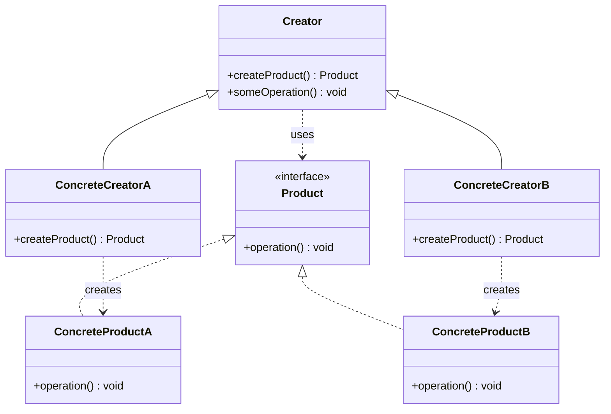
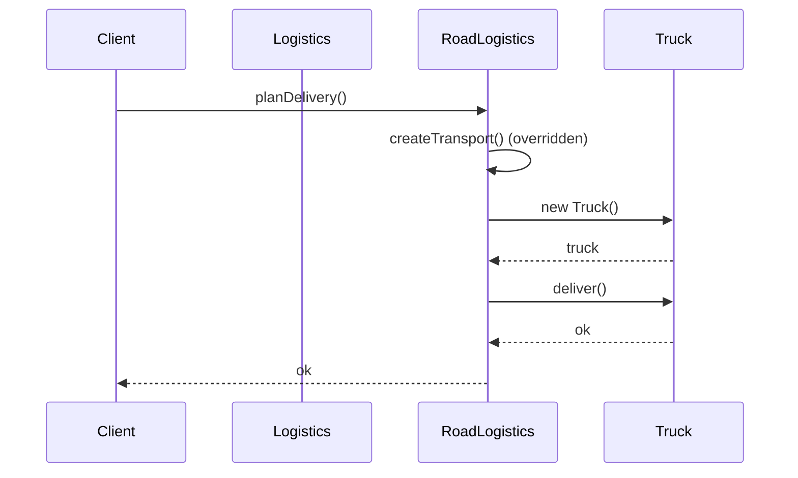

# Factory Method — Junior Level

> **Source:** [refactoring.guru/design-patterns/factory-method](https://refactoring.guru/design-patterns/factory-method)
> **Category:** [Creational](../README.md)

---

## Table of Contents

1. [Introduction](#introduction)
2. [Prerequisites](#prerequisites)
3. [Glossary](#glossary)
4. [Core Concepts](#core-concepts)
5. [Real-World Analogies](#real-world-analogies)
6. [Mental Models](#mental-models)
7. [Pros & Cons](#pros--cons)
8. [Use Cases](#use-cases)
9. [Code Examples](#code-examples)
10. [Coding Patterns](#coding-patterns)
11. [Clean Code](#clean-code)
12. [Best Practices](#best-practices)
13. [Edge Cases & Pitfalls](#edge-cases--pitfalls)
14. [Common Mistakes](#common-mistakes)
15. [Tricky Points](#tricky-points)
16. [Test Yourself](#test-yourself)
17. [Cheat Sheet](#cheat-sheet)
18. [Summary](#summary)
19. [Further Reading](#further-reading)
20. [Related Topics](#related-topics)
21. [Diagrams](#diagrams)

---

## Introduction

> Focus: **What is it?** and **How to use it?**

**Factory Method** is a creational design pattern that provides an interface for creating objects in a superclass, but **lets subclasses decide which class to instantiate**.

In one sentence: instead of `new ConcreteThing()`, your code calls a method like `createThing()` — and the subclass implementing that method decides what to actually create.

### Why this matters

Imagine writing a logistics app. Initially, you only ship by truck. Your code is full of `new Truck()`. Then the business expands to ships. Now you need to find every `new Truck()` and replace it with conditional logic. As you add planes, drones, etc., the conditionals balloon. **Factory Method** removes the `new` calls entirely — you call `createTransport()` and a `RoadLogistics` subclass returns a Truck while a `SeaLogistics` subclass returns a Ship.

The classic GoF problem statement: *"Define an interface for creating an object, but let subclasses decide which class to instantiate."*

---

## Prerequisites

- **Required:** Inheritance (extending a class).
- **Required:** Polymorphism — calling a method on a parent reference and getting subclass behavior.
- **Required:** Abstract methods / interfaces.
- **Helpful:** Familiarity with the term "concrete class" (a non-abstract, instantiable class).

---

## Glossary

| Term | Definition |
|------|-----------|
| **Product** | The interface or abstract class that all created objects implement. |
| **Concrete Product** | A specific implementation of `Product` (e.g., `Truck`, `Ship`). |
| **Creator** | The class declaring the factory method. Often abstract. |
| **Concrete Creator** | A subclass that overrides the factory method to return a specific Concrete Product. |
| **Factory Method** | The method declared in Creator, overridden in Concrete Creators, that returns a Product. |
| **Polymorphism** | Calling a method on a base class reference; the runtime picks the subclass implementation. |

---

## Core Concepts

### 1. The Factory Method itself

A method declared in the Creator class that returns a Product. The base class may have a default, or it may be abstract:

```
abstract class Creator { abstract Product createProduct(); }
```

### 2. Subclasses decide the concrete type

Each Concrete Creator overrides `createProduct()` to return its specific Product:

```
class TruckCreator extends Creator { Truck createProduct() { return new Truck(); } }
class ShipCreator  extends Creator { Ship  createProduct() { return new Ship(); } }
```

### 3. The Creator works with abstractions

The Creator's other methods use the abstract `Product` type:

```
void deliver() {
    Product p = createProduct();   // subclass decides
    p.transport();                 // polymorphism
}
```

The Creator doesn't know — and doesn't need to know — which concrete Product it got.

---

## Real-World Analogies

| Concept | Analogy |
|---|---|
| **Factory Method** | A pizza chain. Headquarters defines what a "pizza" is and how to deliver it. Each franchise (subclass) makes its own kind of pizza (Italian, Chicago-style). The chain doesn't care which — it just orders "pizza." |
| **Concrete Creator** | The Italian-style branch — when asked to make a pizza, it makes a Margherita. |
| **Product interface** | The contract: every pizza must be sliceable, eatable, and packaged. |
| **Refactoring.guru's analogy** | A software company has a training department. The company writes code; the training department produces programmers (the "product"). Adding a new branch (creator) = new training department style, same outcome. |

---

## Mental Models

**The intuition:** Move every `new X()` into a method called `createX()`. Override that method in subclasses to change which X is created. Everywhere else in the code that uses X, work through an interface — never the concrete class.

**Why this works:** The decision of "what to create" is moved to the subclass that knows the answer. The rest of the code is freed from caring.

```
Before:                          After:
class App {                      class App {
    void run() {                     abstract Transport createT();
        Transport t = new Truck();   void run() {
        t.deliver();                     Transport t = createT();
    }                                    t.deliver();
}                                    }
                                 }
                                 class RoadApp extends App {
                                     Transport createT() { return new Truck(); }
                                 }
                                 class SeaApp extends App {
                                     Transport createT() { return new Ship(); }
                                 }
```

---

## Pros & Cons

| Pros | Cons |
|---|---|
| Eliminates tight coupling between creator and concrete products | More classes to maintain — every product variation needs a new creator subclass |
| Adding new product types doesn't break existing code (Open/Closed) | Inheritance-heavy — Go and other composition-favoring languages prefer Simple Factory |
| Centralizes product creation in one place per creator | Indirection makes simple cases harder to read |
| Lets you swap product families by swapping the creator | Class explosion if products multiply rapidly |
| Plays well with Template Method (factory method called from a template step) | Hard to apply *after* the fact without breaking callers |

### When to use:
- You don't know the exact product types at compile time.
- You want users of your library to provide product variants by subclassing.
- You're building a framework with extension points.

### When NOT to use:
- You only have one product type.
- The creation logic is trivial (`return new T()`) — direct construction is fine.
- You're in Go/Rust where inheritance isn't idiomatic — use Simple Factory or Functional Options.

---

## Use Cases

- **Cross-platform UI toolkits** — `Application.createButton()` returns `WindowsButton` on Windows, `WebButton` in browsers.
- **Document editors** — `Application.createDocument()` returns `WordDocument`, `PDFDocument`, etc.
- **Logging frameworks** — `Logger.createAppender()` returns file/console/network appenders.
- **Game engines** — `Level.spawnEnemy()` returns level-specific enemy types.
- **ORM frameworks** — `Session.createQuery()` returns dialect-specific SQL builders.
- **Plugin systems** — third parties subclass to provide their own products.

---

## Code Examples

### Java — Classic Factory Method

```java
// Product interface
interface Transport {
    void deliver();
}

// Concrete products
class Truck implements Transport {
    public void deliver() { System.out.println("Delivering by land in a box."); }
}

class Ship implements Transport {
    public void deliver() { System.out.println("Delivering by sea in a container."); }
}

// Creator
abstract class Logistics {
    public abstract Transport createTransport();   // factory method

    public void planDelivery() {
        Transport t = createTransport();
        t.deliver();
    }
}

// Concrete creators
class RoadLogistics extends Logistics {
    public Transport createTransport() { return new Truck(); }
}

class SeaLogistics extends Logistics {
    public Transport createTransport() { return new Ship(); }
}

// Client
public class Demo {
    public static void main(String[] args) {
        Logistics logistics = pickLogistics(args[0]);
        logistics.planDelivery();
    }

    static Logistics pickLogistics(String env) {
        return env.equals("LAND") ? new RoadLogistics() : new SeaLogistics();
    }
}
```

**What it does:** `Logistics.planDelivery()` is generic — it calls `createTransport()` and uses the result. `RoadLogistics` returns `Truck`, `SeaLogistics` returns `Ship`. Adding `AirLogistics` requires only one new file.

---

### Python — Classic Factory Method

```python
from abc import ABC, abstractmethod

class Transport(ABC):
    @abstractmethod
    def deliver(self) -> str: ...

class Truck(Transport):
    def deliver(self) -> str: return "Delivering by land."

class Ship(Transport):
    def deliver(self) -> str: return "Delivering by sea."

class Logistics(ABC):
    @abstractmethod
    def create_transport(self) -> Transport: ...

    def plan_delivery(self) -> str:
        return self.create_transport().deliver()

class RoadLogistics(Logistics):
    def create_transport(self) -> Transport: return Truck()

class SeaLogistics(Logistics):
    def create_transport(self) -> Transport: return Ship()

# Client
if __name__ == "__main__":
    for L in (RoadLogistics(), SeaLogistics()):
        print(L.plan_delivery())
```

**Note:** Python doesn't *require* abstract base classes — the same pattern works with duck typing — but `ABC` makes the contract explicit and is recommended for any non-trivial design.

---

### Go — Simple Factory (the idiomatic alternative)

Go has no inheritance, so the classical Factory Method doesn't translate. Idiomatic Go uses a **Simple Factory function** that returns an interface:

```go
package transport

import "fmt"

type Transport interface {
    Deliver() string
}

type truck struct{}
func (truck) Deliver() string { return "Delivering by land in a box." }

type ship struct{}
func (ship) Deliver() string { return "Delivering by sea in a container." }

// Factory function — the Go-idiomatic Factory Method.
func New(kind string) (Transport, error) {
    switch kind {
    case "truck": return truck{}, nil
    case "ship":  return ship{}, nil
    default:      return nil, fmt.Errorf("unknown transport: %s", kind)
    }
}
```

```go
package main

import (
    "fmt"
    "transport"
)

func main() {
    t, err := transport.New("truck")
    if err != nil { panic(err) }
    fmt.Println(t.Deliver())
}
```

**Why Simple Factory?** Go favors composition + interfaces. The Simple Factory keeps the spirit of the pattern (callers don't `new Truck` directly) while staying idiomatic.

---

## Coding Patterns

### Pattern 1: Pure abstract factory method

```java
abstract class Creator { abstract Product create(); }
```

The base class has no default — every subclass must override.

### Pattern 2: Default implementation overridable

```java
class Creator { Product create() { return new DefaultProduct(); } }
```

Subclasses *may* override; the base class works on its own.

### Pattern 3: Parameterized factory method

```java
class Logistics {
    Transport create(String type) {
        return switch (type) {
            case "truck" -> new Truck();
            case "ship"  -> new Ship();
            default      -> throw new IllegalArgumentException(type);
        };
    }
}
```

This is the **Simple Factory** variant — common in practice, simpler than the GoF version. Loses the subclass-decides-type benefit but gains compactness.



---

## Clean Code

### Naming

| ❌ Bad | ✅ Good |
|---|---|
| `make()`, `build()` (ambiguous) | `createTransport()`, `createButton()` |
| `factory()` | `newTransport()` (Go), `createTransport()` (Java/Python) |
| `getNew()` | `create…()` consistently |

### Keep the factory method **focused**

```java
// ❌ Doing too much
Transport createTransport() {
    log("creating");
    Transport t = new Truck();
    metrics.inc("created");
    cache.put(t);
    return t;
}

// ✅ Just create
Transport createTransport() { return new Truck(); }
// Logging/metrics belong in the calling code.
```

---

## Best Practices

1. **Keep the factory method short.** Just instantiate and return — no business logic.
2. **Return the abstract type**, not the concrete one.
3. **Use Factory Method when callers should be able to subclass and override** the creation step. If they shouldn't, Simple Factory is enough.
4. **Document the factory method contract.** Subclassers need to know what valid Products look like.
5. **Don't expose the concrete creator's name** in public APIs. Callers should ask for "logistics," not "RoadLogistics."

---

## Edge Cases & Pitfalls

- **Returning null from the factory method** — callers must null-check, defeating polymorphism. Throw or use Optional/Result types.
- **Caching mistakes** — if the factory method is supposed to return a fresh object every call but a subclass caches, behavior can surprise (e.g., shared mutable state).
- **Constructor exceptions** — if the concrete product's constructor can throw, the factory method needs to handle or declare the exception.
- **Circular dependencies** — Creator depends on Product; if Product depends on Creator, you have a cycle. Common in plugin systems.

---

## Common Mistakes

1. **Calling `new ConcreteX()` outside the factory method.** Defeats the whole point.
2. **Type-checking the returned product.** `if (t instanceof Truck) ...` smells like the abstraction is wrong; products should be substitutable.
3. **Putting business logic in the factory method.** It's a constructor wrapper, not a business operation.
4. **One concrete creator with one product type.** If you only have one variant, you don't need Factory Method.
5. **Confusing Factory Method with Abstract Factory** — see [Abstract Factory](../02-abstract-factory/junior.md). Factory Method = one product. Abstract Factory = a family of products.

---

## Tricky Points

- **Factory Method vs Abstract Factory.** Factory Method has *one* factory method per Creator subclass, returning *one* Product type. Abstract Factory has *multiple* factory methods, returning a *family* of related products.
- **Factory Method and the constructor.** The factory method *replaces* the constructor in client code, but the concrete product's constructor still exists and runs internally.
- **Factory Method and DI.** A DI container is essentially a runtime-configured factory. In modern code, DI often replaces hand-written Factory Method.

---

## Test Yourself

1. What problem does Factory Method solve?
2. Who decides which Concrete Product to create — the Creator or the subclass?
3. Why doesn't the classical Factory Method translate to Go?
4. Name three real-world places where Factory Method appears.
5. What's the difference between Factory Method and Abstract Factory?

<details><summary>Answers</summary>

1. Tight coupling between code and concrete classes. Allows new product types without modifying existing code.
2. The subclass — `ConcreteCreatorA` returns `ConcreteProductA`, etc.
3. Go has no class inheritance. Idiomatic Go uses Simple Factory functions.
4. Cross-platform UI toolkits, document editors, logging frameworks (any of: ORM dialects, plugin systems, game engines).
5. Factory Method = one product per creator. Abstract Factory = a family of related products per creator.

</details>

---

## Cheat Sheet

```java
// Java
abstract class Creator { abstract Product create(); }
class CreatorA extends Creator { Product create() { return new ProductA(); } }
```

```python
# Python
class Creator(ABC):
    @abstractmethod
    def create(self) -> Product: ...
class CreatorA(Creator):
    def create(self) -> Product: return ProductA()
```

```go
// Go (Simple Factory)
func New(kind string) (Product, error) { /* switch and return */ }
```

---

## Summary

- Factory Method = **subclass decides which class to instantiate**.
- Built on **inheritance + polymorphism**.
- Removes `new ConcreteX()` from client code; replaces with `creator.create()`.
- In Go, use **Simple Factory** function returning an interface.
- Trade complexity (more classes) for flexibility (open/closed extensibility).

---

## Further Reading

- [refactoring.guru/design-patterns/factory-method](https://refactoring.guru/design-patterns/factory-method)
- GoF book, Chapter 3 — Factory Method.
- *Head First Design Patterns*, Chapter 4 — clear introduction.

---

## Related Topics

- **Next level:** [Factory Method — Middle](middle.md)
- **Sibling pattern:** [Abstract Factory](../02-abstract-factory/junior.md) — for families of products.
- **Often paired with:** [Template Method](../../03-behavioral/09-template-method/junior.md) — factory method is a step in the template.
- **Often evolves into:** [Builder](../03-builder/junior.md) — when product construction is multi-step.
- **Alternative:** [Prototype](../04-prototype/junior.md) — when copying is cheaper than creating.

---

## Diagrams



[← Singleton](../05-singleton/junior.md) · [Creational Patterns](../README.md) · [Roadmap](../../../README.md) · **Next:** [Factory Method — Middle](middle.md)
