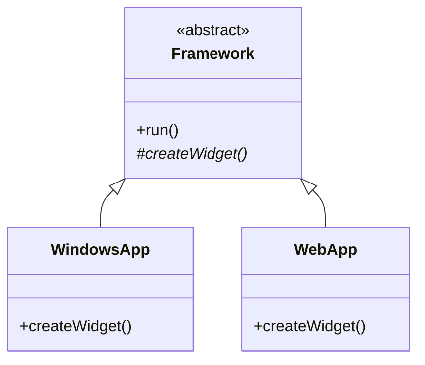

# Factory Method — Middle Level

> **Source:** [refactoring.guru/design-patterns/factory-method](https://refactoring.guru/design-patterns/factory-method)
> **Prerequisite:** [Junior](junior.md)
> **Focus:** **Why** and **When** — production tradeoffs, alternatives, refactoring.

---

## Table of Contents

1. [Introduction](#introduction)
2. [When to Use Factory Method](#when-to-use-factory-method)
3. [When NOT to Use Factory Method](#when-not-to-use-factory-method)
4. [Real-World Cases](#real-world-cases)
5. [Code Examples — Production-Grade](#code-examples--production-grade)
6. [Trade-offs](#trade-offs)
7. [Alternatives Comparison](#alternatives-comparison)
8. [Refactoring Toward and Away from Factory Method](#refactoring-toward-and-away-from-factory-method)
9. [Pros & Cons (Deeper)](#pros--cons-deeper)
10. [Edge Cases](#edge-cases)
11. [Tricky Points](#tricky-points)
12. [Best Practices](#best-practices)
13. [Summary](#summary)
14. [Related Topics](#related-topics)
15. [Diagrams](#diagrams)

---

## Introduction

> Focus: **Why** and **When**

You know how to write Factory Method. The middle-level question is: **does the problem actually need it?**

Factory Method is the right tool when *you don't yet know* which concrete class to instantiate, and the *decision is made by a subclass* (or framework caller). When the decision is made by configuration or runtime data, you usually want **Simple Factory** instead. When you have a *family* of products that must be consistent, you want **Abstract Factory**. When construction is multi-step, you want **Builder**. Factory Method is one specific point on a spectrum — knowing where it fits, and where it doesn't, is the senior interview signal.

This file maps that spectrum, shows real-world cases (UI toolkits, framework hooks, plugin systems), and walks through migrating an existing codebase from `new` calls to Factory Method.

---

## When to Use Factory Method

Use Factory Method when:

1. **You're building a framework or library** that callers extend by subclassing. The framework's algorithm calls `createX()`; the caller's subclass overrides it to provide their own X.
2. **The exact product type isn't known at compile time**, and the decision belongs to a subclass that *does* know.
3. **You want to externalize product creation** so it can be replaced (testing, alternative implementations) without touching the consuming code.
4. **You need polymorphic creation alongside polymorphic use.** The subclass that knows how to `useTransport()` is the same subclass that knows which `Transport` to create.

### Strong-fit examples

- Cross-platform UI: `WindowsApp.createButton()` → `WindowsButton`; `MacApp.createButton()` → `MacButton`.
- Document editors: `App.createDocument()` returns the dialect-specific document.
- Frameworks: Spring's `BeanFactory.getBean()`, JUnit's `@TestFactory` methods, Servlet's `Filter.init()`.
- Game engines: each level subclass overrides `spawnEnemy()`.

---

## When NOT to Use Factory Method

| Anti-pattern symptom | Better choice |
|---|---|
| Decision is by configuration / runtime data, not by subclass | **Simple Factory function** with a `switch` |
| You have multiple products that must come as a coordinated set | **Abstract Factory** |
| Construction has many optional steps | **Builder** |
| Copying an existing instance is cheaper than building | **Prototype** |
| You're in Go / Rust where inheritance isn't idiomatic | **Simple Factory + interfaces** |
| Only one product type ever | Just `new` it |
| The factory adds three abstraction layers for no reason | Direct instantiation |

### Strong-misfit examples

- A small CLI tool with one output format → just `new TextWriter()`.
- A function that creates a hash for a user ID → not a "product"; it's a value.
- Construction depends on a database row → that's a Repository, not a Factory.

---

## Real-World Cases

### 1. Cross-Platform UI

```java
abstract class Application {
    abstract Button createButton();   // factory method

    void renderToolbar() {
        Button save = createButton();
        save.setLabel("Save");
        save.render();
    }
}

class WindowsApp extends Application {
    Button createButton() { return new WindowsButton(); }
}

class WebApp extends Application {
    Button createButton() { return new HtmlButton(); }
}
```

`renderToolbar()` is identical in both subclasses — only the button type differs. This is the canonical Factory Method use case.

### 2. Spring `FactoryBean`

Spring's `FactoryBean<T>` interface is essentially a Factory Method:

```java
public interface FactoryBean<T> {
    T getObject() throws Exception;       // factory method
    Class<?> getObjectType();
    boolean isSingleton();
}
```

Bean classes that need complex construction implement `FactoryBean`; Spring calls `getObject()` to wire dependencies.

### 3. JUnit 5 `@TestFactory`

```java
@TestFactory
Stream<DynamicTest> tests() {
    return Stream.of(
        DynamicTest.dynamicTest("addition", () -> assertEquals(4, 2 + 2)),
        DynamicTest.dynamicTest("subtraction", () -> assertEquals(0, 2 - 2))
    );
}
```

`DynamicTest.dynamicTest(...)` is a static factory method returning the canonical product. JUnit's framework calls each.

### 4. Plugin Systems

```python
class PluginHost:
    def load(self, plugin_class):
        plugin = plugin_class.create_instance()   # plugin's factory method
        plugin.run()

# Plugin author:
class MyPlugin(Plugin):
    @classmethod
    def create_instance(cls):
        return cls(config=load_config())
```

The host doesn't know plugin-specific construction; the plugin's classmethod knows.

### 5. ORM Dialect-Aware Queries

```java
abstract class Database {
    abstract QueryBuilder createQueryBuilder();   // factory method

    public List<Row> select(String table) {
        return createQueryBuilder().select("*").from(table).execute();
    }
}

class PostgresDb extends Database {
    QueryBuilder createQueryBuilder() { return new PostgresQueryBuilder(); }
}

class MySqlDb extends Database {
    QueryBuilder createQueryBuilder() { return new MySqlQueryBuilder(); }
}
```

Same `select()` method works against any DB; the dialect-specific builder is provided by Factory Method.

---

## Code Examples — Production-Grade

### Java — Configurable Logger Backend

```java
public abstract class LoggerFactory {
    public abstract Appender createAppender();

    public Logger getLogger(String name) {
        return new Logger(name, createAppender());
    }

    public static LoggerFactory pick(String env) {
        return switch (env) {
            case "prod"  -> new JsonLoggerFactory();
            case "dev"   -> new ConsoleLoggerFactory();
            default      -> new NoopLoggerFactory();
        };
    }
}

class JsonLoggerFactory extends LoggerFactory {
    public Appender createAppender() {
        return new JsonAppender(System.out);
    }
}

class ConsoleLoggerFactory extends LoggerFactory {
    public Appender createAppender() {
        return new ConsoleAppender(System.out, true);   // colorized
    }
}
```

**Notes:**
- `pick()` is a *static* helper that returns the right Factory — this is "Factory of Factories," common in real code.
- Each `LoggerFactory` instance is independent — different parts of the app can use different factories.
- New environments add new subclasses, no modification to existing.

### Python — Async Database Connector

```python
from abc import ABC, abstractmethod
from typing import AsyncContextManager
import asyncpg, aiomysql

class DbConnection(ABC):
    @abstractmethod
    async def execute(self, sql: str, *args) -> list[dict]: ...

class PgConnection(DbConnection):
    def __init__(self, conn): self.conn = conn
    async def execute(self, sql, *args):
        return [dict(r) for r in await self.conn.fetch(sql, *args)]

class MySqlConnection(DbConnection):
    def __init__(self, conn): self.conn = conn
    async def execute(self, sql, *args):
        async with self.conn.cursor() as cur:
            await cur.execute(sql, args)
            return [dict(zip([c[0] for c in cur.description], r))
                    for r in await cur.fetchall()]

class DbDriver(ABC):
    @abstractmethod
    async def open(self) -> DbConnection: ...   # factory method

class PgDriver(DbDriver):
    def __init__(self, dsn: str): self.dsn = dsn
    async def open(self) -> DbConnection:
        return PgConnection(await asyncpg.connect(self.dsn))

class MySqlDriver(DbDriver):
    def __init__(self, **kw): self.kw = kw
    async def open(self) -> DbConnection:
        conn = await aiomysql.connect(**self.kw)
        return MySqlConnection(conn)

# Client
async def fetch_users(driver: DbDriver):
    conn = await driver.open()
    return await conn.execute("SELECT * FROM users")
```

The `fetch_users` function is dialect-agnostic. Each `DbDriver` subclass provides its `open()` factory method.

### Go — Simple Factory + Interface (the idiomatic equivalent)

```go
package storage

import (
    "context"
    "fmt"
)

type Store interface {
    Get(ctx context.Context, key string) ([]byte, error)
    Put(ctx context.Context, key string, val []byte) error
}

// Constructor functions — each is a tiny factory.
func NewMemory() Store { /* ... */ }
func NewS3(bucket string) Store { /* ... */ }
func NewRedis(addr string) Store { /* ... */ }

// Dispatcher (the "factory of factories").
func New(kind string, args ...any) (Store, error) {
    switch kind {
    case "memory":
        return NewMemory(), nil
    case "s3":
        bucket, _ := args[0].(string)
        return NewS3(bucket), nil
    case "redis":
        addr, _ := args[0].(string)
        return NewRedis(addr), nil
    default:
        return nil, fmt.Errorf("unknown store: %s", kind)
    }
}
```

Go-style: tiny constructor functions plus a top-level dispatcher. Replaces inheritance with composition + interfaces.

---

## Trade-offs

| Dimension | Factory Method | Simple Factory | Direct `new` |
|---|---|---|---|
| **Flexibility (extensibility)** | High — new subclass | Medium — modify the switch | None |
| **Code volume** | High (more classes) | Low | Lowest |
| **Open/Closed compliance** | Yes | No | No |
| **Testability** | High (mock subclass) | Medium | Low |
| **Discoverability** | Medium (need to find subclass) | High (one switch) | Highest |
| **Suits Go / Rust** | Poorly | Well | Well |

**Rule of thumb:** Use Factory Method when the *caller* of your library will subclass to extend. Use Simple Factory when *you* control all the variants. Use direct `new` when there's only one variant ever.

---

## Alternatives Comparison

### vs Simple Factory

- **Simple Factory:** A function/method takes a parameter and returns a Product. One method, many products via `switch`.
- **Factory Method:** A method per Creator subclass. New product = new subclass.

Simple Factory is **easier**; Factory Method is **more extensible**.

### vs Abstract Factory

- **Factory Method:** One creator method per Creator subclass; one product per call.
- **Abstract Factory:** Multiple creator methods (e.g., `createButton()`, `createCheckbox()`); a *family* of products that must match (e.g., all Windows-style or all Mac-style).

Abstract Factory is "Factory Method × N" with a family-consistency guarantee.

### vs Builder

- **Factory Method:** Single-step instantiation; subclass picks the type.
- **Builder:** Multi-step construction with optional parameters; the type is fixed (or chosen at the end).

Use Builder when products have many optional fields. Use Factory Method when products are simple but the *type* varies.

### vs Prototype

- **Factory Method:** Create a fresh object; subclass decides class.
- **Prototype:** Clone an existing object; class doesn't matter at the call site.

Prototype is preferable when construction is expensive but cloning is cheap.

### vs DI Container

- **Factory Method:** Compile-time class hierarchy.
- **DI:** Runtime configuration.

Modern enterprise code often replaces hand-written Factory Method with DI container bindings. The container *is* the factory.

---

## Refactoring Toward and Away from Factory Method

### Toward — Replace `new` with Factory Method

You have:

```java
class App {
    void run() {
        Button b = new WindowsButton();
        b.render();
    }
}
```

Step 1 — Make `App` abstract; introduce `createButton()`:

```java
abstract class App {
    abstract Button createButton();
    void run() {
        Button b = createButton();
        b.render();
    }
}
```

Step 2 — Move existing concrete logic into a subclass:

```java
class WindowsApp extends App {
    Button createButton() { return new WindowsButton(); }
}
```

Step 3 — Update callers to instantiate the right subclass.

### Away — When Factory Method is Overkill

You inherited code with three subclasses, all returning the same type, all the same way:

```java
class A1 extends App { Button create() { return new B1(); } }
class A2 extends App { Button create() { return new B2(); } }
class A3 extends App { Button create() { return new B3(); } }
```

Collapse to:

```java
class App {
    Button create(String kind) {
        return switch (kind) {
            case "1" -> new B1();
            case "2" -> new B2();
            case "3" -> new B3();
            default -> throw new IllegalArgumentException();
        };
    }
}
```

A switch is fine when the variant set is small, fixed, and won't be extended by users of your code.

---

## Pros & Cons (Deeper)

### Pros at scale

| Pro | Real significance |
|---|---|
| Open/Closed compliance | Adding new variants doesn't break existing code |
| Single Responsibility — creation logic centralized | One file per variant |
| Mockable in tests | Override `create()` to return mocks |
| Decouples client from concrete class | Swap implementations transparently |
| Plays well with frameworks | Common framework hook pattern |

### Cons at scale

| Con | Real significance |
|---|---|
| Class explosion | One creator + one product per variant — multiplies fast |
| Indirection cost | New developers must follow `creator → create() → concrete` chain |
| Inheritance lock-in | Hard to switch to composition once committed |
| Doesn't solve cross-product consistency | If you need a *family*, use Abstract Factory |
| Doesn't translate to Go/Rust idioms | Use Simple Factory there |

---

## Edge Cases

### 1. Constructor exceptions

If a Concrete Product's constructor can throw (e.g., DB connection failures), the factory method must handle or propagate.

```java
@Override
Connection createConnection() throws SQLException {
    return DriverManager.getConnection(url);
}
```

Make the contract clear: does `createX()` throw, return null, or return an Optional?

### 2. Null returns

Don't. Use Optional, throw, or return a Null Object pattern.

```java
// ❌
Transport createTransport() { return null; }

// ✅
Transport createTransport() {
    if (...) return new Truck();
    throw new IllegalStateException("no transport configured");
}
```

### 3. Diamond inheritance (Java doesn't have, but Python does)

If a Concrete Creator subclass inherits from two Creator hierarchies, MRO determines which `create()` is called. Avoid by using composition or `super()` carefully.

### 4. Generic type erasure

Java generics are erased at runtime, so:

```java
abstract class Creator<T> { abstract T create(); }
```

…can't recover `T` for reflection. Pass a `Class<T>` if needed.

### 5. Caching and identity

If subclasses cache, callers may receive the same object across calls — surprising if they expect a fresh one. Document the contract.

---

## Tricky Points

- **Factory Method is about *instantiation*, not *configuration*.** Don't push business logic into it.
- **Subclassing for testing** is a use case but also a smell — prefer DI for testable creation.
- **In strongly-typed languages with generics**, type-parameterizing the Creator (`Creator<T>`) is tempting but adds complexity. Use only when the parameterization is real (e.g., a `RepositoryFactory<User>`).
- **In Python**, classes are first-class objects — passing a class as an argument is a one-liner that often replaces both Factory Method and Simple Factory:

```python
def make(cls, *args): return cls(*args)
make(Truck)   # vs an entire Factory hierarchy
```

This idiom is sometimes called "the simplest factory." Use when classes have uniform constructors.

---

## Best Practices

1. **Name the method consistently** — `create…()` (Java/Python) or `New…()` (Go) — don't mix `make`, `build`, `factory`, `get`.
2. **Return the abstract type**, not the concrete one. The whole point is decoupling.
3. **Keep the factory method short** — one or two lines.
4. **Document the subclass contract** — "Subclasses must override `createX()` to return a non-null `X`."
5. **Don't expose concrete creator classes in public APIs** — return the abstract type.
6. **Consider DI before writing your own Factory hierarchy** — the container is often the better factory.
7. **In Go**, prefer Simple Factory functions (`NewX(...)`); reach for embedded interfaces only when you need polymorphic creation.

---

## Summary

- Factory Method = subclass decides which class to create.
- Used in **frameworks, plugin systems, cross-platform UIs**.
- Compete patterns: **Simple Factory** (less ceremony), **Abstract Factory** (family of products), **Builder** (multi-step), **Prototype** (clone), **DI** (runtime config).
- In Go/Rust, prefer Simple Factory over inheritance-based Factory Method.
- Refactor toward Factory Method when callers will extend; away when there's only one variant.

---

## Related Topics

- **Next:** [Factory Method — Senior](senior.md) — generics, concurrency, large-scale design.
- **Sibling:** [Abstract Factory](../02-abstract-factory/junior.md), [Builder](../03-builder/junior.md), [Prototype](../04-prototype/junior.md).
- **Companion:** [Template Method](../../03-behavioral/09-template-method/junior.md).

---

## Diagrams

### Refactoring `new` → Factory Method


### Family of Frameworks



[← Junior](junior.md) · [Creational](../README.md) · [Roadmap](../../../README.md) · **Next:** [Senior](senior.md)
