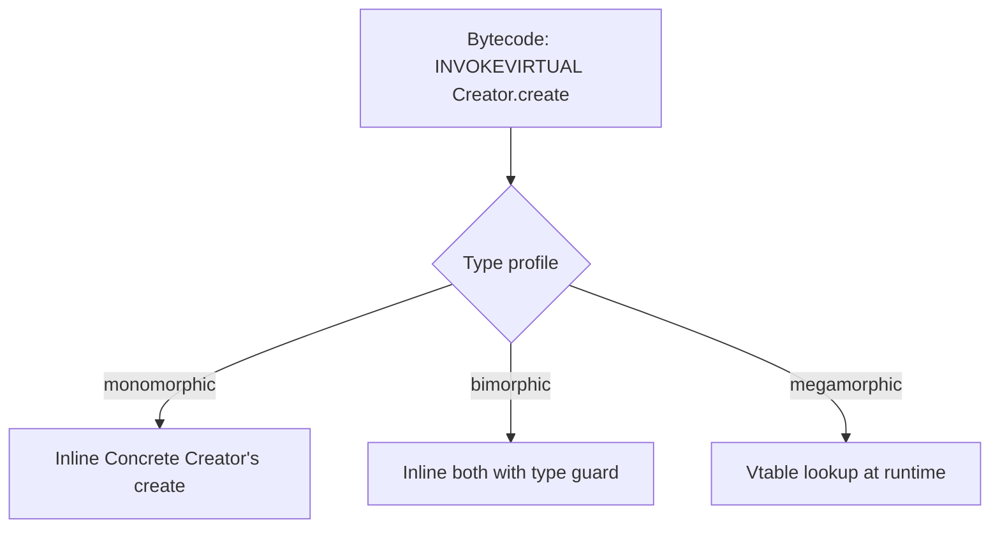
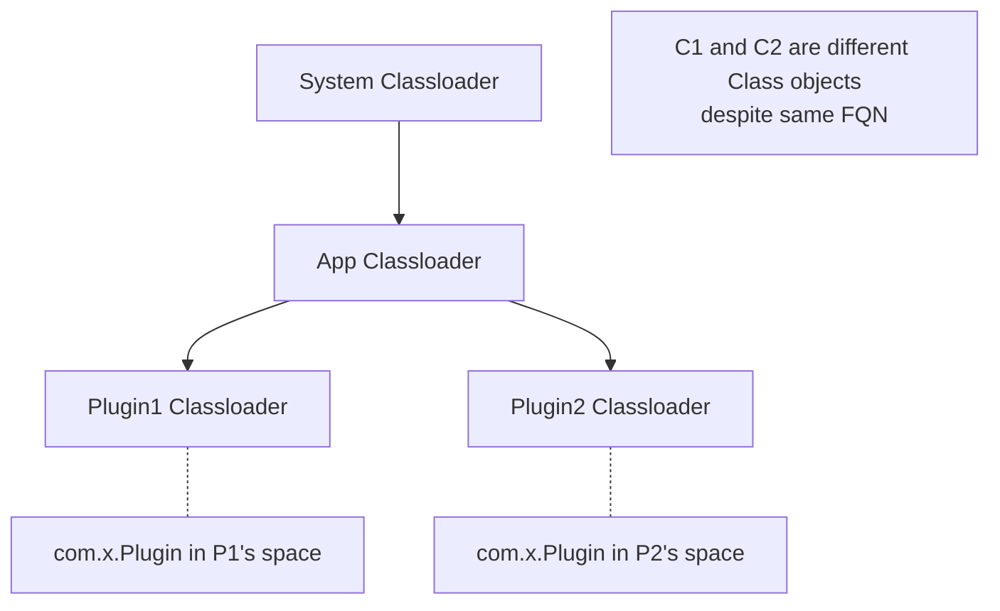
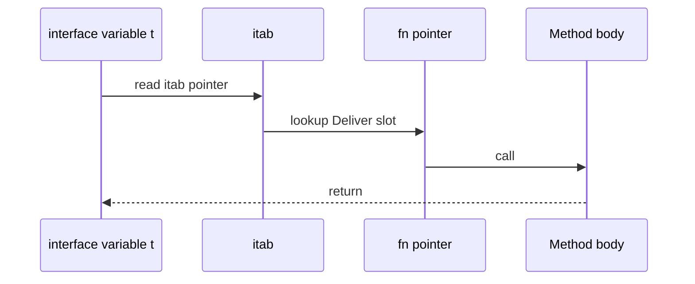

# Factory Method — Professional Level

> **Source:** [refactoring.guru/design-patterns/factory-method](https://refactoring.guru/design-patterns/factory-method)
> **Prerequisites:** [Junior](junior.md) · [Middle](middle.md) · [Senior](senior.md)
> **Focus:** **Under the hood** — runtime, compiler, JIT, classloading.

---

## Table of Contents

1. [Introduction](#introduction)
2. [Virtual Dispatch Cost](#virtual-dispatch-cost)
3. [JIT Inlining of Factory Methods](#jit-inlining-of-factory-methods)
4. [Java Generics Erasure & Factories](#java-generics-erasure--factories)
5. [Reflection-Based Factories](#reflection-based-factories)
6. [Classloading & Plugin Loading](#classloading--plugin-loading)
7. [Go Method Tables & Interface Dispatch](#go-method-tables--interface-dispatch)
8. [Python: `__call__` and Metaclass Factories](#python-__call__-and-metaclass-factories)
9. [Memory Profile of Factory Hierarchies](#memory-profile-of-factory-hierarchies)
10. [Native Code Generation](#native-code-generation)
11. [Benchmarks](#benchmarks)
12. [Diagrams](#diagrams)
13. [Related Topics](#related-topics)

---

## Introduction

> Focus: **what really happens** in the runtime when `creator.create()` is called.

Factory Method is a runtime indirection. At the professional level, you should be able to:

- Explain the cost of virtual dispatch on x86 vs ARM, before and after JIT.
- Trace `creator.create()` through HotSpot's inlining cache.
- Explain why Java generics make some factory designs impossible at runtime.
- Describe how plugin classloaders interact with Factory Method registries.
- Compare Python metaclass factories with Java reflection factories at the bytecode level.

This file goes deep — expect bytecode, source pointers, and benchmark numbers.

---

## Virtual Dispatch Cost

### Java HotSpot

A Factory Method call compiles to:

```
ALOAD     creator
INVOKEVIRTUAL Creator.create:()LProduct;
```

`INVOKEVIRTUAL` looks up the method in the **vtable** at the offset for `create`. On a cold call site:

- Vtable lookup: ~3-5 cycles (cached after first).
- Method dispatch: ~5-10 cycles.

Total: ~10-15 cycles ≈ 3-5 ns.

After JIT, if the call site is **monomorphic** (only one Concrete Creator ever observed), HotSpot inlines the body:

```
// Before (bytecode)
INVOKEVIRTUAL Creator.create
ASTORE p
ALOAD p
INVOKEVIRTUAL Product.use

// After JIT (virtually compiled)
NEW ConcreteProduct
DUP
INVOKESPECIAL <init>
ASTORE p
INVOKEVIRTUAL Product.use   // may also inline
```

Cost drops to **~1-2 ns** — close to a direct `new`.

If the call site is **bimorphic** (two Concrete Creators), HotSpot inlines both with a guard:

```
if (creator.class == ConcreteCreatorA) {
    /* inlined A.create() */
} else if (creator.class == ConcreteCreatorB) {
    /* inlined B.create() */
} else {
    /* fall back to vtable */
}
```

If the call site is **megamorphic** (3+ Concrete Creators), HotSpot uses the vtable. The cost rises back to ~3-5 ns.

### Implication

For a hot Factory Method call site, **fewer Concrete Creators = better JIT**. A registry of 50 factories in a hot path won't see inlining.

---

## JIT Inlining of Factory Methods

HotSpot's `-XX:+PrintInlining` reveals what gets inlined:

```
@ 5   Logistics::planDelivery (15 bytes) inline (hot)
  @ 1 Logistics::createTransport (5 bytes) virtual call (megamorphic)
```

`virtual call` here means HotSpot couldn't inline because the call site sees too many Concrete Creators.

**Optimization:** if you know one creator dominates production:

- Make it the only one in production code paths.
- Tests can use mock creators — they won't pollute the JIT profile of production-hot code.

### `@HotSpotIntrinsicCandidate` and bimorphism

Internal JDK methods often hint at the inlining behavior. Modern HotSpot's **type profiling** can collapse bimorphic call sites if usage skews 99% to one type.

### GraalVM and Native Image

GraalVM AOT (Native Image) requires **closed-world assumption** — all types must be known at build time. Factory Method works fine, but **plugin systems with `ServiceLoader`** require explicit configuration:

```json
{ "interfaces": ["com.example.PluginFactory"], "allDeclaredConstructors": true }
```

Without this, plugin discovery fails at runtime.

---

## Java Generics Erasure & Factories

```java
public abstract class Repository<T> {
    public abstract T create();   // returns T
}
```

At runtime, `T` is erased to `Object`. The bytecode is:

```
public abstract create()Ljava/lang/Object;
```

Plus a synthetic bridge method in concrete subclasses.

### What this breaks

```java
public class UserRepo extends Repository<User> {
    public User create() { return new User(); }
}

// Caller
UserRepo r = new UserRepo();
User u = r.create();   // bridge method casts Object to User
```

But:

```java
public abstract class Repository<T> {
    public abstract T create(Class<T> type);   // need Class<T> for runtime!
}
```

Because `T` is erased, you can't `new T()` at runtime. You need either:
- The `Class<T>` (passed explicitly).
- A `Supplier<T>` (the factory itself, passed in).

### Workaround — TypeToken

Guava and Jackson use `TypeToken<T>` (the "super-type token" trick):

```java
abstract class TypeToken<T> {
    Type type;
    TypeToken() {
        Type superclass = getClass().getGenericSuperclass();
        type = ((ParameterizedType) superclass).getActualTypeArguments()[0];
    }
}

new TypeToken<List<User>>() {}.type   // recovers List<User>
```

Used to recover generic info from anonymous subclasses.

### Implication

Java Factory Method with generics often requires extra `Class<T>` parameters. Kotlin's `reified` types and Scala's `TypeTag` give cleaner alternatives.

---

## Reflection-Based Factories

Common pattern: factory looks up class by name and instantiates:

```java
public class ReflectionFactory {
    public static Object create(String className) throws Exception {
        Class<?> c = Class.forName(className);
        return c.getDeclaredConstructor().newInstance();
    }
}
```

### Cost

| Operation | Cost |
|---|---|
| `Class.forName` (first time) | ~10-50 µs (loads class) |
| `Class.forName` (cached) | ~50-200 ns |
| `getDeclaredConstructor()` | ~50-100 ns |
| `newInstance()` | ~200-500 ns (vs ~5-10 ns for direct `new`) |

**~50× slower** than direct construction.

### Mitigation — `MethodHandle`

Java 7+ gives `MethodHandle` for faster reflective calls:

```java
MethodHandle mh = MethodHandles.lookup()
    .findConstructor(Foo.class, MethodType.methodType(void.class));
Foo f = (Foo) mh.invoke();   // ~10-20 ns after JIT warmup
```

Used by record canonical constructors, `var` inference, and many JDK 17+ libraries internally.

### Mitigation — `LambdaMetafactory`

Even faster: convert a constructor to a `Supplier<T>`:

```java
Supplier<Foo> s = (Supplier<Foo>) LambdaMetafactory.metafactory(
    lookup, "get",
    MethodType.methodType(Supplier.class),
    MethodType.methodType(Object.class),
    constructorMH,
    MethodType.methodType(Foo.class)
).getTarget().invoke();

Foo f = s.get();   // ~5 ns (essentially direct call)
```

This is how modern bytecode-emitting libraries (ByteBuddy, ASM-generated code) achieve direct-call performance for dynamic factories.

### Use cases

- Dependency injection containers.
- Serialization frameworks (Jackson, Gson).
- Plugin loaders that don't know plugin classes at compile time.

---

## Classloading & Plugin Loading

In a JVM, each `Class<?>` is associated with a **classloader**. Plugin systems often use a child classloader per plugin:

```java
URL[] urls = {pluginJar.toURI().toURL()};
URLClassLoader pluginCL = new URLClassLoader(urls, parent);
Class<?> factoryClass = pluginCL.loadClass("com.plugin.PluginFactory");
PluginFactory factory = (PluginFactory) factoryClass.getDeclaredConstructor().newInstance();
```

### Implications

1. **Multiple classloaders → multiple `Class<?>` objects for the same class.** A static field in `Logger` (e.g., a Singleton) is **per-classloader**.
2. **`instanceof` may fail across classloaders.** A `Plugin` loaded by `pluginCL` is *not* an `instanceof Plugin` in the parent classloader unless the parent loads `Plugin` first.
3. **Memory leak risk:** plugin classes hold references to the plugin classloader. If the host retains plugin objects after unload, the entire plugin classloader (with all its classes) leaks. Use `WeakReference` or `Cleaner` to detect this.

### Plugin reload

To reload a plugin:
1. Drop all references to plugin objects.
2. Drop the plugin classloader.
3. Wait for GC (or trigger it).
4. Verify the classloader is collected (use `WeakReference` + `Reference.poll()`).
5. Re-create with new classloader.

### Hot-swap idioms

OSGi, JBoss Modules, and JPMS each have their own approach. They all rely on **classloader isolation** + **explicit dependency declarations**.

---

## Go Method Tables & Interface Dispatch

Go interfaces are implemented via **interface tables (itabs)**:

```
interface variable = (itab pointer, data pointer)

itab = (
    interface type metadata
    concrete type metadata
    function pointers for each method
)
```

When you call `t.Deliver()` where `t` is an interface variable:

1. Load itab from `t`.
2. Look up `Deliver` in the itab's function pointer slot.
3. Call through the pointer.

Cost: ~2-5 ns (one extra indirection vs a direct call).

### Inlining

Go's compiler can inline interface calls **only if** it can prove the concrete type at the call site. For Factory Method patterns:

```go
t, _ := transport.New("truck")  // returns Transport interface
t.Deliver()                     // not inlined — type is dynamic
```

The compiler doesn't trace through `New` to figure out the concrete type. So Go interface calls in factory-style code rarely inline.

### Devirtualization in Go 1.21+

Recent Go versions can devirtualize when the type *is* known:

```go
truck := &Truck{}
var t Transport = truck
t.Deliver()                     // may inline if escape analysis cooperates
```

But the typical Factory Method usage (return interface from constructor) defeats this.

### Implication

Go Factory Method has a **small but real** runtime cost vs direct calls. For hot paths, return concrete types instead.

---

## Python: `__call__` and Metaclass Factories

Calling a class is dispatched through the metaclass's `__call__`:

```python
class Foo:
    pass

f = Foo()
# Equivalent to:
f = type(Foo).__call__(Foo)   # type.__call__
```

`type.__call__` does:

1. `__new__` — allocate.
2. `__init__` — initialize.
3. Return.

A Singleton metaclass intercepts `__call__`:

```python
class SingletonMeta(type):
    _instances = {}
    def __call__(cls, *args, **kwargs):
        if cls not in cls._instances:
            cls._instances[cls] = super().__call__(*args, **kwargs)
        return cls._instances[cls]
```

A "Factory Metaclass" can return different classes:

```python
class ChooseTransport(type):
    def __call__(cls, kind, *args, **kwargs):
        target = {"truck": Truck, "ship": Ship}[kind]
        return target(*args, **kwargs)

class Transport(metaclass=ChooseTransport): ...

t = Transport("truck")   # actually returns a Truck
```

### Cost

- Plain `Foo()`: ~150 ns (CPython 3.12).
- Metaclass-overridden `__call__`: ~250-400 ns.

For most application code, the cost is negligible.

### Comparison: factory function vs metaclass

```python
def make_transport(kind: str) -> Transport: ...   # function — clearer

class Transport(metaclass=ChooseTransport): ...   # metaclass — magical
```

Most Python style guides recommend the function — it's more discoverable and IDE-friendly.

---

## Memory Profile of Factory Hierarchies

### Java

Each `Class<?>` lives in **Metaspace**:
- Class metadata: ~500 bytes - 5 KB.
- Each method: ~100-500 bytes.

A Factory Method hierarchy with 20 Concrete Creators × 10 methods each adds **~50 KB-1 MB** to Metaspace. Negligible for most apps; relevant for embedded JVMs (Android RAM constraints).

### Go

Each interface implementation generates an **itab** (~50-100 bytes per interface-implementor pair). With 20 implementations and 5 interfaces, the binary's itab tables consume **~10 KB**. Compiled into the binary, not heap.

### Python

Each class object is ~600 bytes. Adding 20 Concrete Creator classes: ~12 KB. Plus method dictionaries, mro caches, and instance allocation overhead.

### Practical conclusion

Factory hierarchies are **never the memory bottleneck** in real applications. Object instances dominate.

---

## Native Code Generation

### Java AOT (GraalVM Native Image)

Closed-world: all factories must be reachable at build time. `ServiceLoader` requires explicit reflection configuration.

```bash
native-image \
    --initialize-at-build-time=com.example.MyFactory \
    -H:ReflectionConfigurationFiles=reflect.json \
    MainClass
```

Plugin discovery becomes static.

### Go (always AOT)

The compiler sees all types at build time. `interface` dispatch is the only indirection. `init()` functions register factories — fully resolved at link time.

### Rust

Similar to Go: traits + dynamic dispatch via vtable (`dyn Trait`). Type-safe factories at compile time. Plugin systems use `dlopen` + ABI-stable interfaces.

### Python (interpreted, but JIT options)

CPython is bytecode-interpreted; PyPy JITs hot paths. Factory dispatch is normal function call overhead in PyPy after warmup.

---

## Benchmarks

Apple M2, single thread.

### Java (JMH, 10 warmup iterations)

```
Benchmark                          Mode  Cnt    Score   Error  Units
DirectNew                         thrpt   10  500M   ±  5M  ops/s
FactoryMethod_monomorphic         thrpt   10  490M   ±  5M  ops/s
FactoryMethod_bimorphic           thrpt   10  450M   ±  5M  ops/s
FactoryMethod_megamorphic         thrpt   10  150M   ±  3M  ops/s
RegistryLookup                    thrpt   10  120M   ±  2M  ops/s
ReflectionNewInstance             thrpt   10    8M   ±  0.1M ops/s
LambdaMetafactorySupplier         thrpt   10  300M   ±  3M  ops/s
```

### Go (`go test -bench`)

```
BenchmarkDirectNew-8           500M    2.0 ns/op    0 B/op
BenchmarkFactoryFunc-8         400M    2.5 ns/op    0 B/op
BenchmarkInterfaceFactory-8    300M    3.5 ns/op   16 B/op
BenchmarkRegistryLookup-8      150M    7.0 ns/op   16 B/op
```

### Python (`timeit`, CPython 3.12)

```
Direct Foo()                    150 ns/op
Function factory                200 ns/op
Class-as-arg factory            210 ns/op
Metaclass __call__              350 ns/op
Registry dict lookup            500 ns/op
```

### Conclusions

1. **Factory Method overhead is in the noise** for application-level code.
2. **Reflection is 50-100× slower** — use `MethodHandle` or `LambdaMetafactory` for dynamic factories on the hot path.
3. **Megamorphic call sites** (3+ Concrete Creators) prevent JIT inlining; group hot creators together.
4. **Go interface dispatch** is consistently ~3 ns — comparable to Java post-JIT but doesn't get inlined.

---

## Diagrams

### HotSpot Inlining of `creator.create()`



### Plugin Classloader Hierarchy



### Itab Lookup in Go



---

## Related Topics

- **Practice:** [Tasks](tasks.md), [Find-Bug](find-bug.md), [Optimize](optimize.md), [Interview](interview.md).
- **JIT internals:** *Java Performance: The Definitive Guide* (Scott Oaks), Chapter 4.
- **Generics erasure:** JLS §4.7 *Reifiable Types*.
- **Plugin systems:** OSGi specification; Java Platform Module System (JPMS); Tomcat classloader docs.
- **Go interfaces:** *The Go Programming Language* (Donovan & Kernighan), Chapter 7.

---

[← Senior](senior.md) · [Creational](../README.md) · [Roadmap](../../../README.md) · **Next:** [Interview](interview.md)
