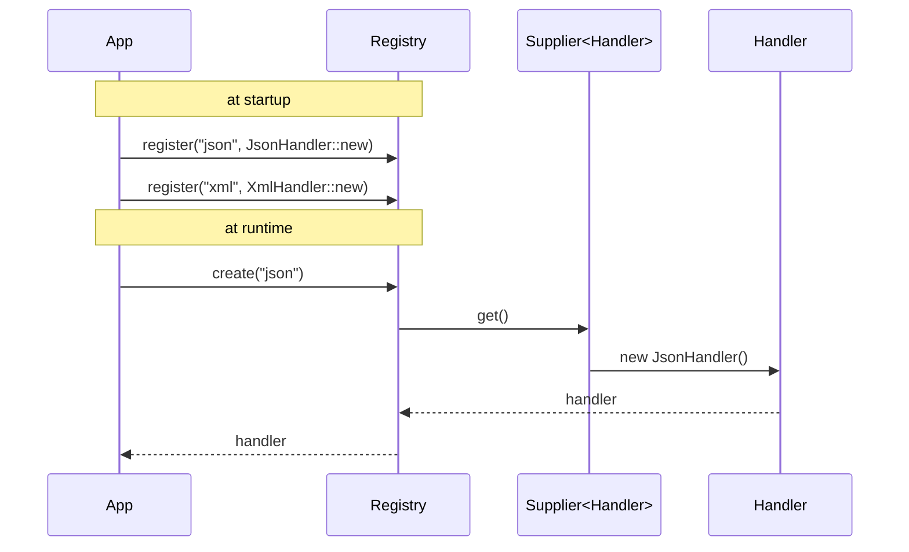
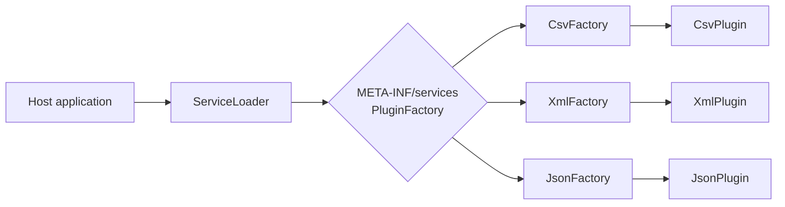

# Factory Method — Senior Level

> **Source:** [refactoring.guru/design-patterns/factory-method](https://refactoring.guru/design-patterns/factory-method)
> **Prerequisites:** [Junior](junior.md) · [Middle](middle.md)
> **Focus:** **How to optimize?** **How to architect?**

---

## Table of Contents

1. [Introduction](#introduction)
2. [Architectural Patterns Around Factory Method](#architectural-patterns-around-factory-method)
3. [Generics & Type-Safe Factories](#generics--type-safe-factories)
4. [Concurrency Considerations](#concurrency-considerations)
5. [Performance](#performance)
6. [Testability Strategies](#testability-strategies)
7. [Plugin Architectures](#plugin-architectures)
8. [Code Examples — Advanced](#code-examples--advanced)
9. [When Factory Method Becomes a Liability](#when-factory-method-becomes-a-liability)
10. [Trade-off Analysis Matrix](#trade-off-analysis-matrix)
11. [Migration Patterns](#migration-patterns)
12. [Diagrams](#diagrams)
13. [Related Topics](#related-topics)

---

## Introduction

> Focus: **architecture** and **optimization**

At the senior level, Factory Method stops being a class hierarchy and becomes a **system-design lever**: it controls *who decides* the concrete type, *when* the decision is made, and *how* the system extends.

You will be asked to:
- Design a plugin system whose third-party authors only know your abstract Creator/Product types.
- Refactor a code base full of `instanceof` checks into clean Factory Method usage.
- Make a Factory Method registry thread-safe and lock-free on the hot path.
- Decide when Factory Method has outgrown its usefulness and DI should take over.

This file covers all four.

---

## Architectural Patterns Around Factory Method

### Factory Method + Registry

Many real systems use a **type registry** as the underlying Factory Method machinery:

```java
public final class HandlerRegistry {
    private static final Map<String, Supplier<Handler>> HANDLERS = new ConcurrentHashMap<>();

    public static void register(String type, Supplier<Handler> factory) {
        HANDLERS.put(type, factory);
    }

    public static Handler create(String type) {
        Supplier<Handler> f = HANDLERS.get(type);
        if (f == null) throw new IllegalArgumentException("unknown: " + type);
        return f.get();
    }
}

// At app startup:
HandlerRegistry.register("json", JsonHandler::new);
HandlerRegistry.register("xml",  XmlHandler::new);
```

The "factory method" here is `Supplier<Handler>`. Adding a new handler means a new registration call — no class hierarchy, no subclass.

**This is essentially Factory Method with the inheritance turned into composition.** Modern Java/Kotlin/Python codebases use this pattern far more than the classical inheritance-based Factory Method.

### Factory Method + Abstract Factory

When a Concrete Creator needs to produce *several* product types as a coordinated set, Factory Method graduates to **Abstract Factory**:

```java
abstract class GuiFactory {
    abstract Button createButton();
    abstract Checkbox createCheckbox();
    abstract Window createWindow();
}

class WindowsGuiFactory extends GuiFactory { /* all Windows-styled */ }
class MacGuiFactory extends GuiFactory { /* all Mac-styled */ }
```

See [Abstract Factory](../02-abstract-factory/junior.md). The Factory Method is the *atomic* form; Abstract Factory is the *family* form.

### Factory Method as Template Method Step

Factory Method is often a step inside a Template Method algorithm:

```java
abstract class DocumentProcessor {
    public final void process() {                  // template method
        Document doc = createDocument();           // factory method (a step)
        validate(doc);
        transform(doc);
        save(doc);
    }
    abstract Document createDocument();            // step 1
    abstract void transform(Document doc);         // step 3
}
```

The skeleton is fixed; subclasses provide the variable steps — including which `Document` type to instantiate. See [Template Method](../../03-behavioral/09-template-method/junior.md).

### Factory Method + Strategy

Factory Method *creates* strategies:

```java
class StrategyFactory {
    static SortStrategy create(int size) {
        if (size < 100)  return new InsertionSort();
        if (size < 1_000_000) return new QuickSort();
        return new ExternalSort();
    }
}
```

This blends Factory Method with **Strategy**: the factory picks the algorithm based on input characteristics.

---

## Generics & Type-Safe Factories

### Java — Type-Parameterized Creator

```java
public abstract class RepositoryFactory<T> {
    public abstract Repository<T> create(Class<T> type);
}

public class JpaRepositoryFactory<T> extends RepositoryFactory<T> {
    @Override
    public Repository<T> create(Class<T> type) {
        return new JpaRepository<>(type);
    }
}

// Usage
RepositoryFactory<User> rf = new JpaRepositoryFactory<>();
Repository<User> userRepo = rf.create(User.class);
```

**Tradeoffs:**
- Type-safe at compile time.
- Verbose — Java generics require passing `Class<T>` because of erasure.
- The factory itself must be parameterized when the Concrete Creator is.

### Kotlin — Reified Generics

```kotlin
inline fun <reified T : Any> createRepository(): Repository<T> {
    return JpaRepository(T::class.java)
}

val userRepo: Repository<User> = createRepository()
```

Kotlin's `reified` recovers the type at runtime — no `Class<T>` needed.

### Python — Generic Class with TypeVar

```python
from typing import Generic, TypeVar, Type

T = TypeVar("T")

class RepositoryFactory(Generic[T]):
    def __init__(self, model: Type[T]) -> None:
        self.model = model

    def create(self) -> "Repository[T]":
        return JpaRepository(self.model)
```

Python's generics are not enforced at runtime, only checked by type checkers. Useful for IDE / `mypy`.

### Go — Type Parameters (Go 1.18+)

```go
type Repository[T any] interface {
    GetAll() []T
    Save(T) error
}

func NewRepository[T any](kind string) (Repository[T], error) {
    switch kind {
    case "memory": return newMemoryRepo[T](), nil
    case "sql":    return newSQLRepo[T](), nil
    }
    return nil, fmt.Errorf("unknown: %s", kind)
}

// Usage
repo, _ := NewRepository[User]("memory")
```

Go generics give compile-time safety while keeping Simple Factory's flatness.

---

## Concurrency Considerations

Factory Method calls happen at runtime; concurrency questions arise:

### 1. Is the Creator state-safe?

If `createX()` reads or writes Creator fields, those accesses must be thread-safe.

```java
abstract class Creator {
    private int counter = 0;             // ⚠️ not thread-safe!
    public final Product create() {
        counter++;
        return doCreate(counter);
    }
    protected abstract Product doCreate(int seq);
}
```

Fix: `AtomicInteger` for the counter, or document single-threaded usage.

### 2. Are Concrete Products thread-safe?

The factory might return a singleton-like cached product (e.g., parsers cached for performance). Concurrent callers must not mutate shared state.

### 3. Is the registry thread-safe?

If your Factory Method is implemented as a registry:

```java
private static final Map<String, Supplier<X>> reg = new ConcurrentHashMap<>();
```

Use `ConcurrentHashMap`, not `HashMap`. For static registration at startup, you can populate before the app accepts requests — `Map.of(...)` (immutable) is fastest.

### 4. Lazy initialization of expensive products

```go
package decoder

import "sync"

type Decoder interface { Decode([]byte) (any, error) }

var (
    once sync.Once
    inst Decoder
)

func New(kind string) Decoder {
    if kind == "json" {
        once.Do(func() { inst = newJsonDecoder() })
        return inst
    }
    // ...
}
```

`sync.Once` ensures the expensive build happens once even under concurrent first-callers. See [Singleton — Senior](../05-singleton/senior.md) for `sync.Once` internals.

---

## Performance

### Cost of indirection

A Factory Method call is one virtual dispatch + a `new`. On modern JIT (Java HotSpot, V8) and AOT (Go), the overhead is:

- **Virtual call:** ~1-3 ns (often inlined after JIT).
- **`new` + constructor:** depends — small object ~5-20 ns; heavy initialization can be hundreds of ns.

The Factory Method itself is essentially **free** compared to the construction cost.

### Caching factories

When the *same* Concrete Product is returned over and over (e.g., a stateless validator), you can cache:

```java
class ValidatorFactory {
    private static final Map<String, Validator> CACHE = new ConcurrentHashMap<>();

    public static Validator create(String type) {
        return CACHE.computeIfAbsent(type, ValidatorFactory::build);
    }

    private static Validator build(String type) {
        // expensive
    }
}
```

This **changes the contract**: callers get the same object, so it must be safe to share. Document this.

### Object pools as factory backends

If creation is expensive and objects are reusable:

```java
class ConnectionFactory {
    private final BlockingQueue<Connection> pool = new ArrayBlockingQueue<>(20);

    public Connection borrow() throws InterruptedException {
        Connection c = pool.poll(1, TimeUnit.SECONDS);
        return c != null ? c : openNew();
    }

    public void release(Connection c) { pool.offer(c); }
}
```

The factory's `borrow()` is a *factory method* that may return a fresh or pooled object. Callers don't care.

---

## Testability Strategies

### 1. Override `create()` in test subclass

```java
class TestApp extends App {
    @Override
    Button createButton() { return new MockButton(); }
}
```

Quick and clean — Factory Method's testability sweet spot.

### 2. Inject the Factory

```java
class Service {
    private final ButtonFactory factory;
    Service(ButtonFactory factory) { this.factory = factory; }
    void doWork() { factory.create().render(); }
}

// Tests
Service svc = new Service(() -> mock(Button.class));
```

This is **Factory Method as functional interface** — preferred in modern Java/Kotlin.

### 3. Replace the registry

```java
@Before
void setup() {
    HandlerRegistry.register("json", () -> mock(Handler.class));
}
```

Pragmatic; watch for cleanup if tests run in parallel.

### 4. DI container with test scope

In Spring:

```java
@TestConfiguration
class TestConfig {
    @Bean ButtonFactory buttonFactory() { return () -> new MockButton(); }
}
```

Scales to large applications.

---

## Plugin Architectures

A Factory Method-based plugin system separates **what the host needs** from **how plugins create it**:

```java
// Host (your code)
public interface Plugin {
    void run(Context ctx);
}

public interface PluginFactory {
    String name();
    Plugin create(Config config);   // factory method
}

// Service loader picks up implementations on classpath:
ServiceLoader<PluginFactory> loader = ServiceLoader.load(PluginFactory.class);
for (PluginFactory pf : loader) {
    Plugin p = pf.create(loadConfig(pf.name()));
    p.run(ctx);
}
```

```java
// Plugin author
public class CsvPluginFactory implements PluginFactory {
    public String name() { return "csv"; }
    public Plugin create(Config config) { return new CsvPlugin(config); }
}

// META-INF/services/com.example.PluginFactory
// com.example.csv.CsvPluginFactory
```

This is how **JDBC drivers**, **slf4j providers**, and many JVM ecosystems work. The Factory Method is the only thing the host needs — implementation details are entirely the plugin's.

### Python equivalent — entry points

```toml
# pyproject.toml of a plugin package
[project.entry-points."myapp.plugins"]
csv = "csvplugin:create_plugin"
```

```python
# host
from importlib.metadata import entry_points
for ep in entry_points(group="myapp.plugins"):
    factory = ep.load()
    plugin = factory()
    plugin.run()
```

`factory()` is the plugin's Factory Method (here, just a callable).

### Go equivalent — `init()` registration

```go
// plugin/csv/csv.go
package csv

import "host/plugins"

func init() {
    plugins.Register("csv", func(cfg plugins.Config) plugins.Plugin {
        return &csvPlugin{cfg: cfg}
    })
}
```

Side-effect import (`_ "host/plugins/csv"`) triggers `init()`, which registers the factory function.

---

## Code Examples — Advanced

### Java — Type-Safe Plugin Registry with Generics

```java
public final class TypeRegistry {
    private static final Map<Class<?>, Function<?, ?>> FACTORIES = new ConcurrentHashMap<>();

    public static <I, O> void register(Class<I> in, Function<I, O> factory) {
        FACTORIES.put(in, factory);
    }

    @SuppressWarnings("unchecked")
    public static <I, O> O create(I input) {
        Function<I, O> f = (Function<I, O>) FACTORIES.get(input.getClass());
        if (f == null) throw new IllegalStateException();
        return f.apply(input);
    }
}

// Usage
TypeRegistry.register(UserDto.class, UserFactory::fromDto);
User u = TypeRegistry.create(new UserDto("..."));
```

### Python — Discriminated-Union Factory

```python
from dataclasses import dataclass
from typing import Literal

@dataclass(frozen=True)
class TransportSpec:
    kind: Literal["truck", "ship", "plane"]
    capacity: int

class Truck: ...
class Ship: ...
class Plane: ...

_factories = {
    "truck": lambda c: Truck(c),
    "ship":  lambda c: Ship(c),
    "plane": lambda c: Plane(c),
}

def make(spec: TransportSpec):
    return _factories[spec.kind](spec.capacity)
```

`Literal` makes `kind` exhaustive at the type-checker level. Adding a new variant requires updating both the union and the dict — `mypy` warns if you forget.

### Go — Functional Options + Factory

```go
package server

type Server struct{ /* ... */ }

type Option func(*Server)

func WithPort(p int) Option       { return func(s *Server) { s.port = p } }
func WithTLS(cert, key string) Option { return func(s *Server) { s.cert, s.key = cert, key } }

func New(opts ...Option) *Server {
    s := &Server{port: 8080}
    for _, o := range opts { o(s) }
    return s
}

// Usage
srv := server.New(server.WithPort(443), server.WithTLS("c", "k"))
```

This combines **Factory + Builder** into one Go-idiomatic function. Used by the Go standard library (`http.Server`, `grpc.Server`) and the entire Go ecosystem.

---

## When Factory Method Becomes a Liability

### Symptom 1: A class hierarchy where every subclass differs only in `create()`

```java
class A1 extends A { Product create() { return new P1(); } }
class A2 extends A { Product create() { return new P2(); } }
class A3 extends A { Product create() { return new P3(); } }
```

The subclasses are functionally a glorified switch. **Collapse to Simple Factory.**

### Symptom 2: 5+ levels of Creator hierarchy

If your inheritance tree is `A → B → C → D → E`, each adding one tweak, you've recreated the **fragile base class problem**. Switch to composition / DI.

### Symptom 3: Factory method that takes a "kind" parameter and `instanceof`-checks the result

If the caller passes a kind, the factory returns a Product, then the caller does:

```java
Product p = factory.create("special");
if (p instanceof SpecialProduct sp) sp.specialMethod();
```

The whole point of Factory Method was to avoid `instanceof`. The abstraction is leaking. Either redesign the Product interface to expose `specialMethod` (via Strategy or Visitor), or skip Factory Method and use direct typed access.

### Symptom 4: Multiple unrelated factories with the same signature

```java
ButtonFactory bf = ...;
LabelFactory  lf = ...;
WindowFactory wf = ...;
```

Each with `createX()`. If all three are needed together and must match (Mac UI vs Windows UI), this should be one **Abstract Factory**, not three Factory Methods.

---

## Trade-off Analysis Matrix

| Pattern | Lines added | Open/Closed | Type-safe | Idiomatic in… |
|---|---|---|---|---|
| **Direct `new`** | 0 | No | Yes | Trivial cases |
| **Simple Factory function** | ~5 | No (modify switch) | Yes | Go, small Python |
| **Factory Method (GoF)** | ~30+ | Yes | Yes | Java, C#, OO Python |
| **Registry + Supplier** | ~20 | Yes | Partial | Modern Java, Spring |
| **DI container** | ~variable | Yes | Yes | Enterprise Java/.NET |
| **Functional Options** | ~10 | Yes | Yes | Go |
| **Service Loader / entry points** | ~platform | Yes | Yes | Plugin ecosystems |

---

## Migration Patterns

### From `if/else new` to Factory Method

**Before:**
```java
class App {
    void run(String env) {
        if (env.equals("prod"))      new ProdLogger().log();
        else if (env.equals("dev"))  new DevLogger().log();
        else                         new NoopLogger().log();
    }
}
```

**Step 1 — Introduce abstract creator and method:**
```java
abstract class App {
    abstract Logger createLogger();
    void run() { createLogger().log(); }
}
```

**Step 2 — Subclasses for each branch:**
```java
class ProdApp extends App { Logger createLogger() { return new ProdLogger(); } }
class DevApp  extends App { Logger createLogger() { return new DevLogger();  } }
class NoopApp extends App { Logger createLogger() { return new NoopLogger(); } }
```

**Step 3 — Pick the subclass at startup:**
```java
App app = switch (env) {
    case "prod" -> new ProdApp();
    case "dev"  -> new DevApp();
    default     -> new NoopApp();
};
app.run();
```

The `switch` is now in **one place** (composition root) instead of scattered through the codebase.

### From Factory Method to DI

When the codebase outgrows hand-rolled Factory Method:

1. Extract Factory Method's creator interface.
2. Register implementations as DI beans.
3. Inject the factory (or product) into consumers.
4. Delete the factory hierarchy.

```java
// Before
abstract class LoggerFactory { abstract Logger create(); }

// After (Spring)
@Configuration
class LoggingConfig {
    @Bean Logger logger(Environment env) {
        return env.getProperty("env").equals("prod") ? new ProdLogger() : new DevLogger();
    }
}
```

The DI container *is* the factory. Consumers `@Autowire Logger`.

---

## Diagrams

### Registry-Backed Factory Method



### Plugin Discovery via Service Loader



---

## Related Topics

- **Next:** [Factory Method — Professional](professional.md) — runtime internals, JIT, generics erasure, plugin classloading.
- **Practice:** [Tasks](tasks.md), [Find-Bug](find-bug.md), [Optimize](optimize.md), [Interview](interview.md).
- **Companions:** [Abstract Factory](../02-abstract-factory/junior.md), [Builder](../03-builder/junior.md), [Template Method](../../03-behavioral/09-template-method/junior.md), [Strategy](../../03-behavioral/08-strategy/junior.md).
- **Modern alternative:** Dependency Injection (Spring, Guice, Wire, NestJS).

---

[← Middle](middle.md) · [Creational](../README.md) · [Roadmap](../../../README.md) · **Next:** [Professional](professional.md)
