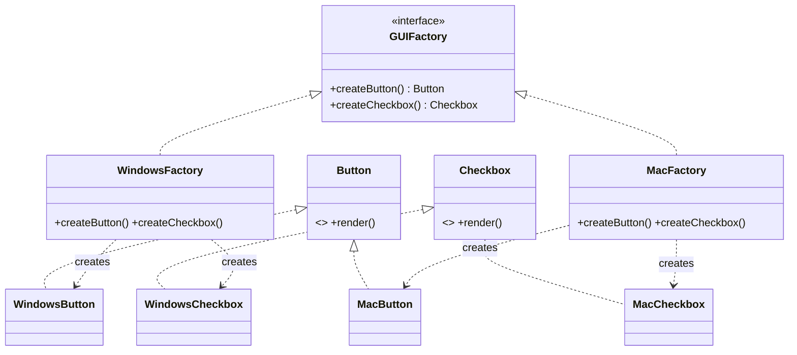
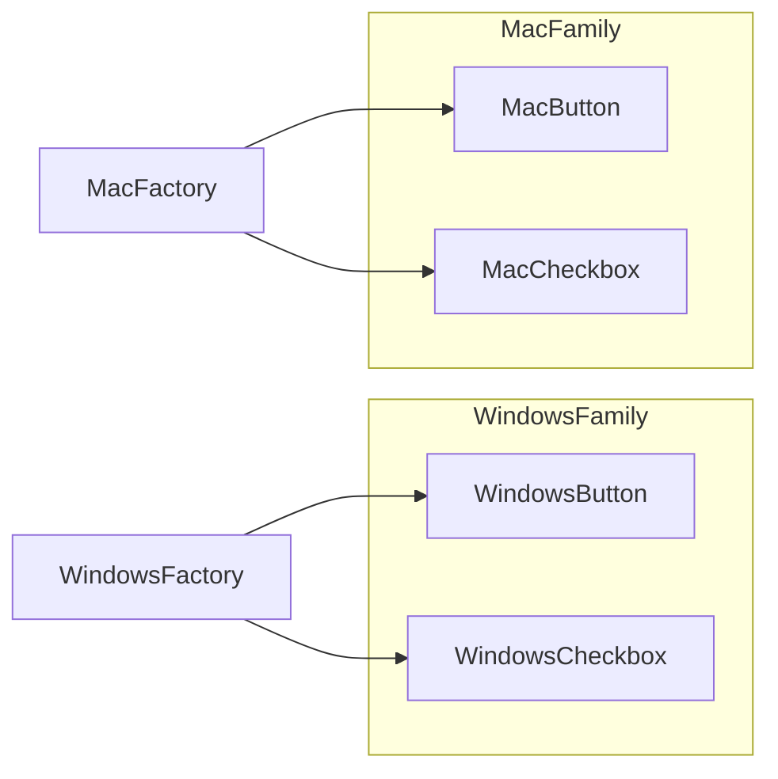

# Abstract Factory — Junior Level

> **Source:** [refactoring.guru/design-patterns/abstract-factory](https://refactoring.guru/design-patterns/abstract-factory)
> **Category:** [Creational](../README.md)

---

## Table of Contents

1. [Introduction](#introduction)
2. [Prerequisites](#prerequisites)
3. [Glossary](#glossary)
4. [Core Concepts](#core-concepts)
5. [Real-World Analogies](#real-world-analogies)
6. [Mental Models](#mental-models)
7. [Pros & Cons](#pros--cons)
8. [Use Cases](#use-cases)
9. [Code Examples](#code-examples)
10. [Coding Patterns](#coding-patterns)
11. [Clean Code](#clean-code)
12. [Best Practices](#best-practices)
13. [Edge Cases & Pitfalls](#edge-cases--pitfalls)
14. [Common Mistakes](#common-mistakes)
15. [Tricky Points](#tricky-points)
16. [Test Yourself](#test-yourself)
17. [Cheat Sheet](#cheat-sheet)
18. [Summary](#summary)
19. [Further Reading](#further-reading)
20. [Related Topics](#related-topics)
21. [Diagrams](#diagrams)

---

## Introduction

> Focus: **What is it?** and **How to use it?**

**Abstract Factory** is a creational design pattern that lets you produce **families of related objects** without specifying their concrete classes.

Where [Factory Method](../01-factory-method/junior.md) creates **one** product per Creator subclass, Abstract Factory creates **many related products** per Concrete Factory — and *guarantees they match*.

### Why this matters

Imagine a cross-platform UI app. You need a `Button` and a `Checkbox` and a `Window` — and on Windows they should *all* look like Windows widgets, on macOS they should *all* look like Mac widgets. Mixing a Windows button with a Mac checkbox would be a user-experience disaster.

The Abstract Factory enforces consistency: a `WindowsFactory` makes a `WindowsButton` AND a `WindowsCheckbox` AND a `WindowsWindow`. A `MacFactory` makes the Mac variants of all three. The client code asks the factory for products without knowing the OS — and the factory guarantees the family is internally consistent.

In one sentence: **a factory of factories — one method per product type, all returning matching variants.**

---

## Prerequisites

- **Required:** [Factory Method](../01-factory-method/junior.md) — Abstract Factory builds on it.
- **Required:** Interfaces and polymorphism.
- **Required:** Understanding of "product family" — multiple distinct types that belong together.
- **Helpful:** Real cross-platform development experience (UI toolkits, DB dialects).

---

## Glossary

| Term | Definition |
|------|-----------|
| **Abstract Factory** | The interface declaring creation methods for each product type in the family. |
| **Concrete Factory** | A specific implementation of Abstract Factory; produces one *variant* of the family. |
| **Abstract Product** | An interface for one product type (`Button`, `Checkbox`, …). |
| **Concrete Product** | A specific variant of a product (`WindowsButton`, `MacButton`, …). |
| **Family / Variant** | The set of products produced by one Concrete Factory; e.g., "Windows family". |
| **Product type** | A specific role in the family (e.g., "Button"). |

---

## Core Concepts

### 1. The product family

Multiple distinct product types that **belong together**. The classic example: UI widgets — `Button`, `Checkbox`, `Window`. A "family" is one consistent variant of all of them: e.g., the Windows family.

### 2. The Abstract Factory has one method per product type

```
abstract class GUIFactory {
    abstract Button   createButton();
    abstract Checkbox createCheckbox();
}
```

Note that this is **multiple factory methods in one class** — that's what distinguishes Abstract Factory from Factory Method.

### 3. Each Concrete Factory implements all methods consistently

```
class WindowsFactory implements GUIFactory {
    Button   createButton()   { return new WindowsButton(); }
    Checkbox createCheckbox() { return new WindowsCheckbox(); }
}

class MacFactory implements GUIFactory {
    Button   createButton()   { return new MacButton(); }
    Checkbox createCheckbox() { return new MacCheckbox(); }
}
```

### 4. The client picks one factory and uses it for everything

```
GUIFactory factory = pickFactoryForOS();
Button   b = factory.createButton();
Checkbox c = factory.createCheckbox();
// Both b and c are guaranteed to be the same variant.
```

The client never knows the concrete classes — only the abstract types.

---

## Real-World Analogies

| Concept | Analogy |
|---|---|
| **Abstract Factory** | A furniture catalog. The "Modern" catalog has matching modern chair + sofa + table. The "Victorian" catalog has matching Victorian versions. You pick one catalog; everything you order from it matches. |
| **Concrete Factory** | A specific catalog: "IKEA Modern Series" or "Antique Victorian Reproductions". |
| **Abstract Product** | The role: "chair", "sofa", "table". |
| **Concrete Product** | A specific item: "IKEA Modern Chair Mark 7". |
| **Refactoring.guru's example** | Cross-platform UI: each OS has its own factory producing OS-native widgets. |

---

## Mental Models

**The intuition:** *"I need things that go together. The Abstract Factory makes sure they do."*

```
                     ┌──────────────────┐
                     │  GUIFactory      │
                     │  (abstract)      │
                     │ + createButton() │
                     │ + createCheckbox│
                     └──────────────────┘
                       ▲              ▲
              ┌────────┘              └────────┐
              │                                 │
   ┌──────────────────┐               ┌──────────────────┐
   │ WindowsFactory   │               │ MacFactory       │
   │ + createButton() │               │ + createButton() │
   │ + createCheckbox()│              │ + createCheckbox()│
   └──────────────────┘               └──────────────────┘
       │            │                       │           │
       ▼            ▼                       ▼           ▼
  WindowsButton  WinCheckbox          MacButton     MacCheckbox
```

The horizontal *grouping* (one factory makes both Windows products) is the key insight.

---

## Pros & Cons

| Pros | Cons |
|------|------|
| Guarantees products in the family are compatible | More interfaces and classes to maintain |
| Avoids tight coupling between client and concrete classes | Adding a new *product type* (e.g., `Window`) requires changing every Concrete Factory |
| Centralizes creation code (Single Responsibility) | Often overkill for small projects with one variant |
| Easy to introduce new variants (Open/Closed) | Initial setup is verbose |
| Replaceable at runtime by switching the factory | Inheritance-heavy; awkward in Go |

### When to use:
- The system needs to be **independent of how its products are created**.
- The system should work with **multiple product variants** that come as a set.
- You want to enforce that **a family of products is used together** (no mixing).

### When NOT to use:
- Only one variant exists.
- The product types are unrelated.
- You don't have a real "family" — just multiple unrelated factories.

---

## Use Cases

- **Cross-platform UI libraries** — Windows / Mac / Linux / Web variants.
- **Database access layers** — Postgres / MySQL / SQLite, each with their own dialect-specific Connection, Query, Transaction.
- **Game asset themes** — Forest / Desert / Snow level, each with matching Tree, Rock, Enemy.
- **Cloud SDK abstractions** — AWS / GCP / Azure, each providing matching Storage, Queue, Compute.
- **Cipher suites** — different cryptography providers (BouncyCastle, BoringSSL) provide matching `Hash`, `Cipher`, `KeyExchange`.

---

## Code Examples

### Java — Cross-Platform UI

```java
// ── Abstract Products ──
interface Button   { void render(); }
interface Checkbox { void render(); }

// ── Concrete Products: Windows family ──
class WindowsButton   implements Button   { public void render() { System.out.println("[Win Button]"); } }
class WindowsCheckbox implements Checkbox { public void render() { System.out.println("[Win Checkbox]"); } }

// ── Concrete Products: Mac family ──
class MacButton   implements Button   { public void render() { System.out.println("(Mac Button)"); } }
class MacCheckbox implements Checkbox { public void render() { System.out.println("(Mac Checkbox)"); } }

// ── Abstract Factory ──
interface GUIFactory {
    Button   createButton();
    Checkbox createCheckbox();
}

// ── Concrete Factories ──
class WindowsFactory implements GUIFactory {
    public Button   createButton()   { return new WindowsButton(); }
    public Checkbox createCheckbox() { return new WindowsCheckbox(); }
}

class MacFactory implements GUIFactory {
    public Button   createButton()   { return new MacButton(); }
    public Checkbox createCheckbox() { return new MacCheckbox(); }
}

// ── Client ──
public class App {
    private final Button   button;
    private final Checkbox checkbox;

    public App(GUIFactory factory) {
        this.button   = factory.createButton();
        this.checkbox = factory.createCheckbox();
    }

    public void render() { button.render(); checkbox.render(); }

    public static void main(String[] args) {
        GUIFactory factory = "win".equals(System.getenv("OS"))
            ? new WindowsFactory() : new MacFactory();
        new App(factory).render();
    }
}
```

**Note:** `App` doesn't know about `WindowsButton` or `MacButton` — it works only against the abstractions. Switching the factory at construction time changes the entire family.

---

### Python — Theme Engine

```python
from abc import ABC, abstractmethod

# ── Abstract Products ──
class Button(ABC):
    @abstractmethod
    def render(self) -> str: ...

class Checkbox(ABC):
    @abstractmethod
    def render(self) -> str: ...

# ── Light family ──
class LightButton(Button):
    def render(self) -> str: return "[ Light Button ]"

class LightCheckbox(Checkbox):
    def render(self) -> str: return "[ ] light"

# ── Dark family ──
class DarkButton(Button):
    def render(self) -> str: return "[ Dark Button ]"

class DarkCheckbox(Checkbox):
    def render(self) -> str: return "[X] dark"

# ── Abstract Factory ──
class ThemeFactory(ABC):
    @abstractmethod
    def make_button(self) -> Button: ...
    @abstractmethod
    def make_checkbox(self) -> Checkbox: ...

# ── Concrete Factories ──
class LightThemeFactory(ThemeFactory):
    def make_button(self) -> Button:    return LightButton()
    def make_checkbox(self) -> Checkbox: return LightCheckbox()

class DarkThemeFactory(ThemeFactory):
    def make_button(self) -> Button:    return DarkButton()
    def make_checkbox(self) -> Checkbox: return DarkCheckbox()

# ── Client ──
def render_form(factory: ThemeFactory) -> str:
    btn = factory.make_button()
    chk = factory.make_checkbox()
    return f"{btn.render()}  {chk.render()}"

if __name__ == "__main__":
    print(render_form(LightThemeFactory()))
    print(render_form(DarkThemeFactory()))
```

---

### Go — Adapted with interfaces (no inheritance)

> **Note for Go developers:** Go has **no inheritance**, so the classical Abstract Factory with abstract base classes doesn't translate directly. The idiomatic Go version uses **interfaces** for both the factory and the products. Refactoring.guru shows exactly this approach (sports brand example with shoe + shirt). Below is the adapted version with explanations.

```go
package gui

import "fmt"

// ── Abstract Products: just interfaces ──
// In Java this would be an "abstract class"; in Go it's an interface.
type Button interface {
    Render() string
}

type Checkbox interface {
    Render() string
}

// ── Concrete Products: Windows family ──
type windowsButton struct{}
func (windowsButton) Render() string { return "[Win Button]" }

type windowsCheckbox struct{}
func (windowsCheckbox) Render() string { return "[Win Checkbox]" }

// ── Concrete Products: Mac family ──
type macButton struct{}
func (macButton) Render() string { return "(Mac Button)" }

type macCheckbox struct{}
func (macCheckbox) Render() string { return "(Mac Checkbox)" }

// ── Abstract Factory: the second-level interface ──
// Each method returns a different abstract product type.
type GUIFactory interface {
    CreateButton()   Button
    CreateCheckbox() Checkbox
}

// ── Concrete Factories ──
// Note: NO inheritance. Each factory is a struct that implements GUIFactory
// by providing both methods. The "family consistency" is enforced by convention,
// not by the language — both methods must return matching variants.

type WindowsFactory struct{}

func (WindowsFactory) CreateButton()   Button   { return windowsButton{} }
func (WindowsFactory) CreateCheckbox() Checkbox { return windowsCheckbox{} }

type MacFactory struct{}

func (MacFactory) CreateButton()   Button   { return macButton{} }
func (MacFactory) CreateCheckbox() Checkbox { return macCheckbox{} }

// ── Factory selector (replaces "static method on abstract class") ──
func NewGUIFactory(os string) (GUIFactory, error) {
    switch os {
    case "win": return WindowsFactory{}, nil
    case "mac": return MacFactory{},     nil
    }
    return nil, fmt.Errorf("unknown OS: %s", os)
}

// ── Client ──
func RenderForm(f GUIFactory) string {
    return f.CreateButton().Render() + " " + f.CreateCheckbox().Render()
}
```

**Idiomatic Go differences:**

1. **No abstract classes.** `GUIFactory` is just an interface — anything that implements `CreateButton` and `CreateCheckbox` is one.
2. **Embedding instead of inheritance.** If you want shared state in concrete factories, embed a struct rather than extending a class.
3. **Family consistency is a convention, not enforced.** A buggy `WindowsFactory.CreateCheckbox()` could return a `macCheckbox` and the compiler wouldn't catch it. Test the contract.
4. **No constructor — just a struct literal** (`WindowsFactory{}`) or a `New…` function for non-trivial cases.

---

## Coding Patterns

### Pattern 1: Static "factory selector"

A top-level function picks the right Concrete Factory at startup:

```java
public static GUIFactory pick(String os) {
    return switch (os) {
        case "win" -> new WindowsFactory();
        case "mac" -> new MacFactory();
        default     -> throw new IllegalArgumentException(os);
    };
}
```

This is the entry point — clients then call only methods on the abstract `GUIFactory`.

### Pattern 2: Singleton factories

Concrete factories are usually **stateless**. Make them singletons:

```java
class WindowsFactory implements GUIFactory {
    private static final WindowsFactory INSTANCE = new WindowsFactory();
    private WindowsFactory() {}
    public static WindowsFactory get() { return INSTANCE; }
    // ...
}
```

This avoids creating a fresh factory object every time. See [Singleton](../05-singleton/junior.md).

### Pattern 3: Composing with Factory Method

Each method of the Abstract Factory is itself a Factory Method. So Abstract Factory is sometimes described as **"a class with several Factory Methods, grouped by family."**

---

## Clean Code

### Naming

| ❌ Bad | ✅ Good |
|---|---|
| `make()`, `build()`, `factory()` | `createButton()`, `createCheckbox()` |
| `WinFactory` (cryptic) | `WindowsFactory` |
| `Factory1`, `Factory2` | `LightThemeFactory`, `DarkThemeFactory` |

### One method per product type

```java
// ❌ Bad — one method, parameterized
GUIFactory.create(String type);   // loses type safety

// ✅ Good — one method per type
Button   createButton();
Checkbox createCheckbox();
```

### Return abstract types, not concrete

```java
// ❌ Bad
WindowsButton createButton();

// ✅ Good
Button createButton();
```

---

## Best Practices

1. **Keep factories stateless** when possible — easier to share, test, and mock.
2. **Make the factory selector explicit** — a single place where the decision is made.
3. **Name factories by their *variant*, not their *role*** — `WindowsFactory`, not `Factory1`.
4. **Test family consistency** — a unit test that all products from one factory belong to the same variant.
5. **Document the contract clearly** — what does it mean to "match"? Visual style? Behavior? Both?

---

## Edge Cases & Pitfalls

- **Adding a new product type** (e.g., adding `Window` after `Button` and `Checkbox`) requires updating *every* Concrete Factory. This is the pattern's biggest weakness.
- **Mixing variants** — if the client retains a Concrete Product reference and constructs more by hand, it can break the family invariant.
- **Factory that returns `null`** — defeats polymorphism. Throw, return Optional, or use a Null Object.
- **Stateful factories** — surprising for callers who expected fresh instances. Document carefully.
- **Diamond hierarchies** — if Concrete Factories share code, multiple inheritance / mixin issues can appear.

---

## Common Mistakes

1. **Calling `new ConcreteX()` outside the factory.** Defeats the whole pattern.
2. **One factory with one product** — that's Factory Method, not Abstract Factory.
3. **Factories with unrelated products.** If the products don't form a natural family, the abstraction is wrong.
4. **Putting business logic in factory methods.** Keep them pure construction.
5. **Forgetting to update *all* factories** when adding a product type. Build will fail in Java; in Go, the missing method just doesn't compile — fix the omission.

---

## Tricky Points

- **Abstract Factory vs Factory Method.** Abstract Factory has *several* methods, returns a *family*. Factory Method has *one* method, returns *one* product.
- **The "abstract" in the name.** It's "abstract" because *both* the factory interface and the product interface are abstract. Concrete factories produce concrete products.
- **Family consistency is structural, not enforced.** The compiler can't verify that `WindowsFactory.createCheckbox()` returns a *Windows*-style checkbox. Tests must.
- **Often appears as a Singleton** — there's typically one factory per family per process.

---

## Test Yourself

1. What does Abstract Factory guarantee?
2. How does it differ from Factory Method?
3. Why is adding a new *product type* (vs new *variant*) painful?
4. Name three real-world examples.
5. In Go, how is Abstract Factory adapted?

<details><summary>Answers</summary>

1. That all products created by a single Concrete Factory belong to the same family/variant — they are guaranteed to match.
2. Factory Method has one method, returns one product. Abstract Factory has multiple methods, returns a family of related products.
3. Adding a new product type requires updating *every* Concrete Factory. New variants (new Concrete Factory) are easy; new types (new method) are not. This is "the abstract factory dilemma".
4. Cross-platform UI, database dialects, cloud SDKs, theme engines, cipher suites.
5. With interfaces only (no inheritance). Each Concrete Factory is a struct implementing the factory interface. Family consistency is conventional, not enforced.

</details>

---

## Cheat Sheet

```java
// Java
interface GUIFactory {
    Button   createButton();
    Checkbox createCheckbox();
}
class WinFactory implements GUIFactory { /* ... */ }
class MacFactory implements GUIFactory { /* ... */ }
```

```python
# Python
class ThemeFactory(ABC):
    @abstractmethod
    def make_button(self) -> Button: ...
    @abstractmethod
    def make_checkbox(self) -> Checkbox: ...
```

```go
// Go (interface-based)
type GUIFactory interface {
    CreateButton()   Button
    CreateCheckbox() Checkbox
}
```

---

## Summary

- Abstract Factory = factory of factories; one method per product type.
- Each Concrete Factory produces a **family** (all matching variants).
- Adding a **new variant** is easy; adding a **new product type** is hard.
- Often combined with [Singleton](../05-singleton/junior.md), [Factory Method](../01-factory-method/junior.md), and [Bridge](../../02-structural/02-bridge/junior.md).
- In Go, use interface-only adaptation; family consistency is a convention.

---

## Further Reading

- [refactoring.guru/design-patterns/abstract-factory](https://refactoring.guru/design-patterns/abstract-factory)
- GoF book, Chapter 3 — Abstract Factory.
- *Head First Design Patterns*, Chapter 4 (combined with Factory Method).

---

## Related Topics

- **Next level:** [Abstract Factory — Middle](middle.md)
- **Sibling:** [Factory Method](../01-factory-method/junior.md)
- **Companion:** [Builder](../03-builder/junior.md), [Prototype](../04-prototype/junior.md), [Bridge](../../02-structural/02-bridge/junior.md).
- **Often a:** [Singleton](../05-singleton/junior.md).

---

## Diagrams

### UML Class Diagram



### Family Consistency



---

[← Factory Method](../01-factory-method/junior.md) · [Creational](../README.md) · [Roadmap](../../../README.md) · **Next:** [Abstract Factory — Middle](middle.md)
