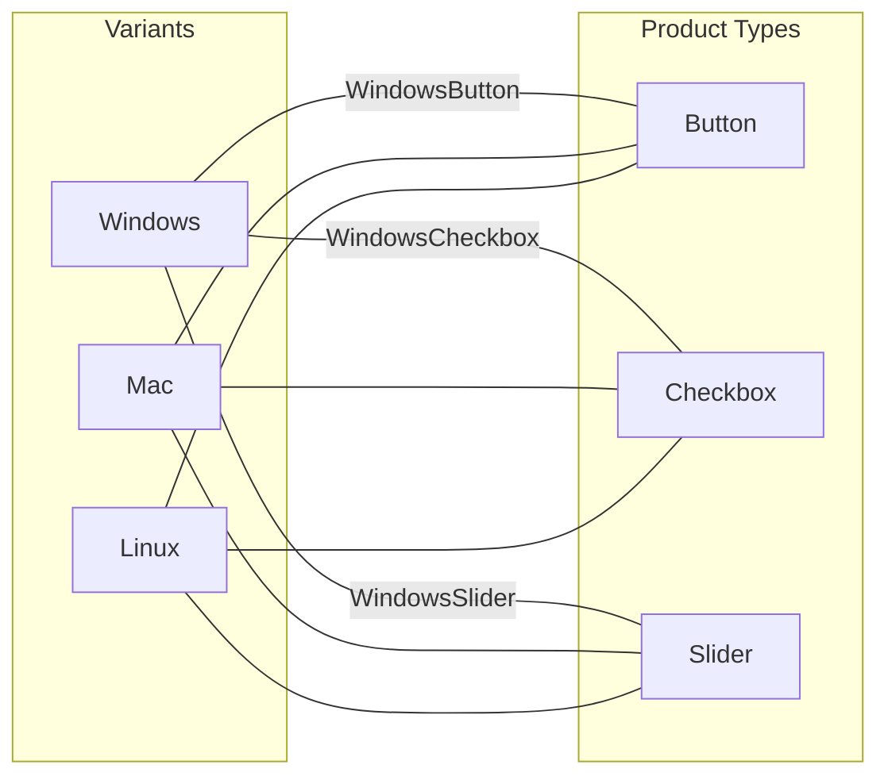
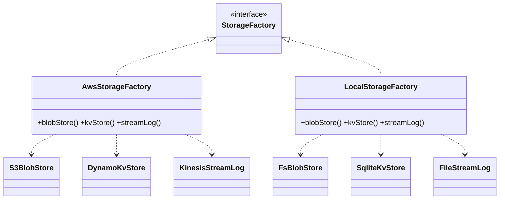

# Abstract Factory — Middle Level

> **Source:** [refactoring.guru/design-patterns/abstract-factory](https://refactoring.guru/design-patterns/abstract-factory)
> **Prerequisite:** [Junior](junior.md)

---

## Table of Contents

1. [Introduction](#introduction)
2. [When to Use](#when-to-use)
3. [When NOT to Use](#when-not-to-use)
4. [Real-World Cases](#real-world-cases)
5. [Code Examples — Production-Grade](#code-examples--production-grade)
6. [Trade-offs](#trade-offs)
7. [Alternatives Comparison](#alternatives-comparison)
8. [The "Abstract Factory Dilemma"](#the-abstract-factory-dilemma)
9. [Refactoring Toward and Away](#refactoring-toward-and-away)
10. [Edge Cases](#edge-cases)
11. [Tricky Points](#tricky-points)
12. [Best Practices](#best-practices)
13. [Summary](#summary)
14. [Diagrams](#diagrams)

---

## Introduction

> Focus: **Why** and **When**

Abstract Factory is the right tool when **product families exist as a real concept** — Windows widgets together, Mac widgets together, Postgres types together, MySQL types together. Use it when **mixing variants would be a bug**.

The middle-level skill is recognizing the difference between *"these things go together"* (Abstract Factory) and *"this is a configurable variant"* (Factory Method, Strategy, or DI). The former implies a family with internal consistency; the latter implies a single decision point.

This file explores production cases, the famous "abstract factory dilemma," and migration paths.

---

## When to Use

Use Abstract Factory when **all** of the following hold:

1. **Multiple product types** must be created together (≥ 2 distinct types).
2. **Multiple variants** of those types exist (≥ 2 variants).
3. **Family consistency matters** — mixing variants would be wrong.
4. **The set of variants is reasonably stable** — adding a new variant is common; adding a new product type is rare.

### Strong-fit examples

- Cross-platform UI: Button + Checkbox + Window per OS.
- Database access: Connection + Query + Transaction per dialect.
- Cloud SDK: Storage + Queue + Compute per provider.
- Theme engines: Background + Text + Border per theme.
- Cipher suites: Hash + Cipher + KeyExchange per provider.

---

## When NOT to Use

| Anti-pattern symptom | Better choice |
|---|---|
| Only one variant ever | [Factory Method](../01-factory-method/junior.md) or direct `new` |
| Products don't form a real family | Multiple separate Factory Methods |
| Variants change very often, but product types are stable | [Strategy](../../03-behavioral/08-strategy/junior.md) per type |
| Family construction is multi-step | [Builder](../03-builder/junior.md) |
| You need runtime configuration of which products belong | DI container |
| Set is closed and known | Plain factories or enum-driven dispatch |

---

## Real-World Cases

### 1. Cross-Platform UI

```java
abstract class GuiFactory {
    abstract Button   createButton();
    abstract Checkbox createCheckbox();
    abstract Slider   createSlider();
}

class WindowsGuiFactory extends GuiFactory { /* all Windows-styled */ }
class MacGuiFactory     extends GuiFactory { /* all Mac-styled */ }
class WebGuiFactory     extends GuiFactory { /* all HTML/CSS-styled */ }
```

The toolkit's renderer doesn't care which OS is running — it just calls `factory.createX()`.

### 2. Database Access (JDBC-style)

```java
interface DialectFactory {
    Connection         createConnection(String dsn);
    PreparedStatement  prepare(Connection c, String sql);
    Transaction        beginTransaction(Connection c);
}

class PostgresDialect implements DialectFactory { /* PG-specific */ }
class MySQLDialect    implements DialectFactory { /* MySQL-specific */ }
class SQLiteDialect   implements DialectFactory { /* SQLite-specific */ }
```

### 3. Cloud SDK (AWS/GCP/Azure)

```java
interface CloudFactory {
    BlobStore createStorage(String bucket);
    Queue     createQueue(String topic);
    Compute   createCompute(String region);
}

class AwsFactory   implements CloudFactory { /* S3 + SQS + EC2 */ }
class GcpFactory   implements CloudFactory { /* GCS + PubSub + GCE */ }
class AzureFactory implements CloudFactory { /* Blob + Service Bus + VM */ }
```

Application code calls the abstract methods; the deployment chooses one factory.

### 4. Game Asset Themes

```python
class LevelTheme(ABC):
    @abstractmethod
    def make_tree(self) -> Tree: ...
    @abstractmethod
    def make_rock(self) -> Rock: ...
    @abstractmethod
    def make_enemy(self) -> Enemy: ...

class ForestTheme(LevelTheme):
    def make_tree(self):  return PineTree()
    def make_rock(self):  return MossyRock()
    def make_enemy(self): return Wolf()

class DesertTheme(LevelTheme):
    def make_tree(self):  return Cactus()
    def make_rock(self):  return SandstoneRock()
    def make_enemy(self): return Scorpion()
```

The level renderer iterates and creates assets by *role*, not type — keeps Forest objects out of Desert levels.

### 5. Cipher Suites

```go
package crypto

// Abstract product types
type Hasher interface { Sum([]byte) []byte }
type Cipher interface { Encrypt([]byte, []byte) []byte }

// Abstract Factory: returns a matched suite
type Suite interface {
    Hasher() Hasher
    Cipher() Cipher
}

// Concrete factories: each provides the matching suite
type fipsSuite struct{}
func (fipsSuite) Hasher() Hasher { return fipsSHA256{} }
func (fipsSuite) Cipher() Cipher { return fipsAES{} }

type bouncySuite struct{}
func (bouncySuite) Hasher() Hasher { return bouncySHA256{} }
func (bouncySuite) Cipher() Cipher { return bouncyAES{} }
```

A FIPS-mode application chooses `fipsSuite{}`; a non-restricted one chooses `bouncySuite{}`.

---

## Code Examples — Production-Grade

### Java — Storage Backend Family

```java
public interface StorageFactory {
    BlobStore  blobStore(String bucket);
    KvStore    kvStore(String namespace);
    StreamLog  streamLog(String topic);
}

public class AwsStorageFactory implements StorageFactory {
    private final AwsConfig config;
    public AwsStorageFactory(AwsConfig config) { this.config = config; }

    public BlobStore  blobStore(String bucket)    { return new S3BlobStore(config, bucket); }
    public KvStore    kvStore(String namespace)   { return new DynamoKvStore(config, namespace); }
    public StreamLog  streamLog(String topic)     { return new KinesisStreamLog(config, topic); }
}

public class LocalStorageFactory implements StorageFactory {
    private final Path root;
    public LocalStorageFactory(Path root) { this.root = root; }

    public BlobStore  blobStore(String bucket)    { return new FsBlobStore(root.resolve(bucket)); }
    public KvStore    kvStore(String namespace)   { return new SqliteKvStore(root.resolve(namespace + ".db")); }
    public StreamLog  streamLog(String topic)     { return new FileStreamLog(root.resolve(topic + ".log")); }
}
```

The `LocalStorageFactory` lets developers run the app entirely on their laptop with no cloud accounts.

### Python — Plugin-style Theme System

```python
from abc import ABC, abstractmethod
from typing import Type

class Renderer(ABC):
    @abstractmethod
    def render(self, content: str) -> str: ...

class Header(Renderer): ...
class Body(Renderer): ...
class Footer(Renderer): ...

class ThemeFactory(ABC):
    @abstractmethod
    def header(self) -> Header: ...
    @abstractmethod
    def body(self) -> Body: ...
    @abstractmethod
    def footer(self) -> Footer: ...

# A registry of factories, plugin-style
_THEMES: dict[str, Type[ThemeFactory]] = {}

def register_theme(name: str):
    def decorator(cls: Type[ThemeFactory]):
        _THEMES[name] = cls
        return cls
    return decorator

@register_theme("light")
class LightTheme(ThemeFactory):
    def header(self): return LightHeader()
    def body(self):   return LightBody()
    def footer(self): return LightFooter()

@register_theme("dark")
class DarkTheme(ThemeFactory):
    def header(self): return DarkHeader()
    def body(self):   return DarkBody()
    def footer(self): return DarkFooter()

def render_page(theme: str) -> str:
    factory = _THEMES[theme]()
    return "\n".join([factory.header().render(""), factory.body().render(""), factory.footer().render("")])
```

The `@register_theme` decorator turns adding a new theme into a single-file change.

### Go — Cloud SDK Adaptation

```go
package cloud

import "context"

// ── Abstract products ──
type Storage interface {
    Get(ctx context.Context, key string) ([]byte, error)
    Put(ctx context.Context, key string, val []byte) error
}

type Queue interface {
    Send(ctx context.Context, msg []byte) error
    Receive(ctx context.Context) ([]byte, error)
}

// ── Abstract Factory ──
type Provider interface {
    Storage(name string) Storage
    Queue(name string) Queue
}

// ── Concrete Factory: AWS ──
type aws struct { cfg AwsConfig }

func (a *aws) Storage(name string) Storage { return &s3Bucket{a.cfg, name} }
func (a *aws) Queue(name string)   Queue   { return &sqsQueue{a.cfg, name} }

func NewAWS(cfg AwsConfig) Provider { return &aws{cfg} }

// ── Concrete Factory: Local (for tests/dev) ──
type local struct { root string }

func (l *local) Storage(name string) Storage { return &fsBucket{l.root, name} }
func (l *local) Queue(name string)   Queue   { return &channelQueue{name: name} }

func NewLocal(root string) Provider { return &local{root} }
```

```go
// Client code
func ProcessOrder(p cloud.Provider, orderID string) error {
    bucket := p.Storage("orders")
    queue  := p.Queue("notifications")
    // ... uses bucket and queue without knowing AWS vs local
    return nil
}
```

The same `ProcessOrder` works against AWS in production and the local file system in tests.

---

## Trade-offs

| Dimension | Abstract Factory | Multiple Factory Methods | DI Container |
|---|---|---|---|
| Family consistency | Enforced by structure | Manual (callers must match) | Container-controlled |
| Adding a variant | New Concrete Factory | New Concrete Creator per type | New binding set |
| Adding a type | All factories change | Each Creator hierarchy independent | New binding |
| Compile-time safety | High | High | Low (runtime) |
| Boilerplate | High | Medium | Configuration-heavy |
| Discoverability | Good (one interface) | Scattered | Hidden in container |

---

## Alternatives Comparison

### vs Factory Method

- **Factory Method:** one product per Creator. Subclass picks the type.
- **Abstract Factory:** family of products per Concrete Factory. The factory itself is the variant.

If the products you create don't relate to each other, you don't need Abstract Factory — multiple Factory Methods suffice.

### vs Builder

- **Abstract Factory:** product immediately constructed, family consistency.
- **Builder:** product constructed step-by-step, often with optional parts.

A Builder *can* be used to build products inside Abstract Factory methods, but they answer different questions.

### vs Prototype

- **Abstract Factory:** create from scratch.
- **Prototype:** clone existing.

Combine when construction is expensive and cloning is cheap (Prototype-based Abstract Factory).

### vs DI

- **Abstract Factory:** the variant is a class; you instantiate it.
- **DI:** the variant is a configuration; the container instantiates it.

DI is more flexible for runtime configuration; Abstract Factory is more visible.

---

## The "Abstract Factory Dilemma"

The pattern's biggest weakness: **the variant axis and the type axis are asymmetric**.

| Operation | Cost |
|---|---|
| Add a new variant (Concrete Factory) | One new file. Easy. |
| Add a new product type (factory method) | Modify *every* Concrete Factory + Abstract Factory. Hard. |

Example:

```java
interface GuiFactory {
    Button   createButton();
    Checkbox createCheckbox();
    // Adding `Slider createSlider()` requires updates to:
    // - GuiFactory itself
    // - WindowsGuiFactory
    // - MacGuiFactory
    // - WebGuiFactory
    // - Any other Concrete Factory
    // ...and you must implement Windows, Mac, Web sliders.
}
```

Your codebase becomes "easy to add OS, hard to add UI element."

### Mitigations

1. **Default methods (Java 8+):** add `default` methods to the interface that throw `UnsupportedOperationException`. New types don't break old factories.
2. **Composition over Abstract Factory:** split into multiple Factory Method hierarchies, accepting that family consistency must be tested.
3. **Visitor for cross-cutting operations:** if operations multiply faster than products, Visitor scales better.
4. **Code generation:** generate Concrete Factories from a spec.

---

## Refactoring Toward and Away

### Toward — Multiple Factories → Abstract Factory

You have:

```java
interface ButtonFactory   { Button   create(String os); }
interface CheckboxFactory { Checkbox create(String os); }
interface SliderFactory   { Slider   create(String os); }
```

…with each one doing `if (os.equals("win")) ... else if ("mac") ...`.

**Step 1 — Define Abstract Factory:**

```java
interface GuiFactory {
    Button   createButton();
    Checkbox createCheckbox();
    Slider   createSlider();
}
```

**Step 2 — One Concrete Factory per OS:**

```java
class WindowsGuiFactory implements GuiFactory {
    public Button   createButton()   { return new WindowsButton(); }
    public Checkbox createCheckbox() { return new WindowsCheckbox(); }
    public Slider   createSlider()   { return new WindowsSlider(); }
}
```

**Step 3 — Replace all `if/else` with the factory:**

```java
GuiFactory f = pickFactoryForOS();
Button   b = f.createButton();
Checkbox c = f.createCheckbox();
Slider   s = f.createSlider();
```

The OS check happens once, in `pickFactoryForOS()` — not scattered across every product creation.

### Away — Abstract Factory → DI

When the codebase outgrows the manual factory hierarchy:

```java
@Configuration
class AwsConfig {
    @Bean BlobStore blobStore() { return new S3BlobStore(); }
    @Bean Queue     queue()     { return new SqsQueue(); }
}

@Configuration
@Profile("local")
class LocalConfig {
    @Bean BlobStore blobStore() { return new FsBlobStore(); }
    @Bean Queue     queue()     { return new InMemoryQueue(); }
}
```

The DI container *is* the Abstract Factory. The "family" is now a configuration profile.

---

## Edge Cases

### 1. Adding a new product type breaks all factories

Java will give compile errors. Go will too (interface implementations). Python won't catch this until runtime — be vigilant.

### 2. Inconsistent variants in the family

A buggy `WindowsFactory` returns a `MacButton` somewhere — same return type, wrong variant. Compiler can't detect.

**Test:**
```java
@Test
void windowsFactoryProducesAllWindowsVariants() {
    GuiFactory f = new WindowsGuiFactory();
    assertThat(f.createButton()).isInstanceOf(WindowsButton.class);
    assertThat(f.createCheckbox()).isInstanceOf(WindowsCheckbox.class);
}
```

### 3. Product needs another product

```java
class WindowsCheckbox {
    private final WindowsButton parent;
    WindowsCheckbox(WindowsButton parent) { this.parent = parent; }
}
```

The factory must coordinate:

```java
public Checkbox createCheckbox(Button parent) { return new WindowsCheckbox((WindowsButton) parent); }
```

This couples the factory back to concrete types — design the products to avoid cross-references when possible.

### 4. Singleton factories

Concrete factories are usually stateless — make them singletons. But: testing can leak state. See [Singleton — Senior](../05-singleton/senior.md) for testability strategies.

---

## Tricky Points

- **The pattern is "abstract" twice:** the factory interface is abstract, and the products it returns are also abstract.
- **Adding a fourth product to a 3-product family** is *the* refactoring nightmare. Plan the family axes carefully up front.
- **You can't easily mix variants** even if you want to — that's a feature, not a bug.
- **The factory is often a Singleton** because it's stateless and there's only one variant active per process at a time.
- **In Go**, family consistency relies on convention — a unit test per Concrete Factory verifies the contract.

---

## Best Practices

1. **Pick the family axes carefully.** Adding a product type later is expensive.
2. **Test family consistency.** A unit test per Concrete Factory.
3. **Make factories stateless.** Use singletons or short-lived instances.
4. **Default methods (Java 8+) for new optional types** — graceful evolution.
5. **Document what "family" means** — visual style? Performance characteristics? Both?
6. **One factory per process** — pick at startup; don't switch mid-flight unless you have a specific reason.

---

## Summary

- Abstract Factory = factory of factories, one method per product type, all returning matching variants.
- Use when product families are real and consistency matters.
- The "abstract factory dilemma": easy to add variants, hard to add types.
- In Go, adapt with interfaces — family consistency is a convention.
- Often paired with Singleton, evolves toward DI for large systems.

---

## Diagrams

### The Two Axes



### Storage Provider



---

[← Junior](junior.md) · [Creational](../README.md) · [Roadmap](../../../README.md) · **Next:** [Senior](senior.md)
