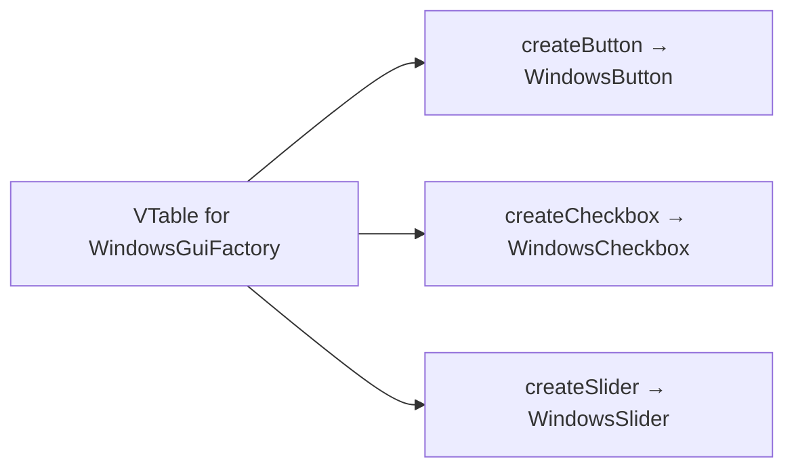
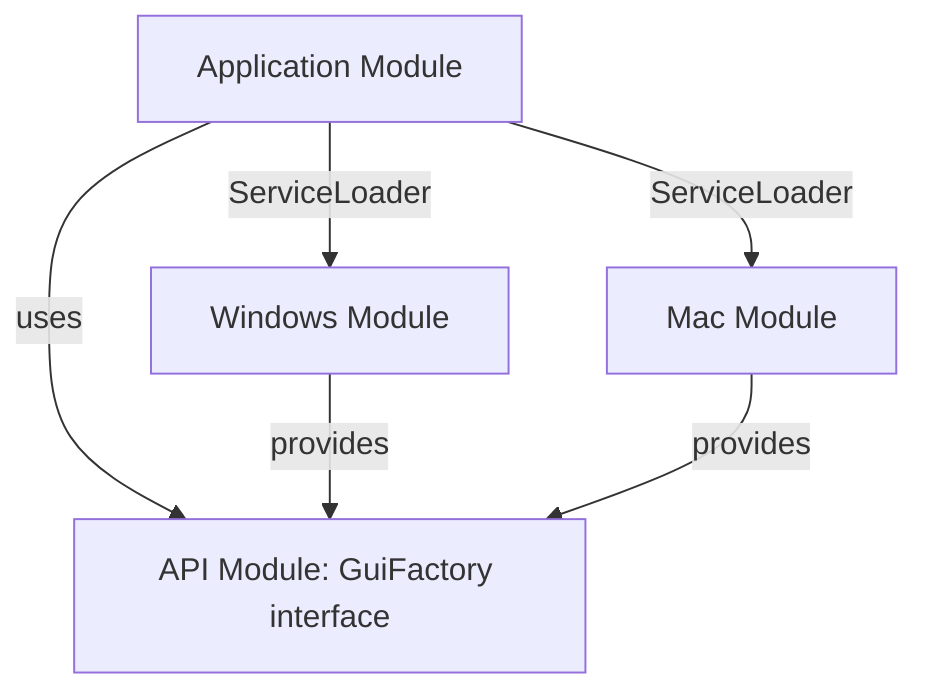

# Abstract Factory — Professional Level

> **Source:** [refactoring.guru/design-patterns/abstract-factory](https://refactoring.guru/design-patterns/abstract-factory)
> **Prerequisites:** [Junior](junior.md) · [Middle](middle.md) · [Senior](senior.md)
> **Focus:** **Under the hood**

---

## Table of Contents

1. [Introduction](#introduction)
2. [JVM Dispatch on Multiple Methods](#jvm-dispatch-on-multiple-methods)
3. [Generics & Erasure](#generics--erasure)
4. [Module Boundaries (JPMS)](#module-boundaries-jpms)
5. [GraalVM Native Image](#graalvm-native-image)
6. [Go Interface Tables for Multi-Method Factories](#go-interface-tables-for-multi-method-factories)
7. [Python Class Method Resolution](#python-class-method-resolution)
8. [Memory Profile](#memory-profile)
9. [Plugin Loading Across Classloaders](#plugin-loading-across-classloaders)
10. [Benchmarks](#benchmarks)
11. [Diagrams](#diagrams)
12. [Related Topics](#related-topics)

---

## Introduction

> Focus: runtime mechanics for multi-method factories

Abstract Factory has more "moving parts" than Factory Method — multiple methods, multiple Concrete Factories, family-consistency contracts. The runtime cost is **per-method-call**, not per-factory; the JIT optimization works the same way as for any virtual method, just multiplied by the number of factory methods.

The interesting professional questions:
- How does the JVM dispatch on a 10-method factory interface?
- What's the impact of generics on the family-typed approach?
- How do plugin classloaders affect Concrete Factory discovery?
- What does Go do differently with multi-method itabs?

This file goes through each.

---

## JVM Dispatch on Multiple Methods

A `GuiFactory` with three methods (`createButton`, `createCheckbox`, `createSlider`) compiles to:

```
class WindowsGuiFactory implements GuiFactory:
    public createButton()   LButton;
    public createCheckbox() LCheckbox;
    public createSlider()   LSlider;
```

The vtable for `WindowsGuiFactory` has slots for **all** of `GuiFactory`'s methods. Each `INVOKEINTERFACE` does:

1. Look up the receiver's class.
2. Find the interface method table (itable) for `GuiFactory`.
3. Index into it.
4. Call.

Cost: ~5-10 cycles cold; ~1-2 cycles after JIT inlines.

Per-method cost is the same as for Factory Method. The pattern's overhead is **N method calls** for N products in the family — totally proportional, no extra cost.

### Inline caches

HotSpot's polymorphic inline cache (PIC) tracks the receiver type per call site. If `factory.createButton()` always sees `WindowsGuiFactory`, it gets monomorphic optimization. If it sees both `WindowsGuiFactory` and `MacGuiFactory`, bimorphic. If 3+, megamorphic falls back to full dispatch.

In practice, an Abstract Factory **rarely sees more than one type per call site** (the family is fixed at startup), so monomorphic inlining is the norm.

---

## Generics & Erasure

The family-typed approach in Java:

```java
interface ProductFamily<B extends Button, C extends Checkbox> {
    B createButton();
    C createCheckbox();
}
```

At runtime, erasure reduces this to:

```java
interface ProductFamily {
    Button   createButton();
    Checkbox createCheckbox();
}
```

The **type safety is compile-time only**. Bridge methods cast Object → Button/Checkbox at the call site. This is normal Java behavior, but it means **runtime mixing of variants is not prevented**.

Example exploit:

```java
ProductFamily<WindowsButton, WindowsCheckbox> winFamily = ...;
@SuppressWarnings("unchecked")
ProductFamily<MacButton, MacCheckbox> badCast = (ProductFamily<MacButton, MacCheckbox>) (ProductFamily) winFamily;
MacButton wrong = badCast.createButton();   // ClassCastException at runtime
```

You can't smuggle a `WindowsButton` into a Mac context without a cast — and that cast will fail. The JVM enforces the actual type, just not the generic parameter.

### Workaround: TypeToken / Class<T>

When you need genuine runtime family-checking:

```java
abstract class TypedFactory<B extends Button> {
    private final Class<B> buttonClass;
    protected TypedFactory(Class<B> bc) { this.buttonClass = bc; }
    public boolean isButtonType(Object o) { return buttonClass.isInstance(o); }
}
```

Generally, this isn't worth the complexity. Tests are simpler.

---

## Module Boundaries (JPMS)

In Java 9+ with JPMS, Abstract Factories cross module boundaries via the `provides...with` clause:

```java
// module-info.java
module com.example.windows {
    requires com.example.gui.api;       // for GuiFactory interface
    provides com.example.gui.api.GuiFactory with com.example.windows.WindowsGuiFactory;
}
```

Discovery via `ServiceLoader`:

```java
ServiceLoader<GuiFactory> loader = ServiceLoader.load(GuiFactory.class);
GuiFactory chosen = loader.stream()
    .map(ServiceLoader.Provider::get)
    .filter(f -> f.platform().equals(detectOs()))
    .findFirst()
    .orElseThrow();
```

This means: **modules are the "family axis."** Each module provides one Concrete Factory.

### Tradeoffs

- **Strong isolation:** module boundaries prevent leaking concrete types.
- **Discovery automation:** `ServiceLoader` finds factories without manual wiring.
- **Build-time cost:** module configuration.
- **Native-image friendly:** GraalVM AOT works with explicit `provides` declarations.

---

## GraalVM Native Image

Native Image's closed-world assumption requires:

1. All `Concrete Factory` classes reachable at build time.
2. Reflection on factory products configured if used.
3. `ServiceLoader` integration via `--initialize-at-build-time`.

Build command:

```bash
native-image \
    --initialize-at-build-time=com.example.gui.WindowsGuiFactory,com.example.gui.MacGuiFactory \
    --enable-preview \
    -H:ReflectionConfigurationFiles=reflect.json \
    com.example.App
```

For dynamic plugin systems (load factories from JARs at runtime), Native Image is **not a good fit** — the closed-world assumption forbids late-bound classes.

For known-at-build-time factories (the common case), Native Image works smoothly.

---

## Go Interface Tables for Multi-Method Factories

A Go factory interface with N methods generates an **itab** with N function-pointer slots:

```go
type GUIFactory interface {
    CreateButton()   Button
    CreateCheckbox() Checkbox
    CreateSlider()   Slider
}
```

For each `(GUIFactory, ConcreteFactory)` pair, Go generates one itab containing function pointers for all 3 methods. Cost: one cache-aligned cell of ~56 bytes per pair.

Example: `WindowsFactory` implementing `GUIFactory` produces:

```
itab(GUIFactory → WindowsFactory) {
    *createButtonFn    → WindowsFactory.CreateButton
    *createCheckboxFn  → WindowsFactory.CreateCheckbox
    *createSliderFn    → WindowsFactory.CreateSlider
}
```

Per-call cost: load itab pointer, index, indirect call — same as Factory Method, regardless of how many methods the factory has.

### Adding methods to interface — major caveat

In Go, adding a method to an interface **breaks all implementations** — they fail to compile until they implement it. Unlike Java's `default` methods, Go has no graceful evolution path for interfaces.

Workaround: use **interface composition**:

```go
type GUIFactoryV1 interface {
    CreateButton()   Button
    CreateCheckbox() Checkbox
}

type GUIFactoryV2 interface {
    GUIFactoryV1
    CreateSlider() Slider
}
```

Old factories satisfy V1; new ones satisfy V2. Code requiring sliders demands V2.

---

## Python Class Method Resolution

A Python `ConcreteFactory` extends `AbstractFactory`. Method calls dispatch via the **method resolution order (MRO)**:

```python
class GuiFactory:
    def create_button(self): ...
    def create_checkbox(self): ...

class WindowsFactory(GuiFactory):
    def create_button(self): return WindowsButton()
    def create_checkbox(self): return WindowsCheckbox()

f = WindowsFactory()
f.create_button()
# MRO lookup: WindowsFactory → GuiFactory → object
# Found in WindowsFactory; called.
```

Cost: ~150-200 ns per method call (dictionary lookup, then function call).

For factories with **many methods**, the cost scales linearly. Caching the bound method:

```python
make = f.create_button   # bound method
b = make()               # subsequent calls slightly faster
```

In practice, for Python application code, factory dispatch is negligible.

### Multiple inheritance / mixin Concrete Factories

```python
class WindowsBaseFactory:
    def create_button(self): return WindowsButton()

class HighDPIFactory:
    def create_button(self):
        b = super().create_button()
        b.scale = 2.0
        return b

class HighDPIWindowsFactory(HighDPIFactory, WindowsBaseFactory):
    pass
```

MRO ensures `HighDPIFactory.create_button` runs first, calls `super()` → `WindowsBaseFactory.create_button`. Cooperative multiple inheritance lets you compose Concrete Factories from mixins.

---

## Memory Profile

### Java

- **Class metadata** in Metaspace: ~1-2 KB per Concrete Factory.
- **Singleton instance:** ~16-32 bytes.
- **Per call:** instance allocation depends on product.

For a UI toolkit with 3 product types and 5 OS variants: 15 product classes + 5 factory classes ≈ 20-40 KB Metaspace. Negligible.

### Go

- **itab per (interface, type) pair:** ~56 bytes.
- 5 variants × 1 interface = 5 itabs ≈ 280 bytes total in `.rodata`.

### Python

- **Class object:** ~600 bytes.
- 5 Concrete Factories ≈ 3 KB.
- Plus method dictionaries.

### Practical conclusion

Memory is never the bottleneck for Abstract Factory hierarchies. Object instances dominate.

---

## Plugin Loading Across Classloaders

When Concrete Factories live in plugin JARs:

```java
URLClassLoader pluginCL = new URLClassLoader(new URL[]{pluginJar});
Class<?> factoryClass = pluginCL.loadClass("com.example.PluginFactory");
GuiFactory factory = (GuiFactory) factoryClass.getDeclaredConstructor().newInstance();
```

Caveats:

1. **`GuiFactory`** must come from a **shared classloader** (the host's), not the plugin's, or the cast fails.
2. **Plugin's `Concrete Factory` retains the plugin classloader** until all factory products are released.
3. **Memory leak:** any retained product (even one) prevents the plugin classloader from being collected.

### Mitigation: Service Loader + Layer (JPMS)

Java 9 module layers are the right answer:

```java
ModuleLayer parent = ModuleLayer.boot();
Configuration cf = parent.configuration().resolve(ModuleFinder.of(pluginPath), ModuleFinder.of(), Set.of("com.plugin"));
ModuleLayer pluginLayer = parent.defineModulesWithOneLoader(cf, ClassLoader.getSystemClassLoader());

ServiceLoader<GuiFactory> sl = ServiceLoader.load(pluginLayer, GuiFactory.class);
```

Each plugin runs in its own layer with its own classloader, but the `GuiFactory` interface is shared with the host.

---

## Benchmarks

Apple M2, single thread.

### Java (JMH)

```
Benchmark                                Mode  Cnt    Score   Error  Units
DirectNew                               thrpt   10  500M   ±  5M  ops/s
AbstractFactory_monomorphic_oneMethod   thrpt   10  490M   ±  5M  ops/s
AbstractFactory_monomorphic_threeMethods thrpt   10  490M   ±  5M  ops/s   (per-method)
AbstractFactory_megamorphic             thrpt   10  150M   ±  3M  ops/s
ServiceLoader_lookup                    thrpt   10   50M   ±  1M  ops/s   (cached)
```

### Go

```
BenchmarkConcreteFactory_DirectStruct-8     500M    2.0 ns/op
BenchmarkAbstractFactory_Interface-8        300M    3.5 ns/op
BenchmarkAbstractFactory_3Methods-8         300M    3.5 ns/op   (each)
```

### Python (CPython 3.12)

```
Direct construction                  150 ns
Abstract Factory method call         220 ns
Abstract Factory + 3 methods         660 ns total (3 × ~220 ns)
```

### Conclusions

1. **Per-method overhead is constant** — adding more methods to the family doesn't slow each call.
2. **Multiple method calls** (creating a full family) cost N × per-method overhead.
3. **Megamorphic call sites** kill JIT optimization — keep concrete factory choices stable in hot paths.
4. **Go's overhead per method** is higher than Java's (no inlining of interface calls), but absolute numbers are similar.

---

## Diagrams

### Itable Layout



### JPMS Module Provider



---

## Related Topics

- **Practice:** [Tasks](tasks.md), [Find-Bug](find-bug.md), [Optimize](optimize.md), [Interview](interview.md)
- **JVM internals:** *Java Performance: The Definitive Guide*, Chapter 4 (compiled code).
- **JPMS:** *Java 9 Modularity* (Sander Mak), Chapter 5 (services).
- **Go interfaces:** *The Go Programming Language*, Chapter 7.

---

[← Senior](senior.md) · [Creational](../README.md) · [Roadmap](../../../README.md) · **Next:** [Interview](interview.md)
