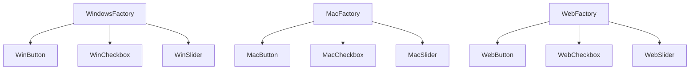
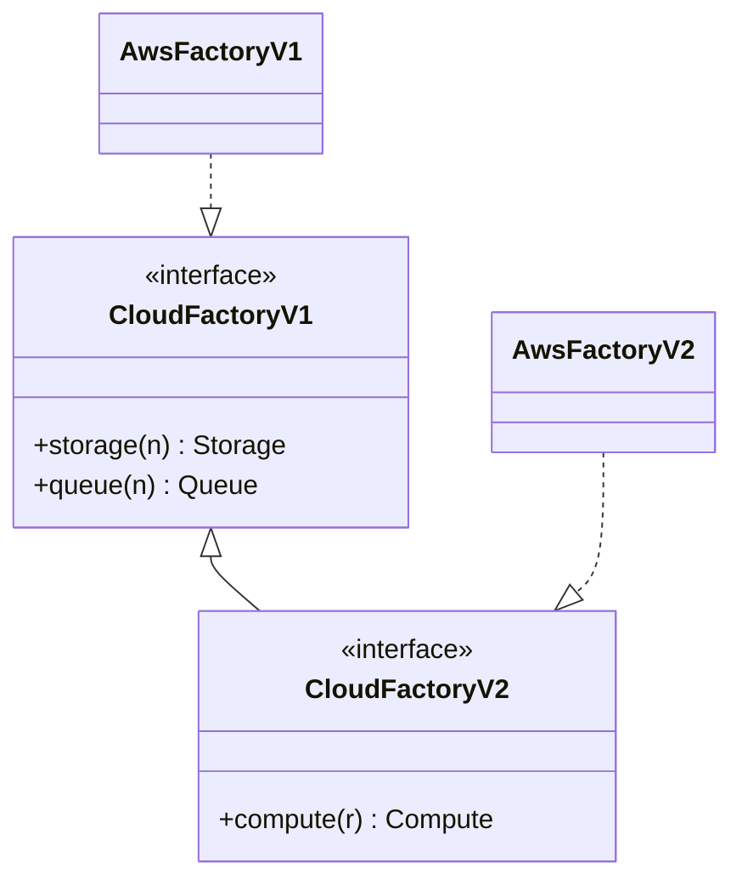

# Abstract Factory — Senior Level

> **Source:** [refactoring.guru/design-patterns/abstract-factory](https://refactoring.guru/design-patterns/abstract-factory)
> **Prerequisites:** [Junior](junior.md) · [Middle](middle.md)
> **Focus:** **architecture** and **optimization**

---

## Table of Contents

1. [Introduction](#introduction)
2. [Architectural Patterns](#architectural-patterns)
3. [Family Consistency at Scale](#family-consistency-at-scale)
4. [Concurrency](#concurrency)
5. [Performance](#performance)
6. [Testability Strategies](#testability-strategies)
7. [Versioning and Evolution](#versioning-and-evolution)
8. [Code Examples — Advanced](#code-examples--advanced)
9. [When Abstract Factory Becomes a Liability](#when-abstract-factory-becomes-a-liability)
10. [Trade-off Analysis Matrix](#trade-off-analysis-matrix)
11. [Migration Patterns](#migration-patterns)
12. [Diagrams](#diagrams)
13. [Related Topics](#related-topics)

---

## Introduction

> Focus: **architecture** and **optimization**

Abstract Factory at the senior level is a **system-design lever**: it controls *how variability is partitioned* in the system. The variant axis (which family) gets first-class status; the product-type axis is the more rigid one.

Senior decisions:

- Does this system have *real* product families, or just multiple unrelated factories?
- How will the family interface evolve over the next 3 years?
- Where does Abstract Factory hand off to DI?
- How do we test cross-family coordination?
- What happens at module / classloader / plugin boundaries?

This file tackles each.

---

## Architectural Patterns

### Abstract Factory + Singleton

Concrete Factories are usually stateless — there's no benefit to multiple instances. The convention:

```java
public final class WindowsGuiFactory implements GuiFactory {
    private static final WindowsGuiFactory INSTANCE = new WindowsGuiFactory();
    private WindowsGuiFactory() {}
    public static WindowsGuiFactory getInstance() { return INSTANCE; }
    // ...
}
```

This avoids re-creating factories. See [Singleton](../05-singleton/junior.md).

### Abstract Factory + Prototype

When products are expensive to construct from scratch, the factory keeps a prototype and clones:

```java
class FastFactory implements GuiFactory {
    private final Button   protoButton   = new ExpensiveButton();
    private final Checkbox protoCheckbox = new ExpensiveCheckbox();

    public Button   createButton()   { return protoButton.clone(); }
    public Checkbox createCheckbox() { return protoCheckbox.clone(); }
}
```

See [Prototype](../04-prototype/junior.md).

### Abstract Factory + Builder

When a product within a family needs multi-step construction, the factory's method delegates to a Builder:

```java
class AwsFactory implements CloudFactory {
    public BlobStore blobStore(String bucket) {
        return new S3BlobStoreBuilder()
            .bucket(bucket)
            .region("us-east-1")
            .encryption(SSE_S3)
            .build();
    }
}
```

See [Builder](../03-builder/junior.md).

### Abstract Factory + Bridge

Bridge pattern uses Abstract Factory to wire abstraction with implementor:

```java
class ShapeRenderer {
    private final RenderFactory factory;
    public ShapeRenderer(RenderFactory factory) { this.factory = factory; }
    public void draw(Shape s) {
        Brush brush = factory.createBrush();
        Canvas canvas = factory.createCanvas();
        s.draw(brush, canvas);
    }
}
```

See [Bridge](../../02-structural/02-bridge/junior.md).

---

## Family Consistency at Scale

### The contract

A family is *internally consistent* if:

1. Products from the same factory **work together** (no runtime errors).
2. Products from the same factory **share characteristics** (visual style, performance class, platform).
3. Mixing variants is **detectable** in tests.

### Compile-time enforcement (Java/Kotlin/Scala)

Use **path-dependent types** (Scala) or **family generic parameter**:

```scala
trait GuiFactory {
  type Btn <: Button
  type Chk <: Checkbox
  def createButton: Btn
  def createCheckbox: Chk
}

class WindowsGuiFactory extends GuiFactory {
  override type Btn = WindowsButton
  override type Chk = WindowsCheckbox
  def createButton  = new WindowsButton
  def createCheckbox = new WindowsCheckbox
}
```

Now `factory.createButton` returns a `Btn` specific to the factory — preventing mix-ups at the type system level.

In Java, generic parameters can simulate this:

```java
interface GuiFactory<B extends Button, C extends Checkbox> {
    B createButton();
    C createCheckbox();
}

class WindowsGuiFactory implements GuiFactory<WindowsButton, WindowsCheckbox> { ... }
```

But verbose. Most Java codebases enforce family consistency by convention + tests.

### Runtime enforcement

Periodic assertion:

```java
public abstract class GuiFactory {
    public abstract Button   createButton();
    public abstract Checkbox createCheckbox();

    public final void assertConsistent() {
        Button   b = createButton();
        Checkbox c = createCheckbox();
        if (!b.style().equals(c.style())) {
            throw new IllegalStateException("Family mismatch in " + getClass());
        }
    }
}
```

Run this assertion in tests; optionally in dev mode at app startup.

### Property-based tests

For each Concrete Factory, assert all created products share a `style()` or other family marker:

```java
@Test
void factoryProducesConsistentFamily() {
    Stream.of(new WindowsGuiFactory(), new MacGuiFactory()).forEach(f -> {
        Button b = f.createButton();
        Checkbox c = f.createCheckbox();
        assertEquals(b.platform(), c.platform());
    });
}
```

---

## Concurrency

### Are factories themselves thread-safe?

**Stateless factories are thread-safe.** All major examples (UI, cloud, dialect) are stateless — they only need to know which family they represent.

```java
class WindowsGuiFactory implements GuiFactory {
    public Button createButton() { return new WindowsButton(); }   // stateless ✓
}
```

If a factory holds state (configuration, connection pool, cache), serialize access:

```java
class CachingFactory implements GuiFactory {
    private final ConcurrentHashMap<String, Button> cache = new ConcurrentHashMap<>();
    public Button createButton() {
        return cache.computeIfAbsent("default", k -> new ExpensiveButton());
    }
}
```

### Are products thread-safe?

A product returned by the factory is its own concern. The factory's contract should specify whether products are safe to share:

- **"Each call returns a fresh instance"** — products needn't be shared-thread-safe.
- **"Calls may return the same instance"** — products *must* be thread-safe (or the contract is "do not mutate after creation").

### Switching factories at runtime

Don't, generally. If you must (e.g., theme change at runtime), use atomic pointer:

```java
private final AtomicReference<GuiFactory> currentFactory = new AtomicReference<>(new LightTheme());

public void switchTheme(GuiFactory next) { currentFactory.set(next); }

public Button getButton() { return currentFactory.get().createButton(); }
```

Existing products aren't replaced — only future creations use the new factory.

---

## Performance

### Cost of factory dispatch

A `factory.createButton()` call is one virtual dispatch (~3-5 ns) plus product construction. Factory overhead is in the noise compared to typical product construction (which often involves I/O or memory allocation).

### Caching

Stateless products can be safely cached:

```java
class WindowsGuiFactory implements GuiFactory {
    private static final Button   B = new WindowsButton();
    private static final Checkbox C = new WindowsCheckbox();
    public Button   createButton()   { return B; }
    public Checkbox createCheckbox() { return C; }
}
```

But: callers expecting fresh objects will be surprised. Document the contract.

### Lazy creation

Cold-start optimization:

```java
class LazyFactory implements GuiFactory {
    private volatile Button buttonProto;
    public Button createButton() {
        Button p = buttonProto;
        if (p == null) {
            synchronized (this) {
                if (buttonProto == null) buttonProto = new ExpensiveButton();
                p = buttonProto;
            }
        }
        return p.clone();
    }
}
```

Products created on first request, then cloned. Combines Abstract Factory + lazy Singleton + Prototype.

### When *not* to cache

Mutable products. Example: Postgres `Connection` — must be per-thread or per-request, never shared.

---

## Testability Strategies

### 1. Mock factory entirely

```java
GuiFactory mockFactory = mock(GuiFactory.class);
when(mockFactory.createButton()).thenReturn(mockButton);
when(mockFactory.createCheckbox()).thenReturn(mockCheckbox);

// Test
new App(mockFactory).render();
verify(mockButton).render();
```

Standard approach for unit tests of code that uses an Abstract Factory.

### 2. Test factory family consistency

Per-Concrete-Factory test:

```java
@Test
void awsFactoryProducesAwsProducts() {
    var f = new AwsCloudFactory(awsCfg);
    assertThat(f.storage("x")).isInstanceOf(S3BlobStore.class);
    assertThat(f.queue("y")).isInstanceOf(SqsQueue.class);
}
```

### 3. Use a "TestFactory" for integration tests

```java
class TestCloudFactory implements CloudFactory {
    public Storage storage(String n) { return new InMemoryStorage(); }
    public Queue   queue(String n)   { return new InMemoryQueue(); }
}
```

In integration tests, the entire family is in-memory — fast, no network, no cleanup.

### 4. Contract tests

Run the same test suite against multiple Concrete Factories:

```java
@ParameterizedTest
@MethodSource("allFactories")
void allFactoriesPassContract(CloudFactory factory) {
    Storage s = factory.storage("test");
    s.put("a", "1".getBytes());
    assertThat(s.get("a")).contains("1");
}

static Stream<CloudFactory> allFactories() {
    return Stream.of(new InMemoryFactory(), new AwsFactory(testAwsCfg));
}
```

This validates that Concrete Factories produce products satisfying the same contract.

---

## Versioning and Evolution

Abstract Factory interfaces are **API surface**. Changes hit every implementor.

### Adding a new product type

| Approach | Effect |
|---|---|
| Add to interface | Breaks all existing factories |
| Default method (Java 8+) | Backward compatible; throws or returns null by default |
| New abstract factory (V2) | Old factories untouched, new ones implement V2 |
| Composition | Wrap; existing factory provides what it can, new factory adds the new type |

```java
// V1
interface CloudFactoryV1 {
    Storage storage(String n);
    Queue   queue(String n);
}

// V2 — adds Compute
interface CloudFactoryV2 extends CloudFactoryV1 {
    Compute compute(String region);
}
```

Now V1 implementors keep working; V2 implementors get the new method. Code that needs `compute` requires V2.

### Removing a product type

Deprecate, then remove. Watch for downstream consumers.

### Splitting a factory

When the family grows too wide:

```java
interface CloudFactory {
    StorageFamily storageFamily();
    QueueFamily   queueFamily();
}

interface StorageFamily { Blob blob(); KV kv(); }
interface QueueFamily   { Topic topic(); FIFO fifo(); }
```

Sub-factories. Each is its own Abstract Factory.

---

## Code Examples — Advanced

### Java — Generic Family Type

```java
public interface ProductFamily<B, C, S> {
    B createButton();
    C createCheckbox();
    S createSlider();
}

public final class WindowsFamily implements ProductFamily<WindowsButton, WindowsCheckbox, WindowsSlider> {
    public WindowsButton   createButton()   { return new WindowsButton(); }
    public WindowsCheckbox createCheckbox() { return new WindowsCheckbox(); }
    public WindowsSlider   createSlider()   { return new WindowsSlider(); }
}
```

Type system enforces family consistency.

### Python — Registry-Backed Abstract Factory

```python
from abc import ABC, abstractmethod
from typing import Type

class ThemeFactory(ABC):
    @abstractmethod
    def make_button(self) -> Button: ...
    @abstractmethod
    def make_checkbox(self) -> Checkbox: ...

_REGISTRY: dict[str, Type[ThemeFactory]] = {}

def theme(name: str):
    def deco(cls):
        _REGISTRY[name] = cls
        return cls
    return deco

@theme("light")
class LightTheme(ThemeFactory):
    def make_button(self): return LightButton()
    def make_checkbox(self): return LightCheckbox()

@theme("dark")
class DarkTheme(ThemeFactory):
    def make_button(self): return DarkButton()
    def make_checkbox(self): return DarkCheckbox()

def get_theme(name: str) -> ThemeFactory:
    return _REGISTRY[name]()
```

Adding a theme = one decorated class. Fully extensible.

### Go — Provider Interface for Cloud SDK

```go
package cloud

import "context"

type Provider interface {
    Storage(name string) Storage
    Queue(name string)   Queue
}

// Variant: AWS
type aws struct{ cfg AwsConfig }

func (a *aws) Storage(name string) Storage { return &s3{a.cfg, name} }
func (a *aws) Queue(name string)   Queue   { return &sqs{a.cfg, name} }

// Variant: GCP
type gcp struct{ cfg GcpConfig }

func (g *gcp) Storage(name string) Storage { return &gcs{g.cfg, name} }
func (g *gcp) Queue(name string)   Queue   { return &pubsub{g.cfg, name} }

// Variant: in-memory (for tests/dev)
type local struct{}

func (local) Storage(name string) Storage { return newMemoryStorage() }
func (local) Queue(name string)   Queue   { return newMemoryQueue() }

// Selector — one place for the variant decision
func New(kind string, cfg map[string]any) (Provider, error) {
    switch kind {
    case "aws":   return &aws{cfg: AwsConfigFrom(cfg)}, nil
    case "gcp":   return &gcp{cfg: GcpConfigFrom(cfg)}, nil
    case "local": return local{}, nil
    }
    return nil, fmt.Errorf("unknown provider: %s", kind)
}
```

The application's main wires `cloud.New(...)` once; everything else uses the abstract `Provider`.

---

## When Abstract Factory Becomes a Liability

### Symptom 1: Factory has 15+ methods

The "family" has grown too wide. Split into sub-factories.

### Symptom 2: Many Concrete Factories share 80% of their code

Use inheritance or composition for the shared part. Or: realize the variants aren't actually different and collapse them.

### Symptom 3: Factory needs increasingly complex configuration

Push configuration to a Builder. The factory itself takes configured Builders.

### Symptom 4: Factory dispatches dynamically based on a runtime parameter inside its own method

That's a Simple Factory inside an Abstract Factory — a smell. Refactor to flat dispatch.

### Symptom 5: Tests can't mock the factory cleanly

Often a sign that the factory has too many responsibilities. Smaller, focused factories are easier to mock.

---

## Trade-off Analysis Matrix

| Approach | Family consistency | Adding variant | Adding type | Boilerplate | Use case |
|---|---|---|---|---|---|
| **Classic Abstract Factory** | Structural | Easy | Hard | High | Stable type set, varying family |
| **Default method extension** | Structural | Easy | Easy (new methods optional) | Medium | Evolving type set |
| **DI container** | Configuration | Easy | Easy | Low (config-heavy) | Enterprise apps |
| **Multiple factory methods** | Convention | Easy | Easy | Medium | Loose family |
| **Path-dependent types (Scala)** | Type system | Easy | Hard | Low | Strongly-typed FP |

---

## Migration Patterns

### Abstract Factory → DI

When the codebase outgrows manual factory wiring:

1. Extract Concrete Factory's products as separate beans/services.
2. Configure DI to bind the variant's beans for each environment/profile.
3. Replace `factory.createX()` with `@Inject X` (or constructor injection).
4. Delete the Abstract Factory interface; the DI container *is* the factory.

```java
// Before
class App {
    public App(GuiFactory f) { ... f.createButton() ... }
}

// After
class App {
    @Inject Button   button;
    @Inject Checkbox checkbox;
}

// DI configuration
@Profile("windows")
@Configuration
class WindowsConfig {
    @Bean Button   button()   { return new WindowsButton(); }
    @Bean Checkbox checkbox() { return new WindowsCheckbox(); }
}
```

### Abstract Factory → Multiple Builders

When factory methods get complex:

```java
// Before
factory.createButton();   // hard-coded options

// After
factory.buttonBuilder()
    .label("Save")
    .icon("disk.png")
    .keyboardShortcut("Ctrl+S")
    .build();
```

The factory hands out Builders, which are themselves factories for one product.

### Abstract Factory → Functional Adapters (Go style)

```go
// Before — heavy interfaces
type Factory interface {
    Storage(name string) Storage
    Queue(name string)   Queue
}

// After — functional
type StorageOpener func(name string) Storage
type QueueOpener   func(name string) Queue

func WireAws(cfg AwsConfig) (StorageOpener, QueueOpener) {
    return openS3(cfg), openSqs(cfg)
}
```

The two functions returned are the family. Less ceremony, but loses the "single interface" benefit.

---

## Diagrams

### Three-Variant × Three-Type Family



### Factory Versioning



---

## Related Topics

- **Next:** [Abstract Factory — Professional](professional.md)
- **Practice:** [Tasks](tasks.md), [Find-Bug](find-bug.md), [Optimize](optimize.md), [Interview](interview.md)
- **Companions:** [Singleton](../05-singleton/junior.md), [Builder](../03-builder/junior.md), [Prototype](../04-prototype/junior.md), [Bridge](../../02-structural/02-bridge/junior.md)
- **Modern alternative:** Dependency Injection containers

---

[← Middle](middle.md) · [Creational](../README.md) · [Roadmap](../../../README.md) · **Next:** [Professional](professional.md)
