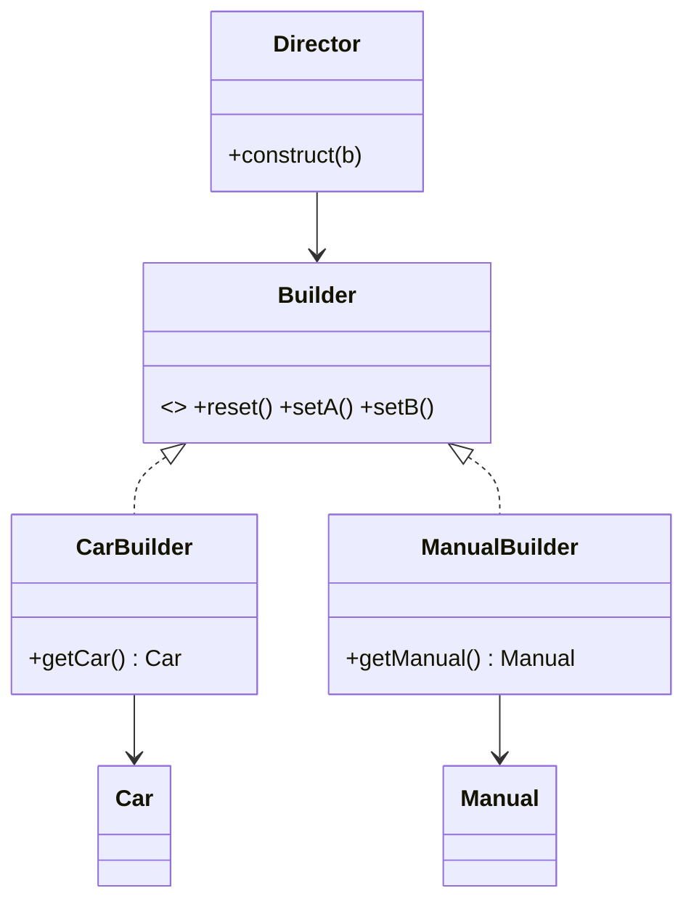
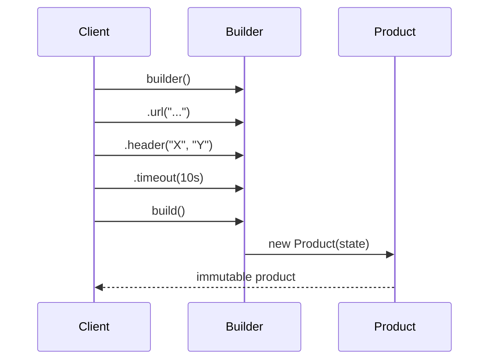

# Builder — Junior Level

> **Source:** [refactoring.guru/design-patterns/builder](https://refactoring.guru/design-patterns/builder)
> **Category:** [Creational](../README.md)

---

## Table of Contents

1. [Introduction](#introduction)
2. [Prerequisites](#prerequisites)
3. [Glossary](#glossary)
4. [Core Concepts](#core-concepts)
5. [Real-World Analogies](#real-world-analogies)
6. [Mental Models](#mental-models)
7. [Pros & Cons](#pros--cons)
8. [Use Cases](#use-cases)
9. [Code Examples](#code-examples)
10. [Coding Patterns](#coding-patterns)
11. [Clean Code](#clean-code)
12. [Best Practices](#best-practices)
13. [Edge Cases & Pitfalls](#edge-cases--pitfalls)
14. [Common Mistakes](#common-mistakes)
15. [Tricky Points](#tricky-points)
16. [Test Yourself](#test-yourself)
17. [Cheat Sheet](#cheat-sheet)
18. [Summary](#summary)
19. [Further Reading](#further-reading)
20. [Related Topics](#related-topics)
21. [Diagrams](#diagrams)

---

## Introduction

> Focus: **What is it?** and **How to use it?**

**Builder** is a creational design pattern that lets you **construct complex objects step by step**. The pattern allows you to produce different types and representations of an object using the same construction code.

In one sentence: instead of one massive constructor with 15 parameters (most of them optional), you call a series of small methods like `.withName(...)`, `.withTimeout(...)`, then `.build()`.

### Why this matters

Imagine an HTTP client constructor:

```java
new HttpClient(timeout, retries, proxy, tls, connectionPool, userAgent, headers, cookies, ...)
```

Even with named parameters, the call site is hard to read. Worse: most fields are optional. The "telescoping constructor" anti-pattern emerges:

```java
new HttpClient(timeout)
new HttpClient(timeout, retries)
new HttpClient(timeout, retries, proxy)
// ... 10 overloads ...
```

Builder solves both:

```java
HttpClient.builder()
    .timeout(Duration.ofSeconds(10))
    .retries(3)
    .proxy(Proxy.HTTP("proxy.example.com:8080"))
    .build();
```

Each step is named, optional, and chainable.

---

## Prerequisites

- **Required:** Constructors and basic OOP.
- **Required:** Method chaining concept (return `this` / `self`).
- **Helpful:** Familiarity with [Factory Method](../01-factory-method/junior.md) — Builder is often confused with it.

---

## Glossary

| Term | Definition |
|------|-----------|
| **Builder** | The interface declaring the construction steps. |
| **Concrete Builder** | An implementation; produces a specific product representation. |
| **Product** | The complex object being built. |
| **Director** | (Optional) An object that knows the recipe — what steps to call in what order. |
| **Step** | A single method like `setColor`, `addEngine`. |
| **Fluent interface** | API where each step returns the builder, enabling chaining. |
| **Telescoping constructor** | An anti-pattern of overloaded constructors that Builder solves. |

---

## Core Concepts

### 1. Construction is multi-step

Each step is a method on the Builder. Steps may be optional, repeatable, or required.

### 2. The product is built incrementally

The Builder accumulates state. The final `build()` (or `getProduct()`) returns the assembled product.

### 3. Different builders = different representations

For one product type, multiple Concrete Builders may exist. Example: `HtmlMessageBuilder` and `PlainTextMessageBuilder` both build a `Message`, but in different formats.

### 4. The Director (optional) encapsulates recipes

```
director.constructSportsCar(builder);   // calls builder.setEngine("V8").setSeats(2)...
director.constructSUV(builder);         // different sequence
```

The Director knows the recipe; the Builder knows how to execute each step.

---

## Real-World Analogies

| Concept | Analogy |
|---|---|
| **Builder** | A chef following recipe steps (chop, sauté, simmer, plate). |
| **Concrete Builder** | A specific cuisine — Italian chef vs Japanese chef. Same step names, different ingredients. |
| **Product** | The dish at the end. |
| **Director** | The cookbook with recipes. |
| **Refactoring.guru's analogy** | Car manufacturing: same construction steps produce a sports car, an SUV, or a truck depending on which builder is used. |

---

## Mental Models

**The intuition:** *"Build it piece by piece, then ask for the result."*

```
        builder
          │
   ┌──────┼──────┐
   ▼      ▼      ▼
 step1  step2  step3 ...
   │      │      │
   └──┬───┴──┬───┘
      ▼      ▼
    accumulated state
          │
        build()
          │
          ▼
       Product
```

Compare to direct `new`:

```
new T(a, b, c, d, e, f, g, h)   // unreadable
```

Compare to the `with...` builder:

```
T.builder().a(1).b(2).c(3).build();   // self-documenting
```

---

## Pros & Cons

| Pros | Cons |
|------|------|
| Construct objects step-by-step | More classes / boilerplate |
| Reuse construction code across variants | Builder must validate completeness before `build()` |
| Single Responsibility — construction separate from business logic | Director adds another moving part |
| Avoids telescoping constructors | Overkill for simple objects |
| Fluent / chainable interface | Mutability of the builder during construction is a gotcha |

### When to use:
- Complex objects with many optional fields.
- Multiple representations of the same object (HTML / plain / JSON message).
- Validation needed before final assembly.
- The construction process should be reusable across variants.

### When NOT to use:
- The object has 2-3 fields, all required. Use a constructor.
- Construction is single-step. Use Factory Method or direct `new`.

---

## Use Cases

- **HTTP clients** — `OkHttpClient.Builder`, Java 11+ `HttpClient.newBuilder()`.
- **SQL query builders** — Knex.js, jOOQ, SQLAlchemy.
- **Configuration objects** — Spring `@ConfigurationProperties`, AWS SDK config.
- **Test data** — `User.builder().name("Alice").role("admin").build()` for fixtures.
- **Multi-format documents** — same content rendered as HTML, PDF, plaintext.
- **Game character creation** — race + class + items + stats step-by-step.

---

## Code Examples

### Java — Fluent Builder

```java
public final class HttpRequest {
    public final String url;
    public final String method;
    public final Map<String, String> headers;
    public final Duration timeout;
    public final byte[] body;

    private HttpRequest(Builder b) {
        this.url     = b.url;
        this.method  = b.method;
        this.headers = Map.copyOf(b.headers);
        this.timeout = b.timeout;
        this.body    = b.body;
    }

    public static Builder builder() { return new Builder(); }

    public static final class Builder {
        private String url;
        private String method = "GET";
        private final Map<String, String> headers = new HashMap<>();
        private Duration timeout = Duration.ofSeconds(30);
        private byte[] body = new byte[0];

        public Builder url(String url) { this.url = url; return this; }
        public Builder method(String m) { this.method = m; return this; }
        public Builder header(String k, String v) { this.headers.put(k, v); return this; }
        public Builder timeout(Duration t) { this.timeout = t; return this; }
        public Builder body(byte[] b) { this.body = b; return this; }

        public HttpRequest build() {
            if (url == null) throw new IllegalStateException("url is required");
            return new HttpRequest(this);
        }
    }
}

// Usage
HttpRequest req = HttpRequest.builder()
    .url("https://api.example.com/users")
    .method("POST")
    .header("Content-Type", "application/json")
    .timeout(Duration.ofSeconds(10))
    .body("{...}".getBytes())
    .build();
```

**Highlights:**
- Required fields validated in `build()`.
- Defaults set in builder fields.
- Product is **immutable** (final fields, copied collections).

---

### Python — Fluent Builder + dataclass

```python
from dataclasses import dataclass, field
from typing import Self

@dataclass(frozen=True)
class HttpRequest:
    url: str
    method: str = "GET"
    headers: dict[str, str] = field(default_factory=dict)
    timeout: float = 30.0
    body: bytes = b""

class HttpRequestBuilder:
    def __init__(self) -> None:
        self._url: str | None = None
        self._method: str = "GET"
        self._headers: dict[str, str] = {}
        self._timeout: float = 30.0
        self._body: bytes = b""

    def url(self, u: str) -> Self:        self._url = u; return self
    def method(self, m: str) -> Self:     self._method = m; return self
    def header(self, k: str, v: str) -> Self:
        self._headers[k] = v; return self
    def timeout(self, t: float) -> Self:  self._timeout = t; return self
    def body(self, b: bytes) -> Self:     self._body = b; return self

    def build(self) -> HttpRequest:
        if self._url is None:
            raise ValueError("url is required")
        return HttpRequest(
            url=self._url, method=self._method,
            headers=dict(self._headers), timeout=self._timeout,
            body=self._body,
        )

# Usage
req = (HttpRequestBuilder()
       .url("https://api.example.com")
       .method("POST")
       .header("Content-Type", "application/json")
       .build())
```

> **Pythonic alternative:** for simple cases, `@dataclass(frozen=True)` plus keyword arguments often replaces Builder entirely. Use Builder when you have validation, multi-step construction, or chained transformations.

---

### Go — Functional Options (the idiomatic alternative)

> **Go note:** classical Builder with mutable struct + fluent interface works in Go, but the **functional options pattern** is more idiomatic and used by the standard library (`http.Server`, `grpc.Server`).

```go
package httpx

import "time"

type Request struct {
    url     string
    method  string
    headers map[string]string
    timeout time.Duration
    body    []byte
}

// Option is a function that configures a Request.
type Option func(*Request)

func WithMethod(m string) Option           { return func(r *Request) { r.method = m } }
func WithHeader(k, v string) Option        { return func(r *Request) { r.headers[k] = v } }
func WithTimeout(t time.Duration) Option   { return func(r *Request) { r.timeout = t } }
func WithBody(b []byte) Option             { return func(r *Request) { r.body = b } }

// New is the "build" — combines defaults with caller-provided options.
func New(url string, opts ...Option) *Request {
    r := &Request{
        url:     url,
        method:  "GET",
        headers: map[string]string{},
        timeout: 30 * time.Second,
        body:    nil,
    }
    for _, opt := range opts {
        opt(r)
    }
    return r
}
```

```go
// Usage
req := httpx.New("https://api.example.com",
    httpx.WithMethod("POST"),
    httpx.WithHeader("Content-Type", "application/json"),
    httpx.WithTimeout(10*time.Second),
)
```

**Why functional options?**
- No mutable Builder struct.
- Composable: pass `[]Option` around, layer defaults.
- Type-safe: each option is a typed function.
- Standard in Go ecosystem.

A classical Builder in Go would also work but feels non-idiomatic. Functional options *are* the Go way of doing the Builder pattern.

---

## Coding Patterns

### Pattern 1: Step Builder (enforce required fields at compile time)

```java
public class HttpRequest {
    public interface UrlStep      { MethodStep url(String url); }
    public interface MethodStep   { OptionalStep method(String m); OptionalStep get(); }
    public interface OptionalStep {
        OptionalStep header(String k, String v);
        OptionalStep timeout(Duration t);
        HttpRequest build();
    }
    // Implementation: each step returns the next interface
}

// Usage
HttpRequest r = HttpRequest.url("...").get().header("X", "Y").build();
//                          ^^^^^^^^^^^^^^^^ compiler enforces order
```

The type system forces `url` and a method choice before optional fields.

### Pattern 2: Director + Multiple Builders

```java
class CarManualBuilder { /* same setSeats, setEngine, ... */ Manual getManual(); }
class CarBuilder       { /* same setSeats, setEngine, ... */ Car getCar(); }

class Director {
    void constructSportsCar(Builder b) {
        b.reset();
        b.setSeats(2); b.setEngine("V8"); b.setGPS(true);
    }
}
```

Both builders follow the same "recipe"; Director runs the recipe; each Builder produces its own product (Car, Manual).

### Pattern 3: Immutable Builder (rarely used, but sometimes)

Each step returns a *new* builder (no mutation):

```scala
case class Builder(url: Option[String] = None, method: String = "GET") {
  def withUrl(u: String): Builder    = copy(url = Some(u))
  def withMethod(m: String): Builder = copy(method = m)
  def build: Request = Request(url.get, method)
}
```

Common in Scala / FP languages. Each call creates a fresh builder.



---

## Clean Code

### Naming

| ❌ Bad | ✅ Good |
|---|---|
| `set(...)` (ambiguous) | `withTimeout(...)`, `header(...)`  |
| `set` everywhere | descriptive verbs: `withX`, `addY`, `enableZ` |
| `make()`, `get()` for the final step | `build()` (Java), `Build()` (Go), `build` (Python) |

### Required vs optional

Document required fields:

```java
/**
 * Sets the URL. <b>Required.</b>
 */
public Builder url(String url) { ... }
```

Or use Step Builder to enforce at compile time.

---

## Best Practices

1. **Validate in `build()`.** Throw `IllegalStateException` for invalid combinations.
2. **Make products immutable.** Final fields, copied collections.
3. **Default sensibly.** Most fields should have safe defaults.
4. **Document defaults clearly.**
5. **In Go, prefer functional options** over a Builder struct.
6. **Provide a `toBuilder()`** on the Product for "modify a copy" workflows:

```java
HttpRequest modified = original.toBuilder().header("X", "Y").build();
```

---

## Edge Cases & Pitfalls

- **Builder reused across products** — second `build()` may see leftover state. Reset between calls or document one-shot semantics.
- **Mutable builder + concurrent use** — race conditions if shared. Builders are single-threaded by default.
- **Builder of mutable products** — defeats the "build then freeze" intent. Make products immutable.
- **Forgetting required fields** — runtime error at `build()`. Step Builder solves at compile time.

---

## Common Mistakes

1. **Returning the Product from each step** instead of the Builder — breaks chaining.
2. **Not making the Product immutable** — callers mutate it after build, surprising others.
3. **Builder methods do business logic** — keep them pure mutation.
4. **Forgetting to copy mutable collections** — passing the same `List` reference into multiple Products.
5. **Builder state leaks across builds** — calling `build()` then mutating the builder mutates the prior product (if not copied).

---

## Tricky Points

- **Builder vs Factory Method.** Factory creates one product in one step; Builder builds one product in many steps.
- **Builder vs Abstract Factory.** Abstract Factory creates a *family* immediately; Builder creates *one product* incrementally.
- **Builder doesn't always need a Director.** Most Java codebases skip the Director — clients drive the builder directly.
- **In modern languages**, named parameters + default values + immutable records often replace Builder. Use Builder when validation, fluent ergonomics, or step-by-step construction add value.

---

## Test Yourself

1. What problem does Builder solve?
2. What's the difference between Builder and Factory Method?
3. What's "telescoping constructors"?
4. What's the role of the Director?
5. Why use functional options in Go instead of a Builder struct?

<details><summary>Answers</summary>

1. Building complex objects with many optional/configurable parts step-by-step, avoiding bloated constructors.
2. Factory: one step → one product. Builder: many steps → one product, possibly multiple representations.
3. The anti-pattern of overloaded constructors with progressively more parameters: `T(a)`, `T(a, b)`, `T(a, b, c)`, etc.
4. Encapsulates the "recipe" — what steps in what order — separately from the Builder's "how each step works."
5. Functional options are composable, type-safe, and idiomatic in Go. They achieve the same goal without a mutable Builder struct.

</details>

---

## Cheat Sheet

```java
// Java
T t = T.builder().a(1).b(2).build();
```

```python
# Python
t = TBuilder().a(1).b(2).build()
```

```go
// Go (functional options)
t := New(opts.WithA(1), opts.WithB(2))
```

---

## Summary

- Builder = step-by-step construction of complex objects.
- Solves telescoping constructors and excessive overloads.
- Often paired with **Director** for canned recipes.
- In Go, **functional options** are the idiomatic equivalent.
- Make products immutable; validate in `build()`.

---

## Further Reading

- [refactoring.guru/design-patterns/builder](https://refactoring.guru/design-patterns/builder)
- *Effective Java* (Joshua Bloch), Item 2 — "Consider a builder when faced with many constructor parameters"
- Go functional options: Dave Cheney's blog, "Functional options for friendly APIs"

---

## Related Topics

- **Next:** [Builder — Middle](middle.md)
- **Companion:** [Factory Method](../01-factory-method/junior.md), [Abstract Factory](../02-abstract-factory/junior.md), [Prototype](../04-prototype/junior.md), [Singleton](../05-singleton/junior.md).
- **Closely related:** [Composite](../../02-structural/03-composite/junior.md) — Builder often constructs Composites.

---

## Diagrams



[← Abstract Factory](../02-abstract-factory/junior.md) · [Creational](../README.md) · [Roadmap](../../../README.md) · **Next:** [Builder — Middle](middle.md)
