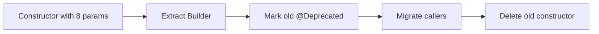
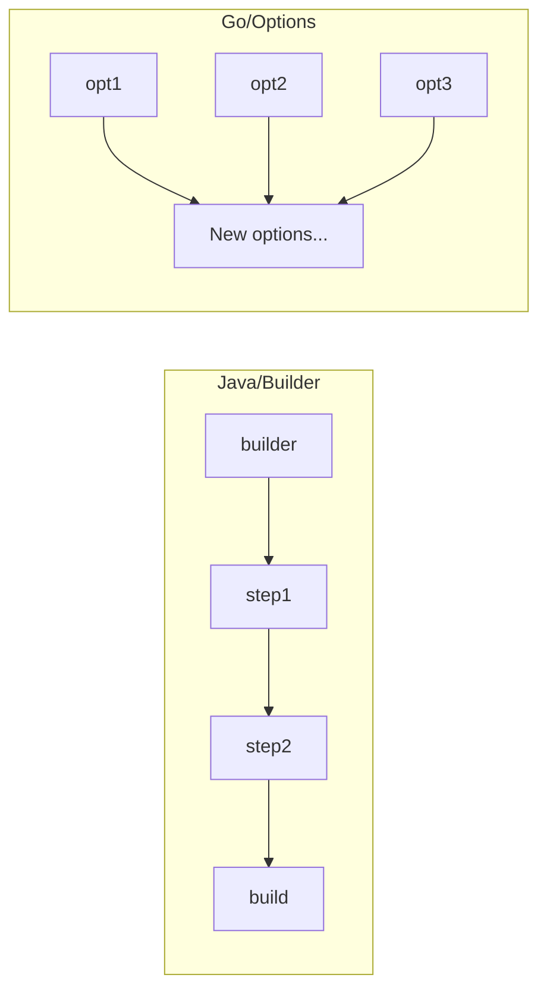

# Builder — Middle Level

> **Source:** [refactoring.guru/design-patterns/builder](https://refactoring.guru/design-patterns/builder)
> **Prerequisite:** [Junior](junior.md)
> **Focus:** **Why** and **When**

---

## Table of Contents

1. [Introduction](#introduction)
2. [When to Use Builder](#when-to-use-builder)
3. [When NOT to Use Builder](#when-not-to-use-builder)
4. [Real-World Cases](#real-world-cases)
5. [Production-Grade Code](#production-grade-code)
6. [Trade-offs](#trade-offs)
7. [Alternatives](#alternatives)
8. [Refactoring Toward Builder](#refactoring-toward-builder)
9. [Edge Cases](#edge-cases)
10. [Tricky Points](#tricky-points)
11. [Best Practices](#best-practices)
12. [Summary](#summary)
13. [Diagrams](#diagrams)

---

## Introduction

> Focus: **Why** and **When**

Builder is the right tool when constructing an object becomes **its own concern** — when there's enough complexity, validation, or representation choice that a separate object should manage construction. The middle-level skill is recognizing the threshold where Builder earns its keep:

- **2-3 fields, all required:** constructor.
- **2-3 fields, some optional:** named/default parameters (Python, Kotlin, Scala) or constructor with `Optional`.
- **5+ fields, many optional, with validation:** **Builder.**
- **Same construction pattern, multiple output types:** Builder + Director.

This file explores production cases, the common alternatives, and when to migrate to/from Builder.

---

## When to Use Builder

Use Builder when **any** of:

1. **Many optional parameters** (rule of thumb: ≥ 4 optional fields).
2. **Multiple representations** of the product (e.g., HTML / plain / JSON).
3. **Construction requires validation** that's complex enough to deserve its own method.
4. **Step-by-step construction** is natural (XML/HTML, SQL queries, document trees).
5. **Test data** — you frequently need slight variations of an object.
6. **Future-proofing** — the object will grow more configurable over time.

### Strong-fit examples

- HTTP clients, gRPC stubs, AWS SDK config.
- SQL query builders.
- Test fixture factories.
- DSLs (Builder is the "object form" of a DSL).
- Emails / messages with multiple sections.

---

## When NOT to Use Builder

| Anti-pattern symptom | Better choice |
|---|---|
| 2-3 fields, all required | Constructor |
| Mostly required fields | Constructor with named arguments |
| Construction needs to vary by **type** | [Factory Method](../01-factory-method/junior.md) |
| You need a *family* of products | [Abstract Factory](../02-abstract-factory/junior.md) |
| You're in Go and writing struct-with-fluent | **Functional options** |
| Modern language with named parameters | Named parameters + defaults |

---

## Real-World Cases

### 1. OkHttp Client

```java
OkHttpClient client = new OkHttpClient.Builder()
    .connectTimeout(10, TimeUnit.SECONDS)
    .readTimeout(30, TimeUnit.SECONDS)
    .addInterceptor(new LoggingInterceptor())
    .cache(new Cache(cacheDir, 10_000_000))
    .followRedirects(true)
    .build();
```

20+ optional fields. Constructor would be unusable.

### 2. SQL Query Builders

```java
String sql = SQL.select("u.id", "u.name", "p.title")
    .from("users u")
    .leftJoin("posts p ON p.user_id = u.id")
    .where("u.active = ?")
    .orderBy("u.created_at DESC")
    .limit(10)
    .build();
```

Steps in arbitrary order; some required (SELECT, FROM), some optional. Builder is the natural fit.

### 3. AWS SDK Configuration

```java
S3Client s3 = S3Client.builder()
    .region(Region.US_EAST_1)
    .credentialsProvider(InstanceProfileCredentialsProvider.create())
    .endpointOverride(URI.create("https://s3.example.com"))
    .build();
```

Cross-cutting AWS configs all use builders for the same reason.

### 4. Test Data Builders

```java
User u = UserBuilder.aUser()
    .withName("Alice")
    .withRole("admin")
    .build();
```

Tests build slight variations: `aUser().withRole("guest").build()`. Builder concentrates the "valid User" knowledge in one place.

### 5. Document Trees

```python
doc = (DocumentBuilder()
       .heading("Introduction", level=1)
       .paragraph("Welcome to...")
       .code_block("python", "print('hi')")
       .heading("Conclusion", level=1)
       .paragraph("Thanks!")
       .build())
```

Multi-step, order-sensitive construction. Each step produces a piece of a tree.

### 6. Email Composition

```java
Email e = Email.builder()
    .from("noreply@example.com")
    .to("user@example.com")
    .subject("Welcome")
    .body(Body.html(html).addAttachment(pdf))
    .build();
```

Optional CC, BCC, attachments, multiple body types — Builder handles them naturally.

---

## Production-Grade Code

### Java — Validating Builder with `Optional`

```java
public final class DbConfig {
    private final String url;
    private final String user;
    private final String password;
    private final int maxConnections;
    private final Duration connectTimeout;
    private final boolean ssl;

    private DbConfig(Builder b) {
        this.url             = Objects.requireNonNull(b.url, "url");
        this.user            = Objects.requireNonNull(b.user, "user");
        this.password        = Objects.requireNonNull(b.password, "password");
        this.maxConnections  = b.maxConnections;
        this.connectTimeout  = b.connectTimeout;
        this.ssl             = b.ssl;
    }

    public static Builder builder() { return new Builder(); }

    public static final class Builder {
        private String url, user, password;
        private int      maxConnections   = 10;
        private Duration connectTimeout   = Duration.ofSeconds(5);
        private boolean  ssl              = true;

        public Builder url(String u)            { this.url = u; return this; }
        public Builder user(String u)           { this.user = u; return this; }
        public Builder password(String p)       { this.password = p; return this; }
        public Builder maxConnections(int n)    {
            if (n < 1) throw new IllegalArgumentException("maxConnections >= 1");
            this.maxConnections = n;
            return this;
        }
        public Builder connectTimeout(Duration t) {
            if (t.isNegative()) throw new IllegalArgumentException();
            this.connectTimeout = t;
            return this;
        }
        public Builder ssl(boolean s)           { this.ssl = s; return this; }

        public DbConfig build() {
            if (url != null && url.startsWith("jdbc:") == false)
                throw new IllegalStateException("url must start with 'jdbc:'");
            return new DbConfig(this);
        }
    }
}
```

Validation:
- Per-step: range / format checks.
- Cross-field: in `build()` — e.g., "if SSL, password must be non-empty."

### Python — Builder + dataclass

```python
from dataclasses import dataclass, field
from datetime import timedelta
from typing import Self

@dataclass(frozen=True)
class DbConfig:
    url: str
    user: str
    password: str
    max_connections: int = 10
    connect_timeout: timedelta = timedelta(seconds=5)
    ssl: bool = True

class DbConfigBuilder:
    def __init__(self) -> None:
        self._url: str | None = None
        self._user: str | None = None
        self._password: str | None = None
        self._max_connections: int = 10
        self._connect_timeout: timedelta = timedelta(seconds=5)
        self._ssl: bool = True

    def url(self, u: str) -> Self:                  self._url = u; return self
    def user(self, u: str) -> Self:                 self._user = u; return self
    def password(self, p: str) -> Self:             self._password = p; return self
    def max_connections(self, n: int) -> Self:
        if n < 1: raise ValueError("max_connections >= 1")
        self._max_connections = n; return self
    def connect_timeout(self, t: timedelta) -> Self:
        if t.total_seconds() < 0: raise ValueError()
        self._connect_timeout = t; return self
    def ssl(self, s: bool) -> Self:                 self._ssl = s; return self

    def build(self) -> DbConfig:
        for field_name, val in (("url", self._url), ("user", self._user), ("password", self._password)):
            if val is None:
                raise ValueError(f"{field_name} is required")
        return DbConfig(
            url=self._url, user=self._user, password=self._password,
            max_connections=self._max_connections,
            connect_timeout=self._connect_timeout,
            ssl=self._ssl,
        )
```

> **Pythonic alternative:** if validation is simple, just use the dataclass directly with named arguments:
>
> ```python
> cfg = DbConfig(url="...", user="...", password="...", max_connections=20)
> ```
>
> Reach for Builder when validation is complex or you have multiple representations.

### Go — Functional Options (production-grade)

```go
package db

import (
    "errors"
    "strings"
    "time"
)

type Config struct {
    url             string
    user            string
    password        string
    maxConnections  int
    connectTimeout  time.Duration
    ssl             bool
}

type Option func(*Config) error

func WithURL(u string) Option {
    return func(c *Config) error {
        if !strings.HasPrefix(u, "jdbc:") {
            return errors.New("url must start with 'jdbc:'")
        }
        c.url = u
        return nil
    }
}

func WithUser(u string) Option {
    return func(c *Config) error { c.user = u; return nil }
}

func WithPassword(p string) Option {
    return func(c *Config) error { c.password = p; return nil }
}

func WithMaxConnections(n int) Option {
    return func(c *Config) error {
        if n < 1 { return errors.New("maxConnections >= 1") }
        c.maxConnections = n
        return nil
    }
}

func New(opts ...Option) (*Config, error) {
    c := &Config{
        maxConnections: 10,
        connectTimeout: 5 * time.Second,
        ssl:            true,
    }
    for _, opt := range opts {
        if err := opt(c); err != nil {
            return nil, err
        }
    }
    if c.url == "" || c.user == "" || c.password == "" {
        return nil, errors.New("url, user, password required")
    }
    return c, nil
}
```

```go
cfg, err := db.New(
    db.WithURL("jdbc:postgresql://..."),
    db.WithUser("admin"),
    db.WithPassword("secret"),
    db.WithMaxConnections(20),
)
```

Each Option returns `error`, allowing per-step validation. Final `New()` checks required fields.

---

## Trade-offs

| Dimension | Builder | Constructor | Named Args | Functional Options |
|---|---|---|---|---|
| Readability at call site | Excellent | Poor (telescoping) | Excellent | Excellent |
| Validation per field | Yes | No (in constructor body) | No | Yes |
| Compile-time required field check | With Step Builder | Yes (positional) | No | No |
| Boilerplate | High | Low | Lowest | Medium |
| Idiomatic in Go | No | n/a | n/a | Yes |
| Idiomatic in Python | Sometimes | n/a | Often | Sometimes |
| Idiomatic in Java | Yes | for simple | n/a | n/a |

---

## Alternatives

### vs Constructor

If most fields are required, constructor wins. Builder shines when many are optional.

### vs Named Arguments (Python, Kotlin, Scala)

```python
DbConfig(url="...", user="...", password="...", max_connections=20)
```

This is **the Pythonic Builder**. It loses fluent chaining but gains readability.

### vs Factory Method

Factory: pick which class to create. Builder: assemble one class.

You can combine: a Factory returns a Builder. Or a Builder takes a Factory.

### vs Functional Options (Go)

In Go, functional options are the canonical Builder. Use Builder structs only if state must persist across calls (rare).

### vs DSL

A custom DSL (Kotlin scope functions, Groovy method missing, Scala implicits) is essentially Builder with sugar.

```kotlin
val req = httpRequest {
    url = "https://api.example.com"
    method = "POST"
    headers {
        "Content-Type" to "application/json"
    }
}
```

This is a Builder dressed in DSL clothing.

---

## Refactoring Toward Builder

Given:

```java
public class HttpClient {
    public HttpClient(int timeout, int retries, String proxy, boolean tls) { ... }
}
```

**Step 1 — Extract Builder:**

```java
public class HttpClient {
    private final int timeout, retries;
    private final String proxy;
    private final boolean tls;

    private HttpClient(Builder b) {
        this.timeout = b.timeout;
        this.retries = b.retries;
        this.proxy   = b.proxy;
        this.tls     = b.tls;
    }

    public static Builder builder() { return new Builder(); }

    public static class Builder {
        int timeout = 30, retries = 3;
        String proxy;
        boolean tls = true;

        public Builder timeout(int t) { this.timeout = t; return this; }
        public Builder retries(int r) { this.retries = r; return this; }
        public Builder proxy(String p) { this.proxy = p; return this; }
        public Builder tls(boolean t) { this.tls = t; return this; }
        public HttpClient build() { return new HttpClient(this); }
    }
}
```

**Step 2 — Mark old constructor `@Deprecated`:**

```java
@Deprecated(forRemoval = true, since = "2.0")
public HttpClient(int timeout, int retries, String proxy, boolean tls) {
    this(builder().timeout(timeout).retries(retries).proxy(proxy).tls(tls).build());
}
```

Old callers keep working; new callers use the Builder.

**Step 3 — Migrate callers:**

Find / replace `new HttpClient(...)` → `HttpClient.builder()....build()`.

**Step 4 — Delete the old constructor.**

---

## Edge Cases

### 1. Builder reuse

```java
Builder b = HttpClient.builder().timeout(10);
HttpClient c1 = b.build();
b.retries(5);                        // mutates the builder
HttpClient c2 = b.build();           // c2 has retries=5
// c1 is unaffected because we copied state in constructor
```

If the constructor doesn't copy mutable state, `c1` may see the change. **Always copy in `build()`.**

### 2. Required fields

Without compile-time enforcement (Step Builder), required fields are runtime-checked. Document them clearly.

### 3. Builder thread safety

Builders are typically single-threaded — one builder per construction. Don't share builders across threads.

### 4. Immutable products

Final fields, copied collections (`Map.copyOf`, `List.copyOf`). Otherwise the "build then freeze" intent is broken.

---

## Tricky Points

- **Builder and Factory Method aren't mutually exclusive.** A Factory may return a Builder; a Builder's `build()` may delegate to a Factory.
- **Lombok / records reduce Builder boilerplate.** `@Builder` generates the entire pattern from a class definition.
- **Testing builders:** assert each setter returns the same builder (chainability) and that `build()` produces correct products.
- **Validation choice:** per-setter (early failure) vs in `build()` (cross-field). Mix both.

---

## Best Practices

1. **Make the Product immutable.**
2. **Validate early and fail loudly.**
3. **Default sensibly.**
4. **Provide `toBuilder()` on the Product** for "modify a copy" workflows.
5. **In Java, consider Lombok `@Builder`** for simple cases.
6. **In Go, use functional options.**
7. **In Python, use dataclass + builder only when validation is complex.**
8. **One builder per product.** Don't try to make a Builder build different unrelated products.

---

## Summary

- Builder = step-by-step assembly of complex objects.
- Use when many optional fields, multiple representations, or validation is needed.
- In Go, functional options are the idiomatic equivalent.
- In Python, named-argument dataclass is often enough.
- Make products immutable; validate in `build()`.

---

## Diagrams

### Refactor



### Builder vs Functional Options



[← Junior](junior.md) · [Creational](../README.md) · [Roadmap](../../../README.md) · **Next:** [Senior](senior.md)
