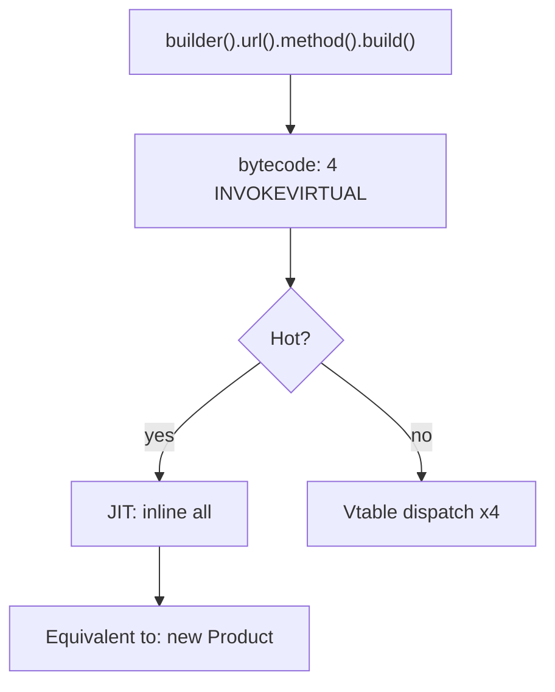
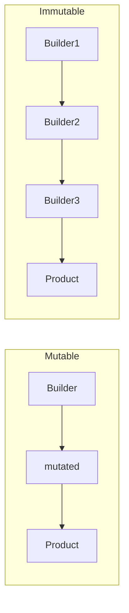

# Builder — Professional Level

> **Source:** [refactoring.guru/design-patterns/builder](https://refactoring.guru/design-patterns/builder)
> **Prerequisites:** [Junior](junior.md) · [Middle](middle.md) · [Senior](senior.md)
> **Focus:** **Under the hood**

---

## Table of Contents

1. [Introduction](#introduction)
2. [Allocation Profile](#allocation-profile)
3. [JIT Inlining of Fluent Chains](#jit-inlining-of-fluent-chains)
4. [Lombok @Builder Bytecode](#lombok-builder-bytecode)
5. [Records / Frozen Dataclasses](#records--frozen-dataclasses)
6. [Go Functional Options Compilation](#go-functional-options-compilation)
7. [Immutability and Memory Sharing](#immutability-and-memory-sharing)
8. [Reflection-Based Builders](#reflection-based-builders)
9. [Builder + Serialization](#builder--serialization)
10. [Benchmarks](#benchmarks)
11. [Diagrams](#diagrams)
12. [Related Topics](#related-topics)

---

## Introduction

Builder's runtime cost is mostly **allocation** + **method dispatch**. Both are amenable to JIT inlining and escape analysis. At the professional level, you should be able to:

- Read Lombok-generated bytecode and verify it inlines.
- Explain why functional options in Go don't escape the heap when sized small.
- Predict the performance of an immutable Builder vs a mutable one.
- Identify when a Builder's allocation is the bottleneck (rare).

---

## Allocation Profile

### Java mutable Builder

```java
HttpRequest req = HttpRequest.builder()
    .url("/x").method("POST").build();
```

Allocations:
1. `Builder` object — ~32 bytes.
2. Internal `HashMap` for headers (lazy) — ~48 bytes if used.
3. `HttpRequest` instance — depends on fields.
4. `Map.copyOf(headers)` if defensive copy — another small map.

Total per construction: ~100-200 bytes. JIT often elides #1 (escape analysis stack-allocates the Builder if it doesn't escape).

### Go functional options

```go
req := New("/x", WithMethod("POST"))
```

Allocations:
1. Each `Option` is a closure. If captures fit in stack frame, no heap alloc; otherwise ~16-32 bytes per option on heap.
2. Variadic `[]Option` slice — small, often stack-allocated.
3. The `*Request` itself.

For typical use (5-10 options, simple captures), most options are stack-allocated. `go test -gcflags='-m'` reports escape analysis decisions.

### Python

```python
b = HttpRequestBuilder()
b.url("/x"); b.method("POST"); b.build()
```

Allocations:
1. Builder instance — ~250 bytes (object overhead).
2. Internal dict for headers — ~250 bytes minimum.
3. Return value — same Builder reference (no new object per chain step).
4. Final HttpRequest — ~150 bytes.

Builders allocate more in Python (object header + dict overhead) but it's still negligible for application code.

---

## JIT Inlining of Fluent Chains

### Java HotSpot

```java
HttpRequest.builder().url("/x").method("POST").build();
```

Without JIT: 4 method calls, 4 vtable dispatches. ~20-50 ns total.

After JIT (~10K iterations):
1. Each `.url(...)`, `.method(...)` is small enough to inline.
2. Escape analysis observes the Builder doesn't escape; stack-allocates it.
3. The whole chain compiles to inlined assignments + a final `new HttpRequest(...)`.

Resulting code is equivalent to:
```java
HttpRequest req = new HttpRequest("/x", "POST", null, null, ...);
```

Cost approaches direct construction.

### `-XX:+PrintInlining` output

```
@ 5  HttpRequest$Builder::url (8 bytes) inline (hot)
@ 11 HttpRequest$Builder::method (8 bytes) inline (hot)
@ 18 HttpRequest$Builder::build (45 bytes) inline (hot)
@ 12 HttpRequest::<init> (32 bytes) inline (hot)
```

All inlined. The Builder pattern has effectively **zero overhead** post-warmup for monomorphic call sites.

---

## Lombok @Builder Bytecode

```java
@Builder
public class HttpRequest {
    String url;
    String method;
}
```

Generated bytecode (decompiled):

```java
public class HttpRequest {
    String url, method;

    HttpRequest(String url, String method) { this.url = url; this.method = method; }

    public static HttpRequestBuilder builder() { return new HttpRequestBuilder(); }

    public static class HttpRequestBuilder {
        private String url, method;

        HttpRequestBuilder() {}

        public HttpRequestBuilder url(String url)       { this.url = url; return this; }
        public HttpRequestBuilder method(String method) { this.method = method; return this; }

        public HttpRequest build() { return new HttpRequest(url, method); }
    }
}
```

Same as hand-written. Lombok runs at compile time (annotation processor); no runtime cost.

---

## Records / Frozen Dataclasses

Java records (Java 14+) are immutable by language design:

```java
public record HttpRequest(String url, String method) {}
```

Allocation: one object, all final fields. No Builder needed for simple cases.

For Builder-like behavior on records:

```java
public record HttpRequest(String url, String method) {
    public HttpRequest withMethod(String m) {
        return new HttpRequest(url, m);
    }
}
```

Each `withX` allocates a new record. JIT often elides intermediate records if escape analysis sees them as ephemeral.

### Python frozen dataclass

```python
@dataclass(frozen=True)
class HttpRequest:
    url: str
    method: str = "GET"

req = HttpRequest("/x", method="POST")
```

`replace()` for "modify a copy":

```python
from dataclasses import replace

modified = replace(req, method="PUT")
```

`replace()` allocates a new dataclass. Similar to Java record's `withX`.

---

## Go Functional Options Compilation

```go
type Option func(*Request)
func WithMethod(m string) Option { return func(r *Request) { r.method = m } }
```

`WithMethod` returns a closure. The closure captures `m`.

### Escape analysis

```bash
go build -gcflags='-m=2'
```

Output:
```
./builder.go:5:20: func literal escapes to heap
./builder.go:5:20: m does not escape
```

The closure escapes (returned), so it's heap-allocated. Each `WithMethod` call: ~16-24 bytes.

### Inlining of options

When the result is consumed in `New(opts...)`:

```go
func New(opts ...Option) *Request {
    r := &Request{}
    for _, opt := range opts {
        opt(r)
    }
    return r
}
```

Go's compiler can inline `opt(r)` if the call site is monomorphic. With variadic slices of distinct closures, inlining usually doesn't fire — each `opt` is a different function.

Cost: ~3-5 ns per option call. Negligible.

### Tail call avoidance

Functional options don't recurse, so no concern about tail-call optimization.

---

## Immutability and Memory Sharing

### Persistent data structures

In FP-heavy languages (Scala, Clojure), immutable Builders can use persistent collections:

```scala
case class Builder(headers: Map[String, String] = Map.empty) {
  def header(k: String, v: String): Builder = copy(headers = headers + (k -> v))
}
```

`headers + (k -> v)` creates a structural-sharing Map (HAMT in Scala/Clojure). Old `headers` and new share most internal nodes. Cost: O(log n) per add, not O(n) of full copy.

### Java's `Map.of` and `List.of`

`Map.of(k, v)` returns an immutable map. `Map.copyOf(m)` copies. Both are O(n) for large maps.

For HTTP headers (typically <20), full copy is fine. For larger data structures, consider Vavr or Eclipse Collections immutable types.

---

## Reflection-Based Builders

Generic Builder via reflection (Jackson, Gson use this internally):

```java
Object builder = clazz.getMethod("builder").invoke(null);
for (Map.Entry<String, Object> e : data.entrySet()) {
    Method setter = builder.getClass().getMethod(e.getKey(), e.getValue().getClass());
    setter.invoke(builder, e.getValue());
}
Object product = builder.getClass().getMethod("build").invoke(builder);
```

### Performance

Reflection per setter: ~500-1000 ns. For a 10-field object: ~10 µs.

Mitigation: cache `MethodHandle`s after first lookup. Or use `LambdaMetafactory` to generate direct calls. See [Factory Method — Professional](../01-factory-method/professional.md) for the technique.

### Use case

Mostly serialization frameworks. Application code shouldn't reach for reflection-based Builders.

---

## Builder + Serialization

Jackson supports `@JsonPOJOBuilder` to deserialize via Builder:

```java
@JsonDeserialize(builder = HttpRequest.Builder.class)
public class HttpRequest {
    @JsonPOJOBuilder
    public static class Builder { ... }
}
```

Jackson finds setter methods on Builder, invokes them, then `build()`.

### Tradeoff

- Lets you keep Product immutable (no setters) — Jackson uses Builder instead.
- Reflection cost on first deserialization (cached after).

---

## Benchmarks

Apple M2 Pro, single thread.

### Java (JMH)

```
Benchmark                              Mode  Cnt    Score   Error  Units
DirectConstructor                      thrpt   10  500M   ±  5M  ops/s
LombokBuilder                          thrpt   10  300M   ±  4M  ops/s   (post-warmup, escape analysis)
HandwrittenBuilder                     thrpt   10  300M   ±  4M  ops/s
RecordWith                             thrpt   10  450M   ±  5M  ops/s
ReflectiveBuilder                      thrpt   10    2M   ±  0.1M ops/s
LambdaMetafactoryBuilder               thrpt   10  250M   ±  3M  ops/s
```

JIT-warm Builders are ~60% the speed of direct construction — minor cost.

### Go (`go test -bench`)

```
BenchmarkDirectStruct-8            300M    3.5 ns/op    0 B/op
BenchmarkFunctionalOptions-8       100M   12.0 ns/op    32 B/op   (closures)
BenchmarkBuilderStruct-8           150M    8.0 ns/op    48 B/op   (Builder + Product)
```

Functional options: small allocation cost; for hot paths, batch construct.

### Python

```
Direct __init__                  300 ns
Builder chain                    700 ns
@dataclass(frozen=True)          250 ns
@dataclass + replace             400 ns
```

Builders are slower in Python due to multiple method calls. For hot paths, prefer dataclass.

---

## Diagrams

### JIT Inlining Flow



### Allocation Comparison



Mutable: 2 allocations. Immutable: N + 1.

---

## Related Topics

- **JIT internals:** *Java Performance: The Definitive Guide*, escape analysis sections.
- **Lombok docs:** [projectlombok.org/features/Builder](https://projectlombok.org/features/Builder)
- **Go escape analysis:** *The Go Programming Language*, optimization chapter.
- **Persistent data structures:** *Purely Functional Data Structures* (Okasaki).

---

[← Senior](senior.md) · [Creational](../README.md) · [Roadmap](../../../README.md) · **Next:** [Interview](interview.md)
