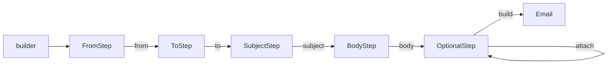
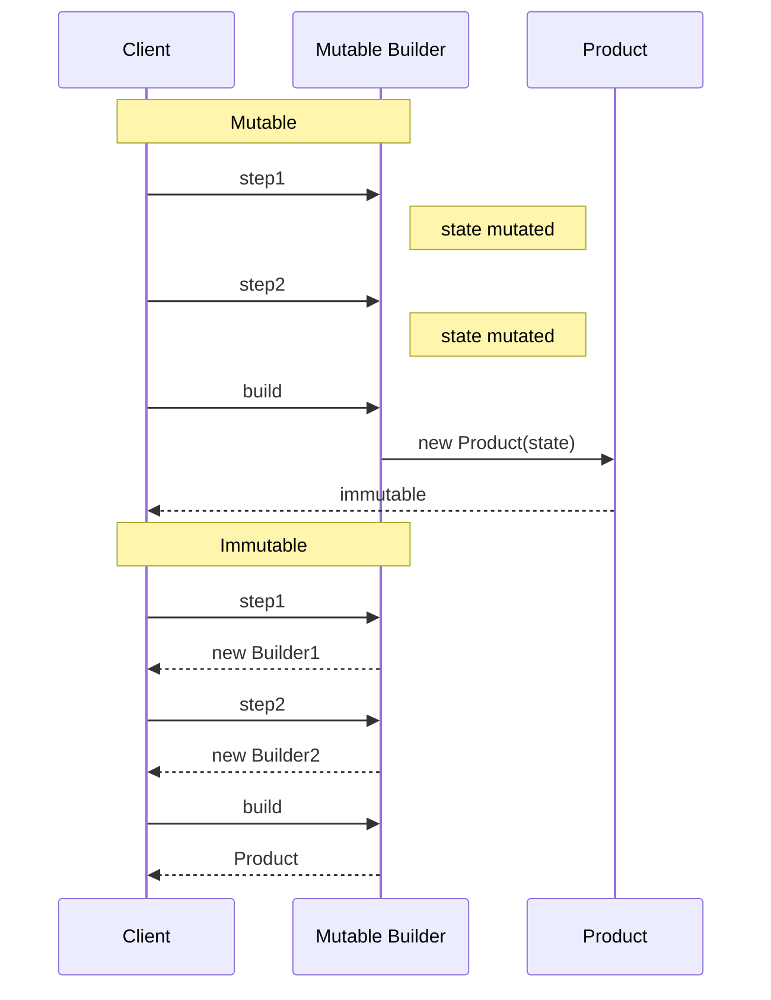

# Builder — Senior Level

> **Source:** [refactoring.guru/design-patterns/builder](https://refactoring.guru/design-patterns/builder)
> **Prerequisites:** [Junior](junior.md) · [Middle](middle.md)
> **Focus:** **Architecture** and **optimization**

---

## Table of Contents

1. [Introduction](#introduction)
2. [Architectural Patterns Around Builder](#architectural-patterns-around-builder)
3. [Step Builder & Type-State](#step-builder--type-state)
4. [Immutable Builders](#immutable-builders)
5. [Concurrency](#concurrency)
6. [Performance](#performance)
7. [Testability](#testability)
8. [Code Examples — Advanced](#code-examples--advanced)
9. [Liabilities](#liabilities)
10. [Migration Patterns](#migration-patterns)
11. [Diagrams](#diagrams)
12. [Related Topics](#related-topics)

---

## Introduction

> Focus: **architecture** and **optimization**

Builder at the senior level is a **DSL design tool**. The fluent API you expose *is* your library's surface for constructing things. Decisions like step ordering, validation timing, mutable vs immutable state, and integration with type systems shape how usable (and how mistake-resistant) your API will be.

Senior decisions:
- Should required fields be enforced at compile time? (Step Builder / type-state)
- Is the Builder mutable or immutable?
- How does Builder integrate with DI / serialization / generators (Lombok, jOOQ codegen)?
- What's the API contract: idempotent? Reusable? One-shot?
- What's the Director's role in our system, if any?

---

## Architectural Patterns Around Builder

### Builder + Director (canonical)

```java
class Director {
    void buildSportsCar(CarBuilder b) {
        b.reset(); b.setSeats(2); b.setEngine("V8"); b.setSpoiler(true);
    }
    void buildSUV(CarBuilder b) {
        b.reset(); b.setSeats(7); b.setEngine("V6"); b.setAWD(true);
    }
}
```

The Director knows *the recipe*; the Builder knows *how to build each step*. Multiple Directors can drive the same Builder.

### Builder + Factory

```java
public abstract class HttpClientBuilder {
    public static HttpClientBuilder forVendor(String vendor) {
        return switch (vendor) {
            case "okhttp"  -> new OkHttpBuilder();
            case "java11"  -> new Java11HttpBuilder();
            default        -> throw new IllegalArgumentException();
        };
    }
    public abstract HttpClient build();
}
```

The Factory picks which Builder to use; the Builder constructs the product.

### Builder + Prototype

```java
HttpRequest base = HttpRequest.builder().header("X-API-Key", "abc").build();
HttpRequest with = base.toBuilder().url("/users").build();
HttpRequest more = base.toBuilder().url("/orders").build();
```

`base` is the prototype; each variant is built from a copy. Combines Builder with [Prototype](../04-prototype/junior.md).

### Builder + Composite

Builders that produce trees:

```java
Tree t = TreeBuilder.root("html")
    .child(TreeBuilder.node("head")
        .child(TreeBuilder.node("title").text("Page")))
    .child(TreeBuilder.node("body")
        .child(TreeBuilder.node("h1").text("Hello")))
    .build();
```

Recursive Builder construction. Each step adds to a Composite. See [Composite](../../02-structural/03-composite/junior.md).

### Builder + DSL (Kotlin / Groovy / Scala)

```kotlin
val req = httpRequest {
    url = "https://api.example.com"
    method = "POST"
    headers {
        "Content-Type" to "application/json"
        "Authorization" to "Bearer $token"
    }
}
```

DSL is Builder with sugar — implicit receiver, type-safe scopes, omitted dots.

---

## Step Builder & Type-State

The naive Builder lets clients call `build()` with required fields missing. The result: runtime error.

**Step Builder** uses the type system to enforce ordering and required fields.

### Java — Stepped Interfaces

```java
public final class Email {
    public interface FromStep    { ToStep from(String addr); }
    public interface ToStep      { SubjectStep to(String addr); }
    public interface SubjectStep { BodyStep subject(String s); }
    public interface BodyStep    { OptionalStep body(String b); }
    public interface OptionalStep {
        OptionalStep cc(String addr);
        OptionalStep attach(byte[] file);
        Email build();
    }

    public static FromStep builder() {
        return new BuilderImpl();
    }

    private static class BuilderImpl
        implements FromStep, ToStep, SubjectStep, BodyStep, OptionalStep {
        // ... fields ...
        public ToStep      from(String addr)    { ...; return this; }
        public SubjectStep to(String addr)      { ...; return this; }
        public BodyStep    subject(String s)    { ...; return this; }
        public OptionalStep body(String b)      { ...; return this; }
        public OptionalStep cc(String addr)     { ...; return this; }
        public OptionalStep attach(byte[] file) { ...; return this; }
        public Email build()                    { ...; }
    }
}

// Compile-time enforcement
Email e = Email.builder()
    .from("a@b.c")
    .to("c@d.e")
    .subject("Hi")
    .body("Body")
    .cc("d@e.f")
    .build();
// `Email.builder().to(...)` → compile error: FromStep has no `to`
```

The type system threads through the steps. Forgetting a required step produces a compile error.

### Rust — Type-State Pattern

Rust's ownership system makes type-state Builders ergonomic:

```rust
struct Builder<UrlSet, MethodSet> {
    url:    Option<String>,
    method: Option<String>,
    _phantom: PhantomData<(UrlSet, MethodSet)>,
}

struct Yes;
struct No;

impl Builder<No, No> {
    fn new() -> Self { Builder { url: None, method: None, _phantom: PhantomData } }
}

impl<M> Builder<No, M> {
    fn url(self, u: String) -> Builder<Yes, M> { ... }
}

impl<U> Builder<U, No> {
    fn method(self, m: String) -> Builder<U, Yes> { ... }
}

impl Builder<Yes, Yes> {
    fn build(self) -> Request { ... }
}

// build() only available when both Url and Method are set
```

State transitions encoded in the type. Compiler enforces.

### Python — runtime check

Python lacks type-state at runtime. Use protocols + runtime validation:

```python
class Builder:
    def __init__(self):
        self._set: set[str] = set()

    def url(self, u: str) -> "Builder":
        self._set.add("url"); ...
        return self

    def build(self) -> Request:
        required = {"url", "method"}
        missing = required - self._set
        if missing:
            raise ValueError(f"missing: {missing}")
        return Request(...)
```

Less elegant than Java/Rust but functional.

---

## Immutable Builders

```scala
case class HttpRequest(
    url: String,
    method: String = "GET",
    headers: Map[String, String] = Map.empty
) {
  def withUrl(u: String): HttpRequest    = copy(url = u)
  def withMethod(m: String): HttpRequest = copy(method = m)
  def withHeader(k: String, v: String): HttpRequest =
    copy(headers = headers + (k -> v))
}

val req = HttpRequest("https://x").withMethod("POST").withHeader("X", "Y")
```

In Scala / Kotlin / Clojure, the Product itself is immutable, and each "step" returns a new instance. No separate Builder class needed.

**Tradeoffs:**
- Many small allocations during construction.
- Thread-safe trivially.
- Harder to validate cross-fields at every step (delay until done).

Java records (Java 14+) approach this:

```java
public record HttpRequest(String url, String method, Map<String, String> headers) {
    public HttpRequest withMethod(String m) {
        return new HttpRequest(url, m, headers);
    }
}
```

---

## Concurrency

### Builders are typically single-threaded

A Builder accumulates state. Concurrent mutation is a race condition. **One thread per Builder.**

If you must share, synchronize:

```java
public final class ThreadSafeBuilder {
    private final Object lock = new Object();
    private String url;
    public ThreadSafeBuilder url(String u) {
        synchronized (lock) { this.url = u; }
        return this;
    }
}
```

Rarely needed.

### Products are immutable → thread-safe

If the Product has only `final` fields and copies its mutable inputs, it's safe to share across threads.

```java
this.headers = Map.copyOf(b.headers);   // immutable copy
```

### Builders + concurrent collections

If the Builder accepts collections, decide the contract: copy-on-add or copy-on-build?

```java
// Copy on add (defensive)
public Builder header(String k, String v) {
    headers = headers.copyAndAdd(k, v);
    return this;
}

// Copy on build
public Builder header(String k, String v) {
    headers.put(k, v);
    return this;
}
public Product build() {
    return new Product(Map.copyOf(headers));
}
```

Latter is more performant. Document contract.

---

## Performance

### Allocation cost

Each Builder allocation: ~24-32 bytes + per-field. Per build: one Builder + one Product.

**For hot-path construction**, Builders add minor allocation pressure. Mitigations:

- **Object pool of Builders** (reset between uses).
- **Direct constructor** for hot paths; Builder for rare configurations.
- **Lazy initialization** of Builder fields.

### JIT inlining

Fluent Builder calls are usually inlined post-warmup — the chain becomes equivalent to the constructor call. Cost approaches zero for simple Builders.

### Functional options in Go

Each `Option` is a closure (~16 bytes). For complex builders with 20 options, you allocate 20 small closures plus one slice. Negligible for application code; potentially relevant in tight loops.

### Lombok-generated Builders

`@Builder` generates the boilerplate at compile time. Performance is identical to hand-written; just less code to maintain.

---

## Testability

### 1. Builder testing

```java
@Test
void builderRequiresUrl() {
    assertThatThrownBy(() -> HttpRequest.builder().build())
        .hasMessageContaining("url");
}

@Test
void builderChainsCorrectly() {
    HttpRequest r = HttpRequest.builder()
        .url("/x").method("POST").build();
    assertEquals("/x", r.url());
    assertEquals("POST", r.method());
}
```

### 2. Test data Builders

```java
public static UserBuilder aUser() {
    return User.builder()
        .name("Test User")
        .email("test@example.com")
        .role("user")
        .createdAt(Instant.now());
}

@Test
void adminCanDelete() {
    User admin = aUser().role("admin").build();
    // ... test ...
}
```

This is the **Test Data Builder** pattern — concentrate "valid object" knowledge in one place; tests express only what differs.

### 3. Snapshot testing

```python
def test_builder_default():
    cfg = ConfigBuilder().url("...").build()
    assert cfg == DbConfig(url="...", user="default", ...)
```

Compare full Built object to expected.

---

## Code Examples — Advanced

### Java — Builder with Lombok `@Builder`

```java
@Builder
@With
public record HttpRequest(
    @NonNull String url,
    @Builder.Default String method = "GET",
    @Singular Map<String, String> headers,
    @Builder.Default Duration timeout = Duration.ofSeconds(30)
) {}

// Generated: HttpRequest.builder().url("...").method("...").header("k", "v").build()
```

`@Builder` generates everything. `@Singular` makes `headers(Map)` and `header(K, V)` methods. `@With` adds `withMethod(String)` for "modify a copy."

### Python — DSL-style with context manager

```python
from contextlib import contextmanager

class _RequestBuilder:
    def __init__(self, url):
        self._url = url
        self._headers = {}

    def header(self, k, v):
        self._headers[k] = v

@contextmanager
def http_request(url):
    b = _RequestBuilder(url)
    yield b
    # On exit, "build" — but here we just expose state
    # In real use, store the result somewhere

with http_request("https://example.com") as req:
    req.header("Content-Type", "application/json")
    req.header("Authorization", "Bearer ...")
```

Looks DSL-like. Useful when construction has side effects (e.g., registering with a system).

### Go — Functional Options with Validation Aggregation

```go
type Config struct{ /* ... */ }

type Option func(*Config) error

func New(opts ...Option) (*Config, error) {
    c := &Config{ /* defaults */ }
    var errs []string
    for _, opt := range opts {
        if err := opt(c); err != nil {
            errs = append(errs, err.Error())
        }
    }
    if len(errs) > 0 {
        return nil, fmt.Errorf("config errors: %s", strings.Join(errs, "; "))
    }
    if err := c.validate(); err != nil {
        return nil, err
    }
    return c, nil
}
```

Aggregate all errors instead of failing on the first — better UX.

---

## Liabilities

### Symptom 1: Builder for trivial objects

If Product has 2 fields, Builder is 30 lines for a 5-line constructor. Refactor to constructor.

### Symptom 2: Builder grows beyond product

Builder has setters for fields the Product doesn't have. The Builder is doing extra work — split Builder responsibilities.

### Symptom 3: Multiple Builders for the same Product

Often a smell — usually means the Product has multiple representations (HTML / plain). That's *intended* (Director + Builder pair). But if it's just config variations, use one Builder with options.

### Symptom 4: Product is mutable

Then Builder doesn't add safety — the Product can be changed post-build. Make Product immutable to honor the pattern's intent.

---

## Migration Patterns

### Builder → Functional Options (Go-style)

In Go codebases that started with Java-style Builders:

```go
// Before (Java-style)
type Builder struct{ /* ... */ }
func (b *Builder) WithA(a int) *Builder { ... }
func (b *Builder) Build() *Product { ... }

// After (idiomatic Go)
type Option func(*Product)
func WithA(a int) Option { ... }
func New(opts ...Option) *Product { ... }
```

Greppable change. Functional options are simpler.

### Builder → Records / Dataclasses

Modern languages reduce Builder need:

```java
// Before
HttpRequest req = HttpRequest.builder().url("/x").method("POST").build();

// After (Java record)
record HttpRequest(String url, String method, Map<String, String> headers) {}
HttpRequest req = new HttpRequest("/x", "POST", Map.of());
```

For simple cases, the record is enough. Builder still helps with optional fields and validation.

### Many Builders → DI

```java
// Before
HttpClient c = HttpClient.builder().timeout(...).build();

// After (DI configuration)
@Configuration
class HttpConfig {
    @Bean HttpClient httpClient() {
        return HttpClient.builder().timeout(...).build();
    }
}

@Component
class Service {
    @Inject HttpClient client;
}
```

The Builder is hidden inside the configuration. Consumers get the wired Product.

---

## Diagrams

### Step Builder Type Flow



### Mutable vs Immutable Builder



---

## Related Topics

- **Next:** [Builder — Professional](professional.md)
- **Practice:** [Tasks](tasks.md), [Find-Bug](find-bug.md), [Optimize](optimize.md), [Interview](interview.md)
- **Companions:** [Factory Method](../01-factory-method/junior.md), [Abstract Factory](../02-abstract-factory/junior.md), [Prototype](../04-prototype/junior.md), [Composite](../../02-structural/03-composite/junior.md)
- **DSL design:** Kotlin scope functions, Groovy method missing, Scala implicits.

---

[← Middle](middle.md) · [Creational](../README.md) · [Roadmap](../../../README.md) · **Next:** [Professional](professional.md)
