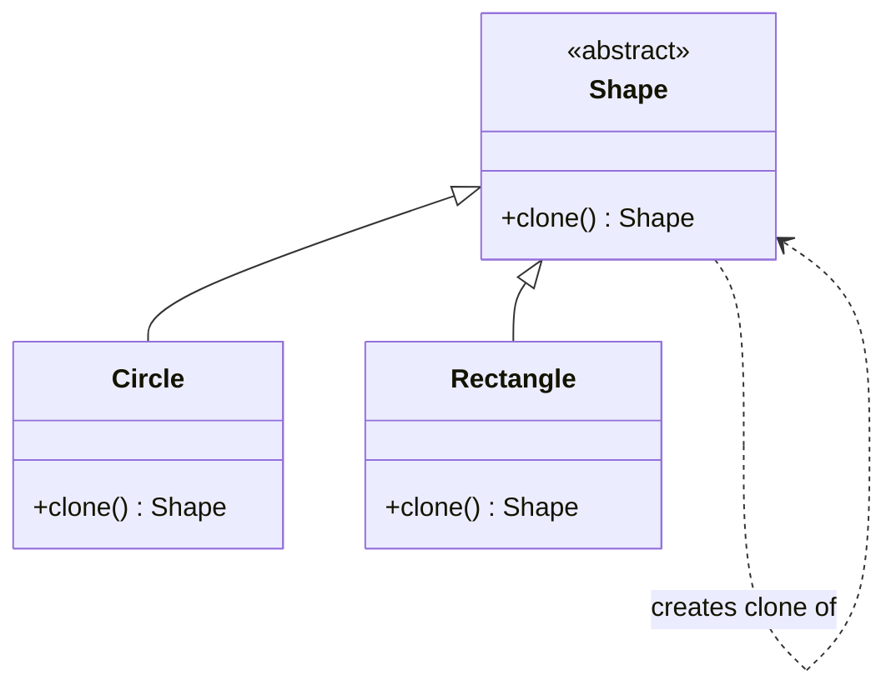
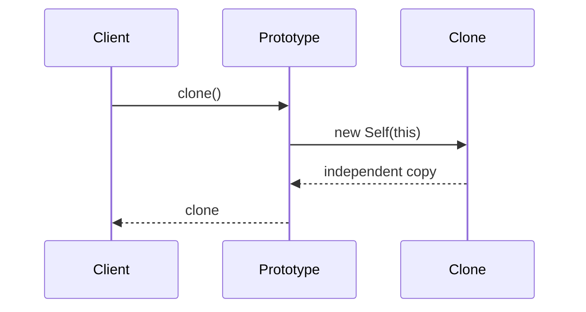

# Prototype — Junior Level

> **Source:** [refactoring.guru/design-patterns/prototype](https://refactoring.guru/design-patterns/prototype)
> **Category:** [Creational](../README.md)

---

## Table of Contents

1. [Introduction](#introduction)
2. [Prerequisites](#prerequisites)
3. [Glossary](#glossary)
4. [Core Concepts](#core-concepts)
5. [Real-World Analogies](#real-world-analogies)
6. [Mental Models](#mental-models)
7. [Pros & Cons](#pros--cons)
8. [Use Cases](#use-cases)
9. [Code Examples](#code-examples)
10. [Coding Patterns](#coding-patterns)
11. [Clean Code](#clean-code)
12. [Best Practices](#best-practices)
13. [Edge Cases & Pitfalls](#edge-cases--pitfalls)
14. [Common Mistakes](#common-mistakes)
15. [Tricky Points](#tricky-points)
16. [Test Yourself](#test-yourself)
17. [Cheat Sheet](#cheat-sheet)
18. [Summary](#summary)
19. [Further Reading](#further-reading)
20. [Related Topics](#related-topics)
21. [Diagrams](#diagrams)

---

## Introduction

> Focus: **What is it?** and **How to use it?**

**Prototype** is a creational design pattern that lets you **copy existing objects** without making your code dependent on their classes.

In one sentence: instead of `new Foo()` followed by manually setting fields, you say `existingFoo.clone()` — and the object knows how to copy itself.

### Why this matters

Two scenarios:

1. **Construction is expensive.** Loading a config from disk, parsing a complex schema, computing a heavy initial state. Cloning a pre-built object is much cheaper than rebuilding it.

2. **You don't know the concrete class.** Code receives a `Shape` interface; it needs another shape just like this one — but is it a `Circle`, `Rectangle`, `Triangle`? `shape.clone()` works without knowing.

The key insight: **the object knows how to clone itself**. The cloning code lives inside the class hierarchy, not at the call site.

---

## Prerequisites

- **Required:** Understanding of references vs values (a `List` reference points to the same memory).
- **Required:** Distinction between shallow copy and deep copy.
- **Helpful:** Familiarity with [Factory Method](../01-factory-method/junior.md) — Prototype is sometimes an alternative.

---

## Glossary

| Term | Definition |
|------|-----------|
| **Prototype** | An object that knows how to make a copy of itself via `clone()`. |
| **Shallow copy** | Top-level fields are copied; nested object references are shared. |
| **Deep copy** | Nested objects are copied recursively; no shared references. |
| **Prototype registry** | A registry mapping names to pre-configured prototypes for easy lookup. |
| **Cloneable** | An interface (Java) or convention indicating an object supports cloning. |

---

## Core Concepts

### 1. The clone method

```
abstract class Shape {
    abstract Shape clone();
}
```

Each Concrete Prototype implements `clone()` to return a copy of itself.

### 2. Same-class access

A `Circle` cloning itself can read **all** of its fields, including private ones, because cloning happens *inside the class*. External code can't.

### 3. Shallow vs deep

- **Shallow:** copy top fields only. Nested objects (`List`, `Map`, custom types) are shared between original and clone.
- **Deep:** recursively clone nested objects. No shared mutable state.

Choosing wrong leads to subtle bugs.

### 4. Optional registry

A pre-populated map of prototypes:

```
registry.put("default-button", configuredButton);
Button copy = registry.get("default-button").clone();
```

---

## Real-World Analogies

| Concept | Analogy |
|---|---|
| **Prototype** | A photocopier — give it any document, it produces a duplicate without knowing what kind of document it is. |
| **Refactoring.guru's analogy** | Mitotic cell division — the cell duplicates itself; the result is two identical cells. The original is the prototype. |
| **Deep clone** | Photocopying every page of a book including all attached notes. |
| **Shallow clone** | Photocopying the cover; the book itself is still the original. |

---

## Mental Models

**The intuition:** *"Don't build from scratch — copy something that already works."*

```
   prototype: Circle(r=5, color=red)
       │
       ├──── clone() ────► Circle(r=5, color=red)   ← independent copy
       │
       └──── clone() ────► Circle(r=5, color=red)   ← another copy
```

Each clone is independent of the prototype and of other clones.

---

## Pros & Cons

| Pros | Cons |
|------|------|
| Clone objects without depending on concrete classes | Cloning complex objects with circular references is hard |
| Skip expensive initialization (load once, clone many) | Deep copy of large object graphs can be slow |
| Configure prototypes once, derive variations | Subtle shallow/deep bugs |
| Alternative to many subclasses for variations | Java's `Cloneable` is famously broken |

### When to use:
- Construction is expensive; you need many similar objects.
- You don't know the concrete class but need a copy.
- You want to keep "templates" that produce similar but slightly different objects.

### When NOT to use:
- Construction is cheap; just call the constructor.
- Deep cloning gets complicated (circular references, external resources).
- Immutable objects don't need cloning — share them.

---

## Use Cases

- **Document templates** — clone a "blank invoice" with default fields, then modify.
- **Game entities** — clone a "goblin" prototype for each enemy spawned.
- **Configuration variants** — derive environments from a base config.
- **Test fixtures** — clone a "valid user" and modify.
- **Editor undo/redo** — snapshot via clone.
- **Document/scene graphs** — copy subtrees.

---

## Code Examples

### Java — Cloneable + clone()

```java
public abstract class Shape implements Cloneable {
    public int x, y;
    public String color;

    public Shape() {}

    /** Copy constructor — allows constructing from another Shape. */
    public Shape(Shape source) {
        if (source != null) {
            this.x = source.x;
            this.y = source.y;
            this.color = source.color;
        }
    }

    /** Each subclass returns its own concrete type. */
    @Override
    public abstract Shape clone();
}

public class Circle extends Shape {
    public int radius;

    public Circle() {}
    public Circle(Circle source) {
        super(source);
        if (source != null) this.radius = source.radius;
    }

    @Override
    public Circle clone() {
        return new Circle(this);
    }
}

// Usage
Circle c1 = new Circle();
c1.radius = 10;
c1.color = "red";

Circle c2 = c1.clone();
// c2 is independent: c2.radius == 10, c2.color == "red"
```

> **Note on Java's `Cloneable`:** The built-in `Object.clone()` mechanism is famously problematic (no constructor called, shallow by default, throws checked exception). Most modern Java code implements `clone()` via copy constructors as shown — bypassing `Object.clone()` entirely.

### Python — copy module

```python
import copy

class Shape:
    def __init__(self, x: int = 0, y: int = 0, color: str = "black"):
        self.x = x; self.y = y; self.color = color

class Circle(Shape):
    def __init__(self, x=0, y=0, color="black", radius=0):
        super().__init__(x, y, color)
        self.radius = radius

    def __copy__(self):
        # Shallow copy
        return Circle(self.x, self.y, self.color, self.radius)

    def __deepcopy__(self, memo):
        # Deep copy
        return Circle(
            copy.deepcopy(self.x, memo),
            copy.deepcopy(self.y, memo),
            copy.deepcopy(self.color, memo),
            copy.deepcopy(self.radius, memo),
        )

# Usage
c1 = Circle(x=10, y=20, color="red", radius=5)
c2 = copy.copy(c1)        # shallow
c3 = copy.deepcopy(c1)    # deep
```

> **Pythonic alternative:** the `copy` module's `copy.copy()` and `copy.deepcopy()` work on most objects without explicit `__copy__` / `__deepcopy__`. Override only when you need custom behavior (e.g., excluding fields, handling external resources).

### Go — clone() method on interface

```go
package shapes

import "fmt"

type Shape interface {
    Print()
    Clone() Shape
}

type Circle struct {
    X, Y, Radius int
    Color        string
}

func (c *Circle) Print() {
    fmt.Printf("Circle(x=%d, y=%d, r=%d, color=%s)\n", c.X, c.Y, c.Radius, c.Color)
}

// Clone returns an independent copy.
func (c *Circle) Clone() Shape {
    return &Circle{X: c.X, Y: c.Y, Radius: c.Radius, Color: c.Color}
}

type Rectangle struct {
    X, Y, Width, Height int
    Color               string
}

func (r *Rectangle) Print() {
    fmt.Printf("Rectangle(x=%d, y=%d, w=%d, h=%d, color=%s)\n", r.X, r.Y, r.Width, r.Height, r.Color)
}

func (r *Rectangle) Clone() Shape {
    return &Rectangle{X: r.X, Y: r.Y, Width: r.Width, Height: r.Height, Color: r.Color}
}
```

```go
// Usage
shapes := []Shape{&Circle{Radius: 5}, &Rectangle{Width: 3, Height: 4}}
for _, s := range shapes {
    cp := s.Clone()
    cp.Print()
}
```

> **Go note:** Go has no inheritance, but Prototype works naturally with interfaces. Each concrete struct implements `Clone() Shape`. For deep cloning of slices/maps, you must explicitly copy them inside `Clone()` — Go's `=` only copies references for these.

---

## Coding Patterns

### Pattern 1: Copy constructor + clone

```java
public Shape(Shape source) { /* copy fields */ }
public Shape clone() { return new Shape(this); }
```

Two-step: copy constructor handles the actual work; `clone()` is a thin wrapper.

### Pattern 2: Prototype Registry

```java
public class ShapeRegistry {
    private final Map<String, Shape> prototypes = new HashMap<>();

    public void register(String name, Shape p) { prototypes.put(name, p); }
    public Shape create(String name) { return prototypes.get(name).clone(); }
}

// Setup
ShapeRegistry r = new ShapeRegistry();
r.register("default-circle", new Circle(0, 0, "black", 10));

// Usage — anywhere
Circle c = (Circle) r.create("default-circle");
```

### Pattern 3: Deep clone with memo (Python)

```python
def __deepcopy__(self, memo):
    if id(self) in memo:
        return memo[id(self)]
    new = type(self)()
    memo[id(self)] = new
    new.children = [copy.deepcopy(c, memo) for c in self.children]
    return new
```

`memo` prevents infinite recursion on circular references.



---

## Clean Code

### Naming

| ❌ Bad | ✅ Good |
|---|---|
| `copy()`, `make()` | `clone()` (Java/Go), `__copy__`/`__deepcopy__` (Python) |
| `getCopy()` | Just `clone()` |

### Document shallow vs deep

```java
/**
 * Returns a deep copy of this Shape, including all child shapes.
 */
public abstract Shape clone();
```

Make the contract explicit.

---

## Best Practices

1. **Document shallow vs deep.** Bug-prone otherwise.
2. **Implement copy constructor + clone.** Reusable, clear.
3. **Don't use Java's `Cloneable`.** Implement `clone()` manually via copy constructor.
4. **In Go**, manually copy slices/maps. `=` copies references.
5. **In Python**, use `copy.deepcopy` unless you have a reason for shallow.
6. **Combine with Registry** for "preset" prototypes.

---

## Edge Cases & Pitfalls

- **Shared mutable references after shallow clone** — modifying the clone's list mutates the original.
- **Circular references** — naive deep clone infinite-loops. Use memoization.
- **External resources** — file handles, network connections shouldn't be naively cloned.
- **Final fields (Java)** — copy constructor + reflection only, hairy.
- **Inheritance + cloning** — subclasses must override `clone()` to return their own type, not the parent's.

---

## Common Mistakes

1. **Returning the original** — `return this;` instead of `return new Shape(this);`. Now "cloning" just shares references.
2. **Forgetting to override `clone()` in subclasses** — base class's `clone()` returns base type, losing subclass fields.
3. **Shallow clone where deep is needed.** Mutable nested fields shared.
4. **Cloning singletons** — defeats the singleton's purpose.
5. **Not handling circular references** — stack overflow.

---

## Tricky Points

- **Java's `Cloneable` is broken.** It's a marker interface; `Object.clone()` doesn't call constructors and is shallow by default. Modern Java avoids it.
- **Go's `=` is shallow for reference types.** Slice, map, channel `=` only copies the header. Manual deep copy needed.
- **Python's `copy` module respects `__copy__` / `__deepcopy__`.** Override only when needed; default works for most cases.
- **Prototype + Registry is essentially a Factory** — consider whether you want Prototype + Registry or [Factory Method](../01-factory-method/junior.md) directly.

---

## Test Yourself

1. What's the difference between shallow and deep copy?
2. Why is `Cloneable` in Java problematic?
3. How does `copy.deepcopy` handle circular references in Python?
4. Why must Go programmers manually copy slices?
5. What's a Prototype Registry?

<details><summary>Answers</summary>

1. Shallow: top-level fields copied, nested references shared. Deep: nested objects recursively copied, no shared references.
2. `Object.clone()` doesn't call constructors, defaults to shallow, throws checked exception. Most modern Java uses copy constructors instead.
3. Via `memo` dict — `id(obj) → cloned obj`. Already-cloned objects are returned from memo, breaking cycles.
4. Go's `=` only copies the slice header (pointer + len + cap), not the underlying array. Same for map and channel.
5. A map of pre-configured prototypes accessed by name. `registry.get("default").clone()` returns a fresh copy.

</details>

---

## Cheat Sheet

```java
// Java
public Foo clone() { return new Foo(this); }   // copy constructor
```

```python
# Python
import copy
copy.copy(obj)        # shallow
copy.deepcopy(obj)    # deep
```

```go
// Go
func (f *Foo) Clone() Foo {
    return &Foo{X: f.X, List: append([]int(nil), f.List...)}   // explicit slice copy
}
```

---

## Summary

- Prototype = clone existing objects, no concrete-class dependency.
- Two flavors: shallow vs deep.
- Java: copy constructor + `clone()` returning concrete subclass.
- Python: `copy.copy` / `copy.deepcopy`, override `__copy__` / `__deepcopy__`.
- Go: `Clone()` method on interface, manually copy slices/maps.
- Often combined with **Prototype Registry**.

---

## Further Reading

- [refactoring.guru/design-patterns/prototype](https://refactoring.guru/design-patterns/prototype)
- *Effective Java* (Joshua Bloch), Item 13 — "Override `clone` judiciously" (warning against Cloneable).
- Python's `copy` module documentation.

---

## Related Topics

- **Next:** [Prototype — Middle](middle.md)
- **Companion:** [Builder](../03-builder/junior.md), [Factory Method](../01-factory-method/junior.md), [Memento](../../03-behavioral/05-memento/junior.md).

---

## Diagrams



[← Builder](../03-builder/junior.md) · [Creational](../README.md) · [Roadmap](../../../README.md) · **Next:** [Prototype — Middle](middle.md)
