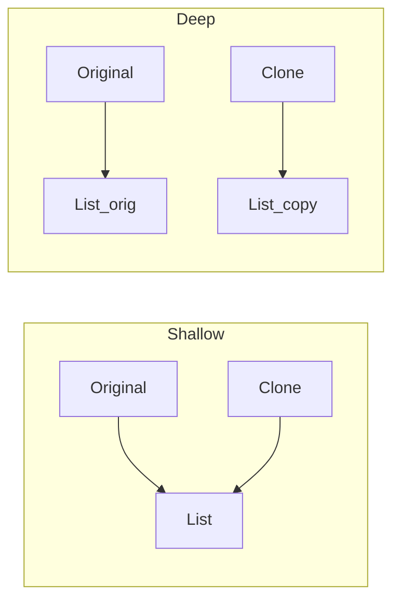

# Prototype — Middle Level

> **Source:** [refactoring.guru/design-patterns/prototype](https://refactoring.guru/design-patterns/prototype)
> **Prerequisite:** [Junior](junior.md)
> **Focus:** **Why** and **When**

---

## Table of Contents

1. [Introduction](#introduction)
2. [When to Use Prototype](#when-to-use-prototype)
3. [When NOT to Use Prototype](#when-not-to-use-prototype)
4. [Real-World Cases](#real-world-cases)
5. [Production Code](#production-code)
6. [Trade-offs](#trade-offs)
7. [Alternatives](#alternatives)
8. [Refactoring](#refactoring)
9. [Edge Cases](#edge-cases)
10. [Tricky Points](#tricky-points)
11. [Best Practices](#best-practices)
12. [Summary](#summary)
13. [Diagrams](#diagrams)

---

## Introduction

> Focus: **Why** and **When**

Prototype is the right tool when **building from scratch is expensive** but **copying is cheap** — or when you need to clone polymorphically without knowing the concrete type. The middle-level skill is identifying these scenarios and choosing the right copy depth (shallow vs deep) and architecture (registry, factory, hybrid).

The pattern's strongest case is **configuration presets**: build N "templates" once, clone them for actual use. Examples: game enemies, document templates, API request defaults.

---

## When to Use Prototype

Use Prototype when **any** of:

1. **Construction is expensive.** Loading from disk, parsing schemas, computing initial state.
2. **Polymorphic copying needed.** Code has a `Shape` reference; needs another shape just like it without knowing its concrete class.
3. **Configuration variants.** A "default" object plus modifications.
4. **Snapshots.** Memento-like state capture (though Memento is the better fit there).
5. **Many similar objects.** Game entities, particles, document elements.

### Strong-fit examples

- Game engines (entity templates).
- Document editors (default styled blocks).
- Test fixtures (modify a copy of valid data).
- Preset configurations (dev/staging/prod from base).

---

## When NOT to Use Prototype

| Anti-pattern symptom | Better choice |
|---|---|
| Construction is cheap | Just use constructor |
| Object is immutable | Share the same instance — no clone needed |
| Deep clone gets tangled (cycles, external resources) | Reconsider design |
| You don't actually clone — just create variants | [Factory Method](../01-factory-method/junior.md) or [Builder](../03-builder/junior.md) |

### Strong-misfit examples

- Simple value types (`Point`, `Money`) — share, don't clone.
- Singletons — defeats the pattern.
- Objects with file handles, network connections, threads.

---

## Real-World Cases

### 1. Game Entities

```python
# Pre-configure prototypes once
goblin_proto = Enemy(hp=30, speed=5, sprite="goblin.png", attack=Attack("bite", 5))
orc_proto    = Enemy(hp=80, speed=3, sprite="orc.png",    attack=Attack("club", 12))

# In game loop
for spawn_point in level.spawns:
    enemy = copy.deepcopy(goblin_proto)
    enemy.x, enemy.y = spawn_point
    level.enemies.append(enemy)
```

Building 100 enemies from scratch loads 100 sprites, parses 100 attack configs. Cloning the prototype reuses parsed data.

### 2. Document Editor — Style Templates

```java
StyledBlock heading1 = new StyledBlock(font: "Arial", size: 24, bold: true, color: black);
StyledBlock heading2 = heading1.clone();
heading2.size = 20;
```

Derive variants from a "Heading 1" template.

### 3. Multi-Environment Configs

```python
base_config = AppConfig.load("base.yaml")

dev_config     = copy.deepcopy(base_config); dev_config.debug = True
staging_config = copy.deepcopy(base_config); staging_config.cache_size = 1000
prod_config    = copy.deepcopy(base_config); prod_config.cache_size = 10000
```

Same starting point; small per-environment tweaks.

### 4. Test Data

```java
User valid = User.builder().name("Test").email("t@e.c").role("user").build();

@Test
void adminCanDelete() {
    User admin = clone(valid);
    admin.role = "admin";
    // ...
}
```

(Or use Test Data Builder for the same effect.)

### 5. Undo/Redo via Snapshots

```go
type Editor struct {
    state    *State
    history  []*State
}

func (e *Editor) Undo() {
    if len(e.history) == 0 { return }
    e.state = e.history[len(e.history)-1].Clone()
    e.history = e.history[:len(e.history)-1]
}

func (e *Editor) Save() {
    e.history = append(e.history, e.state.Clone())
}
```

Each save snapshots state via clone. (Note: [Memento](../../03-behavioral/05-memento/junior.md) is the dedicated pattern for this.)

---

## Production Code

### Java — Avoiding `Cloneable`

```java
public final class Document {
    private final String title;
    private final List<Section> sections;
    private final Map<String, String> metadata;

    public Document(String title, List<Section> sections, Map<String, String> metadata) {
        this.title    = title;
        this.sections = new ArrayList<>(sections);   // defensive copy
        this.metadata = new HashMap<>(metadata);
    }

    /** Copy constructor — deep copy of nested mutable state. */
    public Document(Document other) {
        this.title = other.title;
        this.sections = other.sections.stream().map(Section::new).collect(Collectors.toList());
        this.metadata = new HashMap<>(other.metadata);
    }

    public Document clone() { return new Document(this); }
}

public final class Section {
    public final String content;
    public final List<String> tags;
    public Section(String content, List<String> tags) { this.content = content; this.tags = new ArrayList<>(tags); }
    public Section(Section other) { this.content = other.content; this.tags = new ArrayList<>(other.tags); }
}
```

Each level handles its own deep copy. No `Cloneable`.

### Python — Custom `__deepcopy__` for Performance

```python
import copy
from dataclasses import dataclass, field

@dataclass
class CachedDocument:
    title: str
    cache: dict[str, bytes] = field(default_factory=dict)   # large
    sections: list = field(default_factory=list)

    def __deepcopy__(self, memo):
        # Don't deep-copy the cache (immutable bytes anyway, share is fine)
        new = CachedDocument(self.title)
        new.cache = self.cache    # shared
        new.sections = copy.deepcopy(self.sections, memo)
        return new

doc1 = CachedDocument(title="A", cache={"img": b"..." * 10**6})
doc2 = copy.deepcopy(doc1)
# doc1.cache is doc2.cache (shared, saves memory)
```

Custom `__deepcopy__` lets you mix shallow + deep selectively. Used when some fields are large + immutable and shouldn't be deep-copied.

### Go — Hierarchical Clone with Slices/Maps

```go
package config

type Database struct {
    Host string
    Port int
    Tags []string
}

func (d *Database) Clone() *Database {
    return &Database{
        Host: d.Host,
        Port: d.Port,
        Tags: append([]string(nil), d.Tags...),   // explicit slice copy
    }
}

type AppConfig struct {
    Name      string
    Database  *Database
    Features  map[string]bool
}

func (c *AppConfig) Clone() *AppConfig {
    features := make(map[string]bool, len(c.Features))
    for k, v := range c.Features {
        features[k] = v
    }
    return &AppConfig{
        Name:     c.Name,
        Database: c.Database.Clone(),   // recursive
        Features: features,
    }
}
```

Each level explicitly handles its own deep copy. No reflection, no `copy` package magic.

---

## Trade-offs

| Dimension | Prototype (clone) | Constructor + state | Builder | Factory |
|---|---|---|---|---|
| Concrete class dependency | None | Required | Required | None |
| Construction cost | Cheap (copy) | Recomputed | Cheap-ish | Recomputed |
| Variant derivation | Easy | Manual | Easy | Manual |
| Risk | Shallow/deep bugs | None | None | None |

---

## Alternatives

### vs Builder

- **Builder** for assembling from scratch with many optional fields.
- **Prototype** for copying an existing configured object.

Combine: a Builder produces a prototype; clones derive variants.

### vs Factory Method

- **Factory** decides which class to instantiate.
- **Prototype** clones existing instance, doesn't choose a class.

Use Prototype when construction is expensive; Factory when you need polymorphic instantiation.

### vs Sharing Immutable

For immutable objects, just share the reference:

```python
TIMEOUT = Duration(seconds=30)
client.request(timeout=TIMEOUT)   # safe to share — Duration is immutable
```

Cloning immutable is wasteful.

### vs Memento

[Memento](../../03-behavioral/05-memento/junior.md) is for state snapshots (undo/redo), preserving encapsulation. Prototype is for "make me another like this." Different intents, similar mechanics.

---

## Refactoring

### Toward Prototype

Code with repeated expensive construction:

```python
# Before
for i in range(1000):
    enemy = Enemy(load_sprite("goblin.png"), parse_attack("bite"), ...)
    spawn(enemy)
```

```python
# After
goblin_proto = Enemy(load_sprite("goblin.png"), parse_attack("bite"), ...)
for i in range(1000):
    enemy = copy.deepcopy(goblin_proto)
    spawn(enemy)
```

### Away from Prototype

If the cloned objects are immutable and small, just share:

```python
# Before
for i in range(1000):
    cfg = copy.deepcopy(default_config)
    cfg.id = i
    use(cfg)
```

```python
# After
for i in range(1000):
    use(default_config, override={"id": i})   # if API supports
```

---

## Edge Cases

### Circular References

Naive deep clone infinite-loops:

```python
a = Node(); b = Node()
a.parent = b; b.parent = a
copy.deepcopy(a)   # works! `copy.deepcopy` uses memo internally.
```

Custom `__deepcopy__` must accept and use `memo`:

```python
def __deepcopy__(self, memo):
    if id(self) in memo: return memo[id(self)]
    new = type(self)(); memo[id(self)] = new
    new.parent = copy.deepcopy(self.parent, memo)
    return new
```

### External Resources

File handles, sockets, threads can't be cloned naively. Either reopen in clone, or share carefully.

```java
public Document clone() {
    Document d = new Document(this);
    d.fileHandle = openNewFile(this.path);   // fresh handle
    return d;
}
```

### Final Fields (Java)

A copy constructor handles `final` fields naturally. `Object.clone()` does not (it skips constructor invocation).

### Inheritance Chains

Each level of inheritance must override `clone()` (or copy constructor). Forgetting to do so leads to **slicing** — clone returns parent type, losing subclass fields.

---

## Tricky Points

- **Java's `Cloneable` is broken.** Always implement clone via copy constructor.
- **Python's default `copy.deepcopy` works for most classes.** Override only when needed (large immutable fields, external resources).
- **Go's slice/map `=` is shallow.** Always explicit copy in `Clone()`.
- **Prototype + Singleton conflict.** Cloning a singleton makes two of them — defeats the singleton pattern.
- **Performance:** deep clone of large object graphs is O(n). For very large trees, consider persistent data structures (structural sharing).

---

## Best Practices

1. **Prefer copy constructor over `Cloneable`** in Java.
2. **Document shallow vs deep semantics** clearly.
3. **In Go**, explicitly copy slices/maps; don't trust `=`.
4. **In Python**, `copy.deepcopy` is the default tool; override `__deepcopy__` for performance.
5. **Combine with Registry** for "preset" prototypes.
6. **Don't clone immutable objects** — share references.
7. **Test:** verify clone is independent (mutate clone, original unchanged).

---

## Summary

- Prototype = copy existing objects without concrete-class dependency.
- Use when construction is expensive or polymorphic copy is needed.
- Java: copy constructor + clone (skip `Cloneable`).
- Python: `copy.copy` / `copy.deepcopy` with optional overrides.
- Go: explicit deep-copy of reference fields.
- Often combined with Registry for preset templates.

---

## Diagrams

### Shallow vs Deep



### Refactor


[← Junior](junior.md) · [Creational](../README.md) · [Roadmap](../../../README.md) · **Next:** [Senior](senior.md)
