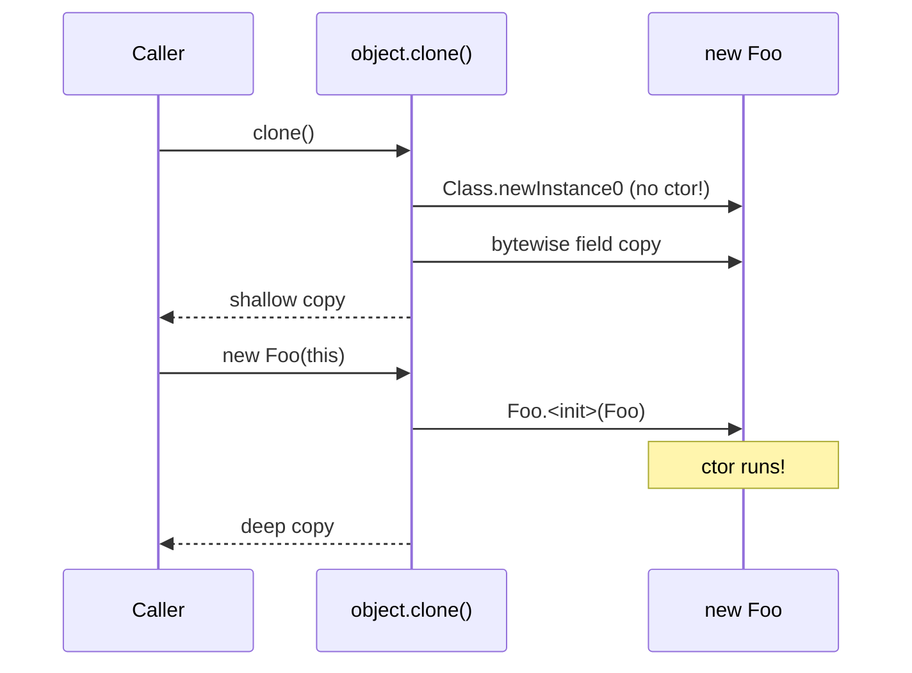

# Prototype — Professional Level

> **Source:** [refactoring.guru/design-patterns/prototype](https://refactoring.guru/design-patterns/prototype)
> **Prerequisites:** [Junior](junior.md) · [Middle](middle.md) · [Senior](senior.md)

---

## Introduction

At the professional level, Prototype intersects with **memory model semantics**, **JVM/Go runtime**, **serialization**, and **persistent data structures**. You should be able to:

- Explain why Java's `Object.clone()` skips the constructor and what that means.
- Implement Copy-on-Write correctly under multi-threading.
- Reason about clone performance for large object graphs.
- Choose between deep clone, structural sharing, and persistent data structures.

---

## Java's `Object.clone()` Internals

The native `Object.clone()`:

1. Allocates new object of the same class via `Class.newInstance0` (bypassing constructor).
2. Performs a **field-by-field shallow copy** at the bytecode level.
3. Returns the new object.

Implications:
- **No constructor runs.** Final field initializers, side effects in constructors — skipped.
- **Shallow.** Object references are copied; pointed-to objects shared.
- **Throws `CloneNotSupportedException` unless `Cloneable` is implemented.** Marker interface only.

This is why Bloch advises *"Override `clone` judiciously"* (Effective Java Item 13). Most modern Java code uses copy constructors:

```java
public final class Foo {
    public Foo(Foo other) { this.x = other.x; ... }
    public Foo clone() { return new Foo(this); }
}
```

`Cloneable` is bypassed entirely.

---

## Memory Model & Visibility

A clone operation creates a new object. Other threads observing the clone need a happens-before edge to see fully-initialized state.

```java
public Foo clone() {
    Foo copy = new Foo();
    copy.x = this.x;
    copy.list = new ArrayList<>(this.list);
    return copy;   // safe publication via return
}
```

The `return` statement is a synchronization action — the calling thread sees the assigned fields. Within a single thread, this is automatic. Across threads, ensure publication via:

- `final` fields (JMM guarantees safe publication after constructor).
- Synchronized publication.
- `volatile` references.

---

## Copy-on-Write (COW) Correctness

A correct COW implementation under concurrency:

```java
public final class CowList<T> {
    private volatile List<T> items;          // immutable snapshot
    private volatile boolean owned;

    public CowList(List<T> initial)          { this.items = List.copyOf(initial); this.owned = true; }
    public CowList<T> clone()                 { return new CowList<>(this.items, false); }
    private CowList(List<T> items, boolean owned) { this.items = items; this.owned = owned; }

    public synchronized void add(T item) {
        if (!owned) {
            this.items = new ArrayList<>(items);
            this.owned = true;
        }
        ((ArrayList<T>) items).add(item);
    }
}
```

Reads (`items.get(...)`) are lock-free thanks to `volatile`. Writes synchronize.

Key insight: until first mutation, two CowLists share the same `List` reference. Mutation triggers ownership transfer.

Used in `java.util.concurrent.CopyOnWriteArrayList`.

---

## Performance: Deep Clone Cost

For an object graph with N nodes:
- **Time:** O(N) — must visit every node.
- **Memory:** O(N) — fresh copies.
- **GC pressure:** N allocations.

For large graphs, this is expensive. Mitigations:

### 1. Selective deep copy

Identify which fields really need fresh copies:

```java
public Doc clone() {
    Doc d = new Doc();
    d.title = this.title;          // String is immutable — share
    d.cache = this.cache;          // Read-only — share
    d.sections = deepCopy(this.sections);   // Mutable — clone
    return d;
}
```

### 2. Structural sharing

Persistent data structures (Scala `immutable.Map`, Clojure HAMTs):

```scala
val m1 = Map("a" -> 1)
val m2 = m1 + ("b" -> 2)   // O(log n), shares most internal nodes
```

`m2` and `m1` share most of their internal trie. "Copying" a 1M-entry map: ~20 allocations vs 1M.

### 3. Pre-clone caching

If many clones are made of the same prototype:

```java
public final class CachedClone {
    private final Foo prototype = expensiveLoad();
    public Foo create() { return prototype.clone(); }
}
```

Loaded once; cloned many times.

---

## Serialization-Based Cloning

A common deep-clone trick:

```java
public Foo deepClone(Foo orig) throws IOException, ClassNotFoundException {
    ByteArrayOutputStream bos = new ByteArrayOutputStream();
    new ObjectOutputStream(bos).writeObject(orig);
    return (Foo) new ObjectInputStream(new ByteArrayInputStream(bos.toByteArray())).readObject();
}
```

**Pros:**
- Handles deep object graphs automatically.
- Handles cycles (via reference IDs).
- Less code than manual `clone()`.

**Cons:**
- ~10× slower than manual clone.
- Requires `Serializable`.
- Doesn't work for transient/external resources.
- `ObjectInputStream` has security implications (gadget chains).

**Modern alternative:** Jackson / Gson:

```java
public <T> T deepClone(T orig, Class<T> type) {
    String json = mapper.writeValueAsString(orig);
    return mapper.readValue(json, type);
}
```

Slow but reliable for POJOs.

---

## Python `copy` Module Internals

`copy.deepcopy(obj, memo=None)`:

1. Check `memo` (default empty dict) for existing copy.
2. If `obj` is in memo, return memoized copy (handles cycles).
3. If `obj` has `__deepcopy__`, call `obj.__deepcopy__(memo)`.
4. If `obj` is a primitive (int, str, frozenset, etc.), return it (immutable, share).
5. Otherwise, fall back to **pickle protocol** (`__reduce_ex__`) for unknown types.

The pickle fallback is slow but works for most user classes.

### Custom `__deepcopy__` performance

```python
class Doc:
    def __deepcopy__(self, memo):
        new = Doc()
        memo[id(self)] = new   # before recursing
        new.children = [copy.deepcopy(c, memo) for c in self.children]
        return new
```

vs. relying on pickle fallback:
- Custom: ~5× faster for simple structures.
- Custom: handles non-picklable types.
- Custom: explicit about what's copied vs shared.

---

## Go: Reflection-Based Deep Clone

For generic deep clone in Go:

```go
import "reflect"

func deepClone(src any) any {
    v := reflect.ValueOf(src)
    return reflect.New(v.Type()).Elem().Interface()   // simplified; real version recurses
}
```

Reflection is **slow** (~100× direct field copy). Libraries like `mohae/deepcopy` exist but are rarely used in production. **Prefer hand-written `Clone()` methods.**

---

## Benchmarks

Apple M2 Pro, single thread.

### Java

```
DirectConstructor                500M ops/s
CopyConstructor (handwritten)    400M ops/s
ObjectClone (Cloneable)          250M ops/s   (shallow)
ObjectStreamClone (Serializable) 50K ops/s
JacksonClone (JSON roundtrip)    100K ops/s
```

Manual copy constructor is ~80% the speed of direct construction.

### Python

```
copy.copy (shallow)              200 ns
copy.deepcopy (custom __deepcopy__)  600 ns
copy.deepcopy (pickle fallback)  3 µs
```

Custom `__deepcopy__` for hot paths.

### Go

```
DirectStructCopy                 500M ops/s
HandwrittenClone                 200M ops/s   (with explicit slice copy)
ReflectionDeepCopy                3M ops/s
```

Hand-written clone for hot paths.

---

## Persistent Data Structures (When Possible)

Languages with first-class persistent structures (Clojure, Scala) sidestep most clone concerns:

```clojure
(def m1 {:a 1 :b 2})
(def m2 (assoc m1 :c 3))   ; m1 unchanged; m2 shares with m1
```

`assoc` is O(log n). No clone needed.

**Vavr** brings this to Java:

```java
import io.vavr.collection.Map;

Map<String, Integer> m1 = HashMap.of("a", 1, "b", 2);
Map<String, Integer> m2 = m1.put("c", 3);   // immutable, structural sharing
```

For data-heavy clones, Vavr eliminates the deep clone problem.

---

## Diagrams

### `Object.clone` vs Copy Constructor



### COW

```mermaid
stateDiagram-v2
    [*] --> Shared : after clone()
    Shared --> Owned : first write
    Owned --> Owned : subsequent writes
    Note right of Shared : reads cheap;<br/>storage shared
    Note right of Owned : storage allocated;<br/>mutation in place
```



---

## Related Topics

- **JIT internals:** *Java Performance* (Scott Oaks).
- **JMM:** Java Concurrency in Practice (Goetz et al.), Chapter 16.
- **Persistent data structures:** Okasaki's "Purely Functional Data Structures."
- **Clojure data structures:** Bagwell's HAMT papers.

---

[← Senior](senior.md) · [Creational](../README.md) · [Roadmap](../../../README.md) · **Next:** [Interview](interview.md)
