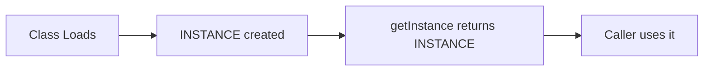
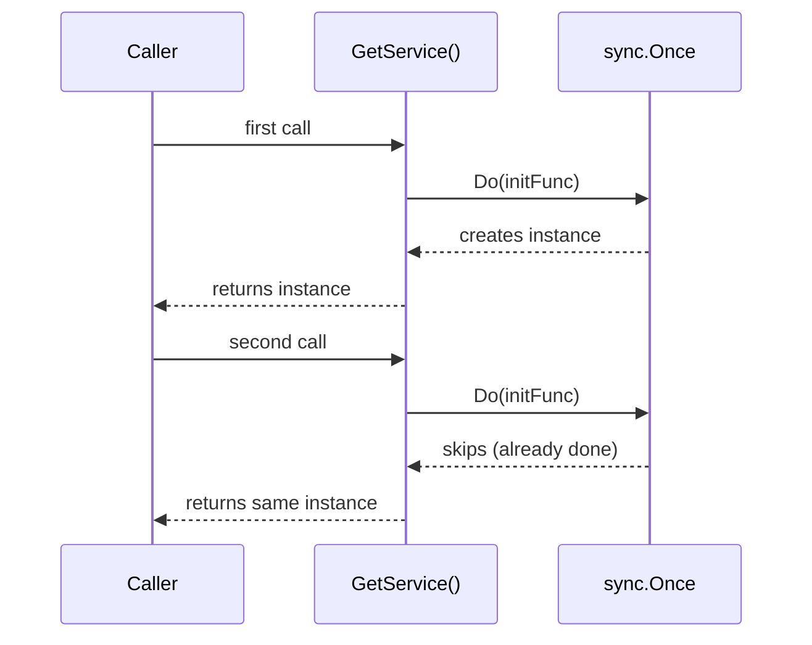
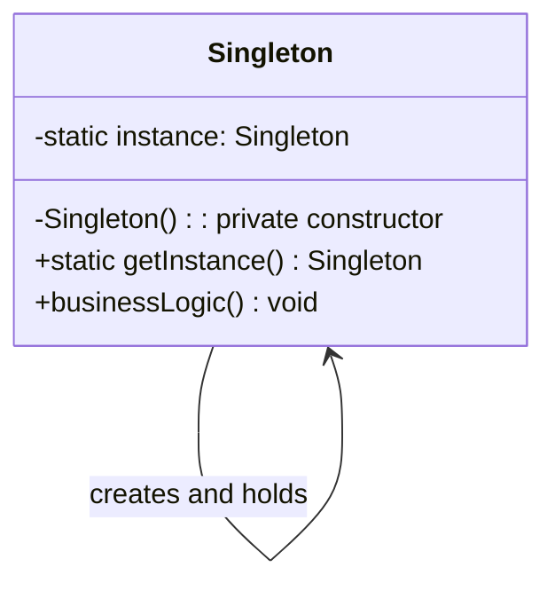
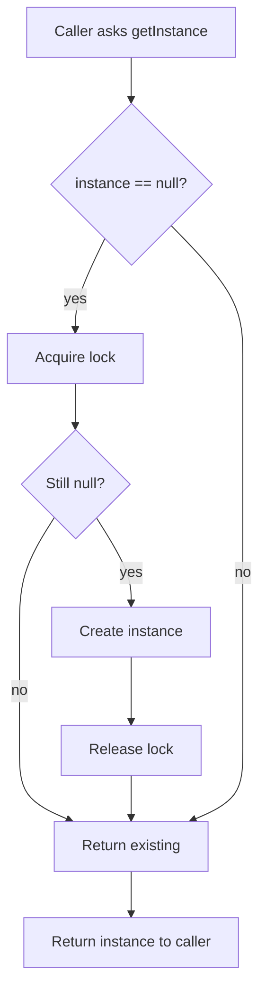
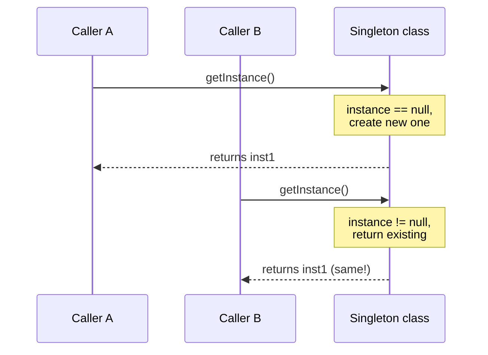

# Singleton — Junior Level

> **Source:** [refactoring.guru/design-patterns/singleton](https://refactoring.guru/design-patterns/singleton)
> **Category:** [Creational](../README.md) — *"Provide various object creation mechanisms, which increase flexibility and reuse of existing code."*

---

## Table of Contents

1. [Introduction](#introduction)
2. [Prerequisites](#prerequisites)
3. [Glossary](#glossary)
4. [Core Concepts](#core-concepts)
5. [Real-World Analogies](#real-world-analogies)
6. [Mental Models](#mental-models)
7. [Pros & Cons](#pros--cons)
8. [Use Cases](#use-cases)
9. [Code Examples](#code-examples)
10. [Coding Patterns](#coding-patterns)
11. [Clean Code](#clean-code)
12. [Best Practices](#best-practices)
13. [Edge Cases & Pitfalls](#edge-cases--pitfalls)
14. [Common Mistakes](#common-mistakes)
15. [Tricky Points](#tricky-points)
16. [Test Yourself](#test-yourself)
17. [Tricky Questions](#tricky-questions)
18. [Cheat Sheet](#cheat-sheet)
19. [Summary](#summary)
20. [What You Can Build](#what-you-can-build)
21. [Further Reading](#further-reading)
22. [Related Topics](#related-topics)
23. [Diagrams & Visual Aids](#diagrams--visual-aids)

---

## Introduction

> Focus: **What is it?** and **How to use it?**

**Singleton** is a creational design pattern that ensures a class has **exactly one instance** and provides a **global access point** to it.

Imagine you're writing an application that talks to a database. You only want **one** database connection object — creating multiple connection objects would waste memory and might cause data inconsistencies. The Singleton pattern is the textbook solution: **one object, accessible everywhere**.

In one sentence: *"There must be one, and only one, of this thing — and anyone can ask for it."*

This is the **simplest** of the GoF patterns to understand and the **most-debated** one in practice. You will write Singletons. You will also be told never to use Singletons. Both are partially right. We'll learn what it is, then in `middle.md` and `senior.md` we'll learn when it earns its place.

---

## Prerequisites

What you should know before reading this:

- **Required:** Basic OOP — classes, objects, constructors. The pattern controls how a class is instantiated.
- **Required:** Static methods / fields. Singleton uses a class-level variable to hold "the one" instance.
- **Required:** Visibility modifiers (`private`, `public`). The whole pattern depends on hiding the constructor.
- **Helpful but not required:** Basic concurrency awareness — locks, race conditions. Single-threaded Singleton is trivial; thread-safe is where it gets interesting (covered in `middle.md`).

---

## Glossary

| Term | Definition |
|------|-----------|
| **Singleton** | A class restricted to a single instance, with a global access method. |
| **Instance** | A concrete object created from a class. Singletons have exactly one. |
| **Global Access Point** | A well-known, named way to retrieve the single instance from anywhere — usually a static method like `getInstance()`. |
| **Lazy Initialization** | Creating the instance the first time it's needed, not at program start. |
| **Eager Initialization** | Creating the instance immediately when the class is loaded. |
| **Thread Safety** | The property of working correctly when multiple threads call `getInstance()` simultaneously. |
| **Private Constructor** | A constructor that can't be called from outside the class — prevents `new Singleton()`. |
| **Static Field** | A field that belongs to the class itself, not to any instance. Holds the single instance. |

---

## Core Concepts

### 1. Single Instance Guarantee

A Singleton class **never** allows more than one object to exist. No matter how many times you ask for it, you always get **the same one**.

```
Singleton.getInstance() == Singleton.getInstance()  // always true
```

This is enforced by:
- A **private constructor** — the only place the instance is created
- A **static field** — holds the single instance
- A **static factory method** (typically `getInstance()`) — the public access point

### 2. Global Access

Anywhere in your code, you can call `Singleton.getInstance()` to reach the single instance. No need to pass it through function parameters or constructors. (This is also the source of most criticism — "global state in disguise.")

### 3. Controlled Instantiation

Construction is **not free** for the caller. The class controls when and how the instance is built. This makes lazy initialization, validation, and ordering possible.

---

## Real-World Analogies

| Concept | Analogy |
|---------|--------|
| **Single instance** | The President of a country — there's only one at any given time. Even if many people refer to "the President," they all mean the same person. |
| **Global access** | The clock on the wall in a school — everyone can read it from anywhere in the room. There's just one clock; no one creates a new one for themselves. |
| **Private constructor** | A private elevator — only the building owner has the key; no one else can summon a new elevator. |
| **Lazy initialization** | A hotel room safe — the safe is always there, but you only set it up the first time you need it. |

The "Government" analogy used by refactoring.guru is good: a country has *one* official government. The phrase *"The Government of [Country]"* is the global access point — everyone knows where to find them.

---

## Mental Models

**The intuition:** Picture a class that **owns** its only instance. The class itself is the gatekeeper. You don't ask "give me a new one"; you ask "give me **the** one."

**Why this model helps:** It separates the **identity** (the role) from the **object** (the implementation). A Logger isn't `new Logger()` — there is *the* Logger. Once you internalize this, you understand why constructors are private and why the access goes through a class-level method.

**Visualization:**

```
              ┌──────────────────────┐
              │     Singleton        │
              │ (the class itself)   │
              │                      │
              │  static instance ────┼───► [the single object]
              │                      │
              │  static getInstance()│
              └──────────────────────┘
                       ▲
                       │ asks
            ┌──────────┴──────────┐
            │  Caller A   Caller B │   ◄─── always gets the same object
            └─────────────────────┘
```

---

## Pros & Cons

| Pros | Cons |
|------|------|
| Guarantees only one instance exists | Violates the Single Responsibility Principle (manages instance count + business logic) |
| Provides a clear, named global access point | Hides dependencies — your code looks like it depends on nothing, but it depends on the singleton |
| Initializes the object only on first request (if lazy) | Hard to unit test — you can't easily inject a mock |
| Saves memory when the object is heavy | Multithreading requires careful design |
| Replaces unsafe global variables | Often abused; tempting "shortcut" for things that should be passed as parameters |

### When to use:
- A truly shared resource: **logger**, **configuration**, **connection pool**, **cache**
- Hardware or OS resources that genuinely have one (printer spooler, file system handle)
- A facade over an expensive-to-build subsystem

### When NOT to use:
- The object is light and stateless — just create new ones
- You need different configurations in different parts of the program — pass it explicitly instead
- You're writing tests that need to swap implementations — Dependency Injection is better

---

## Use Cases

Real-world places where Singleton is commonly applied:

- **Logger** — your whole application writes through one log facility. Every module shares the same logger.
- **Configuration Manager** — load app config once at startup; everyone reads from the same source.
- **Database Connection Pool** — one pool object manages all DB connections; you don't want two competing pools.
- **Cache** — a single in-memory cache shared across the app for performance.
- **Hardware Access** — printer spooler, audio device, GPU resource — only one process can own it.
- **Application Settings / User Preferences** — one source of truth.
- **Thread Pools** — typically one shared pool per category of work.

---

## Code Examples

### Go

In Go, the idiomatic Singleton uses `sync.Once` from the standard library:

```go
package main

import (
	"fmt"
	"sync"
)

// The Logger is the type we want exactly one of.
type Logger struct {
	prefix string
}

func (l *Logger) Log(msg string) {
	fmt.Printf("[%s] %s\n", l.prefix, msg)
}

// Package-level state: the instance and its initializer.
var (
	instance *Logger
	once     sync.Once
)

// GetLogger is the global access point. Safe to call from multiple goroutines.
func GetLogger() *Logger {
	once.Do(func() {
		instance = &Logger{prefix: "APP"}
	})
	return instance
}

func main() {
	a := GetLogger()
	b := GetLogger()

	a.Log("Hello")
	fmt.Println("Same instance?", a == b) // true
}
```

**What it does:** `sync.Once` guarantees the closure runs **exactly once**, even if hundreds of goroutines call `GetLogger()` simultaneously.

**How to run:** `go run main.go`

> **Note:** Go has no `private` keyword for fields, but lowercase identifiers (`instance`, `once`) are unexported — only the `GetLogger` function (uppercase = exported) is the public API.

---

### Java

The classical eager Singleton — initialized when the class is loaded:

```java
public final class Logger {
    // Eager initialization: created when class loads.
    private static final Logger INSTANCE = new Logger();

    // Private constructor: nobody outside can call new Logger().
    private Logger() {}

    public static Logger getInstance() {
        return INSTANCE;
    }

    public void log(String msg) {
        System.out.println("[APP] " + msg);
    }
}

// Usage:
class Demo {
    public static void main(String[] args) {
        Logger a = Logger.getInstance();
        Logger b = Logger.getInstance();
        a.log("Hello");
        System.out.println("Same? " + (a == b)); // true
    }
}
```

A lazy variant — created only when first requested:

```java
public final class Logger {
    private static Logger instance; // not yet created

    private Logger() {}

    public static synchronized Logger getInstance() {
        if (instance == null) {
            instance = new Logger();
        }
        return instance;
    }

    public void log(String msg) { System.out.println(msg); }
}
```

**What it does:** The `synchronized` keyword makes `getInstance()` thread-safe — only one thread at a time enters the method.

**How to run:** `javac Logger.java Demo.java && java Demo`

> **Trade-off (preview for `middle.md`):** Eager is simpler and thread-safe by default but allocates even if never used. Lazy + synchronized is correct but slow under contention. Better techniques exist (enum singleton, lazy holder idiom) — see `middle.md`.

---

### Python

The most idiomatic Singleton in Python is **a module**: import the same module from anywhere, you get the same object.

```python
# logger.py
class _Logger:
    def __init__(self):
        self.prefix = "APP"

    def log(self, msg):
        print(f"[{self.prefix}] {msg}")

# The module-level instance — the "singleton".
logger = _Logger()
```

```python
# main.py
from logger import logger

logger.log("Hello")
```

Anyone who imports `logger` from `logger.py` gets **the same object**. Python's import system caches modules, so the `_Logger()` constructor runs exactly once.

For more controlled cases, use a **metaclass**:

```python
class SingletonMeta(type):
    """A metaclass that turns any class into a Singleton."""
    _instances = {}

    def __call__(cls, *args, **kwargs):
        if cls not in cls._instances:
            cls._instances[cls] = super().__call__(*args, **kwargs)
        return cls._instances[cls]


class Logger(metaclass=SingletonMeta):
    def __init__(self):
        self.prefix = "APP"

    def log(self, msg):
        print(f"[{self.prefix}] {msg}")


a = Logger()
b = Logger()
print(a is b)  # True
```

**What it does:** Calling `Logger()` always returns the same object — the metaclass intercepts construction.

**How to run:** `python3 main.py`

> **Note:** This is **not** thread-safe. For thread safety, wrap the `__call__` body in `with self._lock:` (covered in `middle.md`).

---

## Coding Patterns

### Pattern 1: Eager Initialization

**Intent:** Build the singleton at startup. Simple, thread-safe by default.
**When to use:** The object is cheap to build and almost always used.

```java
public final class Config {
    private static final Config INSTANCE = new Config();
    private Config() {}
    public static Config getInstance() { return INSTANCE; }
}
```

**Diagram:**



**Remember:** Eager = always created. Lazy = created on demand.

---

### Pattern 2: Lazy Initialization

**Intent:** Defer creation until first use.
**When to use:** Construction is expensive and the object may not always be needed.

```go
var (
    instance *Service
    once     sync.Once
)

func GetService() *Service {
    once.Do(func() { instance = &Service{} })
    return instance
}
```

**Diagram:**



---

### Pattern 3: Module Singleton (Python)

**Intent:** Use Python's module caching as a free Singleton.
**When to use:** Almost always in Python — it's the most Pythonic.

```python
# config.py
class _Config:
    def __init__(self):
        self.host = "localhost"
        self.port = 8080

config = _Config()
```

**Remember:** In Python, prefer module-level singletons. Reach for metaclass only when you need a class users instantiate directly.

---

## Clean Code

### Naming

Stick to the convention `getInstance()` / `GetLogger()` / module-level lower_snake_case for the instance.

```java
// ❌ Bad — unclear
public static Logger get() { ... }
public static Logger Logger() { ... }   // confusing — looks like constructor

// ✅ Clean
public static Logger getInstance() { ... }
```

```go
// ❌ Bad
func Get() *Logger { ... }
func New() *Logger { ... }   // misleading — "New" implies a fresh object

// ✅ Clean
func GetLogger() *Logger { ... }
```

```python
# ❌ Bad — random instance variables
my_logger = Logger()  # if Logger is a singleton, this is misleading
THE_LOGGER = Logger()  # SHOUTY_CASE for non-constants is wrong

# ✅ Clean
logger = Logger()       # module-level, lowercase
# or for module-singleton:
from app.logger import logger
```

### Constructor

Always make it **private** (or its language equivalent) and **document why**:

```java
public final class Logger {
    /** Use Logger.getInstance() — Singleton pattern. */
    private Logger() {}
    ...
}
```

---

## Best Practices

1. **Use `sync.Once` in Go** — don't roll your own double-checked locking.
2. **Prefer module-level instances in Python** — avoid metaclasses unless you have a real reason.
3. **Document the global access point** — make it discoverable; readers shouldn't search for "where do I get the Logger?"
4. **Make the class `final`** (Java) — prevent inheritance; subclasses break the singleton guarantee.
5. **Initialize as eagerly as you can** — lazy is for genuinely heavy objects only.
6. **Consider injecting it** — even singletons can be passed as parameters; this makes testing easier.

---

## Edge Cases & Pitfalls

- **Multi-threading races (lazy init):** without proper sync, two threads can both see `instance == null` and create two instances. Always use a thread-safe initializer.
- **Multiple class loaders (Java):** the JVM may load the same class twice in different class loaders, producing two singletons. Rare, but possible in app servers and plugin systems.
- **Forking processes (Python `multiprocessing`):** the singleton in the parent may share file descriptors or sockets that misbehave after `fork()`.
- **Tests pollute each other:** singleton state created in test A leaks into test B. Tests are no longer independent.
- **Serialization (Java):** if the singleton implements `Serializable`, deserializing creates a *new* instance — breaking the guarantee. Solution: implement `readResolve()`.
- **Reflection (Java):** `Constructor.setAccessible(true)` lets reflection bypass `private`. Defensive code throws if the field is already set.

---

## Common Mistakes

1. **Forgetting the private constructor.** Then anyone can do `new Logger()` and the whole thing falls apart.

   ```java
   // ❌ Public constructor — anyone can bypass getInstance()
   public Logger() {}
   ```

2. **Non-thread-safe lazy initialization.**

   ```java
   // ❌ RACE CONDITION — two threads can both see null
   if (instance == null) {
       instance = new Logger();
   }
   ```

3. **Returning a new object from getInstance() by accident.**

   ```go
   // ❌ This creates a new one every call!
   func GetLogger() *Logger {
       return &Logger{prefix: "APP"}
   }
   ```

4. **Holding mutable global state without synchronization** — every modification of the singleton's fields needs thread safety, not just construction.

5. **Singleton-of-singletons** — making the singleton's dependencies all singletons too. You end up with a tangle of global state.

---

## Tricky Points

- **"Global access" is a feature, not a free pass.** Yes, you can `Logger.getInstance()` anywhere — but every call site is now coupled to the Logger class. Hidden coupling is the deepest cost of Singleton.
- **Singletons are GC roots.** The instance lives until the program exits. If it accidentally holds references to short-lived objects, you have a memory leak.
- **Eager initialization runs at class-load time** — if it throws, the class can't be used. Be careful what you put in static initializers.
- **`getInstance()` is a static method, not a member.** It runs without `this`. Don't put instance-dependent logic in it.

---

## Test Yourself

1. What two things does Singleton guarantee?
2. Why is the constructor private?
3. What's the difference between eager and lazy initialization?
4. In Go, what does `sync.Once` do?
5. Why is the Python module-level instance "automatically" a singleton?
6. Name three real-world examples where Singleton is appropriate.
7. What's one major drawback of Singleton for testing?

<details><summary>Answers</summary>

1. Only one instance exists; there's a global way to access it.
2. To prevent anyone outside the class from creating new instances with `new`.
3. Eager: created at class load. Lazy: created on first use.
4. Runs the given function exactly once, even across many goroutines.
5. Python caches modules — the first import runs the file; later imports return the same module object.
6. Logger, configuration, database connection pool. (Also: cache, thread pool, hardware access.)
7. Singletons are hard to mock; tests share state and become entangled.

</details>

---

## Tricky Questions

> **"Is Singleton an anti-pattern?"**

It depends. It's an anti-pattern **when overused** — when you make things singletons just because "they should be the same everywhere," instead of explicitly passing them around. It's a legitimate pattern **when** the constraint of "exactly one" is real (one DB pool, one config object). The strongest critique is that singletons hide dependencies, making tests hard. Modern style: prefer **Dependency Injection** that passes the (often single) instance around explicitly.

> **"Why not just use a global variable?"**

Globals don't enforce uniqueness — anyone can reassign them. They have no construction control. They have no lazy init. They have no instance lifecycle hooks. Singleton wraps a global with discipline.

> **"Can I subclass a Singleton?"**

Usually, no — and Java best practice marks the class `final`. Subclassing breaks the "one instance" rule (now you have an instance per subclass). If you need polymorphism, redesign — Singleton may not be your pattern.

---

## Cheat Sheet

```go
// GO
var (
    instance *T
    once     sync.Once
)
func GetT() *T {
    once.Do(func() { instance = &T{} })
    return instance
}
```

```java
// JAVA — eager (simplest, thread-safe)
public final class T {
    private static final T INSTANCE = new T();
    private T() {}
    public static T getInstance() { return INSTANCE; }
}
```

```python
# PYTHON — module-level (most idiomatic)
# in module t.py
class _T:
    pass

t = _T()

# elsewhere:
from t import t
```

---

## Summary

- **Singleton** = one instance + global access point.
- Three ingredients: **private constructor**, **static instance field**, **static `getInstance()`**.
- **Lazy** vs **eager** initialization is a key trade-off.
- **Thread safety** matters in Go (`sync.Once`), Java (`synchronized` or enum), Python (`threading.Lock` if needed).
- Easy to write, easy to overuse. **Use sparingly.**

If a part of your code says *"there must be one, and only one of these,"* Singleton is your tool. If it says *"every part of the system needs this,"* think first about whether passing it explicitly would be clearer.

---

## What You Can Build

Concrete projects to practice Singleton:

- **A simple logger** — write `[INFO] msg` to stdout from anywhere in your app
- **A config loader** — load `config.json` once at startup; expose typed accessors
- **A small in-memory cache** — `Set(key, value)`, `Get(key)`, with TTL expiry
- **A connection pool wrapper** — manage a pool of DB connections behind one access point
- **A feature flag service** — boolean flags shared across the app, refreshed periodically

---

## Further Reading

- **refactoring.guru source page:** [refactoring.guru/design-patterns/singleton](https://refactoring.guru/design-patterns/singleton)
- **GoF book:** *Design Patterns: Elements of Reusable Object-Oriented Software*, p. 127 (Singleton)
- **Effective Java (3rd ed.), Joshua Bloch:** Item 3 — "Enforce the singleton property with a private constructor or an enum type"
- **Go documentation on `sync.Once`:** [pkg.go.dev/sync#Once](https://pkg.go.dev/sync#Once)
- **Python docs on metaclasses:** [docs.python.org/3/reference/datamodel.html#metaclasses](https://docs.python.org/3/reference/datamodel.html#metaclasses)

---

## Related Topics

- **Next level:** [Singleton — Middle Level](middle.md) — when to use, when *not* to, refactoring away from Singleton, comparison with DI.
- **Patterns commonly implemented as singletons:** [Abstract Factory](../02-abstract-factory/junior.md), [Builder](../03-builder/junior.md), [Facade](../../02-structural/05-facade/junior.md).
- **Alternative to Singleton:** Dependency Injection (DI) containers — Spring, Guice, NestJS DI.
- **Related distinct pattern:** [Flyweight](../../02-structural/06-flyweight/junior.md) — many shared instances, not just one.
- **Variant pattern:** Multiton — bounded number of instances keyed by some criterion (covered in `middle.md`).

---

## Diagrams & Visual Aids

### UML Class Diagram



### Initialization Flow (Lazy)



### Sequence Diagram — Two Callers



---

[← Back to Singleton folder](.) · [↑ Creational Patterns](../README.md) · [↑↑ Roadmap Home](../../../README.md)

**Next:** [Singleton — Middle Level](middle.md) (when, why, alternatives, refactoring, deeper code)
