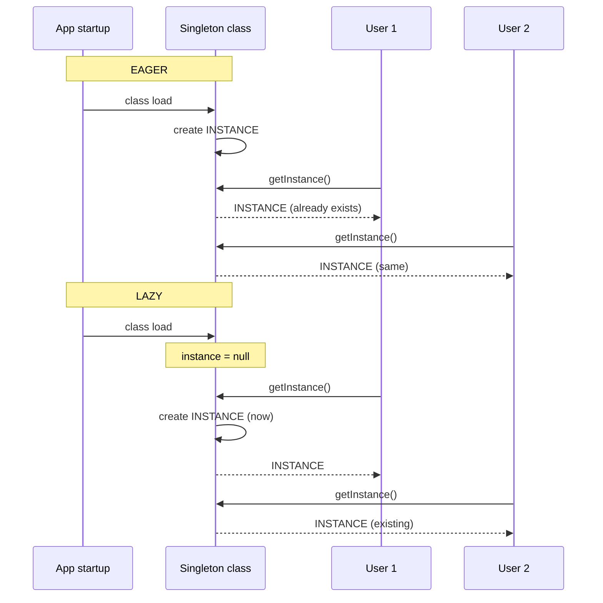
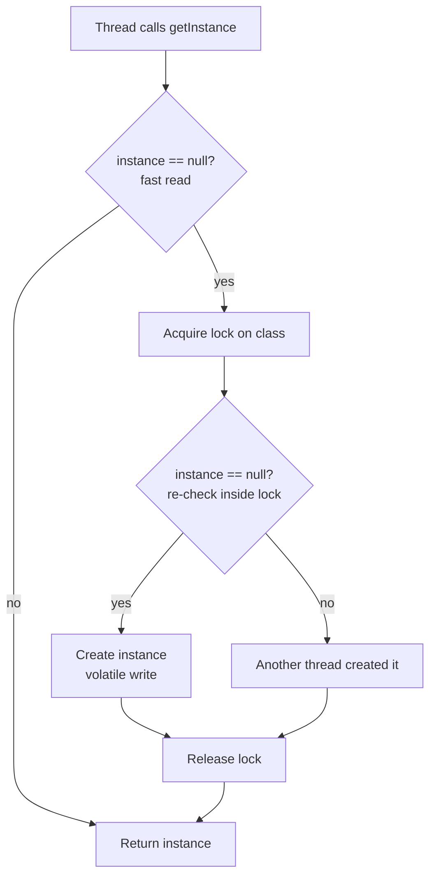
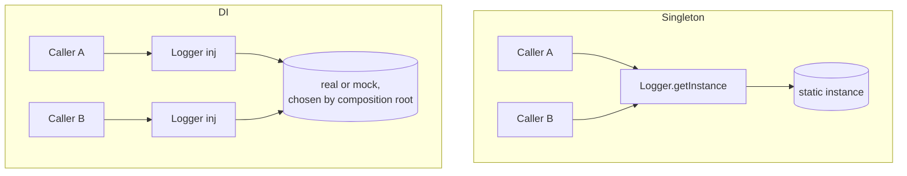

# Singleton — Middle Level

> **Source:** [refactoring.guru/design-patterns/singleton](https://refactoring.guru/design-patterns/singleton)
> **Prerequisite:** [Singleton — Junior Level](junior.md)
> **Focus:** **Why** and **When** — production tradeoffs, alternatives, refactoring, multi-threading reality.

---

## Table of Contents

1. [Introduction](#introduction)
2. [When to Use Singleton](#when-to-use-singleton)
3. [When NOT to Use Singleton](#when-not-to-use-singleton)
4. [Real-World Cases](#real-world-cases)
5. [Code Examples — Production-Grade](#code-examples--production-grade)
6. [Trade-offs](#trade-offs)
7. [Alternatives Comparison](#alternatives-comparison)
8. [Refactoring from Singleton](#refactoring-from-singleton)
9. [Pros & Cons (Deeper)](#pros--cons-deeper)
10. [Edge Cases](#edge-cases)
11. [Tricky Points](#tricky-points)
12. [Best Practices](#best-practices)
13. [Tasks (Practice)](#tasks-practice)
14. [Summary](#summary)
15. [Related Topics](#related-topics)
16. [Diagrams](#diagrams)

---

## Introduction

> Focus: **Why** and **When**

You know how to *write* a Singleton. The middle-level question is: **does this problem actually need one?**

Singleton is the most over-applied GoF pattern. Every time you say "this is shared," you're tempted to reach for it — and often, what you really need is **dependency injection**, **a module-level value**, or **a regular object passed around**. This file separates the cases where Singleton genuinely shines from the cases where it just makes the code harder to test.

We also dig into the threading story Java glosses over in tutorials (the *real* "why" behind enum singleton), the production-grade variants in Go and Python, and how to migrate a codebase that's drowning in singletons toward DI without a big-bang rewrite.

---

## When to Use Singleton

Use Singleton when **all** of the following are true:

1. **The constraint "exactly one" is real**, not aesthetic.
   - "There must be exactly one process-wide write-lock for this file" — real.
   - "Sharing makes it easier" — not real; that's a passing-it-around problem.

2. **The instance is genuinely process-wide.**
   - One DB pool per process: yes.
   - "One per request" or "one per tenant": that's not Singleton, it's **Multiton** or **per-context** state.

3. **You can live with the testing cost.**
   - Either the singleton is a small, side-effect-free object, or
   - You expose a way to reset/replace it for tests.

4. **DI is overkill for the project.**
   - Small CLI tool? Singleton is fine.
   - Large web service with many environments? Pass it explicitly.

### Strong-fit examples

- **Logger** — global, side-effect-free reads, accepts arbitrary writers.
- **Hardware spooler** — there is literally one printer queue.
- **Application-wide read-only configuration** — loaded once, immutable.
- **Process-wide cache or connection pool** — the resource itself is shared by definition.

---

## When NOT to Use Singleton

Avoid Singleton when:

| Anti-pattern symptom | Better alternative |
|---|---|
| You want it "easier to access" but the constraint is fake | Pass the dependency explicitly |
| You need different instances per environment (test/staging/prod) | Dependency Injection (DI) container or constructor injection |
| The "singleton" holds **mutable** application state (cart, user session) | Per-request state, scoped containers |
| You'd like to swap the implementation under test | Interface + DI (factory or registry, not Singleton) |
| You hit "race conditions in tests because singleton state leaks" | Reset method + careful design, OR drop the Singleton |
| Multiple instances *would* be fine but you wrote Singleton "just in case" | Plain class instances |

### Strong-misfit examples

- **HTTP request handler** — many concurrent requests, each needs its own state.
- **Domain entities** (User, Order, Product) — many instances by definition.
- **Per-tenant configuration** — at least one per tenant; use a registry keyed by tenant ID.

---

## Real-World Cases

### 1. Logger in a Microservice

```go
// internal/logger/logger.go
package logger

import (
	"log/slog"
	"os"
	"sync"
)

var (
	instance *slog.Logger
	once     sync.Once
)

func Get() *slog.Logger {
	once.Do(func() {
		opts := &slog.HandlerOptions{Level: slog.LevelInfo}
		instance = slog.New(slog.NewJSONHandler(os.Stdout, opts))
	})
	return instance
}
```

Why Singleton: every package logs through the same configured handler — same format, same output, same level filter. Reconfiguring at runtime is rare and can be done safely with an atomic pointer swap.

### 2. Configuration Loader at App Startup

```python
# app/config.py
from dataclasses import dataclass
from pathlib import Path
import json
import os

@dataclass(frozen=True)
class Config:
    db_url: str
    cache_size: int
    debug: bool

def _load() -> Config:
    path = Path(os.environ.get("CONFIG_PATH", "config.json"))
    data = json.loads(path.read_text())
    return Config(**data)

# Module-level singleton — Python's import cache makes this thread-safe at module load.
config: Config = _load()
```

```python
# elsewhere
from app.config import config
print(config.db_url)
```

Why Singleton: configuration is loaded once, immutable (`frozen=True`), and read by every component.

### 3. Database Connection Pool Wrapper

```java
public final class DbPool {
    private static final DbPool INSTANCE = new DbPool();
    private final HikariDataSource dataSource;

    private DbPool() {
        HikariConfig cfg = new HikariConfig();
        cfg.setJdbcUrl(System.getenv("DB_URL"));
        cfg.setMaximumPoolSize(20);
        this.dataSource = new HikariDataSource(cfg);
    }

    public static DbPool getInstance() { return INSTANCE; }

    public Connection getConnection() throws SQLException {
        return dataSource.getConnection();
    }

    /** For graceful shutdown. */
    public void close() { dataSource.close(); }
}
```

Why Singleton: the pool *is* the shared resource. Two pools competing for the same DB credentials would be wasteful and can deadlock.

### 4. HTTP Client with Connection Reuse

```go
package httpx

import (
	"net/http"
	"sync"
	"time"
)

var (
	client *http.Client
	once   sync.Once
)

func Client() *http.Client {
	once.Do(func() {
		client = &http.Client{
			Timeout: 10 * time.Second,
			Transport: &http.Transport{
				MaxIdleConns:        100,
				MaxIdleConnsPerHost: 10,
				IdleConnTimeout:     90 * time.Second,
			},
		}
	})
	return client
}
```

Why Singleton: `http.Client` and its transport reuse TCP connections. Creating multiple `Client` objects defeats the connection pool.

---

## Code Examples — Production-Grade

### Go — Thread-safe with `sync.Once` + Lazy Config Loading

```go
package config

import (
	"encoding/json"
	"fmt"
	"os"
	"sync"
)

type Config struct {
	DBUrl     string `json:"db_url"`
	CacheSize int    `json:"cache_size"`
	Debug     bool   `json:"debug"`
}

var (
	cfg     *Config
	loadErr error
	once    sync.Once
)

func Load() (*Config, error) {
	once.Do(func() {
		f, err := os.Open(os.Getenv("CONFIG_PATH"))
		if err != nil {
			loadErr = fmt.Errorf("open config: %w", err)
			return
		}
		defer f.Close()
		var c Config
		if err := json.NewDecoder(f).Decode(&c); err != nil {
			loadErr = fmt.Errorf("decode config: %w", err)
			return
		}
		cfg = &c
	})
	return cfg, loadErr
}
```

**Notes:**
- Errors must be captured into a package variable; `sync.Once` doesn't run again on failure.
- For tests, expose an unexported reset (`func resetForTest() { once = sync.Once{}; cfg = nil; loadErr = nil }`).

### Java — Enum Singleton (Bloch's Recommendation)

```java
public enum Logger {
    INSTANCE;

    private final java.util.logging.Logger backend
        = java.util.logging.Logger.getLogger("APP");

    public void info(String msg) { backend.info(msg); }
    public void warn(String msg) { backend.warning(msg); }
}

// Usage
Logger.INSTANCE.info("Hello");
```

**Why enum is the best Java Singleton (Bloch, *Effective Java*, Item 3):**

1. **Serialization-safe.** Default enum serialization preserves identity — no `readResolve()` needed.
2. **Reflection-safe.** `Constructor.newInstance()` on an enum throws `IllegalArgumentException`.
3. **Thread-safe initialization.** The JVM guarantees enum constants are constructed once, lazily, in a thread-safe way.
4. **Trivial syntax.** Three lines instead of fifteen.

Drawbacks: cannot extend a class (enums always extend `java.lang.Enum`); slightly more memory than a plain field.

### Java — Lazy Holder Idiom (When You Need Inheritance)

When you can't use enum (e.g., you need to extend a class), the **initialization-on-demand holder idiom** is the next best:

```java
public final class ExpensiveSingleton {
    private ExpensiveSingleton() {
        // Heavy work — only runs on first getInstance() call
        System.out.println("Constructing...");
    }

    private static class Holder {
        // JVM guarantees lazy + thread-safe class initialization
        static final ExpensiveSingleton INSTANCE = new ExpensiveSingleton();
    }

    public static ExpensiveSingleton getInstance() {
        return Holder.INSTANCE;
    }
}
```

**Why this works:**
- `Holder` is loaded only when `getInstance()` is first called → lazy.
- Class initialization is thread-safe by JLS — no explicit synchronization.
- No locking on subsequent calls → fast.

### Python — Thread-Safe `__new__`-Based

```python
import threading

class ThreadSafeSingleton:
    _instance = None
    _lock = threading.Lock()

    def __new__(cls, *args, **kwargs):
        # Double-checked: avoid lock on the hot path
        if cls._instance is None:
            with cls._lock:
                if cls._instance is None:
                    cls._instance = super().__new__(cls)
        return cls._instance

    def __init__(self, value=None):
        # WARNING: __init__ runs every time the class is "called",
        # even when __new__ returns an existing instance. Be careful.
        if not hasattr(self, "_initialized"):
            self.value = value
            self._initialized = True
```

**Pitfalls:**
- `__init__` runs on **every** `MyClass()` call, even when `__new__` returns an existing instance. Use `_initialized` guard or a separate factory method.
- Under CPython's GIL, even un-locked `__new__` is *usually* safe — but don't rely on that across implementations (PyPy, Jython, free-threaded 3.13+).

---

## Trade-offs

| Dimension | Singleton | Dependency Injection | Module value |
|---|---|---|---|
| **Discoverability** | Easy — `Logger.getInstance()` searchable | Requires reading wiring code | Visible at imports |
| **Testability** | Hard — global state | Easy — inject mocks | Medium — monkeypatching |
| **Boilerplate** | Low | Medium-High | Lowest |
| **Multi-environment** | Awkward | Built-in | Awkward |
| **Multi-instance need later** | Major refactor | Trivial change | Minor |
| **Coupling visibility** | Hidden | Explicit | Visible |
| **Thread safety** | Manual | Container handles it | Manual |

The takeaway: **DI wins when the project is large or test-heavy. Singleton wins when the project is small or the resource is genuinely process-global.**

---

## Alternatives Comparison

### vs. Static Class

```java
// Static class — looks like Singleton but isn't
public final class Logger {
    private Logger() {}
    public static void log(String msg) { /* ... */ }
}
```

Differences:
- Static class **cannot implement an interface** for polymorphism in older Java. (Java 8+ allows static methods on interfaces, but they don't play polymorphically.)
- Static class **has no instance state lifecycle**. Singleton can be lazy, can be reset, can be replaced.
- Static class **can't be passed as a parameter or mocked**. Singleton can — somewhat.

When to pick static: pure utility functions (`Math.max`, `Arrays.asList`).

### vs. Dependency Injection

```java
// DI: explicit constructor injection
public class UserService {
    private final Logger logger;
    public UserService(Logger logger) { this.logger = logger; }
}
```

Advantages of DI:
- Tests can pass a mock `Logger`.
- Different environments can wire different `Logger`s.
- Dependencies are visible in constructors.

Cost: more boilerplate (or an external DI container).

### vs. Module Value (Python / Go package var)

```python
# config.py
config = load_config()
```

Pros: simple, idiomatic in Python and Go, automatically thread-safe at module-load.
Cons: not lazy by default; harder to reset for tests.

### vs. Service Locator (anti-pattern alternative)

A registry from which clients fetch services by name:

```java
ServiceLocator.get(Logger.class).info("hi");
```

Often considered an anti-pattern (Mark Seemann, "Dependency Injection in .NET") because it hides dependencies *worse* than Singleton — you can't tell what services a class needs without reading all its method bodies.

---

## Refactoring from Singleton

Suppose you inherit code drowning in `getInstance()` calls. How do you migrate to DI without a big-bang rewrite?

### Step 1: Extract the interface

```java
// Before
class UserService {
    public void create(User u) {
        Logger.getInstance().info("create user");
        // ...
    }
}

// After — same Singleton, but extract its interface
interface ILogger { void info(String msg); }
class Logger implements ILogger { ... }
```

### Step 2: Inject via constructor; default to Singleton

```java
class UserService {
    private final ILogger logger;
    public UserService() { this(Logger.getInstance()); }    // legacy callers
    public UserService(ILogger logger) { this.logger = logger; }   // tests + new code
}
```

Both old call sites and new test code work. Now you can write:

```java
ILogger mock = mock(ILogger.class);
UserService svc = new UserService(mock);
```

### Step 3: Update one call site at a time

Move callers to construct with explicit dependency. Once all are migrated, delete the no-arg constructor.

### Step 4: Demote the Singleton

The class is now plain — pass it via DI container or composition root. The static `getInstance()` may eventually be deleted.

### Compromise — Resettable Singleton

For tests when you can't refactor:

```java
public final class Logger {
    private static Logger INSTANCE;
    private Logger() {}
    public static Logger getInstance() {
        if (INSTANCE == null) INSTANCE = new Logger();
        return INSTANCE;
    }
    /** test-only */
    static void resetForTest() { INSTANCE = null; }
}
```

Mark with package-private visibility or a clear `_test`/`@VisibleForTesting` annotation.

---

## Pros & Cons (Deeper)

### Pros

| Pro | Real significance |
|---|---|
| Single instance guaranteed | Useful for genuinely-shared resources |
| Single global access point | Reduces wiring boilerplate in small codebases |
| Lazy initialization possible | Avoids paying the cost if unused |
| Less memory than per-call instances | Marginal — usually not the deciding factor |
| Replaces global variables safely | Still global, but at least disciplined |
| Survives across the program | One source of truth for the lifetime |
| Caches expensive objects | DB pools, parsed configs, JIT-compiled regex |

### Cons

| Con | Real significance |
|---|---|
| Violates SRP (manages own lifecycle + business) | Conceptually awkward; rarely a real bug |
| Hidden dependencies | **The biggest cost.** Code looks dependency-free but isn't. |
| Hard to unit-test | **The second-biggest cost.** Singleton state leaks across tests. |
| Concurrent init bugs (lazy) | Solved per-language, but easy to get wrong |
| Multi-classloader (Java) | Rare but real in app servers / OSGi |
| Reflection / serialization breaks (Java) | Need defensive code; or use enum |
| Subclassing breaks the guarantee | Must be `final` |

---

## Edge Cases

### 1. Multiple Class Loaders (Java)

In an app server (Tomcat, JBoss) or plugin system (OSGi), the same `.class` file can be loaded by separate class loaders, producing **two distinct singletons**. Each class loader has its own `Class<Logger>` object and its own static field.

Mitigation:
- Don't rely on Singleton uniqueness for cross-deployment shared state.
- Use a parent class loader to load shared classes once.

### 2. Serialization (Java)

If `Singleton implements Serializable`, deserialization creates a *new* instance. Fix:

```java
private Object readResolve() {
    return INSTANCE;   // discard the deserialized object
}
```

Or use enum singleton (no fix needed; the JVM handles it).

### 3. Cloning (Java)

If `Cloneable` is implemented (or inherited), `clone()` produces a second instance. Fix: throw from `clone()`.

```java
@Override
public Object clone() throws CloneNotSupportedException {
    throw new CloneNotSupportedException();
}
```

### 4. Reflection Bypass (Java)

```java
Constructor<Logger> c = Logger.class.getDeclaredConstructor();
c.setAccessible(true);
Logger second = c.newInstance();
```

Defensive constructor:

```java
private Logger() {
    if (INSTANCE != null) {
        throw new IllegalStateException("Use getInstance()");
    }
}
```

Or use enum (immune by JVM).

### 5. Forking in Python (`multiprocessing`)

After `os.fork()`, the child inherits the parent's singleton — but file descriptors, sockets, and locks may be in inconsistent states. Particularly nasty for DB connections.

Mitigation:
- Reinitialize singletons in child processes.
- Use `multiprocessing.set_start_method("spawn")` instead of `"fork"`.
- Avoid singletons that hold OS resources in code that may fork.

### 6. Test Pollution

```python
# test 1
config = Config.get()
config.debug = True

# test 2
config = Config.get()
assert not config.debug   # FAILS — state leaked
```

Solutions:
- Pure singletons (no mutable fields) — best.
- Test-only `reset()` — pragmatic.
- Move to DI — proper fix.

---

## Tricky Points

### Eager vs Lazy: not as simple as it sounds

| | Eager | Lazy |
|---|---|---|
| **Allocation** | At class-load time | First `getInstance()` call |
| **Thread safety** | Trivial (JVM/runtime guarantees) | Manual or `sync.Once` / lazy holder |
| **Failure** | Class fails to load if constructor throws | Caller of `getInstance()` sees the error |
| **Startup time** | Slower (extra work at load) | Faster startup |
| **First-call latency** | Zero | Higher |

Pick eager unless construction is expensive **and** the singleton might never be used.

### Double-Checked Locking (DCL) — the famous trap (Java)

```java
public static Logger getInstance() {
    if (instance == null) {                     // (1) check without lock
        synchronized (Logger.class) {
            if (instance == null) {             // (2) re-check inside lock
                instance = new Logger();
            }
        }
    }
    return instance;
}
```

**Looks fine. Is broken** in Java pre-5 because `instance = new Logger()` is not atomic — the field can be assigned before the constructor finishes, and another thread sees a half-built object.

Fix in Java 5+: declare `instance` as `volatile`. This forces the JMM to publish writes correctly:

```java
private static volatile Logger instance;
```

Better fix: don't write DCL. Use enum or lazy holder.

### `volatile` semantics matter

```java
private static volatile Logger instance;   // ✅ DCL works
private static Logger instance;            // ❌ DCL is broken
```

Without `volatile`, the JIT can reorder writes such that another thread reads `instance != null` while the object is still being initialized. `volatile` introduces a memory barrier.

### Go's `sync.Once` is the recommended way

Don't write DCL in Go. `sync.Once` is correct, simple, and idiomatic.

```go
var once sync.Once
once.Do(initFunc)   // runs initFunc exactly once, even across goroutines
```

Internals: `sync.Once` uses an atomic `done` flag with acquire-release semantics — no need for `volatile` (Go has it built into `sync/atomic`).

---

## Best Practices

1. **Default to enum in Java.** Use lazy holder if enum doesn't fit.
2. **Default to `sync.Once` in Go.** Don't roll your own DCL.
3. **Default to module-level instances in Python.** Use metaclass-Singleton only when you need a class users instantiate.
4. **Make the singleton immutable** when possible. Mutable state + global access = bug factory.
5. **Document the singleton contract** clearly in the class JavaDoc / Go doc comment / Python docstring.
6. **Provide a way to reset for tests** — even if private/internal.
7. **Don't subclass.** Mark the class `final` (Java) / `@final` (Python type hints) / use unexported fields (Go).
8. **Don't put expensive initialization in static initializers** — prefer lazy holder, since static init failures break the class permanently.
9. **Use `volatile` for DCL fields** if you must write DCL (you shouldn't).
10. **Pass the singleton as a parameter** in code that will be tested — the singleton is just the default value.

---

## Tasks (Practice)

1. Convert this eager Java singleton to a lazy holder version. Verify thread safety with `JCStress` (or just by inspection).
2. Implement a thread-safe Python singleton **without** a metaclass — use only a function and a closure.
3. Add a `Reset()` function to the Go logger Singleton, callable only from `_test.go` files.
4. Write a JUnit test that catches the bug if a developer accidentally removes `volatile` from a DCL implementation.
5. Refactor a class with a `Logger.getInstance()` call into one that takes `Logger` as a constructor parameter; show the test you can now write.

(Full hands-on tasks live in [tasks.md](tasks.md).)

---

## Summary

- Singleton is **easy to write, easy to abuse**.
- The "exactly one" constraint must be **real**, not aesthetic.
- The cost is **hidden coupling** + **test pain**.
- Prefer **enum** in Java, **`sync.Once`** in Go, **module-level value** in Python.
- For larger systems, prefer **DI** — Singleton becomes the *default value*, not the only path.
- Migration from Singleton to DI is gradual: extract interface → inject via constructor → update call sites one at a time.

---

## Related Topics

- **Next level:** [Singleton — Senior Level](senior.md) — performance, concurrency deep-dive, sharded singletons, distributed singleton.
- **Pattern often confused:** [Flyweight](../../02-structural/06-flyweight/junior.md) — multiple shared instances, not one.
- **Frequent companion:** [Abstract Factory](../02-abstract-factory/junior.md), [Facade](../../02-structural/05-facade/junior.md) — both are often singletons.
- **Alternative:** Dependency Injection — covered in middle.md and senior.md throughout the roadmap.
- **Variant:** Multiton (one instance per key) — covered in senior.md.

---

## Diagrams

### Eager vs Lazy



### Double-Checked Locking



### Singleton vs DI



---

[← Back to Singleton folder](.) · [↑ Creational Patterns](../README.md) · [↑↑ Roadmap Home](../../../README.md)

**Previous:** [Singleton — Junior Level](junior.md) | **Next:** [Singleton — Senior Level](senior.md)
