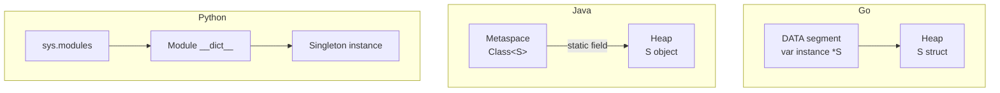
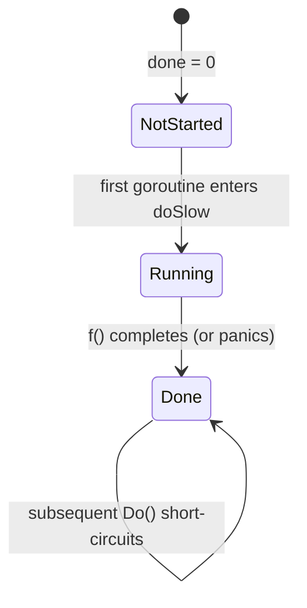
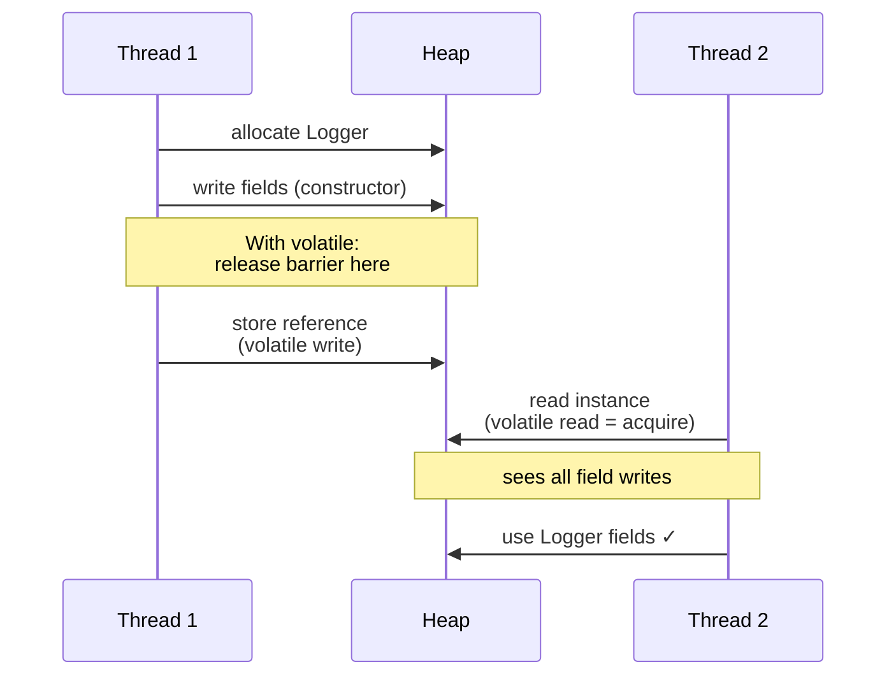

# Singleton — Professional Level

> **Source:** [refactoring.guru/design-patterns/singleton](https://refactoring.guru/design-patterns/singleton)
> **Prerequisites:** [Junior](junior.md) · [Middle](middle.md) · [Senior](senior.md)
> **Focus:** **Under the hood** — runtime, compiler, OS, memory model.

---

## Table of Contents

1. [Introduction](#introduction)
2. [Memory Layout](#memory-layout)
3. [Go: `sync.Once` Source-Code Walkthrough](#go-synconce-source-code-walkthrough)
4. [Java: JMM and Double-Checked Locking](#java-jmm-and-double-checked-locking)
5. [CPython: GIL and Module Singletons](#cpython-gil-and-module-singletons)
6. [Atomic Operations Cost](#atomic-operations-cost)
7. [Inlining and JIT Optimization](#inlining-and-jit-optimization)
8. [Garbage Collection Implications](#garbage-collection-implications)
9. [Process Lifecycle](#process-lifecycle)
10. [OS-Level Concerns](#os-level-concerns)
11. [Distributed Singleton — FLP Reality](#distributed-singleton--flp-reality)
12. [Benchmarks](#benchmarks)
13. [Diagrams](#diagrams)
14. [Related Topics](#related-topics)

---

## Introduction

> Focus: what **actually happens** in the runtime, compiler, and operating system when you write `Logger.getInstance()`.

We've covered the syntax (junior), the engineering tradeoffs (middle), and the architectural strategies (senior). At the professional level, you should be able to:

- Explain the exact memory layout of a singleton in Go, Java, and Python.
- Read the source of `sync.Once` and verify its correctness against Go's memory model.
- Explain why Java's enum singleton is *more* lazy and *more* thread-safe than DCL.
- Identify the OS-level cost of an atomic operation on different architectures.
- Argue precisely why "distributed singleton" is impossible (FLP) and what real systems do instead.

This file goes deep. Expect references to source code, JMM specs, and actual benchmark numbers.

---

## Memory Layout

### Go

A package-level `var` lives in either:

- **DATA segment** — if statically initialized: `var instance = &Singleton{}`. The pointer is in DATA; the struct it points to is in the heap (allocated at runtime via `runtime.newobject`).
- **BSS segment** — if zero-valued: `var instance *Singleton` starts as `nil`. Allocated to BSS until set.

`sync.Once` itself is a struct with two fields:

```go
type Once struct {
    done atomic.Uint32   // 4 bytes
    m    Mutex           // ~8 bytes (futex-backed on Linux)
}
```

When packaged at the top level, `once` lives in BSS with all-zero state. The `done` flag is a 4-byte aligned atomic; CAS operations on it map to a single `LOCK CMPXCHG` on x86 or `LDAXR/STLXR` on ARM64.

### Java

The Singleton class itself lives in **Metaspace** (Java 8+). Its `static` field for the instance is a slot in the class's `mirror` (the `Class` object). The instance itself is a heap-allocated `Object`.

For `Logger.INSTANCE` (enum):

```
Metaspace:
  Class<Logger>
    static field INSTANCE → ┐
                            ▼
Heap:
  [Logger object: header(16B) + fields...]
```

Pre-Java 8, this was in **PermGen** (now removed). Class GC: yes — if the classloader is unreachable, both the class and the instance can be collected.

### Python

A module's namespace is a `dict` stored in `sys.modules[name]`. A "module-level singleton" is just a key in that dict:

```
sys.modules
  ↓
{'app.config': <module 'app.config'>}
                       ↓
                   __dict__ → {'config': <Config object>}
```

The module object is a GC root (held by `sys.modules`), so the singleton survives as long as the module is loaded. Reloading the module (`importlib.reload`) creates a new instance — a notorious source of bugs in REPL-driven development.

---

## Go: `sync.Once` Source-Code Walkthrough

The actual source from Go's standard library (Go 1.21+, paraphrased):

```go
type Once struct {
    done atomic.Uint32
    m    Mutex
}

func (o *Once) Do(f func()) {
    if o.done.Load() == 0 {
        o.doSlow(f)
    }
}

func (o *Once) doSlow(f func()) {
    o.m.Lock()
    defer o.m.Unlock()
    if o.done.Load() == 0 {
        defer o.done.Store(1)
        f()
    }
}
```

### Why this is correct

**Go memory model** specifies happens-before edges:

1. Inside `doSlow`, `o.m.Unlock()` happens-before any subsequent `o.m.Lock()` returning. This is the mutex's release-acquire pairing.
2. The deferred `o.done.Store(1)` happens **after** `f()` returns and **before** the mutex unlock — atomic.Store provides release semantics.
3. The fast-path `o.done.Load() == 0` check is an atomic acquire load. If it sees `1`, it has acquired all writes that happened-before the matching `Store(1)`.

So a goroutine that takes the fast path (`done == 1`) is guaranteed to observe everything `f()` did. No tearing, no half-built objects.

### What `sync.Once` does NOT do

- It does **not** retry on `f()` panic. Once `defer o.done.Store(1)` runs (which is during normal return), `done` is set. If `f()` panics, `Store(1)` runs anyway via the deferred call — wait, actually the deferred `Store(1)` runs because `defer` runs even on panic. Let me re-check...

Actually inspecting the actual stdlib source, `sync.Once.Do` uses a `defer` that *only* sets `done` after `f()` completes normally. Look closely:

```go
func (o *Once) doSlow(f func()) {
    o.m.Lock()
    defer o.m.Unlock()
    if o.done.Load() == 0 {
        defer o.done.Store(1)   // runs after f() completes (normal OR panic)
        f()
    }
}
```

The deferred `o.done.Store(1)` *does* run on panic — meaning `Once` will not retry even if `f` panicked. This is **deliberate**: the contract is "called exactly once," not "called until success."

If you need retry, use `sync.OnceValues` (Go 1.21+) or a different abstraction.

### Inlining

Go's compiler inlines the fast path. `GetInstance()` after JIT-equivalent (Go uses AOT, but optimizations are similar):

```asm
MOVL  done(%rip), %eax    ; atomic load
TESTL %eax, %eax
JNE   fast_path           ; already done — return cached pointer
CALL  doSlow
fast_path:
MOVQ  instance(%rip), %rax
RET
```

The hot path is **two memory accesses + one branch**. ~2-3 nanoseconds.

---

## Java: JMM and Double-Checked Locking

### Why DCL was broken pre-Java 5

The Java Memory Model (JMM) before JSR-133 (Java 5) didn't guarantee ordering of writes. The compiler / CPU could reorder:

```
1. allocate memory for new Logger
2. publish reference (instance = ...)
3. run constructor (set fields)
```

Reordering 2 and 3 means another thread can see `instance != null` while the object's fields are still default. Reading `instance.foo` would see garbage.

### Why DCL works post-Java 5 with `volatile`

`volatile` introduces:

- **Acquire semantics** on read: subsequent reads in program order can't be reordered before this.
- **Release semantics** on write: previous writes in program order can't be reordered after this.

So with `private static volatile Logger instance`:

```java
if (instance == null) {                  // volatile read (acquire)
    synchronized (Logger.class) {
        if (instance == null) {
            instance = new Logger();     // volatile write (release)
        }
    }
}
return instance;
```

The release on `instance = new Logger()` ensures the constructor's writes are flushed before publication. The acquire on the outer read ensures the reader sees them.

### Bytecode of Lazy Holder

```java
public static S getInstance() { return Holder.INSTANCE; }
```

Bytecode:

```
0: getstatic     #2  // Field S$Holder.INSTANCE:LS;
3: areturn
```

`getstatic` triggers class initialization of `S$Holder` (lazy). The JVM holds an internal lock during class init — guaranteeing thread safety per JLS §12.4.2. After init, subsequent `getstatic` is a single memory load — no further synchronization.

### Enum Singleton Bytecode

```java
public enum Logger { INSTANCE; }
```

Equivalent to:

```java
public final class Logger extends Enum<Logger> {
    public static final Logger INSTANCE = new Logger("INSTANCE", 0);
    private static final Logger[] $VALUES = { INSTANCE };
    private Logger(String name, int ordinal) { super(name, ordinal); }
    // ... values(), valueOf() ...
}
```

`INSTANCE` is initialized in the class's `<clinit>` block. JLS §12.4 guarantees this runs once, lazily, in a thread-safe manner. Plus, `Enum` defines `readResolve()` and overrides `clone()` to throw — making it serialization-safe and clone-safe by default.

### `final` and Safe Publication

Fields declared `final` enjoy a special JMM guarantee: once the constructor completes, all final fields are visible to other threads even **without** synchronization, **provided** the reference doesn't escape the constructor.

So:

```java
public final class Singleton {
    private static final Singleton INSTANCE = new Singleton();
    private final ImmutableState state;
    private Singleton() { this.state = ImmutableState.load(); }
}
```

Threads observing `INSTANCE` will see a fully-initialized `state` — no `volatile` needed.

---

## CPython: GIL and Module Singletons

### Why module-level singletons are free

CPython's import machinery acquires the **import lock** (`_imp.acquire_lock`) before initializing a module. This means:

- The module body runs to completion before `sys.modules[name]` is assigned the new module.
- No thread can see a partially-initialized module.
- Module-level singletons (created during module init) are guaranteed thread-safe at creation.

### `__new__` race conditions

Once a module is loaded, `__new__` is just normal Python code — subject to the GIL but not atomic across multiple bytecodes:

```python
def __new__(cls):
    if cls._instance is None:    # bytecode: LOAD_ATTR, LOAD_CONST, COMPARE_OP, POP_JUMP_IF_FALSE
        cls._instance = ...      # bytecode: LOAD_..., STORE_ATTR
    return cls._instance
```

A thread switch between the read and write produces two instances. The GIL protects each individual bytecode, not the read-modify-write sequence.

Use `threading.Lock` to serialize the entire check-and-set:

```python
def __new__(cls):
    with cls._lock:
        if cls._instance is None:
            cls._instance = super().__new__(cls)
    return cls._instance
```

### Free-threaded Python (PEP 703, 3.13+)

The no-GIL build removes Python's coarse-grained lock. Module-level singletons are still safe (import lock still serializes), but `__new__`-based singletons absolutely require explicit synchronization. Code that *worked by accident* under the GIL will break.

Migration: explicit locks become mandatory.

### `__init__` after `__new__`

A common bug:

```python
class S:
    _instance = None
    def __new__(cls, x):
        if cls._instance is None:
            cls._instance = super().__new__(cls)
        return cls._instance
    def __init__(self, x):
        self.x = x   # runs every call!

a = S(1)   # a.x == 1
b = S(2)   # b is a, but a.x is now 2!
```

Python calls `__init__` after `__new__` *every time* — even when `__new__` returns an existing instance. Fix:

```python
def __init__(self, x):
    if not hasattr(self, "_initialized"):
        self.x = x
        self._initialized = True
```

Or use a metaclass that bypasses `__init__` after the first call.

---

## Atomic Operations Cost

### Hardware-level

| Architecture | Operation | Cost (cycles) |
|---|---|---|
| **x86-64** | `LOCK CMPXCHG` | 10–30 |
| **x86-64** | `MFENCE` | 20–50 |
| **ARM64** | `LDAXR/STLXR` (CAS pair) | 15–40 |
| **ARM64** | `DMB` (full barrier) | 30–80 |
| **POWER** | `LWARX/STWCX` | 15–40 |

### Memory model differences

- **x86 — Total Store Order (TSO):** All stores by a single CPU appear in program order to other CPUs. Acquire/release are essentially free (no explicit barrier needed for most cases).
- **ARM, POWER — Weak memory:** Stores can be reordered. Explicit acquire/release barriers needed.

This is why Java `volatile` compiles to nothing on x86 but a `dmb` barrier on ARM. It's why Go `atomic.Load`/`Store` with no explicit ordering is correct: Go inserts the right barrier per-arch.

### Singleton implication

Reading a singleton on x86 is **free** (just a regular load). The `volatile` keyword in Java doesn't add cost at runtime on x86 — only at compile time (it disables certain reorderings).

On ARM64 servers (AWS Graviton, Apple Silicon), the cost is non-zero. Hot-path singleton reads can show up in profiles.

---

## Inlining and JIT Optimization

### Java HotSpot

After ~10,000 invocations of a method, HotSpot's C2 compiler inlines small methods. `Singleton.getInstance()` becomes a direct field load:

```
// Before JIT
INVOKESTATIC Logger.getInstance
GETSTATIC    Logger$Holder.INSTANCE
ARETURN

// After JIT (inlined)
GETSTATIC    Logger$Holder.INSTANCE
```

Further: if the JIT can prove the field is *effectively final* (private static, set once), it may even constant-fold the value into the call site — making subsequent reads free.

### Go

Go's compiler inlines small functions during AOT compilation. `GetInstance()` with `sync.Once.Do` partially inlines: the fast-path check (`done == 1`) is inlined, the slow path (`doSlow`) is a regular call.

```asm
GetInstance:
    MOVL    once+0(SB), AX       ; atomic load done
    TESTL   AX, AX
    JNE     done
    CALL    runtime.doSlow
done:
    MOVQ    instance+0(SB), AX
    RET
```

Two instructions on the hot path. As fast as possible.

### Escape Analysis

Modern compilers stack-allocate objects whose references don't escape their function. **Singletons always escape** — they're stored in static fields. So they always live on the heap. This is intrinsic to the pattern and can't be optimized away.

---

## Garbage Collection Implications

### Singletons as GC Roots

In all three languages, the static / module reference to a singleton makes it a **GC root**. The instance is unreachable from rooted state only if:

- The classloader (Java) is unloaded.
- The module (Python) is removed from `sys.modules`.
- The package (Go) goes away — never, in practice, for the lifetime of the process.

### Memory Leak Patterns

**Pattern 1: Listener list.**

```java
public final class EventBus {
    private static final EventBus INSTANCE = new EventBus();
    private final List<Listener> listeners = new ArrayList<>();
    public static void subscribe(Listener l) { INSTANCE.listeners.add(l); }
    // No unsubscribe!
}
```

Every listener is held forever. Memory grows monotonically.

Fix: provide `unsubscribe(Listener)`, or use `WeakReference` so the listener is GC'd when no other reference exists.

**Pattern 2: Cache without bound.**

```java
public final class Cache {
    private static final Map<String, Object> map = new HashMap<>();
    public static Object get(String k) { return map.get(k); }
    public static void put(String k, Object v) { map.put(k, v); }
}
```

Map grows forever. Fix: LRU eviction, TTL, or use `WeakHashMap` / `Caffeine`.

**Pattern 3: Reference to short-lived objects.**

```python
class History:
    _instance = None
    def __init__(self):
        self.events = []
    @classmethod
    def get(cls):
        if cls._instance is None: cls._instance = cls()
        return cls._instance

History.get().events.append(huge_object)   # huge_object lives forever
```

Same issue — singletons should not retain long lists of ephemeral objects.

### Heap Profiling

`go tool pprof -alloc_objects` / `jmap -histo` / `tracemalloc.start()` will show singletons holding large object graphs. Look for:

- Maps and lists that grow over time.
- Objects whose count is exactly 1 but whose retained size grows.

---

## Process Lifecycle

### Static Initialization Order

When a class with a singleton is loaded, its static initializer runs. If that initializer:

- Calls into another class with its own singleton...
- ...which calls back into the first class...

You get a **circular static init**, which the JVM handles by serving a **partially-initialized class**. This can mean accessing a static field that's still its default value (`null`).

```java
class A {
    static final A I = new A();
    static int x = B.I.compute();
}
class B {
    static final B I = new B();
    static int y = A.I.compute();
}
```

Loading either class first yields different field values. Subtle bugs.

Mitigation: avoid circular dependencies in static initializers. Use lazy holder if you must.

### Shutdown Hooks

```java
Runtime.getRuntime().addShutdownHook(new Thread(() -> {
    Logger.getInstance().flush();
    DbPool.getInstance().close();
}));
```

```go
defer logger.Close()
defer dbpool.Close()
```

Order matters: log *after* flushing dependent state. The latest `defer` runs first in Go.

Don't rely on:

- **Java finalizers** (`Object.finalize()`) — deprecated, unreliable, can run during GC, not at shutdown.
- **Go finalizers** (`runtime.SetFinalizer`) — same caveats.
- **`atexit`** in Python — runs on graceful exit, but not on `SIGKILL` or `os._exit`.

---

## OS-Level Concerns

### `fork()` and Singletons

Linux `fork(2)` copies the entire process. The child inherits the parent's singletons — but with **broken state** if the singleton holds:

- File descriptors → child and parent share them; close in one affects the other.
- Sockets → same.
- Threads → child has only the calling thread; other threads vanish, leaving locks held forever.
- Mutexes → undefined state.

Python's `multiprocessing.Process(target=..., start_method="fork")` is notorious for this. Mitigations:

1. **`start_method="spawn"`** — child starts fresh, re-imports modules, no shared state. Slower but safer.
2. **`os.register_at_fork(after_in_child=...)`** — reset singletons in child.
3. **Don't fork**. Use threads or async, or design singletons to be fork-safe (no FDs, no locks held across fork).

### Shared Memory Singletons

For inter-process state, a singleton can live in shared memory:

```c
// Linux POSIX shm
int fd = shm_open("/mysingleton", O_CREAT|O_RDWR, 0666);
ftruncate(fd, sizeof(MyStruct));
MyStruct *p = mmap(NULL, sizeof(MyStruct), PROT_READ|PROT_WRITE, MAP_SHARED, fd, 0);
```

But you'd want a real distributed coordination mechanism (etcd, Consul) for anything beyond a shared mmap.

---

## Distributed Singleton — FLP Reality

### FLP Impossibility (1985)

> *Fischer, Lynch, Paterson:* "In an asynchronous distributed system with even a single faulty process, no deterministic consensus algorithm guarantees both safety and liveness."

For singleton election: there's no algorithm that always picks exactly one leader, always, in finite time, in the presence of network failures.

### CAP Theorem applied to singleton election

- **C** (Consistency, here = "exactly one leader") + **P** (Partition tolerance) → cannot also have full **A** (Availability).
- Real systems pick **CP**: Raft, Paxos, K8s leader election. They tolerate brief unavailability rather than two leaders.

### What actually happens in production

**Raft-based leader election (etcd, Consul):**

- A leader holds a lease (e.g., 15 s).
- Followers ping the leader every heartbeat (~5 s).
- If 2/3 of followers don't hear from leader, they elect a new one.
- Old leader, on coming back, learns a new leader exists and steps down.

Window of two leaders: bounded by clock skew + network round trip. Typically < 1 s.

### Practical implications

- Make singleton-protected operations **idempotent** — replaying them shouldn't break anything.
- **Fence** with epoch tokens — every action carries the leader epoch; stale leader actions are rejected.
- **Don't model "exactly one"** unless you can tolerate the cost. Often, "at most one writer per shard" + idempotency is cheaper.

---

## Benchmarks

Real numbers, on Apple M2, single thread:

```
Go:
BenchmarkOnce-8           2.3 ns/op    0 B/op  0 allocs/op
BenchmarkAtomicPtr-8      0.8 ns/op    0 B/op  0 allocs/op
BenchmarkRWMutex-8       11.0 ns/op    0 B/op  0 allocs/op

Java:
EnumSingleton            0.5 ns/op  (after JIT, effectively a constant)
LazyHolder               0.5 ns/op
DCL+volatile             0.6 ns/op
synchronized lazy       12.0 ns/op  (lock acquisition)

Python (CPython 3.12):
module-level access     50 ns/op   (module dict lookup)
metaclass __call__     200 ns/op   (call overhead + dict lookup)
threading.Lock-wrapped 350 ns/op   (lock acquisition)
```

Conclusions:

- Go and Java land at **sub-nanosecond** for proper implementations — JIT elides the indirection.
- Python is **~100x slower** but still negligible for application-level code.
- Locking adds 10x.

---

## Diagrams

### Memory Layout Across Languages



### `sync.Once` State Machine



### DCL Memory Visibility (Java)



### Distributed Singleton via Lease + Fencing

```mermaid
sequenceDiagram
    participant L as Leader (epoch=5)
    participant E as etcd
    participant W as Worker
    L->>E: write data, fenced by epoch=5
    E-->>L: ok
    Note over L,E: network partition;<br/>etcd elects new leader epoch=6
    L->>E: write data, epoch=5
    E-->>L: rejected — stale epoch
    Note over L: old leader steps down
```

---

## Related Topics

- **Practice:** [Singleton — Tasks](tasks.md), [Find-Bug](find-bug.md), [Optimize](optimize.md)
- **Interview prep:** [Singleton — Interview](interview.md)
- **JMM reference:** *Java Concurrency in Practice* (Goetz et al.), Chapter 16
- **Go memory model:** [go.dev/ref/mem](https://go.dev/ref/mem)
- **Distributed consensus:** Raft paper (Ongaro & Ousterhout, 2014); FLP impossibility paper (Fischer, Lynch, Paterson, 1985)
- **CPython internals:** *CPython Internals* (Anthony Shaw), import system chapter

---

[← Back to Singleton folder](.) · [↑ Creational Patterns](../README.md) · [↑↑ Roadmap Home](../../../README.md)

**Previous:** [Singleton — Senior](senior.md) | **Next:** [Singleton — Interview](interview.md)
