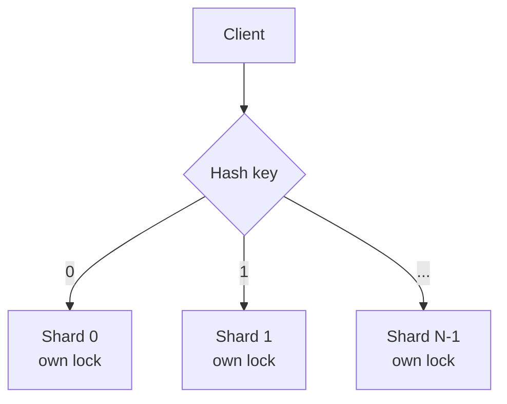
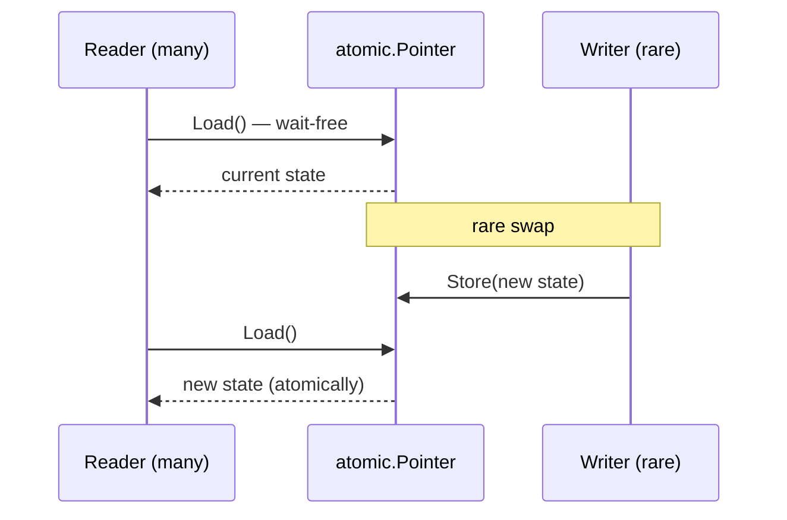
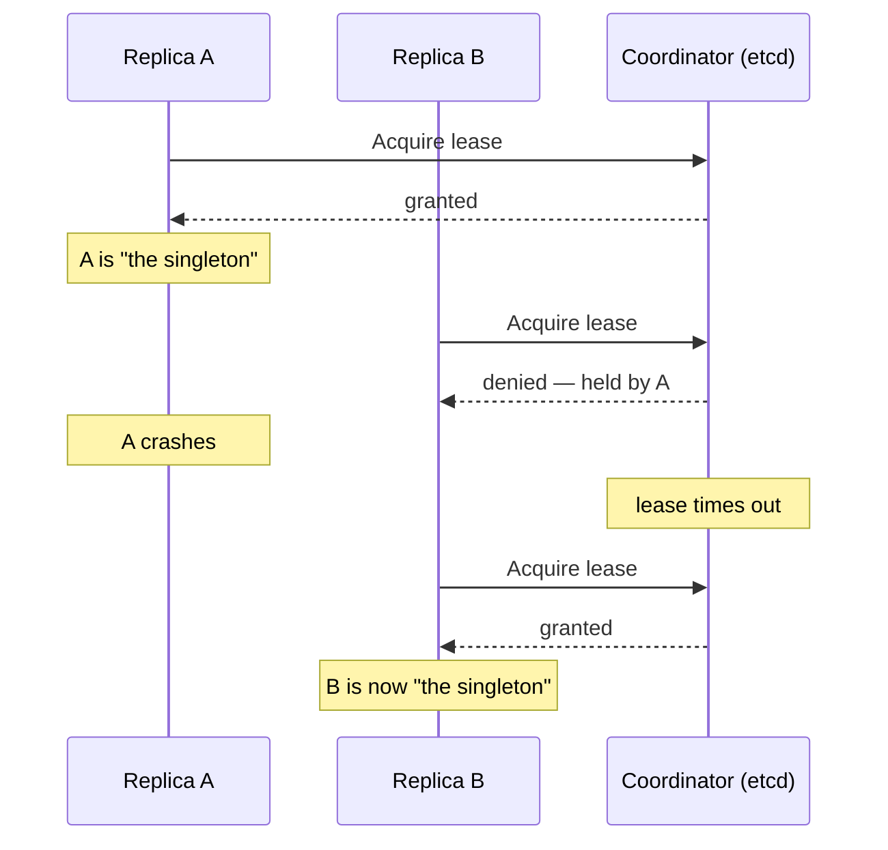
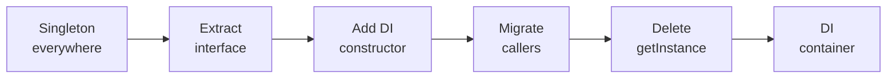

# Singleton — Senior Level

> **Source:** [refactoring.guru/design-patterns/singleton](https://refactoring.guru/design-patterns/singleton)
> **Prerequisites:** [Junior](junior.md) · [Middle](middle.md)
> **Focus:** **How to optimize?** **How to architect?**

---

## Table of Contents

1. [Introduction](#introduction)
2. [Architectural Patterns Around Singleton](#architectural-patterns-around-singleton)
3. [Performance Considerations](#performance-considerations)
4. [Concurrency Deep Dive](#concurrency-deep-dive)
5. [Testability Strategies](#testability-strategies)
6. [When Singleton Becomes a Bottleneck](#when-singleton-becomes-a-bottleneck)
7. [Code Examples — Advanced](#code-examples--advanced)
8. [Real-World Architectures](#real-world-architectures)
9. [Pros & Cons at Scale](#pros--cons-at-scale)
10. [Trade-off Analysis Matrix](#trade-off-analysis-matrix)
11. [Migration Patterns](#migration-patterns)
12. [Diagrams](#diagrams)
13. [Related Topics](#related-topics)

---

## Introduction

> Focus: **architecture** and **optimization**

At the senior level, Singleton stops being about syntax and starts being about **system design**: how a singleton interacts with concurrency, scheduling, GC, deployment, and testing strategy.

You will be asked to:
- Decide when a singleton is the right architectural unit (vs DI scope, vs service registry).
- Optimize an existing singleton under contention (lock-free, sharded, atomic-pointer hot-swap).
- Refactor a legacy codebase that depends on dozens of singletons without breaking it.
- Design a "singleton across processes" — and explain why true distributed singleton is impossible (FLP impossibility).

This file tackles all four.

---

## Architectural Patterns Around Singleton

### Singleton + Factory

A factory itself is often a singleton — there's only one factory per family of products. The factory may *return* singletons or fresh objects.

```java
public enum WidgetFactory {
    INSTANCE;
    public Widget create(String type) {
        return switch (type) {
            case "btn" -> new Button();
            case "txt" -> new TextField();
            default -> throw new IllegalArgumentException(type);
        };
    }
}
```

### Singleton + Strategy (Strategy Holder)

Singleton can hold the *current* strategy and allow runtime swap:

```go
type RetryPolicy interface { ShouldRetry(err error) bool }

var (
    policy   atomic.Value   // holds RetryPolicy
    setOnce  sync.Once
)

func init() {
    setOnce.Do(func() { policy.Store(defaultPolicy()) })
}

func GetPolicy() RetryPolicy   { return policy.Load().(RetryPolicy) }
func SetPolicy(p RetryPolicy)  { policy.Store(p) }
```

`atomic.Value` allows lock-free read of the current strategy, while writes (rare) safely publish a new value.

### Multiton — Bounded Multi-Instance

Sometimes "exactly one" is wrong but "exactly one per X" is right (one connection pool per region; one logger per module).

```python
class Multiton:
    _instances: dict[str, "Multiton"] = {}
    _lock = threading.Lock()

    @classmethod
    def get(cls, key: str) -> "Multiton":
        with cls._lock:
            if key not in cls._instances:
                cls._instances[key] = cls(key)
            return cls._instances[key]

    def __init__(self, key: str):
        self.key = key
```

Multiton is just a registry of named singletons. Watch for unbounded growth.

### Service Locator (and why it's worse than Singleton)

```java
class Locator {
    private static final Map<Class<?>, Object> services = new ConcurrentHashMap<>();
    public static <T> T get(Class<T> type) { return type.cast(services.get(type)); }
    public static <T> void register(Class<T> type, T instance) { services.put(type, instance); }
}

// usage
Logger log = Locator.get(Logger.class);
```

**Why it's an anti-pattern:**
- Worse than Singleton — *every* dependency is hidden, not just one.
- Reading a class doesn't tell you what it depends on; you must read every method body.
- Migration target: DI. Don't introduce Service Locator on a fresh codebase.

---

## Performance Considerations

### Lock Contention on Lazy Init

A naive lazy singleton with `synchronized` blocks every reader:

```java
public static synchronized Logger getInstance() { ... }
```

Under N concurrent threads, throughput approaches that of a single thread (Amdahl's law). Profile-friendly fixes:

- **Lazy holder** (Java) — JVM-guaranteed lazy + no runtime locking.
- **Double-checked locking with `volatile`** — works in Java 5+ but error-prone.
- **`sync.Once`** (Go) — one CAS on the hot path, no lock unless first call.

### Lazy vs Eager: Startup vs First-Call Latency

| | Eager | Lazy |
|---|---|---|
| **App startup** | +X ms (init runs) | 0 ms |
| **First call** | 0 ms | +X ms (init runs) |
| **Steady state** | identical | identical |

For long-running services, eager is usually preferred — startup happens once, before traffic. For CLIs and short-lived processes, lazy avoids paying for code paths the run never touches.

### Memory: Singletons Live Forever

The instance is referenced from a static field — it is a **GC root**. It survives until the process dies.

If the singleton holds caches, listener lists, or short-lived objects, those objects will leak too. Common bugs:

- An observer list that's never cleared.
- A cache without size bound or TTL.
- A history list that grows with every request.

```go
// BAD: observer list grows forever
var observers []func()
var mu sync.Mutex

func Subscribe(f func()) {
    mu.Lock(); defer mu.Unlock()
    observers = append(observers, f)
}
// nothing ever removes from observers — memory leak
```

Fix: provide `Unsubscribe()` and ensure callers use it; or use weak references where supported (Java `WeakReference`, JavaScript `WeakMap`).

### CPU: Hot-Path Lock-Free Reads

When the singleton is read **on every operation**, even a brief lock costs measurable CPU:

```java
// SLOW: lock on every call
synchronized RetryPolicy current() { return policy; }
```

```java
// FAST: volatile read, no lock
private volatile RetryPolicy policy;
RetryPolicy current() { return policy; }
```

Replacement only happens via:

```java
synchronized void setPolicy(RetryPolicy p) { policy = p; }
```

This is a **read-mostly singleton** pattern: cheap reads, occasional safe writes.

---

## Concurrency Deep Dive

### Go: `sync.Once` Internals

`sync.Once`'s implementation (paraphrased):

```go
type Once struct {
    done atomic.Uint32
    m    Mutex
}

func (o *Once) Do(f func()) {
    if o.done.Load() == 0 {            // fast path: atomic load
        o.doSlow(f)
    }
}

func (o *Once) doSlow(f func()) {
    o.m.Lock()
    defer o.m.Unlock()
    if o.done.Load() == 0 {
        defer o.done.Store(1)
        f()
    }
}
```

Why it's correct:
1. **Fast path** — `atomic.Load` provides acquire semantics; if `done == 1`, we *see* all writes from `f()`.
2. **Slow path** — under the mutex, double-check ensures `f` runs once.
3. **Ordering** — Go's memory model guarantees `f`'s effects happen-before any subsequent `done.Load()` returning 1.

Why DCL doesn't need `volatile` in Go: `atomic.LoadUint32` already gives acquire; `atomic.StoreUint32` gives release.

### Java: Lazy Holder Disassembled

```java
public final class S {
    private static class H { static final S X = new S(); }
    public static S get() { return H.X; }
}
```

Bytecode of `get()` (simplified):
```
getstatic S$H.X : LS;
areturn
```

The JVM's class initialization rules (JLS §12.4) guarantee `H` is initialized exactly once, lazily, in a thread-safe way. No locks in user code.

After JIT, the load may be inlined to a single memory access. This is the **fastest** lazy Singleton in Java.

### Java: Why DCL Needs `volatile`

```java
private static volatile S instance;   // volatile is critical
```

Without `volatile`, the assignment `instance = new S();` consists of:

1. Allocate memory.
2. Store reference into `instance` (visible to other threads!).
3. Run constructor.

A reordering can flip 2 and 3, so another thread sees a non-null `instance` whose constructor hasn't run. `volatile` introduces a happens-before edge: writes inside the constructor are visible before the publication of `instance`.

### Python: GIL and `__new__`

CPython's GIL serializes bytecode operations. This means a single bytecode operation is atomic — but `__new__` consists of many bytecodes, so races are still possible:

```python
def __new__(cls):
    if cls._instance is None:    # bytecode 1: read
        cls._instance = ...      # bytecode 2: write
    return cls._instance
```

A thread switch between read and write can produce two instances. Use `threading.Lock` for guaranteed safety.

In free-threaded Python (3.13+ no-GIL build), this concern becomes universal — explicit synchronization is required.

### Atomic Operations and Memory Models

Hot-path singletons rely on atomic ops:

| Architecture | Cost of `LOCK CMPXCHG` (single CAS) |
|---|---|
| x86 (TSO, strong) | ~10-30 cycles |
| ARM (weak) | ~30-50 cycles + barriers |

Compare to:
| Operation | Cycles |
|---|---|
| Plain memory read | 1-4 |
| `sync.Once` fast path | ~5-10 (atomic load + compare) |
| Mutex acquire (uncontended) | ~20-50 |
| Mutex acquire (contended) | thousands (kernel transition) |

So `sync.Once` is roughly the cost of two memory loads on the steady state — essentially free.

### JIT and Inlining

After enough invocations, HotSpot inlines `getInstance()`. The `Holder.X` field load becomes a direct memory access. Singleton overhead approaches zero.

Caveat: **escape analysis cannot stack-allocate a singleton**. The instance escapes by design — it is referenced from a static field.

---

## Testability Strategies

### Strategy 1: Resettable Singleton

```java
public final class Logger {
    private static Logger INSTANCE;
    public static synchronized Logger getInstance() {
        if (INSTANCE == null) INSTANCE = new Logger();
        return INSTANCE;
    }
    /** Test-only. */
    static synchronized void __reset() { INSTANCE = null; }
}
```

Use a build-time annotation (`@VisibleForTesting`) or move the reset into `*Test.java` package-private accessor.

### Strategy 2: Interface-Based Singleton

```java
public interface ILogger { void info(String msg); }

public final class Logger implements ILogger {
    public static ILogger get() { return Holder.X; }
    private static class Holder { static final Logger X = new Logger(); }
    public void info(String msg) { /* ... */ }
}

// In tests:
public class TestLogger implements ILogger {
    public final List<String> messages = new ArrayList<>();
    public void info(String msg) { messages.add(msg); }
}
```

Code that takes `ILogger` (not `Logger`) can be tested with `TestLogger`.

### Strategy 3: DI Container Replaces Singleton

Spring's `@Singleton` scope (default) wires one instance per container. Tests use a separate test container with mocks. The singleton-ness is **container-scoped**, not JVM-global — multiple test classes can run in parallel without state pollution.

```java
@Configuration
class ProdConfig {
    @Bean ILogger logger() { return new RealLogger(); }
}

@Configuration
class TestConfig {
    @Bean ILogger logger() { return Mockito.mock(ILogger.class); }
}
```

### Strategy 4: Fixture Reset (Go)

```go
package logger

var (
    instance *Logger
    once     sync.Once
)

// internal/test only
func resetForTest() { once = sync.Once{}; instance = nil }
```

In `_test.go`:

```go
func TestSomething(t *testing.T) {
    t.Cleanup(resetForTest)
    // ... test using GetLogger() ...
}
```

---

## When Singleton Becomes a Bottleneck

### Hot-Path Lock Contention

Symptoms: `pprof` shows 30%+ time in `sync.Mutex.Lock` on a singleton's mutex.

Mitigations:

**Sharded Singleton.** Partition state across N shards, distribute by hash of key:

```go
const shards = 32

type ShardedCache struct {
    shards [shards]struct {
        mu sync.RWMutex
        m  map[string]any
    }
}

func (c *ShardedCache) Get(key string) any {
    s := &c.shards[fnv32(key)%shards]
    s.mu.RLock()
    defer s.mu.RUnlock()
    return s.m[key]
}
```

Now contention is reduced by `1/shards`. Each goroutine acquires a *different* lock most of the time.

**Per-CPU Singleton.** Linux kernel uses this heavily — one instance per CPU core, accessed without locks (only the local CPU touches it).

```c
DEFINE_PER_CPU(struct mystruct, my_var);
```

In Go, you'd approximate this with `runtime.NumCPU()` shards keyed by goroutine affinity (imperfect — Go has no thread pinning).

**Lock-Free Read with Atomic Pointer.** Reads are wait-free; writes swap the entire structure:

```go
type State struct{ /* immutable */ }

var state atomic.Pointer[State]

func Get() *State            { return state.Load() }
func Replace(s *State)       { state.Store(s) }
```

Excellent for read-heavy, write-rare singletons (e.g., feature flag service).

### Shutdown Order

When the process exits, singletons are destroyed in some order — often unspecified. If `Logger` shuts down before `DBPool` flushes its last log, you lose messages.

Mitigations:

- **Explicit shutdown hook** in deterministic order:
  ```go
  // main.go
  defer dbpool.Close()
  defer logger.Close()   // logger closes after dbpool
  ```
- **Reverse-init order** — `defer` in `main` naturally gives this.
- **Don't rely on finalizers** (Java `@Override finalize`, Go `runtime.SetFinalizer`) for cleanup.

---

## Code Examples — Advanced

### Go: Benchmark `sync.Once` vs `atomic.Value` vs RWMutex

```go
package singleton_test

import (
    "sync"
    "sync/atomic"
    "testing"
)

type S struct{ x int }

// 1) sync.Once — classic
var (
    sOnce *S
    once  sync.Once
)
func GetOnce() *S { once.Do(func(){ sOnce = &S{x: 42} }); return sOnce }

// 2) atomic.Pointer — for replaceable singletons
var sPtr atomic.Pointer[S]
func init() { sPtr.Store(&S{x: 42}) }
func GetAtomic() *S { return sPtr.Load() }

// 3) RWMutex — naive
var (
    sM    *S
    sMu   sync.RWMutex
)
func GetRW() *S {
    sMu.RLock()
    if sM != nil { defer sMu.RUnlock(); return sM }
    sMu.RUnlock()
    sMu.Lock(); defer sMu.Unlock()
    if sM == nil { sM = &S{x: 42} }
    return sM
}

// Benchmarks
func BenchmarkOnce(b *testing.B)   { for i := 0; i < b.N; i++ { _ = GetOnce()  } }
func BenchmarkAtomic(b *testing.B) { for i := 0; i < b.N; i++ { _ = GetAtomic() } }
func BenchmarkRW(b *testing.B)     { for i := 0; i < b.N; i++ { _ = GetRW()    } }
```

Typical results (Apple M-series, single thread):

```
BenchmarkOnce-8     500000000     2.3 ns/op
BenchmarkAtomic-8   1000000000    0.8 ns/op
BenchmarkRW-8       100000000    11.0 ns/op
```

`atomic.Pointer` wins for hot reads. `sync.Once` is fine for one-time init. RWMutex is dominated.

### Java: Atomic Reference for Hot-Swap

```java
public final class FeatureFlags {
    private static final AtomicReference<Map<String, Boolean>> FLAGS
        = new AtomicReference<>(Map.of());

    public static boolean isEnabled(String name) {
        return FLAGS.get().getOrDefault(name, false);
    }

    /** Atomic swap — readers see either the old or new map, never a partial state. */
    public static void replace(Map<String, Boolean> next) {
        FLAGS.set(Map.copyOf(next));
    }
}
```

Reads are wait-free (one volatile load). Writes are atomic. The map is immutable, so there's no torn read.

### Python: Thread-Local "Singleton-per-Context"

When you want one instance per thread (e.g., per-request DB cursor):

```python
import threading

_local = threading.local()

def get_cursor():
    if not hasattr(_local, "cursor"):
        _local.cursor = open_cursor()
    return _local.cursor
```

Not a Singleton in the strict sense — it's a **per-thread Singleton** ("Thread-local Singleton"). Different threads see different instances. Useful for state that must be isolated per request.

---

## Real-World Architectures

### Spring `@Singleton` Scope (default)

Spring's bean container creates one instance per `ApplicationContext`. Multiple contexts (e.g., parent/child for web modules) can have different instances. Tests use a dedicated context.

Key insight: **Singleton ≠ JVM-global**. Container-scoped singletons sidestep the testability issues of static singletons.

### Node.js Module Caching as Accidental Singleton

`require('./logger')` returns the same exports object on every call — Node caches modules by absolute path. This makes `module.exports = new Logger()` an *automatic* singleton.

Caveat: **monorepo + symlinks** can break it. Two paths to the same code = two singletons. Tools like `pnpm` and Yarn Workspaces have hit this.

### Kubernetes Operator Leader Election

In a clustered environment, "exactly one active controller" is a singleton **across processes**. K8s uses a Lease object as the lock:

```yaml
apiVersion: coordination.k8s.io/v1
kind: Lease
metadata:
  name: my-controller
spec:
  holderIdentity: pod-foo
  leaseDurationSeconds: 15
```

Each replica tries to acquire the Lease. Only the holder is "the singleton" — others stand by. On crash, another replica takes over after timeout.

This is **distributed singleton** — see "Pros & Cons at Scale" below for the impossibility caveat.

---

## Pros & Cons at Scale

| | Pro | Con |
|---|---|---|
| **Memory** | One instance, even with 100k req/s | Lives forever; leaks compound |
| **CPU** | No allocation cost on access | Lock contention; cache-line bouncing |
| **Latency** | After warm-up, ~constant | Cold start adds tail latency |
| **Throughput** | Stateless singletons scale freely | Stateful singletons cap throughput |
| **Reliability** | Single point — easy to monitor | Single point — easy to break everything |
| **Operability** | One thing to log/trace | Hard to roll out config changes per-instance |
| **Testability** | Manageable for small projects | Becomes a major drag in large ones |
| **Distribution** | Trivial within a process | Impossible across uncoordinated processes (FLP) |

---

## Trade-off Analysis Matrix

| Pattern | Reads/s | Writes | Best for |
|---|---|---|---|
| **Synchronized lazy** | 10⁵ | rare | Legacy code, simplest correct |
| **DCL + `volatile`** | 10⁹ | rare | Hot path, Java pre-Holder familiarity |
| **Lazy holder** | 10⁹ | n/a | Hot path, non-replaceable Java |
| **Enum** | 10⁹ | n/a | Bullet-proof Java |
| **`sync.Once`** | 10⁹ | n/a | Go default |
| **`atomic.Pointer`** | 10¹⁰ | rare | Read-heavy with rare swap |
| **Sharded** | 10⁹/shard | per-shard | Read-heavy mutable state |
| **Thread-local** | per-thread | per-thread | Per-request state |
| **DI container** | 10⁹ | per-context | Anything large/test-heavy |

---

## Migration Patterns

### Step-by-step: Singleton → DI

For a mature codebase with hundreds of `Logger.getInstance()` calls:

**Phase 1 — Extract interface, retain Singleton.**

```java
interface ILogger { void info(String msg); }
final class Logger implements ILogger { ... }   // unchanged
```

**Phase 2 — Add constructor injection alongside Singleton.**

```java
class UserService {
    private final ILogger log;
    public UserService() { this(Logger.getInstance()); }   // legacy
    public UserService(ILogger log) { this.log = log; }   // testable
}
```

**Phase 3 — Migrate callers in batches.** PR-by-PR, replace `new UserService()` with `new UserService(logger)` from the composition root.

**Phase 4 — Delete legacy constructors.** Once all callers pass dependencies explicitly, remove `getInstance()` and the no-arg constructors.

**Phase 5 — Introduce DI container.** Optional. Useful for large object graphs.

### Anti-pattern to avoid: Service Locator as transitional step

Tempting: replace `Logger.getInstance()` with `Locator.get(Logger.class)`. Resist. Service Locator is harder to remove later than Singleton. Go directly to constructor injection.

### Distributed Singleton — and Why It's Often Wrong

**FLP impossibility (Fischer-Lynch-Paterson, 1985):** in an asynchronous distributed system with even one faulty process, no consensus algorithm can guarantee both liveness and safety.

Practical implication: there is no algorithm that *always* elects exactly one leader. You can have:
- **At most one** at any moment (safety) but possibly zero (liveness sacrifice).
- **At least one** (liveness) but possibly two during partition (safety sacrifice).

Real systems pick safety: Raft, Paxos, K8s leader election will tolerate brief unavailability rather than two leaders. Even so, **split-brain** is possible during network partitions — design your singleton-equivalent to be idempotent and tolerant of brief duplicates.

If you find yourself wanting "the one process-wide cache" across machines, you really want:
- **A coordination service** (Zookeeper, etcd, Consul).
- **Or** a different architecture: shared cache (Redis), single-writer queue (Kafka), CRDT.

---

## Diagrams

### Sharded Singleton



### Atomic-Pointer Singleton (Read-Mostly)



### Distributed Singleton via Lease



### Migration Flow



---

## Related Topics

- **Next level:** [Singleton — Professional Level](professional.md) — runtime internals, JVM/Go runtime sources, OS-level concerns, benchmark numbers.
- **Practice:** [Singleton — Tasks](tasks.md), [Find-Bug](find-bug.md), [Optimize](optimize.md).
- **Interview prep:** [Singleton — Interview](interview.md).
- **Foundational:** Concurrency primitives (mutex, atomic, memory model).
- **Companion patterns:** Multiton, Service Locator (anti-pattern), Dependency Injection.
- **Architecture:** Sharding, Per-CPU data structures, Leader election (Raft/Paxos).

---

[← Back to Singleton folder](.) · [↑ Creational Patterns](../README.md) · [↑↑ Roadmap Home](../../../README.md)

**Previous:** [Singleton — Middle](middle.md) | **Next:** [Singleton — Professional](professional.md)
