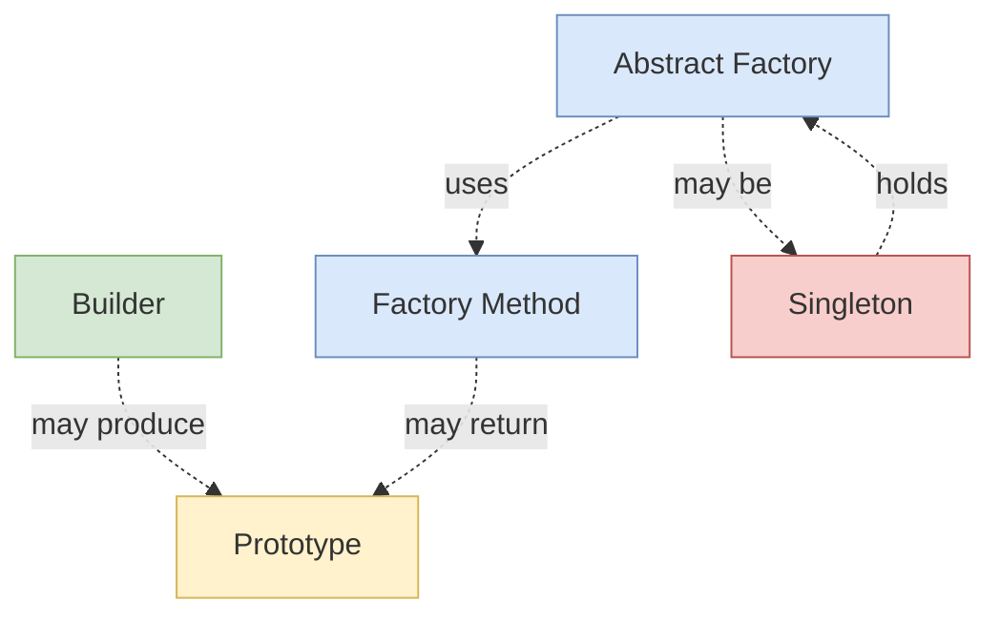

# Creational Patterns

> *"Creational design patterns provide various object creation mechanisms, which increase flexibility and reuse of existing code."*

---

## What Are Creational Patterns?

**Creational patterns** abstract the **process of object creation**. Instead of using `new` directly throughout your code, creational patterns hide *what*, *who*, and *how* objects are instantiated, decoupling consumers from concrete classes.

### The two questions every creational pattern asks

1. **Who decides the concrete class?** — the caller? a factory? a configuration file? the runtime?
2. **How is the object built?** — in one shot? step-by-step? cloned? cached?

---

## The 5 Creational Patterns

| Pattern | Intent (one line) | Key Question Answered |
|---|---|---|
| [Factory Method](01-factory-method/junior.md) | Provides an interface for creating objects in a superclass, but lets subclasses alter the type of objects created | "How do I let subclasses choose the class?" |
| [Abstract Factory](02-abstract-factory/junior.md) | Lets you produce families of related objects without specifying their concrete classes | "How do I create a *family* of objects together?" |
| [Builder](03-builder/junior.md) | Lets you construct complex objects step by step | "How do I build something with many optional parts?" |
| [Prototype](04-prototype/junior.md) | Lets you copy existing objects without making your code dependent on their classes | "How do I copy an object without knowing its class?" |
| [Singleton](05-singleton/junior.md) | Ensures a class has only one instance and provides a global access point to it | "How do I guarantee only one of these exists?" |

---

## When to Use Creational Patterns

Watch for these symptoms in code:

| Symptom | Pattern to consider |
|---|---|
| Many `new ConcreteClass(...)` calls scattered everywhere; hard to swap implementations | **Factory Method** |
| Switching to a different look-and-feel / theme / database changes 50 files | **Abstract Factory** |
| A constructor with 10 parameters, half of them optional and most `null` | **Builder** |
| Cloning an object requires manually copying every field | **Prototype** |
| You need a single shared resource (logger, config, connection pool) accessed everywhere | **Singleton** |
| Object construction is expensive and you want to defer it | **Singleton** (lazy) or a small **Factory + cache** |

---

## Comparison Matrix

| Pattern | Complexity | Returns | Object count | When chosen |
|---|---|---|---|---|
| **Factory Method** | Low | One product (subclass-decided) | Many | One product type, vary by subclass |
| **Abstract Factory** | Medium | Family of products (same family) | Many | Cross-cutting variation (theme, OS, DB) |
| **Builder** | Medium-High | One complex product, step-by-step | One per build | Many optional parameters or staged construction |
| **Prototype** | Low-Medium | A copy of an existing object | Many | Cloning is cheaper than building |
| **Singleton** | Low | The single instance | Exactly one | Global, shared state |

---

## Pattern Relationships

- **Abstract Factory** often uses **Factory Method** for each product
- **Abstract Factory** is often implemented as a **Singleton**
- **Builder** can return a **Prototype** for the next build's starting point
- **Factory Method** can return a clone (**Prototype**) if construction is expensive

---

## Quick Decision Guide

> *"I need to create an object, but..."*

| Constraint | Pattern |
|---|---|
| ...the class isn't known until runtime → | **Factory Method** |
| ...I need consistent variants of related products → | **Abstract Factory** |
| ...the constructor would be unwieldy → | **Builder** |
| ...building is expensive but copying is cheap → | **Prototype** |
| ...there should only ever be one → | **Singleton** |

---

## Common Mistakes

1. **Singleton overuse** — turning every "shared" object into a singleton creates hidden global state and untestable code. Prefer **Dependency Injection**.
2. **Builder for simple objects** — a 3-field DTO doesn't need a builder. Use a constructor.
3. **Abstract Factory without families** — if there's only one product, you wanted Factory Method.
4. **Factory that doesn't decouple** — if your factory does `if/else` over concrete types and is the only call site, you've just moved the coupling.
5. **Prototype with deep object graphs** — shallow vs deep clone bugs are notorious. Be explicit.

---

## Pattern Files

Each pattern below has 8 files: `junior.md`, `middle.md`, `senior.md`, `professional.md`, `interview.md`, `tasks.md`, `find-bug.md`, `optimize.md`.

- [01-factory-method/](01-factory-method/) — Factory Method
- [02-abstract-factory/](02-abstract-factory/) — Abstract Factory
- [03-builder/](03-builder/) — Builder
- [04-prototype/](04-prototype/) — Prototype
- [05-singleton/](05-singleton/) — Singleton

[← Back to Design Patterns](../README.md) · [↑ Roadmap Home](../../README.md)
