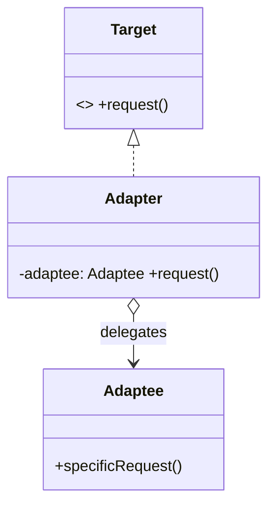
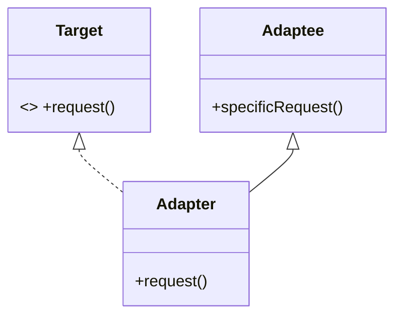
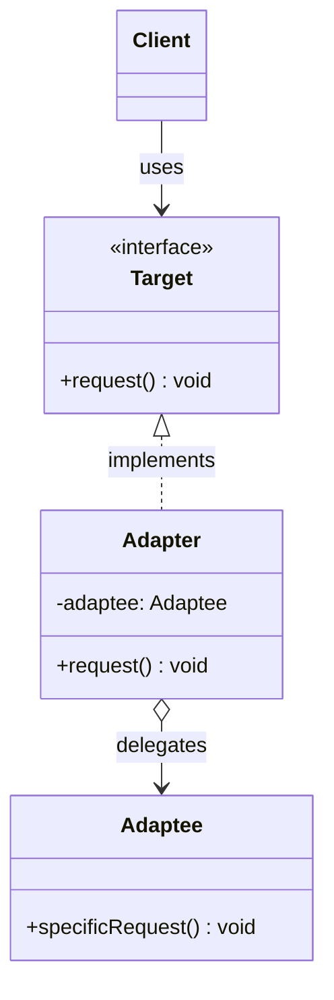
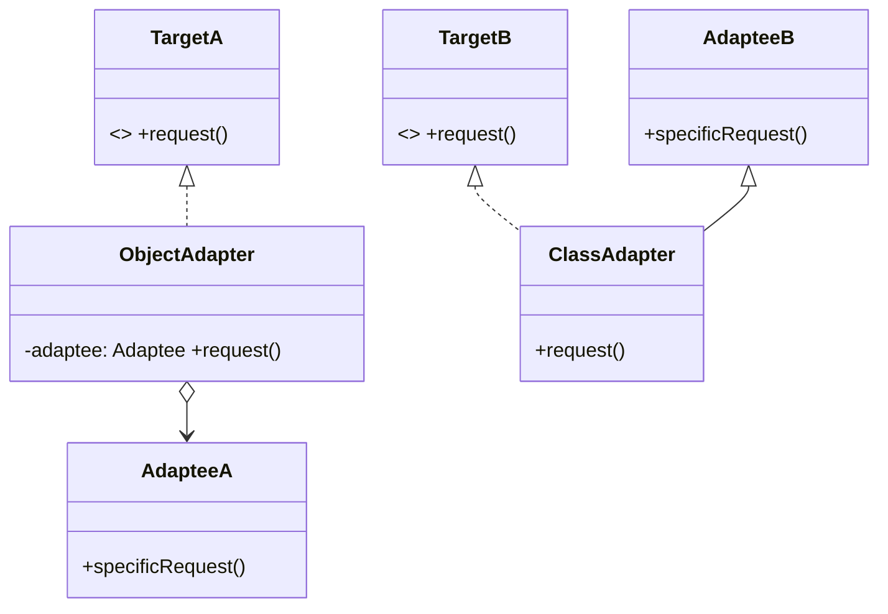
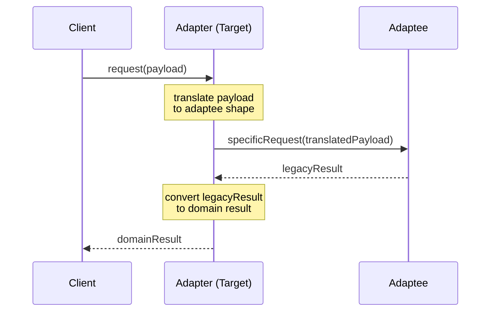
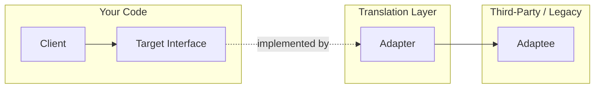

# Adapter — Junior Level

> **Source:** [refactoring.guru/design-patterns/adapter](https://refactoring.guru/design-patterns/adapter)
> **Category:** [Structural](../README.md) — *"Explain how to assemble objects and classes into larger structures, while keeping these structures flexible and efficient."*

---

## Table of Contents

1. [Introduction](#introduction)
2. [Prerequisites](#prerequisites)
3. [Glossary](#glossary)
4. [Core Concepts](#core-concepts)
5. [Real-World Analogies](#real-world-analogies)
6. [Mental Models](#mental-models)
7. [Pros & Cons](#pros--cons)
8. [Use Cases](#use-cases)
9. [Code Examples](#code-examples)
10. [Coding Patterns](#coding-patterns)
11. [Clean Code](#clean-code)
12. [Best Practices](#best-practices)
13. [Edge Cases & Pitfalls](#edge-cases--pitfalls)
14. [Common Mistakes](#common-mistakes)
15. [Tricky Points](#tricky-points)
16. [Test Yourself](#test-yourself)
17. [Tricky Questions](#tricky-questions)
18. [Cheat Sheet](#cheat-sheet)
19. [Summary](#summary)
20. [What You Can Build](#what-you-can-build)
21. [Further Reading](#further-reading)
22. [Related Topics](#related-topics)
23. [Diagrams & Visual Aids](#diagrams--visual-aids)

---

## Introduction

> Focus: **What is it?** and **How to use it?**

**Adapter** is a structural design pattern that allows objects with **incompatible interfaces** to collaborate. The Adapter wraps one of the objects and translates calls from the interface that the client expects into calls that the wrapped object understands.

Imagine you bought a laptop in Europe and you're now in the US. Your laptop's plug has two round prongs; the wall socket has flat blades. The laptop and the wall both work fine — they just don't fit. So you buy a small device: a **plug adapter**. You stick the European plug into one side, and the other side of the adapter has the US blades. Nothing about the laptop or the wall changes. The adapter just translates between two physical "interfaces."

In one sentence: *"Make this thing speak the language the caller expects, without changing either side."*

This is one of the most **practical** patterns you will use in your career. Anytime you integrate a third-party library, an old system, or a payment provider with a weird API, you reach for Adapter. It's the duct tape of object-oriented design — and that's a compliment.

---

## Prerequisites

What you should know before reading this:

- **Required:** Basic OOP — classes, objects, methods. Adapter is a class (or sometimes an object) that wraps another class.
- **Required:** Interfaces or abstract classes (or duck typing in Python). The whole pattern is about *interfaces not matching*.
- **Required:** Composition vs inheritance. Adapter usually uses composition ("has-a"), occasionally inheritance.
- **Helpful but not required:** Familiarity with at least one third-party SDK — you've probably already used Adapter without naming it.

---

## Glossary

| Term | Definition |
|------|-----------|
| **Adapter** | A class that converts one interface into another that the client expects. |
| **Target** | The interface the client wants to use. |
| **Adaptee** | The existing class with the *wrong* interface — the thing being wrapped. |
| **Client** | The code that uses the Target interface; it doesn't know the Adaptee exists. |
| **Object Adapter** | An adapter that holds an Adaptee instance via composition. |
| **Class Adapter** | An adapter that inherits from both Target and Adaptee (multiple inheritance). |
| **Two-way Adapter** | An adapter that can translate in both directions between the two interfaces. |
| **Wrapper** | Generic name for an object that contains another object — Adapter is one kind of wrapper. |

---

## Core Concepts

### 1. Interface Mismatch

The whole pattern exists because two pieces of code want to talk, but their method names, parameter shapes, or return types don't line up. The mismatch is real — neither side can be modified, or modifying them would be expensive.

```
Client expects:  pay(amount)
Adaptee offers:  makePayment(currency, value, callbackFn)
```

You can't change either. So you build a translator.

### 2. The Translator (Adapter)

The adapter implements the **Target** interface (what the client expects) and internally calls the **Adaptee** (what actually exists). The translation can be:

- **Renaming:** `pay()` → `makePayment()`
- **Reshaping arguments:** `(100)` → `("USD", 100, defaultCallback)`
- **Aggregating calls:** one method on the target maps to several on the adaptee
- **Converting types:** `string` → `BigDecimal`, JSON → DTO

### 3. Client Stays Innocent

The client never sees the Adaptee. It only sees the Target interface. This means:

- Swapping the Adaptee for a different one (e.g., a different payment provider) only changes the Adapter.
- Tests that use the Target interface need no knowledge of the third-party API.

---

## Real-World Analogies

| Concept | Analogy |
|---------|--------|
| **Adapter** | A travel power adapter — your laptop plug stays the same, the wall socket stays the same; the adapter sits in the middle. |
| **Target / Adaptee** | A USB-C to HDMI dongle — the laptop speaks USB-C, the monitor speaks HDMI; the dongle translates the signal. |
| **Two-way Adapter** | A bilingual interpreter — translates English to Japanese *and* Japanese to English at a meeting. |
| **Object Adapter** | A driver who picks you up in their own car — they have the car (composition), and they drive *you* to your destination. |
| **Class Adapter** | Marrying into a family — you inherit two sets of relatives at once (multiple inheritance). |

The classical refactoring.guru analogy is the **square peg in a round hole**: you can't change the peg, you can't change the hole — so you build a round-shaped sleeve that the peg slides into, and the sleeve fits the hole.

---

## Mental Models

**The intuition:** Picture a translator standing between two people who don't share a language. Person A speaks French; Person B speaks German. The translator listens to A in French and speaks to B in German, then listens to B and translates back. **Neither A nor B learns the other's language.** That's Adapter.

**Why this model helps:** It separates **what is said** (the intent) from **how it's said** (the interface). The intent is "process payment, $100." The interface is whatever the third-party SDK demands. The adapter holds the translation table.

**Visualization:**

```
   ┌────────┐         ┌──────────────┐         ┌──────────┐
   │ Client │ ──────► │   Adapter    │ ──────► │ Adaptee  │
   │        │  pay()  │  implements  │ make    │ (3rd     │
   │        │         │   Target     │ Payment │  party)  │
   └────────┘         └──────────────┘         └──────────┘
       │                     ▲
       │                     │
       └─── sees only ───────┘
            Target interface
```

---

## Pros & Cons

| Pros | Cons |
|------|------|
| Lets you reuse existing classes that have an unsuitable interface | Adds an extra layer of indirection — more files, more classes |
| Single Responsibility: business logic stays separate from translation logic | Can hide a bigger problem — if you keep wrapping, maybe redesign |
| Open/Closed Principle: introduce new adapters without changing the client | Class adapters require multiple inheritance (not available in many languages) |
| Decouples the client from the third-party API | Performance: every call goes through one extra method call |
| Lets you isolate the parts of your code that are "dirty" with vendor-specific quirks | Easy to overuse — sometimes a plain function call is enough |

### When to use:
- You want to use an existing class but its interface doesn't match
- You're integrating with a legacy or third-party library you can't change
- You want to standardize many slightly-different APIs (e.g., ten payment providers behind one interface)

### When NOT to use:
- You control both sides of the interface — just change one of them
- The mismatch is trivial (a single rename) — a one-line wrapper or alias is cleaner
- You're using Adapter to avoid learning the real API — that's procrastination

---

## Use Cases

Real-world places where Adapter is commonly applied:

- **Third-party SDKs:** Stripe, Twilio, Sendgrid — wrap each in an adapter to match your domain interface
- **Legacy systems:** old XML SOAP service that the new code needs to call as if it were REST
- **Logging frameworks:** SLF4J in Java is essentially an adapter standard for log4j, java.util.logging, logback
- **Data format conversion:** an adapter turns an object into a JSON-shaped DTO for an API
- **Database drivers:** JDBC, ODBC — one common interface over many database engines
- **Iterators:** an iterator adapter makes a collection from one library look like a collection in another
- **Unit conversion:** an adapter that takes meters and exposes feet, or Celsius and exposes Fahrenheit

---

## Code Examples

### Go

In Go, with no inheritance, the **object adapter** is the natural form. The Target is an interface, the Adapter is a struct that implements the interface and holds the Adaptee.

```go
package main

import "fmt"

// Target — what our client wants to use.
type PaymentProcessor interface {
	Pay(amountCents int) error
}

// Adaptee — a third-party SDK with a different shape.
type LegacyGateway struct{}

func (LegacyGateway) MakePayment(currency string, value float64) {
	fmt.Printf("Legacy gateway charged %s %.2f\n", currency, value)
}

// Adapter — implements PaymentProcessor by delegating to LegacyGateway.
type LegacyGatewayAdapter struct {
	gw LegacyGateway
}

func (a LegacyGatewayAdapter) Pay(amountCents int) error {
	a.gw.MakePayment("USD", float64(amountCents)/100.0)
	return nil
}

// Client — doesn't know LegacyGateway exists.
func checkout(p PaymentProcessor) {
	_ = p.Pay(2599) // $25.99
}

func main() {
	adapter := LegacyGatewayAdapter{gw: LegacyGateway{}}
	checkout(adapter)
}
```

**What it does:** `checkout` only knows the `PaymentProcessor` interface. The adapter takes cents, converts to dollars, and calls the legacy SDK.

**How to run:** `go run main.go`

> **Note:** The Adaptee here is a value (`LegacyGateway{}`); production code usually injects it so the adapter is testable.

---

### Java

Java has both **object adapters** (composition, recommended) and **class adapters** (multiple inheritance — limited because Java has no multiple class inheritance, only interfaces).

**Object adapter (idiomatic):**

```java
// Target — what the client expects.
public interface PaymentProcessor {
    void pay(int amountCents);
}

// Adaptee — vendor SDK we can't modify.
public class LegacyGateway {
    public void makePayment(String currency, double value) {
        System.out.printf("Legacy gateway charged %s %.2f%n", currency, value);
    }
}

// Adapter — composition.
public class LegacyGatewayAdapter implements PaymentProcessor {
    private final LegacyGateway gateway;

    public LegacyGatewayAdapter(LegacyGateway gateway) {
        this.gateway = gateway;
    }

    @Override
    public void pay(int amountCents) {
        gateway.makePayment("USD", amountCents / 100.0);
    }
}

// Client.
public class Checkout {
    public static void main(String[] args) {
        PaymentProcessor processor = new LegacyGatewayAdapter(new LegacyGateway());
        processor.pay(2599);
    }
}
```

**Class adapter (rarer, uses inheritance):**

```java
// Adaptee is a class we extend.
public class LegacyGatewayClassAdapter extends LegacyGateway implements PaymentProcessor {
    @Override
    public void pay(int amountCents) {
        // We inherit makePayment from LegacyGateway.
        makePayment("USD", amountCents / 100.0);
    }
}
```

**What it does:** Same translation. The class adapter inherits the adaptee instead of holding it.

**How to run:** `javac *.java && java Checkout`

> **Trade-off (preview for `middle.md`):** Object adapters are more flexible (you can swap the adaptee at runtime). Class adapters are slightly faster (no extra hop) but lock you into a single adaptee. **Always prefer object adapters** unless you have a specific reason.

---

### Python

Python has duck typing — anything that "walks like a duck" satisfies the interface. Adapter is even simpler: just write a class with the right method names that delegates to the adaptee.

```python
# adaptee.py — a third-party class with the wrong shape.
class LegacyGateway:
    def make_payment(self, currency: str, value: float) -> None:
        print(f"Legacy gateway charged {currency} {value:.2f}")
```

```python
# adapter.py
from typing import Protocol


class PaymentProcessor(Protocol):
    """Target — what the client wants."""
    def pay(self, amount_cents: int) -> None: ...


class LegacyGatewayAdapter:
    """Adapter — wraps LegacyGateway, exposes pay()."""
    def __init__(self, gateway):
        self._gw = gateway

    def pay(self, amount_cents: int) -> None:
        self._gw.make_payment("USD", amount_cents / 100.0)
```

```python
# main.py
from adaptee import LegacyGateway
from adapter import LegacyGatewayAdapter, PaymentProcessor


def checkout(processor: PaymentProcessor) -> None:
    processor.pay(2599)


checkout(LegacyGatewayAdapter(LegacyGateway()))
```

**What it does:** `checkout` accepts anything matching the `PaymentProcessor` Protocol. The adapter satisfies it by translating the call.

**How to run:** `python3 main.py`

> **Note:** `Protocol` from `typing` is Python's structural-typing equivalent of an interface (3.8+). It's not required — duck typing works without it — but it makes the intent explicit and helps type checkers like `mypy`.

---

## Coding Patterns

### Pattern 1: Object Adapter (Composition)

**Intent:** The adapter holds an instance of the adaptee.
**When to use:** Almost always. Works in every language.

```go
type Adapter struct { adaptee Adaptee }
func (a Adapter) TargetMethod() { a.adaptee.LegacyMethod() }
```

**Diagram:**



**Remember:** Composition is flexible. You can swap adaptees, mock them in tests, and have multiple adapters for the same target.

---

### Pattern 2: Class Adapter (Inheritance)

**Intent:** The adapter inherits both from the target and the adaptee.
**When to use:** Only in languages with multiple inheritance, when you need to override adaptee behavior.

```python
class Adapter(Target, Adaptee):
    def request(self):
        return self.specific_request()
```

**Diagram:**



**Remember:** Class adapters are stiff — you bind to a specific Adaptee class at compile time.

---

### Pattern 3: Two-way Adapter

**Intent:** Implement *both* interfaces so the adapter can be passed where either is expected.
**When to use:** When two systems use the adapter to talk to each other.

```java
class TwoWay implements TargetA, TargetB {
    public void aMethod() { /* delegates to b */ }
    public void bMethod() { /* delegates to a */ }
}
```

**Remember:** Rarely needed; useful in plug-in style systems.

---

## Clean Code

### Naming

The convention is `<Adaptee>Adapter` or `<Target>From<Adaptee>` — make it obvious which side is being adapted.

```java
// ❌ Bad — ambiguous
public class GatewayWrapper implements PaymentProcessor { ... }
public class PaymentHelper implements PaymentProcessor { ... }

// ✅ Clean
public class StripeGatewayAdapter implements PaymentProcessor { ... }
public class LegacyGatewayAdapter implements PaymentProcessor { ... }
```

```go
// ❌ Bad — Adapter suffix dropped, unclear role
type Stripe struct { ... }   // is this the SDK type, or our wrapper?

// ✅ Clean
type StripeAdapter struct { client *stripe.Client }
```

```python
# ❌ Bad
class StripeWrapper: ...
class StripeFacade: ...   # Facade is a different pattern!

# ✅ Clean
class StripeAdapter: ...
```

### Adapter scope

The adapter should only do **translation**. No business logic.

```java
// ❌ Bad — Adapter doing business logic
public void pay(int amountCents) {
    if (amountCents > 10_000_00) sendFraudAlert();   // wrong layer!
    gateway.makePayment("USD", amountCents / 100.0);
}

// ✅ Clean — translation only
public void pay(int amountCents) {
    gateway.makePayment("USD", amountCents / 100.0);
}
```

---

## Best Practices

1. **Prefer object adapters over class adapters.** Composition is more flexible than inheritance.
2. **Keep adapters thin.** A few lines of translation. If your adapter has loops, conditionals, or domain rules, it's growing into something else.
3. **One adapter per adaptee.** Don't try to make one adapter handle 5 vendors via `if`/`switch` — write 5 small adapters.
4. **Hide the adaptee completely.** No leaking adaptee types across the adapter boundary; the client should never need to import the third-party package.
5. **Name it `<Vendor>Adapter`.** Anyone reading the code instantly knows what it is.
6. **Test the adapter alone.** Mock the adaptee, verify the translation. Adapters are easy to unit test.

---

## Edge Cases & Pitfalls

- **Currency / unit mismatch:** the adapter is the right place to convert cents↔dollars or kg↔lb, but get the formula right. A unit bug here corrupts every call site.
- **Error translation:** the adaptee throws `LegacyPaymentException`; the target expects `PaymentError`. Make sure your adapter catches and re-throws the right exception type.
- **Null/None semantics:** the adaptee returns `null` to mean "not found"; the target uses `Optional`. The adapter must convert.
- **Thread safety:** an adapter is only as thread-safe as the adaptee. Don't claim safety the adaptee can't honor.
- **Pagination/streaming:** if the adaptee returns a callback-based result and the target wants an iterator, the translation is non-trivial — start with a buffer and document the trade-off.
- **Mutability:** if the adaptee returns a mutable internal collection, the adapter should defensively copy.

---

## Common Mistakes

1. **Putting business logic in the adapter.**

   ```python
   # ❌ This isn't translation — it's policy.
   def pay(self, amount):
       if user.country == "US":
           self._gw.make_payment("USD", amount)
       else:
           self._gw.make_payment("EUR", amount * 0.92)
   ```
   The currency policy belongs in the domain, not the adapter.

2. **Returning the adaptee's types from the adapter.**

   ```java
   // ❌ Now every caller depends on the legacy type.
   public LegacyReceipt pay(int cents) { ... }

   // ✅ Convert to your domain type.
   public Receipt pay(int cents) { ... }
   ```

3. **Adapter so thick it's a god class.** If the adapter has 20 methods and 800 lines, it's a Facade — different pattern.

4. **Forgetting to convert exceptions.** Letting the adaptee's vendor-specific exception leak across the boundary defeats the whole point.

5. **Adapter for code you control.** If both sides are yours, just change one. Don't ceremony.

---

## Tricky Points

- **Adapter vs Wrapper.** "Wrapper" is the umbrella term — Adapter, Decorator, and Proxy are all wrappers. Adapter changes the *interface*; Decorator adds *behavior*; Proxy controls *access*.
- **Adapter is reactive.** You build it because you can't change one of the sides. If you can change either side, an adapter is a code smell.
- **Adapter on the inbound side or outbound side.** You can adapt **incoming** data (e.g., parse a webhook payload into your domain object) or **outgoing** calls (e.g., call a payment SDK). Both are Adapter; the direction differs.
- **Adapter without a Target interface.** In Python, you can write an adapter that just exposes the methods you want — there's no formal Target. This works but loses some clarity.

---

## Test Yourself

1. What problem does the Adapter pattern solve?
2. Name the three roles in the pattern.
3. What's the difference between an object adapter and a class adapter?
4. Why is composition usually preferred over inheritance for Adapter?
5. Where in your codebase would you draw the line between an Adapter and a Facade?
6. Give two real-world examples where you'd write an adapter.
7. Why should you never put domain logic inside an Adapter?

<details><summary>Answers</summary>

1. It lets two pieces of code with incompatible interfaces work together without modifying either.
2. **Target** (what the client expects), **Adapter** (the translator), **Adaptee** (the existing class with the wrong shape).
3. Object adapter holds the adaptee via composition; class adapter inherits from the adaptee.
4. Composition lets you swap, mock, and reuse; inheritance binds you to one adaptee class at compile time.
5. Adapter wraps **one** adaptee with a **different** interface. Facade simplifies **many** subsystem classes behind a **new** interface.
6. Wrapping a third-party payment SDK to match your `PaymentProcessor` interface; converting an old XML-RPC client to look like a REST client.
7. Domain logic placed in the adapter pollutes a translation layer with policy. It also makes the rules invisible to anyone scanning the domain code.

</details>

---

## Tricky Questions

> **"Is Adapter just a fancy name for a wrapper class?"**

Almost — but Adapter has a *specific* purpose: changing the interface to match what the client expects. A generic "wrapper" might add logging, security, caching, or computation. If your wrapper renames methods or rebuilds the call signature, it's an Adapter. If it adds new behavior with the same interface, it's a Decorator.

> **"Why not just write a function instead of an Adapter class?"**

For a single conversion you often *do* — a small `payWithLegacy(amount int)` function works. The class form earns its keep when (a) there are multiple methods to translate, (b) the translation needs internal state (caching, retries), or (c) the client expects an interface, not a function.

> **"Can I have multiple adapters for the same adaptee?"**

Yes — this is a strength of the pattern. One adapter exposes the adaptee as a `PaymentProcessor`, another exposes it as a `RefundProcessor`. The adaptee doesn't change.

---

## Cheat Sheet

```go
// GO
type Target interface { Request() string }

type Adaptee struct{}
func (Adaptee) SpecificRequest() string { return "ok" }

type Adapter struct{ a Adaptee }
func (x Adapter) Request() string { return x.a.SpecificRequest() }
```

```java
// JAVA — object adapter
public class Adapter implements Target {
    private final Adaptee adaptee;
    public Adapter(Adaptee a) { this.adaptee = a; }
    public String request() { return adaptee.specificRequest(); }
}
```

```python
# PYTHON
class Adapter:
    def __init__(self, adaptee): self._a = adaptee
    def request(self): return self._a.specific_request()
```

---

## Summary

- **Adapter** = a translator between an existing class (Adaptee) and a contract the client wants (Target).
- Three roles: **Target**, **Adapter**, **Adaptee**.
- Two forms: **object** (composition, recommended) and **class** (inheritance, limited).
- The adapter does **translation only** — no business logic, no decisions, no transformations beyond what's needed to fit the interface.
- Easy to write, easy to test, easy to overuse.

If a class doesn't fit but you can't change it, Adapter is the duct tape that holds the world together. If you *can* change one of the sides, do that instead — adapters are a tax, not a goal.

---

## What You Can Build

Concrete projects to practice Adapter:

- **Currency converter adapter** — wrap a free FX API to expose `convert(from, to, amount)`
- **Logger adapter** — make `log4j`, `slf4j`, and `console.log` look identical to your app
- **Payment provider abstraction** — write 2 adapters (e.g., Stripe-mock and Mock-cash) behind one `PaymentProcessor`
- **Storage adapter** — same `Storage` interface backed by local FS, S3, or in-memory map
- **Notification adapter** — `Notify(user, msg)` backed by email, SMS, or Slack
- **Iterator adapter** — wrap a callback-driven library to expose a Pythonic generator

---

## Further Reading

- **refactoring.guru source page:** [refactoring.guru/design-patterns/adapter](https://refactoring.guru/design-patterns/adapter)
- **GoF book:** *Design Patterns: Elements of Reusable Object-Oriented Software*, p. 139 (Adapter)
- **Effective Java (3rd ed.), Joshua Bloch:** Item 18 — "Favor composition over inheritance" (the philosophical basis for object adapter)
- **Go's `io.Reader`/`io.Writer` idiom:** every `bytes.Buffer`, `strings.Reader`, etc., is essentially an adapter to the `io` interfaces
- **Python `typing.Protocol`:** [docs.python.org/3/library/typing.html#typing.Protocol](https://docs.python.org/3/library/typing.html#typing.Protocol)

---

## Related Topics

- **Next level:** [Adapter — Middle Level](middle.md) — registry of adapters, two-way adapters, real refactoring stories.
- **Compared with:** [Decorator](../04-decorator/junior.md) — same interface, adds behavior; [Proxy](../07-proxy/junior.md) — same interface, controls access; [Facade](../05-facade/junior.md) — simpler interface for a complex subsystem.
- **Often used with:** [Bridge](../02-bridge/junior.md) — Adapter is reactive (after the fact), Bridge is proactive (designed in).
- **Foundational principle:** Composition over inheritance — the reason object adapters dominate.

---

## Diagrams & Visual Aids

### UML Class Diagram (Object Adapter)



### Object vs Class Adapter



### Sequence Diagram



### Adapter Position in a System



---

[← Back to Adapter folder](.) · [↑ Structural Patterns](../README.md) · [↑↑ Roadmap Home](../../../README.md)

**Next:** [Adapter — Middle Level](middle.md) (when, why, real refactorings, registries, two-way adapters)
