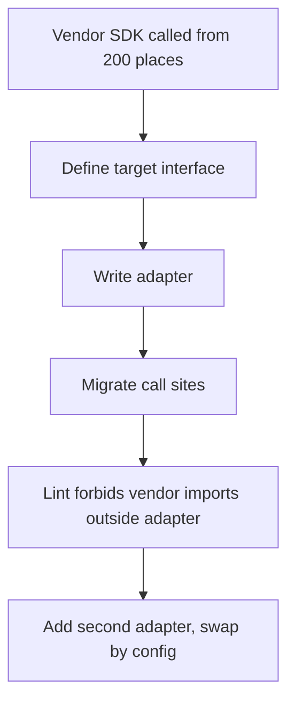
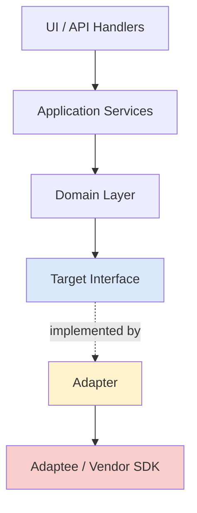
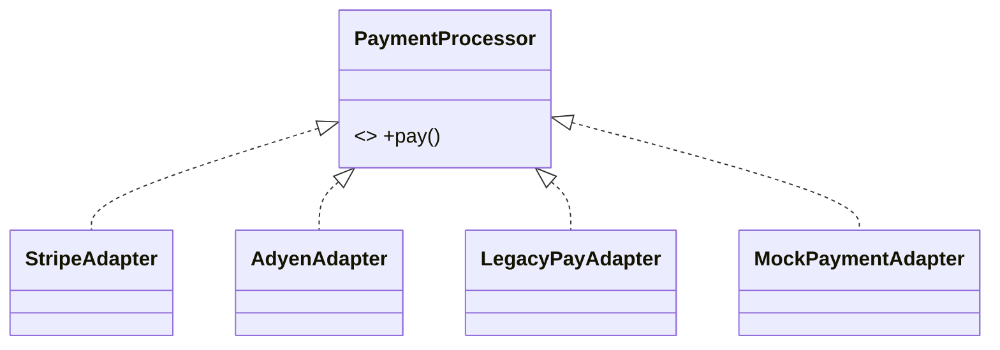

# Adapter — Middle Level

> **Source:** [refactoring.guru/design-patterns/adapter](https://refactoring.guru/design-patterns/adapter)
> **Prerequisite:** [Adapter — Junior Level](junior.md)

---

## Table of Contents

1. [Introduction](#introduction)
2. [When to Use Adapter](#when-to-use-adapter)
3. [When NOT to Use Adapter](#when-not-to-use-adapter)
4. [Real-World Cases](#real-world-cases)
5. [Code Examples — Production-Grade](#code-examples--production-grade)
6. [Two-way Adapter](#two-way-adapter)
7. [Adapter Registry](#adapter-registry)
8. [Trade-offs](#trade-offs)
9. [Alternatives Comparison](#alternatives-comparison)
10. [Refactoring to Adapter](#refactoring-to-adapter)
11. [Pros & Cons (Deeper)](#pros--cons-deeper)
12. [Edge Cases](#edge-cases)
13. [Tricky Points](#tricky-points)
14. [Best Practices](#best-practices)
15. [Tasks (Practice)](#tasks-practice)
16. [Summary](#summary)
17. [Related Topics](#related-topics)
18. [Diagrams](#diagrams)

---

## Introduction

> Focus: **When to use it?** and **Why?**

You already know Adapter is a translator between an existing class and a contract you want. At the middle level, the questions get sharper:

- **When does Adapter pay for itself, and when is it ceremony?**
- **How do I keep adapters thin in real systems where third-party APIs leak edge cases?**
- **What goes wrong at scale — and what patterns solve those problems?**

This document focuses on the **decision-making** and **production patterns** that turn "I read the GoF chapter" into "I have used Adapter five times in production and it didn't blow up."

---

## When to Use Adapter

Use Adapter when **all** of these are true:

1. **You can't change the adaptee.** It's a third-party SDK, a legacy system, a vendor library, or a generated client.
2. **You can't change the client.** It already speaks a fixed interface — yours, or a framework's (e.g., Spring's `JdbcTemplate`, Go's `http.Handler`).
3. **The mismatch is structural.** Method names, parameter shapes, return types, exception hierarchies don't line up.
4. **You expect to swap implementations.** Today it's Stripe; tomorrow it might be Adyen. The adapter isolates the change.
5. **The translation is small.** You're moving data between shapes, not making decisions.

If even one of those isn't true, look harder before reaching for Adapter.

### Triggers

- "I want to mock this third-party API in tests."
- "I want my code to call `pay(cents)` instead of `vendor.api.v2.charge(currency='USD', amount_minor=...)`."
- "I'm about to import a vendor type into my domain layer." → write an Adapter instead.

---

## When NOT to Use Adapter

- **You control both sides.** Two services in your monorepo with mismatched interfaces — fix the interface; don't add a permanent translator.
- **The mismatch is one-line trivial.** A function alias is shorter than a class.
- **You'd be wrapping every call 1:1.** If the target and adaptee are essentially identical, you don't need an adapter — you need a `using Adaptee = Target` alias or to just use the adaptee directly.
- **The translation is large and conditional.** That's a *facade* (multiple subsystems behind one API) or a *strategy* (alternative behaviors), not an adapter.
- **You're hiding a problem.** If the adaptee is awful and the adapter has 500 lines of glue, the right answer might be to replace the adaptee.
- **You're using Adapter as a "future-proof" placeholder.** YAGNI. Don't add a permanent indirection for a hypothetical future swap.

### Smell: the adapter that grew

You started with `pay(cents)`. Six months later it has caching, retry logic, schema validation, three vendor selectors, and idempotency keys. **It is no longer an adapter.** Promote it: rename to `PaymentService`, decompose the responsibilities (Decorator for caching, Strategy for vendor pick), and let the adapter shrink back to translation.

---

## Real-World Cases

### Case 1 — Payment provider migration (e-commerce)

A team had two years of code calling `legacyPay.charge(...)`. They needed to support Stripe in some markets. Without Adapter, the migration would touch 200 call sites.

**Solution:**

```
PaymentProcessor (interface)
   ├── LegacyPayAdapter (wraps legacyPay)
   └── StripeAdapter   (wraps stripe.Client)
```

Call sites change once: `paymentProcessor.pay(...)`. The right adapter is wired by config per market. Test code uses `MockPaymentAdapter` with no network.

### Case 2 — Logger consolidation

A monolith had 4 logger frameworks because of acquisitions: `log4j`, `commons-logging`, custom `LogUtil`, and direct `System.out`. The team adopted SLF4J. Each old framework got a thin adapter to SLF4J's `Logger` interface. **Result:** one log format, one config file, no behavior change for callers.

### Case 3 — Old XML SOAP service behind a REST facade

A bank had a SOAP service for account lookup that the new mobile API needed to call as if it were JSON-REST. An adapter on the gateway:

- Took JSON in, built a SOAP envelope.
- Sent the SOAP request, parsed the response.
- Returned JSON shaped to the new contract.

The mobile team never knew SOAP existed. Three months later when SOAP was retired, only the adapter changed.

### Case 4 — Database driver normalization

JDBC, ODBC, ADO.NET — all of these are essentially "Adapter over many database engines, exposing one interface to the application." The pattern is industry-scale.

```python
# config.py
class _Config:
    def __init__(self):
        self.host = "localhost"
        self.port = 8080

    def reload(self):
        # re-read config file...
        pass

# Module-level singleton — Python's import cache makes this thread-safe at module load.
config = _Config()
```

```python
# elsewhere
from config import config
print(config.host)
```

### Case 5 — Iterator adapter

A team used a callback-based event source (`source.onEvent(cb)`) but wanted to write idiomatic Python: `for event in source: ...`. An adapter buffered events and exposed `__iter__` / `__next__`. Cost: one class. Benefit: the rest of the codebase looked normal.

---

## Code Examples — Production-Grade

### Example A — Stripe adapter with error mapping

```java
public interface PaymentProcessor {
    PaymentResult pay(PaymentRequest req) throws PaymentException;
}

public final class StripeAdapter implements PaymentProcessor {

    private final StripeClient client;
    private final Clock clock;

    public StripeAdapter(StripeClient client, Clock clock) {
        this.client = client;
        this.clock = clock;
    }

    @Override
    public PaymentResult pay(PaymentRequest req) throws PaymentException {
        try {
            var charge = client.charges().create(toStripeParams(req));
            return new PaymentResult(
                charge.getId(),
                Money.ofMinor(charge.getAmount(), charge.getCurrency()),
                clock.instant()
            );
        } catch (StripeCardException e) {
            throw new PaymentException(PaymentError.DECLINED, e.getMessage(), e);
        } catch (StripeRateLimitException e) {
            throw new PaymentException(PaymentError.RATE_LIMITED, e.getMessage(), e);
        } catch (StripeException e) {
            throw new PaymentException(PaymentError.UNKNOWN, e.getMessage(), e);
        }
    }

    private static Map<String, Object> toStripeParams(PaymentRequest req) {
        var params = new HashMap<String, Object>();
        params.put("amount", req.amount().minorUnits());
        params.put("currency", req.amount().currency().toLowerCase());
        params.put("source", req.token());
        if (req.idempotencyKey() != null) {
            params.put("idempotency_key", req.idempotencyKey());
        }
        return params;
    }
}
```

What this adapter does well:
- **Maps vendor exceptions to domain errors.** No `StripeException` leaks.
- **Maps vendor types to domain types.** `Charge` → `PaymentResult`.
- **Stays thin.** Translation only. Money formatting, retries, fraud checks live elsewhere.

### Example B — Go: HTTP handler adapter for a logger

Go's `http.Handler` is an interface. A **handler adapter** is a common pattern: wrap a `http.Handler`, log every request:

```go
type LoggingAdapter struct {
    next   http.Handler
    logger Logger
}

func (a LoggingAdapter) ServeHTTP(w http.ResponseWriter, r *http.Request) {
    start := time.Now()
    rec := &statusRecorder{ResponseWriter: w, status: http.StatusOK}
    a.next.ServeHTTP(rec, r)
    a.logger.Info("http",
        "method", r.Method,
        "path", r.URL.Path,
        "status", rec.status,
        "duration", time.Since(start),
    )
}
```

Strictly speaking this is **also** Decorator (same interface, adds behavior) — and that's the common confusion. Adapter changes interface; Decorator wraps the same interface. Many codebases call this an "adapter" colloquially. Be precise in your own.

### Example C — Python: callback to iterator adapter

```python
import queue
import threading
from typing import Iterator


class CallbackToIteratorAdapter:
    """Adapt a callback-based event source to a Python iterator."""

    _SENTINEL = object()

    def __init__(self, source):
        self._q: queue.Queue = queue.Queue()
        self._source = source
        self._source.on_event(self._enqueue)
        self._source.on_done(lambda: self._q.put(self._SENTINEL))

    def _enqueue(self, evt):
        self._q.put(evt)

    def __iter__(self) -> Iterator:
        return self

    def __next__(self):
        item = self._q.get()
        if item is self._SENTINEL:
            raise StopIteration
        return item
```

Now: `for evt in CallbackToIteratorAdapter(source): ...`

What's tricky: bounded queue size (memory!), thread-safety, error propagation across the boundary. These are the *real* design questions adapters surface in production.

---

## Two-way Adapter

A **two-way adapter** implements both interfaces, so the same instance can be passed where either is expected. Useful in plug-in architectures.

```java
public class PluginAdapter implements HostInterface, PluginInterface {

    private final Plugin plugin;
    private final Host host;

    public PluginAdapter(Plugin plugin, Host host) {
        this.plugin = plugin;
        this.host = host;
    }

    // HostInterface methods — host calls these on the adapter
    @Override public void onTick() { plugin.update(); }

    // PluginInterface methods — plugin calls these on the adapter
    @Override public void log(String msg) { host.log(msg); }
}
```

Two-way adapters are rare. Most systems can get away with a one-way adapter and a small reverse adapter — separate, single-purpose classes are easier to test.

---

## Adapter Registry

When you have many adapters (e.g., 8 payment providers, 5 storage backends), a **registry** keeps the wiring discoverable.

```go
type StorageAdapter interface {
    Put(key string, data []byte) error
    Get(key string) ([]byte, error)
}

var registry = map[string]func(cfg Config) StorageAdapter{}

func Register(name string, factory func(cfg Config) StorageAdapter) {
    registry[name] = factory
}

func New(name string, cfg Config) (StorageAdapter, error) {
    f, ok := registry[name]
    if !ok {
        return nil, fmt.Errorf("unknown storage: %s", name)
    }
    return f(cfg), nil
}

// in s3.go
func init() {
    Register("s3", func(cfg Config) StorageAdapter { return &S3Adapter{cfg: cfg} })
}
```

Now `cfg.yaml` says `storage: s3` and the rest of the app uses `StorageAdapter` blindly. This is how plugin systems are built.

**Watch out:** registries are global mutable state. Test isolation matters; clear or scope the registry per test.

---

## Trade-offs

| Trade-off | Pay | Get |
|---|---|---|
| Add an indirection | One extra method call, one extra class | Independent evolution of client and adaptee |
| Convert types at the boundary | Allocation cost (sometimes) | Domain stays free of vendor types |
| Map exceptions | Boilerplate | Errors are meaningful to the domain |
| Maintain N adapters for N vendors | More files | Adding a vendor doesn't touch business code |
| Keep adapters thin | Discipline | Tests, swaps, and reads stay simple |

The biggest hidden cost is **discipline** — keeping adapters from accumulating responsibility.

---

## Alternatives Comparison

| Alternative | Use when | Trade-off |
|---|---|---|
| **Just use the adaptee directly** | Trivial mismatch, no risk of swap, you control the calls | Vendor types pollute the codebase |
| **Function alias / static helper** | A single rename | Doesn't fit a polymorphic interface |
| **Facade** | Many subsystem classes need a simpler API | Different intent — simplification, not translation |
| **Decorator** | Same interface, adding behavior | Different intent — behavior, not translation |
| **Bridge** | You're designing two parallel hierarchies *up front* | Bridge is proactive; Adapter is reactive |
| **Anti-corruption layer (DDD)** | A whole *bounded context* needs translation | Bigger scope: includes adapters but also domain mapping rules |

```python
# config.py
from dataclasses import dataclass


@dataclass(frozen=True)
class Config:
    host: str
    port: int


# Frozen + module-level instance — readers can't mutate by accident.
config = Config(host="localhost", port=8080)
```

---

## Refactoring to Adapter

A common path: code is calling a vendor SDK directly all over the place. You want to introduce an Adapter without breaking everything in one PR.

### Step 1 — Define the target interface from current usage

Look at every call site. What signatures are *actually* needed? Define the smallest interface.

```java
public interface PaymentProcessor {
    PaymentResult pay(int amountCents, String token) throws PaymentException;
}
```

### Step 2 — Write the adapter (no callers yet)

```java
public final class StripeAdapter implements PaymentProcessor {
    private final StripeClient client;
    public StripeAdapter(StripeClient c) { this.client = c; }
    public PaymentResult pay(int amountCents, String token) throws PaymentException { ... }
}
```

Add unit tests against a mock `StripeClient`.

### Step 3 — Migrate call sites incrementally

Replace one call site at a time. Each PR is small. The vendor SDK and the adapter coexist.

### Step 4 — Forbid the vendor import

Once everyone uses the adapter, add a lint rule or `import-order` policy that bans `import com.stripe.*` outside the adapter package. The boundary is now enforced by tooling, not goodwill.

### Step 5 — Optionally, write a second adapter

When you add Adyen or Mock, you write `AdyenAdapter` or `MockPaymentAdapter` — you do not touch any caller.

---

## Pros & Cons (Deeper)

### Pros (revisited)

- **Locality of change.** When a vendor changes their SDK, exactly one file moves.
- **Test isolation.** `MockPaymentAdapter` is trivial; the adaptee can be a mountain.
- **Domain purity.** The domain layer never imports vendor types — a hard rule that pays off after a few years.
- **Polymorphism over heterogeneous APIs.** N adapters, one interface, one client.

### Cons (revisited)

- **Indirection makes stack traces deeper.** Debugging a misbehaving call has one more hop.
- **Two ways to be wrong.** The adaptee can be wrong; the adapter can be wrong. The translation layer adds a place for bugs.
- **Test coverage doubles up.** You test the adapter's translation; you test the integration with the real adaptee.
- **Premature abstraction trap.** "We *might* swap this someday" — and you write an adapter today, paying ongoing maintenance cost. Be honest.

---

## Edge Cases

### 1. Async ↔ sync mismatch

The adaptee returns a `CompletableFuture` / `Promise`; the target wants a synchronous return. Be explicit:

- Block in the adapter? Cheap to write, kills concurrency.
- Make the target async? Right answer, but it ripples outward.
- Use a thread pool? Resource sizing matters.

This isn't a translation problem — it's a concurrency model decision. Don't hide it inside the adapter without documenting the choice.

### 2. Pagination/streaming mismatch

Adaptee: callback-driven push. Target: pull-based iterator. You need a buffer. Decide:

- Bounded? Backpressure?
- What if the consumer is slow? Drop, block, or error?

### 3. Optional vs nullable

Adaptee returns `null` to mean "absent." Target uses `Optional<T>`. The adapter is the right place to convert — but be consistent across the codebase.

### 4. Time and timezone

Adaptee returns local time as a string. Target wants `Instant` UTC. The adapter parses, normalizes, and tags timezone. Easy to get wrong; gold-standard tests.

### 5. Money

Adaptee uses `double`. Target uses `Money` (BigDecimal + currency). The adapter must round correctly and carry currency through. **Never use `double` for money** — but the adaptee may give you no choice. The adapter is the demilitarized zone.

### 6. Retries / idempotency

If the adapter retries on its own, the *adaptee* needs to be idempotent. Either pass an idempotency key into the adapter explicitly, or document loudly that retries happen at a higher layer.

---

## Tricky Points

- **Adapter ≠ Wrapper ≠ Decorator ≠ Proxy.** They all "wrap." The names tell the *intent*. Use the right name in code review.
- **An adapter can compose another adapter.** For an SDK that's too gnarly, a low-level adapter normalizes it; a domain adapter sits on top. Just don't go three layers deep without a reason.
- **A test double is a special adapter.** `MockPaymentAdapter` is a minimal in-memory implementation of the same `PaymentProcessor` interface — the same kind of swap real adapters enable.
- **Interface segregation matters.** If your `PaymentProcessor` has 17 methods, every adapter must implement all 17 — even if a vendor doesn't support refunds. Split: `Charger`, `Refunder`, `Disputer`.
- **The adapter often owns retries — and shouldn't.** Retry is a cross-cutting concern; put it in a Decorator, not the adapter. (See `senior.md`.)

---

## Best Practices

1. **Define the target interface from current/needed call sites.** Don't copy the adaptee's surface.
2. **Map exceptions at the boundary.** Vendor errors → domain errors.
3. **Map types at the boundary.** Vendor objects → domain objects. Lint that no vendor type leaks across.
4. **Keep adapters under ~200 lines.** Past that, ask if it's grown into something else.
5. **One adapter per adaptee.** Never `if vendor == 'stripe' ... else if vendor == 'adyen' ...`.
6. **Inject the adaptee.** Don't construct it inside the adapter; you'll never test it cleanly.
7. **Document units, time zones, currency formats.** The adapter is where these conventions are pinned down.
8. **Forbid vendor imports outside the adapter package.** Use tooling.

---

## Tasks (Practice)

1. Refactor a piece of code that imports `requests` directly into a tiny `HttpClient` adapter with a target interface. Write a test that injects a fake.
2. Take a vendor SDK with a synchronous-callback API and write an adapter exposing a Pythonic generator (or Go channel).
3. Write two payment adapters (`MockPaymentAdapter`, `StripeMockAdapter`) behind a single interface. Wire them by config.
4. Find an open-source library that does Adapter (e.g., SLF4J, JDBC). Read its target interface. Implement a *new* adapter for a fictional adaptee.
5. In a codebase you know: identify a class that is called `XyzWrapper` or `XyzHelper`. Decide: Adapter? Decorator? Facade? Rename it.

---

## Summary

- Adapter at the middle level is about **decisions and discipline**, not pattern recognition.
- Use it when the adaptee is fixed, the client is fixed, and the mismatch is structural.
- Don't use it when you control both sides, when the mismatch is trivial, or when you're really designing a Facade or Strategy.
- Keep adapters **thin**. The instant they grow logic, decompose.
- Map types and exceptions at the boundary so the domain stays clean.
- Adapters earn their keep by **localizing change** — vendor swaps stop being scary.

---

## Related Topics

- **Next level:** [Adapter — Senior Level](senior.md) — anti-corruption layer, Hexagonal Architecture, performance.
- **Compared with:** [Decorator](../04-decorator/junior.md), [Proxy](../07-proxy/junior.md), [Facade](../05-facade/junior.md), [Bridge](../02-bridge/junior.md).
- **Architectural pattern:** **Anti-Corruption Layer (DDD)** — adapters scaled up to whole bounded contexts.
- **Spring's `JdbcTemplate`** and **SLF4J** are textbook adapter ecosystems.

---

## Diagrams

### Refactoring path



### Layering



### Many adapters, one interface



---

[← Back to Adapter folder](.) · [↑ Structural Patterns](../README.md) · [↑↑ Roadmap Home](../../../README.md)

**Next:** [Adapter — Senior Level](senior.md) (anti-corruption layer, Hexagonal Architecture, perf, scaling)
