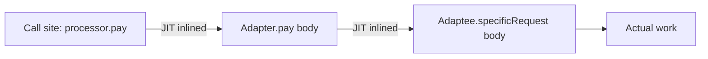
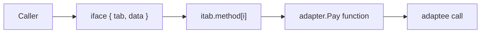

# Adapter — Professional Level

> **Source:** [refactoring.guru/design-patterns/adapter](https://refactoring.guru/design-patterns/adapter)
> **Prerequisite:** [Senior](senior.md)

---

## Table of Contents

1. [Introduction](#introduction)
2. [Memory Layout of an Adapter](#memory-layout-of-an-adapter)
3. [JVM: Virtual Dispatch and Inline Caches](#jvm-virtual-dispatch-and-inline-caches)
4. [JVM: Escape Analysis and Adapter Allocation](#jvm-escape-analysis-and-adapter-allocation)
5. [Go: Interface Internals (`itab`, `iface`)](#go-interface-internals-itab-iface)
6. [CPython: Attribute Lookup Cost](#cpython-attribute-lookup-cost)
7. [GC Implications](#gc-implications)
8. [Boxing and Primitive Specialization](#boxing-and-primitive-specialization)
9. [Cache-line Behavior](#cache-line-behavior)
10. [Microbenchmark Anatomy](#microbenchmark-anatomy)
11. [Cross-language Comparison](#cross-language-comparison)
12. [Distributed Adapter Concerns](#distributed-adapter-concerns)
13. [Diagrams](#diagrams)
14. [Related Topics](#related-topics)

---

## Introduction

Adapter is *behaviorally* trivial: one class delegates to another. Yet at the professional level, the *runtime* shape of that delegation matters: how the dispatch is resolved, where the bytes live, what the JIT is allowed to do, and what cost (if any) the indirection adds in real workloads.

This document traces an adapter call from **source line to CPU**, in three runtimes (JVM HotSpot, Go runtime, CPython), and gives the right mental models to reason about performance and memory.

---

## Memory Layout of an Adapter

A typical object adapter holds one reference to its adaptee:

```java
public final class StripeAdapter implements PaymentProcessor {
    private final StripeClient client;   // 1 reference
    private final Clock clock;           // 1 reference
}
```

On a 64-bit JVM with compressed OOPs (default for heaps < 32GB), object header is 12 bytes, each reference is 4 bytes. Total: 12 + 4 + 4 = 20 bytes, padded to 24.

```
+0   +-----------------+
     |  klass + mark   |  12 bytes (object header)
+12  +-----------------+
     |  client (oop)   |  4 bytes (compressed)
+16  +-----------------+
     |  clock (oop)    |  4 bytes
+20  +-----------------+
     |  padding        |  4 bytes (align to 8)
+24  +-----------------+
```

Without compressed OOPs (large heaps), references are 8 bytes; total ≈ 32 bytes. **Adapter cost is roughly an extra cache-line slice per instance.** For a singleton adapter, this is irrelevant. For millions of short-lived adapters per second, it shows up.

In Go, an adapter struct has the same layout as any struct — no header, just fields. A `StripeAdapter` with two pointer fields is 16 bytes on 64-bit. No padding overhead, no GC header.

In CPython, every object carries a `PyObject` header (`refcount` + `ob_type`) — 16 bytes on 64-bit. Instance attributes live in a per-instance `__dict__` (a hash table). An adapter with 2 attributes therefore weighs ~232 bytes minimum (object + dict + keys). **Python adapters are heavy** — but allocation is rarely your bottleneck in Python.

---

## JVM: Virtual Dispatch and Inline Caches

When the client calls `processor.pay(req)` where `processor` is typed as `PaymentProcessor`, the JVM emits an `invokeinterface` bytecode. At runtime, HotSpot turns this into:

1. **vtable + itable lookup** on first call (cold) — find the method pointer for the actual class.
2. **Inline cache** records the receiver type. Subsequent calls with the same receiver type hit the cache in ~1 cycle.
3. **Megamorphic** if 3+ types are seen at the call site — cache is abandoned, every call goes through full vtable lookup.

For an adapter, the implication is:

- If only **one adapter** is ever passed to a given call site, after warmup the dispatch is essentially free (monomorphic inline cache → JIT inlines the call).
- If your code uses 2 adapters at the same site, it's bimorphic — still fast.
- 3+ → megamorphic, performance cliff.

This is why "single Stripe adapter wired everywhere" beats "different adapter per request" *in microbenchmarks*. In real apps, GC and network dwarf this.

### CHA (Class Hierarchy Analysis) and devirtualization

If HotSpot can prove only one class implements the interface, it inlines the call directly — adapter overhead becomes zero. Mark adapter classes `final` and avoid leaving them open for subclassing; the JIT rewards you.

### After warmup

```java
// At JIT level, this:
processor.pay(req);

// effectively becomes (for a monomorphic site):
// (inlined StripeAdapter.pay body, with `req` translated, then call to client.charges())
```

**Conclusion:** in steady state, the adapter is *not* an extra method call.

---

## JVM: Escape Analysis and Adapter Allocation

If your adapter is short-lived and doesn't escape the method, escape analysis can elide the heap allocation entirely (scalar replacement).

```java
public PaymentResult process(StripeClient c, PaymentRequest req) {
    return new StripeAdapter(c).pay(req);   // adapter scoped to this method
}
```

After C2 compilation, the `new StripeAdapter(c)` is gone — no allocation, no GC pressure. The adapter "becomes" inlined fields on the stack.

This is why "wrap and unwrap" patterns are not always the disaster they look like — the JIT can erase them. **But you must measure.** Escape analysis is fragile; a debugger attaching, a `synchronized` block, or a `System.identityHashCode` call can disable it.

---

## Go: Interface Internals (`itab`, `iface`)

In Go, an interface value is a two-word structure:

```c
type iface struct {
    tab  *itab    // type descriptor + method pointers
    data unsafe.Pointer  // pointer to the actual value
}
```

Calling `processor.Pay(req)` resolves to:

1. Load `tab` from the interface header.
2. Load the function pointer from a fixed offset in the `itab`'s method table.
3. Indirect call.

The `itab` is computed lazily on **first interface conversion** for a `(interface, concrete-type)` pair, then cached in a global hash table. Subsequent conversions hit the cache.

```go
var p PaymentProcessor = &StripeAdapter{...}  // first time: itab built; cached
var q PaymentProcessor = &StripeAdapter{...}  // hits the cache
```

Indirect calls in Go are **not inlined** — Go's compiler is conservative compared to HotSpot. So adapter dispatch in Go costs:

- 1 pointer load (itab)
- 1 indirect call
- ~2-4 ns on modern hardware

Per call. For 1B operations/sec workloads this is real. For everything else, ignore it.

### Interface conversion allocations

```go
var p PaymentProcessor = stripeAdapter   // can allocate!
```

If `stripeAdapter` is a value type (not a pointer), the conversion to interface allocates a copy on the heap (so the interface can hold a stable pointer). Always pass adapters as pointers when going through interfaces:

```go
var p PaymentProcessor = &StripeAdapter{}   // no allocation
```

This is one of Go's most common performance footguns. Adapter is a place where it bites.

---

## CPython: Attribute Lookup Cost

In CPython, calling `adapter.pay(req)` triggers:

1. `LOAD_ATTR pay` on `adapter` — a hash lookup in `adapter.__dict__`, then `type(adapter).__mro__`. ~50 ns.
2. `CALL_METHOD` — pushes args, builds frame.
3. Inside `pay`, `self._gw.make_payment(...)` — another `LOAD_ATTR` (`_gw`), another method call.

Each indirection: ~50-100 ns. A direct call to the adaptee skips half of this.

CPython 3.11+ added **specializing adaptive interpreter** (PEP 659) — repeated `LOAD_ATTR` on the same type gets specialized to a single offset load, dropping cost by ~5×. Even so, Python's per-call overhead is ~100× the JVM's.

**Practical advice:**

- In Python, an adapter on a hot loop is real cost. Profile. Consider rewriting the loop in C extension / `numba` / Cython if the adapter is the bottleneck.
- For typical I/O-bound code (web servers), Python adapter cost is invisible behind the network.

---

## GC Implications

### Java

Adapters are usually long-lived (one per vendor, held by a service container). They live in the **old generation** after a few GC cycles. Adapter creation per request, however, generates allocations — measurable in GC logs.

Best practice: hold adapters as fields in services; don't create them per call. If you must create per call, prefer `record` or `static final` adapters.

### Go

Adapters as struct values are stack-allocated when escape analysis allows. As pointers, they go on the heap. The Go GC is concurrent and short-paused — adapter churn rarely shows up unless it's *gigabytes/sec* of garbage. Profile with `pprof -alloc_objects`.

### Python

Reference-counted: adapter destruction is deterministic and *eager*. No GC pause from adapters specifically, but the CPU cost of decrementing counts adds up. Cyclic references (adapter ↔ adaptee both holding each other) survive ref-counting and require the cycle collector — avoid.

---

## Boxing and Primitive Specialization

A Java adapter that takes `int` and returns `Integer` boxes:

```java
public Integer pay(int amount) { ... }   // return value boxed
```

Each call allocates an `Integer` (cached for [-128, 127] but allocated for larger). For high-throughput adapters, **avoid boxing**:

```java
public long pay(long amount) { ... }     // primitives all the way
```

Or use `OptionalLong` instead of `Optional<Long>`. The performance delta is real (10-20× in tight loops).

In Go and C++, this isn't an issue — values stay unboxed. In Python, *everything* is boxed; you can't avoid it without numpy/array.

---

## Cache-line Behavior

Modern CPUs fetch memory in 64-byte cache lines. An adapter object plus its adaptee reference often share a cache line — one fetch covers both. **Good.**

Where it matters: **arrays of adapters**.

```java
PaymentProcessor[] processors = ...;  // each element is a pointer
for (var p : processors) p.pay(req);
```

Each `p` is a pointer to a separate object on the heap. Iterating dereferences scattered memory — cache misses dominate. If you need to iterate millions of adapters, consider:

- Storing a flat array of structs (Go, Rust) instead of an array of pointers.
- Sorting/grouping by adapter type to improve branch prediction.
- Processing in batches where the inner work amortizes the cache miss.

This is rarely the bottleneck in business code. It's the bottleneck in game engines and HFT.

---

## Microbenchmark Anatomy

A correct microbenchmark for adapter overhead:

### Java (JMH)

```java
@BenchmarkMode(Mode.AverageTime)
@OutputTimeUnit(TimeUnit.NANOSECONDS)
@Warmup(iterations = 5, time = 1)
@Measurement(iterations = 10, time = 1)
@Fork(2)
@State(Scope.Benchmark)
public class AdapterBench {

    Adaptee adaptee = new Adaptee();
    Target target = new Adapter(adaptee);

    @Benchmark public void direct(Blackhole bh)  { bh.consume(adaptee.specificRequest()); }
    @Benchmark public void viaAdapter(Blackhole bh) { bh.consume(target.request()); }
}
```

Expected result on modern hardware (post-warmup, monomorphic site): both ≈1-2 ns; difference within noise. The JIT inlines the adapter call.

### Go (`testing.B`)

```go
func BenchmarkDirect(b *testing.B)    {
    a := &Adaptee{}
    for i := 0; i < b.N; i++ { _ = a.SpecificRequest() }
}

func BenchmarkViaAdapter(b *testing.B) {
    var t Target = &Adapter{a: &Adaptee{}}
    for i := 0; i < b.N; i++ { _ = t.Request() }
}
```

Expected: direct ≈ 1ns, via adapter ≈ 3-4 ns (interface dispatch is not inlined).

### Python (`timeit`)

```python
import timeit
print(timeit.timeit("a.specific_request()", setup="from mod import a", number=10_000_000))
print(timeit.timeit("t.request()", setup="from mod import t", number=10_000_000))
```

Expected: direct ≈ 80 ns/call, via adapter ≈ 150-200 ns. The 2× cost is real and unavoidable in pure-Python.

### Pitfalls

- **Dead-code elimination.** Without `Blackhole`/return, JIT removes the call entirely; benchmark "improves" to zero.
- **Cold start.** Without warmup, you measure the interpreter, not the JIT.
- **Megamorphic confusion.** Make sure each benchmark site sees only one type — otherwise the inline cache fails and numbers explode.

---

## Cross-language Comparison

| Concern | Java (HotSpot) | Go | Python (CPython 3.11+) |
|---|---|---|---|
| **Dispatch cost (cold)** | ~10 ns (vtable + IC fill) | ~3 ns (itab lookup) | ~150 ns (LOAD_ATTR) |
| **Dispatch cost (warm)** | ~1 ns (or 0 with inline) | ~3 ns | ~50 ns (specialized) |
| **Inlining** | Aggressive, works through monomorphic interface | Conservative, no interface inline | Limited, attribute caching only |
| **Allocation** | 24 bytes/instance + GC | 16 bytes (often stack) | 232+ bytes (heap, refcounted) |
| **Boxing** | Real concern (`int` ↔ `Integer`) | None | Pervasive |
| **Escape analysis** | Yes (scalar replacement) | Yes (stack alloc) | No |

---

## Distributed Adapter Concerns

When the adaptee is across the network:

### 1. Latency budget

The translation cost is dwarfed by the round-trip. Optimize *batching*, not the local layer.

### 2. Idempotency

Network retries demand idempotency keys. The adapter is the right place to *generate* them (UUIDv7 with timestamp; deterministic from request hash if the caller wants).

### 3. Connection pooling

The adaptee SDK probably manages its own pool — don't double-pool. The adapter is a thin layer; let the SDK keep the sockets.

### 4. Timeouts

Always set timeouts at the adapter boundary. Default behavior of "wait forever" is a production incident waiting to happen.

```java
public PaymentResult pay(PaymentRequest req) {
    var options = RequestOptions.builder().setReadTimeout(Duration.ofSeconds(5)).build();
    var charge = client.charges().create(toParams(req), options);
    ...
}
```

### 5. Tracing context

Pass trace IDs through the adapter into the vendor SDK if it supports them (most modern SDKs do). Otherwise log the trace ID alongside the vendor's request ID for cross-system correlation.

### 6. Vendor rate limits

The adapter should surface vendor rate-limit signals (HTTP 429, Stripe `rate_limit_exceeded`) as a recognizable domain error so retry/circuit-breaker decorators can act on them.

---

## Diagrams

### Java adapter call after JIT warmup (monomorphic)



The two "extra" hops are erased.

### Go interface call



### Cache-line layout

```
HEAP:
  +------------------ Adapter ---------------------+
  | header | adaptee* | clock* | padding |          ← single cache line
  +------------------------------------------------+
  +--------- StripeClient (Adaptee) ----------------+
  | header | conn_pool* | api_key* | ...            |
  +------------------------------------------------+
```

---

## Related Topics

- **JVM internals:** Aleksey Shipilëv's "JVM Anatomy Park" series (object headers, escape analysis); JEP 8024524 (compressed OOPs).
- **Go internals:** Russ Cox, "Go Data Structures: Interfaces" (research.swtch.com/interfaces).
- **CPython internals:** PEP 659 (specializing adaptive interpreter); `dis` module to inspect bytecode.
- **Benchmarking:** JMH (Java), `testing.B` (Go), pytest-benchmark / `timeit` (Python).
- **Concurrency models:** the adapter inherits the *memory model* of its language (JMM, Go memory model, GIL semantics) — see the corresponding sections in [Singleton — Professional](../../01-creational/05-singleton/professional.md).

---

[← Back to Adapter folder](.) · [↑ Structural Patterns](../README.md) · [↑↑ Roadmap Home](../../../README.md)

**Next:** [Adapter — Interview Preparation](interview.md) — questions, coding tasks, trick & behavioral
