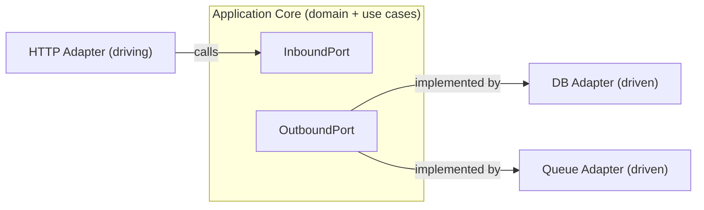
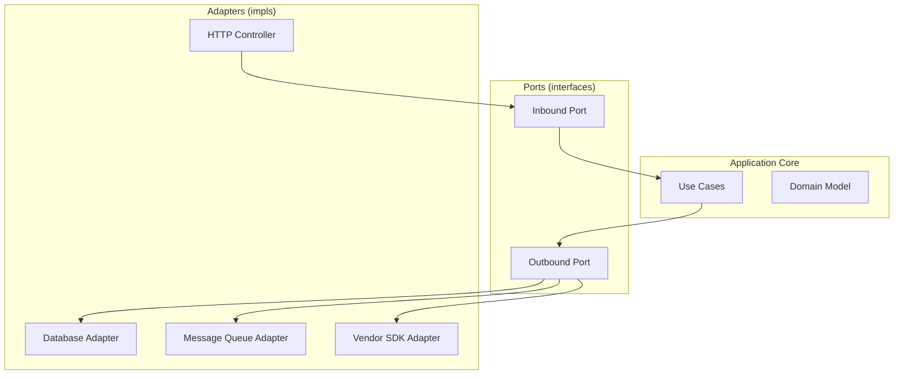
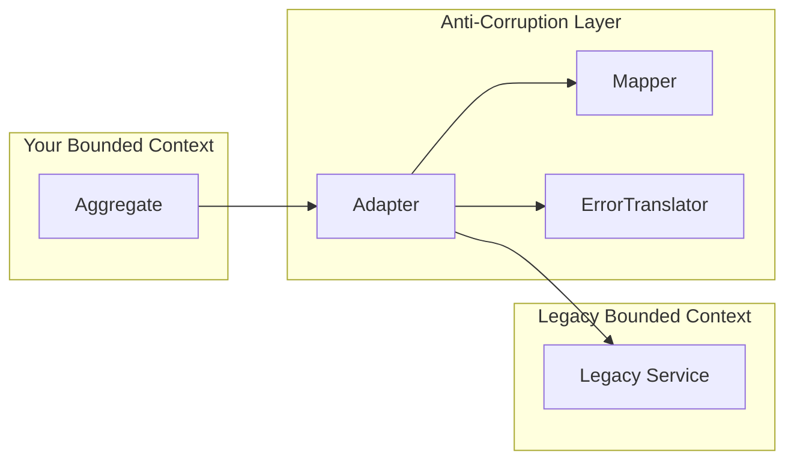
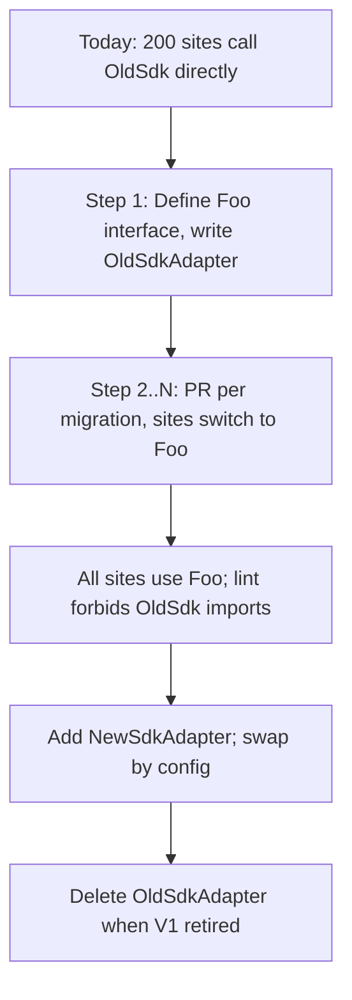
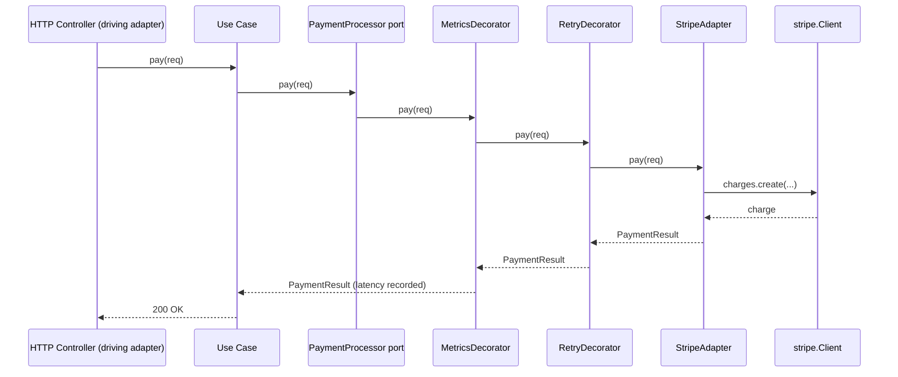

# Adapter — Senior Level

> **Source:** [refactoring.guru/design-patterns/adapter](https://refactoring.guru/design-patterns/adapter)
> **Prerequisite:** [Middle](middle.md)

---

## Table of Contents

1. [Introduction](#introduction)
2. [Architectural Patterns Around Adapter](#architectural-patterns-around-adapter)
3. [Performance Considerations](#performance-considerations)
4. [Concurrency Deep Dive](#concurrency-deep-dive)
5. [Testability Strategies](#testability-strategies)
6. [When Adapter Becomes a Bottleneck](#when-adapter-becomes-a-bottleneck)
7. [Code Examples — Advanced](#code-examples--advanced)
8. [Real-World Architectures](#real-world-architectures)
9. [Pros & Cons at Scale](#pros--cons-at-scale)
10. [Trade-off Analysis Matrix](#trade-off-analysis-matrix)
11. [Migration Patterns](#migration-patterns)
12. [Diagrams](#diagrams)
13. [Related Topics](#related-topics)

---

## Introduction

> Focus: **At scale, what breaks? What earns its keep?**

Adapter is, on paper, the simplest of the structural patterns: one class wraps another to change interface. In practice, the senior question isn't "do I write Adapter?" — it's **"where do I draw the boundary, and what costs am I accepting at that boundary?"**

At the senior level, Adapter blurs into:

- **Hexagonal Architecture** — *ports* are target interfaces, *adapters* are concrete implementations.
- **Anti-Corruption Layer (DDD)** — a thicker boundary that includes domain mapping, error translation, and isolation of bounded contexts.
- **Service mesh / sidecar patterns** — process-level adapters that translate protocols (gRPC ↔ HTTP) on the wire.

Each of these is "Adapter, but bigger." This document explores how the small-class pattern scales.

---

## Architectural Patterns Around Adapter

### 1. Hexagonal (Ports and Adapters) Architecture

Alistair Cockburn's hexagonal architecture (2005) names exactly what Adapter does at the system level:

- **Ports** = target interfaces, owned by the *application core*.
- **Adapters** = implementations that wire ports to the outside world (DB, HTTP, queue, vendor SDK).



**Driving adapters** call into the core (HTTP handler, CLI, scheduler).
**Driven adapters** are called by the core (repositories, payment gateways, message buses).

Senior insight: the *direction* of the arrow flips, but both sides are Adapter — the GoF pattern, scaled up.

### 2. Anti-Corruption Layer (DDD)

Eric Evans' Anti-Corruption Layer (ACL) is "Adapter on steroids":

- A whole module dedicated to translation.
- Includes adapters, but also **domain mappers** (vendor entity → your aggregate).
- Includes **error translation** and sometimes **caching** of vendor responses.
- Strict rule: **no vendor type or vendor concept escapes the ACL**.

ACLs exist because integrating with a foreign bounded context (an old monolith, a legacy CRM, a third-party API) tends to **infect** your domain with their concepts. The ACL is a quarantine.

In code, an ACL usually has:

```
acl/
  legacy_crm/
    LegacyCrmAdapter.java       ← Adapter (ports & adapters)
    CustomerMapper.java         ← Domain mapping
    LegacyErrorTranslator.java  ← Exception translation
    LegacyCache.java            ← Optional caching
```

Each piece can be tested independently.

### 3. Service mesh / sidecar adapters

When the boundary moves *out of process*, Adapter takes the form of an Envoy/Istio sidecar translating gRPC to HTTP, or an API gateway that turns SOAP into REST. The pattern is the same; the unit of deployment is different.

### 4. Adapter + Decorator stack

In Hexagonal architectures it's common to have:

```
PaymentPort
  ↑ implemented by
RetryDecorator(MetricsDecorator(StripeAdapter(client)))
```

The adapter is thin; cross-cutting concerns (retries, metrics, circuit breaker) are decorators around it. Composition, not class growth.

---

## Performance Considerations

### Per-call cost

An object adapter adds:
- One **virtual dispatch** (interface call).
- One **field load** (the adaptee reference).
- One **method call** (to the adaptee).

On the JVM these are typically inlined by C2 after warm-up. In Go, interface dispatch is a couple of pointer loads. In Python, attribute lookups dominate everything else; one extra method call is invisible.

**Conclusion:** in normal application code, adapter overhead is unmeasurable. **Don't optimize.**

### When it does matter

- **Inner loops over millions of items** — one indirection per element is real. Inline the translation, or expose a batched method on the target.
- **Allocations** — an adapter that builds a new domain object per call generates GC pressure. Consider object pools or value types (Go: stack-allocated; Java: `record` to make GC cheaper).
- **Boxing** — Java adapter that translates `int` to `Integer` allocates. Use primitive specializations.

### Batched APIs

If the adaptee supports `bulkCharge([req1, req2, ...])` and the target is `pay(req)`, the adapter should expose `payAll([req1, req2, ...])` — don't call the adaptee N times in a loop.

```java
public interface PaymentProcessor {
    PaymentResult pay(PaymentRequest req);
    List<PaymentResult> payAll(List<PaymentRequest> reqs);  // exposes batching
}
```

Otherwise the abstraction makes the adaptee's batch capability invisible.

---

## Concurrency Deep Dive

The adapter inherits the concurrency contract of the *adaptee*. If the adaptee is not thread-safe, the adapter is not thread-safe.

### Patterns

- **Stateless adapter, thread-safe adaptee** — fine. Multiple goroutines / threads can share one adapter.
- **Stateful adapter (e.g., caching)** — protect with a lock or a concurrent collection. Don't pretend statelessness.
- **Adapter holding mutable adaptee** — document. Pin one instance per logical user.

### Async ↔ Sync

If the target is sync and the adaptee is async, two valid choices:

1. **Block in the adapter** — `future.get()`. Easy, but wastes a thread per concurrent call. Catastrophic in async runtimes (Node.js, Python `asyncio`).
2. **Make the target async** — let the async-ness propagate. More invasive but correct.

Don't combine them: synchronous adapter wrapping `await`-able adaptee in async runtime → deadlocks.

### Backpressure

Adapter that buffers events from a push source needs an answer to **what happens when the queue fills**:

- Block the producer (backpressure).
- Drop oldest / newest (lossy, document).
- Error out.

Pick one. Defaulting to "unbounded queue" is choosing OOM.

### Cancellation

Go: pass `context.Context` to every adapter method. Java: pass a `Cancelable` or use `CompletableFuture.cancel`. Python: `asyncio.CancelledError`. The adapter must propagate cancellation to the adaptee — otherwise cancelling the caller leaves the adaptee dangling.

---

## Testability Strategies

### 1. Two layers of tests

For a Stripe adapter, you typically write:

- **Unit tests** with a fake/mock `StripeClient`. Cover all translation paths and error mapping.
- **Integration tests** against a sandbox (Stripe's test mode). Cover the actual wire contract. Run in CI nightly or on adapter changes only.

Skip either at your peril. Unit tests verify *your* logic; integration tests verify *your assumptions about the vendor*.

### 2. Contract tests

Pact, Spring Cloud Contract, etc. — define the wire contract once, share between provider and consumer. Useful when your adapter is consuming a service owned by another team in your company.

### 3. Property-based tests for translation

If your adapter converts cents↔dollars, time zones, or currency rounding, generate random inputs and check round-trip identity (`adapter.toAdaptee(adapter.fromAdaptee(x)) == x`). Catches edge cases human testers miss.

### 4. Fakes over mocks

A `FakeStripeClient` that implements just enough behavior (in-memory ledger of charges) is more useful than a mock with `when(...)`/`thenReturn(...)` litter. The fake exercises the adapter end-to-end *and* doubles as a development-mode adapter.

### 5. Snapshot tests for serialization adapters

When the adapter shapes a JSON payload for a downstream API, snapshot the output. Any unintended change shows up in CI.

---

## When Adapter Becomes a Bottleneck

### Symptom 1 — Adapter has 30 methods

The target interface is too broad. **Apply Interface Segregation.** Break it: `Charger`, `Refunder`, `Subscriber`. Each adapter implements only what it supports.

### Symptom 2 — Adapter has business logic

Look at conditional branches. If they're "if currency is X, do A; else B," it's policy. Move it into the domain or a Strategy. The adapter becomes thin again.

### Symptom 3 — Two adapters share 80% of code

Hierarchy of adapters: a base abstract adapter with shared translation, two concrete subclasses for the differing parts. Or, a higher-level adapter that delegates to lower-level adapters (composition). Don't duplicate.

### Symptom 4 — Translation is expensive (CPU)

Profile. Cache the result if input/output is deterministic. Avoid intermediate allocations. Consider whether the *target* shape is wrong — sometimes redesigning the target is cheaper than optimizing 50 adapters.

### Symptom 5 — Vendor SDK is unstable

Your adapter is rewritten every quarter. The SDK is the problem; consider freezing on a wire-protocol-level adapter (raw HTTP) instead of the SDK. More work upfront, more stability over years.

### Symptom 6 — Tests hit the network

You're using the real adaptee in unit tests. Inject the adaptee, fake it, and reserve real-network tests for a separate suite.

---

## Code Examples — Advanced

### Adapter + Retry/Metrics decorators

```go
type PaymentProcessor interface {
    Pay(ctx context.Context, req PaymentRequest) (PaymentResult, error)
}

// Concrete adapter — thin.
type StripeAdapter struct{ client *stripe.Client }

func (s *StripeAdapter) Pay(ctx context.Context, req PaymentRequest) (PaymentResult, error) {
    // ...translation only...
}

// Decorator: retries.
type RetryingProcessor struct {
    inner   PaymentProcessor
    backoff Backoff
}

func (r *RetryingProcessor) Pay(ctx context.Context, req PaymentRequest) (PaymentResult, error) {
    for attempt := 0; ; attempt++ {
        res, err := r.inner.Pay(ctx, req)
        if err == nil || !isRetryable(err) || attempt == r.backoff.Max {
            return res, err
        }
        select {
        case <-time.After(r.backoff.Delay(attempt)):
        case <-ctx.Done():
            return PaymentResult{}, ctx.Err()
        }
    }
}

// Decorator: metrics.
type MetricsProcessor struct {
    inner PaymentProcessor
    m     Metrics
}

func (mp *MetricsProcessor) Pay(ctx context.Context, req PaymentRequest) (PaymentResult, error) {
    start := time.Now()
    res, err := mp.inner.Pay(ctx, req)
    mp.m.RecordLatency("pay", time.Since(start))
    if err != nil { mp.m.IncErrors("pay") }
    return res, err
}

// Wire-up.
processor := &MetricsProcessor{
    inner: &RetryingProcessor{
        inner:   &StripeAdapter{client: stripeClient},
        backoff: ExponentialBackoff{Max: 5},
    },
    m: metrics,
}
```

The adapter stays thin. Cross-cutting concerns are independently testable. Same idea applies in Java with Spring AOP or Project Reactor; in Python with decorators.

### Adapter for a streaming API

```java
public interface EventStream<T> {
    void forEach(Consumer<T> consumer);
    void close();
}

public final class KafkaEventAdapter<T> implements EventStream<T> {
    private final KafkaConsumer<String, byte[]> consumer;
    private final Deserializer<T> deserializer;
    private volatile boolean closed = false;

    public KafkaEventAdapter(KafkaConsumer<String, byte[]> c, Deserializer<T> d) {
        this.consumer = c;
        this.deserializer = d;
    }

    public void forEach(Consumer<T> consumer) {
        while (!closed) {
            var records = this.consumer.poll(Duration.ofMillis(500));
            for (var r : records) {
                T value = deserializer.deserialize(r.value());
                consumer.accept(value);
            }
            this.consumer.commitSync();
        }
    }

    public void close() {
        closed = true;
        consumer.close();
    }
}
```

What's senior about this:
- Clear close/lifecycle contract (the target interface specifies it, the adapter honors it).
- `commitSync` decision is made *here* — message delivery semantics are an adapter responsibility.
- Deserialization is injected, not hardcoded.

### Hexagonal-style folder layout (Java)

```
src/main/java/com/acme/payments/
  domain/                   ← pure domain, no vendor imports
    Money.java
    Payment.java
    PaymentResult.java
  application/              ← use cases
    Checkout.java
  ports/                    ← target interfaces
    inbound/
      PaymentApi.java
    outbound/
      PaymentProcessor.java
      EventPublisher.java
  adapters/                 ← implementations
    inbound/
      http/PaymentController.java
    outbound/
      stripe/StripeAdapter.java
      kafka/KafkaEventPublisher.java
test/
  adapters/stripe/StripeAdapterIntegrationTest.java
  application/CheckoutTest.java        ← uses fakes for ports
```

The build can enforce the boundary: domain has no dependency on `org.springframework`, no dependency on `com.stripe`. The adapters have those dependencies.

---

## Real-World Architectures

### Architecture A — Multi-tenant SaaS payment routing

A SaaS platform serves merchants in 30 countries. Each country needs different payment methods and different tax compliance.

- One target interface: `PaymentProcessor`.
- 12 adapters: Stripe, Adyen, MercadoPago, PayU, etc.
- A **Router** strategy picks the adapter at runtime by merchant config.
- Each adapter is owned by a small subteam; SDK upgrades happen independently.

This is Adapter + Strategy + Hexagonal — the adapters do not know about routing; routing does not know about vendor specifics.

### Architecture B — Legacy mainframe migration

A bank moved off a mainframe over five years. During the migration:
- New microservices spoke "modern" APIs.
- A **mainframe adapter** translated each call to COBOL CICS RPC.
- As subsystems migrated to the new stack, only adapter implementations were swapped.

The adapter became *invisible* to the rest of the system — exactly the goal.

### Architecture C — Multi-cloud storage

S3, GCS, Azure Blob, on-prem MinIO. One `BlobStore` interface; four adapters. Cost analysis, geographic placement, disaster recovery — all become "swap an adapter," not "rewrite the codebase."

### Architecture D — Open-source plugin systems

Editors (VSCode, Vim), CI runners (Jenkins), CMSs (WordPress) all expose a *plugin interface*. Every plugin is, technically, an adapter from "the plugin's natural API" to "what the host expects." This is Adapter as a public extension point.

---

## Pros & Cons at Scale

### Pros (at scale)

- **Vendor independence.** Switching SDK versions, vendors, or pricing tiers is contained.
- **Team boundaries align with adapters.** Each team owns its adapter; coordination is light.
- **Testing strategy is uniform.** Every port has unit tests + integration tests, predictable structure.
- **Compliance.** Regulatory boundaries (PCI-DSS scope, GDPR data egress) are easy to draw at adapter edges.
- **Observability.** Adapter is a natural place for metrics, tracing, structured logs.

### Cons (at scale)

- **Interface drift.** Five teams, five adapters, slight API differences. The target interface is hardest to evolve.
- **Lowest-common-denominator surface.** The interface only exposes what *every* adapter can support; vendor-specific features are invisible.
- **Boilerplate proliferation.** N adapters × M operations = N*M translation methods. Generators or shared base classes mitigate.
- **Indirection in tracing.** Distributed traces show `Caller → Adapter → Vendor` where `Caller → Vendor` would be enough; tag spans well.
- **Adapter-hell.** Adapters around adapters around adapters — "I just want to call the API." Be honest about value.

---

## Trade-off Analysis Matrix

| Concern | Direct adaptee use | Object adapter | Adapter + Decorators |
|---|---|---|---|
| **Setup cost** | Lowest | Medium | High |
| **Test isolation** | Hard (real network) | Good (mock adaptee) | Best (compose fakes) |
| **Vendor lock-in** | High | Low | Lowest |
| **Per-call latency** | Lowest | +1 indirection | +N indirections |
| **Cross-cutting concerns** | Scattered | Mixed in | Cleanly separated |
| **Code reading** | Easy | Easy | Requires familiarity |
| **Suitable for** | Trivial scripts, throwaway code | Most production code | Long-lived systems with high stakes |

---

## Migration Patterns

### Pattern 1 — Strangler Fig over an old SDK

The codebase calls `OldSdk.foo()` directly. You introduce `Foo` interface and `OldSdkAdapter`. Migrate one call site per PR. After all sites move, you can introduce a `NewSdkAdapter` swapping by config. The "fig" gradually replaces the host.

### Pattern 2 — Adapter as a stepping-stone to extraction

You realize an internal module deserves its own service. The first step is to put it behind a port (interface) and an in-process adapter. Once that boundary is enforced, lifting the adapter to call a remote service is a small change — the rest of the code doesn't notice.

### Pattern 3 — Versioned adapters

Vendor releases v2 with breaking changes. You keep `StripeAdapterV1` and add `StripeAdapterV2`. A factory picks based on config; integration tests run on both during a transition window. After cutover, V1 is deleted.

### Pattern 4 — Multi-layer adapter (gateway anti-corruption)

A team owns a single "gateway" service that fronts a legacy system. Inside the gateway, multiple smaller adapters do raw protocol translation; on top of those, a domain adapter assembles your aggregate. The gateway is a process-level Anti-Corruption Layer.

---

## Diagrams

### Hexagonal architecture



### Anti-Corruption Layer



### Strangler Fig migration



### Trace through layers



---

## Related Topics

- **Foundational architecture:** **Hexagonal Architecture** (Cockburn, 2005), **Onion Architecture** (Palermo), **Clean Architecture** (Martin) — three dialects of the same idea.
- **DDD:** **Anti-Corruption Layer**, **Bounded Context**, **Context Map**.
- **Patterns combined with Adapter:** Decorator (cross-cutting), Strategy (vendor selection), Factory (adapter creation), Observer (event-driven adaptation).
- **Industry references:** Spring's `JdbcTemplate`, JDBC, ODBC, SLF4J, Apache Camel, Envoy filters, AWS SDK abstractions.
- **Next:** [Professional Level](professional.md) — JVM/Go/Python internals of dispatch, JIT inlining, allocation cost, and benchmark anatomy.

---

[← Back to Adapter folder](.) · [↑ Structural Patterns](../README.md) · [↑↑ Roadmap Home](../../../README.md)

**Next:** [Adapter — Professional Level](professional.md) — internals, JMM, virtual dispatch, GC, microbenchmarks
