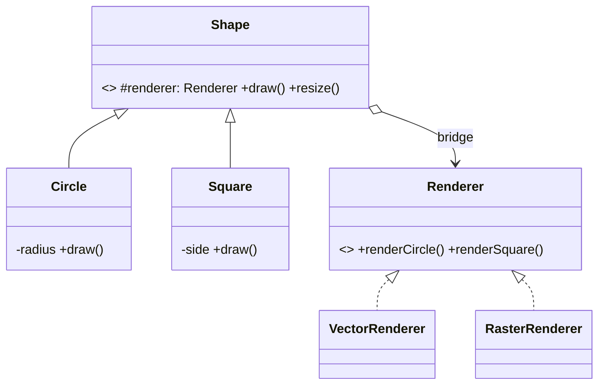
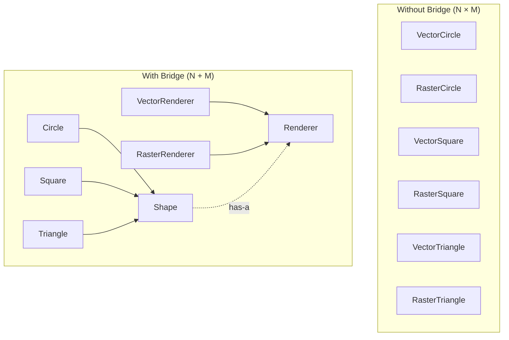
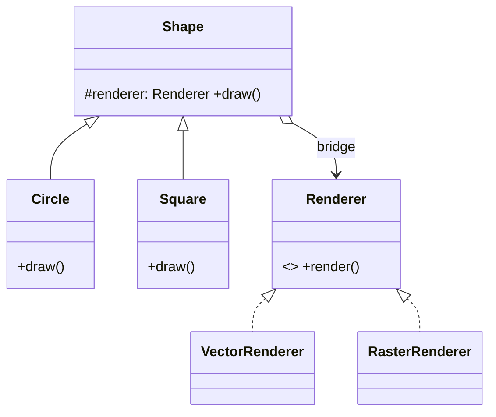

# Bridge — Junior Level

> **Source:** [refactoring.guru/design-patterns/bridge](https://refactoring.guru/design-patterns/bridge)
> **Category:** [Structural](../README.md) — *"Explain how to assemble objects and classes into larger structures, while keeping these structures flexible and efficient."*

---

## Table of Contents

1. [Introduction](#introduction)
2. [Prerequisites](#prerequisites)
3. [Glossary](#glossary)
4. [Core Concepts](#core-concepts)
5. [Real-World Analogies](#real-world-analogies)
6. [Mental Models](#mental-models)
7. [Pros & Cons](#pros--cons)
8. [Use Cases](#use-cases)
9. [Code Examples](#code-examples)
10. [Coding Patterns](#coding-patterns)
11. [Clean Code](#clean-code)
12. [Best Practices](#best-practices)
13. [Edge Cases & Pitfalls](#edge-cases--pitfalls)
14. [Common Mistakes](#common-mistakes)
15. [Tricky Points](#tricky-points)
16. [Test Yourself](#test-yourself)
17. [Tricky Questions](#tricky-questions)
18. [Cheat Sheet](#cheat-sheet)
19. [Summary](#summary)
20. [What You Can Build](#what-you-can-build)
21. [Further Reading](#further-reading)
22. [Related Topics](#related-topics)
23. [Diagrams & Visual Aids](#diagrams--visual-aids)

---

## Introduction

> Focus: **What is it?** and **How to use it?**

**Bridge** is a structural design pattern that lets you split a large class — or a set of closely related classes — into **two separate hierarchies**: an *abstraction* and an *implementation* — that can be developed independently.

Imagine you're writing a drawing program. You have shapes (`Circle`, `Square`) and you want to draw them on different platforms (`Windows`, `Linux`). The naïve approach: create `WindowsCircle`, `LinuxCircle`, `WindowsSquare`, `LinuxSquare`. With 5 shapes and 3 platforms you have **15 classes**. Add a new shape → 3 new classes. Add a new platform → 5 new classes. This is called the **class explosion** problem.

Bridge solves this by extracting one of the dimensions into a separate hierarchy and connecting them through *composition*: `Shape` holds a reference to `Renderer`. Now you have `5 + 3 = 8` classes instead of `5 × 3 = 15`. Add a new shape → 1 class. Add a platform → 1 class.

In one sentence: *"Avoid the N×M class explosion by replacing inheritance with composition between two dimensions."*

This pattern's name is the most misleading in the GoF book. People hear "Bridge" and think it's about connecting two systems — that's Adapter. Bridge is about *preventing class explosion* by splitting one dimension out of an inheritance tree.

---

## Prerequisites

What you should know before reading this:

- **Required:** Basic OOP — classes, inheritance, abstract classes/interfaces.
- **Required:** Composition vs inheritance trade-offs. Bridge is the canonical "favor composition" pattern.
- **Required:** Polymorphism — both sides of a Bridge are polymorphic; the abstraction picks an implementation at runtime.
- **Helpful but not required:** A taste of "diamond" or class-explosion problems in past code (e.g., a settings/feature combination matrix).

---

## Glossary

| Term | Definition |
|------|-----------|
| **Abstraction** | The high-level interface the client uses (e.g., `Shape`). Holds a reference to an Implementation. |
| **Refined Abstraction** | A subclass of Abstraction that adds variant behavior (e.g., `Circle`, `Square`). |
| **Implementation (Implementor)** | A separate interface for low-level operations (e.g., `Renderer`). Different from "implementation" in Java's `implements`. |
| **Concrete Implementation** | A specific implementation (e.g., `VectorRenderer`, `RasterRenderer`). |
| **Bridge** | The composition link from Abstraction to Implementation. Lives as a field. |
| **Class explosion** | The N × M (× K × …) growth of subclass count when each dimension is modeled by inheritance. |

---

## Core Concepts

### 1. Two Independent Hierarchies

Bridge separates "what" from "how." The **abstraction** hierarchy says *what* the high-level operations are; the **implementation** hierarchy says *how* low-level steps are performed. Each evolves on its own.

### 2. Composition Replaces Inheritance

Instead of `WindowsCircle extends Circle`, you have:

```
Circle ─has-a─► Renderer (interface)
                    ▲
                    ├─ VectorRenderer
                    └─ RasterRenderer
```

The "bridge" is the arrow: an Abstraction holds a reference to an Implementation.

### 3. Run-time Choice

Both sides are polymorphic. You can swap implementations at run-time:

```java
Shape c = new Circle(new VectorRenderer());
c.draw();
c = new Circle(new RasterRenderer());  // same Circle, different rendering
c.draw();
```

This is the *power* of Bridge: behavior on each side evolves independently and combines on demand.

---

## Real-World Analogies

| Concept | Analogy |
|---------|--------|
| **Abstraction + Implementation** | A TV remote (abstraction) and the TV (implementation). The remote knows "channel up"; the TV knows the protocol to change channels. Different remotes work with the same TV; different TVs work with the same remote. |
| **Two hierarchies** | Phones (iPhone, Android, KaiOS) and apps (Calculator, Camera, Browser). The app concept is independent from the OS implementation. |
| **Bridge link** | A USB cable: standardized on both ends, but the device on one side and the host on the other are independent products. |
| **Class explosion avoided** | Pizza menu: instead of `Pepperoni-Thin-Tomato`, `Pepperoni-Thick-Pesto`, ... — you choose toppings, crust, and sauce independently. |

The classical refactoring.guru analogy is shapes × colors. Without Bridge: `RedCircle`, `BlueCircle`, `RedSquare`, `BlueSquare` — and so on. With Bridge: `Shape` holds a `Color`, and you compose at runtime.

---

## Mental Models

**The intuition:** Picture a 2D matrix of features. The rows are one dimension (shapes); the columns are another (renderers). Inheritance forces you to pre-create every cell. Bridge says: pick a row at run-time, pick a column at run-time, and let them collaborate.

**Why this model helps:** It frames Bridge as a *cardinality* problem, not a code-organization problem. Whenever you see code where features multiply combinatorially, Bridge is the answer.

**Visualization:**

```
                  Renderer hierarchy
                  ┌──────────┬──────────┐
                  │ Vector   │ Raster   │
       ┌──────────┼──────────┼──────────┤
Shape  │ Circle   │  ✓       │  ✓       │
       │ Square   │  ✓       │  ✓       │
       │ Triangle │  ✓       │  ✓       │
       └──────────┴──────────┴──────────┘

   Without Bridge: 6 classes (3×2)
   With Bridge:    5 classes (3+2)
   Add 1 row:      +1 class (vs +2 without)
```

---

## Pros & Cons

| Pros | Cons |
|------|------|
| Avoids the N × M class-explosion problem | Adds an extra layer of indirection (one method call, one field) |
| Each hierarchy evolves independently | Up-front design needed — you must identify the *two* dimensions cleanly |
| Run-time composition (swap implementation per instance) | Overkill if there's truly only one implementation forever |
| Open/Closed: add a Shape or a Renderer without touching the other side | Easy to confuse with Adapter, Strategy, or State |
| Better testability — mock either side | The "Implementor" name is misleading — it's not Java's `implements` |

### When to use:
- Two (or more) orthogonal dimensions that vary independently
- A class hierarchy that has started to multiply combinatorially
- Code where you might want to swap "how" without changing "what" at run-time

### When NOT to use:
- Only one dimension truly varies — single inheritance or Strategy is simpler
- The two dimensions are tightly coupled (changes always touch both)
- You're solving a *future* hypothetical multiplication — YAGNI

---

## Use Cases

Real-world places where Bridge is commonly applied:

- **GUI frameworks:** Widget × Theme (Light/Dark/HighContrast), Widget × Platform (Web/Native)
- **Cross-platform graphics:** Shape × Renderer (OpenGL/Vulkan/Metal/Software)
- **Persistence:** Repository × Storage backend (Postgres/MySQL/in-memory) — yes, this overlaps with Adapter; the difference is intent (see Tricky Questions)
- **Notifications:** Notification (Email, SMS, Push) × Provider (Mailgun, Twilio, FCM)
- **Logging:** Logger interface × Sink (file, network, syslog)
- **Devices:** Remote control × Device — the GoF book's original example
- **Drivers:** OS-independent code × OS-specific implementation

---

## Code Examples

### Go

Go has no inheritance — Bridge becomes idiomatic Go: an interface (the Implementor) and structs (Abstractions) that embed or hold it.

```go
package main

import "fmt"

// Implementor — low-level rendering API.
type Renderer interface {
	RenderCircle(radius float64)
	RenderSquare(side float64)
}

// Concrete Implementations.
type VectorRenderer struct{}

func (VectorRenderer) RenderCircle(r float64) {
	fmt.Printf("Drawing circle of radius %.1f as vector\n", r)
}
func (VectorRenderer) RenderSquare(s float64) {
	fmt.Printf("Drawing square of side %.1f as vector\n", s)
}

type RasterRenderer struct{}

func (RasterRenderer) RenderCircle(r float64) {
	fmt.Printf("Drawing pixels for circle of radius %.1f\n", r)
}
func (RasterRenderer) RenderSquare(s float64) {
	fmt.Printf("Drawing pixels for square of side %.1f\n", s)
}

// Abstraction.
type Shape interface {
	Draw()
	Resize(factor float64)
}

// Refined abstractions.
type Circle struct {
	renderer Renderer
	radius   float64
}

func (c *Circle) Draw()                 { c.renderer.RenderCircle(c.radius) }
func (c *Circle) Resize(factor float64) { c.radius *= factor }

type Square struct {
	renderer Renderer
	side     float64
}

func (s *Square) Draw()                 { s.renderer.RenderSquare(s.side) }
func (s *Square) Resize(factor float64) { s.side *= factor }

func main() {
	shapes := []Shape{
		&Circle{renderer: VectorRenderer{}, radius: 5},
		&Square{renderer: RasterRenderer{}, side: 3},
	}
	for _, s := range shapes { s.Draw() }
}
```

**What it does:** `Circle` and `Square` are abstractions. `VectorRenderer` and `RasterRenderer` are implementations. Each shape holds whichever renderer it was given.

**How to run:** `go run main.go`

---

### Java

```java
// Implementor.
public interface Renderer {
    void renderCircle(double radius);
    void renderSquare(double side);
}

// Concrete implementations.
public class VectorRenderer implements Renderer {
    @Override public void renderCircle(double r) { System.out.printf("vector circle r=%.1f%n", r); }
    @Override public void renderSquare(double s) { System.out.printf("vector square s=%.1f%n", s); }
}

public class RasterRenderer implements Renderer {
    @Override public void renderCircle(double r) { System.out.printf("raster circle r=%.1f%n", r); }
    @Override public void renderSquare(double s) { System.out.printf("raster square s=%.1f%n", s); }
}

// Abstraction.
public abstract class Shape {
    protected final Renderer renderer;        // the "bridge"
    protected Shape(Renderer renderer) { this.renderer = renderer; }
    public abstract void draw();
    public abstract void resize(double factor);
}

// Refined abstractions.
public class Circle extends Shape {
    private double radius;
    public Circle(Renderer r, double radius) { super(r); this.radius = radius; }
    @Override public void draw() { renderer.renderCircle(radius); }
    @Override public void resize(double factor) { radius *= factor; }
}

public class Square extends Shape {
    private double side;
    public Square(Renderer r, double side) { super(r); this.side = side; }
    @Override public void draw() { renderer.renderSquare(side); }
    @Override public void resize(double factor) { side *= factor; }
}

// Client.
public class Demo {
    public static void main(String[] args) {
        Shape c = new Circle(new VectorRenderer(), 5);
        Shape s = new Square(new RasterRenderer(), 3);
        c.draw();
        s.draw();
    }
}
```

**What it does:** Same logic. `Shape` is abstract, `Renderer` is the implementor interface, and the bridge is the `protected final Renderer renderer` field.

**How to run:** `javac *.java && java Demo`

> **Note:** `Shape` is `abstract`, not an interface, only because we want shared state (the `renderer` field). An interface with default methods would also work in modern Java.

---

### Python

Python doesn't need separate interfaces — duck typing is enough. Use ABCs for clarity if you like.

```python
from abc import ABC, abstractmethod


# Implementor.
class Renderer(ABC):
    @abstractmethod
    def render_circle(self, radius: float) -> None: ...

    @abstractmethod
    def render_square(self, side: float) -> None: ...


class VectorRenderer(Renderer):
    def render_circle(self, radius: float) -> None:
        print(f"vector circle r={radius:.1f}")
    def render_square(self, side: float) -> None:
        print(f"vector square s={side:.1f}")


class RasterRenderer(Renderer):
    def render_circle(self, radius: float) -> None:
        print(f"raster circle r={radius:.1f}")
    def render_square(self, side: float) -> None:
        print(f"raster square s={side:.1f}")


# Abstraction.
class Shape(ABC):
    def __init__(self, renderer: Renderer) -> None:
        self._renderer = renderer

    @abstractmethod
    def draw(self) -> None: ...

    @abstractmethod
    def resize(self, factor: float) -> None: ...


class Circle(Shape):
    def __init__(self, renderer: Renderer, radius: float) -> None:
        super().__init__(renderer)
        self._radius = radius
    def draw(self) -> None: self._renderer.render_circle(self._radius)
    def resize(self, factor: float) -> None: self._radius *= factor


class Square(Shape):
    def __init__(self, renderer: Renderer, side: float) -> None:
        super().__init__(renderer)
        self._side = side
    def draw(self) -> None: self._renderer.render_square(self._side)
    def resize(self, factor: float) -> None: self._side *= factor


if __name__ == "__main__":
    for s in (Circle(VectorRenderer(), 5), Square(RasterRenderer(), 3)):
        s.draw()
```

**What it does:** Same shape × renderer matrix.

**How to run:** `python3 main.py`

---

## Coding Patterns

### Pattern 1: Two-Hierarchy Bridge

**Intent:** The textbook GoF Bridge — Shape × Renderer.



---

### Pattern 2: Three-Hierarchy Bridge

**Intent:** Sometimes you have three orthogonal dimensions: e.g., **Notification × Channel × Format**.

```
Notification (urgent / info)  ×  Channel (email/sms/push)  ×  Format (plain/html/markdown)
```

In a single bridge, two of the three dimensions get composed and the third is composed inside one of those two. Apply Bridge twice.

**Remember:** If you have *more than three* dimensions, ask whether the dimensions are truly orthogonal — usually one or two collapse on inspection.

---

### Pattern 3: Abstraction with Multiple Implementor Slots

**Intent:** A complex Abstraction holds *several* Implementor references at once (e.g., `Document` holds a `Renderer` and a `Storage`).

```java
public class Document {
    private final Renderer renderer;
    private final Storage  storage;
    public Document(Renderer r, Storage s) { this.renderer = r; this.storage = s; }
}
```

This stops being a textbook Bridge and starts to resemble Hexagonal Architecture. Same principle, scaled.

---

## Clean Code

### Naming

The convention is `<thing>` for Abstraction and `<thing>Implementor` / `<thing>Backend` / `<thing>Renderer` for the implementation hierarchy.

```java
// ❌ Bad — names hide intent
public interface Helper { ... }
public abstract class Doer { ... }

// ✅ Clean
public interface Renderer { ... }
public abstract class Shape { ... }
```

### Composition over inheritance

If you find yourself writing `class WindowsCircle extends Circle` — stop. Bridge says compose, don't multiply subclasses.

```java
// ❌ Class explosion
class WindowsCircle extends Circle { ... }
class LinuxCircle extends Circle { ... }

// ✅ Bridge
new Circle(new WindowsRenderer())
new Circle(new LinuxRenderer())
```

---

## Best Practices

1. **Identify the two dimensions explicitly before coding.** Bridge fails if the dimensions you split aren't truly orthogonal.
2. **Inject the implementor.** Pass it through the constructor; don't construct it inside the abstraction.
3. **Make the implementor interface as small as possible.** It's the contract between the two hierarchies; bloat = friction.
4. **Document the bridge link.** A code reader should know "this `Shape` *has* a `Renderer`, and that's the bridge."
5. **Keep the implementor stateless when you can.** Stateful implementors complicate sharing.
6. **Favor composition over inheritance** is the meta-principle Bridge codifies.

---

## Edge Cases & Pitfalls

- **Implementor leak:** the abstraction's public methods accidentally take or return implementor types — clients become coupled to "the wrong half" of the hierarchy.
- **Two evolving in lockstep:** if every change to Shape requires a change to Renderer, the dimensions weren't orthogonal — the bridge buys nothing.
- **Stateful implementor:** sharing the same `Renderer` between many shapes can cause race conditions if it has state. Use stateless renderers or per-shape instances.
- **Diamond confusion in Python:** when both Abstraction and Implementor inherit common ancestors, the MRO becomes tricky. Keep the hierarchies disjoint.
- **Wrong default:** if every abstraction defaults to one implementor, the pattern is wasted. Use it only if the choice really varies.

---

## Common Mistakes

1. **Calling Bridge "Adapter" or vice versa.** They look superficially similar but have different intents (see Tricky Questions).

2. **Hard-coding the implementor inside the abstraction.**

   ```java
   // ❌ No bridge — Circle is bound to VectorRenderer.
   public class Circle extends Shape {
       private final Renderer renderer = new VectorRenderer();
   }
   ```

3. **Implementor with one concrete class.** If there's only ever one renderer, you don't need a bridge — you need a class.

4. **Bridge across non-orthogonal dimensions.** Splitting `OrderItem` into `Item` × `OrderLine` when changes ripple across both — the dimensions weren't truly orthogonal.

5. **Confusing Bridge with Strategy.** Strategy swaps an algorithm at runtime within a single class. Bridge keeps two parallel hierarchies. Strategy is a special case of Bridge with one trivial side.

---

## Tricky Points

- **Bridge vs Adapter:** Bridge is *designed in* up-front; Adapter is *applied after the fact* to retrofit incompatible APIs. Same shape (composition + interface), opposite life cycle.
- **Bridge vs Strategy:** Strategy is "one algorithm, swap it." Bridge is "one *family* of algorithms across a hierarchy of clients." If your `Renderer` had only one method and the client weren't a hierarchy, it would be Strategy.
- **The implementor isn't a Java implementation.** GoF picked the unfortunate name "Implementor" before `implements` was a Java keyword. Mentally substitute "low-level operation interface."
- **Bridge appears naturally** when you start with a class hierarchy and discover a second dimension. The refactor (push field down → push method up) often *creates* the bridge.

---

## Test Yourself

1. What problem does Bridge solve?
2. Name the four roles in the pattern.
3. Why is composition used instead of inheritance?
4. What's the difference between Bridge and Adapter?
5. What's the difference between Bridge and Strategy?
6. Give an example with two dimensions in your daily code.
7. When should you NOT use Bridge?

<details><summary>Answers</summary>

1. The N × M class explosion that comes from modeling two independent dimensions with inheritance.
2. **Abstraction**, **Refined Abstraction**, **Implementor**, **Concrete Implementor**.
3. Inheritance binds you to one combination at compile time; composition lets you mix and match at run-time, and avoids the N×M subclass count.
4. Bridge is *proactive* (designed in); Adapter is *reactive* (applied after the fact). Bridge intends two hierarchies; Adapter intends one wrapping translator.
5. Strategy is one algorithm, one client. Bridge is a *family* of algorithms across a *hierarchy* of clients.
6. Examples: Logger × Sink, Notification × Provider, Repository × Database driver.
7. When there's only one dimension, only one implementation, or the dimensions aren't truly orthogonal.

</details>

---

## Tricky Questions

> **"Isn't Bridge just two classes with composition? Why does it deserve a name?"**

It deserves a name because the *intent* is specific: split a hierarchy into two so they can vary independently. Two-class composition is everywhere; "Bridge" is a flag that says *"this composition exists to prevent class explosion across two dimensions."*

> **"How is Bridge different from Adapter?"**

Bridge is *designed in*: from day one, you decided two hierarchies should compose. Adapter is *applied after the fact*: you couldn't change one of two existing things, so you wrote a translator. Same code shape, opposite story.

> **"Can the abstraction have multiple implementors?"**

Yes — for example, a `Document` that has both a `Renderer` and a `Storage`. The "two-hierarchy" rule is a starting point; the real rule is "split orthogonal dimensions."

---

## Cheat Sheet

```go
// GO
type Renderer interface { Render(args) }
type Shape struct { renderer Renderer }
func (s Shape) Draw() { s.renderer.Render(...) }
```

```java
// JAVA
interface Renderer { void render(...); }
abstract class Shape {
    protected final Renderer r;
    Shape(Renderer r) { this.r = r; }
    abstract void draw();
}
```

```python
# PYTHON
class Renderer(ABC): ...
class Shape(ABC):
    def __init__(self, renderer): self._r = renderer
```

---

## Summary

- **Bridge** = two parallel hierarchies (Abstraction + Implementor) connected by composition.
- Solves the **N × M class-explosion** problem.
- Each side evolves independently; both are polymorphic.
- *Designed in* up-front; if you reach for it after the fact, you may want Adapter.
- The "Implementor" name is unfortunate — read it as "low-level operations interface."

If a class hierarchy is starting to multiply by every new feature, Bridge is the refactor that pulls one dimension out into its own family.

---

## What You Can Build

- **Cross-platform shape renderer** — `Shape` × `Renderer` (vector/raster/svg)
- **Multi-channel notification** — `Notification` × `Channel` (email/sms/slack)
- **Theming** — `Widget` × `Theme` (light/dark/highcontrast)
- **Pluggable storage** — `Repository` × `Backend` (postgres/redis/file)
- **Game entity engine** — `Entity` × `RenderEngine` (2D/3D/headless)

---

## Further Reading

- **refactoring.guru source page:** [refactoring.guru/design-patterns/bridge](https://refactoring.guru/design-patterns/bridge)
- **GoF book:** *Design Patterns*, p. 151 (Bridge)
- **AWT/Swing peers** in early Java are a textbook Bridge: `Component` is the abstraction, `ComponentPeer` is the implementor, with platform-specific peer implementations.

---

## Related Topics

- **Next level:** [Bridge — Middle Level](middle.md) — three-hierarchy variants, refactoring stories, comparison with DI.
- **Compared with:** [Adapter](../01-adapter/junior.md) — proactive vs reactive; [Strategy](../../03-behavioral/) — one algorithm vs hierarchy.
- **Architectural cousins:** Hexagonal Architecture (Ports and Adapters) is "Bridge applied at the system boundary."

---

## Diagrams & Visual Aids

### Class explosion vs Bridge



### The Bridge link



---

[← Back to Bridge folder](.) · [↑ Structural Patterns](../README.md) · [↑↑ Roadmap Home](../../../README.md)

**Next:** [Bridge — Middle Level](middle.md)
