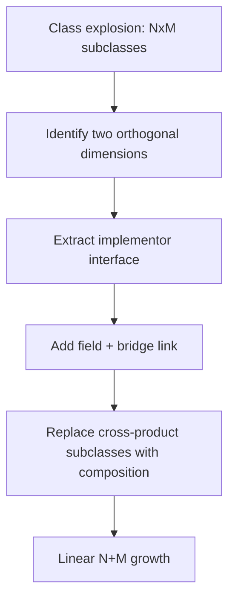
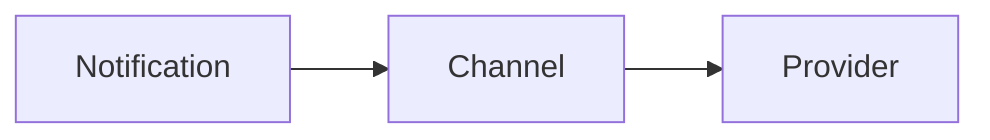
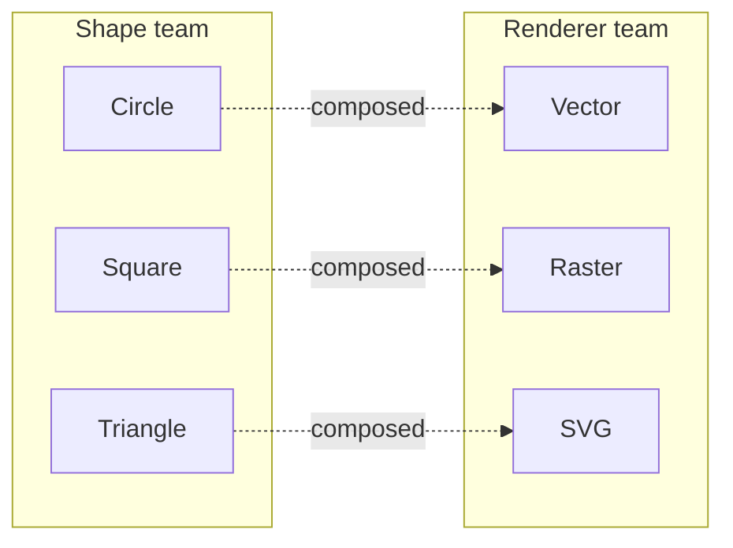

# Bridge — Middle Level

> **Source:** [refactoring.guru/design-patterns/bridge](https://refactoring.guru/design-patterns/bridge)
> **Prerequisite:** [Junior](junior.md)

---

## Table of Contents

1. [Introduction](#introduction)
2. [When to Use Bridge](#when-to-use-bridge)
3. [When NOT to Use Bridge](#when-not-to-use-bridge)
4. [Real-World Cases](#real-world-cases)
5. [Code Examples — Production-Grade](#code-examples--production-grade)
6. [Three-Hierarchy Variants](#three-hierarchy-variants)
7. [Refactoring to Bridge](#refactoring-to-bridge)
8. [Trade-offs](#trade-offs)
9. [Alternatives Comparison](#alternatives-comparison)
10. [Pros & Cons (Deeper)](#pros--cons-deeper)
11. [Edge Cases](#edge-cases)
12. [Tricky Points](#tricky-points)
13. [Best Practices](#best-practices)
14. [Tasks (Practice)](#tasks-practice)
15. [Summary](#summary)
16. [Related Topics](#related-topics)
17. [Diagrams](#diagrams)

---

## Introduction

> Focus: **When to use it?** and **Why?**

At the middle level, the Bridge questions sharpen:

- **How do I recognize the two dimensions in real code?**
- **When is "two hierarchies" the right design vs over-engineering?**
- **How do I refactor a class explosion into a Bridge incrementally?**

Bridge is one of the most *commonly required and rarely named* patterns. You will reach for it when a feature matrix starts growing combinatorially. The trick is to recognize the matrix early.

---

## When to Use Bridge

Use Bridge when **all** of these are true:

1. **Two (or more) dimensions vary independently.** Adding values to one dimension doesn't require changes in the other.
2. **You expect both dimensions to grow.** New shapes will be added; new renderers will be added.
3. **A class explosion is forming or will form.** You see (or anticipate) `<DimA><DimB>` named classes.
4. **You want runtime composition.** Picking the right combination should be a runtime decision.
5. **Hierarchies are stable in shape, variable in members.** The *interfaces* don't churn; the implementations on each side multiply.

If even one is missing, you likely want a simpler tool (Strategy, plain inheritance, or no pattern).

### Triggers

- "I'm about to write `WindowsCircle`, `LinuxCircle`..." → Bridge.
- "We need our notification system to support email *and* SMS *and* slack *and* push." → Bridge (Notification × Channel).
- "Every Renderer has 3 implementations and every Shape has 4 — and we have one class per cell." → Bridge.
- "Repository × Storage backend matrix." → Bridge (or Hexagonal Architecture, which is Bridge at system scale).

---

## When NOT to Use Bridge

- **Only one dimension varies.** Use plain inheritance or Strategy.
- **The two "dimensions" actually move together.** Every change to A also changes B. Not orthogonal — Bridge buys nothing.
- **Only two cells of the matrix exist forever.** The class explosion isn't real; the up-front design is overkill.
- **You're writing a one-off script.** YAGNI.
- **The implementor interface would be "do everything" with 30 methods.** Either segregate (split the implementor) or rethink — that's not a clean dimension.

### Smell: Bridge that grew tightly coupled

You started with `Shape` × `Renderer`. Six months later, `Shape.draw()` does:

```java
if (renderer instanceof VectorRenderer) {
    ((VectorRenderer) renderer).vectorOnlyMethod(...);
}
```

The dimensions weren't truly orthogonal — the abstraction now needs implementor-specific behavior. Either expand the implementor interface, or admit the Bridge wasn't the right call here.

---

## Real-World Cases

### Case 1 — Cross-platform graphics (game engine)

A game engine supports OpenGL on desktop, Metal on macOS, Vulkan on PC, and a software renderer for tests. Without Bridge: `OpenGLSprite`, `MetalSprite`, `VulkanSprite`, `SoftSprite`, then `OpenGLBackground`, `MetalBackground`, ... — fast explosion.

**Solution:**

```
Drawable (Sprite, Background, ParticleSystem, ...)  ─bridge─►  Renderer (OpenGL, Metal, Vulkan, Soft)
```

Adding a new entity = 1 class. Adding a new platform = 1 class.

### Case 2 — Notification × Provider × Format

A SaaS sends transactional emails, SMS, and push notifications via different providers (Mailgun, Twilio, FCM). Each has its own format constraints (plain text vs HTML vs markdown).

**Solution (two Bridges nested):**

```
Notification ─bridge1─► Channel
                          └─bridge2─► Provider
```

`Channel` is `EmailChannel`, `SmsChannel`, `PushChannel`. `Provider` is the concrete vendor. The format choice rides on the channel.

### Case 3 — Document × Storage × Renderer

A wiki: `Document` is the abstraction, with refined types (`Page`, `Article`, `Comment`). It composes a `Storage` (S3 / Postgres / local FS) and a `Renderer` (HTML / Markdown / PDF). Each axis evolves independently. Adding "RST" output is one class; adding "Cassandra" storage is one class.

### Case 4 — Logger × Sink

The Java logging ecosystem (SLF4J + logback / log4j2) is two-tier:
- **Logger** abstraction (`info`, `warn`, `error`, structured fields).
- **Appender / Sink** implementations (file, syslog, console, Loki, Elasticsearch).

You can configure file sinks for some loggers, console for others — runtime composition is the whole point.

### Case 5 — Theming and a11y

A widget toolkit: `Widget` × `Theme`. Adding a new theme (high-contrast for accessibility) is one class; adding a new widget (color picker) is one class. Without Bridge, every new theme would touch every widget.

---

## Code Examples — Production-Grade

### Example A — Notification × Channel (Java)

```java
// Implementor.
public interface NotificationChannel {
    void send(String recipient, String subject, String body) throws ChannelException;
}

public final class EmailChannel implements NotificationChannel {
    private final EmailClient client;
    public EmailChannel(EmailClient client) { this.client = client; }

    @Override
    public void send(String recipient, String subject, String body) throws ChannelException {
        try {
            client.send(new Email(recipient, subject, body));
        } catch (EmailClientException e) {
            throw new ChannelException("email failed", e);
        }
    }
}

public final class SmsChannel implements NotificationChannel {
    private final SmsClient client;
    public SmsChannel(SmsClient client) { this.client = client; }

    @Override
    public void send(String recipient, String subject, String body) throws ChannelException {
        try {
            // SMS doesn't have subjects — concatenate.
            client.send(recipient, subject + ": " + body);
        } catch (SmsClientException e) {
            throw new ChannelException("sms failed", e);
        }
    }
}

// Abstraction.
public abstract class Notification {
    protected final NotificationChannel channel;
    protected Notification(NotificationChannel channel) { this.channel = channel; }
    public abstract void notify(User user) throws ChannelException;
}

public final class WelcomeNotification extends Notification {
    public WelcomeNotification(NotificationChannel ch) { super(ch); }
    @Override
    public void notify(User user) throws ChannelException {
        channel.send(user.contact(), "Welcome!", "Hi " + user.name() + ", welcome aboard.");
    }
}

public final class PaymentReceiptNotification extends Notification {
    private final Money amount;
    public PaymentReceiptNotification(NotificationChannel ch, Money amount) {
        super(ch); this.amount = amount;
    }
    @Override
    public void notify(User user) throws ChannelException {
        channel.send(user.contact(), "Receipt", "We charged " + amount);
    }
}
```

### Example B — Repository × Storage Backend (Go)

```go
// Implementor.
type UserStorage interface {
    Save(ctx context.Context, u User) error
    Load(ctx context.Context, id string) (User, error)
}

// Two backends.
type postgresUserStorage struct{ db *sql.DB }
func (p *postgresUserStorage) Save(ctx context.Context, u User) error { /* ... */ }
func (p *postgresUserStorage) Load(ctx context.Context, id string) (User, error) { /* ... */ }

type inMemoryUserStorage struct{ m map[string]User; mu sync.RWMutex }
func (i *inMemoryUserStorage) Save(ctx context.Context, u User) error { /* ... */ }
func (i *inMemoryUserStorage) Load(ctx context.Context, id string) (User, error) { /* ... */ }

// Abstraction.
type UserRepository struct {
    storage UserStorage
    clock   func() time.Time
}

func (r *UserRepository) Register(ctx context.Context, name, email string) (User, error) {
    u := User{ID: uuid.NewString(), Name: name, Email: email, CreatedAt: r.clock()}
    return u, r.storage.Save(ctx, u)
}

func (r *UserRepository) ByID(ctx context.Context, id string) (User, error) {
    return r.storage.Load(ctx, id)
}
```

In tests we wire `inMemoryUserStorage`; in prod we wire `postgresUserStorage`. The `UserRepository` doesn't change.

### Example C — Logger × Sink (Python)

```python
from abc import ABC, abstractmethod
from datetime import datetime, timezone


class LogSink(ABC):
    @abstractmethod
    def emit(self, level: str, msg: str, ts: datetime) -> None: ...


class ConsoleSink(LogSink):
    def emit(self, level, msg, ts):
        print(f"{ts.isoformat()} [{level}] {msg}")


class FileSink(LogSink):
    def __init__(self, path: str):
        self._path = path

    def emit(self, level, msg, ts):
        with open(self._path, "a", encoding="utf-8") as f:
            f.write(f"{ts.isoformat()} [{level}] {msg}\n")


class Logger:
    def __init__(self, sink: LogSink, name: str = "root"):
        self._sink = sink
        self._name = name

    def info(self, msg: str) -> None:
        self._sink.emit("INFO", f"{self._name}: {msg}", datetime.now(timezone.utc))

    def error(self, msg: str) -> None:
        self._sink.emit("ERROR", f"{self._name}: {msg}", datetime.now(timezone.utc))


class StructuredLogger(Logger):
    def info(self, msg: str, **fields) -> None:
        self._sink.emit("INFO", f"{self._name}: {msg} {fields}", datetime.now(timezone.utc))
```

`Logger` and `StructuredLogger` are refined abstractions; `ConsoleSink`/`FileSink` are concrete implementors. Adding `JsonSink` is one class.

---

## Three-Hierarchy Variants

When you have three orthogonal dimensions, apply Bridge **twice** instead of inventing a tri-hierarchy.

```
Notification ─bridge─► Channel ─bridge─► Provider
```

`Channel` is the implementor of `Notification` *and* the abstraction over `Provider`. Two Bridge edges, three layers.

**Watch out:** if dimensions actually have to combine (e.g., format depends on both channel and provider), they aren't orthogonal — collapse them.

---

## Refactoring to Bridge

A common path: a hierarchy with a settings-encoded subclass tree (`PdfReportRedTheme`, `HtmlReportRedTheme`, ...). Refactor steps:

### Step 1 — Identify the dimensions

List all subclasses. Look for cross-cutting names: `<DimA><DimB>`. Confirm they're independent.

### Step 2 — Extract the secondary dimension

Create the implementor interface from the methods that vary across dimension B but not A.

```java
public interface Theme {
    Color background();
    Color foreground();
    Font font();
}
```

### Step 3 — Make A's classes hold a B

Add a field of the new interface; route the relevant calls through it.

### Step 4 — Delete the cross-product subclasses

Each `PdfReportRedTheme` becomes `new PdfReport(new RedTheme())` at the call site.

### Step 5 — Migrate call sites

One file at a time. Lock down the public constructors so callers must specify the implementor.

### Step 6 — Add tests on each side

Unit-test a single A with a fake B and vice versa.

---

## Trade-offs

| Trade-off | Pay | Get |
|---|---|---|
| Add an indirection | One field, one method call per operation | Independent evolution of two dimensions |
| Up-front design | Identify the right two dimensions before coding | Linear (N+M) growth instead of N×M |
| Two interfaces to maintain | Two contracts to keep stable | Run-time composition, easy testing |
| Less obvious to readers | Need a comment or naming convention | Eliminates the class-explosion smell |

The biggest hidden cost is **misidentifying the dimensions** — splitting on the wrong axis means more code with no benefit.

---

## Alternatives Comparison

| Alternative | Use when | Trade-off |
|---|---|---|
| **Plain inheritance** | One dimension only | Cleaner; less power |
| **Strategy** | One algorithm slot in one class | No hierarchy on the abstraction side |
| **Template Method** | Steps vary, structure is fixed | Couples client and algorithm |
| **Adapter** | Retrofitting incompatible APIs | Different intent (reactive, not designed in) |
| **Hexagonal Architecture** | System-level boundary | Bridge applied to whole bounded contexts |
| **Tagged union / sum type** | Closed set of variants | Pattern-match instead of polymorphism |

---

## Pros & Cons (Deeper)

### Pros (revisited)

- **Linear scaling** in dimensions: adding 1 to N, 1 to M, 1 to K — not 1×M×K.
- **Independent teams.** A `Renderer` team and a `Shape` team can ship without stepping on each other.
- **Testability.** Each side can be tested with a fake of the other.
- **Run-time composition.** Configure combinations from JSON, env vars, or DI containers.

### Cons (revisited)

- **Pattern recognition.** Readers may not see the Bridge unless naming or comments make it explicit.
- **Wrong dimensions.** Splitting on a fake axis bloats code without flexibility benefit.
- **Indirection.** One extra field plus method call per operation. (Usually invisible — see `professional.md` for measurements.)
- **Two contracts to evolve.** The abstraction and implementor interfaces both need careful design and stability.

---

## Edge Cases

### 1. Implementor with vendor-specific extras

`VectorRenderer` has a `setStrokeWidth` method that `RasterRenderer` doesn't. The clean answer: extend the implementor interface (every renderer must support it, even if it's a no-op), or split into two specialized interfaces.

### 2. Cross-cutting state

A `Renderer` that caches glyphs across calls is stateful. Sharing it across many shapes leads to thread-safety questions. Either make the renderer thread-safe or have one renderer per shape.

### 3. The implementor is hard to mock

If `Renderer` requires a GPU context to instantiate, your tests can't use the real one. Provide a fake renderer (`RecordingRenderer`) that captures calls — your unit tests use it.

### 4. Implementor change ripples upward

You add a method to `Renderer`. Every concrete renderer must implement it. Worse, the abstraction may need to call it conditionally. Use default methods (Java) or provide a sensible default implementation in the interface.

### 5. Shared abstraction state

`Document` holds both `Storage` and `Renderer`. If they need to share a transaction, the abstraction becomes the coordinator. Bridge bends here — consider whether you actually want a mediator/coordinator pattern.

---

## Tricky Points

- **Bridge looks like Strategy.** It is, structurally. The difference is *intent*: Strategy targets one algorithm slot; Bridge targets a whole *family* across a *hierarchy* of clients.
- **Bridge looks like Adapter.** Same composition shape; different timing. Bridge: designed in. Adapter: applied after.
- **The implementor interface is the contract.** It's the hardest part to design — too narrow, you'll add methods every week; too wide, every implementor stubs half of them.
- **Dimensionality auditing.** If three dimensions look orthogonal but only 5 of 27 cells are real combinations, you don't have a real Bridge — you have an enumeration.

---

## Best Practices

1. **Name the dimensions in code.** A package layout like `notifications/` and `channels/` makes the intent clear.
2. **Inject implementors via constructor or DI.** Don't construct them inside the abstraction.
3. **Make implementor interfaces small and stable.** If you change them every week, the Bridge is leaking.
4. **Document the bridge link.** A one-line class comment ("Notification holds a Channel — Bridge pattern") saves readers ten minutes.
5. **Test both sides independently.** Fake the implementor when testing the abstraction; fake the abstraction's caller when testing implementations.
6. **Prefer composition over inheritance** at every level — Bridge is just the pattern that names this principle for a hierarchy.

---

## Tasks (Practice)

1. Take a class hierarchy with cross-product names (e.g., `RedCircle`, `BlueCircle`) and refactor it into Bridge.
2. Build `Notification` × `Channel` with three notifications and three channels. Wire combinations from a config file.
3. Implement `Logger` × `Sink` with at least three sinks (Console, File, JSON). Add a `MultiSink` that fans out.
4. Refactor a repository class so its persistence implementation is swappable between Postgres and an in-memory map. Use the in-memory version in tests.
5. Find a class with > 6 subclasses in a codebase you know. Decide whether Bridge applies.

---

## Summary

- Bridge at the middle level is **dimension management**: identifying orthogonal axes before they multiply.
- Use it when two (or more) dimensions vary independently and you anticipate growth on both.
- Don't use it for fake or future-only multiplications.
- Build in: small implementor interface, injected, with tests on each side.
- The big payoff is **linear (N+M) growth** instead of multiplicative (N×M).

---

## Related Topics

- **Next:** [Senior Level](senior.md) — Hexagonal & DDD parallels, performance, dimensionality decisions at scale.
- **Compared with:** [Adapter](../01-adapter/junior.md), Strategy, Template Method.
- **Architectural cousin:** Hexagonal Architecture (Ports & Adapters).

---

## Diagrams

### Refactoring path



### Two-Bridge composition



### Independent evolution



---

[← Back to Bridge folder](.) · [↑ Structural Patterns](../README.md) · [↑↑ Roadmap Home](../../../README.md)

**Next:** [Bridge — Senior Level](senior.md)
