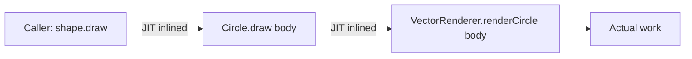
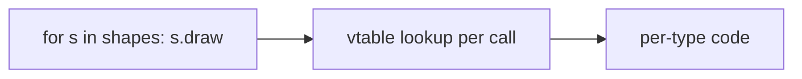

# Bridge — Professional Level

> **Source:** [refactoring.guru/design-patterns/bridge](https://refactoring.guru/design-patterns/bridge)
> **Prerequisite:** [Senior](senior.md)

---

## Table of Contents

1. [Introduction](#introduction)
2. [Memory Layout of a Bridge](#memory-layout-of-a-bridge)
3. [JVM: Two-Hop Dispatch and Inlining](#jvm-two-hop-dispatch-and-inlining)
4. [JVM: Polymorphic Inline Caches and Megamorphism](#jvm-polymorphic-inline-caches-and-megamorphism)
5. [Go: Interface Field + Indirect Call](#go-interface-field--indirect-call)
6. [CPython: Attribute Lookup Through the Bridge](#cpython-attribute-lookup-through-the-bridge)
7. [GC and Object Lifetime](#gc-and-object-lifetime)
8. [Cache-line Behavior Across the Bridge](#cache-line-behavior-across-the-bridge)
9. [Microbenchmark Anatomy](#microbenchmark-anatomy)
10. [Cross-language Comparison](#cross-language-comparison)
11. [Bridge in Distributed Systems](#bridge-in-distributed-systems)
12. [Diagrams](#diagrams)
13. [Related Topics](#related-topics)

---

## Introduction

Bridge is "Adapter, but on purpose, with a hierarchy on each side." Its runtime cost is therefore similar — one extra field load and one virtual dispatch per call — but it shows up in **two** places:

1. The dispatch from the abstraction (caller) to the abstraction subclass.
2. The dispatch from the abstraction to the implementor.

Two hops. This document examines what each hop costs, when both can be erased, and what to do when they can't be.

---

## Memory Layout of a Bridge

A typical Bridge instance has:
- The abstraction's own fields.
- A reference to the implementor (the bridge link).

```java
public final class Circle extends Shape {
    private double radius;            // 8 bytes
    // inherited from Shape: protected final Renderer renderer;  // 4 bytes (compressed oop)
}
```

JVM (compressed OOPs):
```
+0   header (12)
+12  renderer (4)
+16  radius (8)
+24
```

Per-instance: 24 bytes. The bridge link adds one reference (4 or 8 bytes depending on heap size). On 64-bit Go with two pointer fields, ~16 bytes — no header. On CPython, ~232 bytes — every object pays the `PyObject` header + dict.

Practically: in any realistic system, a Bridge object is "tens of bytes." Negligible compared to user data and I/O buffers.

---

## JVM: Two-Hop Dispatch and Inlining

When the client calls:

```java
shape.draw();
```

the JVM emits `invokevirtual` (or `invokeinterface`). Two hops potentially happen:

1. **Hop 1:** virtual dispatch from `Shape` to `Circle.draw()`.
2. **Hop 2 (inside `Circle.draw()`):** interface dispatch through `renderer.renderCircle(radius)`.

Both hops are subject to inline caching. After warmup at a monomorphic site:
- Hop 1 → JIT inlines `Circle.draw()` body.
- Hop 2 → if only one renderer was seen, JIT inlines `renderer.renderCircle()`.

Final assembly: no virtual dispatch at all. The bridge becomes a direct call sequence.

This is why JVM benchmarks of Bridge usually show **zero overhead**: HotSpot erases both hops.

### What disrupts inlining

- **Multiple shape types AND multiple renderer types at the same site.** Polymorphism on both axes simultaneously can degrade caches.
- **Shared cold paths.** If `Shape` is rarely called, the JIT may never specialize.
- **Reflection-heavy code.** `setAccessible` and friends often defeat optimization.

### Mitigations

- Mark `Shape` subclasses `final` if subclassing isn't needed — encourages CHA-based devirtualization.
- Mark concrete renderers `final` similarly.
- Keep call sites focused: a `for (var s : circles)` loop with one renderer type is monomorphic and JITs perfectly.

---

## JVM: Polymorphic Inline Caches and Megamorphism

HotSpot's **PIC** (polymorphic inline cache) handles 1-2 receiver types per call site cheaply. Past 2-3 types, it goes **megamorphic** — every call hits the full vtable. With Bridge, the danger is **double polymorphism**:

```java
for (Shape s : mixedShapes) s.draw();   // polymorphism on Shape
// inside draw(), polymorphism on Renderer
```

If `mixedShapes` has 5 shape types and the per-shape renderer also varies, both call sites can degrade. Mitigations:

- **Group by type.** `partition(shapes).forEach(group -> group.forEach(s -> s.draw()));` — each group is monomorphic at the call site.
- **Specialize.** Generate per-type loops for hot paths.
- **Profile-guided design.** If benchmarks show a hot megamorphic site, sometimes the right answer is to denormalize the bridge and inline-specialize a few combinations.

---

## Go: Interface Field + Indirect Call

Bridge in Go: an `iface` field plus a method call. Each call:

1. Load the iface header (`{itab, data}`) from the struct.
2. Load the function pointer from the itab's method table.
3. Indirect call.

Cost ≈ 3-4 ns per call. The compiler does **not** inline interface calls — Bridge in Go is a non-trivial dispatch in tight loops, but a non-event in business code.

### Allocations

```go
var s Shape = &Circle{renderer: &VectorRenderer{}, radius: 5}
```

This is a heap-allocated `Circle`. The `renderer` field is itself a heap pointer to a `VectorRenderer`. Two heap objects per Bridge instance, two interface conversions. For long-lived objects (one per shape held by a scene graph), no problem. For per-call allocations in a loop, escape analysis may keep both on the stack — measure with `go build -gcflags='-m'`.

### Pointer receivers

Same trap as Adapter: use pointer receivers on implementors that go through interfaces, otherwise interface conversion allocates a heap copy.

---

## CPython: Attribute Lookup Through the Bridge

For `circle.draw()`:

1. `LOAD_ATTR draw` on `circle` — type lookup, MRO search, ~50-150 ns.
2. Inside `draw()`: `LOAD_ATTR _renderer` — instance dict lookup, ~50 ns.
3. `LOAD_METHOD render_circle` on `_renderer` — type lookup, ~50 ns.
4. Method call.

Total: 150-300 ns. Direct call to renderer would skip step 1; direct call to a single class skips all bridges.

CPython 3.11+ adaptive interpreter specializes hot attribute access — drops to ~50-80 ns per attribute. Still 2-3× direct.

For I/O-bound or business-logic Python code, this is invisible. For numeric inner loops, it's catastrophic — but that's true of *any* OO Python; rewrite the loop in NumPy/Numba.

---

## GC and Object Lifetime

### Java

Bridge instances are usually long-lived (held by services, scene graphs, document trees). They survive minor GC into the old gen. The implementor reference keeps the implementor alive — be careful with implementor caches that should be GC'able.

### Go

Bridge structs follow normal lifetime. Be wary of pinning a small implementor in a long-lived abstraction when the implementor holds heavy resources. `runtime.SetFinalizer` is rarely the right answer; explicit `Close()` / `Cancel()` on the abstraction is.

### Python

Reference-counted. A `Shape` holding a `Renderer` keeps it alive deterministically. Cycles (renderer back-refs to shape) survive ref-counting; the cycle collector deals with them but adds latency variance.

---

## Cache-line Behavior Across the Bridge

When iterating an array of bridges (e.g., 10,000 sprites with renderers), the cache pattern is:

1. Fetch sprite (cache line).
2. Indirect through `renderer` field — fetch renderer (cache line, possibly elsewhere).
3. Renderer dispatches to vtable — fetch vtable (cache line).
4. Render method runs — fetches whatever data it needs.

That's three potential cache misses per sprite if the data is scattered.

**Mitigations:**
- Allocate all sprites contiguously (object pool, arena).
- Allocate all renderers contiguously.
- For very hot paths, use **data-oriented design**: separate the abstraction's data into struct-of-arrays, dispatch once per batch, not per item.

This is rarely the bottleneck outside game engines and HFT.

---

## Microbenchmark Anatomy

A correct microbenchmark for Bridge:

### Java (JMH)

```java
@State(Scope.Benchmark)
public class BridgeBench {
    Shape circle = new Circle(new VectorRenderer(), 5);

    @Benchmark public double monomorphic(Blackhole bh) {
        circle.draw();           // one shape type, one renderer type
        return 0;
    }

    // Compare with megamorphic:
    Shape[] mixed = new Shape[]{
        new Circle(new VectorRenderer(), 1),
        new Square(new RasterRenderer(), 2),
        new Triangle(new SvgRenderer(), 3),
    };

    @Benchmark public void mega(Blackhole bh) {
        for (Shape s : mixed) s.draw();
    }
}
```

Expected: monomorphic ≈ 1-2 ns/call (inlined). Mega: 5-10 ns/call (vtable lookup).

### Go (`testing.B`)

```go
func BenchmarkBridge(b *testing.B) {
    s := Shape(&Circle{renderer: &VectorRenderer{}, radius: 5})
    b.ResetTimer()
    for i := 0; i < b.N; i++ { s.Draw() }
}
```

Expected: ~3-4 ns/call.

### Python (`timeit`)

```python
import timeit
print(timeit.timeit("c.draw()", setup="from mod import c", number=10_000_000))
```

Expected: ~150 ns/call (post-3.11 specialization).

### Pitfalls

- **Dead-code elimination.** Use `Blackhole` (Java) or assign to a sink variable.
- **Single-receiver bias.** Real code has variety; benchmark both monomorphic and mixed cases.
- **Cold path.** Include warmup iterations.
- **Compiler hoisting.** A loop calling `c.draw()` with no side effect may be optimized away. Make `draw()` write to a counter or visible state.

---

## Cross-language Comparison

| Concern | Java (HotSpot) | Go | Python (3.11+) |
|---|---|---|---|
| **Per-hop cost (warm)** | ~0–1 ns (JIT inlines) | ~3 ns | ~50-80 ns |
| **Inlining through Bridge** | Yes (CHA + IC) | No | No (attribute caching only) |
| **Megamorphism penalty** | Real (5-10× slower) | Mild | None (always lookup) |
| **Allocation per Bridge** | One object + ref | One struct + ref | Heavy (instance dict) |
| **Stack alloc possible** | Via escape analysis | Via escape analysis | No |
| **Boxing concern** | Real for primitives | None | Pervasive |

---

## Bridge in Distributed Systems

When the implementor is across the network (e.g., a `PaymentGateway` calling a remote service):

### 1. Network dwarfs dispatch

The 3 ns of bridge dispatch is rounding error compared to the 50 ms RTT. Optimize at the call shape (batching, caching), not the bridge.

### 2. Remote implementors are partitioned

Different shards / regions of the implementor may live in different data centers. The abstraction shouldn't know — but routing logic must live somewhere (often a Strategy on top of the implementor).

### 3. Failure modes proliferate

A local implementor either works or throws. A remote implementor can hang, time out, return stale data, or partially fail. The bridge interface must specify the failure contract — preferably with explicit error types, not just `Exception`.

### 4. Tracing across the bridge

Each bridge hop should produce a span tag. Distributed tracing makes Bridge legible: "request → use case → port → adapter → vendor."

### 5. Observability

Latency, error rate, and saturation per bridge edge. Different implementors have different SLOs; alert per implementor, not just on the abstraction.

---

## Diagrams

### Two-hop dispatch (Java warm path)



### Megamorphic site



### Cache pattern (array of bridges)

```
[sprite0]→[renderer0 ptr]    [renderer0 vtable]    [render code 0]
[sprite1]→[renderer1 ptr]    [renderer1 vtable]    [render code 1]
[sprite2]→[renderer0 ptr]    [renderer0 vtable]    (hot in cache)
...
```

Three potential misses per sprite if memory is scattered.

---

## Related Topics

- **JVM internals:** PIC, CHA, escape analysis (see Adapter — Professional for shared deep-dive).
- **Go internals:** itab caching, indirect call cost (Russ Cox, "Go Data Structures: Interfaces").
- **CPython internals:** PEP 659 specialization.
- **Profiling:** flame graphs over Bridge-heavy code; group by abstraction-implementor pair.
- **Benchmarking:** JMH, `testing.B`, pytest-benchmark.
- **Next:** [Interview](interview.md), [Tasks](tasks.md), [Find the Bug](find-bug.md), [Optimize](optimize.md).

---

[← Back to Bridge folder](.) · [↑ Structural Patterns](../README.md) · [↑↑ Roadmap Home](../../../README.md)

**Next:** [Bridge — Interview Preparation](interview.md)
